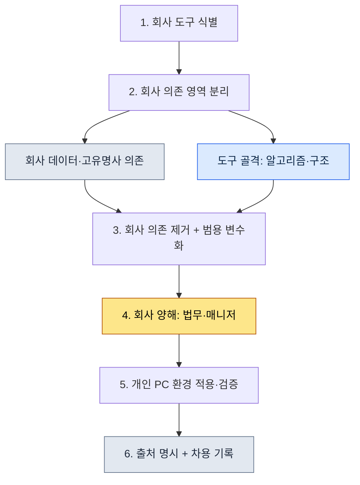

# 부록 B. 도구 차용 절차 (회사에서 개인으로 범용화하기)

> 이 부록은 저자가 회사 프로젝트 A에서 만들고 운영하던 도구·스킬을 개인 PC와 일반적인 작업으로 가져와 다시 쓴 절차를 정리한 것입니다. 핵심 질문은 하나입니다. "회사의 지식 자산을 침범하지 않으면서, 거기서 배운 도구의 골격만 합법적으로 가져오려면 어떻게 해야 하는가." 이 부록은 그 경계를 어떻게 그었는지, 무엇을 가져오고 무엇을 두고 왔는지, 그리고 그 결정을 어떻게 기록으로 남겼는지를 보여 줍니다.

이 부록을 쓰는 법은 이렇습니다. 먼저 B.1의 다섯 원칙을 자신의 상황에 비춰 읽으시고, B.3의 절차를 그대로 한 번 따라가 보십시오. 그다음 B.4의 기록 양식을 복사해 자신이 가져오려는 도구에 맞게 채우시면 됩니다. 회사 자산을 다루는 일인 만큼 "빠르게"보다 "남길 수 있게"가 우선이며, 이 부록 전체가 그 관점으로 짜여 있다.

---

## B.1 차용의 5원칙

도구를 가져오기 전에 합의해 둔 다섯 가지 원칙이다. 이 다섯은 순서가 아니라 동시에 지켜야 하는 조건으로, 하나라도 무너지면 차용 자체를 보류한다. 앞의 셋은 "무엇을 가져오는가"에 대한 기술적 경계이고, 뒤의 둘은 "어떻게 떳떳하게 가져오는가"에 대한 절차적 경계다.

| 원칙 | 설명 |
|---|---|
| 1. 회사 IP 비포함 | 회사명·실명·고유명사를 제거한다 |
| 2. 도구 골격만 가져옴 | 회사 도메인 데이터는 차단한다 |
| 3. 범용화 재구성 | 일반 사용 케이스로 다시 만든다 |
| 4. 인용·출처 명확 | 회사에서 차용한 도구임을 명시한다 |
| 5. 법무·인사 합의 | 회사의 양해 절차를 거친다 |

가장 자주 흔들리는 줄은 2번이다. 알고리즘과 구조(골격)는 가져와도 되지만, 그 골격이 전제하던 회사 데이터 형식까지 딸려 오면 그 순간 IP를 가져온 셈이 된다. 골격과 데이터를 떼어 내는 작업이 차용의 본체다.

---

## B.2 차용한 도구·스킬 6종

원칙에 따라 실제로 개인 PC로 가져온 도구는 여섯 가지다(2026년 5월 기준). 모두 데이터를 다루는 도구라는 공통점이 있는데, 이는 우연이 아니다. 데이터 처리 도구는 골격(파싱·변환·시각화 로직)과 도메인(회사 시트의 구체적 형식)을 떼어 내기가 상대적으로 쉽기 때문이다.

| 도구 | 회사 원본 | 개인 범용판 |
|---|---|---|
| excel-reader | xlsm 시트·VBA 추출 | 범용 Excel 처리 |
| relation-map-gen | FK 관계 HTML | 범용 데이터 관계도 |
| schema-doc | 시트에서 마크다운 스키마 생성 | 범용 스키마 문서화 |
| table-creator | 데이터 테이블 양산 | 범용 테이블 생성 |
| gdd-gen | GDD 자동 생성 | 범용 문서 생성 |
| gdd-export | 마크다운에서 다중 시트 xlsx로 변환 | 범용 xlsx 변환 |

표의 가운데와 오른쪽 칸을 비교해 보면 범용화가 무슨 뜻인지 드러난다. 왼쪽은 "회사 시트", "GDD"처럼 도메인이 들어간 이름이고, 오른쪽은 "범용 Excel", "범용 문서"처럼 도메인을 걷어 낸 이름이다. 이름에서 회사가 사라지는 것이 범용화의 첫 신호다.

---

## B.3 차용 절차

원칙(B.1)을 실제 손동작으로 옮기면 아래 여섯 단계가 된다. 가장 중요한 분기점은 2단계와 4단계다. 2단계에서 골격과 도메인을 깨끗이 갈라 두지 못하면 뒤의 모든 단계가 오염되고, 4단계의 회사 양해를 건너뛰면 아무리 잘 만들어도 쓸 수 없는 도구가 된다.



여섯 단계 가운데 시간이 가장 오래 걸리는 칸은 코드 작업(2·3단계)이 아니라 4단계, 회사 합의와 법무 통과다. 기술이 아니라 신뢰가 가장 큰 관문이라는 뜻이며, 그래서 차용은 늘 합의를 먼저 잡고 코드를 나중에 다듬는 순서로 진행한다.

---

## B.4 차용 기록

차용한 도구는 반드시 기록을 함께 남긴다. 나중에 "이 도구가 어디서 왔고 무엇을 제거했으며 누구의 양해를 받았는가"를 묻는 순간이 올 수 있기 때문이다. 아래는 excel-reader를 예로 든 기록 양식으로, 여러분은 이 틀을 그대로 복사해 자신의 도구에 맞게 채우시면 됩니다.

```yaml
---
tool: excel-reader (개인 범용판)
original_source: 회사 프로젝트 A
adopted: 2026-05
permission: 회사 매니저 + 법무 통과
modifications:
  - 회사 시트 형식 의존 제거
  - 회사 도메인 함수(xlsm VBA) 제거
  - 범용 csv/xlsx 처리로 일반화
  - 회사명·실명 참조 전면 제거
usage_in_book: 본 책의 도구 사례 인용 (Part 1·5·6·8 등)
---
```

양식의 날짜 칸(`adopted`)은 `2026-05`처럼 확정된 연-월로 적습니다. "2026년 5월쯤" 같은 자유 표기는 나중에 채울 빈칸처럼 보이니, 차용을 확정한 시점을 그 자리에서 못 박아 둡니다.

이 기록에서 가장 값진 줄은 `permission`과 `modifications`다. 앞줄은 차용이 정당했음을, 뒷줄은 무엇을 떼어 냈는지를 증명한다. 이 두 줄이 있으면, 훗날 의문이 제기되어도 추적할 근거가 남는다.

---

## B.5 차용하지 않은 도구

무엇을 가져왔는지만큼 무엇을 두고 왔는지도 중요하다. 회사 도구 가운데 의도적으로 차용하지 않은 것들과 그 이유를 적었다. 두고 온 도구들의 공통점은 회사의 핵심 IP이거나 회사 조직 구조에 깊이 묶여 있어, 골격과 도메인을 떼어 낼 수 없다는 점이다.

| 도구 | 미차용 사유 |
|---|---|
| 회사 전투 시스템 도구 | 회사 핵심 IP, 회사 독점 |
| 회사 내러티브 문서 도구 | 회사 세계관에 의존 |
| 회사 전투 TF 도구 | 회사 조직 구조에 의존 |
| 회사 인사·재무 도구 | 외부 환경에 맞지 않음 |

B.2의 가져온 도구들이 모두 "데이터 처리"였던 것과 정확히 대비된다. 가져온 것은 도메인과 분리되는 도구였고, 두고 온 것은 도메인과 한 몸인 도구였다. 분리 가능성이 차용 가능성을 가른다.

---

## B.6 독자 참고 — 차용 전 자가 점검표

마지막으로, 도구를 가져오기 전에 스스로 통과시켜야 할 다섯 항목이다. 이 표는 합격/불합격을 가리는 체크리스트로, 다섯 항목을 모두 통과할 때만 차용하고 한 항목이라도 걸리면 보류한다. "대체로 괜찮다"는 없다. 회사 자산을 다루는 일에는 부분 통과가 통하지 않기 때문이다.

| 점검 항목 | 통과 기준 |
|---|---|
| 회사 양해를 얻었는가 | 매니저·법무 명시적 동의 |
| 법무 검토를 통과했는가 | 서면 또는 기록된 확인 |
| 회사 IP를 완전히 제거했는가 | grep watchlist 검사 0건 |
| 범용성을 검증했는가 | 다른 환경에서도 작동 확인 |
| 사고 시 대응 절차가 있는가 | 추적·회수 경로 정의 |

다섯 항목을 다섯 칸의 통과로 읽지 마시고, 다섯 개의 잠금장치로 읽어 주시기 바랍니다. 회사에서 배운 것을 개인의 자산으로 정당하게 가져오는 일은 분명 가능하지만, 그 정당함은 이 다섯 잠금을 모두 채웠을 때만 성립한다.
