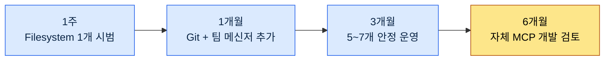

# 부록 E. MCP 서버 카탈로그 (게임 기획 관점)

MCP(Model Context Protocol)는 LLM이 외부 도구·데이터에 표준화된 방식으로 연결되는 통로다. 본문 20부에서 프로젝트 관리 MCP를 다뤘지만, 게임 기획 워크플로에 끌어 쓸 수 있는 MCP 서버는 그보다 훨씬 많다. 이 부록은 그 후보들을 한눈에 보도록 모으고, 어떤 순서로 도입하면 좋은지 우선순위를 붙인 카탈로그다.

카탈로그의 목적은 "이걸 다 깔라"가 아니라 "필요할 때 어디서 고를지 안다"입니다. 한 번에 여러 MCP를 붙이면 무엇이 문제를 일으키는지 분간이 안 됩니다. E.4의 도입 사이클을 따라 하나씩 늘려 가세요.

쓰는 방법은 이렇다. 처음에는 E.2.1의 P0 목록만 본다. 기본기가 잡히면 E.2.2(P1)로 넘어가고, 팀의 특수한 필요가 생기면 E.2.3(P2)이나 E.3(자체 개발)을 검토한다. 비용이 걱정되면 E.5를, 장애에 대비하려면 E.6을 먼저 본다.

---

## E.1 MCP의 4가지 활용 영역

MCP 서버는 연결 대상에 따라 크게 네 갈래로 나뉜다. 게임 기획자가 매일 오가는 도구들이 대부분 이 안에 들어온다.

| 영역 | MCP 서버 |
|---|---|
| 프로젝트 관리 | ClickUp, JIRA, Linear |
| 문서 | Confluence, Notion, Google Drive |
| 협업 | 팀 메신저(Slack·Discord 등) |
| 데이터 | Excel, Google Sheets, DB |

프로젝트 관리는 태스크와 일정, 문서는 기획서와 위키, 협업은 팀 소통, 데이터는 밸런스·아이템 시트로 이어진다. 자신의 팀이 이미 쓰는 도구가 어느 영역에 속하는지 먼저 짚으면 도입 후보가 자연히 좁혀진다.

---

## E.2 추천 MCP 서버 (게임 기획 우선순위)

우선순위는 "없으면 작업이 막히는가"를 기준으로 매겼다. P0는 거의 모든 작업의 토대이고, P1은 있으면 크게 편하며, P2는 팀 상황에 따라 선택한다.

### E.2.1 P0 — 우선 도입

| 서버 | 용도 | 비고 |
|---|---|---|
| Filesystem MCP | 로컬 파일 접근 | 기본 |
| Git MCP | 변경 추적 | 필수 |
| 팀 메신저 MCP | 팀 소통 | 권장 |
| 협업툴 MCP (ClickUp·JIRA 등) | 태스크 | 회사 도구 |

Filesystem과 Git은 LLM이 자료를 읽고 변경 이력을 따라가는 토대라 가장 먼저 붙인다. 팀 메신저 MCP는 팀 맥락을 끌어오고, 태스크 도구는 회사가 이미 쓰는 것(ClickUp이든 JIRA든)을 그대로 연결한다.

### E.2.2 P1 — 추가 도입

| 서버 | 용도 |
|---|---|
| 위키 MCP (Confluence·Notion 등) | 위키 |
| Google Drive MCP | 외부 공유 자료 |
| Excel MCP | 시트 직접 조회 |
| Mermaid MCP | 다이어그램 렌더 |

P0가 안정되면 문서·데이터 쪽을 넓힌다. 특히 Excel MCP는 밸런스 시트를 LLM이 직접 조회하게 해주어 게임 기획에서 활용도가 높다. Mermaid MCP는 설계 도식을 그 자리에서 렌더해 문서화 흐름을 끊지 않는다.

### E.2.3 P2 — 선택

| 서버 | 용도 |
|---|---|
| Discord MCP | 사용자 커뮤니티 |
| GitHub MCP | 외부 협업 |
| Linear MCP | 대안 태스크 |
| Notion MCP | 대안 위키 |

P2는 대안이거나 특정 상황 전용이다. 사용자 커뮤니티를 운영하면 Discord를, 외부 협업이 잦으면 GitHub를 붙인다. Linear·Notion은 이미 도입한 도구의 대체재이므로, 중복으로 깔 필요는 없다.

---

## E.3 게임 특화 MCP (저자 자체 개발)

상용 MCP로 채워지지 않는 자리는 직접 만든다. 아래는 저자가 게임 기획 워크플로에 맞춰 자체 개발한 MCP다. 모두 본문에서 다룬 시스템(atom·결정 카드·회의록)을 LLM에서 곧장 조회하기 위한 것이다.

| 서버 | 용도 |
|---|---|
| Atom MCP | atom 검색·조회 |
| Decision Card MCP | 결정 카드 조회·생성 |
| KPI Dashboard MCP | 대시보드 데이터 |
| Meeting Notes MCP | 회의록 검색 |

이 네 개는 상용 도구에 없는 사내 자산(지식 atom, 결정 이력, 회의록)을 다룬다. 자체 개발은 부담이 크므로, E.4 사이클의 마지막 단계로 미루고 상용 MCP로 메울 수 없는 것이 명확해졌을 때 착수하는 편이 좋습니다.

---

## E.4 MCP 도입 사이클

MCP는 한꺼번에 붙이면 문제 원인을 가리기 어렵다. 아래 사이클은 "하나씩, 안정된 다음에 다음"이라는 원칙을 시간 축으로 풀어낸 것이다.

핵심 규칙은 단 하나, 한 번에 5개를 동시에 도입하지 않는 것입니다. 새 MCP를 붙일 때마다 며칠은 그 하나가 안정적으로 도는지 지켜본 뒤 다음으로 넘어가세요.

---

## E.5 MCP 운영 비용

| 서버 | 비용 |
|---|---|
| 외부 MCP (오픈소스) | 인프라만 |
| 자체 호스팅 | 인프라 + 운영 |
| 상용 MCP | 월 구독 |

비용 구조는 셋으로 나뉜다. 오픈소스 MCP는 돌릴 인프라 비용만 들고, 자체 호스팅은 거기에 운영 인력 비용이 붙으며, 상용 MCP는 구독료가 든다. 8~10개를 운영할 때 월 비용은 대략 $50~200 수준으로 추정되지만, 이는 구성에 따라 크게 달라지므로 방향만 참고한다.

---

## E.6 사고 대응

| 사고 | 대응 |
|---|---|
| MCP 서버 장애 | 핵심 서버는 fallback 운영 |
| 권한 사고 (잘못된 데이터 수정) | read-only 우선 |
| 데이터 유출 | 민감 데이터는 자체 호스팅 |
| 비용 폭증 | cap + 모니터링 |

MCP는 외부 도구를 LLM에 직접 연결하므로, 잘못된 쓰기 한 번이 실제 데이터를 망칠 수 있다. 그래서 기본은 read-only로 두고, 쓰기 권한은 꼭 필요한 서버에만 연다. 핵심 서버는 장애에 대비해 fallback을 마련하고, 민감 데이터를 다루는 MCP는 외부 대신 자체 호스팅으로 돌린다. 비용은 상한(cap)과 모니터링으로 함께 막는다.

---

## E.7 도입 전 자가 점검표

앞 절들이 "무엇을, 어떤 순서로, 얼마에" 붙이는지를 다뤘다면, 이 표는 한 개의 MCP를 실제로 붙이기 직전에 스스로 통과시켜야 할 항목을 모은 것이다. 카탈로그를 처음부터 다시 읽는 대신, 새 MCP를 추가할 때마다 이 다섯 줄만 다시 확인하면 된다. 다섯 항목은 각각 앞 절의 핵심 규칙을 한 줄로 압축한 것이다.

| 점검 항목 | 통과 기준 | 근거 절 |
|---|---|---|
| 어느 영역인가 | 프로젝트 관리·문서·협업·데이터 중 어디에 속하는지 분명함 | E.1 |
| 지금 필요한 우선순위인가 | P0가 안정된 뒤에야 P1, 그다음 P2 순서를 지킴 | E.2 |
| 하나씩 붙이는가 | 한 번에 여러 개를 동시에 도입하지 않음 | E.4 |
| 권한이 최소인가 | 기본은 read-only, 쓰기는 꼭 필요한 서버에만 | E.6 |
| 비용 한계가 있는가 | 상한(cap)과 모니터링을 함께 걸어 둠 | E.5 |

다섯 항목 가운데 가장 자주 건너뛰는 칸은 "하나씩 붙이는가"입니다. 한 번에 여러 MCP를 올리면 문제가 생겼을 때 어느 서버 탓인지 분간이 안 되기 때문입니다. 다섯 줄을 모두 통과할 때만 그 MCP를 붙이고, 한 줄이라도 걸리면 그 서버는 다음 사이클로 미룹니다.
