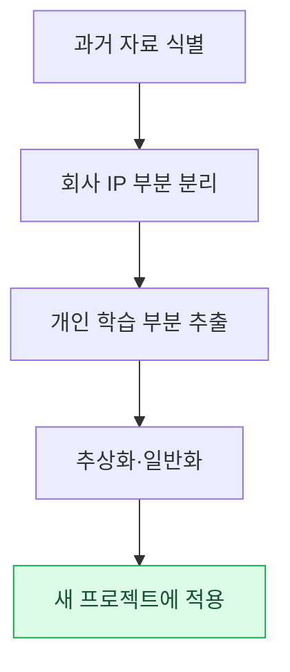

# 부록 H. 과거 작업 자료 재활용

오래 일한 기획자에게는 수십 년치 작업 자료가 쌓인다. 회의록, 결정 기록, 회고, 학습 노트, 실패에서 얻은 교훈까지. 이 부록은 그 자료를 새 프로젝트에 어떻게 다시 쓰는가를 다룬다. 핵심 긴장은 하나다. 자료의 상당 부분은 회사 IP라서 함부로 옮길 수 없는데, 동시에 그 안에는 어디서든 통하는 개인의 학습이 섞여 있다. 이 둘을 가르는 것이 재활용의 출발점이다.

이 부록을 쓰는 방법은 자신의 위치에 따라 다릅니다. 오래된 자료를 새 프로젝트에 끌어 쓰려는 상황이라면 H.2(분리 원칙)와 H.3(절차)을 순서대로 따라가세요. 막상 옮기다 사고가 날까 걱정된다면 H.5(다섯 함정)를 먼저 읽어 미리 피하세요. 아직 경력 초반이라 쌓을 자료가 많지 않다면 H.6을 보고 지금부터 무엇을 어떻게 남길지 정하세요.

여기서 다루는 원칙은 거창한 자산 관리론이 아니다. "구체적인 것은 회사에 두고, 추상적인 패턴만 가져온다"는 한 문장으로 압축된다. 나머지는 그 문장을 실제 상황에 적용하는 방법이다.

---

## H.1 과거 자료의 가치

먼저 어떤 자료가 쌓이는지, 각각의 보관 권한이 어떻게 다른지 본다. 보관 권한이 다르면 재활용 가능 범위도 달라지기 때문이다.

| 자료 | 보관 |
|---|---|
| 회의록 (회사 자료) | 회사 권한 내 |
| 결정 카드 (회사 자료) | 회사 권한 내 |
| 분기 회고 (개인+회사) | 개인 사본 가능 |
| 학습 노트 (개인) | 개인 영구 |
| 사고 기록 (개인 학습) | 개인 영구 |

회의록과 결정 카드는 회사 권한 안에 머문다. 회고는 개인 사본을 둘 수 있고, 학습 노트와 사고 기록은 온전히 개인 자산이다. 오래 누적된 자료는 그 자체로 큰 학습 자산이지만, 회사 IP 영역과 개인 영역의 경계를 흐리면 안 된다. 경계를 분명히 할수록 마음 편히 재활용할 수 있다.

---

## H.2 회사 IP vs 개인 학습의 분리

분리의 기준은 "구체적인가, 추상적인가"다. 구체적인 결과물은 회사 것이고, 그것을 만든 사고 패턴은 개인 것이다. 같은 작업에서 두 측면이 함께 나온다는 점이 핵심이다.

| 영역 | 회사 IP | 개인 학습 |
|---|---|---|
| 결정 내용 | 회사 | — |
| 결정 패턴 (이런 상황엔 이런 결정 좋음) | — | 개인 |
| 게임 데이터 | 회사 | — |
| 운영 노하우 (룰북·도구 운영) | — | 개인 |
| 코드 | 회사 | — |
| 알고리즘·구조 | — | 개인 |

"어떤 결정을 내렸는가"는 회사 IP이지만, "이런 상황에서는 이런 결정이 잘 통하더라"는 패턴은 개인 학습이다. 게임 데이터 값 자체는 회사 것이지만, 그 데이터를 운영한 노하우는 개인 것이다. 구체 자료는 회사에 두고 추상 패턴만 가져온다 — 이것이 분리의 원칙이다.

---

## H.3 재활용 절차

분리 원칙을 실제 작업으로 옮기면 다음 다섯 단계가 된다. 자료를 식별하고, IP를 떼어 내고, 학습을 추출하고, 일반화한 뒤, 새 프로젝트에 적용한다.

이 절차는 반드시 회사 권한 확인과 법무 검토를 거친 뒤 진행합니다. 추상화가 충분하더라도, 출발점이 회사 자료였다면 절차상 확인을 받아 두는 편이 안전합니다.

---

## H.4 재활용 사례 — 본 책

가장 가까운 재활용 사례는 이 책 자체다. 본문 곳곳은 저자의 과거 작업에서 출발했고, 위의 절차를 거쳐 일반화·익명화한 결과다.

| 영역 | 출처 | 재활용 |
|---|---|---|
| Layer 통합 설계 (6부) | 저자의 다년 운영 | 개인 학습 → 일반화 |
| 회의록 시스템 (17부) | 저자의 프로젝트 A 운영 | 회사 패턴 → 익명화 |
| 운영 노하우 (24부) | 다년 누적 | 개인 학습 → 일반화 |
| 부록 A 인벤토리 | 회사 프로젝트 A | 익명화 + 일부 가공 |

Layer 설계와 운영 노하우는 개인 학습을 일반화했고, 회의록 시스템과 부록 A는 회사 패턴을 익명화했다. 모든 항목이 회사 양해를 통과했고 회사 IP는 빠짐없이 익명화했다. 책이라는 결과물 자체가 H.3 절차의 실증인 셈이다.

---

## H.5 재활용의 5가지 함정

재활용은 잘하면 자산이지만 잘못하면 사고다. 아래 다섯 함정은 실제로 자주 밟는 지점이고, 각각에 처방을 붙였다.

### H.5.1 함정 1 — 회사 권한 미통과

회사 양해 없이 자료를 쓰면 분쟁으로 번진다. 처방은 단순하다. 쓰기 전에 회사 양해를 먼저 받는다.

### H.5.2 함정 2 — 익명화 누락

회사명이나 실명이 한 군데라도 남으면 IP 사고가 된다. 처방은 자동 grep 검사다. 회사명·실명·경로를 watchlist로 만들어 기계가 빠짐없이 훑게 한다.

### H.5.3 함정 3 — 과거 그대로 적용

오래전 노하우를 손대지 않고 그대로 쓰면 지금 시점에 안 맞는다. 처방은 시대에 맞춰 재구성하는 것이다. 원리는 살리되 도구와 맥락은 현재로 갱신한다.

### H.5.4 함정 4 — 추상화 부족

구체 사례만 옮기면 다른 환경에 적용하기 어렵다. 처방은 추상 패턴과 구체 예시를 함께 두는 것이다. 패턴으로 일반성을, 예시로 이해를 잡는다.

### H.5.5 함정 5 — 학습 자체 안 함

자료가 아무리 많아도 다시 들춰 보지 않으면 없는 것과 같다. 처방은 정기 학습 사이클이다. 일·주·월 회고처럼 자료를 다시 만나는 주기를 만든다.

---

## H.6 독자 참고 — 자기 자료 재활용

이 원칙은 저자만의 것이 아니다. 독자도 자기 경력의 자료를 같은 방식으로 재활용할 수 있다. 아래는 지금부터 시작할 수 있는 권장 습관이다.

| 권장 | 이유 |
|---|---|
| 분기마다 자기 결정 회고 | 패턴 발견 |
| 학습 노트 별도 보관 | 회사 IP와 분리 |
| 추상 패턴 명시 | 미래 재활용 가능 |
| 멘토링·외부 발표 | 패턴 공유 |
| 책·블로그 (회사 양해 후) | 학습 영원 |

분기마다 자기 결정을 회고하면 패턴이 보이고, 학습 노트를 회사 자료와 분리해 두면 나중에 마음 편히 꺼내 쓸 수 있습니다. 그 패턴을 멘토링·발표·집필로 내보내면 학습은 한 번 쓰고 사라지는 대신 오래 남습니다. 결국 자기 학습이 곧 자기 자산입니다.
