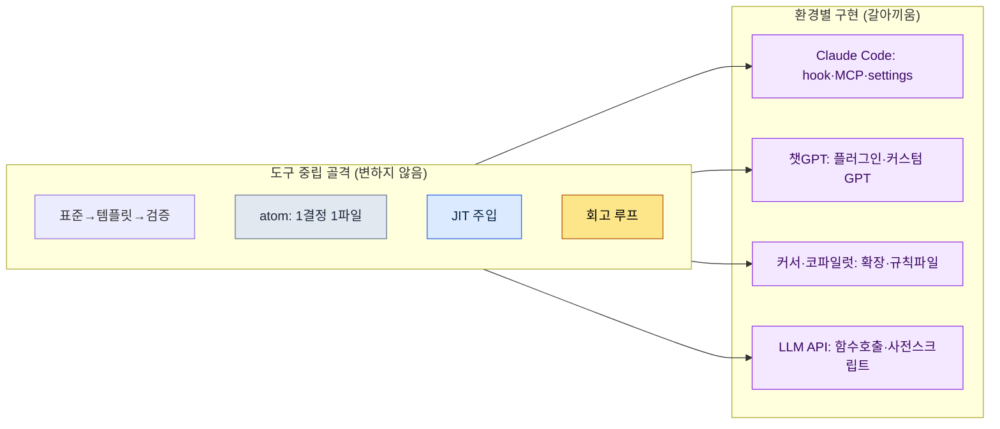

# 부록 K. 다른 LLM·하네스로 이식하기

이 책의 사례와 도구는 거의 전부 한 가지 환경, 즉 Claude Code를 전제로 씌어 있습니다. 그래서 결재 자리나 외부 검토에서 거의 빠지지 않고 나오는 지적이 하나 있습니다. "이거 특정 회사 도구에 묶이는 것 아닌가." 기획 책임자는 한 벤더에 의존하는 의사결정을 결재하기 부담스러워하고, 회의론자는 도구가 바뀌면 이 책의 방법이 통째로 무너진다고 의심하며, 해외 판권을 검토하는 쪽은 자국에서 다른 도구가 표준일 때 이 책이 쓸모가 있는지 묻습니다. 셋의 표현은 다르지만 본질은 같습니다. 벤더 락인(vendor lock-in), 즉 한 도구에 갇히는 것에 대한 불신입니다.

이 부록의 목적은 그 불신에 답하는 것입니다. 결론부터 말하면, 이 책이 권하는 작업의 골격은 도구 중립입니다. 특정 모델 이름에도, 특정 명령줄 도구에도 묶이지 않습니다. Claude Code는 그 골격을 가장 매끄럽게 구현해 주는 그릇이었을 뿐이고, 같은 골격을 다른 그릇에 옮겨 담을 수 있습니다. 이 부록은 (1) 무엇이 도구와 무관한 골격인지 표로 보이고, (2) Claude Code의 각 요소를 다른 환경으로 옮기면 무엇에 대응하는지 짝지어 주며, (3) 모델 세대는 계속 바뀐다는 전제 아래 최신을 확인하는 원칙을 정하고, (4) 옮길 때 무엇을 잃고 무엇을 지키는지를 솔직하게 적습니다.

---

## K.1 도구와 무관한 골격

이 책 전체를 관통하는 작업 방식은 다섯 개의 기둥으로 요약됩니다. 이 다섯은 어느 것도 특정 모델·명령줄 도구의 기능 이름이 아니라, "사람과 인공지능이 함께 일할 때 어떻게 신뢰할 수 있는 결과를 반복해서 뽑아내는가"에 대한 답입니다. 그래서 도구가 바뀌어도 그대로 남습니다.

| 골격 | 무엇인가 | 왜 도구 중립인가 |
|---|---|---|
| 표준 → 템플릿 → 검증 게이트 | 합의된 규칙(표준)을 빈칸 틀(템플릿)로 굳히고, 결과가 규칙을 지켰는지 자동으로 거르는 관문(게이트)을 둔다 | 규칙·틀·검사라는 개념은 어떤 도구에서도 글·스크립트로 표현된다 |
| atom = 1결정 1파일 | 하나의 결정을 하나의 작은 파일에 적어, 필요할 때 꺼내 쓰고 고칠 때 그 한 칸만 고친다 | 결정을 잘게 쪼개 파일로 두는 것은 파일 시스템만 있으면 된다 |
| JIT 주입 | 지금 대화에 꼭 필요한 결정만 그때그때(Just-In-Time) 골라 모델에게 넣어 준다 | "필요한 맥락만 넣는다"는 원칙이며, 넣는 방법은 도구마다 다를 뿐이다 |
| 회고 루프 | 일·주·월 단위로 한 일을 돌아보고, 반복되는 패턴을 다음 작업의 규칙으로 끌어올린다 | 돌아보고 개선하는 절차는 도구가 아니라 습관과 문서로 돌아간다 |
| 도구 차용 경계 | 가져오는 것은 골격(알고리즘·구조)뿐, 도메인 데이터는 두고 온다 (부록 B) | 무엇을 가져오고 무엇을 두는가의 판단은 어느 도구에서도 동일하다 |

이 표의 오른쪽 칸이 핵심입니다. 다섯 골격 모두, 그 정의 안에 특정 제품 이름이 한 번도 등장하지 않습니다. 등장하는 것은 규칙·파일·맥락·습관·경계처럼 어느 작업 환경에나 있는 보편 개념뿐입니다. 그래서 "Claude Code를 못 쓰게 되면 어떡하나"라는 질문은, 실은 "이 다섯 개념을 다른 도구에서 어떻게 구현하나"라는 훨씬 답하기 쉬운 질문으로 바뀝니다. 그 답이 다음 절입니다.

---

## K.2 요소 대응표 (Claude Code → 다른 환경)

Claude Code에는 위 골격을 편하게 구현해 주는 구체적인 장치들이 있습니다. hook(특정 시점에 자동 실행되는 스크립트), MCP(외부 도구·데이터를 모델에 연결하는 규약), settings 파일(권한·환경 설정), 슬래시 명령(자주 쓰는 절차를 한 줄로 부르는 단축 명령), 스킬(재사용 가능한 작업 묶음) 등입니다. 이것들은 Claude Code 고유의 이름이지만, 그 역할은 다른 환경에도 거의 다 대응물이 있습니다. 아래 표가 그 짝입니다.

| Claude Code | 챗GPT(ChatGPT, 웹·앱) | 커서(Cursor) / 코파일럿(Copilot) | 일반 LLM API |
|---|---|---|---|
| hook (시점 자동 실행) | 대화 전후 수동 절차 / 커스텀 GPT 지시문 | 에디터 작업 전후 태스크·pre-commit 훅 | 호출 전후로 끼워 넣는 사전·사후 스크립트 |
| MCP (외부 연결 규약) | 플러그인 / 액션 / 코드 인터프리터 | 확장(extension) / 내장 도구 호출 | 함수 호출(function calling) / 직접 만든 API 래퍼 |
| settings 파일 (권한·환경) | 커스텀 GPT 설정 화면 / 프로젝트 설정 | `.cursor`·워크스페이스 설정 파일 | 코드 안 설정 객체 / `.env`·YAML 설정 파일 |
| 슬래시 명령 (절차 단축) | 저장한 프롬프트 / 커스텀 GPT | 스니펫 / 사용자 정의 명령 | 프롬프트 템플릿 함수 |
| 스킬 (재사용 작업 묶음) | 커스텀 GPT / 프롬프트 모음 | 규칙 파일 + 스크립트 | 모듈화한 프롬프트·코드 함수 |
| CLAUDE.md / 메모리 | 커스텀 지시문 / 메모리 기능 | 프로젝트 규칙 파일(rules) | 시스템 프롬프트 + 외부 메모리 저장소 |
| atom 파일 모음 | (도구 무관) 마크다운 파일 | (도구 무관) 저장소 내 마크다운 | (도구 무관) 파일·DB 레코드 |

표를 보면 한 가지가 분명해집니다. 오른쪽으로 갈수록, 즉 일반 LLM API 쪽으로 갈수록 "자동으로 해 주던 것"이 "직접 만들어 끼워야 하는 것"으로 바뀝니다. Claude Code에서 hook 한 줄로 끝나던 자동 주입이, 일반 API에서는 호출 전에 직접 짠 사전 스크립트가 됩니다. 자동화의 편의는 줄지만, 골격 자체는 그대로 옮겨갑니다. 즉 이식은 "기능을 잃는 일"이 아니라 "편의를 내 손으로 다시 깔아 주는 일"입니다.

이 그림이 부록 전체의 한 장 요약입니다. 위쪽 상자(골격)는 어느 환경으로 화살표가 가도 내용이 바뀌지 않고, 아래쪽 상자(구현)만 환경에 맞춰 갈아 끼워집니다. 결재에서 "벤더 락인"이라는 말이 나오면, 이 그림 한 장을 펴고 "묶이는 것은 아래 칸이지 위 칸이 아니다"라고 답하시면 됩니다.

---

## K.3 모델 이름은 변한다는 전제

이식을 이야기할 때 가장 빨리 낡는 정보가 모델 이름입니다. 이 책을 쓰는 시점의 최신 모델 이름을 본문에 못 박아 두면, 다음 세대가 나오는 순간 그 문장은 틀린 정보가 됩니다. 그래서 이 책은 처음부터 한 가지 원칙을 따릅니다. 특정 모델의 이름·세대 번호에 기대어 설명하지 않고, 모델이 하는 역할(추론·요약·코드 생성 같은 기능)에 기대어 설명한다는 것입니다.

| 변하는 것 (못 박지 말 것) | 변하지 않는 것 (기대도 될 것) |
|---|---|
| 모델 제품명·세대 번호 | "추론을 잘하는 모델", "긴 맥락을 받는 모델" 같은 역할 구분 |
| 컨텍스트 한도의 구체 수치 | "한도가 있으니 꼭 필요한 맥락만 넣는다"는 JIT 원칙 |
| 가격·속도의 구체 수치 | "비싼 작업은 게이트를 통과한 것만 돌린다"는 비용 의식 |
| 특정 기능의 켜고 끄는 방법 | "그 기능이 하는 역할"과 그것을 대체할 골격 |

실무에서 최신 모델·기능을 확인하는 방법도 도구마다 한 줄이면 됩니다. Claude Code에서는 `/model` 명령으로 현재 쓰는 모델과 선택지를 즉시 확인할 수 있고, 챗GPT·커서 같은 도구도 설정 화면이나 모델 선택 드롭다운에서 같은 정보를 보여 줍니다. 그러므로 이 책의 어떤 문장이 모델 이름과 어긋나 보이면, 그 문장이 틀린 것이 아니라 모델이 한 세대 지난 것입니다. 역할만 같으면 방법은 그대로 적용됩니다. 책을 읽다가 모델 이름이 낯설면 본문을 의심하지 마시고, 먼저 `/model` 같은 명령으로 지금 손에 쥔 도구의 최신 상태를 확인하시기를 권합니다.

---

## K.4 이식하면 잃는 것과 지키는 것

도구를 옮기면 분명히 잃는 것이 있습니다. 그 사실을 감추면 오히려 신뢰를 잃으므로, 무엇을 잃는지 먼저 솔직하게 적겠습니다. 다만 잃는 것은 거의 다 "편의"의 영역이고, 지키는 것은 "골격"의 영역입니다. 즉 잃는 것은 다시 깔면 되찾을 수 있는 것이고, 지키는 것은 애초에 도구에 묶여 있지 않던 것입니다.

| 구분 | 항목 | 설명 |
|---|---|---|
| 잃는 것 (편의) | 자동 실행의 매끄러움 | hook처럼 알아서 끼어들던 자동화를 사전·사후 스크립트로 직접 만들어야 한다 |
| 잃는 것 (편의) | 통합된 한 화면 | 명령·도구·파일이 한 흐름에 모여 있던 것을, 여러 도구에 나눠 붙여야 할 수 있다 |
| 잃는 것 (편의) | 즉시 쓰는 스킬·명령 | 슬래시 명령·스킬을 그 도구의 방식으로 다시 등록해야 한다 |
| 지키는 것 (골격) | 표준·템플릿·검증 게이트 | 규칙과 틀과 검사는 글·스크립트라 어디서나 그대로 산다 |
| 지키는 것 (골격) | atom·JIT·회고 루프 | 파일과 습관으로 돌아가므로 도구가 바뀌어도 유지된다 |
| 지키는 것 (골격) | 도구 차용 경계 (부록 B) | 무엇을 가져오고 두는가의 판단 기준은 환경과 무관하다 |

이 표를 한 문장으로 줄이면 이렇습니다. 이식에서 잃는 것은 시간을 들이면 되살릴 수 있는 자동화의 편의이고, 지키는 것은 이 책이 처음부터 도구 바깥에 두려고 애썼던 작업의 골격입니다. 그러니 "벤더 락인 아니냐"는 물음에 대한 가장 정직한 답은 이것입니다. 묶이는 부분이 있지만 그것은 갈아 끼울 수 있는 그릇이고, 진짜 가치인 내용물은 처음부터 어느 그릇에도 묶여 있지 않습니다. 이 부록 한 편이 결재 자리에서 그 답을 대신해 주기를 바랍니다.
