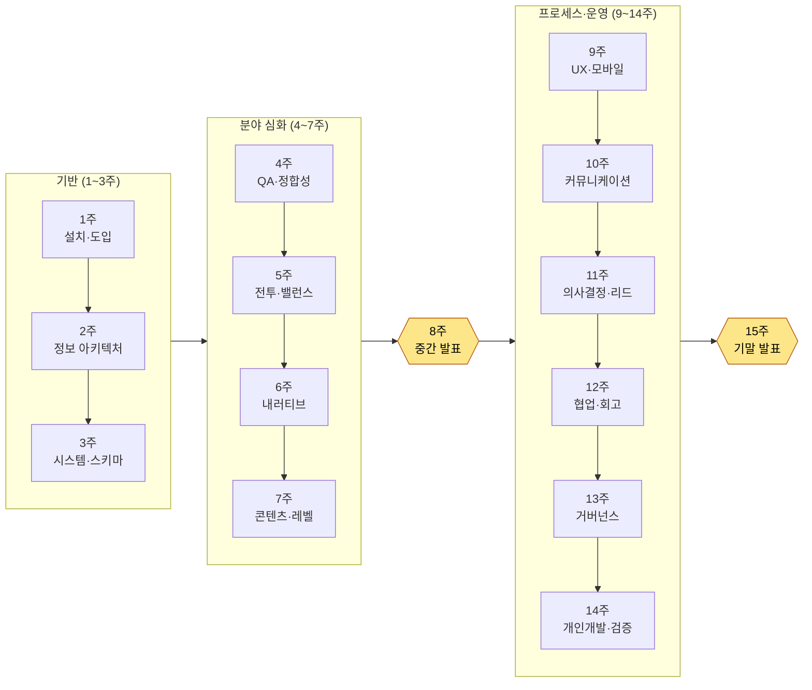

# 부록 N. 강의용 15주 진도표·난이도 가이드

이 부록은 이 책을 한 학기 강의의 교재로 얹으려는 분 — 대학·전문대·아카데미의 교수자, 사내 교육 담당자, 스터디 리드 — 을 위한 것입니다. 1,000쪽에 가까운 단권을 학기 단위로 쪼개는 일은 생각보다 막막합니다. 어느 부를 몇 주차에 넣을지, 본문의 「따라하기」를 어떻게 과제로 바꿀지, 제출물을 무슨 기준으로 채점할지 — 그 세 가지가 막히면 좋은 책도 교재로는 채택되기 어렵습니다. 이 부록은 그 세 가지를 그대로 베껴 쓸 수 있는 도구로 만들어 드립니다.

이 부록을 쓰는 법은 이렇습니다. 먼저 N.1의 15주 진도표를 본인 학사 일정에 맞춰 읽으시고(16주제·계절학기 변형은 N.2에 따로 두었습니다), N.3의 난이도 배지와 선행지식 표로 수강생 수준을 가늠하십시오. 그다음 N.4의 채점 루브릭을 복사해 본인 과제에 맞게 항목만 바꾸시면 됩니다. 모든 표는 그대로 출력해 강의계획서(실러버스)에 붙여도 되도록 짰습니다.

한 가지 일러둘 것이 있습니다. 이 책의 모든 챕터는 「따라하기」로 끝납니다. 읽고 덮는 챕터가 아니라 오늘 손을 움직이게 만드는 것이 본문의 목표였는데, 강의에서는 바로 그 「따라하기」가 과제의 1차 재료가 됩니다. 이 부록의 진도표가 본문의 「따라하기」를 주차별 과제로 어떻게 옮기는지를 함께 적은 것은 그 때문입니다.

---

## N.1 15주 표준 진도표

가장 흔한 15주제(주 1회 3시간 기준) 학기를 기준으로 짠 표준 진도표입니다. 이 책 24부를 한 학기에 전부 다루지는 않습니다 — 무리하게 욱여넣으면 어느 것도 손에 남지 않기 때문입니다. 대신 **기반(1·2부)을 단단히 깔고, 분야 중 대표 5~6개를 깊게 다루고, 프로세스·운영에서 핵심만 골라 마무리**하는 구성을 택했습니다. 다루지 않고 남긴 부는 「확장 읽기」로 표시해, 관심 있는 수강생이 스스로 펼치도록 안내합니다.

학습 목표는 모두 "수강생이 무엇을 할 수 있게 되는가"의 동사로 적었습니다. "안다"가 아니라 "만든다·검증한다·고른다"입니다. 이 책 전체가 "AI가 후보를 내고 사람이 거른다"는 한 문장을 반복하므로, 목표의 동사도 그 분업을 따릅니다.

| 주차 | 다루는 부·챕터 | 학습 목표 (수강 후 가능) | 과제로 전환한 「따라하기」 |
|---|---|---|---|
| 1 | 1.0 시작하기 전에 + 1부(도입) | 터미널·계정·요금 구조를 설명하고, AI 도구를 본인 PC에 설치해 첫 세션을 연다 | 1.0 설치 「따라하기」 — 설치 스크린샷 + 첫 프롬프트·출력 제출 |
| 2 | 2부(정보 아키텍처) | YAML 프론트매터로 문서를 데이터화하고, 폴더·명명 규약을 설계한다 | 2.1 프론트매터 「따라하기」 — 본인 문서 3개에 프론트매터 부여 |
| 3 | 3부(시스템 기획) | 스키마 우선 원칙으로 데이터 시트의 $스키마를 먼저 정의한다 | 3.2 스키마 「따라하기」 — 미니 시트 1종의 명세서 작성 |
| 4 | 10부(QA·정합성) | 30개 시트의 FK 정합성을 코드로 검사하는 도구를 따라 만든다 | 10.1 정합성 검증 「따라하기」 — **N.4 루브릭으로 채점하는 핵심 과제** |
| 5 | 4부(전투) + 8부(밸런스) | 전투 수치를 Layer로 분해하고, 결정론적 밸런스 공식을 룰북으로 둔다 | 8.1 밸런스 공식 「따라하기」 — 데미지 공식 1종 + 시뮬 |
| 6 | 5부(내러티브) | NPC 대사 voice_profile을 만들고 voice_lint로 톤 이탈을 잡는다 | 5.2 voice_profile 「따라하기」 — 캐릭터 1명의 보이스 프로필 |
| 7 | 6부(콘텐츠) + 7부(레벨) | 절차적 생성의 두 축(룰·AI)을 구분하고, 콘텐츠 후보를 양산·검수한다 | 6.2 생성기 「따라하기」 — 콘텐츠 후보 10건 생성 + 검수 로그 |
| 8 | **중간 점검·발표** | 1~7주차 과제를 통합해 본인 미니 프로젝트로 시연한다 | 중간 과제 발표 (3~6주차 산출물 통합 데모) |
| 9 | 9부(UX·UI) + 14부(모바일) | HUD를 lint에 걸어 시선 이탈·대비 미달을 잡고, PC HUD를 모바일로 압축한다 | 9.1 HUD lint 「따라하기」 — 화면 1종 lint 리포트 |
| 10 | 16부(커뮤니케이터) + 17부(회의록) | 격리된 작업공간에서 결정만 정본화하고, 회의록을 구조화한다 | 17.x 회의록 「따라하기」 — 실제 회의 녹취 1건 구조화 |
| 11 | 18부(의사결정) + 19부(팀 리드) | 결정을 추적 가능한 카드로 남기고, 비전을 결정의 채점표로 바꾼다 | 18.1 의사결정 추적 「따라하기」 — 결정 카드 3장 작성 |
| 12 | 20부(협업 메모리) + 21부(자가개선) | 협업 맥락을 메모리로 운영하고, 회고를 자가개선 루프로 돌린다 | 21장 회고 「따라하기」 — 1주 회고 1건 + 추출 규칙 1개 |
| 13 | 22부(거버넌스) | 프롬프트·환각·비용·법무·윤리의 경계를 점검하고 룰을 세운다 | 22.1 프롬프트 「따라하기」 — 작업지시서 1장 + 환각 점검 절차 |
| 14 | 23부(개인 개발) + 24부(운영 심화) | 1인 축소판으로 도구를 옮기고, 정합·링크·stale를 코드로 검증한다 | 24.1 검증 「따라하기」 — 본인 프로젝트 검증 스크립트 1종 |
| 15 | **기말 프로젝트 발표·평가** | 학기 전체를 관통하는 본인 워크플로 1개를 설계·시연·검증한다 | 기말 과제 발표 (N.4 확장 루브릭으로 평가) |

> **확장 읽기(강의 미포함, 자율 학습 권장):** 11부(캐릭터·펫·탈것), 12부(아트 디렉션), 13부(데이터·KPI), 15부(라이브 운영). 이 네 부는 분야 특화가 강해 관심 있는 수강생이 본인 분야에 맞춰 펼치도록 남겼습니다. 부록 F(사례 색인)를 길잡이로 쓰면 본인 환경에 가까운 사례부터 역방향으로 찾아 들어갈 수 있습니다.

진도 흐름을 한눈에 보면 다음과 같습니다. 기반 → 분야 심화 → 중간 통합 → 프로세스·운영 → 기말 통합의 두 산(중간·기말)을 가진 구조입니다.

---

## N.2 학기 길이 변형 (16주 / 계절학기 8주)

학교마다 학기 길이가 다릅니다. 표준 15주 외에 가장 자주 마주치는 두 변형의 조정안을 둡니다. 핵심 과제(4주차 정합성 검사)와 두 발표 산은 어느 변형에서도 유지하는 것을 권합니다 — 이 책의 정직성 원칙("효과가 아니라 구조를 보여준다")이 가장 잘 드러나는 자리이기 때문입니다.

| 학기 형태 | 조정 방법 |
|---|---|
| 16주제 | 표준 15주 + 16주차에 **보강·재평가 주** 추가. 기말 과제 재제출 기회 또는 「확장 읽기」 4부 중 1부를 수강생 투표로 정해 특강 |
| 계절학기 8주 (주 2회 또는 집중) | 1주(설치·도입) → 2주(정보·스키마) → 3주(정합성, 핵심 과제) → 4주(전투·밸런스·내러티브 묶음) → 5주 중간 발표 → 6주(회의·의사결정·협업) → 7주(거버넌스·검증) → 8주 기말 발표. 분야는 대표 3개로 축소, 「따라하기」는 수업 중 실습으로 흡수 |
| 플립러닝(거꾸로 교실) | 본문 통독은 사전 과제로 돌리고, 강의 시간은 「따라하기」 실습과 루브릭 상호 평가에 전부 할당. 이 책은 코드가 외부 의존성 없이 그대로 돌아가도록 실려 있어 실습 중심 운영에 적합 |

---

## N.3 챕터 난이도 배지·선행지식

같은 책 안에서도 챕터마다 요구하는 배경지식이 다릅니다. 어떤 챕터는 터미널이 처음인 1학년도 따라올 수 있고, 어떤 챕터는 데이터베이스 키 개념이나 통계 기초가 있어야 온전히 소화됩니다. 수강생 수준에 맞춰 진도를 조절하거나, 선행 과목을 안내할 때 쓰시도록 세 단계 배지로 정리했습니다.

배지의 뜻은 다음과 같습니다.

| 배지 | 등급 | 의미 |
|---|---|---|
| 🟢 입문 | 입문 | 비전공·1학년도 따라올 수 있음. 코드는 복사·실행 수준이면 충분 |
| 🟡 실무 | 실무 | 코드를 읽고 본인 데이터에 맞춰 수정할 수 있어야 함. 기획 실무 맥락 이해 권장 |
| 🔴 심화 | 심화 | 알고리즘·구조를 설계·확장하는 단계. 선행지식 없이는 소화 난도 높음 |

주차별 핵심 부의 배지와 선행지식은 아래와 같습니다. "선행지식"은 그 주차를 무리 없이 따라가기 위해 미리 갖추면 좋은 배경이며, 없다고 수강 자체가 막히는 것은 아닙니다.

| 주차 | 핵심 부 | 배지 | 선행지식 |
|---|---|---|---|
| 1 | 1.0·1부 도입 | 🟢 입문 | 없음 (터미널 첫 경험 전제) |
| 2 | 2부 정보 아키텍처 | 🟢 입문 | 텍스트 편집기 사용 |
| 3 | 3부 시스템·스키마 | 🟡 실무 | 표/스프레드시트 기본, 데이터 타입 개념 |
| 4 | 10부 정합성 검증 | 🔴 심화 | **파이썬 기초**(함수·반복문), 관계형 키(FK) 개념 |
| 5 | 4·8부 전투·밸런스 | 🟡 실무 | 사칙연산 수식, **표 계산**(엑셀 함수) |
| 6 | 5부 내러티브 | 🟢 입문 | 캐릭터·시나리오 작문 감각 |
| 7 | 6·7부 콘텐츠·레벨 | 🟡 실무 | 절차적 생성 개념(권장), 좌표·그리드 감각 |
| 9 | 9·14부 UX·모바일 | 🟡 실무 | 화면 레이아웃·해상도 개념 |
| 10 | 16·17부 커뮤니케이션 | 🟢 입문 | 없음 (협업 경험 있으면 유리) |
| 11 | 18·19부 의사결정·리드 | 🟡 실무 | 팀 작업·프로젝트 관리 경험(권장) |
| 12 | 20·21부 협업·회고 | 🟡 실무 | 2주차 정보 아키텍처 이수 |
| 13 | 22부 거버넌스 | 🟡 실무 | **기초 통계**(평균·분포, 환각 검출 맥락), 저작권 기본 |
| 14 | 23·24부 개인·운영 | 🔴 심화 | 파이썬 기초, git 기본, 4주차 정합성 이수 |

> **선행 과목 한 줄 안내(강의계획서용):** "파이썬 입문 또는 그에 준하는 프로그래밍 기초를 권장하나 필수는 아님. 4·14주차 심화 챕터는 파이썬 함수·반복문 수준을 전제하며, 미이수자는 1~3주차 입문 트랙으로 충분히 따라올 수 있도록 과제를 분리 운영함."

수강생 구성에 따른 운영 팁은 다음과 같습니다.

- **비전공·교양 수업:** 🔴 심화(4·14주차)를 "AI에게 코드를 짓게 하고 결과를 검수하는" 형태로 운영하면 파이썬 미이수자도 학습 목표에 도달할 수 있습니다. 이 책의 본문이 보여주는 "사람은 검수자 자리를 지킨다"는 분업이 그대로 학습 설계가 됩니다.
- **전공·실무 양성 과정:** 🔴 심화 챕터에서 AI가 생성한 코드를 수강생이 직접 읽고 한 줄씩 설명하게 하면, 검수 역량 자체가 평가 대상이 됩니다(N.4 루브릭 4항과 연결).

---

## N.4 채점 루브릭 예시 — 정합성 검사 도구 따라하기 (4주차 핵심 과제)

루브릭이 없으면 「따라하기」 제출물은 "돌아갔다/안 돌아갔다"의 이분법으로만 채점되기 쉽습니다. 그러면 이 책이 가장 중요하게 여기는 것 — AI 출력을 **검수하고 거부하는 과정** — 이 평가에서 사라집니다. 그래서 4주차 핵심 과제(10.1 정합성 검증 atom 「따라하기」)를 예로, 결과물뿐 아니라 그 과정까지 채점하는 루브릭을 둡니다. 다른 주차 과제에도 항목 이름만 바꿔 그대로 쓰실 수 있습니다.

**과제 정의:** 본인이 만든(또는 제공된) 데이터 시트 여러 종에 대해, 시트 간 외래 키(FK) 정합성을 검사하는 도구를 AI와 함께 만들고, 일부러 심어 둔 오류를 도구가 잡아내는지 시연한다. 제출물은 ① 도구 코드 ② 검사 실행 결과(통과/실패 리포트) ③ AI에게 친 프롬프트 전문과 그중 거부·수정한 출력의 기록.

루브릭은 4항목·각 25점(총 100점)으로 구성합니다. 핵심은 "도구가 돈다"(2항)와 별개로, **AI를 어떻게 다뤘는가**(3·4항)를 절반의 비중으로 평가한다는 점입니다.

| # | 평가 항목 | 배점 | 미흡 (0~12) | 보통 (13~19) | 우수 (20~25) |
|---|---|---|---|---|---|
| 1 | **정합성 규칙 정의** — 어떤 FK 관계를 왜 검사하는지 명확한가 | 25 | 검사 대상 관계가 불명확하거나 임의적 | 주요 FK 관계를 식별했으나 근거 설명 부족 | 시트 간 관계를 도식·근거와 함께 정의하고 검사 우선순위를 설명 |
| 2 | **도구 동작·오류 검출** — 심어 둔 오류를 실제로 잡아내는가 | 25 | 실행 불가 또는 명백한 오류를 놓침 | 대부분의 오류를 잡으나 일부 누락·오탐 | 모든 심은 오류를 잡고, 오탐 없이 리포트가 사람이 읽을 수 있게 출력 |
| 3 | **AI 활용 과정의 투명성** — 프롬프트 전문과 출력이 재현 가능하게 기록됐는가 | 25 | 프롬프트·출력 기록 없음 또는 결과만 첨부 | 프롬프트는 있으나 거부·수정 과정이 빠짐 | 친 프롬프트 전문, 날것의 출력, 거부·재지시 과정을 시간순으로 남김 |
| 4 | **검수·거부 판단** — AI 출력의 무엇을 왜 거부·수정했는지 | 25 | 출력을 그대로 수용(검수 흔적 없음) | 일부 수정했으나 판단 근거가 약함 | 오류·환각·과잉설계를 짚어 거부하고, 그 판단 근거를 자기 언어로 설명 |

> **채점 운영 메모:** 3·4항(합 50점)이 이 루브릭의 척추입니다. 도구가 완벽히 돌아도(2항 만점) AI 출력을 무비판 수용했다면(4항 미흡) 이 과제의 학습 목표 — "사람이 검수자 자리를 지킨다" — 에는 미달한 것으로 봅니다. 반대로 도구가 일부 불완전해도 거부·재지시 과정이 탄탄하면 높은 점수를 받을 수 있습니다. 효과(돌아간 결과)가 아니라 구조(어떻게 다뤘는가)를 평가한다는 이 책의 원칙이 채점에도 그대로 적용됩니다.

기말 과제에는 위 4항에 **⑤ 워크플로 일반화(본인 분야로의 이식 설명)** 1항을 더한 5항·각 20점 확장 루브릭을 권합니다. 학기 내내 다룬 도구를 본인 프로젝트로 옮길 수 있는가 — 그것이 이 책이 마지막에 묻는 질문이고, 강의의 마지막 평가도 같은 질문이면 충분합니다.

---

## N.5 강의 운영 한 장 요약

마지막으로, 이 부록을 한 장으로 줄이면 이렇습니다.

- **고른다, 다 넣지 않는다.** 24부를 다 다루려 하지 말고, 기반(1·2부) + 정합성(10부) + 분야 대표 5~6개 + 프로세스·운영 핵심으로 한 학기를 짭니다. 나머지는 「확장 읽기」로 남깁니다.
- **「따라하기」를 과제로 옮긴다.** 본문이 이미 손을 움직이게 설계돼 있으므로, 과제 설계의 절반은 이미 책 안에 있습니다.
- **결과가 아니라 검수를 채점한다.** 루브릭의 무게중심을 "AI를 어떻게 다뤘는가"에 둡니다. 그것이 이 책이 처음부터 끝까지 반복하는 한 문장 — AI가 후보를 내고, 마지막 결정은 사람이 한다 — 을 강의실에서 살아 있게 하는 방법입니다.

이 진도표는 출발점이지 정답이 아닙니다. 본인 수강생의 수준과 학사 일정에 맞춰 주차를 옮기고 과제를 바꾸십시오. 이 책 자체를 AI 도구에게 통째로 읽혀 "내 강의 16주 일정과 수강생 수준에 맞게 이 진도표를 다시 짜 줘"라고 부탁하는 것도 — 이 책의 가장 빠른 활용법답게 — 열려 있는 길입니다.
