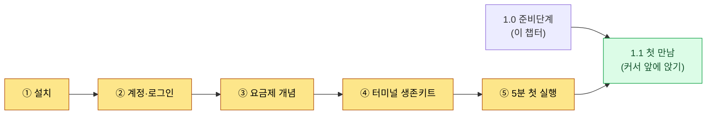
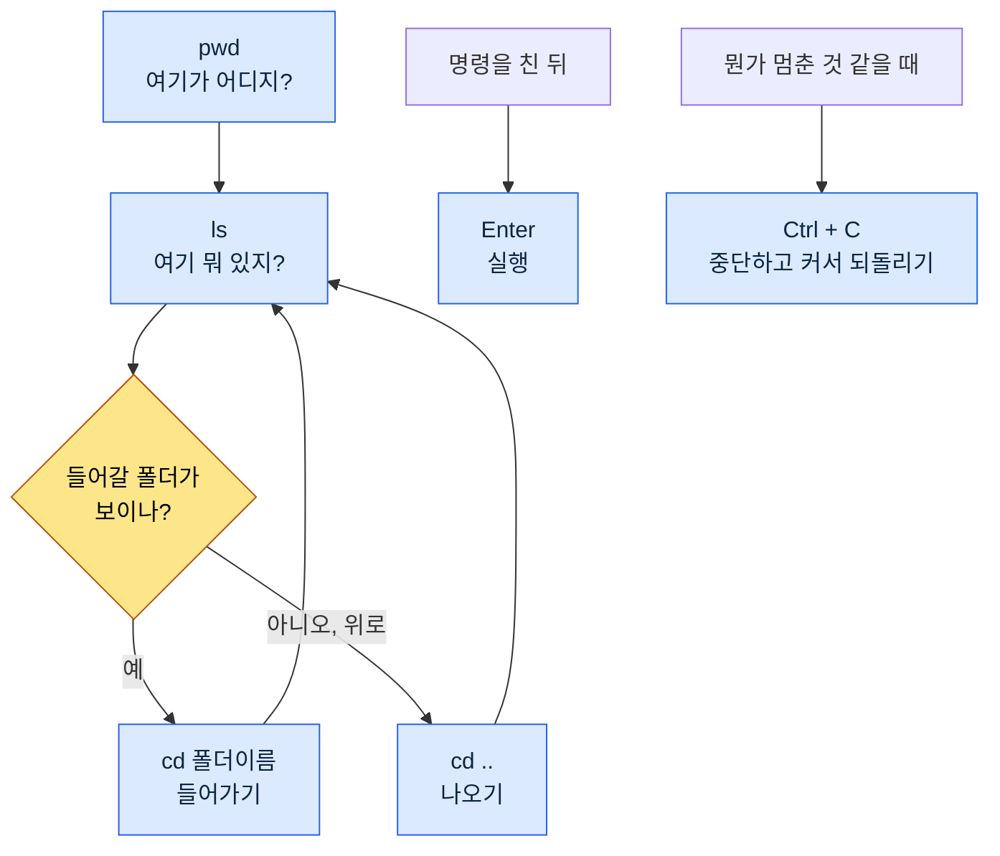
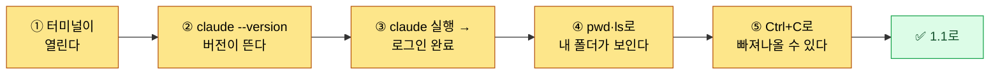

# 1.0 시작하기 전에 — 설치·계정·요금·터미널 생존키트

1.1은 "첫 만남"이다. 깜빡이는 커서 앞에 앉아 무엇을 쳐 보는 자리다. 그런데 그 자리에 앉으려면 먼저 갖춰야 할 것들이 있다. 도구가 설치돼 있고, 로그인이 돼 있고, 요금이 어떻게 나가는지 대략 알고, 검은 화면에서 글자 몇 개는 칠 줄 알아야 한다. 이 챕터는 1.1보다 한 단계 앞이다.

많은 입문서가 이 단계를 건너뛴다. "터미널을 여세요"라고 한 줄 적고 넘어간다. 그런데 입문자는 바로 그 한 줄에서 막힌다. 터미널이 어디 있는지, 무엇을 깔아야 하는지, 깔다가 빨간 글자가 뜨면 어떻게 해야 하는지 — 첫 줄에서 멈춘 사람은 1.1까지 도달하지 못한다. 이 챕터의 목표는 단 하나, 첫 줄에서 막히지 않게 하는 것이다.

이 챕터는 다섯 부분으로 되어 있다. 설치, 계정·로그인, 요금제 개념, 터미널 생존키트, 그리고 "5분 첫 실행" 체크리스트다. 순서대로 따라오면 1.1의 자리에 앉을 준비가 끝난다.



---

## 1.0.1 설치 — OS별 한 줄

설치는 공식 안내를 따르는 것이 원칙이다. 도구는 자주 바뀌고, 비공식 경로로 받은 설치 파일은 위험하다. 그래서 이 책은 다운로드 링크를 실어 두지 않고, 공식 경로를 찾는 법을 안내한다. 검색창에 "Claude Code 공식 문서" 또는 "Claude Code install"을 치면 Anthropic 공식 문서 페이지가 가장 먼저 나온다. 설치 명령은 그 페이지의 것을 그대로 쓰는 것이 가장 안전하다.

큰 그림은 알아 두는 편이 좋다. Claude Code(클로드 코드, 이 책은 영문 표기로 통일한다)는 터미널에서 도는 도구이고, 보통 한 줄 명령으로 설치한다. OS별로 흐름이 조금 다르다.

| OS | 준비물 | 설치 흐름(개념) |
|---|---|---|
| Windows | PowerShell(기본 내장) | 공식 문서의 설치 명령 한 줄을 PowerShell에 붙여넣기 |
| macOS | 터미널(기본 내장) | 공식 문서의 설치 명령 한 줄을 터미널에 붙여넣기 |
| Linux | 터미널 | 공식 문서의 설치 명령 한 줄을 터미널에 붙여넣기 |

세 OS 모두 흐름은 같다. "터미널을 연다 → 공식 문서의 한 줄을 붙여넣는다 → 엔터". 명령어를 외울 필요는 없다. 공식 문서에서 복사해 붙여넣는 것이 정석이다.

설치 도중 빨간 글자(에러)가 떠도 당황하지 않아도 된다. 입문자가 만나는 설치 에러는 대부분 둘 중 하나다. 권한 문제, 아니면 사전 도구(예: Node.js 같은 런타임)가 없는 경우다. 빨간 글자가 떴다면 그 문장 전체를 그대로 복사해 검색하거나 AI에 물어보면 십중팔구 해결된다. 에러 메시지는 적이 아니라 단서다.

> 설치가 잘 됐는지 확인하는 법: 터미널에 `claude --version`을 치고 엔터. 버전 번호가 한 줄 뜨면 설치 성공이다. "명령을 찾을 수 없다"는 식의 메시지가 뜨면 아직 설치가 안 됐거나 터미널을 새로 열어야 하는 경우다. 터미널을 완전히 닫고 다시 연 뒤 한 번 더 확인해 보자.

---

## 1.0.2 계정·로그인

설치가 끝났다고 바로 쓸 수 있는 것은 아니다. Claude Code는 Anthropic의 AI 모델을 빌려 쓰는 도구라서, 누가 쓰는지 확인하는 로그인 단계가 필요하다.

흐름은 단순하다. 터미널에서 `claude`를 처음 실행하면 로그인 안내가 뜬다. 보통 웹 브라우저가 자동으로 열리고, 거기서 Anthropic 계정으로 로그인하면 된다(없다면 그 화면에서 새로 만들 수 있다). 로그인이 끝나면 브라우저가 "이제 터미널로 돌아가도 됩니다" 같은 안내를, 터미널 쪽에서도 완료 표시가 뜬다.

여기서 입문자가 자주 걸리는 지점이 두 곳이다.

첫째, 브라우저가 자동으로 안 열리는 경우다. 이때는 터미널에 긴 주소(URL)가 한 줄 표시된다. 그 주소를 복사해 브라우저 주소창에 붙여넣고 들어가면 된다. 막힌 게 아니라 수동으로 한 단계만 더 하면 된다.

둘째, 계정 종류를 헷갈리는 경우다. 웹 채팅(Claude.ai)에서 쓰던 계정과 Claude Code의 계정·요금이 어떻게 연결되는지는 시점마다 정책이 다를 수 있다. 로그인 화면의 안내와 공식 문서를 따르는 것이 가장 정확하다. 첫 실행 화면이 시키는 대로 따라가면 대부분 무리 없이 로그인된다.

로그인은 한 번 해 두면 그 PC에서는 유지된다. 매번 다시 할 필요는 없다.

---

## 1.0.3 요금제 개념 — 정액 구독 vs API 종량

입문자가 가장 불안해하는 부분이 "돈이 얼마나 나가지?"다. 글자를 칠 때마다 요금이 붙는 건 아닐까 하는 막연한 두려움이 있다. 큰 그림을 먼저 잡으면 이 불안이 줄어든다. 요금 방식은 크게 두 갈래다.

| 방식 | 과금 형태 | 비유 | 누구에게 |
|---|---|---|---|
| 정액 구독 | 월 고정 금액 | 통신 정액 요금제 | 입문자·일상 사용 |
| API 종량 | 쓴 만큼(토큰 단위) | 전기 계량기 | 대량·자동화·개발 연동 |

**정액 구독**은 월 단위로 정해진 금액을 내고 한도까지 쓰는 방식이다. 휴대폰 정액 요금제와 비슷하다. 매달 같은 금액이 나가니 예측이 쉽고 "한 줄 칠 때마다 얼마"를 신경 쓸 필요가 없다. 그래서 입문자는 보통 정액 구독으로 시작하는 편이 마음이 편하다(저자 추정 — 정확한 플랜 구성과 한도는 시점마다 바뀌므로 공식 요금 페이지에서 확인). 한도를 넘기면 다음 주기까지 기다리거나 상위 플랜으로 올린다.

**API 종량**은 실제 쓴 양(토큰)에 비례해 과금하는 방식이다. 전기 계량기처럼 쓴 만큼 청구된다. 대량 처리나 자동화 파이프라인, 다른 프로그램과 연동하는 경우에 적합하다. 정교하게 쓰면 효율적이지만, 입문 단계에서는 사용량 감을 잡기 전까지 비용 예측이 어려울 수 있다.

토큰이 무엇이고 왜 그것으로 과금하는지는 1.2(AI 모델·토큰·하네스)에서 자세히 다룬다. 여기서는 한 가지만 기억하면 된다. **입문자는 보통 정액 구독으로 시작한다.** 매달 금액이 고정이라 "쓰다가 폭탄 맞을까" 하는 두려움 없이 연습할 수 있기 때문이다. 플랜 이름·가격·한도는 자주 바뀌므로 이 책은 특정 숫자를 실어 두지 않는다. 이 책의 내용은 2026년 중반을 기준으로 쓰였고, 요금제·모델·기능은 그 뒤로도 계속 바뀐다. 현재 값은 공식 요금 페이지에서 확인하는 것이 가장 정확하다.

> 한 줄 요약: 쓸 때마다 돈 나가는 게 아닐까 하는 두려움 → 정액 구독이면 매달 고정. 입문은 정액으로 시작하면 마음이 편하다.

---

## 1.0.4 터미널 생존키트 — 검은 화면 두려움 줄이기

이제 가장 큰 벽, 검은 화면이다. 1.1이 "깜빡이는 커서 앞에서 멈칫한다"로 시작하는 이유가 여기 있다. GUI로 24년을 일해 온 손에게 터미널은 낯설다. 그런데 첫 줄에서 막히지 않는 데 필요한 명령은 그리 많지 않다. 아래 여섯 개면 충분하다.

| 명령 | 읽는 법 | 하는 일 | 비유 |
|---|---|---|---|
| `pwd` | 피더블유디 | 지금 내가 어느 폴더에 있는지 보여 줌 | "여기가 어디지?" |
| `ls` | 엘에스 | 지금 폴더 안에 뭐가 있는지 목록 | 폴더 창 열어 보기 |
| `cd 폴더이름` | 씨디 | 그 폴더 안으로 들어감 | 폴더 더블클릭 |
| `cd ..` | 씨디 점점 | 한 단계 위 폴더로 나옴 | 뒤로 가기 |
| `Enter` | 엔터 | 친 명령을 실행 | 확인 버튼 |
| `Ctrl + C` | 컨트롤 씨 | 지금 돌고 있는 걸 중단 | 정지 버튼 |

(Windows PowerShell도 `ls`·`cd`·`pwd`가 그대로 통한다. macOS·Linux도 같다. 그래서 이 여섯 개는 OS를 가리지 않는다.)

이 여섯 개로 하는 일을 그림으로 보면 이렇다. 터미널에서의 이동은 결국 폴더 안팎을 드나드는 것이고, GUI에서 폴더를 더블클릭하거나 뒤로 가는 것과 같은 동작이다.



검은 화면이 무서운 진짜 이유는 "잘못 치면 망가질 것 같다"는 느낌이다. 그런데 위 여섯 개 중 무언가를 망가뜨리는 명령은 없다. `pwd`·`ls`·`cd`는 보거나 이동만 할 뿐 파일을 지우거나 바꾸지 않는다. `Enter`는 실행, `Ctrl + C`는 중단일 뿐이다. 그러니 이 여섯 개는 아무 때나 마음 놓고 쳐도 된다.

화면이 멈춘 것처럼 보일 때가 있다. 명령을 쳤는데 한참 반응이 없거나, 커서가 다른 줄에서 깜빡이며 무엇을 더 기다리는 것 같을 때다. 그럴 때 `Ctrl + C`를 한 번 누르면 대개 원래 커서로 돌아온다. 이 "정지 버튼"이 있다는 사실만 알아도 검은 화면이 한결 덜 무섭다. 막히면 `Ctrl + C`로 빠져나와 다시 시작하면 된다.

마지막으로, 친 글자가 잔뜩 쌓여 정신없을 때는 화면을 비울 수 있다. Windows PowerShell·macOS·Linux 모두 `clear` 명령으로 비운다. 비워도 한 일이 사라지는 것은 아니고 보이는 글자만 정리된다.

---

## 1.0.5 "5분 첫 실행" 체크리스트

여기까지 왔다면 준비는 끝났다. 아래 다섯 칸을 5분 안에 통과하면 1.1의 자리에 앉을 자격이 생긴 것이다. 한 칸이라도 막히면 해당 절(1.0.1\~1.0.4)로 돌아가면 된다.



- [ ] ① 터미널을 열 수 있다 (Windows: PowerShell / macOS: 터미널)
- [ ] ② `claude --version`을 치면 버전 번호가 한 줄 뜬다 (설치 확인)
- [ ] ③ `claude`를 실행하니 로그인이 되어 있다 (또는 안내대로 로그인 완료)
- [ ] ④ `pwd`로 현재 위치를, `ls`로 폴더 내용을 볼 수 있다
- [ ] ⑤ 무언가 멈췄을 때 `Ctrl + C`로 빠져나올 수 있다

다섯 칸을 다 채웠다면 검은 화면은 더 이상 미지의 벽이 아니다. 도구가 깔려 있고, 로그인이 돼 있고, 요금 방식의 큰 그림을 알고, 화면 안에서 이동하고 멈출 줄 안다. 1.1은 이 준비 위에서 시작한다. 깜빡이는 커서 앞에 앉아 처음으로 "이 폴더에 뭐가 있는지 요약해줘"를 쳐 보는 그 자리로 가면 된다.

---

## 1.0.6 파이썬·pip — 도구를 돌리려면 (필요할 때만)

이 책 앞부분(1·2부)은 자연어 프롬프트만으로 따라올 수 있다. 다만 4부 이후 일부 챕터는 작은 파이썬 스크립트를 직접 돌린다(예: `pip install pyyaml`, `pip install pyvis`). 파이썬이 처음이라도 괜찮다. 두 가지 길이 있다.


첫째, **직접 까는 길.** 파이썬은 python.org에서 내려받아 설치하고(설치 화면에서 "Add to PATH"를 꼭 체크한다), 터미널에서 `python --version`으로 확인한다. `pip`는 파이썬에 함께 깔리는 꾸러미 설치 도구라, `pip install pyyaml`처럼 필요한 꾸러미를 한 줄로 받는다.

둘째, **AI에게 맡기는 길(권장).** 더 쉬운 길은 환경 구축 자체를 AI에게 시키는 것이다. 터미널에서 이렇게 부탁하면 된다.

```
파이썬이 깔려 있는지 확인하고, 없으면 내 OS에 맞는 설치 방법을 알려줘.
그리고 이 챕터에서 필요한 pyyaml 패키지를 설치하는 명령을 한 줄로 줘.
```

AI가 본인 환경을 점검하고 설치 명령을 만들어 준다. 막히면 그 자리에서 오류 메시지를 그대로 붙여 "이 오류 어떻게 풀어?"라고 물으면 된다. 도구를 돌리는 챕터마다 이 패턴 하나면 충분하다. 파이썬·pip가 부담스러운 단계에서는, 그 챕터의 「1인 축소판」이 코드 없이 가는 더 가벼운 길을 안내한다.

---

### 다음 챕터 미리보기
- 1.1 게임 기획자의 Claude Code 첫 만남 — 커서 앞에 앉아 첫 30분 버티기

---

## 따라하기

**setup**
1. 사용 중인 OS의 터미널을 여세요 (Windows: PowerShell, macOS: 터미널).
2. "Claude Code 공식 문서"를 검색해 공식 설치 안내 페이지를 띄워 두세요.
3. 타이머를 5분으로 맞추세요 — 1.0.5 체크리스트 다섯 칸을 통과하는 것이 목표입니다.

**prompt** (한 줄씩, 순서대로 쳐 보세요. 명령어이지 자연어 질문이 아닙니다)
```
① claude --version      # 버전이 뜨면 설치 성공
② pwd                   # 지금 내가 어느 폴더에 있는지
③ ls                    # 이 폴더에 뭐가 있는지
④ cd ..                 # 한 단계 위로 나오기 (그리고 다시 ls)
⑤ claude                # Claude Code 실행 (로그인 안내가 뜨면 따라가기)
```

**verify**
- ①에서 버전 번호가 한 줄 뜨면 설치가 끝난 것입니다. "명령을 찾을 수 없다"가 뜨면 터미널을 닫고 다시 연 뒤 한 번 더 시도하세요.
- ②·③·④로 폴더를 보고 이동하는 동안 아무것도 망가지지 않는다는 점을 직접 확인하세요. 이 셋은 보기·이동만 하는 안전한 명령입니다.
- ⑤ 실행 중 멈춘 것 같으면 `Ctrl + C`로 빠져나오세요. 빠져나와지면 "정지 버튼이 있다"는 사실을 몸으로 확인한 것입니다.

### 1인 축소판

팀도 회사 폴더도 없는 개인이라면, 설치(①)와 `Ctrl + C`로 빠져나오기만 먼저 익혀 두세요. `claude --version`으로 "도구가 깔렸다"를, `Ctrl + C`로 "막혀도 빠져나올 수 있다"를 확인하면, 검은 화면 두려움의 절반은 혼자서도 5분 안에 정리됩니다. 요금은 일단 정액 구독으로 시작하면 비용 걱정 없이 마음껏 연습할 수 있습니다.
