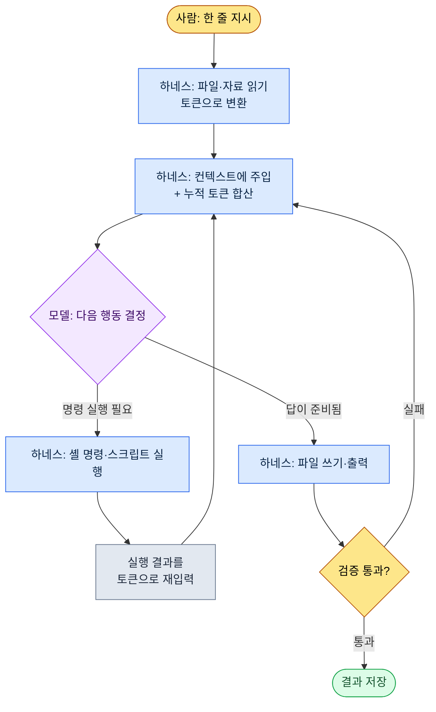

# 1.2 모델·토큰·하네스 — 한 작업의 토큰이 흐르는 길

작업 하나를 끝내고 사용량을 봤을 때다. 이번 주 회의록 다섯 개가 폴더에 쌓여 있고, 월요일 오전 스탠드업 전까지 "결정된 것만" 한 장으로 정리해야 한다. 나는 Claude Code 창에 한 줄을 적는다. "이 폴더의 회의록에서 결정사항만 뽑아 표로 만들어 줘." 엔터를 친 다음 0.4초쯤, 화면 아래쪽에 작은 회색 글씨가 깜빡인다.

```
Reading meeting-2026-05-25.md ... (1,840 tokens)
Reading meeting-2026-05-27.md ... (2,310 tokens)
```

이 회색 글씨가 이 장의 주제다. 한국어 한 문장을 던지면, 도구는 그것을 토큰으로 쪼개고, 파일을 토큰으로 읽어 모델에게 넣고, 모델의 답을 받아 파일에 쓴다. 이 왕복이 한 번 돌 때마다 비용이 매겨지고, 모델의 "시야"에 자료가 쌓인다. 이 장은 그 회색 글씨 뒤에서 벌어지는 일을 게임 기획자의 언어로 분해한다. 모델·토큰·컨텍스트·하네스, 네 단어면 충분하다.

> **용어 메모**
> - 모델(model): 답을 만드는 두뇌. Opus·Sonnet·Haiku처럼 크기와 성격이 다른 종류가 있다.
> - 토큰(token): 글을 잘게 자른 조각. 과금·속도·시야가 모두 이 단위로 센다.
> - 컨텍스트 윈도우(context window): 모델이 한 번에 머릿속에 담는 토큰의 최대치.
> - 하네스(harness): 모델을 일하게 만드는 차체. Claude Code가 그 예다.

---

## 1.2.1 하네스 루프 — 회색 글씨의 정체

위의 회색 글씨는 무작위 로그가 아니라 정해진 순환의 한 칸이다. 하네스가 하는 일은 결국 같은 고리를 빠르게 도는 것이다. 파일을 읽어 모델에게 넣고, 모델이 "이 명령을 실행하라"고 하면 실행하고, 그 결과를 다시 모델에게 넣는다. 이 고리가 작업이 끝날 때까지 돈다.



이 그림에서 사람이 손을 대는 칸은 맨 위(지시)와 맨 아래(검증 결과 확인) 둘뿐이고, 가운데 고리는 하네스가 자율로 돈다. 회의록 다섯 개를 읽는 동안 회색 글씨가 다섯 번 깜빡인 건 `Read → Inject` 칸을 다섯 바퀴 돈 것이다. 웹 채팅이라면 파일 다섯 개를 직접 열어 복사·붙여넣어야 한다. 그 노동을 하네스가 대신한다는 것, 이게 챗봇과 CLI형 하네스를 다른 도구로 만드는 결정적 차이다.

루프가 한 바퀴 돌 때마다 `Inject` 칸에서 누적 토큰이 합산된다. 그래서 토큰을 먼저 이해하지 않으면 이 루프의 비용도 한계도 보이지 않는다. 토큰부터 본다.

---

## 1.2.2 토큰 — 한 작업이 쓰는 실제 화폐

토큰은 글자가 아니라 모델이 글을 자른 조각이다. 경험칙으로 영어는 약 4글자가 1토큰, 한국어는 약 2글자가 1토큰에 가깝다(공식 환산이 아니라 운영용 어림이다 — 실제 값은 모델 토크나이저가 정하며 문장마다 다르다). 한국어 공백 포함 20글자면 대략 10토큰쯤이다.

그 회의록 작업을 토큰으로 따라가 본다(아래 수치는 동일 작업의 단일 측정 한 번이다. 회의록 분량·요약 길이에 따라 달라지므로 절대값이 아니라 자릿수와 비율로 읽기를 권한다).

| 단계 | 무엇 | 토큰(입력) | 토큰(출력) |
|---|---|---|---|
| 지시 | "결정사항만 뽑아 표로" 한 줄 | \~25 | — |
| 회의록 읽기 ×5 | md 파일 5개 본문 | \~10,400 | — |
| 분류 규칙 주입 | 회의 카테고리 atom 1건(JIT) | \~480 | — |
| 모델 추론·표 작성 | 결정 12건을 표로 | — | \~1,600 |
| 검증 재입력 | Linter가 잡은 누락 1건 재질의 | \~320 | \~210 |
| **누적** | | **\~11,225** | **\~1,810** |

두 가지가 눈에 들어온다. 첫째, 내가 친 지시는 25토큰인데 작업 전체는 입력만 1만 1천 토큰을 넘는다. 비용의 거의 전부가 내 문장이 아니라 도구가 읽어 들인 자료에서 나온다. 둘째, 출력(1,810)이 입력(11,225)의 6분의 1 정도다. 대부분의 기획 자동화가 이렇게 많이 읽고 적게 쓴다. 그래서 비용을 줄이려면 출력을 다듬기보다 입력 자료의 양을 다스리는 쪽이 훨씬 효과가 크다.

작업이 끝난 뒤 `/context`를 치면 그 세션이 컨텍스트를 얼마나 차지했는지 보인다. 토큰을 의식하지 않으면 인쇄용지처럼 무의식적으로 흘러나가지만, 한 번 가시화하면 자세가 달라진다. 이 가시화가 절약의 출발점이다.

토큰을 다스리는 도구는 추상적 절약 정신이 아니라 입력 자료를 잘게 다루는 구체적 기법들이다.

1. **JIT 주입** — 자료 전부를 미리 싣지 않고, 필요할 때만 키워드 매칭으로 끌어온다. 위 표의 "분류 규칙 주입 480토큰"이 그 예다. 회의 분류 규칙 전체 문서(수천 토큰)가 아니라 매칭된 atom 한 건만 들어왔다.
2. **요약 캐시** — 긴 문서는 사람용 원본과 별도로 AI용 요약본을 둔다. AI는 요약본을 읽는다.
3. **atom 분할** — 한 파일에 한 결정만 담으면(2.2에서 상세) 필요한 조각만 정확히 끌어올 수 있어 토큰이 절약된다.
4. **컨텍스트 정리** — 세션이 길어지면 압축한다. Claude Code는 자동 압축을 지원한다.
5. **모델 선택** — 단순 변환에 큰 모델을 쓰면 같은 토큰이라도 비용이 비싸진다. 다음 절의 주제다.

이 중 1번 JIT 주입은 이 책의 작업 환경에서 실제로 도는 장치다. 입력 한 줄이 들어오면 `inject_memory.py` 훅이 메모리 atom을 점수순으로 매칭해 상위 몇 개만 골라 주입하고, 실패해도 작업 흐름을 막지 않는다(구현 디테일은 1.3에서 상세). "필요한 자료만, 상위 몇 개만, 실패해도 조용히"라는 토큰 절약 원칙이 코드 한 파일에 그대로 들어 있다.

---

## 1.2.3 모델 — 같은 차체, 다른 엔진

모델은 자동차 엔진과 같아서, Claude Code라는 같은 차체에 Opus·Sonnet·Haiku라는 다른 엔진을 끼울 수 있다. 엔진을 바꾸면 작업의 성격이 바뀐다.

<svg viewBox="0 0 640 230" xmlns="http://www.w3.org/2000/svg" font-family="sans-serif" font-size="13">
  <rect x="0" y="0" width="640" height="230" fill="#fafafa" stroke="#ddd"/>
  <text x="20" y="28" font-size="15" font-weight="bold">모델 매칭 — 깊이 vs 속도·비용</text>
  <!-- axes -->
  <line x1="80" y1="190" x2="600" y2="190" stroke="#888" stroke-width="1.5"/>
  <line x1="80" y1="190" x2="80" y2="55" stroke="#888" stroke-width="1.5"/>
  <text x="600" y="224" text-anchor="end" fill="#555">→ 속도·저비용</text>
  <text x="76" y="50" text-anchor="end" fill="#555">추론 깊이 ↑</text>
  <!-- Opus -->
  <circle cx="150" cy="80" r="34" fill="#7b4fbf" opacity="0.85"/>
  <text x="150" y="78" text-anchor="middle" fill="#fff" font-weight="bold">Opus</text>
  <text x="150" y="94" text-anchor="middle" fill="#fff" font-size="11">대형 엔진</text>
  <text x="150" y="138" text-anchor="middle" fill="#444" font-size="11">설계 검토·GDD 합성</text>
  <!-- Sonnet -->
  <circle cx="330" cy="120" r="34" fill="#3a86c8" opacity="0.85"/>
  <text x="330" y="118" text-anchor="middle" fill="#fff" font-weight="bold">Sonnet</text>
  <text x="330" y="134" text-anchor="middle" fill="#fff" font-size="11">중형 엔진</text>
  <text x="330" y="170" text-anchor="middle" fill="#444" font-size="11">회의록·일상 80%</text>
  <!-- Haiku -->
  <circle cx="510" cy="155" r="34" fill="#2a9d6f" opacity="0.85"/>
  <text x="510" y="153" text-anchor="middle" fill="#fff" font-weight="bold">Haiku</text>
  <text x="510" y="169" text-anchor="middle" fill="#fff" font-size="11">컴팩트</text>
  <text x="510" y="205" text-anchor="middle" fill="#444" font-size="11">시트 단순 변환</text>
</svg>

기획 작업에 맞춰 보면 이렇게 갈린다. 시스템 설계 검토나 여러 자료를 통합하는 GDD(Game Design Document, 상세 사양서) 초안 합성처럼 깊은 추론과 정합성이 필요한 일은 Opus, 회의록 결정 추출이나 일일 요약처럼 일상 작업 대부분은 Sonnet, 데이터 시트의 단순 형식 변환처럼 판단이 거의 없는 일은 Haiku로 간다. 앞 절의 회의록 작업을 Sonnet으로 돌린 것도 이 기준이다 — 결정을 골라 표로 옮기는 일은 깊은 추론보다 균형과 속도가 맞다.

도입 초기에 누구나 빠지는 함정이 있다. 모든 작업을 가장 좋은 엔진, 즉 Opus로 돌리고 싶은 충동이다. 그 충동을 따르면 비용·속도 부담이 곧 운영 부담으로 돌아오고, 작업에 모델을 맞추는 감각이 자리 잡지 못한다. 운영의 진짜 기술은 매번 머릿속으로 모델을 고르는 게 아니라, 패턴이 잡힌 뒤 자동화로 굳혀 두는 것이다.

- 일일 회고 작성 → 자동으로 Sonnet
- 시스템 설계 리뷰 → 자동으로 Opus
- 데이터 시트 정합성 검사 → 자동으로 Haiku

이런 고정은 settings.json이나 슬래시 명령 안에 모델을 명시해 둔다(1.3에서 상세). 한 번 굳히면 매번 고르는 수고가 사라진다.

모델은 대략 반년 주기로 새 버전이 나오고, 같은 이름이라도 4.5와 4.6은 다르다. 새 버전이 나오면 워크플로의 핵심 작업 다섯 개만 같은 입력으로 비교한다. 전부 테스트하려 들면 지친다. 다섯 개의 결과 차이만으로도 갈아탈지는 충분히 판단된다.

---

## 1.2.4 컨텍스트 윈도우 — 루프가 차오르는 한계

루프가 한 바퀴 돌 때마다 `Inject` 칸에서 토큰이 누적된다고 했다. 그 누적이 부딪히는 천장이 컨텍스트 윈도우, 즉 모델이 한 번에 처리할 수 있는 토큰의 최대치다. 사람으로 치면 작업 기억(working memory)이다.

- Claude 4 계열: 표준 200K 토큰, 확장 1M 토큰 옵션
- 200K 토큰 ≈ 한국어 기준 A4 약 400페이지 분량

앞의 회의록 작업은 누적 입력이 1만 1천 토큰대로, 200K 천장 대비 6% 남짓이라 여유롭다. 하지만 작업을 갈아타지 않고 같은 창에서 세션을 길게 끌면 천장에 다가간다. 가득 차면 옛 내용이 잘리고 모델이 앞부분 "기억"을 잃기 시작하며, 자동 압축이 발동해 이전 대화가 요약본으로 대체된다.

이 천장을 다스리는 습관은 네 가지다.

| 패턴 | 언제 |
|---|---|
| 세션 분리 | 다른 주제로 넘어갈 때는 새 세션을 연다 |
| 명시적 압축 | 한 작업이 끝나면 핵심만 남기고 압축한다 |
| 메모리 외부화 | 자주 쓰는 자료는 atom으로 빼서 JIT로 그때그때 주입한다 |
| 컨텍스트 가시화 | `/context`로 현재 사용량을 눈으로 확인한다 |

게임 기획자가 자주 마주치는 무거운 케이스는 회의 자료·기획서·데이터 시트가 동시에 필요한 작업으로, 이럴 때 1M 옵션이 유용하다. 다만 1M은 비용·속도 부담이 따르므로, 평소엔 200K로 충분하고 자료 묶음이 정말 클 때만 꺼낸다.

---

## 1.2.5 하네스가 실제로 거짓을 거를 때 — 검증 칸

루프 그림 맨 아래의 `검증 통과?` 칸으로 돌아온다. 이 칸이 없으면 모델의 그럴듯한 거짓말이 그대로 파일에 저장된다. 모델은 자신 있게 틀린 답을 정답인 것처럼 내놓을 때가 있고(환각, hallucination), 그 빈도는 세대가 올라갈수록 줄지만 0이 되지는 않는다. 그래서 검증을 상시 칸으로 둔다.

기획에서 위험한 환각은 구체적이다. 존재하지 않는 데이터 시트 컬럼을 인용하거나, 잘못된 수식으로 밸런스를 계산하거나, 회의에서 결정되지 않은 사항을 결정된 것처럼 요약한다. 회의록 작업에서 가장 무서운 건 세 번째다 — "논의만 하고 보류한 건"이 결정 표에 슬쩍 올라오는 경우다.

검증에는 다섯 가지 패턴이 있다.

1. **원본 대조** — AI 출력을 원본 자료와 다시 비교한다("이게 진짜 그 자료에 있었는지 확인해 줘").
2. **양방향 변환** — A→B로 바꾼 뒤 B→A로 거꾸로 변환해 일치를 본다.
3. **샘플 검수** — 출력 중 무작위 3\~5건을 사람이 직접 확인한다.
4. **Linter 자동화** — 출력이 정해진 형식·범위·규칙을 어겼는지 자동 검사한다.
5. **두 모델 교차 검증** — Sonnet 출력을 Opus가 검토한다.

다섯 개를 매번 다 하지 않고 작업의 위험도에 따라 1\~3개를 고른다. 회의록 작업에서는 4번 Linter("결정에 주체·내용·기한이 다 있는가")와 3번 샘플 검수 한 번을 묶었다. 앞 토큰 표의 마지막 줄 "검증 재입력 320토큰"이 바로 Linter가 누락을 잡아 모델에게 되물은 그 왕복, 루프 그림으로 치면 `검증 실패 → Inject`로 한 바퀴 더 돈 것이다.

매번 사람이 다 검증하면 도입 효과가 반감되므로 검증도 자동화 대상이다. 회의록 결정 추출은 Linter가 형식 누락을, 데이터 시트 변환은 행 수·합계·외래 키 정합성을, GDD 자동 생성은 핵심 섹션 누락을 자동 검사한다. 통과하면 사람은 안 봐도 되고, 통과하지 못한 것만 본다. 캐비닛에 가득 찬 서류 중 빨간 표시가 붙은 폴더만 손에 드는 풍경이다. 사람의 시선이 위험한 곳에만 떨어지도록 설계하는 것, 그게 검증 자동화의 목적이다.

---

## 1.2.6 네 단어가 한 작업으로 묶이는 자리

이제 그 회의록 작업을 처음부터 끝까지, 네 단어가 어떻게 한 줄에 꿰이는지 정리한다.

| 칸 | 무슨 일 | 어느 개념 |
|---|---|---|
| 1 | Claude Code를 회의록 폴더에서 실행 | 하네스 |
| 2 | 작업이 회의록 분석이라 Sonnet 선택 | 모델 |
| 3 | 합산 약 11K 토큰, 200K 윈도우 안 — OK | 토큰·컨텍스트 |
| 4 | 회의 분류 규칙 atom을 JIT로 자동 주입 | 토큰(절약) |
| 5 | 모델이 결정 12건을 표로 출력 | 모델·하네스 루프 |
| 6 | Linter가 형식 누락 1건 적발 → 되물어 보강 | 검증(루프 1회 추가) |
| 7 | `weekly-decisions-2026-W21.md`로 저장·커밋 | 하네스 |

손으로 했다면 회의록 다섯 개를 열어 읽고 결정만 골라 옮겨 적고 형식을 맞추는 데 30분이 든다. 자동화되면 5분으로 줄고, 그 5분 안에 사람의 손은 검증 샘플을 한 번 훑는 일뿐이다. 사람의 시간이 정말 필요한 곳(보류된 건이 결정으로 잘못 올라오지 않았는지)에만 떨어진다. 절약된 25분이 아니라 그 시선이 가는 자리가 달라진 것이 핵심이다.

---

## 1.2.7 흔한 오해

"Opus가 항상 더 좋다"가 가장 흔하다. 비용·속도를 무시하면 그렇지만 단순 작업에 Opus는 낭비다. 작업별 매칭이 답이다.

"1M 컨텍스트가 항상 필요하다"도 자주 나온다. 대부분 200K로 충분하고, 1M은 부담이 따르니 정말 큰 자료 묶음에만 쓴다.

"검증은 사람이 하는 것"은 절반만 맞다. 자동 검증 가능한 부분이 대부분이고 사람은 나머지에 집중한다.

"토큰은 신경 안 써도 된다"는 개인 작업에선 어느 정도 통하지만, 여러 사람이 함께 쓰면 누적 비용이 빠르게 커진다. 초기부터 가시화·절약 패턴을 정착시키는 편이 안전하다.

"하네스는 차이가 없다"도 의외로 많다. 같은 모델이라도 챗봇이냐 CLI냐에 따라 다른 도구처럼 갈린다. 앞에서 본 복사·붙여넣기 노동의 유무가 그 차이다.

---

## 1.2.8 따라 하기

작은 작업 하나로 이 장의 네 단어를 직접 돌려 보세요.

**setup**

- Claude Code가 설치된 상태에서, 텍스트 노트(회의록·메모) 2\~3개가 든 폴더를 하나 준비하세요.
- 그 폴더에서 Claude Code를 여세요.

**prompt**

```
이 폴더의 노트들에서 "결정된 것"만 골라
주체·내용·기한 3열 표로 만들어 줘.
보류·논의 중인 건은 빼고, 표에 넣은 각 줄이
어느 파일에서 왔는지 파일명도 함께 적어 줘.
```

**verify**

- 작업이 끝나면 `/context`를 쳐서 이 세션이 쓴 토큰을 보세요(생각보다 입력이 큰 걸 확인하게 됩니다).
- 표의 줄 한두 개를 골라 적힌 파일명을 열고, 정말 "결정"으로 쓰여 있었는지 원본과 대조하세요(원본 대조 검증).
- 보류였던 건이 표에 잘못 올라오지 않았는지 한 번 훑으세요(샘플 검수).

**1인 축소판**

도구를 막 시작했다면 위에서 딱 두 가지만 챙기세요. 첫째, 노트는 폴더째 맡기고 복사·붙여넣기를 직접 하지 마세요(하네스 루프에게 맡깁니다). 둘째, 출력 표는 무조건 파일명을 함께 받아 의심스러운 줄만 원본을 열어 보세요. 모델 선택이나 토큰 가시화는 익숙해진 다음에 붙여도 늦지 않습니다. 자료를 손으로 나르지 않는 것과 출력을 원본에 대조하는 것, 이 두 습관만으로 도입의 절반은 자리를 잡습니다.

---

### 이 챕터의 핵심 메시지
- 하네스는 읽기→실행→재입력 루프를 자율로 돌고, 사람은 지시와 검증 두 칸에만 손을 댄다
- 한 작업의 비용은 내가 친 지시가 아니라 도구가 읽어 들인 자료에서 거의 다 나온다
- 모델은 작업에 맞춰 갈아 끼우고, 컨텍스트 천장과 검증은 자동화로 다스린다

### 다음 챕터 미리보기
- 3장. 메모리·권한·세팅 인프라 — 한 번 세팅하면 영구히 일하는 기반
