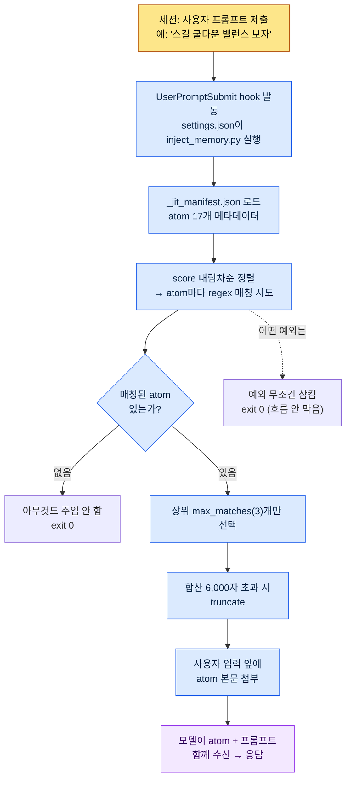

# 1.3 메모리·권한·세팅 인프라

새 세션을 열고 "스킬 쿨다운 밸런스 한 번 보자"라고 입력했다. 엔터를 누르기 전, 화면 아래쪽에 작은 회색 글자가 한 줄 스쳐 지나간다. `[memory injected: 2 atoms, 1,842 chars]`. 내가 아무 파일도 열지 않았는데, 지난주에 박제해 둔 쿨다운 규칙 문서가 이미 모델의 입력 앞에 붙어 들어갔다는 뜻이다. 이게 인프라가 깔린 작업 환경의 첫 신호다. 도구를 켜는 순간, 도구가 나를 기억하고 있다.

이 장면이 가능하려면 세 가지가 미리 자리를 잡고 있어야 한다. AI가 무엇을 기억할지(메모리), AI가 사람 승인 없이 무엇을 할 수 있는지(권한), 그 둘을 켜고 끄는 중앙 스위치(settings.json). 처음 설치하는 데 드는 시간은 길어야 한 시간이고, 그 한 시간이 이후 6개월간 매일 절약될 시간으로 돌아온다. 거의 전부 회수되는 투자다.

이 장은 저자가 실제로 개인 PC에서 돌리는 `settings.json` 한 줄, 그 한 줄이 호출하는 `inject_memory.py`, 그 파일이 읽는 `_jit_manifest.json`을 차례로 펼쳐 따라가는 워크스루다. 끝까지 읽으면 "메모리가 자동 주입된다"는 말이 어느 파일의 어느 줄에서 일어나는 일인지 손으로 짚을 수 있다.

---

## 1.3.1 settings.json — 모든 것이 시작되는 한 줄

먼저 결론부터 본다. 저자의 개인 PC에서 메모리 자동 주입을 켜는 것은 `settings.json` 안의 단 하나의 블록이다.

```json
{
  "hooks": {
    "UserPromptSubmit": [
      {
        "hooks": [
          {
            "type": "command",
            "command": "python ~/.claude/hooks/inject_memory.py"
          }
        ]
      }
    ]
  }
}
```

이 블록이 하는 말을 한국어로 풀면 이렇다. "사용자가 프롬프트를 제출하는 이벤트(`UserPromptSubmit`)가 일어날 때마다, `inject_memory.py`라는 파이썬 스크립트를 한 번 실행하라." 그게 전부다. AI가 똑똑해서 알아서 기억하는 게 아니라, 입력이 들어올 때마다 사람이 등록해 둔 스크립트가 한 번씩 끼어드는 구조다.

`settings.json`은 Claude Code의 모든 동작을 제어하는 중앙 파일이고, 두 층으로 나뉜다.

- `~/.claude/settings.json` — 글로벌. 모든 세션에 적용. 팀과 공유 가능한 설정.
- `~/.claude/settings.local.json` — 로컬. 이 PC에서만 적용. 개인 PC 특수 설정.

둘은 병합되어 적용된다. 그래서 저자는 팀이 공유해야 할 hook·권한은 `settings.json`에, 이 집 PC에서만 쓰는 절대경로나 개인 도구 경로는 `settings.local.json`에 나눠 둔다. 협업 시 git 충돌을 피하고 개인 설정이 팀 저장소로 새는 사고를 막는 분리다.

자주 들어가는 항목은 hook 말고도 몇 가지가 더 있다.

- `effortLevel` — 모델의 추론 깊이. low / medium / high. 기획서 설계처럼 깊은 판단이 필요한 작업은 high로 둔다.
- `permissions` — AI가 승인 없이 실행할 수 있는 명령의 범위(1.3.4에서 상세).
- `enabledPlugins` — 활성화된 플러그인 목록.

여기서 가장 중요한 단 하나의 운영 습관이 있다. `settings.json`은 작은 오타 하나로도 도구 자체가 안 뜨게 만든다. JSON 쉼표 하나만 빠져도 파싱이 깨진다. 그래서 변경 전 백업이 필수다. 저자의 PC에는 실제로 이런 백업 파일이 남아 있다.

```
settings.json.bak_2026-05
settings.local.json.bak_2026-05
```

날짜 suffix로 한 벌 떠 두면 롤백이 1초다. git으로 관리하면 더 좋다. 서랍 속 옛 키 한 벌처럼, 평소엔 안 쓰지만 잠긴 문 앞에서 반드시 한 번 필요한 순간이 온다.

---

## 1.3.2 inject_memory.py — hook 안에서 실제로 일어나는 일

이제 `settings.json`이 호출한 스크립트 안으로 들어간다. 워크스루의 척추다. 코드는 100줄 남짓이지만 핵심은 다섯 동작이다.



다섯 동작을 풀어 쓰면 이렇다.

**1) manifest를 읽는다.** 스크립트는 먼저 `~/.claude/projects/C--Users-user/memory/_jit_manifest.json`을 연다. 이 파일에는 atom의 메타데이터(이름·경로·매칭 regex·점수)가 정리돼 있다. 저자의 개인 PC에는 현재 17개 atom이 등록돼 있다.

**2) score 내림차순으로 정렬한다.** atom마다 `score` 값이 있다. 점수가 높은 atom일수록 먼저 매칭 시도된다. 같은 키워드에 여러 atom이 걸릴 때, 누가 우선권을 갖는지를 이 점수가 결정한다.

**3) regex로 매칭한다.** 사용자 입력 문자열을 각 atom의 `regex` 패턴과 대조한다. "쿨다운"이 입력에 있으면 `쿨다운|cooldown|GCD` 패턴을 가진 atom이 걸린다. 대소문자를 가리지 않고 비교한다.

**4) 최대 3개까지만 자른다.** 매칭이 아무리 많아도 `max_matches`(저자 환경은 3)를 넘으면 상위 3개만 남긴다. 추가로 선택된 atom 본문의 합산 길이가 6,000자를 넘으면 truncate한다. 두 겹의 상한으로 입력이 비대해지는 걸 막는 안전장치다.

**5) 어떤 예외에도 exit 0으로 끝난다.** 설계의 핵심이다. manifest가 깨졌든, 파일이 사라졌든, regex가 잘못됐든 스크립트는 예외를 조용히 삼키고 종료 코드 0으로 끝난다. hook이 0이 아닌 코드로 죽으면 사용자의 프롬프트 자체가 막힐 수 있기 때문이다. "메모리 주입이 실패해도 사용자의 작업 흐름은 절대 막지 않는다"는 원칙이 코드 맨 바깥의 try/except에 기록되어 있다.

무게중심은 4번과 5번에 있다. 4번(상한)은 메모리가 토큰을 폭발시키지 않게 막고, 5번(예외 삼킴)은 인프라가 작업을 방해하지 않게 막는다. 둘 다 "자동화가 사람을 거추장스럽게 만들지 않는다"는 같은 철학의 두 얼굴이다.

---

## 1.3.3 _jit_manifest.json — atom을 깨우는 키워드 사전

1.2에서 "필요한 자료만, 상위 몇 개만, 실패해도 조용히"라는 토큰 절약 원칙을 약속하고 구현 디테일을 이 장으로 넘겼다. 그 디테일이 사는 곳이 `inject_memory.py`가 읽는 manifest다. JIT(Just-In-Time, 필요할 때만 자료를 불러오는 방식)의 심장이고, atom 하나의 엔트리는 다음과 같은 모양이다.

```json
{
  "atoms": [
    {
      "name": "combat_cooldown_rule_v2",
      "path": "atoms/combat/combat_cooldown_rule_v2.md",
      "regex": "쿨다운|cooldown|GCD",
      "score": 80
    },
    {
      "name": "user_health",
      "path": "memory/user_health.md",
      "regex": "건강|복약|컨디션|약물",
      "score": 95
    }
  ],
  "config": {
    "max_matches": 3,
    "case_insensitive": true
  }
}
```

네 개의 필드가 한 atom을 정의한다.

- `name` — atom의 고유 이름.
- `path` — 매칭되면 본문을 읽어올 파일 경로.
- `regex` — 어떤 키워드가 입력에 들어오면 이 atom을 깨울지 정의하는 패턴.
- `score` — 정렬 우선순위. 높을수록 먼저 매칭되고 먼저 자리를 차지한다.

`config` 블록의 `max_matches: 3`은 1.3.2에서 본 "최대 3개" 상한의 출처다. manifest를 손으로 고치면 동작이 즉시 바뀐다.

규모 감각을 하나 짚어 둔다. 저자의 **개인 PC**는 atom 17개, manifest 한 벌로 가볍게 운영된다. 반면 회사 실무 환경(프로젝트 A)은 2026년 5월 기준 백업에서 팀 atom 304개, skill 48개가 등록돼 있다. Hot atom 하나는 score가 356.53까지 올라가 있는데(파일명 규칙을 다루는 `view_html_filename_convention` 계열), 처음부터 높았던 게 아니라 반복 호출·검증되며 누적된 흔적이다.

개인 PC 17개와 회사 304개의 차이가 말해 주는 건, 같은 JIT 메커니즘이라도 자료가 쌓이는 속도와 규모는 프로젝트 밀도에 비례한다는 점이다. 처음부터 304개를 만들 필요는 없다. 핵심 atom 다섯 개로 시작해 매주 한두 개씩 박제하다 보면 어느새 manifest가 두꺼워진다.

> 저자 추정(미검증): score가 매칭·검증 횟수에 따라 누적된다는 서술은 운영 패턴에 기반한 해석이다. 점수 산정 공식 자체는 환경별 manifest 설계에 따라 달라지므로, 위 356.53 같은 절대값은 저자 환경의 실측 스냅샷일 뿐 일반 표준이 아니다.

메모리는 두 층으로 나눠 둔다는 원칙도 여기서 다시 짚는다.

| 구분 | 위치 | 언제 로드 | 용도 |
|---|---|---|---|
| 글로벌 | `~/.claude/memory/` | 모든 세션 | 본인 정체성·협업 규칙·언어 설정 |
| 프로젝트 | `~/.claude/projects/<프로젝트>/memory/` | 해당 프로젝트 세션 | 프로젝트별 atom·규칙·자료 |

글로벌은 가볍게 유지하는 편이 안전하다. 글로벌이 무거워지면 그 무게가 모든 세션에 토큰 비용으로 누적되기 때문이다. 사무실로 치면 글로벌은 책상 위 명함첩(가벼울수록 매일 쓰기 편하다), 프로젝트 메모리는 옆 캐비닛의 폴더(프로젝트 단위로 두꺼워져도 평소 부담이 없다)다. 그래서 자동 로드되는 글로벌에는 핵심만 두고, 풍부한 자료는 프로젝트 메모리에 쌓은 뒤 JIT로 필요할 때만 깨운다.

---

## 1.3.4 권한 — 작업 누적의 흔적이 쌓이는 화이트리스트

이제 인프라의 세 번째 축, 권한이다. Claude Code는 파일을 지우고, 명령을 실행하고, 외부 API를 호출할 수 있다. 강력함은 위험과 함께 온다. 권한 시스템이 그 위험을 관리한다.

권한은 두 종류로 갈린다. 사람 승인 없이 자동으로 실행되는 것과, 매번 승인을 받아야 하는 것. 어느 쪽에 무엇을 둘지는 `settings.json`의 `permissions` 블록에서 정의한다.

```json
{
  "permissions": {
    "allow": [
      "Bash(ls:*)",
      "Bash(git status:*)",
      "Bash(git diff:*)",
      "Read(*)",
      "Grep(*)"
    ],
    "deny": [
      "Bash(rm -rf:*)",
      "Bash(git push --force:*)"
    ]
  }
}
```

여기서 관점의 전환이 필요하다. 이 `allow` 리스트는 단순한 설정값이 아니라 **작업 누적의 흔적**이다. 처음엔 읽기·검색 정도만 자동 허용으로 두고 거의 비어 있다. 그런데 한두 달 같은 작업을 반복하다 보면 "이 명령은 매번 승인 누르기 귀찮은데" 싶은 패턴이 생기고, 그걸 하나씩 `allow`로 옮긴다. 길어진 리스트는 곧 내가 이 도구로 무엇을 반복해 왔는지의 지문이다.

저자의 회사 환경(프로젝트 A)은 약 80개의 자동 허용 패턴을 갖고 있다. 20개로 시작해 6개월에 걸쳐 60개가 더 붙었는데, 그 60개를 거꾸로 읽으면 지난 반년간 무슨 작업을 반복했는지가 드러난다. 데이터 시트 추출, 관계도 생성, 스키마 문서화 — 자주 쓰는 도구가 곧 자주 허용한 권한이다.

권한 운영에는 네 가지 패턴이 자리 잡는다.

- **Whitelist로 시작** — 자동 허용은 최소로 출발해 필요할 때만 추가한다. 넓게 열어 놓고 좁히는 게 아니라 좁게 닫아 놓고 여는 방향이다.
- **위험 명령은 명시 차단** — `rm -rf`, `git push --force`처럼 한 번의 사고가 치명적인 명령은 `deny`에 입력한다. 자동 허용을 넓혀도 이 둘은 건드리지 않는다.
- **정기 정리** — 분기마다 `allow`를 재검토하고 안 쓰게 된 권한을 덜어낸다. 흔적은 쌓이기만 하면 노이즈가 된다.
- **도메인별 분리** — 글로벌 권한과 프로젝트 권한을 나눈다. 집 PC와 회사 PC가 다른 정책을 갖듯, 환경마다 허용 범위가 다르다.

매번 승인 팝업이 뜨면 사람이 지친다. 피로를 줄이는 장치도 있다. `fewer-permission-prompts` 같은 슬래시 명령으로 자주 등장하는 패턴을 일괄 등록하거나, 한 세션 동안만 임시 허용을 주거나, 개인 작업에 한해 전권 자동 허용 모드를 쓰는 식이다. 다만 마지막 옵션은 팀 환경에서는 권하지 않는다.

피로감과 안전 사이의 균형은 본인이 조절한다. 너무 엄격하면 작업이 안 굴러가고, 너무 느슨하면 사고가 난다. 느슨하게 시작해도 분기 정리 사이클을 갖춰 두면 균형은 자연스럽게 잡힌다.

---

## 1.3.5 세션이 시작될 때 — 메모리와 권한이 함께 로드되는 그림

지금까지 본 세 축(settings·메모리·권한)이 한 세션에서 어떻게 동시에 작동하는지, 입력 한 줄을 기준으로 펼쳐 본다. 다음은 "스킬 쿨다운 밸런스 보자"를 입력했을 때 실제로 일어나는 일의 단면이다.

<svg viewBox="0 0 720 400" xmlns="http://www.w3.org/2000/svg" font-family="sans-serif" font-size="13">
  <rect x="0" y="0" width="720" height="400" fill="#fafafa"/>
  <!-- 세로 레인 -->
  <rect x="20" y="20" width="200" height="360" fill="#eef3fb" stroke="#9bb8e0"/>
  <rect x="260" y="20" width="200" height="360" fill="#eef9f0" stroke="#9bd0a8"/>
  <rect x="500" y="20" width="200" height="360" fill="#fdf3ec" stroke="#e0b893"/>
  <text x="120" y="42" text-anchor="middle" font-weight="bold">settings.json</text>
  <text x="360" y="42" text-anchor="middle" font-weight="bold">메모리 (JIT)</text>
  <text x="600" y="42" text-anchor="middle" font-weight="bold">권한 (permissions)</text>
  <!-- settings 레인 박스 -->
  <rect x="35" y="60" width="170" height="46" rx="5" fill="#ffffff" stroke="#7aa0d0"/>
  <text x="120" y="80" text-anchor="middle">UserPromptSubmit</text>
  <text x="120" y="97" text-anchor="middle">hook 발동</text>
  <rect x="35" y="130" width="170" height="46" rx="5" fill="#ffffff" stroke="#7aa0d0"/>
  <text x="120" y="150" text-anchor="middle">inject_memory.py</text>
  <text x="120" y="167" text-anchor="middle">실행 (exit 0 보장)</text>
  <!-- 메모리 레인 박스 -->
  <rect x="275" y="130" width="170" height="46" rx="5" fill="#ffffff" stroke="#5fae7e"/>
  <text x="360" y="150" text-anchor="middle">manifest 17 atom</text>
  <text x="360" y="167" text-anchor="middle">score 정렬·regex</text>
  <rect x="275" y="200" width="170" height="46" rx="5" fill="#ffffff" stroke="#5fae7e"/>
  <text x="360" y="220" text-anchor="middle">상위 3개·6000자</text>
  <text x="360" y="237" text-anchor="middle">상한 적용</text>
  <rect x="275" y="270" width="170" height="46" rx="5" fill="#ffffff" stroke="#5fae7e"/>
  <text x="360" y="290" text-anchor="middle">cooldown atom</text>
  <text x="360" y="307" text-anchor="middle">입력 앞에 첨부</text>
  <!-- 권한 레인 박스 -->
  <rect x="515" y="270" width="170" height="46" rx="5" fill="#ffffff" stroke="#cf9560"/>
  <text x="600" y="290" text-anchor="middle">allow / deny</text>
  <text x="600" y="307" text-anchor="middle">매 도구 호출 체크</text>
  <rect x="515" y="340" width="170" height="34" rx="5" fill="#ffffff" stroke="#cf9560"/>
  <text x="600" y="361" text-anchor="middle">읽기 자동 · 삭제 승인</text>
  <!-- 화살표 -->
  <line x1="120" y1="106" x2="120" y2="130" stroke="#555" stroke-width="1.5" marker-end="url(#a)"/>
  <line x1="205" y1="153" x2="275" y2="153" stroke="#555" stroke-width="1.5" marker-end="url(#a)"/>
  <line x1="360" y1="176" x2="360" y2="200" stroke="#555" stroke-width="1.5" marker-end="url(#a)"/>
  <line x1="360" y1="246" x2="360" y2="270" stroke="#555" stroke-width="1.5" marker-end="url(#a)"/>
  <line x1="445" y1="293" x2="515" y2="293" stroke="#555" stroke-width="1.5" marker-end="url(#a)"/>
  <defs>
    <marker id="a" markerWidth="8" markerHeight="8" refX="6" refY="3" orient="auto">
      <path d="M0,0 L6,3 L0,6 Z" fill="#555"/>
    </marker>
  </defs>
</svg>

세 레인이 한 입력에서 만난다. settings.json이 hook을 깨우고, hook이 메모리를 골라 입력에 붙이고, 그렇게 만들어진 응답이 도구를 호출할 때 권한이 마지막 게이트로 작동한다. 사용자는 "쿨다운 보자" 한 줄만 쳤을 뿐인데 세 인프라가 보이지 않는 곳에서 차례로 일을 한다. 이게 도구가 "내 도구"로 느껴지는 순간의 내부 구조다.

---

## 1.3.6 첫 세팅 가이드 — 1시간 안에 운영 가능 상태로

이론을 봤으니 손을 움직인다. 처음 Claude Code를 설치한 뒤 한 시간이면 위 그림 전체를 본인 PC에 깔 수 있다. 다섯 구간으로 나눈다.

**0\~10분, 설치·실행 확인.** 설치 후 터미널에서 Claude Code를 실행한다. 폴더 하나에서 "이 폴더에 뭐 있어?"를 물어 응답을 확인한다. 도구가 살아 있는지부터 본다.

**10\~25분, 글로벌 메모리 세 개 작성.** 자동 로드되는 글로벌은 세 파일이면 충분하다.

- `MEMORY.md` (5줄) — 본인 정체성 한 줄 + 다른 파일로 가는 포인터.
- `user-profile.md` (20\~30줄) — 이름·역할·전문 분야·연락처.
- `feedback-collaboration-style.md` (20\~30줄) — 언어·말투·실행 우선·설명 간결 같은 협업 규칙.

저자 사례를 그대로 베껴 시작해도 좋다. 운영하며 다듬으면 된다.

**25\~40분, settings.json 기본 설정.** `effortLevel`을 high로 두고, 권한 시작 세트(읽기·검색 자동, 쓰기·삭제 승인)를 넣고, 백업을 한 벌 뜬다(`settings.json.bak_<날짜>`). 백업은 이 구간에서 가장 중요한 한 줄이다.

**40\~55분, 첫 프로젝트 atom 다섯 개.** 본인이 매번 잊는 결정, 자주 묻는 정보 다섯 개를 atom으로 만든다. 폴더는 `~/.claude/projects/<프로젝트>/memory/`. 형식은 5장을 참조한다. 다섯 개면 JIT manifest를 당장 만들지 않아도 글로벌 자동 로드만으로 효과가 난다.

**55\~60분, 테스트 한 번.** 새 세션을 열고 본인 분야 질문 하나를 던진다. 글로벌 메모리가 자동 로드됐는지, 응답 톤이 본인 협업 규칙을 따르는지 확인한다.

여기까지 한 시간. JIT manifest와 hook은 atom이 50개를 넘어설 무렵, 자동 로드가 무거워지기 시작할 때 도입해도 늦지 않다. 그 시점에 1.3.2의 `inject_memory.py`를 깔면 된다.

---

## 1.3.7 흔한 실수와 회피법

도입 초기에 반복되는 실수는 다섯 가지로 묶이고, 각각 같은 사고 원인 위에 서 있다.

| 실수 | 사고 원인 | 회피법 |
|---|---|---|
| 글로벌에 너무 많이 넣음 | 모든 세션이 무거워져 토큰을 낭비 | 글로벌은 5KB 이내, 디테일은 프로젝트 메모리로 이관 |
| 모든 권한을 자동 허용 | 편의가 위험을 가린 첫 자리 | 읽기·검색만 자동, 쓰기·삭제는 승인 (분기 정리 포함) |
| 백업 없이 settings 수정 | 깨진 settings가 도구 자체를 못 뜨게 만듦 | 변경 전 `settings.json.bak_<날짜>` 자동 저장 |
| atom을 메모리 폴더에 무한 적재 | 자동 로드가 토큰 한도를 압박 | 약 50개부터 JIT manifest 도입 |
| 팀·개인 설정을 한 파일에 섞음 | git 충돌·개인 설정 노출 | 팀은 `settings.json`, 본인은 `settings.local.json` |

다섯을 모두 첫날부터 회피할 필요는 없다. 글로벌 비대화와 백업 누락은 첫 한 시간 안에 회피 패턴을 잡아 두는 게 좋고, 나머지 셋은 한 달쯤 운영하면서 본인의 사고 가능성이 높은 자리에 회피 장치를 끼우는 편이 자연스럽다.

---

## 1.3.8 Part 1을 마치며

1.1은 도구 앞의 거리감을 줄이는 자리였고, 1.2는 그 도구의 최소 동작 메커니즘을 잡는 자리였으며, 1.3은 메모리·권한·settings로 첫 인프라를 깐 자리였다. 세 챕터가 책의 도입부에 해당한다. 여기까지 끝내면 도구를 멈춤 없이 운영하기 위한 기본 골격은 자리를 잡는다.

핵심은 이 골격이 정적인 설정이 아니라는 점이다. manifest의 atom은 매주 늘고, `allow` 리스트는 작업 흔적을 따라 길어지며, score는 검증을 거치며 누적된다. 인프라는 깔아 두는 순간 완성되는 게 아니라 깔린 위에서 사용자와 함께 자란다. 개인 PC의 17개가 회사의 304개로 벌어지는 차이가 그 성장의 거리다.

Part 2부터는 본격적인 정보 아키텍처로 들어간다. 4장 YAML 프론트매터, 5장 Atom, 6장 Layer, 7장 온톨로지가 차례로 이어진다. 1.3에서 manifest의 한 엔트리로만 봤던 atom이 2.2에서 한 챕터의 주인공이 된다. 척추가 잡힌 뒤에야 분야별 챕터가 같은 좌표 위에서 자기 자리를 찾는다.

---

### 이 챕터의 핵심 메시지
- 메모리 자동 주입은 settings.json의 hook 한 줄이 inject_memory.py를 깨우는 구조다
- 권한 allow 리스트는 설정이 아니라 작업 누적의 흔적이며 분기마다 청소한다
- 인프라는 깔면 끝이 아니라 atom·권한·score가 함께 자라는 살아 있는 골격이다

### 다음 챕터 미리보기
- Part 2 시작: 4장. YAML 프론트매터 — 모든 문서를 데이터로

---

## 따라하기

**setup**
1. `~/.claude/settings.json`을 열고, 변경 전 `settings.json.bak_<오늘날짜>`로 백업을 뜨세요.
2. `permissions.allow`에 `Read(*)`, `Grep(*)`, `Bash(ls:*)`, `Bash(git status:*)`를 넣고, `permissions.deny`에 `Bash(rm -rf:*)`, `Bash(git push --force:*)`를 입력하세요.
3. (atom 50개 이상일 때) `hooks.UserPromptSubmit`에 `python ~/.claude/hooks/inject_memory.py`를 등록하고, `_jit_manifest.json`에 atom 엔트리(name·path·regex·score)와 `config.max_matches: 3`을 작성하세요.

**prompt**
- 새 세션에서 manifest의 어느 atom 키워드를 의도적으로 포함한 질문을 던지세요. 예: "쿨다운 규칙 기준으로 스킬 밸런스 보자".

**verify**
- 입력 직후 `[memory injected: N atoms]` 같은 신호가 뜨는지 확인하세요.
- 의도한 atom이 응답에 반영됐는지 보세요.
- 일부러 manifest에 깨진 JSON을 넣어 보고, 그래도 프롬프트가 막히지 않고 동작하는지(exit 0 보장) 확인한 뒤 원복하세요.

**1인 축소판**
- hook도 manifest도 없이 시작하세요. 글로벌 `MEMORY.md` 한 파일에 정체성 3줄 + 협업 규칙 3줄만 적고, 권한은 `Read(*)`·`Grep(*)`만 자동 허용으로 두세요. atom이 손에 익어 50개에 가까워질 때, 그때 1.3.2의 hook을 얹으세요. 인프라는 작게 시작해 흔적을 따라 키우는 것이지, 처음부터 304개를 갖추는 게 아닙니다.
