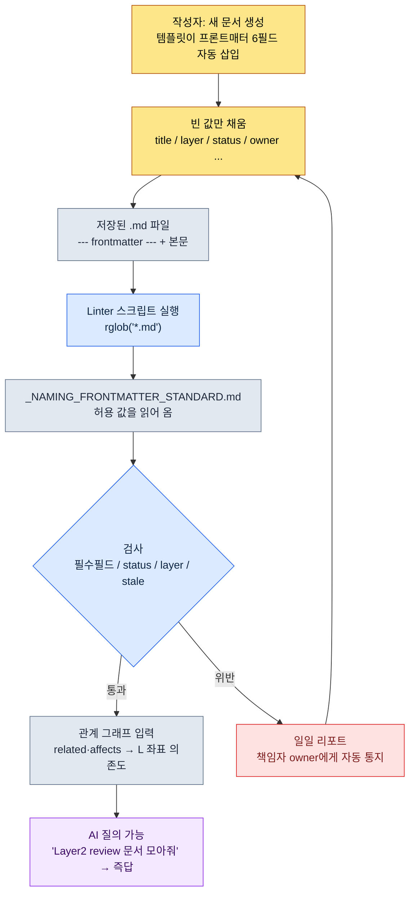

# 2.1 YAML 프론트매터 — 모든 문서를 데이터로

마일스톤 빌드를 하루 앞둔 밤, 시스템 기획자 팀원 A가 메신저로 물었다. "이번 주에 보상 곡선 건드린 문서가 몇 개죠? 검토 끝난 게 어디까지예요?" 나는 답을 알지 못했다. 문서는 폴더 어딘가에 있었고, 누가 마지막으로 손댔는지, 어느 마일스톤 것인지는 각자의 기억과 파일명 약속에 흩어져 있었다. 그날 밤 우리가 한 일은 문서 첫 줄에 여섯 줄을 입력하는 약속을 만든 것이었다. 그 여섯 줄이 다음 마일스톤부터 팀원 A의 질문에 사람이 폴더를 열지 않고도 답하게 만들었다.

문서 맨 위 `---` 사이에 적는 몇 줄의 YAML. 이걸 프론트매터라 부른다. 이 약속이, 본문을 한 글자도 읽지 않고 "이 문서가 무엇인지"를 사람과 기계 양쪽에 동시에 말해 준다. 이 장은 그 한 줄이 어떻게 정보 아키텍처 전체의 진입 좌표가 되는지를 실제로 돌아가는 스크립트로 따라간다.

미리 한 가지 용어만 짚는다. 이 책은 기획 문서를 다섯 개의 **Layer**로 나눈다(6장에서 본격적으로 다룬다). L0=세계관·콘셉트, L1=시스템 룰, L2=콘텐츠, L3=데이터, L4=구현 좌표. 위에서 아래로 의존하는 것이 정상 방향이다. 아래 절에 나오는 `layer: 2`는 "이 문서는 콘텐츠 Layer"라는 좌표 선언이다.

---

## 2.1.1 왜 "문서"가 아니라 "데이터로서의 문서"인가

전통적인 기획 문서는 워드, PPT, 구글 닥스 위에서 살아왔다. 본문은 사람이 읽기에 최적화돼 있다. 그런데 문서의 종류·책임·상태·위치 같은 메타 정보는 본문 안에 녹아 있거나, 폴더 구조와 파일명 약속에 의존한다. 그래서 "이 문서는 어느 마일스톤 것이고 누가 책임자이며 마지막 검토가 언제인가"를 알려면 본문을 열어 봐야 한다.

여기에 두 가지 한계가 겹친다. 첫째, 문서가 자기 정체를 스스로 말하지 않는다. 정체는 사람의 기억과 폴더 약속 안에 있고, 그 약속은 시간이 지나면 부식한다. 둘째, AI가 컨텍스트를 추론할 단서가 없다. Claude Code에 "이 문서 검토해 줘"라고 하면 본문을 처음부터 끝까지 읽으며 토큰을 낭비하고, 책임 범위가 어디까지인지도 모른다.

YAML 프론트매터는 이 둘을 한 번에 푼다. 문서 첫 줄에 메타데이터를 명시적으로 입력해 두면, 사람도 기계도 본문을 열지 않고 문서를 식별한다. 캐비닛 서랍 정면에 라벨이 붙어 있으면 서랍을 열지 않아도 안을 아는 것과 같다. 그리고 이 라벨은 단순한 분류 도구에 그치지 않는다. 뒤에서 보겠지만 `layer` 필드 하나가 절차적 생성과 자동 검수의 진입 좌표가 된다.

---

## 2.1.2 실제 프론트매터 — 한 문서의 첫 14줄

추상적인 예시 대신, 프로젝트 A의 보상 곡선 문서가 실제로 머리에 이고 있는 프론트매터를 그대로 본다(ID·실명만 가명 처리, 구조는 운영 그대로다).

```yaml
---
title: "메인 퀘스트 12장 보상 곡선"
layer: 2
status: review
owner: teammate_a
created: 2026-04-15
updated: 2026-05-20
related:
  - quest_main_chapter12
  - reward_curve_milestone_2
affects:
  - L3_BalanceSheet_v2
ip_check: passed
---

# 메인 퀘스트 12장 보상 곡선

(본문 시작)
```

핵심은 `---` 위와 아래의 분리다. 위는 파서가 읽는 데이터, 아래는 사람이 읽는 본문이다. 마크다운 렌더러는 보통 프론트매터를 숨기므로 읽을 때 방해받지 않는다. 한 파일이 데이터(frontmatter)와 콘텐츠(본문)를 함께 담아 단일 진실 출처가 된다.

`layer: 2`와 `affects: [L3_BalanceSheet_v2]`, 이 두 줄을 눈여겨봐야 한다. "이 콘텐츠(L2) 문서가 데이터 Layer(L3)의 밸런스 시트에 영향을 준다"는 선언이다. 이것만으로 도구는 L2→L3 의존 관계를 본문 없이 그래프로 그린다. 거꾸로 L3 데이터 문서가 L1 시스템 룰을 `depends_on`으로 참조하면(아래에서 위로 향하는 역방향 의존), 그건 설계 냄새다. 도구가 그 역참조를 자동으로 검출한다.

YAML이 JSON보다 손으로 쓰기 편한 이유는 단순하다. 들여쓰기로 구조를 표현하고, 따옴표가 거의 필요 없으며, `#` 주석을 쓸 수 있다. 기획자가 직접 채워 넣기에 적합하다.

---

## 2.1.3 표준은 어디에 사는가 — `_NAMING_FRONTMATTER_STANDARD`

필드는 무한정 늘릴 수 있다. 늘릴수록 작성 부담이 커지고 표준이 무너진다. 그래서 프로젝트 A는 두 층으로 나눠 운영한다. 모든 문서 공통의 최소 핵심 필드와, 분야별 도메인 확장 필드다.

공통 최소 핵심 필드는 여섯 개다.

| 필드 | 형식 | 용도 |
|------|------|------|
| `title` | 문자열 | 사람 가독 제목. 파일명과 달라도 됨 |
| `layer` | 0~4 | 6장 Layer 좌표 |
| `status` | draft / review / approved / archived | 문서 상태 |
| `owner` | 사용자명 | 책임자 (1인) |
| `created` | YYYY-MM-DD | 생성일 |
| `updated` | YYYY-MM-DD | 마지막 수정일 |

이 여섯 개만으로 문서의 신선도·책임·위치를 즉시 안다. 더 넣으려는 충동을 첫 한 달은 참는다. 운영하다 보면 어느 필드가 진짜 필요한지 자연스럽게 드러난다.

분야별 확장 필드는 도메인마다 다르다. 시스템 기획은 `depends_on`·`affects`, 전투 기획은 `combat_phase`·`anim_target`, 내러티브는 `world_region`·`chapter`, 밸런스는 `data_sheet`·`formula_id`를 즐겨 쓴다. 이 확장 필드들은 자유롭게 흩어지면 안 되므로, 단 하나의 표준 문서가 정식 이름·허용 값·예시를 못박는다. 그 문서가 `_NAMING_FRONTMATTER_STANDARD.md`다. 새 필드를 추가하려면 이 문서를 거쳐야 한다. 그리고 이 표준 문서 자체가 atom으로 등록돼 있어서, 문서명 앞에 Layer 번호를 강제하는 규칙(`docs_layer_numeric_prefix_naming` atom)과 같은 계열로 관리된다.

여기서 중요한 전환이 일어난다. 표준이 사람이 읽는 문서일 뿐이라면, 사람은 그걸 어긴다. 표준을 **기계가 읽는 데이터**로 만들면, 기계가 그걸 강제한다. 다음 절이 그 전환의 실제 코드다.

---

## 2.1.4 워크드 트랜스크립트 — 표준을 코드로 강제하기, 그리고 datetime 버그가 준 교훈

이제 "프로젝트 A의 모든 마크다운 문서가 프론트매터 표준을 지키는지 검사하는 Linter"를 Claude Code에 만들게 했다. 핵심 요구는 두 가지였다. 검사 항목(필수 필드 누락, status 비표준 값, layer 0~4 위반, review인데 90일 넘게 안 바뀐 문서)을 잡을 것, 그리고 **허용 값을 코드에 하드코딩하지 말고 표준 문서에서 읽어 올 것**. 이 분리가 핵심이다. 표준을 고치면 코드를 안 고쳐도 검사 기준이 바뀐다. (스크립트 전문과 직접 실행 절차는 이 장 끝 「따라하기」에 둔다.)

여기서 한 사건이 있었다. Claude가 처음 내놓은 코드는 STALE 검사에서 `today - fm["updated"]`로 날짜 차이를 계산하고, 주석에 "`updated: 2026-05-20`처럼 적혀 있으면 PyYAML이 `datetime.date`로 자동 파싱한다"고 달았다. 이 말은 절반만 맞다. 실제 문서에 돌리자 일부 파일에서 트레이스백이 떴다.

```
TypeError: unsupported operand type(s) for -: 'datetime.date' and 'str'
```

원인은 사람 손에 있었다. 어떤 작성자는 `updated: 2026-05-20`이라 적었고(date로 파싱됨), 어떤 작성자는 `updated: "2026-05-20"`이라 따옴표를 붙였다(문자열로 파싱됨). 표준이 날짜 형식을 못박지 않은 자리에서 사람의 손이 갈렸고, Claude는 한쪽만 가정했다. 나는 코드를 거부하고 "두 표기 모두 안전하게 date로 정규화하고, `updated`가 없는 경우도 걸러라"고 다시 요청했다. Claude는 입력 타입을 검사해 둘 다 `datetime.date`로 정규화하는 헬퍼를 끼워 넣었다(고친 블록도 「따라하기」 참조).

진짜 교훈은 코드 버그가 아니었다. **표준이 날짜 표기 형식을 못박지 않은 자리에서 사람 손이 갈렸다**는 것이다. 그래서 `_NAMING_FRONTMATTER_STANDARD.md`에 `updated: YYYY-MM-DD (따옴표 없이)` 한 줄을 추가했다. Linter가 코드를 검사하다가, 검사 대상인 표준 자체의 구멍을 드러낸 셈이다.

수정된 스크립트의 첫 출력은 깨끗하지 않았다. 실제로 나온 지저분한 결과를 그대로 둔다.

```
[NO-FM]   manuscript/legacy/old_combat_notes.md
[MISSING] manuscript/system/quest_flag_table.md: layer
[STATUS]  manuscript/content/town_intro.md: WIP
[LAYER]   manuscript/balance/dps_v2.md: None
[STALE]   manuscript/system/inventory_rules.md: 134d
```

이 다섯 줄이 도입 초기 팀의 실제 상태였다. 옛 문서엔 프론트매터가 아예 없고(`NO-FM`), 어떤 문서는 `layer`를 빠뜨렸고, 누군가는 `status: WIP`라는 비표준 값을 썼고, 밸런스 문서 하나는 `layer`를 `None`으로 비워 뒀고, 시스템 룰 문서 하나는 134일째 `review` 상태로 잠들어 있었다. 표준은 처음부터 지켜지지 않는다. Linter는 그 사실을 매일 아침 드러낼 뿐이다.

---

## 2.1.5 frontmatter에서 스크립트까지 — 흐름

위 워크드 트랜스크립트를 한 장의 흐름으로 압축하면 다음과 같다. 사람이 쓴 한 줄이 어떻게 기계의 검사 게이트까지 흘러가는지를 보여 준다.



핵심은 두 가지다. 첫째, 표준(E)이 스크립트(D)와 분리돼 있다. 표준을 고치면 코드를 안 고쳐도 검사 기준이 바뀐다. 둘째, 위반(H)은 막다른 길이 아니라 작성 단계(B)로 되돌아가는 루프다. 사람을 탓하는 게 아니라, 본인 문서를 본인이 고치게 되돌려 보낸다.

---

## 2.1.6 운영 사례 — 어느 중규모 팀의 6개월

저자가 디렉터로 운영하는 프로젝트 A는 약 6개월 전 프론트매터를 전 기획팀(4~5인)에 도입했다. 도입은 단번에 된 게 아니라 네 번의 마디를 거쳤다.

도입 1주차의 가장 큰 거부감은 "이걸 매번 손으로 쓰라고?"였다. 새 문서마다 여섯 줄을 외워 적는 건 번거롭다. 해결은 템플릿 자동 삽입이었다. VSCode 스니펫, 옵시디언 템플릿, 기획 포탈의 "새 문서" 버튼이 빈 YAML 블록을 자동으로 끼워 준다. 작성자는 빈 값만 채운다. 거부감이 1주일 안에 사라졌다.

1개월차엔 표준 충돌이 터졌다. 여러 명이 자유롭게 필드를 추가하면서 `owner`·`responsible`·`author`가 동시에 나타났다. 같은 개념인데 표기가 셋이라 검색도 자동화도 깨졌다. 해결은 `_NAMING_FRONTMATTER_STANDARD.md` 한 문서로 모든 필드의 정식 이름·허용 값·예시를 정리하고, 새 필드 추가를 이 문서 경유로 룰화한 것이었다. 한 달 안에 표준이 안정됐다.

3개월차엔 2.1.4에서 본 Linter가 들어왔다. 표준이 있어도 사람은 어긴다. 그래서 매일 아침 정합성 리포트가 자동 생성돼 팀 메신저의 공용 채널에 떨어지게 했다. 책임자는 본인 문서만 보면 된다. 자동화 이후 표준 위반이 눈에 띄게 줄었다(저자 추정, 정밀 측정값 아님 — 대략 절반 이하로 체감).

6개월차엔 AI와의 결합이 빛을 냈다. 표준이 안정되자 다음 같은 질의가 즉답으로 돌아왔다.

- "최근 2주 동안 업데이트된 Layer 2 문서 중 status가 review인 것 다 모아 줘"
- "내가 owner인 모든 문서의 상태 변화 타임라인 그려 줘"
- "이 변경 요청이 영향 주는 다른 문서 목록 뽑아 줘" — `related`·`affects` 그래프를 따라 자동으로

결국 프론트매터는 사람과 AI 사이의 공용 어휘가 됐다. 사람이 쓰면 AI가 이해하고, AI가 쓰면 사람이 검증한다. 둘 다 같은 키를 본다. 다만 1주차의 거부감, 1개월차의 충돌, 3개월차의 Linter, 6개월차의 결합 — 누적된 6개월이 만든 결과지 한 번에 생긴 건 아니다.

---

## 2.1.7 흔한 실수와 회피법

도입 초기에 반복되는 실수는 다섯 가지로 묶인다. 모두 같은 뿌리 — "표준을 사람의 의지에만 맡긴 자리" — 위에 서 있다.

| 실수 | 사고 원인 | 회피법 |
|---|---|---|
| 필드를 처음부터 너무 많이 정의 | 작성자가 빈 값 채우다 지쳐 품질 저하 | 핵심 6개로 시작, 1~2개월 후 자주 쓰는 것만 추가 |
| 필드 이름이 계속 바뀜 (`tag`→`tags`→`category`) | 옛 이름이 누적 문서에 남아 검색·자동화가 깨짐 | 명명 변경 시 마이그레이션 스크립트 동반. 옛 이름 발견 시 자동 변환 또는 경고 |
| 사람이 매번 손으로 적음 | 오타·필드 누락·날짜 표기 분기(2.1.4의 그 버그)가 일상화 | 템플릿·스니펫·"새 문서" 자동화 우선. 사람 손은 의미 있는 값에만 |
| 표준만 두고 검증 없이 방치 | 표준이 있어도 누가 어겼는지 모르고 자연 부식 | Linter + 일일 자동 리포트로 위반자 본인이 고치게 함 |
| `layer` 필드를 잊음 | Layer 좌표가 없으면 분야 간 가시성·검수 게이트 둘 다 못 생김 | `layer`를 필수 필드로 강제. Linter가 누락 검출 |

다섯 실수를 첫날부터 다 막을 필요는 없다. 1·3번은 도입 1주차에 회피 패턴을 잡아 두고, 2·4·5번은 운영하면서 본인 팀이 가장 자주 부딪히는 자리부터 차례로 끼워 넣는 편이 자연스럽다.

---

## 2.1.8 작은 시작 — 3주 안에 정착시키기

프론트매터 도입은 의외로 가벼운 작업이다. 3주면 한 팀 안에 자리를 잡는다.

첫 주에는 핵심 여섯 필드를 정의하고 템플릿을 만들어 새 문서에만 적용해 작성 부담을 최소화한다. 둘째 주에는 자주 보는 상위 20개 문서에 수동 적용해, 실제 사용에서 어떤 필드가 부족한지 점검한다. 셋째 주에 Linter와 일일 리포트를 가동하면, 그때부터 표준은 사람의 의지가 아니라 도구의 힘으로 유지된다.

기존 문서 전체를 한 번에 마이그레이션하지 않는다. 자주 보는 것부터, 새 문서부터 적용한다. 6개월쯤 지나면 거의 모든 문서에 프론트매터가 붙는다. 그렇다고 100%가 목표는 아니다. 한 번도 안 열어 본 옛 문서까지 마이그레이션하느라 시간을 쓰는 건 낭비다.

---

## 따라하기

가장 작은 단위로, 한 번의 사이클을 직접 돌려 봅니다.

**setup**
- 작업 폴더에 검사 대상 `.md` 문서를 2~3개 둡니다. 일부는 일부러 `layer`를 빼거나 `status: WIP` 같은 비표준 값을 넣어 둡니다.
- 같은 폴더에 표준 문서 한 줄을 둡니다.
  ```
  status: allowed = ["draft", "review", "approved", "archived"]
  updated: YYYY-MM-DD (따옴표 없이)
  ```

**prompt** (Claude Code에 입력)
> 이 폴더 아래 모든 .md의 YAML 프론트매터를 검사하는 파이썬 스크립트를 써 줘. 필수 필드 title·layer·status·owner 누락, status 허용 값 위반(표준 문서에서 읽어 와), layer 0~4 정수 위반, review인데 updated가 90일 초과를 잡아 줘. `updated`가 문자열로 와도 date로 와도 안전하게 처리하고, 위반을 파일별로 출력해 줘.

**verify**
- 스크립트를 돌려 일부러 심은 위반이 전부 잡히는지 확인합니다.
- 표준 문서의 `allowed` 목록에 `WIP`를 추가한 뒤 다시 돌려, 코드를 한 줄도 안 고쳤는데 `status: WIP`가 통과로 바뀌는지 확인합니다. 표준과 코드가 분리됐다는 증거입니다.
- `updated`에 따옴표를 붙인 문서와 안 붙인 문서를 둘 다 넣고, 2.1.4에서 본 `TypeError`가 안 나는지 확인합니다.

**참고: Linter 스크립트 전문**

2.1.4에서 Claude가 처음 내놓은 코드다. STALE 검사 줄(`age = (today - fm["updated"]).days`)에 datetime 버그가 그대로 들어 있다.

```python
import sys, datetime, pathlib, re
import yaml  # PyYAML

ROOT = pathlib.Path("manuscript")
STANDARD = pathlib.Path("_NAMING_FRONTMATTER_STANDARD.md")
REQUIRED = ["title", "layer", "status", "owner"]

def load_allowed_status(standard_path):
    # 표준 문서에서 `status` 허용 값을 추출
    text = standard_path.read_text(encoding="utf-8")
    m = re.search(r"status:\s*allowed\s*=\s*\[(.*?)\]", text)
    if not m:
        return ["draft", "review", "approved", "archived"]
    return [s.strip().strip('"').strip("'") for s in m.group(1).split(",")]

def parse_frontmatter(md_path):
    text = md_path.read_text(encoding="utf-8")
    if not text.startswith("---"):
        return None
    end = text.find("---", 3)
    block = text[3:end]
    return yaml.safe_load(block)

def main():
    allowed = load_allowed_status(STANDARD)
    today = datetime.date.today()
    violations = 0
    for md in ROOT.rglob("*.md"):
        fm = parse_frontmatter(md)
        if fm is None:
            print(f"[NO-FM]   {md}")
            violations += 1
            continue
        for field in REQUIRED:
            if field not in fm:
                print(f"[MISSING] {md}: {field}")
                violations += 1
        if fm.get("status") not in allowed:
            print(f"[STATUS]  {md}: {fm.get('status')}")
            violations += 1
        if not isinstance(fm.get("layer"), int) or not (0 <= fm.get("layer") <= 4):
            print(f"[LAYER]   {md}: {fm.get('layer')}")
            violations += 1
        if fm.get("status") == "review":
            age = (today - fm["updated"]).days   # ← 여기가 깨진다
            if age > 90:
                print(f"[STALE]   {md}: {age}d")
                violations += 1
    sys.exit(violations)
```

재요청 후 고쳐 온 핵심 블록. `updated`가 문자열로 와도 date로 와도 안전하게 정규화한다.

```python
def as_date(v):
    if isinstance(v, datetime.date):
        return v
    if isinstance(v, str):
        return datetime.date.fromisoformat(v.strip())
    return None

# main() 안의 STALE 검사 교체분
if fm.get("status") == "review":
    upd = as_date(fm.get("updated"))
    if upd is None:
        print(f"[MISSING] {md}: updated")
        violations += 1
    elif (today - upd).days > 90:
        print(f"[STALE]   {md}: {(today - upd).days}d")
        violations += 1
```

### 1인 축소판

팀이 없어도 됩니다. 혼자 쓰는 메모 폴더에서, 핵심 필드를 `title`·`status`·`updated` 셋으로 줄이고, Linter는 "status가 review인데 updated가 30일 넘은 문서"만 잡게 합니다. 이것만으로도 "내가 검토하다 만 채 잊어버린 문서"가 매주 한 번 수면 위로 떠오릅니다. 표준-템플릿-검사의 삼각형은 1인 규모에서도 그대로 작동합니다.

---

### 이 챕터의 핵심 메시지
- 프론트매터 한 줄은 본문을 안 읽고 문서를 식별하는 가장 작은 데이터 벽돌이다
- 표준을 코드에서 분리해 문서로 두면, 코드를 안 고치고도 검사 기준을 바꾼다
- `layer` 한 필드가 절차적 생성과 자동 검수의 진입 좌표가 된다
