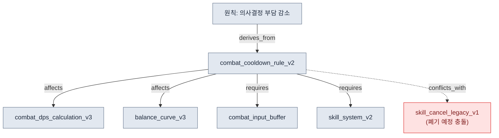
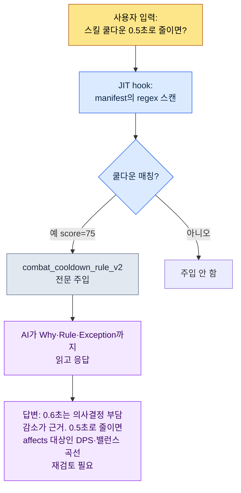

# 2.2 페이지별 Atom — 1 문서 1 결정의 해부

신입이 들어온 첫 주, 그가 채팅으로 물었다. "전투 쿨다운이 0.6초 맞나요? 어디 문서에 적혀 있죠?" 나는 "스킬 시스템 GDD(Game Design Document, 상세 사양서)에 있어요"라고 답했다. 그가 다시 물었다. "그 GDD 어느 섹션이요? 클래스 설계 다음에 데미지 곡선, 그 뒤 UI 표시 방식까지 220줄인데요." 파일을 열어 직접 찾아 줬다. 137번째 줄이었다. 그가 마지막으로 물었다. "근데 왜 0.6초예요? 0.5는 안 됐나요?" 그 답은 어느 문서에도 없었다. 6개월 전 회의에서 정한 건 기억나는데, 이유는 회의록 어딘가에 묻혀 있었다.

이 5분짜리 대화 안에 220줄 통합 문서의 세 가지 실패가 다 들어 있다. 위치를 못 찾고(검색 실패), 이유가 없고(맥락 소실), 매번 사람이 중개해야 한다(자동화 불가). AI에게 같은 질문을 던지면 사정은 더 나쁘다. AI는 220줄을 전부 읽고 나서, 쿨다운과 무관한 데미지 곡선 얘기까지 섞어 답한다.

이 장의 처방은 단순하다. **한 문서에는 한 결정만 담는다.** 이 원칙으로 잘게 쪼갠 결정 단위 문서를 atom이라 부른다. 220줄 GDD를 쪼개면 "쿨다운은 0.6초"가 하나의 atom이 되고, 그 atom 안에 위치·내용·이유·예외·관계가 한자리에 모인다. 이 장은 추상론 대신 실제 atom 한 개를 끝까지 해부한다. 어떻게 명명하고, 어떤 frontmatter를 입력하고, 관계를 어떻게 명시하며, 그 결과 AI가 어떻게 그 atom 하나만 정확히 집어내는지를.

---

## 2.2.1 검체 하나를 고른다 — `combat_cooldown_rule_v2`

해부할 검체는 프로젝트 A에서 실제 운영 중인 atom 한 개다. 이름은 `combat_cooldown_rule_v2`. 파일 전문은 다음과 같다. 길지 않다. 한 결정만 담았으니까.

```markdown
---
name: combat_cooldown_rule_v2
title: "전투 쿨다운 규칙 — v2"
type: rule
layer: 1
status: approved
owner: 이민수
created: 2026-03-10
updated: 2026-05-12
applies_to: [skill_system, item_system]
---

# 전투 쿨다운 규칙 v2

Why (왜): 동시 사용 가능한 스킬 수를 제한해 순간 의사결정 부담을
줄이고, 콤보 입력의 의미를 보존하기 위함.

Rule (규칙): 모든 액티브 스킬은 글로벌 쿨다운 0.6초 + 개별
쿨다운(스킬별 정의)을 갖는다. 글로벌 쿨다운 진행 중에는 어떤
액티브 스킬도 시전 불가.

How to apply (적용):
- 신규 스킬 정의 시 개별 쿨다운을 반드시 명시
- L3_SkillSheet의 cooldown 컬럼이 0이면 본 규칙 위반
- 빌드 단계 정합성 검사가 위반을 자동 검출

Exceptions (예외):
- 패시브 스킬은 본 규칙 미적용
- 궁극기는 별도 게이지 시스템 (See: [[ultimate_gauge_system]])

Relations (관계):
- affects: [[combat_dps_calculation_v3]], [[balance_curve_v3]]
- derives_from: [[principle_decision_load_reduction]]
- conflicts_with: [[skill_cancel_rule_legacy_v1]]
- requires: [[combat_input_buffer_system]], [[skill_system_v2]]
- is_a: rule
- part_of: combat_system_master
```

이 파일 한 장을 다섯 부위로 갈라 본다. 명명, frontmatter, 단일 결정, 관계, 추적가능성. 다섯 부위가 다 갖춰져야 AI가 이 atom을 "혼자서도 말이 되는 단위"로 읽는다.

---

## 2.2.2 부위 ① 명명 — 이름 자체가 좌표다

파일 이름은 `combat_cooldown_rule_v2`다. 무심코 지은 이름이 아니라 세 토막의 구조를 가진다.

```
combat_         cooldown_rule          _v2
└ prefix        └ 결정 본문            └ 버전
  (어느 도메인)   (무엇에 대한 결정)     (몇 번째 개정)
```

prefix `combat_`는 "이건 전투 도메인의 결정"이라는 좌표다. 프로젝트 A의 규칙 atom은 prefix로 도메인이 갈린다. `quest_`(퀘스트), `data_`(데이터 운영), `docs_`(문서 운영), `meeting_`(회의록), `portal_`(기획 뷰어). prefix만 봐도 이 결정이 누구 책임 영역인지, 어디서 영향을 받는지가 잡힌다.

명명이 흔들리면 모든 게 흔들린다. 같은 결정이 `skill-cooldown.md`와 `cooldown_skill_v2.md`로 두 번 존재하면, 검색도 깨지고 뒤에 나올 JIT 매칭도 깨진다. 그래서 프로젝트 A는 명명 규칙 자체를 하나의 atom으로 먼저 고정했다. `atom_naming_convention_v1`이 그것이고, snake_case·prefix 필수·버전 suffix를 강제한다. 그리고 이 규칙은 사람의 의지가 아니라 Linter가 지킨다. prefix 없는 파일명이 커밋되면 빌드 단계에서 걸린다.

명명에는 책 전체를 관통하는 더 큰 설계가 깔려 있다. frontmatter의 `layer: 1`이 그 두 번째 좌표다. prefix가 "어느 도메인"을 말한다면, Layer는 "어느 추상 계층"을 말한다. 두 좌표가 결합해야 atom의 위치가 평면 위 한 점으로 확정된다. 여기서 Layer는 좌표일 뿐이다(0\~4 계층 정의의 상세는 2.3). 쿨다운 규칙은 "생성을 통제하는 입력 규칙"이므로 Layer 1에 앉는다. 이 Layer 좌표를 문서명 앞에 숫자 prefix로 강제하는 규칙도 따로 있다 — `docs_layer_numeric_prefix_naming`. 이름 하나에 두 개의 좌표축이 명시되어 있는 셈이다.

이 설계의 본질은 정리벽이 아니다. 내가 팀에 반복해서 한 말이 있다. **"절차적 생성을 위해서 나눈 Layer였던 거고."** atom마다 도메인 좌표(prefix)와 계층 좌표(Layer)가 명시되어 있으면, 나중에 AI가 "Layer 1의 combat 규칙 전부를 입력으로 받아 Layer 2 콘텐츠를 자동 생성"하는 게 가능해진다. 이름은 그 자동화의 주소 체계다.

---

## 2.2.3 부위 ② frontmatter — 기계가 읽는 라벨

본문 위 `---` 사이의 YAML 블록이 frontmatter다. 2.1에서 다룬 표준을 atom에 그대로 적용한 것이고, 사람이 아니라 기계(빌드 스크립트·JIT hook·관계도 생성기)가 읽는 라벨이다.

| 필드 | 값 | 기계가 이걸로 하는 일 |
|---|---|---|
| `name` | combat_cooldown_rule_v2 | 다른 atom의 link 대상이 되는 고유 ID |
| `type` | rule | 카테고리별 통계·필터 (rule / concept / decision …) |
| `layer` | 1 | Layer별 색상·정렬, 거꾸로참조 검출의 기준축 |
| `status` | approved | draft·approved·archived 중 approved만 빌드 포함 |
| `applies_to` | [skill_system, item_system] | 영향 범위 — 이 규칙이 닿는 시스템 |
| `created`/`updated` | 2026-03-10 / 2026-05-12 | 변경 추적, 오래된 atom 점검의 기준일 |

이 라벨들이 입력되어 있으면 자동 검사가 가능해진다. 예를 들어 `layer: 1`로 선언된 시스템 규칙이 본문에서 `[[L3_SkillSheet_row_0042]]` 같은 데이터 atom(Layer 3)을 직접 참조하면, 그건 상위 계층이 하위 계층의 구체값에 묶인 **거꾸로참조(L3→L1)**다. 프로젝트 A는 이 패턴을 빌드 단계에서 자동 검출한다. 규칙은 데이터 한 행이 아니라 데이터의 형식을 참조해야 하기 때문이다. frontmatter의 `layer` 한 줄이 없으면 이 검사 자체가 성립하지 않는다.

`status: archived` 처리도 frontmatter의 일이다. 결정이 바뀌면 atom은 삭제되지 않고 `status: archived` + `archived_at` 날짜를 받는다. 빌드와 JIT는 archived atom을 제외한다. 기록은 남기되 현역에서는 빠지는 것이다. 프로젝트 A의 6개월 운영에서 폐기율은 약 15%였다(저자 실측). 이 비율이 0%에 가깝다면 폐기 워크플로가 작동하지 않는다는 신호로 읽는다.

---

## 2.2.4 부위 ③ 단일 결정 — 한 문장으로 요약되는가

atom 해부의 핵심은 본문이 결정 하나만 담았는지 확인하는 것이다. 검사법은 단순하다. **이 atom의 결정을 한 문장으로 요약해 보라.**

> "모든 액티브 스킬은 글로벌 쿨다운 0.6초를 갖는다."

한 문장으로 끝난다. 합격이다. 만약 요약이 "쿨다운은 0.6초이고, 콤보 중에는 50% 단축된다"처럼 두 문장이 되면, 그건 두 결정이다. `combat_cooldown_rule_v2`(기본 쿨다운)와 `combat_combo_cooldown_reduction_v1`(콤보 단축)으로 쪼갠다.

단일성을 보는 보조 검사가 두 개 더 있다.

**독립 폐기 검사.** 이 atom 하나만 폐기해도 시스템이 무너지지 않는가? 쿨다운 규칙을 폐기하면 전투 밸런스가 흔들리지만 시스템은 돈다. 단위가 맞다. 반대로 폐기 시 다른 다섯 개가 함께 무너진다면, 그 다섯은 사실 한 결정의 다섯 조각이다. 더 큰 atom으로 합쳐야 한다.

**단일 참조 검사.** 다른 곳에서 `[[combat_cooldown_rule_v2]]` 하나만 link로 걸어도 의미가 통하는가? 통한다면 단위가 맞다. 이 한 줄을 참조하려고 본문 여러 곳을 다 읽어야 한다면 아직 덜 쪼개진 것이다.

이 검사들을 통과한 본문은 자연히 다섯 섹션으로 정렬된다 — Why, Rule, How, Exceptions, Relations. 특히 **Why를 지우지 마라.** 앞 도입에서 신입이 마지막에 물은 "왜 0.6초예요?"의 답이 여기 있다 — "순간 의사결정 부담을 줄이고 콤보 입력의 의미를 보존하기 위함." 6개월 뒤 누가 "0.5초로 줄이자"고 제안할 때 이 한 줄이 토론의 출발점이 된다. Why가 사라진 atom은 아무도 손대지 못하는 화석이 된다.

---

## 2.2.5 부위 ④ 관계 — 화살표가 영향 분석을 만든다

atom 맨 아래 Relations 섹션이 이 검체를 고립된 메모가 아니라 그래프의 한 노드로 만든다. 핵심은 그냥 "관련 문서"가 아니라 **관계의 종류를 명시**한다는 점이다.



여섯 종류의 관계가 각자 다른 일을 한다.

- `derives_from`: 이 결정이 어떤 상위 원칙에서 파생됐는가. 쿨다운 0.6초는 "의사결정 부담 감소"라는 원칙의 구체화다.
- `affects`: 이 atom이 바뀌면 무엇이 영향받는가. 0.6초를 0.5초로 바꾸면 DPS 계산과 밸런스 곡선이 흔들린다. **변경 전에 영향 범위를 자동으로 뽑을 수 있다.**
- `requires`: 이 결정이 성립하려면 무엇이 먼저 있어야 하는가. 입력 버퍼 시스템이 없으면 글로벌 쿨다운이 입력을 먹어 버린다.
- `conflicts_with`: 무엇과 모순되는가. 구버전 스킬 캔슬 규칙과 충돌하며, 이 링크가 "둘 중 하나는 폐기돼야 한다"는 신호다.
- `is_a` / `part_of`: 분류(rule)와 소속(combat_system_master). 그래프의 골격.

단순한 "Related: [문서A], [문서B]" 링크였다면 사람이 일일이 따져야 한다. 관계 유형이 enum으로 입력되어 있으면 기계가 따진다. "이 atom을 바꾸면 영향받는 것 다 보여 줘"는 `affects`를 따라가는 자동 쿼리가 되고, "지금 서로 모순되는 규칙 다 찾아"는 `conflicts_with`를 스캔하는 자동 검사가 된다. 이 여섯 enum의 본격적 온톨로지 설계는 2.4에서 다루고, 2.2는 atom 표준이 그 enum을 미리 적용한 형태라는 점만 짚는다.

관계 화살표는 관계도 생성 도구의 입력이기도 하다. 프로젝트 A의 `gen_relation_map.py`는 모든 atom의 frontmatter `layer`와 Relations 섹션을 읽어, Layer별로 색을 칠한 인터랙티브 관계도 HTML을 자동으로 그린다. atom 하나하나가 좌표(Layer)와 화살표(Relations)를 갖고 있기 때문에 가능한 일이다.

---

## 2.2.6 부위 ⑤ 추적가능성 — 한 atom이 막은 30분

다섯 부위가 다 갖춰진 atom은 추적 가능하다. 누가·언제·왜 이 결정을 했고, 무엇을 위반으로 잡는지가 한자리에 있다. 추적가능성의 가치는 통계가 아니라 실제로 막아 낸 사건으로 보일 때 가장 선명하다.

프로젝트 A의 `meeting_image_caption_standard` atom은 회의록 첨부 이미지에 "어떤 화면인지·왜 첨부했는지·무슨 결정인지"를 캡션으로 반드시 명시하라는 규칙이다. 이 atom이 없던 시절, 한 회의록에 스크린샷이 캡션 없이 붙었고, 일주일 뒤 그걸 본 팀원이 "이게 무슨 화면이지?"를 작성자에게 확인하는 데 30분이 걸렸다. atom이 생긴 뒤 같은 누락이 재발했을 때는 빌드 단계 Linter가 캡션 없는 이미지를 자동으로 잡았다. 수정까지 5분. 30분이 5분이 됐다.

또 다른 검체 `skill_listing_budget_wrapper_only_policy`는 글로벌 슬래시 명령 슬롯을 12개로 제한하고, 본체 스킬은 별도 디렉토리에 두되 글로벌에는 wrapper 12개만 노출하라는 규칙이다. 박제되기 전엔 글로벌 슬래시 명령이 40개 가까이 불어나 세션 시작마다 토큰 예산을 갉아먹었다. atom 정의 뒤로는 자동 정리 도구가 매 세션 시작 시 초과분을 정리한다. 규칙이 사람의 기억이 아니라 도구로 집행되는 것이다.

이런 atom이 프로젝트 A에는 약 304개 쌓여 있다(저자 실측, 6개월 운영 시점). 분포의 큰 갈래만 보면 재발 방지 규칙(rule)이 가장 큰 비중이고, 그다음이 일회성 의사결정 박제(decision)·도메인 개념(concept)·협업 교정(feedback) 순이다. 한 atom이 막는 시간은 분 단위지만, 304개가 쌓이면 누적 절약은 일 단위로 넘어간다. 이게 atom을 "정리"가 아니라 "자산"이라 부르는 이유다.

---

## 2.2.7 해부를 자동 주입으로 — JIT의 실제 동작

지금까지 atom 한 개를 정적으로 해부했다. 이제 살아 움직이는 순간을 본다. 1.3의 JIT(Just-In-Time) hook은 입력 키워드에 매칭되는 atom만 골라 그 자리에서 컨텍스트에 주입한다. JIT manifest는 각 atom에 매칭 키워드와 점수를 매핑한 JSON이다.

```json
{
  "name": "combat_cooldown_rule_v2",
  "path": "atoms/combat/combat_cooldown_rule_v2.md",
  "regex": "쿨다운|cooldown|글로벌 쿨다운|GCD",
  "score": 75
}
```

실제 주입은 이렇게 흐른다.



핵심은 마지막 칸이다. AI는 단지 "0.6초였다"고 답하지 않는다. atom의 Why를 읽었으니 근거를 대고, Relations의 `affects`를 읽었으니 변경 시 흔들릴 대상(DPS 계산·밸런스 곡선)까지 미리 짚는다. 잘게 쪼개고, 이유를 적고, 관계를 명시해 둔 다섯 부위가 전부 응답에 살아난다.

여기서 단일 결정 원칙이 자동화의 전제임이 드러난다. 만약 이 atom이 220줄 통합 GDD였다면, "쿨다운" 한 단어가 매칭되는 순간 클래스 설계·데미지 곡선·UI까지 통째로 주입되어 토큰 예산이 깎이고, AI는 다섯 결정 중 어디에 답할지 초점을 잃는다. **atom이 작고 명확할수록 JIT 정확도가 올라간다. 잘게 쪼갠 상태는 정리의 미덕이 아니라 자동 주입의 전제 조건이다.**

score는 컨텍스트 예산을 지키는 장치다. 한 입력에 여러 atom이 매칭되면 score 상위 N개만 주입한다(기본 3개). 점수 부여 기준은 운영하며 정한다.

- 안전·보안·건강 관련 atom = 95\~99 (절대 누락 금지)
- 핵심 메시지·철학 atom = 90\~94
- 도메인 핵심 규칙 = 75\~89 (쿨다운 규칙이 여기, 75)
- 참고용·이력 atom = 30\~50

---

## 2.2.8 개인 atom과 팀 공유 atom — 두 층의 분리

해부한 검체 `combat_cooldown_rule_v2`는 `status: approved`를 받은 팀 공유 atom이다. 모든 atom이 처음부터 이 자리에 오지는 않는다. 프로젝트 A는 atom을 두 층으로 나눈다.

- **개인 atom** — 미확정 가설·개인 메모·시점 박제. 본인만 본다. 표준이 느슨하다.
- **팀 공유 atom** — 검증된 규칙. 전 팀원이 본다. 명명·구조·승인 절차를 통과해야 한다.

분리하는 이유는 심리적이다. 개인 atom이 자유로워야 검증 전 가설을 부담 없이 적고, 일주일 뒤 폐기할 수 있다. 처음부터 팀에 공개되면 "이거 틀리면 어쩌지" 싶어 아예 안 적게 된다. 반대로 팀 공유 atom은 엄격해야 전원이 신뢰하고 참조한다.

`combat_cooldown_rule_v2`도 처음엔 개인 atom의 "쿨다운 0.6초 테스트해 보자"는 한 줄 메모였을 것이다. 알파 빌드에서 검증된 뒤 변경 요청 형태로 팀 공유로 승격됐고, 다른 기획자의 리뷰를 거쳐 `approved`가 됐다. 이 개인→팀 승격 흐름 자체가 atom 시스템이 시간을 따라 똑똑해지는 self-improving 루프의 한 축이다.

---

## 2.2.9 흔한 실수 다섯 가지

atom 운영 초기에 반복되는 실수는 다섯으로 정리된다. 모두 "atom을 자산이 아니라 일회성 메모로 다뤘다"는 같은 뿌리에서 나온다.

| 실수 | 무엇이 깨지는가 | 회피법 |
|---|---|---|
| 첫 주에 너무 많이 만듦 | 미검증 atom이 쌓여 운영이 무너짐 | 검증된 한두 개부터, 자연 증가에 맡김 |
| 폐기를 안 함 | 낡은 atom이 JIT에 계속 매칭돼 오답 생성 | 분기 점검, `status: archived` + `archived_at` |
| 너무 추상적/구체적 | "좋은 디자인을 한다"는 검증 불가, 잡상 한 줄은 무의미 | "사거리는 0.5/1.5/3.0/5.0만" 수준으로 |
| 이름이 일관되지 않음 | 검색·JIT 매칭이 통째로 깨짐 | 명명 규칙 atom을 먼저 만들고 Linter로 강제 |
| Why를 안 적음 | 시간이 지나면 아무도 못 건드리는 화석이 됨 | Why·Rule·How·Exception·Relations 5섹션 강제 |

다섯 가지를 첫 달부터 완벽히 피할 필요는 없다. 1번과 4번은 명명 규칙 atom 하나로 같이 풀리고, 2·3·5번은 운영 3개월 시점에 분기 점검을 한 번 돌리면 자연스럽게 정렬된다.

---

## 2.2.10 다음 장으로

이 장에서 atom 한 개를 다섯 부위로 갈라 봤다. 이름(좌표), frontmatter(기계 라벨), 단일 결정(한 문장 검사), 관계(영향 분석), 추적가능성(막아 낸 30분). 그리고 그 다섯 부위가 JIT 자동 주입에서 어떻게 통째로 살아나는지 확인했다.

이름에 명시된 두 좌표 중 하나인 `layer: 1`을 2.2는 슬쩍 짚고 넘어갔다. 2.3이 그 Layer를 정면으로 다룬다. atom마다 Layer 좌표를 부여하면 분야가 달라도 서로의 산출물이 어디 앉아 있는지 보이기 시작한다. 그리고 2.4는 이 장에서 enum 이름만 빌려 쓴 여섯 관계(affects·derives_from·conflicts_with·requires·is_a·part_of)를 온톨로지로 정식화한다. YAML(2.1) → Atom(2.2) → Layer(2.3) → Ontology(2.4)로 이어지는 정보 아키텍처의 뼈대 중, 이 장은 그 두 번째 마디였다.

---

### 이 챕터의 핵심 메시지
- atom 한 개는 이름·frontmatter·단일 결정·관계·추적가능성 다섯 부위의 합이다
- 단일 결정 원칙은 정리벽이 아니라 JIT 자동 주입의 전제 조건이다
- 이름에 명시된 도메인·Layer 두 좌표는 절차적 생성의 주소 체계가 된다

---

## 따라하기 — atom 하나 만들어 JIT로 주입하기

**setup.** 작업 폴더에 `atoms/` 디렉토리를 만들고, 명명 규칙 atom(`atom_naming_convention_v1`)을 가장 먼저 작성하세요. snake_case·prefix 필수·버전 suffix 세 줄만 적어도 됩니다. JIT를 쓴다면 `_jit_manifest.json` 빈 배열을 하나 둡니다.

**prompt.** 본인이 매번 잊는 결정 하나를 골라, 아래 프롬프트로 atom 초안을 받으세요.

> "다음 결정을 atom 표준 형식으로 만들어 줘. 결정: '액티브 스킬은 글로벌 쿨다운 0.6초를 갖는다.' 섹션은 Why·Rule·How to apply·Exceptions·Relations 다섯 개. frontmatter에 name(snake_case+prefix), type, layer, status: draft, owner, created를 넣어 줘. 결정이 한 문장으로 요약되는지도 마지막에 확인해 줘."

**verify.** 받은 atom을 세 가지로 검사하세요. ① 결정이 한 문장으로 요약되는가(안 되면 쪼갭니다). ② Why가 비어 있지 않은가. ③ manifest에 `{"name", "path", "regex", "score"}` 한 줄을 추가하고, 그 regex 키워드를 실제 입력으로 던졌을 때 atom이 주입되는가. 세 개를 통과하면 첫 atom이 완성된 것입니다.

---

## 1인 축소판

팀도 Linter도 빌드 파이프라인도 없는 1인 개발자라면, 이 장 전체를 노트 앱 폴더 하나로 줄일 수 있습니다.

- **명명**: 파일명을 `domain_decision_v1` 한 규칙으로 통일하세요. Linter 대신 본인 눈으로 지킵니다.
- **단일 결정**: 노트 한 장에 결정 하나. 제목을 한 문장으로 못 쓰겠으면 두 장으로 쪼갭니다.
- **Why 필수**: 노트 맨 위 한 줄에 "왜 이렇게 정했는가"를 적으세요. 이 한 줄이 6개월 뒤의 본인을 구합니다.
- **관계**: 정식 enum 대신 `→ 영향:`, `↑ 근거:`, `✕ 충돌:` 세 표시만 써도 영향 추적의 9할이 삽니다.
- **JIT 대용**: manifest 대신, 작업 시작 전 관련 노트 1.2\~1.3을 직접 열어 AI에게 붙여 넣으세요. 수동 JIT입니다.

핵심은 도구가 아니라 다섯 부위의 습관입니다. 처음 10개 노트가 가장 어렵고, 그 고비를 넘기면 다음 100개는 손이 알아서 만듭니다.
