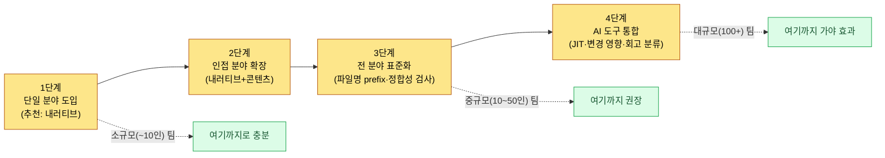

# 2.3 Layer 설계 — 게임 시스템 추상화

분야가 셋에서 여덟으로 늘던 분기였다. 전투 기획자가 스킬 사거리를 8m로 확정했다. 같은 주, 레벨 디자이너는 던전 통로 폭을 6m로 잠갔다. 둘 다 자기 분야 안에서 완벽하게 합리적인 결정이었다. 문제는 3주 뒤 빌드에서 드러났다. 광역 스킬이 통로 벽을 뚫고 나가 적이 보이지도 않는 곳에서 죽었다. 누구의 실수도 아니었다. 두 사람은 서로의 결정을 들여다볼 창문이 없었을 뿐이다.

이 장은 그 창문을 만드는 이야기다. 각 분야가 자기 방을 그대로 가진 채, 옆방에서 무슨 일이 일어나는지 좌표 하나로 알 수 있게 하는 것. 그 좌표계를 Layer라고 부른다.

---

## 2.3.1 사일로화 — 매번 다시 마주치는 적

게임 기획은 분야가 잘게 분화돼 있다. 시스템·전투·내러티브·콘텐츠·레벨·밸런스·UX·QA. 각 분야는 자기 도구·산출물·회의를 갖는다. 규모가 커질수록 저마다 자기 영역에 깊이 들어가, 다른 분야가 무엇을 하는지 모르는 상태가 된다. 이를 사일로(silo)화라 한다.

사일로화의 비용은 시간이 지나서야 드러난다.

- 전투 기획이 결정한 스킬의 사거리가 레벨 디자인의 통로 폭과 맞지 않는다.
- 내러티브가 설계한 NPC 동기가 콘텐츠 기획의 퀘스트 보상 구조와 충돌한다.
- 밸런스 기획이 잡은 경제 사이클이 라이브 운영의 출석 보상 일정과 어긋난다.

실력 부족이 원인이 아니다. 각자 자기 분야에서 합리적으로 결정했고, 다른 분야의 결정을 인지할 통로가 없었을 뿐이다. 회의로 메우면 회의가 폭증하고, 단톡으로 메우면 신호가 노이즈에 묻힌다. 회의와 단톡이 무가치하다는 게 아니라, 메울 수 있는 부분과 없는 부분의 경계를 명확히 하는 게 핵심이다.

해결책은 영역을 좁히지 않으면서(분야 분화 유지) 서로의 흐름을 알 수 있게(통합 가시성) 만드는 것이다. 상충해 보이는 두 요구는 같은 좌표계 위에 정렬하면 동시에 달성된다. 그 좌표계가 Layer다. 사무실로 치면 각자 자기 책상을 가진 채 같은 벽시계와 캘린더를 보는 셈이다.

---

## 2.3.2 Layer의 정의 — 5계층 추상화

이 책에서 사용하는 Layer는 0\~4의 5계층 추상화다. 위로 갈수록 추상적이고 변경이 드물며, 아래로 갈수록 구체적이고 변경이 잦다.

<svg viewBox="0 0 760 300" xmlns="http://www.w3.org/2000/svg" font-family="sans-serif" role="img" aria-label="Layer 0부터 4까지 5계층 추상화 구조와 각 계층의 절차적 생성 역할">
  <defs>
    <marker id="arrowDown" markerWidth="8" markerHeight="8" refX="4" refY="7" orient="auto">
      <path d="M0,0 L8,0 L4,8 z" fill="#555"/>
    </marker>
  </defs>
  <text x="20" y="24" font-size="13" fill="#888">추상 · 불변</text>
  <text x="640" y="24" font-size="13" fill="#888">구체 · 변동</text>

  <rect x="20" y="36" width="720" height="42" rx="6" fill="#c0392b" opacity="0.9"/>
  <text x="34" y="55" font-size="14" fill="#fff" font-weight="bold">L0 비전·핵심 가치</text>
  <text x="34" y="72" font-size="12" fill="#fff">절차적 생성 역할: 컨텍스트 앵커 — 불변, 매 호출마다 주입되는 기준점</text>

  <rect x="20" y="86" width="720" height="42" rx="6" fill="#e67e22" opacity="0.9"/>
  <text x="34" y="105" font-size="14" fill="#fff" font-weight="bold">L1 시스템·세계 골격</text>
  <text x="34" y="122" font-size="12" fill="#fff">절차적 생성 역할: 생성 입력 규칙 — 룰북·관계·태그(생성기가 따르는 제약)</text>

  <rect x="20" y="136" width="720" height="42" rx="6" fill="#f1c40f" opacity="0.95"/>
  <text x="34" y="155" font-size="14" fill="#333" font-weight="bold">L2 콘텐츠·플로우</text>
  <text x="34" y="172" font-size="12" fill="#333">절차적 생성 역할: 생성 본문이 쌓이는 자리 — 퀘스트·진행·레벨 곡선</text>

  <rect x="20" y="186" width="720" height="42" rx="6" fill="#27ae60" opacity="0.9"/>
  <text x="34" y="205" font-size="14" fill="#fff" font-weight="bold">L3 구현·데이터 시트</text>
  <text x="34" y="222" font-size="12" fill="#fff">절차적 생성 역할: 수치·ID·관계 — 시뮬레이션의 입력값</text>

  <rect x="20" y="236" width="720" height="42" rx="6" fill="#2980b9" opacity="0.9"/>
  <text x="34" y="255" font-size="14" fill="#fff" font-weight="bold">L4 빌드·QA 산출물</text>
  <text x="34" y="272" font-size="12" fill="#fff">절차적 생성 역할: 검증 게이트 — 빌드 결과·버그·플레이 캡처</text>

  <line x1="10" y1="40" x2="10" y2="274" stroke="#555" stroke-width="1.5" marker-end="url(#arrowDown)"/>
</svg>

다섯 계층 각각이 절차적 생성·자동화 파이프라인에서 맡는 역할은 위 도식 오른쪽 라벨에 있다. 이 매핑이 이 장의 척추다. Layer를 "잘 정리된 폴더"로만 보면 절반만 본 것이다. 각 계층은 생성 파이프라인의 한 단계(앵커 → 규칙 → 본문 → 수치 → 게이트)에 정확히 대응한다.

| Layer | 무엇을 담는가 | 변경 빈도 |
|-------|---------------|-----------|
| Layer 0 | 게임이 플레이어에게 주려는 핵심 경험. 한 문장으로 압축 가능 | 매우 낮음 (프로젝트 생애 전체) |
| Layer 1 | 게임 시스템의 큰 구조와 세계관 골격 | 낮음 (마일스톤 단위) |
| Layer 2 | 플레이 흐름, 퀘스트 라인, 진행 단계, 레벨 곡선 | 중간 (스프린트 단위) |
| Layer 3 | 실제 데이터 값, 파라미터, 수식, 변수 | 높음 (일 단위) |
| Layer 4 | 빌드에서 확인된 결과, 버그 리포트, 플레이 영상 | 매우 높음 (실시간) |

이 5계층은 게임 전용 개념이 아니다. 같은 척추를 일반 IT 제품 개발에 그대로 옮길 수 있다. 게임을 만들어 본 적 없는 독자는 아래 직무 번역 표로 각 계층을 자기 산출물에 대응시키기 바란다(왼쪽은 게임 기획의 Layer, 오른쪽은 SaaS·앱·사내 시스템 등에서 같은 자리에 놓이는 산출물).

| Layer | 게임 기획 | 일반 IT 제품 | 같은 질문 |
|-------|-----------|--------------|-----------|
| L0 핵심 경험 | 플레이어에게 주려는 핵심 경험 (한 문장) | 제품 비전 — 누구의 어떤 문제를 어떻게 푸는가 | "이걸 왜 만드는가" |
| L1 시스템 룰 | 시스템 구조·세계관 골격 | 업무·기능 규칙 — 도메인 규칙, 권한 모델, 핵심 워크플로 | "무엇이 어떻게 작동해야 하는가" |
| L2 콘텐츠 | 퀘스트 라인·진행 단계·레벨 곡선 | 릴리스·로드맵 — 기능 묶음, 출시 순서, 마일스톤 | "무엇을 언제 내보내는가" |
| L3 데이터 | 데이터 값·파라미터·수식 | 스펙 시트 — API 스펙, 필드 정의, 설정값, 임계치 | "정확한 값과 정의는 무엇인가" |
| L4 빌드·QA | 빌드 결과·버그·플레이 영상 | 배포·QA — 배포 산출물, 버그 리포트, 모니터링 로그 | "실제로 나간 것이 맞게 도는가" |

읽는 법은 게임과 똑같다. 위로 갈수록 변경이 드물고(제품 비전은 분기에 한 번), 아래로 갈수록 잦다(설정값은 매일). 앞서 본 사일로 사고 — 사거리와 통로 폭이 충돌한 그 장면 — 은 일반 IT의 "백엔드 필드 정의(L3)와 프론트 화면 규칙(L1)이 어긋나 출시 직전에 터지는" 일과 정확히 같은 구조다. 분야 이름만 다를 뿐 척추는 하나다.

이 5계층은 절대적이지 않다. 규모와 도메인에 따라 4계층이 적당할 수도, 6계층이 필요할 수도 있다. 핵심은 숫자가 5라는 게 아니라 계층을 명시적으로 정의한다는 행위 자체다.

한 산출물이 두 Layer에 걸칠 수도 있다. "스킬 시스템 GDD(Game Design Document, 상세 사양서)"는 시스템 설계(Layer 1)와 구체 데이터(Layer 3)를 동시에 담는다. 이때는 문서를 쪼개거나 주 Layer를 1로 두고 데이터 섹션을 별도 시트로 분리하되, 어느 방식이든 각 부분이 어느 Layer에 사는지 명시한다.

---

## 2.3.3 메타 원칙 — 분화와 통합을 동시에

분야는 가로로 펼쳐지고 Layer는 세로로 쌓인다. 한 분야의 작업은 여러 Layer에 걸친다. 아래 매트릭스는 11개 분야(가로) × Layer 0\~4(세로)의 분포 무게 중심을 칸 색 진하기로 표현한다. 진한 칸이 그 분야의 무게 중심 Layer다.

<svg viewBox="0 0 820 320" xmlns="http://www.w3.org/2000/svg" font-family="sans-serif" font-size="11" role="img" aria-label="11개 분야 가로축과 Layer 0부터 4 세로축의 분화 통합 매트릭스">
  <!-- column headers (분야) -->
  <g fill="#333">
    <text x="120" y="30" transform="rotate(-35 120 30)">시스템</text>
    <text x="180" y="30" transform="rotate(-35 180 30)">전투</text>
    <text x="240" y="30" transform="rotate(-35 240 30)">내러티브</text>
    <text x="300" y="30" transform="rotate(-35 300 30)">콘텐츠</text>
    <text x="360" y="30" transform="rotate(-35 360 30)">레벨</text>
    <text x="420" y="30" transform="rotate(-35 420 30)">밸런스</text>
    <text x="480" y="30" transform="rotate(-35 480 30)">UX/UI</text>
    <text x="540" y="30" transform="rotate(-35 540 30)">QA</text>
    <text x="600" y="30" transform="rotate(-35 600 30)">캐릭터</text>
    <text x="660" y="30" transform="rotate(-35 660 30)">아트</text>
    <text x="720" y="30" transform="rotate(-35 720 30)">라이브</text>
  </g>
  <!-- row labels (Layer) -->
  <g fill="#333" text-anchor="end">
    <text x="95" y="74">L0 비전</text>
    <text x="95" y="124">L1 시스템</text>
    <text x="95" y="174">L2 콘텐츠</text>
    <text x="95" y="224">L3 데이터</text>
    <text x="95" y="274">L4 빌드·QA</text>
  </g>
  <!-- grid cells: x columns at 110,170,...,710 ; y rows at 60,110,160,210,260 ; cell 50x40 -->
  <!-- color helper: dark=#2c3e50 mid=#7f8c9b light=#dfe4ea -->
  <!-- L0 row (y=60) -->
  <g>
    <rect x="110" y="60" width="50" height="40" fill="#dfe4ea" stroke="#fff"/>
    <rect x="170" y="60" width="50" height="40" fill="#dfe4ea" stroke="#fff"/>
    <rect x="230" y="60" width="50" height="40" fill="#2c3e50" stroke="#fff"/>
    <rect x="290" y="60" width="50" height="40" fill="#dfe4ea" stroke="#fff"/>
    <rect x="350" y="60" width="50" height="40" fill="#dfe4ea" stroke="#fff"/>
    <rect x="410" y="60" width="50" height="40" fill="#dfe4ea" stroke="#fff"/>
    <rect x="470" y="60" width="50" height="40" fill="#dfe4ea" stroke="#fff"/>
    <rect x="530" y="60" width="50" height="40" fill="#7f8c9b" stroke="#fff"/>
    <rect x="590" y="60" width="50" height="40" fill="#dfe4ea" stroke="#fff"/>
    <rect x="650" y="60" width="50" height="40" fill="#2c3e50" stroke="#fff"/>
    <rect x="710" y="60" width="50" height="40" fill="#dfe4ea" stroke="#fff"/>
  </g>
  <!-- L1 row (y=110) -->
  <g>
    <rect x="110" y="110" width="50" height="40" fill="#2c3e50" stroke="#fff"/>
    <rect x="170" y="110" width="50" height="40" fill="#2c3e50" stroke="#fff"/>
    <rect x="230" y="110" width="50" height="40" fill="#7f8c9b" stroke="#fff"/>
    <rect x="290" y="110" width="50" height="40" fill="#dfe4ea" stroke="#fff"/>
    <rect x="350" y="110" width="50" height="40" fill="#7f8c9b" stroke="#fff"/>
    <rect x="410" y="110" width="50" height="40" fill="#dfe4ea" stroke="#fff"/>
    <rect x="470" y="110" width="50" height="40" fill="#2c3e50" stroke="#fff"/>
    <rect x="530" y="110" width="50" height="40" fill="#7f8c9b" stroke="#fff"/>
    <rect x="590" y="110" width="50" height="40" fill="#2c3e50" stroke="#fff"/>
    <rect x="650" y="110" width="50" height="40" fill="#7f8c9b" stroke="#fff"/>
    <rect x="710" y="110" width="50" height="40" fill="#dfe4ea" stroke="#fff"/>
  </g>
  <!-- L2 row (y=160) -->
  <g>
    <rect x="110" y="160" width="50" height="40" fill="#7f8c9b" stroke="#fff"/>
    <rect x="170" y="160" width="50" height="40" fill="#7f8c9b" stroke="#fff"/>
    <rect x="230" y="160" width="50" height="40" fill="#2c3e50" stroke="#fff"/>
    <rect x="290" y="160" width="50" height="40" fill="#2c3e50" stroke="#fff"/>
    <rect x="350" y="160" width="50" height="40" fill="#2c3e50" stroke="#fff"/>
    <rect x="410" y="160" width="50" height="40" fill="#dfe4ea" stroke="#fff"/>
    <rect x="470" y="160" width="50" height="40" fill="#7f8c9b" stroke="#fff"/>
    <rect x="530" y="160" width="50" height="40" fill="#dfe4ea" stroke="#fff"/>
    <rect x="590" y="160" width="50" height="40" fill="#7f8c9b" stroke="#fff"/>
    <rect x="650" y="160" width="50" height="40" fill="#dfe4ea" stroke="#fff"/>
    <rect x="710" y="160" width="50" height="40" fill="#2c3e50" stroke="#fff"/>
  </g>
  <!-- L3 row (y=210) -->
  <g>
    <rect x="110" y="210" width="50" height="40" fill="#2c3e50" stroke="#fff"/>
    <rect x="170" y="210" width="50" height="40" fill="#2c3e50" stroke="#fff"/>
    <rect x="230" y="210" width="50" height="40" fill="#7f8c9b" stroke="#fff"/>
    <rect x="290" y="210" width="50" height="40" fill="#7f8c9b" stroke="#fff"/>
    <rect x="350" y="210" width="50" height="40" fill="#2c3e50" stroke="#fff"/>
    <rect x="410" y="210" width="50" height="40" fill="#2c3e50" stroke="#fff"/>
    <rect x="470" y="210" width="50" height="40" fill="#7f8c9b" stroke="#fff"/>
    <rect x="530" y="210" width="50" height="40" fill="#7f8c9b" stroke="#fff"/>
    <rect x="590" y="210" width="50" height="40" fill="#2c3e50" stroke="#fff"/>
    <rect x="650" y="210" width="50" height="40" fill="#dfe4ea" stroke="#fff"/>
    <rect x="710" y="210" width="50" height="40" fill="#7f8c9b" stroke="#fff"/>
  </g>
  <!-- L4 row (y=260) -->
  <g>
    <rect x="110" y="260" width="50" height="40" fill="#dfe4ea" stroke="#fff"/>
    <rect x="170" y="260" width="50" height="40" fill="#7f8c9b" stroke="#fff"/>
    <rect x="230" y="260" width="50" height="40" fill="#7f8c9b" stroke="#fff"/>
    <rect x="290" y="260" width="50" height="40" fill="#dfe4ea" stroke="#fff"/>
    <rect x="350" y="260" width="50" height="40" fill="#dfe4ea" stroke="#fff"/>
    <rect x="410" y="260" width="50" height="40" fill="#7f8c9b" stroke="#fff"/>
    <rect x="470" y="260" width="50" height="40" fill="#dfe4ea" stroke="#fff"/>
    <rect x="530" y="260" width="50" height="40" fill="#2c3e50" stroke="#fff"/>
    <rect x="590" y="260" width="50" height="40" fill="#dfe4ea" stroke="#fff"/>
    <rect x="650" y="260" width="50" height="40" fill="#7f8c9b" stroke="#fff"/>
    <rect x="710" y="260" width="50" height="40" fill="#2c3e50" stroke="#fff"/>
  </g>
  <!-- legend -->
  <g>
    <rect x="110" y="305" width="14" height="12" fill="#2c3e50"/>
    <text x="128" y="315" fill="#333">무게 중심</text>
    <rect x="220" y="305" width="14" height="12" fill="#7f8c9b"/>
    <text x="238" y="315" fill="#333">부 분포</text>
    <rect x="320" y="305" width="14" height="12" fill="#dfe4ea"/>
    <text x="338" y="315" fill="#333">미미·없음</text>
  </g>
</svg>

세로로 읽으면 한 분야가 어느 Layer들에 걸치는지, 가로로 읽으면 한 Layer에 어느 분야들이 모이는지 보인다. L0(비전) 줄은 내러티브와 아트 디렉션이 가장 진하다 — 비전에 가장 가까운 두 분야다. L3(데이터) 줄은 시스템·전투·레벨·밸런스·캐릭터가 진하게 모인다 — 데이터 시트에서 이들이 서로 부딪힌다는 신호다.

이 분포를 명시적으로 가지면 다른 분야가 "전투의 Layer 2를 봐야겠다"고 즉시 위치를 안다. 사일로의 벽이 무너지는 게 아니라 벽에 창문이 뚫리는 셈이다.

매트릭스 전체를 한 문장으로 줄이면 이렇다. 세로축 Layer는 생성을 자동화하려고, 가로축 분야는 전문성을 살리려고 나눴다. 둘이 격자의 한 칸에서 만난다.

---

## 2.3.4 운영 사례 — 어느 MMORPG 프로젝트의 실측

저자가 디자인 디렉터로 운영하는 MMORPG 프로젝트 A는 기획팀(4\~5인)과 함께 Layer 시스템을 약 6개월 운영해 왔다(전체 개발팀은 중규모, 10\~50인). 구체 사례를 보자.

먼저 내러티브 5계층. 내러티브 기획 폴더 자체가 Layer로 분할돼 있다.

<svg viewBox="0 0 640 230" xmlns="http://www.w3.org/2000/svg" font-family="sans-serif" font-size="13" role="img" aria-label="내러티브 폴더의 Layer 0부터 4까지 분할 구조">
  <text x="20" y="26" font-weight="bold" fill="#333">NarrativeDocs/</text>
  <g>
    <rect x="40" y="40" width="240" height="30" rx="4" fill="#c0392b" opacity="0.9"/>
    <text x="52" y="60" fill="#fff">Layer0_Vision/</text>
    <text x="300" y="60" fill="#555">세계의 핵심 메시지, 1.1~1.2</text>
  </g>
  <g>
    <rect x="40" y="76" width="240" height="30" rx="4" fill="#e67e22" opacity="0.9"/>
    <text x="52" y="96" fill="#fff">Layer1_World/</text>
    <text x="300" y="96" fill="#555">지역·세력·시대 설정</text>
  </g>
  <g>
    <rect x="40" y="112" width="240" height="30" rx="4" fill="#f1c40f" opacity="0.95"/>
    <text x="52" y="132" fill="#333">Layer2_StoryLine/</text>
    <text x="300" y="132" fill="#555">메인 퀘스트 흐름</text>
  </g>
  <g>
    <rect x="40" y="148" width="240" height="30" rx="4" fill="#27ae60" opacity="0.9"/>
    <text x="52" y="168" fill="#fff">Layer3_DialogueSheet/</text>
    <text x="300" y="168" fill="#555">실제 대사·이름 데이터</text>
  </g>
  <g>
    <rect x="40" y="184" width="240" height="30" rx="4" fill="#2980b9" opacity="0.9"/>
    <text x="52" y="204" fill="#fff">Layer4_BuildVO/</text>
    <text x="300" y="204" fill="#555">빌드에 들어간 보이스 오버</text>
  </g>
</svg>

내러티브 작가가 Layer 2에서 메인 스토리 한 분기를 바꾸면 Layer 3 대사 시트에 영향이 가고, 이미 녹음된 Layer 4 보이스에는 비가역적 영향이 갈 수 있다. Layer를 명시했기에 영향 범위를 즉시 추적한다.

관계도 자동 생성 도구 `gen_relation_map.py`도 함께 운영된다. 데이터 시트 간 외래 키 관계를 분석해 인터랙티브 HTML 관계도를 만들고, Layer를 노드 색으로 표현한다(빨강=L1 시스템, 노랑=L2 콘텐츠, 초록=L3 데이터). 어느 Layer에서 어느 Layer로 의존이 흐르는지 한눈에 보인다. 의존이 거꾸로 흐르면 — L3이 L1을 향해 화살표를 쏘면 — 거의 항상 설계 결함이다.

절차적 레벨 생성 마스터 문서는 Layer 좌표를 frontmatter에 명시한다.

```yaml
---
title: 절차적 레벨 디자인 마스터 v0.1
layer_inputs: [L1.World, L2.StoryLine]
layer_outputs: [L3.LevelData, L4.PlayCapture]
---
```

이 두 줄로 "이 파이프라인은 Layer 1·2를 입력받아 Layer 3·4를 만든다"가 선언되고, 변경 시 영향 범위 계산이 자동화된다. L0 비전은 명시하지 않아도 항상 입력이다 — 어떤 생성이든 비전 앵커는 매번 따라붙기 때문이다.

문서명에 Layer prefix를 강제하는 atom 규칙도 있다. 팀 공유 atom 중 하나는 이렇다.

> **`docs_layer_numeric_prefix_naming`**: 데이터 시트 파일명은 반드시 Layer 번호 prefix(`L1_`, `L2_`, `L3_`)를 가져야 한다. prefix 없는 시트는 정합성 검사에서 경고.

규칙은 단순할수록 강력하다. 이름순 정렬만 해도 Layer별로 묶이고, AI 도구도 파일명만으로 Layer를 안다. 사람이 잊어도 정합성 검사가 잡는다.

---

## 2.3.5 거꾸로참조 검출 — 워크드 트랜스크립트

앞 절(2.3.4)에서 "L3이 L1을 향해 화살표를 쏘면 거의 항상 설계 결함"이라고 했다. 이 검출을 사람 눈이 아니라 AI에게 맡기면 어떻게 되는가. 실제로 돌려 본 한 호흡을 다듬지 않고 그대로 옮긴다(회사 식별 정보만 익명화).

**[프롬프트 전문]**

```
첨부한 두 frontmatter 보고 Layer 의존 방향 정상인지 봐줘.
참조는 높은 번호→낮은 번호로만 흘러야 정상이야. 거꾸로면 경고.

--- 문서 A (L1_combat_system.md) ---
title: 전투 시스템 골격
layer: L1
refs: [L3_skill_damage_sheet, L2_combat_flow]

--- 문서 B (L3_skill_damage_sheet.md) ---
title: 스킬 데미지 시트
layer: L3
refs: [L1_combat_system]
```

**[Claude 날것 출력 — 요약 없이 그대로]**

```
두 문서를 검사했습니다.

문서 B (L3_skill_damage_sheet, L3):
  refs → [L1_combat_system]
  방향: L3 → L1 (구체 → 추상)
  판정: 정상. 데이터 시트가 자신이 따르는 시스템 골격을
        참조하는 것은 자연스러운 방향입니다.

문서 A (L1_combat_system, L1):
  refs → [L3_skill_damage_sheet, L2_combat_flow]
  - L1 → L2 : 정상 (설계가 하위 흐름을 가리킴)
  - L1 → L3 : ⚠ 역방향 경고
        L1 시스템 골격이 L3 데이터 시트를 직접 참조하고
        있습니다. 이는 "설계 문서가 특정 데이터 값에
        종속된다"는 의미로, 데이터가 바뀔 때마다 설계
        문서를 손대야 하는 결합을 만듭니다.

권고: 문서 A의 refs에서 L3_skill_damage_sheet 제거.
      시스템 골격이 구체 수치를 알아야 한다면, 그 수치를
      L1에 추상 규칙으로 옮기거나(예: "기본 데미지는
      클래스 계수 × 레벨"), L2 흐름 문서를 경유하세요.

요약: 역방향 참조 1건 검출 (A: L1 → L3).
```

**[사람 검증 / 거부]**

AI의 판정은 맞다. 다만 "L2 흐름 문서를 경유하라"는 권고는 이 케이스에서 과했다. L1이 알아야 했던 건 데미지 공식의 *형태*이지 시트의 특정 셀이 아니었다. 그래서 두 번째 권고(추상 규칙으로 올리기)만 채택하고 경유 제안은 거부했다.

**[재요청]**

```
경유 제안은 빼고, "데미지 공식의 형태만 L1에 추상 규칙으로
올린다"는 방향으로 L1_combat_system.md의 수정 diff만 보여줘.
refs도 정리해.
```

이 한 사이클이 거꾸로참조 검출의 본거지다. AI가 방향 위반을 잡고(자동), 사람이 권고의 적정선을 깎고(검수), 좁혀진 작업만 다시 시킨다(재요청). 프로젝트 A에서는 `gen_relation_map.py`가 그래프 단위로, `portal_layer_change_impact_check` atom이 변경 감지 시점에 발동해 영향 범위 점검을 강제한다.

이 대조를 사람이 직접 했다면 두 문서를 열어 refs를 맞춰 보고 방향을 판정하는 데 수 분이 걸린다. 문서가 수백 개로 늘면 사실상 불가능하다. 거꾸로참조는 늘 한두 개씩 슬그머니 들어오고, 한참 뒤 빌드에서야 터진다.

---

## 2.3.6 Layer 분해 = 절차적 생성·자동화의 전제

Layer 통합의 표면 목적은 사일로 해소와 협업 언어 통일이다(2.3.1\~2.3.5). 본질 목적은 한 단계 더 깊다. Layer 분해가 정착하면 절차적 생성·자동화의 전제 조건이 갖춰진다.

앞 두 절의 운영 사례는 사람이 결정하고 AI가 검증·주입을 돕는 단계였다. 그 다음은 분야 자체의 양산을 AI가 후보로 만들고 사람이 채택하는 단계로 들어간다. 이 이동의 전제가 Layer 분해인 이유는 세 가지다. ① AI 후보 생성은 "어느 Layer의 무엇을 생성할지" 명시할 수 있어야 한다. ② 자동 정합성 검사는 Layer 사이 의존 방향이 표준화돼야 작동한다(2.3.5의 거꾸로참조 검출). ③ 변경 영향 자동 계산은 변경이 어느 Layer에서 일어났는지 좌표가 있어야 가능하다. 셋 다 "Layer 분해가 없으면 자동화 자체가 막힌다"로 모인다. 좌표를 나눈 손길의 끝에는 처음부터 절차적 생성이 놓여 있었다.

분야별 부를 아직 보지 않은 단계에서 깊이 들어갈 필요는 없으니, 적용의 두 단계만 윤곽으로 잡아 둔다. **보수적 적용**은 사람이 결정하고 AI가 정합성 검사·변경 영향 계산·JIT 주입을 자동으로 거든다 — 2.3.4·2.3.5의 운영 사례가 여기다. 도구 비용이 작고 누적 효과는 운영 6개월차쯤 드러나, 대부분의 중규모(10\~50인) 팀이 도달할 수 있다. **진보적 적용**은 한 걸음 더 나아가 분야의 양산 자체를 AI가 후보로 만들고(내러티브 Persona, PCG 룰북, 절차적 레벨, 밸런스 변경 후보, 아트 자산 등) 사람은 "어느 후보를 채택할지"만 결정한다. 분야별 형태와 도구 성숙도는 해당 분야 부에서 다룬다.

진보적 적용에 분야 공통으로 필요한 3요소는 ① Layer 분리·라벨링 인프라(frontmatter·atom·파일명 prefix), ② 후보 생성·평가 사이클(AI 후보 N개 → 자동 평가 → 순위·근거 리포트), ③ 사람 검수 게이트(채택된 결과만 다음 Layer로)다. 단, 어느 시점에서도 결정론 코어(시뮬레이션·물리·법적 제약)는 사람·결정론 코드가 담당하며, 모든 검수는 비가역 단계(녹음·캐스팅·라이브 노출 등) 진입 전 가역 단계에서 종결한다 — 이 가역/비가역 경계는 분야 공통 원칙이다.

마지막으로 시점 하나. 보수적 적용은 2010년대에도 부분적으로 가능했지만 진보적 적용은 AI 후보 생성의 표현력, 자동 평가의 자연어 해석, 사람 검수 부담이라는 세 한계에 막혀 있었다. LLM 발전 이후 셋 다 실용 영역에 진입하며 진보적 적용이 종이 위 비전에서 실무 단계로 내려왔다. AI 발전이 절차적 생성·자동화의 실현 가능성을 끌어올렸다는, 이 책 전체를 관통하는 메타 메시지가 여기에 있다.

---

## 2.3.7 분야 좌표 — 이 책의 분야별 부가 사는 곳

이 책의 분야별 부는 각 분야가 주로 어느 Layer에 분포하는지를 도입에서 명시하고, 챕터 안에서도 Layer 좌표를 자주 쓴다. 미리 정리해 둔다(2.3.3 매트릭스의 무게 중심을 표로 옮긴 것이다).

| 분야 | 주 Layer | 비고 |
|------|----------|------|
| 시스템 기획 | L1\~L3 | 설계 골격에서 데이터 시트까지 폭넓게 |
| 전투 기획 | L1\~L3, L4 일부 | 콤보 골격\~데미지 시트, 빌드 측정 |
| 내러티브 기획 | L0\~L4 | 5층 구조를 폴더로 운영 |
| 콘텐츠 기획 | L2 중심 | 진행 흐름·퀘스트 라인 |
| 레벨 디자인 | L2\~L3 | 절차적 생성 파이프라인 포함 |
| 밸런스 기획 | L3 중심, L4 측정 | 데이터 값·곡선·검증 측정 |
| UX/UI 디자인 | L1\~L3 | 인터랙션 골격\~화면 데이터 |
| QA 설계 | L4 중심, L0\~L3 검증 | 모든 Layer가 빌드에 반영됐는지 검증 |
| 캐릭터·펫·마운트 | L1\~L3 | 시스템·세계·데이터 |
| 아트 디렉션 | L0\~L1 + L4 산출물 | 비전·세계 가이드 + 빌드 검수 |
| 라이브 운영 | L2\~L4 | 운영 사이클·실시간 데이터 |

각 분야는 다른 Layer에도 닿지만, 무게 중심을 알면 협업 통로가 보인다. 밸런스(L3)와 라이브(L2\~L4)는 L3에서 만나기에 항상 가까이 협업해야 하고, 비전(L0)에 가장 가까운 두 분야는 내러티브와 아트 디렉션이다. 이런 인접 관계가 좌표계 위에서 자연스럽게 드러난다.

---

## 2.3.8 작게 시작, 크게 키우기

Layer 시스템을 처음부터 완벽하게 도입하려 들면 시작조차 못 한다. 점진적으로 들이는 게 정답이다.



- **1단계 (단일 분야)**: 한 분야(추천: 내러티브)만 골라 폴더를 Layer로 분할한다. 다른 분야는 두고, 한두 달 운영하며 Layer 정의를 다듬는다.
- **2단계 (인접 분야 확장)**: 분화 곡선이 가까운 두 분야(예: 내러티브+콘텐츠)에 동시 적용해 Layer가 맞물리는 패턴을 관찰하고, atom으로 정합성 규칙 1\~2개를 만든다.
- **3단계 (전 분야 표준화)**: 전 분야에 Layer 좌표를 부여하고, 파일명 규칙(`L1_`·`L2_`·`L3_` prefix)을 도입하며, 관계도·정합성 검사를 자동화한다.
- **4단계 (AI 도구 통합)**: JIT hook에 Layer 메타데이터를 활용하고, 변경 영향 범위를 자동 계산하며, 회고 시스템에 Layer 분류를 더한다.

각 단계는 최소 한 달, 길게는 분기 단위다. 무리하면 사람이 지친다. 운영 부담이 도입 가치를 넘지 않도록 속도를 조절하는 게 디렉터의 일이다.

소규모(\~10인)는 1\~2단계, 중규모(10\~50인)는 3단계, 대규모(100+)는 4단계까지 가야 효과가 난다. 작은 팀이 못 쓴다는 뜻은 아니다. 깊이만 다를 뿐, 핵심 가치는 1단계에서 이미 시작된다.

---

## 2.3.9 결론 — 책 전체의 척추

Layer는 단순한 폴더 정리 기법이 아니다. 분화된 게임 기획을 하나의 좌표계로 묶어 AI가 추론 가능하게 만드는 메타 원칙이며, 나아가 분야별 절차적 생성·자동화의 공통 전제 조건이다.

- 분화는 살린다 — 각 분야의 전문성과 도구는 그대로 둔다.
- 통합은 더한다 — 모든 산출물이 같은 좌표계 위에 정렬된다.
- AI는 이 좌표계를 이해해 자동 주입·정합성 검사·변경 전파를 수행한다(보수적 적용).
- 같은 좌표계 위에서 분야별 진보적 적용이 단계적으로 자라난다.

이 책의 나머지 모든 부는 이 장을 전제로 한다. 분야별 부는 각 분야가 Layer에서 차지하는 좌표를 도입에서 명시하고, 프로세스 부는 Layer를 가로지르는 운영 시스템을, 운영 부는 Layer 시스템 자체의 self-improving 사이클을 다룬다.

다음 장(게임 온톨로지와 지식 그래프)은 Layer 위에 의미 관계를 더한다. Layer가 좌표라면 온톨로지는 그 좌표 위의 의미 화살표다. 둘이 합쳐져야 비로소 AI가 "이 문서가 저 문서에 영향을 준다"를 자율적으로 추론한다.

분명히 해 둘 것이 있다. 이 장의 어떤 자동화도 결정을 대신하지 않았다. 거꾸로참조 검출에서 기계는 위반 후보를 펼쳐 놓았을 뿐, 무엇을 어디까지 받아들일지 고른 것은 사람의 손이었다. Layer는 사람이 더 좋은 결정을 더 빨리 내리도록 돕는 좌표계이지, 결정을 떠넘기는 장치가 아니다.

---

### 이 챕터의 핵심 메시지

- Layer는 분야 분화를 살린 채 통합 가시성을 더하는 좌표계이자 책 전체의 척추다.
- 5계층 각각이 절차적 생성의 한 역할(앵커·규칙·본문·수치·게이트)에 대응한다.
- 거꾸로참조(L3→L1) 검출처럼 AI가 잡고 사람이 깎는 게 자동화의 정답 형태다.

### 이 챕터의 핵심 atom (참고)

- `layer_unified_design_philosophy` — 본 챕터의 모태 atom
- `docs_layer_numeric_prefix_naming` — 파일명 prefix 강제 규칙
- `dead_table_5layer_cleanup` — 5계층 외 시트 정리 규칙
- `portal_layer_change_impact_check` — 변경 영향 자동 체크

### 다음 챕터 미리보기

- 7장. 게임 온톨로지와 지식 그래프 — Layer 좌표 위에 의미 화살표 더하기
- 8장. Wikilink 시스템 — 운영 노하우에서 추출한 참조 패턴

---

## 따라하기

**setup** — 한 분야(추천: 내러티브) 폴더를 골라 하위 폴더를 `Layer0_Vision/`부터 `Layer4_BuildVO/`까지 5개로 나눕니다. 기존 파일을 해당 Layer로 옮기세요. 이름이 애매한 파일은 "이 문서가 바뀌는 빈도"를 기준으로 배치합니다(자주 바뀌면 아래 Layer).

**prompt** — 데이터 시트 frontmatter 두 개를 골라 2.3.5의 프롬프트 전문을 그대로 붙여 넣고 Layer 의존 방향을 판정하게 하세요. 핵심 규칙 한 줄만 정확히 주면 됩니다. "참조는 구체→추상(높은 번호→낮은 번호)으로만 흘러야 정상."

**verify** — AI가 역방향 참조를 잡아내면 그 권고를 그대로 받지 말고 적정선을 직접 깎으세요(2.3.5의 "사람 검증/거부"). 채택한 방향만 diff로 재요청합니다. 이름순 정렬했을 때 Layer가 위에서 아래로 묶여 보이면 prefix 규칙이 자리 잡은 것입니다.

## 1인 축소판

혼자 작업해도 Layer는 작동합니다. 팀이 없으니 "분야 간 사일로"는 없지만 "시점 간 사일로"가 있습니다. 3주 전의 나와 오늘의 나는 서로의 결정을 잊습니다. 폴더를 Layer 0\~4로만 나눠도 — 비전 한 장, 시스템 골격 몇 장, 진행 흐름, 데이터 시트, 빌드 메모 — 과거의 내가 어느 칸에 무엇을 두었는지 즉시 찾습니다. AI에게 "지금 L2 작업 중"이라고 한 줄만 붙이면 무관한 Layer 자료를 끌어오지 않습니다. 4계층·3계층으로 줄여도 좋습니다. 숫자가 아니라 "계층을 명시한다"는 행위가 핵심입니다.
