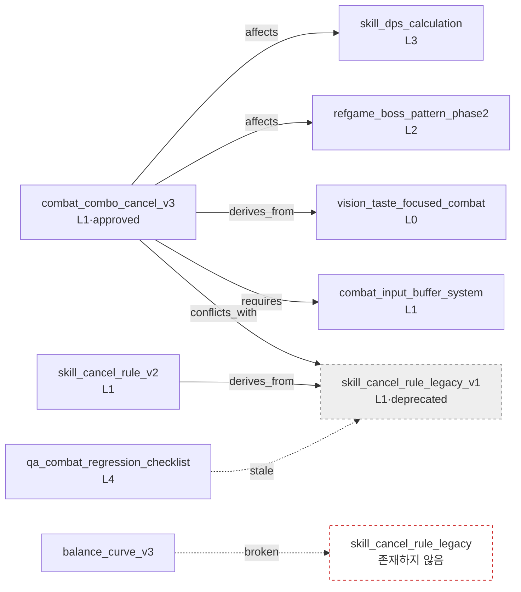

# 2.4 온톨로지와 wikilink 그래프 — 의미 화살표를 검증한다

월요일 오전, 변경 요청 하나가 올라왔다. 전투팀 팀원 A가 팀 메신저에 한 줄을 적는다. "글로벌 쿨다운 0.5초 → 0.3초로 바꿀게요. 영향 받는 데 있나요?" 평소라면 여기서부터 30분짜리 회의가 시작된다. 데미지 계산식 담당이 손을 들고, 콤보 캔슬 룰 담당이 끼어들고, 누군가는 "보스 패턴도 영향 있지 않냐"고 묻는다. 아무도 전체 그림을 머릿속에 다 갖고 있지 않으니, 회의는 기억을 더듬는 일로 채워진다.

그런데 이번에는 다르다. 요청을 올린 1초 뒤, 봇이 자동 코멘트를 단다. "이 atom을 바꾸면 4개 atom이 영향을 받습니다. `skill_dps_calculation`, `combat_combo_cancel_v3`, `refgame_boss_pattern_phase2`, `balance_curve_v3`. 담당: 팀원 B, 팀원 A, 팀원 C." 회의는 열리지 않았다. 4명이 각자 자기 atom만 확인하고 끝났다. (이 봇은 뒤에서 직접 만든다 — 2.4.3.)

이 코멘트는 마법이 아니다. 2.3에서 모든 atom에 Layer 좌표를 부여했고, 그 위에 이번 장에서 **의미 화살표** — 어느 결정이 어느 결정에 영향을 주는가 — 를 더했기 때문이다. 좌표는 "여기에 무엇이 있다"까지만 말한다. "이것이 저것에 영향을 준다", "저것이 먼저 있어야 성립한다", "이 둘은 동시에 켜면 안 된다" 같은 관계는 좌표 위에 그려지는 화살표다. 이 장은 그 화살표를 어떻게 표기하고, 깨진 화살표를 어떻게 자동으로 잡아내는지 다룬다.

> **용어 메모**
> - 온톨로지(ontology): 개념과 그 사이 관계를 명시적으로 정의한 체계. 이 책에서는 6~12개 관계로 단순화한 경량 버전을 쓴다.
> - wikilink: `[[atom_name]]` 형식의 문서 간 링크. Obsidian·Roam 등에서 쓰는 표기를 차용했다.
> - 역참조(backlink): "이 atom을 가리키는 atom들"의 목록. 정참조의 반대 방향.
> - 고아 노드(orphan): 어디서도 참조되지 않는 atom. 폐기 후보 신호.
> - 깨진 링크(broken link): 존재하지 않는 atom을 가리키는 wikilink. 오타·이름 변경의 흔적.

---

## 2.4.1 관계는 화살표다 — wikilink만으로는 부족한 이유

2.1에서 YAML 프론트매터로 메타데이터를 붙였고, atom 본문에는 wikilink를 흩뿌렸다. 그것만으로 문서는 이미 그물망처럼 연결된다. 문제는 그 연결이 **무엇을 의미하는지 적혀 있지 않다**는 점이다.

```markdown
이 결정은 [[skill_cooldown_rule_v2]] 위에서 성립한다.
```

이 한 줄은 "skill_cooldown_rule_v2를 언급한다"까지만 말한다. 왜 언급하는가? 이 결정이 저 규칙을 **필요로 하는가**(requires), 저 규칙에서 **파생됐는가**(derives_from), 아니면 저 규칙과 **충돌하는가**(conflicts_with)? 사람은 문장을 읽으면 알지만, 기계는 모른다. AI에게 "이 결정을 켜면 깨지는 게 있냐"고 물어도, 의미 없는 링크만으로는 답할 수 없다.

그래서 wikilink에 **관계 유형**을 입힌다. 게임 기획에서 실제로 쓰이는 관계는 의외로 적다. 다음 여섯 개가 90% 이상을 덮는다.

<svg viewBox="0 0 720 250" xmlns="http://www.w3.org/2000/svg" font-family="sans-serif" font-size="13">
  <rect x="0" y="0" width="720" height="250" fill="#fbfbfd" stroke="#ddd"/>
  <!-- affects -->
  <rect x="20" y="20" width="120" height="44" rx="6" fill="#fff" stroke="#222"/>
  <text x="80" y="40" text-anchor="middle" font-weight="bold">affects</text>
  <text x="80" y="56" text-anchor="middle" fill="#666">영향을 준다</text>
  <!-- derives_from -->
  <rect x="160" y="20" width="120" height="44" rx="6" fill="#fff" stroke="#1a66cc"/>
  <text x="220" y="40" text-anchor="middle" font-weight="bold" fill="#1a66cc">derives_from</text>
  <text x="220" y="56" text-anchor="middle" fill="#666">~에서 파생</text>
  <!-- requires -->
  <rect x="300" y="20" width="120" height="44" rx="6" fill="#fff" stroke="#e08a00"/>
  <text x="360" y="40" text-anchor="middle" font-weight="bold" fill="#e08a00">requires</text>
  <text x="360" y="56" text-anchor="middle" fill="#666">먼저 있어야</text>
  <!-- conflicts_with -->
  <rect x="440" y="20" width="130" height="44" rx="6" fill="#fff" stroke="#cc2222"/>
  <text x="505" y="40" text-anchor="middle" font-weight="bold" fill="#cc2222">conflicts_with</text>
  <text x="505" y="56" text-anchor="middle" fill="#666">동시 적용 불가</text>
  <!-- is_a -->
  <rect x="590" y="20" width="110" height="44" rx="6" fill="#fff" stroke="#888"/>
  <text x="645" y="40" text-anchor="middle" font-weight="bold" fill="#888">is_a</text>
  <text x="645" y="56" text-anchor="middle" fill="#666">특수 사례</text>
  <!-- part_of -->
  <rect x="300" y="90" width="120" height="44" rx="6" fill="#fff" stroke="#bbb"/>
  <text x="360" y="110" text-anchor="middle" font-weight="bold" fill="#999">part_of</text>
  <text x="360" y="126" text-anchor="middle" fill="#666">~의 부분</text>
  <!-- example wiring -->
  <text x="360" y="175" text-anchor="middle" fill="#333" font-size="14">예: combat_combo_cancel_v3 —[affects]→ skill_dps_calculation</text>
  <text x="360" y="200" text-anchor="middle" fill="#333" font-size="14">combat_combo_cancel_v3 —[derives_from]→ vision_taste_focused_combat</text>
  <text x="360" y="225" text-anchor="middle" fill="#333" font-size="14">combat_combo_cancel_v3 —[requires]→ combat_input_buffer_system</text>
</svg>

이 여섯 개를 enum으로 고정하는 atom이 `ontology_relation_enum_v1`이다. 새 관계 유형을 추가하려면 변경 요청 리뷰를 거치게 한다. 늘어나도 10~12개가 적정선이고, 처음에는 affects·derives_from·requires 세 개로 시작해도 충분하다. 관계를 적는 자리는 atom의 YAML 프론트매터다.

```yaml
---
name: combat_combo_cancel_v3
layer: 1
affects: [skill_dps_calculation, refgame_boss_pattern_phase2]
derives_from: [vision_taste_focused_combat]
requires: [combat_input_buffer_system, skill_cooldown_rule_v2]
conflicts_with: [skill_cancel_rule_legacy_v1]
---
```

사람은 정방향 한 줄만 적는다. 역방향("나를 누가 affects 하는가")은 도구가 전체를 스캔해 계산한다. affects를 양쪽에 다 적으면 동기화 부담이 두 배가 되고, 한쪽만 고치고 다른 쪽을 잊는 순간 그래프가 거짓말을 시작한다. **한 방향만 손으로, 반대 방향은 도구로**가 이 장 전체를 관통하는 원칙이다.

---

## 2.4.2 워크드 트랜스크립트 — wikilink 역참조와 그래프 무결성을 한 번에 검증한다

여기서부터는 실제로 일어난 한 세션을 통째로 옮긴다. 상황은 이렇다. 콤보 캔슬 규칙을 v2에서 v3로 갈아엎으면서 `skill_cancel_rule_legacy_v1`을 폐기하기로 했다. 그런데 폐기하기 전에, **이 atom을 가리키는 다른 atom이 없는지**(역참조), 그리고 **폐기 후에 깨진 링크나 충돌이 남지 않는지**(그래프 무결성)를 확인해야 한다. 손으로 grep 하면 빠뜨린다. Claude에게 시킨다.

### 프롬프트 (전문)

```
첨부한 atom 폴더(decisions/)에는 atom이 있고, 프론트매터에 관계
(affects/derives_from/requires/conflicts_with/is_a/part_of)가 적혀
있을 거야. 본문엔 위키링크도 있고. 지금 skill_cancel_rule_legacy_v1
을 폐기하려는데, 폐기 전에 3개를 검사해줘: 1) 역참조 2) 깨진 링크
3) 충돌. 추측하지 말고 실제로 파일을 읽고 답해. 못 찾으면 못 찾았다고 해.
// 역참조=YAML 관계+본문 위키링크 양쪽 / 깨진 링크=폐기로 stale·미존재 되는 링크
// 충돌=conflicts_with 상대 중 status: approved 가 살아있는지
```

### Claude 출력 (날것 — 요약·정리하지 않음)

> decisions/ 폴더의 47개 파일을 읽었습니다. `skill_cancel_rule_legacy_v1`에 대한 3개 검사 결과입니다.
>
> **1. 역참조 (이 atom을 가리키는 atom)**
>
> YAML 관계로 가리키는 atom:
> - `combat_combo_cancel_v3` — `conflicts_with: [skill_cancel_rule_legacy_v1]`
> - `skill_cancel_rule_v2` — `derives_from: [skill_cancel_rule_legacy_v1]`
>
> 본문 wikilink로 가리키는 atom:
> - `combat_combo_cancel_v3` 본문: "구버전 `[[skill_cancel_rule_legacy_v1]]`의 입력 버퍼 문제를 해결한다"
> - `qa_combat_regression_checklist` 본문: "회귀 항목 3번은 `[[skill_cancel_rule_legacy_v1]]` 기준으로 작성됨"
>
> 즉 **4개 atom이 이 atom을 참조**하고 있습니다. (YAML 2 + 본문 wikilink 2, 단 combat_combo_cancel_v3는 양쪽 모두라 실제 atom 수는 3개)
>
> **2. 깨진 링크 (폐기 시 깨지는 곳)**
>
> 폐기 자체로는 wikilink가 "깨지지" 않습니다 — 파일은 남고 status만 deprecated가 되니까요. 다만:
> - `qa_combat_regression_checklist`는 폐기된 atom을 기준으로 회귀 항목을 정의하고 있어, **내용상 무효**가 됩니다. 이건 깨진 링크는 아니지만 stale link입니다. 검토 필요.
> - 만약 파일을 **삭제**까지 하신다면 위 4개 참조가 전부 깨진 링크가 됩니다.
>
> ⚠️ 한 가지 애매한 점: `balance_curve_v3`의 본문에 `[[skill_cancel_rule_legacy]]`(끝에 `_v1`이 없음)라는 링크가 있습니다. 이게 오타로 `_v1`을 가리키려던 건지, 아니면 별도 atom을 의도한 건지 파일만으로는 확신할 수 없습니다. `skill_cancel_rule_legacy`라는 이름의 파일은 폴더에 **없습니다**. 즉 이건 이미 깨진 링크일 가능성이 높습니다. 확인이 필요합니다.
>
> **3. 충돌 잔존 (conflicts_with 상대가 살아있나)**
>
> `skill_cancel_rule_legacy_v1`과 `conflicts_with`로 묶인 atom: `combat_combo_cancel_v3` 하나입니다.
> - `combat_combo_cancel_v3`의 status: **approved** (살아있음)
>
> → 폐기 대상과 충돌하던 신규 규칙이 정상 승인 상태입니다. 이건 정상입니다. 구버전을 폐기하고 신버전이 살아남는 자연스러운 교체입니다. **충돌 잔존 경고 아님.**
>
> ---
> **요약**: 폐기는 안전하나, 두 가지를 먼저 처리하세요.
> (a) `qa_combat_regression_checklist`의 stale link — 회귀 항목 3번 갱신.
> (b) `balance_curve_v3`의 `[[skill_cancel_rule_legacy]]` — 오타 의심. 이미 깨진 링크일 수 있음.

### 사람의 검증과 거부

여기서 나는 출력을 그대로 받지 않았다. (a)는 맞다 — 회귀 체크리스트는 내가 갱신해야 한다. 하지만 (b)에서 멈췄다. Claude는 `balance_curve_v3`의 `[[skill_cancel_rule_legacy]]`를 "오타 의심"이라고 했는데, 정말 깨진 링크인지 내가 직접 폴더를 봐야 했다. AI의 "확신할 수 없다"는 정직한 신호지, 결론이 아니다.

폴더를 열어 확인하니, `skill_cancel_rule_legacy`라는 파일은 실제로 없었다. 그런데 git log를 보니 6개월 전에 `skill_cancel_rule_legacy` → `skill_cancel_rule_legacy_v1`로 **이름만 바꾼 커밋**이 있었다. 그때 `balance_curve_v3`의 본문 링크를 갱신하지 못하고 흘려보낸 것이다. 즉 이건 오타가 아니라 **이름 변경 후 고아가 된 깨진 링크**였다. Claude의 "오타 의심"이라는 추측은 절반만 맞았다. 원인은 오타가 아니라 rename 누락이다. 이 차이를 내가 잡지 않았으면, 회귀 체크리스트만 고치고 깨진 링크는 그대로 묻혔을 것이다.

### 재요청 (확인된 사실을 반영)

```
확인했어. [[skill_cancel_rule_legacy]] 는 오타가 아니라 6개월 전
rename(_legacy → _legacy_v1) 때 본문 링크를 못 고친 깨진 링크였어.

그럼 이참에 폴더 전체에서 "존재하지 않는 atom을 가리키는 wikilink"를
전부 찾아줘. 본문 wikilink 기준으로, 대상 파일이 폴더에 없는 것 전부.
파일명과 그 안의 깨진 링크를 표로.
```

> 47개 파일의 모든 `[[...]]` 본문 wikilink를 수집해 폴더 파일 목록과 대조했습니다. 대상 파일이 존재하지 않는 깨진 링크는 **3건**입니다.
>
> | 링크를 가진 파일 | 깨진 wikilink | 추정 원인 |
> |---|---|---|
> | `balance_curve_v3` | `[[skill_cancel_rule_legacy]]` | rename 누락 (→ `_v1`) |
> | `quest_reward_table_v2` | `[[concept_reward_currency]]` | 대상 atom 미작성 (계획만 있고 파일 없음) |
> | `refgame_boss_pattern_phase2` | `[[skill_global_cooldown]]` | rename 누락 (→ `skill_global_cooldown_rule`) |
>
> 3건 중 2건(rename 누락)은 대상 atom명을 `_v1` / `_rule`로 고치면 됩니다. 1건(`concept_reward_currency`)은 가리키는 atom 자체가 없으므로, 작성하시거나 링크를 제거하셔야 합니다. 제가 자동으로 고치지는 않았습니다 — 어느 쪽을 의도하셨는지 확인 후 진행하세요.

세 건 모두 사실이었다. 손으로 grep 했으면 `quest_reward_table_v2`의 깨진 링크는 거의 확실히 놓쳤을 것이다. 그 링크는 "아직 안 만든 atom을 미리 가리켜 둔" 의도된 미래 참조였는데, 6개월간 아무도 그 atom을 만들지 않아 사실상 죽은 약속이 되어 있었다.

이 세션이 보여주는 것은 단순하다. **역참조 검출과 깨진 링크 검출은 AI가 폴더 전체를 읽고 대조하는 일에 강하고, 원인 판정과 의도 확인은 사람이 한다.** AI는 "여기 깨졌다"까지, 사람은 "왜 깨졌고 어떻게 고칠까"까지.

---

## 2.4.3 그래프로 그리면 보이는 것 — 검증을 시각으로 옮긴다

앞 절의 검사를 매번 프롬프트로 돌릴 수도 있지만, 같은 검사를 코드로 굳히면 그래프 위에서 한눈에 보인다. 프로젝트 A에는 2.3에서 소개한 `gen_relation_map.py`를 확장한 그래프 도구가 R&D로 돌아간다. 핵심은 폴더의 atom을 읽어 `networkx` 방향 그래프로 빌드한 뒤, 네 가지 검사 함수를 얹는 것이다.

```python
import networkx as nx

# build_graph(folder): atom 폴더를 읽어 노드(=atom)와
#   YAML 관계 엣지로 DiGraph를 만든다. (전문은 「따라하기」)

def find_cycles(G):                      # 순환 의존
    return list(nx.simple_cycles(G))

def find_orphans(G):                     # 인바운드 0 = 고아 후보
    return [n for n in G.nodes if G.in_degree(n) == 0]
```

핵심은 두 줄이다. `simple_cycles`가 순환 의존(A requires B requires C requires A)을, `in_degree(n) == 0`이 고아 노드를 잡아낸다 — 직접 DFS를 짤 필요가 없다. 나머지 두 함수도 같은 결의 한 줄짜리다. `find_broken_wikilinks`는 본문 `[[...]]`를 정규식으로 수집해 노드 목록에 없는 것을 골라내고, 역참조는 그래프를 거꾸로 훑으면 나온다(전문은 「따라하기」). 시각화는 노드 색을 Layer로, 엣지 색을 관계 유형으로 칠하고, 많이 참조되는 노드(인바운드 엣지가 많은 노드)는 크게 그려 허브가 드러나게 한다. 캐비닛에 색 라벨을 붙여 정렬한 폴더처럼, 시야 안에서 패턴이 먼저 떠오른다.

아래는 2.4.2 세션에서 다룬 atom들의 실제 관계를 옮긴 그래프다. 화살표 방향은 "출발 atom이 도착 atom을 향해 관계를 건다"는 의미다.



점선으로 그려진 두 엣지가 2.4.2에서 사람 검증으로 잡아낸 문제다. `qa → legacy`는 폐기 atom 기준의 stale link, `balance_curve_v3 → skill_cancel_rule_legacy`는 존재하지 않는 노드를 가리키는 깨진 링크. 그래프로 그리면 이 두 점선이 실선들 사이에서 도드라진다. 텍스트로만 운영했다면 47개 파일 어딘가에 묻혀 영영 안 보였을 것이다.

검증 게이트(Layer 4)에서 자동으로 도는 규칙은 네 가지다.

- **순환 의존**: `requires` 사슬이 자기 자신으로 돌아오면 경고. `simple_cycles`로 검출.
- **충돌 활성화**: `conflicts_with`로 묶인 두 atom이 둘 다 `status: approved`면 경고. (2.4.2의 케이스는 한쪽이 deprecated라 통과.)
- **고아 노드**: 인바운드 0이고 부모도 없는 atom은 폐기 후보로 분기별 점검. atom `graph_orphan_detection_quarterly`가 이 주기를 명시한다.
- **Layer 역행**: L1 → L3 affects는 정상(상위 결정이 하위 데이터에 영향), L3 → L1 affects는 의심. 2.3의 거꾸로참조 검출과 같은 원리다. atom `docs_layer_numeric_prefix_naming`이 문서명에 Layer 번호 prefix를 강제하기 때문에, 역행은 파일명만 봐도 1차로 걸러진다.

이 네 규칙이 코드로 굳으면 2.4.2처럼 매번 프롬프트를 짤 필요가 없다. 변경 요청이 올라온 순간 봇이 그래프를 다시 빌드하고, 영향 받는 atom 목록과 깨진 링크·순환·충돌을 자동 코멘트로 단다. 장 첫머리의 "4개 atom이 영향받습니다" 코멘트가 바로 이것이다 — 이 봇이 앞서 예고한 그 봇이다.

---

## 2.4.4 왜 Layer였나 — 절차적 생성을 위해 나눈 좌표

여기서 2.3과 2.4가 왜 한 묶음인지 짚고 넘어가야 한다. Layer 좌표와 관계 화살표는 따로 도입한 게 아니라, 같은 목적의 두 면이다.

표면적으로 Layer는 협업 언어를 통일한다 — "이건 L1 시스템 결정", "저건 L3 데이터"라고 부르면 분야가 달라도 같은 좌표를 공유한다. 하지만 본질적 목적은 다른 데 있다. **Layer는 절차적 생성을 위해 나눈 좌표였다.**

L0 비전은 컨텍스트 앵커다 — 불변이고, AI에게 매번 주입된다. L1 시스템은 생성의 입력 규칙이다 — 룰북·관계·태그가 여기 산다. L2 콘텐츠는 생성된 본문이 쌓이는 자리, L3 데이터는 수치·ID·관계로 시뮬레이션의 입력, L4 빌드·QA는 검증 게이트다. 관계 화살표는 이 좌표 위에서 **생성의 제약 조건**으로 작동한다. AI가 새 콘텐츠를 만들 때, `requires` 화살표는 "이게 먼저 있어야 한다"는 전제가 되고, `conflicts_with` 화살표는 "이건 같이 켜면 안 된다"는 금지가 된다.

분야는 분화하지만(전투·퀘스트·경제가 각자 전문성을 가짐) 모든 산출물이 Layer 좌표를 갖기에 서로를 인지한다. 분화와 통합이 한 좌표계 위에서 동시에 성립한다. 이 그래프가 충분히 자라면, AI는 후보를 생성하며 관계 화살표를 자동 제약으로 읽고, 사람은 검수 게이트에서 위배 여부만 확인하면 된다. 2.4.2의 워크드 트랜스크립트가 그 축소판이다 — AI가 그래프를 읽어 제약 위반(깨진 링크·충돌)을 찾고, 사람이 게이트에서 판정했다.

---

## 2.4.5 도메인 개념도 노드다 — 작은 어휘 사전

관계 화살표의 출발점·도착점이 되는 노드에는 결정 atom만 있는 게 아니다. "스킬", "퀘스트", "보상" 같은 도메인 개념을 정의한 atom도 그래프의 일등 시민이다. `concept_skill_definition_v1`은 이렇게 생겼다.

```markdown
# 스킬 (Skill)
Definition: 캐릭터가 전투 중 발동하는 단위 액션. 입력·쿨다운·자원·효과를 포함.
Required Properties: input / cooldown / cost / effects
Subtypes: active_skill (is_a) / passive_skill (is_a) / ultimate_skill (is_a)
Not a skill: 자동 공격 [[concept_auto_attack]] / 변신 [[concept_transformation]]
```

`boss_skill is_a skill`이라고 적으면 상위 개념의 규칙이 자동 상속된다. 프로젝트 A에는 이런 개념 정의 atom이 19개쯤 있고, 모든 결정 atom이 이들을 참조한다. 어휘가 한 사전으로 통일되면 회의·문서·코드 사이의 번역 부담이 사라진다. 책상마다 다른 사전을 두지 않고 같은 사전을 공유하는 셈이다. 앞의 워크드 트랜스크립트에서 깨진 링크로 잡힌 `concept_reward_currency`가 바로 "사전에 등재하기로 해놓고 아직 안 만든 빈 항목"이었다.

---

## 2.4.6 가볍게 유지하라 — 학술 온톨로지의 함정

여기까지 읽으면 "이거 OWL/RDF 같은 정식 온톨로지 아니냐"는 질문이 나온다. 아니다. 그리고 일부러 아니게 만들었다.

학술 온톨로지(OWL·RDF·SKOS)는 강력하지만, 관계 유형이 수십~수백 개고 전용 추론 엔진이 필요하며, 운영하려면 온톨로지 전문가가 붙어야 한다. 검색 엔진·의료·법률처럼 정밀 추론이 생사를 가르는 영역에서는 필수다. 하지만 게임 기획에서 실제로 필요한 추론은 "변경 영향 범위", "선결 의존성", "충돌 검출"뿐이고, 전부 그래프를 한 칸씩 따라가며 훑는 단순 탐색(BFS·DFS) 수준으로 끝난다. `networkx` 한 줄로 순환을 잡은 앞 절이 그 증거다. 정식 추론 엔진은 과잉이다.

기준은 하나다. **기획자가 손으로 운영할 수 있는가.** YAML 6개 enum, `networkx` 처리, pyvis나 D3.js 시각화. 이 선을 넘는 순간 도구는 도구이기를 그치고 또 하나의 부담이 된다. 가벼움은 타협이 아니라 설계 의도다.

이 함정을 피하는 데 반복되는 실수 다섯 가지가 있다. 모두 "온톨로지를 강제 표준으로 다룬 자리"라는 같은 뿌리에서 자란다.

| 실수 | 회피법 |
|---|---|
| 관계 유형을 처음부터 너무 많이 정의 | 세 개(affects·derives_from·requires)로 시작, 필요할 때만 추가 |
| 모든 결정에 관계 강제 | 관계 없는 atom도 정상으로 인정 — 빈 관계가 그래프를 더럽힌다 |
| affects를 양방향으로 적음 | 한 방향만 손으로, 역방향은 도구로 자동 계산 |
| OWL·RDF에 집착 | 운영 가능한 수준(YAML + enum)에 머무름 |
| 시각화 없이 텍스트만 운영 | 단순 HTML 뷰라도 처음부터 제공 — 2.4.3의 점선처럼, 안 보이면 안 고친다 |

1·2·3번은 도입 1개월 안에 패턴을 잡고, 4·5번은 3개월차 회고에서 점검하면 자연스럽게 정렬된다.

---

## 2.4.7 작은 시작과 다음 장

처음 한 달은 적자다. 관계를 적는 부담만 쌓이고 보이는 효과는 없다. 그래서 작게 시작한다. 첫 주엔 affects·derives_from·requires 세 관계만, 2~4주차엔 핵심 atom 20개에 적용하며 그래프가 자라는 모습을 지켜본다. 1개월차에 앞 절 수준의 HTML 그래프 뷰 하나를 만들면, 두 달째부터 시각화가 가치를 보여주기 시작하고, 세 달째에는 자동 검증(순환·충돌·고아·깨진 링크)이 회의 시간을 직접 줄인다. 적자 한 달을 견디는 것이 도입 성패의 분기점이다.

다음 8장 Wikilink는 이 장에서 화살표로 다룬 `[[...]]` 표기를 운영 차원에서 깊게 판다 — 역참조 패널을 매일 어떻게 쓰는지, 이름 변경 시 링크를 한꺼번에 어떻게 갱신하는지(2.4.2의 rename 누락을 애초에 막는 법), Obsidian 같은 도구의 그래프 뷰를 실무에 어떻게 녹이는지. YAML(4장) → Atom(5장) → Layer(6장) → Ontology(7장) → Wikilink(8장)가 정보 아키텍처의 완성된 오각형이다.

---

## 따라하기

**setup.** atom이 모인 폴더(예: `decisions/`)를 정하고, 각 atom YAML에 관계 키를 적을 준비를 하세요. 처음엔 `affects`·`derives_from`·`requires` 세 개만. 본문 링크는 `[[atom_name]]` 형식으로 통일합니다.

**prompt.** 폐기·이름 변경 전에 아래를 던지세요.

```
이 폴더의 마크다운 atom들을 읽고, 내가 [대상_atom] 을 폐기/변경하려는데
(1) 역참조: 이 atom을 YAML 관계와 본문 wikilink로 가리키는 atom 전부
(2) 깨진 링크: 변경/삭제 시 깨지거나 stale 되는 링크
(3) 충돌 잔존: conflicts_with 상대 중 status: approved 인 것
을 검사해줘. 추측 말고 실제로 파일 읽고, 못 찾으면 못 찾았다고 해.
```

**verify.** AI가 "오타 의심", "확신할 수 없음"이라고 단 곳을 사람이 직접 여세요. 깨진 링크의 **원인**(오타냐 rename 누락이냐 미작성이냐)은 git log와 폴더 실물로 사람이 판정합니다. 자동 수정은 시키지 말고, 의도 확인 후 직접 고칩니다.

### 그래프 도구 전문 (2.4.3 발췌)

본문(2.4.3)에서 핵심 두 함수만 보였다. 폴더 전체를 그래프로 빌드하고 네 검사를 거는 전문은 다음과 같다.

```python
import networkx as nx
import re, yaml, glob, os

REL_TYPES = ["affects", "derives_from", "requires",
             "conflicts_with", "is_a", "part_of"]
WIKILINK = re.compile(r"\[\[([a-zA-Z0-9_]+)\]\]")

def build_graph(folder):
    G = nx.DiGraph()
    files = {}
    for path in glob.glob(os.path.join(folder, "*.md")):
        name = os.path.splitext(os.path.basename(path))[0]
        text = open(path, encoding="utf-8").read()
        fm = yaml.safe_load(text.split("---")[1]) or {}
        files[name] = fm
        G.add_node(name, layer=fm.get("layer"), status=fm.get("status"))
    # YAML 관계 엣지
    for name, fm in files.items():
        for rel in REL_TYPES:
            for tgt in (fm.get(rel) or []):
                G.add_edge(name, tgt, type=rel)
    return G, files

def find_broken_wikilinks(folder, known_nodes):
    broken = []
    for path in glob.glob(os.path.join(folder, "*.md")):
        text = open(path, encoding="utf-8").read()
        for m in WIKILINK.findall(text):
            if m not in known_nodes:
                broken.append((os.path.basename(path), m))
    return broken

def find_orphans(G):
    # 인바운드 0이면서 part_of/is_a 부모도 없는 노드
    return [n for n in G.nodes if G.in_degree(n) == 0]

def find_cycles(G):
    return list(nx.simple_cycles(G))
```

### 1인 축소판

도구가 없어도 됩니다. atom 폴더 하나, Claude 하나면 충분합니다. 새 결정을 적을 때 YAML에 `requires`·`affects` 두 줄만 추가하고, 폐기·이름 변경이 생길 때마다 위 prompt를 한 번 돌리세요. 그래프 시각화는 나중 문제입니다 — 깨진 링크와 충돌을 변경 직전에 한 번 훑는 습관, 그 한 번이 1인 운영에서 가장 큰 적자를 막습니다.

---

### 이 챕터의 핵심 메시지
- 좌표 위에 의미 화살표를 입혀야 "무엇이 무엇에 영향을 주는가"가 자동 추론된다
- 역참조·깨진 링크 검출은 AI가, 원인 판정과 의도 확인은 사람이 한다
- 가벼움은 타협이 아니라 설계 의도다 — 손으로 운영 못 하면 도구가 부담이 된다
