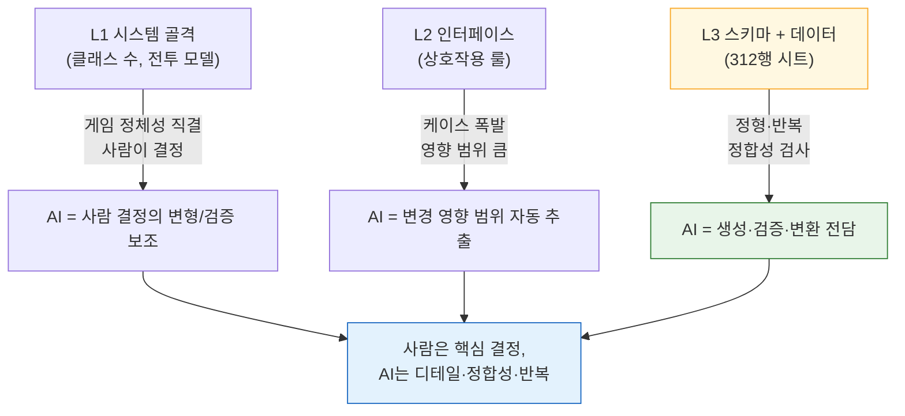

# 3.1 시스템 기획자의 일과 Layer 좌표

목요일 오후 4시 50분. 밸런스 담당이 채운 스킬 시트가 막 올라왔다. 스킬 312개. 각 스킬은 `effect_id`라는 칸에 효과 번호를 적게 되어 있고, 그 번호는 별도의 효과 시트에 있는 행을 가리킨다. 둘이 맞아떨어져야 게임이 돈다. 안 맞으면 클라이언트가 빈 효과를 부르거나 조용히 죽는다.

예전의 나는 이걸 손으로 봤다. 스킬 시트 한 칸, 효과 시트로 점프, 번호 확인, 다시 돌아오기. 312번. 빨라야 두 시간. 눈이 흐려지는 마지막 50개에서 꼭 한두 개를 놓쳤고, 그 한두 개가 QA 빌드에서 터졌다.

이 챕터는 그 두 시간이 어디로 갔는지, 그리고 그 정합성 검사가 시스템 기획자의 작업 지도 어디에 찍히는 좌표인지에 대한 이야기다. 좌표를 먼저 잡지 않으면, AI를 어디에 끼워야 할지 영영 감으로만 결정하게 된다.

---

## 3.1.1 시스템 기획자는 네 가지를 만든다

시스템 기획자는 추상도와 구체도 사이를 가장 넓게 오가는 사람이다. 비전이라는 안개를 받아서, 데이터 시트의 마지막 셀이라는 단단한 숫자까지 끌고 내려온다. 그 여정에서 만들어지는 산출물은 네 종류다.

**(1) 비전을 구조로 번역한다.** 디렉터가 "타격감이 살아 있는 액션 전투"라고 말하면, 시스템 기획자는 그걸 스킬·콤보·캔슬·히트스톱이라는 골격으로 바꾼다. "성장의 자기 결정권"은 클래스·스킬트리·장비 시스템이 된다. 안개가 구조물이 되는 첫 순간이다.

**(2) 시스템 사이의 인터페이스를 명세한다.** 전투·이동·인벤토리·상점·퀘스트·길드가 동시에 돈다. 전투 중 인벤토리를 열면 무적이 붙는가? 강화 도중에 PvP 신청이 들어오면? 이 케이스들의 답이 모여서 "잘 만들어졌다"는 손맛을 만든다. 답이 빠진 자리마다 사용자는 짜증을 느낀다.

**(3) 데이터 시트와 그 스키마를 책임진다.** 스킬 312개의 계수, 아이템 수백 개의 효과, 몬스터 수십 종의 행동. 값은 직접 채우거나 밸런스·콘텐츠 분야에 넘긴다. 하지만 시트의 **컬럼 정의(스키마)** 만큼은 시스템 기획자가 쥔다. 라벨이 붙은 서랍을 만들어 주는 일이다. 서랍이 엉성하면 사람마다 다르게 채워서 정합성이 깨진다.

**(4) 행동 로직을 설계한다.** 캐릭터·몬스터의 AI는 상태 머신(FSM, Finite State Machine, 유한 상태 기계), 행동 트리(Behavior Tree, 이하 BT), 결정 테이블, 절차적 규칙 같은 형태로 나온다. 이 자료가 프로그래머에게 넘어가 코드가 된다.

네 가지가 모두 한 사람의 책상 위에서 만난다는 점이 핵심이다. 그래서 "오늘 무엇에 시간을 쓸 것인가"가 시스템 기획자의 가장 큰 운영 결정이 된다.

---

## 3.1.2 시스템 산출물은 Layer 좌표를 갖는다

2.3에서 우리는 게임 제작물 전체를 L0(비전)부터 L4(빌드)까지의 좌표축에 올렸다. 이제 3.1.1의 산출물 네 가지를 그 축 위에 그대로 찍어 본다. 시스템 기획만큼 한 분야의 산출물이 여러 Layer에 넓게 흩어지는 경우는 드물다.

다음은 산출물이 Layer 위 어디에 사는지, 그리고 각 좌표에서 누구와 만나는지를 한 장에 그린 지도다.

<svg viewBox="0 0 720 360" xmlns="http://www.w3.org/2000/svg" font-family="sans-serif" font-size="13">
  <!-- Layer bands -->
  <rect x="20" y="20" width="680" height="60" fill="#eceff1" stroke="#b0bec5"/>
  <rect x="20" y="80" width="680" height="60" fill="#e3f2fd" stroke="#90caf9"/>
  <rect x="20" y="140" width="680" height="60" fill="#e8f5e9" stroke="#a5d6a7"/>
  <rect x="20" y="200" width="680" height="60" fill="#fff8e1" stroke="#ffe082"/>
  <rect x="20" y="260" width="680" height="60" fill="#eceff1" stroke="#b0bec5"/>
  <!-- Layer labels -->
  <text x="34" y="55" font-weight="bold">L0</text>
  <text x="34" y="115" font-weight="bold" fill="#1565c0">L1</text>
  <text x="34" y="175" font-weight="bold" fill="#2e7d32">L2</text>
  <text x="34" y="235" font-weight="bold" fill="#f9a825">L3</text>
  <text x="34" y="295" font-weight="bold">L4</text>
  <!-- Layer descriptions -->
  <text x="80" y="55" fill="#607d8b">비전 — 시스템 기획자는 받기만 한다</text>
  <text x="80" y="108" fill="#0d47a1">시스템 골격: 클래스·전투·인벤토리·길드 정의</text>
  <text x="80" y="168" fill="#1b5e20">인터페이스: 시스템 간 상호작용 룰·우선순위</text>
  <text x="80" y="228" fill="#e65100">스키마 + 데이터: 시트 컬럼 정의, 일부 값</text>
  <text x="80" y="295" fill="#607d8b">빌드 — QA가 의도 반영을 검증</text>
  <!-- Collaborator column -->
  <line x1="500" y1="20" x2="500" y2="320" stroke="#90a4ae" stroke-dasharray="4 3"/>
  <text x="512" y="55" fill="#607d8b" font-size="12">↔ 디렉터·내러티브</text>
  <text x="512" y="115" fill="#1565c0" font-size="12">↔ 아트 디렉션</text>
  <text x="512" y="175" fill="#2e7d32" font-size="12">↔ 타 시스템 기획자</text>
  <text x="512" y="235" fill="#f9a825" font-size="12">↔ 밸런스·콘텐츠</text>
  <text x="512" y="295" fill="#607d8b" font-size="12">↔ QA</text>
  <!-- responsibility arrow -->
  <line x1="62" y1="90" x2="62" y2="250" stroke="#c62828" stroke-width="2.5" marker-end="url(#ah)"/>
  <defs>
    <marker id="ah" markerWidth="8" markerHeight="8" refX="4" refY="4" orient="auto">
      <path d="M0,0 L8,4 L0,8 Z" fill="#c62828"/>
    </marker>
  </defs>
  <text x="335" y="338" fill="#c62828" font-size="12" font-weight="bold">시스템 기획자가 직접 만드는 구간 (L1→L3)</text>
</svg>

이 지도가 말하는 바는 두 가지다. 첫째, 시스템 기획자는 L0을 **받아서** L4까지 **닿게 하는** 긴 거리를 책임진다. 둘째, 직접 손으로 만드는 구간은 L1\~L3이고, 그 세 칸마다 협업 상대가 바뀐다. 칸이 바뀔 때마다 협업 언어가 바뀌므로, 좌표를 의식하지 않으면 회의가 자꾸 헛돈다.

다만 한 사람이 L1\~L3을 전부 만진다는 뜻은 아니다. 팀이 크면 L1\~L2 담당과 L3 담당이 갈린다. 팀이 작으면 한 사람이 다 본다. 좌표는 역할 분담의 지도이지, 한 명에게 다 떠넘기라는 명령이 아니다.

---

## 3.1.3 좌표가 정해지면 AI를 끼울 자리가 보인다

지도가 그려졌으니 이제 색을 칠한다. 어느 좌표가 AI 도입 효과가 큰가? 무턱대고 "다 자동화"가 아니라, 좌표의 성질을 보고 고른다.



핵심은 **좌표가 아래로 내려갈수록 AI 전담 비중이 커진다**는 것이다. L1의 "클래스를 몇 개로 할까"는 게임 정체성이라 사람이 쥐어야 한다. 반대로 L3의 "312행 외래 키가 다 맞는가"는 정형·반복이라 AI가 통째로 가져가야 한다. L2는 그 중간 — 결정은 사람이 하되, "이 룰을 바꾸면 어디까지 흔들리나"라는 영향 범위 추출을 AI가 받쳐 준다.

이 그림이 3.1.4 이후의 모든 실습이 왜 L3 근처에서 시작하는지를 설명한다. 효과가 가장 크고 위험이 가장 작은 자리이기 때문이다. 스키마 도구가 오작동해도 사고가 안 나고, 관계도는 그림만 그릴 뿐이며, 정합성 검사는 사람이 거부할 수 있다.

---

## 3.1.4 워크드 트랜스크립트: 좌표 L3에서 AI에게 정합성 검사를 맡기다

이론은 여기까지다. 이제 3.1 첫머리의 그 목요일로 돌아간다. 스킬 시트 312개의 `effect_id`가 효과 시트와 맞는지, AI에게 시켜 본다. 요약 없이, 실제로 주고받은 그대로 옮긴다.

데이터 입력은 `schema-first` 원칙을 따른다. 즉 사람이 먼저 **명세서 시트**를 정의하고, 거기서 Enum과 `.proto`가 나오고(VBA(엑셀 매크로 언어) Export), 마지막에 csv 데이터가 채워진다. 그래서 검증 프롬프트도 "스키마부터 읽어라"로 시작한다. 정본은 스키마 문서가 아니라 **실제로 export된 JSON**이라는 점을 못 박는다(`json_over_schema_doc_as_source_of_truth`). 문서는 거짓말을 해도 export된 JSON은 거짓말을 못 하기 때문이다.

### 프롬프트 (전문)

> 너는 우리 프로젝트의 데이터 정합성 검사기다.
> 입력은 두 개의 export JSON이다.
> 1) `skill.json` — 각 스킬 객체에 `skill_id`, `name`, `effect_id` 필드가 있다.
> 2) `effect.json` — 각 효과 객체에 `effect_id`, `effect_type`가 있다.
>
> 다음을 검사하라.
> (A) `skill.json`의 모든 `effect_id`가 `effect.json`에 존재하는가 (외래 키 정합성).
> (B) `effect.json`에 있으나 어떤 스킬도 참조하지 않는 고아(orphan) 효과.
> (C) `skill.json` 안에서 `effect_id`가 비어 있거나 0인 행.
>
> 규칙: 추측하지 마라. JSON에 없는 필드는 "필드 없음"이라고 보고하라.
> 출력은 (A)(B)(C) 세 섹션으로, 각 위반 건마다 `skill_id`(또는 effect_id)와 사유를 한 줄로.
> 위반이 없으면 해당 섹션에 "위반 없음"이라고만 써라.

### Claude의 날것 출력 (가공·미화 없음)

> 입력 JSON 두 개를 받지 못했습니다. 현재 메시지에는 파일 내용이 첨부되어 있지 않습니다.
> 다음 중 하나로 다시 보내 주세요.
> - `skill.json`과 `effect.json`의 실제 내용(붙여넣기 또는 파일 첨부)
> - 또는 두 파일의 경로
>
> 내용을 받으면 (A)(B)(C) 순서로 검사하겠습니다. 파일 없이 결과를 지어내지는 않겠습니다.

여기서 멈춘 게 오히려 신뢰의 신호였다. 입력이 비었는데도 그럴듯한 리포트가 돌아왔다면, 그 깔끔함이야말로 위험 신호다. 빈손으로 검사 결과를 만들어 내지 않고 "파일부터 달라"고 되물은 쪽이 믿을 만하다. 나는 두 JSON을 실제로 붙여넣고 재요청했다(분량 관계로 본문에는 일부만 발췌).

```json
// skill.json (발췌)
[
  {"skill_id": 1001, "name": "강타",     "effect_id": 5001},
  {"skill_id": 1002, "name": "회전베기", "effect_id": 5002},
  {"skill_id": 1003, "name": "방패올리기","effect_id": 0},
  {"skill_id": 1004, "name": "독바르기", "effect_id": 5099}
]
```

```json
// effect.json (발췌)
[
  {"effect_id": 5001, "effect_type": "DAMAGE"},
  {"effect_id": 5002, "effect_type": "DAMAGE"},
  {"effect_id": 5003, "effect_type": "BUFF"}
]
```

### Claude의 두 번째 출력 (실제 데이터 기준)

> **(A) 외래 키 정합성 — 위반 1건**
> - `skill_id: 1004` → `effect_id: 5099`가 `effect.json`에 존재하지 않음 (dangling reference)
>
> **(B) 고아 효과 — 위반 1건**
> - `effect_id: 5003` (BUFF) → 어떤 스킬도 참조하지 않음
>
> **(C) 빈/0 effect_id — 위반 1건**
> - `skill_id: 1003` → `effect_id: 0`. 의도된 "효과 없음"일 수도 있으니, 0이 유효값인지 스키마에서 확인 필요.

### 사람의 검증과 거부

세 건 중 두 건은 명백한 버그였다. `5099`는 밸런스 담당이 효과 시트에 행을 추가하기 전에 스킬에 먼저 적어 둔 것이었다 — 작업 순서가 어긋난 전형적 케이스. 잡았다.

그런데 (C)는 **거부**했다. 우리 프로젝트에서 `effect_id: 0`은 "패시브 슬롯, 효과 없음"을 뜻하는 유효한 약속값이다. AI는 그걸 모르니 "확인 필요"로 올렸고, 그 판단은 옳지만 위반으로 셀 일은 아니었다. 그래서 나는 다음으로 넘어갔다 — 이 약속을 atom으로 박제해서, 다음 검사부터는 AI가 0을 유효값으로 알게 만드는 것이다.

### 재요청 (도메인 지식 주입)

> 추가 규칙: `effect_id == 0`은 "패시브, 효과 없음"을 뜻하는 우리 프로젝트의 유효 약속값이다.
> 따라서 (C)에서 `effect_id == 0`은 위반이 아니다. 빈 문자열·null·음수만 (C) 위반으로 보고하라.

> **(C) 빈/0 effect_id — 위반 없음**
> (`effect_id: 0`은 유효 약속값으로 처리. 빈/null/음수 없음.)

이 한 줄짜리 약속이 바로 도메인 지식의 누적이다. 시스템 기획의 결정은 비교적 영구적이라, 한 번 박제하면 1년 뒤에도 같은 검사가 같은 기준으로 돈다. 캐비닛에 결정 카드가 한 장 쌓였다.

이 트랜스크립트에서 사람이 한 일은 **세 가지뿐**이다 — (1) 스키마부터 읽으라는 입력 순서 지정, (2) `5099`가 진짜 버그임을 확인, (3) `0`이 유효값임을 알고 AI의 판단을 거부·교정. 나머지 312행을 한 칸씩 점프하며 보던 두 시간은 사라졌다. 자동화된 건 점프와 대조라는 노동이고, 남은 세 줄의 판단이 핵심이다.

---

## 3.1.5 누적되는 자산: 좌표를 코드로 굳히다

위 트랜스크립트의 검사를 매번 손으로 시킬 수도 있지만, L3에서 반복되는 일은 도구로 굳히는 게 시스템 기획의 정석이다. 저자가 운영하는 두 가지를 인용한다 — 추상적인 "프로젝트 A의 도구"가 아니라 실제로 책상 위에서 도는 것들이다.

`gen_relation_map.py`는 시트의 컬럼명·값을 분석해 외래 키 관계를 자동 감지하고 인터랙티브 HTML 관계도를 뽑는다. 3.1.4에서 `skill.effect_id → effect.effect_id`라는 화살표를 사람이 머릿속에 그렸다면, 이 스크립트는 그 화살표를 시트 전체에 대해 그림으로 그려 준다. 의존이 역행하는 자리(L3 데이터가 L1 골격을 거꾸로 참조하는 위험)가 그림에서 즉시 튄다.

`schema-doc` 스킬은 xlsm의 **$스키마 시트**를 파싱해 마크다운 스키마 문서를 자동 생성한다. 3.1.4 (C)의 "0이 유효값인지 스키마에서 확인 필요"라는 질문이 나왔던 그 스키마 — 사람이 다른 파일을 뒤지지 않고 최신 스키마를 바로 읽게 한다. 시트가 바뀌면 문서가 따라 바뀌므로, 문서와 실제 데이터가 어긋나는 고질병이 줄어든다.

두 도구의 자리를 좌표로 다시 말하면 이렇다. `schema-doc`는 L3의 **컬럼 정의**를 지키고, `gen_relation_map.py`는 L2\~L3 사이의 **관계**를 지킨다. AI 보조 프롬프트(3.1.4 같은 검증)는 그 위에서 돈다. 셋은 따로 노는 게 아니라 같은 좌표축의 다른 높이를 맡는다.

이 도구들의 실제 사용법은 3.2·3.3·3.4에서 손으로 따라 한다. 3.1은 어디에 끼울지를 정하는 지도였고, 다음 세 챕터가 끼우는 작업이다.

---

## 3.1.6 점진 도입: 위험이 작은 좌표부터

세 도구를 한 번에 가동하면, 운영 부담이 효과보다 먼저 도착한다. 저자의 경험상 안전한 순서는 위험이 작은 좌표(아래쪽)부터다.

| 시점(권장) | 도입 | 좌표 | 잘못돼도 생기는 일 |
|---|---|---|---|
| 1개월 | 스키마 우선(3.2) | L3 | 문서가 한 번 안 갱신될 뿐 |
| 2\~3개월 | 관계도 시각화(3.3) | L2\~L3 | 그림이 부정확할 뿐 |
| 3\~6개월 | AI 보조 프롬프트(3.4) | L1\~L3 | 검증을 거치므로 사람이 거부 가능 |

기간은 절대 기준이 아니다. 팀 사이즈·기존 인프라에 따라 두 배가 걸릴 수도, 절반에 끝날 수도 있다(저자 추정, 미검증). 바뀌지 않는 건 **순서**다. 위험이 큰 결정 보조를 맨 마지막에 두면, 앞선 두 도구로 팀이 이미 검증 습관을 들인 뒤에 가장 민감한 자리를 건드리게 된다.

---

## 3.1.7 측정 — 정직하게

수치를 미화하지 않고 적는다. 아래는 저자가 디렉터로 운영하는 MMORPG 프로젝트(이하 "프로젝트 A")의 기획팀(인원 4\~5인, 전체 개발팀은 중규모 10\~50인, 운영 약 6개월)에서 관찰한 것이다. 정확한 자동 계측이 아니라 작업 로그와 회고 기록을 바탕으로 한 **저자의 관찰**이며, 방향과 대략의 비율로만 읽기를 권한다.

- **정합성 검사**: 312행짜리 스킬↔효과 외래 키 대조는 손으로 빨라야 두 시간이었다(첫머리의 그 목요일). AI 검증으로는 입력 준비를 빼면 수 분 안에 위반 목록이 나왔다. 줄어든 건 점프·대조 노동이지 판단이 아니다.
- **신규 기획자 온보딩**: 관계도 HTML 한 장이 있으면, 시스템 의존 구조를 말로 설명하던 회의를 여러 번 줄일 수 있었다. 정확한 횟수는 사람마다 달라 단정하지 않는다(저자 관찰).
- **변경 영향 토론**: "이 룰을 바꾸면 어디가 흔들리나"를 회의로 더듬던 것을, AI에게 영향 범위 초안을 먼저 받고 사람이 검토하는 방식으로 바꿨다. 회의가 사라진 게 아니라, 회의가 **검토**가 됐다.

핵심은 절약된 시간이 게임을 안 만드는 시간이 아니라는 점이다. 그 시간은 L1 골격 같은, AI에게 못 맡기는 깊은 결정으로 되돌아간다. 노동을 줄여서 판단에 쓰는 것 — 그게 이 챕터가 권하는 한 줄이다.

---

## 따라 하기: 좌표 L3에서 정합성 검사 1회

**setup.** 시트 두 개(예: 스킬, 효과)를 csv로 export하세요. 손이 닿으면 JSON으로 변환해 둡니다(문서가 아니라 export 결과물이 정본이라는 원칙). 두 시트 사이에 외래 키 한 쌍을 고릅니다(예: `skill.effect_id → effect.effect_id`).

**prompt.** 3.1.4의 프롬프트 전문을 그대로 쓰세요. 핵심 세 줄을 빠뜨리지 마세요 — (1) "스키마/구조부터 읽어라", (2) "추측하지 말고 없는 건 없다고 보고하라", (3) "위반 없으면 위반 없음만 써라".

**verify.** AI가 올린 위반 목록을 사람이 한 줄씩 봅니다. 진짜 버그는 고치고, 도메인 약속값(예: `0 = 효과 없음`) 때문에 생긴 오탐은 **거부**하고 그 약속을 프롬프트(또는 atom)에 추가합니다. 다음 검사부터 같은 오탐이 사라지면 자산이 한 장 쌓인 것입니다.

### 1인 축소판

팀도 시트도 없는 1인 개발자라면, 구글 시트 탭 두 개로 충분합니다. 한 탭은 "스킬", 다른 탭은 "효과". `effect_id` 컬럼 하나로 둘을 이으세요. 탭을 csv로 내려받아 3.1.4 프롬프트에 붙여넣으면, 312행이 아니라 30행짜리 시트에서도 똑같이 dangling reference와 고아 효과가 잡힙니다. 규모만 다를 뿐 좌표는 같습니다. L3에서 시작해, 손에 익으면 관계도와 영향 범위로 한 칸씩 위로 올라가시면 됩니다.

---

### 이 챕터의 핵심 메시지
- 시스템 산출물 네 가지는 L1 골격부터 L3 시트까지 좌표를 가지며, 좌표가 곧 협업 상대다
- 좌표가 아래(L3)로 내려갈수록 AI 전담 비중이 커지고 위험은 작아진다
- 자동화되는 건 점프·대조 노동이고, 버그 확인과 오탐 거부라는 판단은 사람 몫이다
