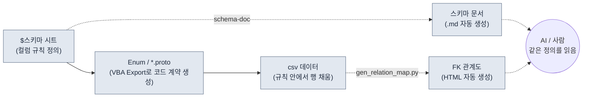

# 3.2 스키마 우선 — $스키마가 데이터보다 먼저다

월요일 오전, 신규 기획자가 채운 스킬 시트 120행을 csv로 빌드했더니 클라이언트 로그에 빨간 줄이 28개 떴다. `class_id`가 47번을 참조하는데 클래스 시트에는 47번이 없다. `element` 칸에 누군가 `Fire`라고 적었고 또 누군가는 `fire`라고 적었으며, 한 줄은 `화염`이라고 한글로 적혀 있다. 빨간 줄 28개를 한 줄씩 손으로 더듬는 데 오후 절반이 사라진다.

이 사고의 원인은 데이터가 틀려서가 아니다. **데이터를 만들기 전에 그 데이터가 따라야 할 규칙을 명시하지 않아서**다. 규칙이 머릿속에만 있으면, 사람이 바뀌는 순간 규칙도 바뀐다. 이 장은 규칙—스키마—을 데이터보다 먼저 만드는 워크플로를 다룬다. 그리고 그 규칙을 사람의 손이 아니라 도구가 문서로 강제하게 만든다.

---

> **용어 메모**
> - 스키마(schema): 데이터 시트의 컬럼 정의. 이름·타입·범위·외래 키·설명.
> - `$스키마`: 엑셀 데이터 시트(xlsm) 안에 두는, 컬럼 정의 전용 시트. 데이터 행이 아니라 컬럼의 규칙만 담는다.
> - FK(외래 키): 다른 시트의 PK(기본 키)를 참조하는 컬럼. `class_id`가 Class 시트의 행을 가리키는 식.
> - proto: Protocol Buffers 정의(`.proto`). 클라이언트·서버가 공유하는 데이터 구조·Enum 계약.
> - 단일 진실 출처(single source of truth): 같은 정보를 한 곳에서만 관리해 모두가 그곳을 보는 운영 원칙.

---

## 3.2.1 입력 순서가 곧 스키마다

스키마 우선을 "컬럼을 미리 정의한다"로만 이해하면 절반만 잡은 것이다. 핵심은 **무엇을 먼저 입력하느냐의 순서**에 있다. 데이터를 채우는 손이 어떤 순서로 움직이느냐가, 정합성이 지켜지는지 무너지는지를 결정한다.

이 책이 권장하는 입력 순서는 네 칸짜리 파이프라인이다.



왼쪽에서 오른쪽으로 흐르는 실선이 **입력 강제 순서**다. `$스키마`를 먼저 정의하고, 거기서 Enum과 proto를 VBA(엑셀 매크로 언어) Export로 뽑고, 그 계약 안에서만 csv 데이터를 채운다. 점선은 그 입력에서 자동으로 파생되는 산출물—스키마 문서(`schema-doc`)와 FK 관계도(`gen_relation_map.py`)—이며, 사람과 AI는 이 파생물을 통해 같은 정의를 본다.

이 순서가 강제되는 한, 이 장 도입부에서 본 빨간 줄 28개 중 대부분은 **데이터를 채우기 전에** 닫힌다. `element`가 `fire/ice/lightning/none` 넷 중 하나라는 사실이 proto의 Enum으로 고정되어 있으면, `Fire`도 `화염`도 입력 단계에서 걸린다. `class_id`가 Class 시트의 PK를 참조한다는 사실이 `$스키마`에 명시돼 있으면, 47번 누락은 빌드가 아니라 검사에서 먼저 잡힌다.

순서를 뒤집으면—데이터를 먼저 채우고 스키마를 나중에 정리하면—스키마는 사후 청소가 된다. 1000행이 이미 쌓인 자리에서 컬럼 규칙을 손보면, 규칙이 데이터를 따라가게 되고, 그 순간 진실 출처가 거꾸로 선다.

---

## 3.2.2 워크드 트랜스크립트 — `$스키마`부터 csv까지 한 번에

말로 설명하는 대신, 실제로 한 시트를 처음부터 끝까지 통과시켜 본다. 스킬 시트를 새로 만든다고 하자. 아래는 AI 보조를 끼고 진행한 전체 기록이다. 요약하지 않고, 어긋난 곳과 사람이 거부한 곳을 그대로 남긴다.

### 1단계 — 사람이 `$스키마`를 먼저 손으로 적는다

도구도 AI도 아직 부르지 않는다. 컬럼 규칙을 사람이 직접 정의한다. 이 단계만큼은 위임하지 않는다.

```
# Skill 시트 $스키마 (사람이 작성)
컬럼            타입       범위/제약              FK                  설명
skill_id       int        1000~9999            (PK)                스킬 고유 ID
name           string     1~30자                -                  표시 이름
class_id       int(FK)    -                    Class.class_id      사용 가능 클래스
cooldown       float      0.0~120.0            -                   재사용 대기(초)
damage_coef    float      0.0~10.0             -                   공격력 곱 계수
element        enum       fire/ice/lightning/none  -              속성
is_passive     bool       true/false           -                  패시브 여부
```

### 2단계 — AI에게 proto Enum 초안을 시킨다 (프롬프트 전문)

`$스키마`의 `element` enum과 FK 구조를 proto 계약으로 옮기는 작업. 형식 변환이라 AI에게 맡길 수 있는 일이다.

> **프롬프트(전문):**
> 아래는 게임 데이터 시트의 컬럼 명세다. 이 명세를 Protocol Buffers(proto3) 메시지와 Enum으로 변환해라. 규칙: (1) enum 타입 컬럼은 별도 enum으로 정의하고 첫 값은 반드시 `_UNSPECIFIED = 0`로 시작한다. (2) FK 컬럼은 참조 대상을 주석으로 남긴다. (3) 범위 제약은 proto로 표현 불가하니 주석으로만 남긴다. 명세에 없는 컬럼은 추가하지 마라.
> ```
> skill_id int PK / name string / class_id int FK→Class.class_id /
> cooldown float 0\~120 / damage_coef float 0\~10 /
> element enum{fire,ice,lightning,none} / is_passive bool
> ```

### 3단계 — Claude의 날것 출력 (그대로, 손대지 않음)

```proto
syntax = "proto3";

// Skill 시트 데이터 계약
// 주의: 범위 제약(cooldown 0~120, damage_coef 0~10)은
//       proto로 강제 불가. Linter에서 검사할 것.

enum SkillElement {
  SKILL_ELEMENT_UNSPECIFIED = 0;
  SKILL_ELEMENT_FIRE = 1;
  SKILL_ELEMENT_ICE = 2;
  SKILL_ELEMENT_LIGHTNING = 3;
  SKILL_ELEMENT_NONE = 4;   // ← 사람 검토 표시
}

message Skill {
  int32 skill_id = 1;       // PK
  string name = 2;
  int32 class_id = 3;       // FK → Class.class_id
  float cooldown = 4;
  float damage_coef = 5;
  SkillElement element = 6;
  bool is_passive = 7;
}
```

### 4단계 — 사람의 검증과 거부

여기서 사람이 한 군데를 거부한다. AI가 `none`을 `SKILL_ELEMENT_NONE = 4`로 enum의 **마지막**에 배치했는데, `$스키마`에서 `none`은 "속성 없음"이라는 기본 상태다. 쟁점은 proto의 0번 값이다. proto3에서 enum의 0번은 "값이 채워지지 않았을 때 자동으로 들어가는 자리"라서, 0번을 `_UNSPECIFIED`(값 미입력)로 비워 두느냐 `none`(의도적 무속성) 같은 의미값으로 채우느냐가 갈린다. 둘을 한 자리에 합치면, **칸을 비워 둔 행(실수)**과 **무속성을 일부러 고른 행(의도)**이 똑같이 0으로 들어와 영영 구분되지 않는다. AI는 `_UNSPECIFIED = 0`과 `none`을 별개로 두긴 했지만 `none`을 4번 끝자리로 보내, 가장 흔한 기본 상태가 검색·디버깅에서 멀어졌다.

사람이 내린 결정:
- `_UNSPECIFIED = 0`은 유지(누락 검출용).
- `none`은 그대로 두되, csv 작성 규칙에서 "무속성은 반드시 `none`을 명시, 빈칸 금지"를 추가. 빈칸=0=UNSPECIFIED는 입력 오류로 간주.
- 이 결정을 `$스키마`의 `element` 행 설명에 한 줄 추가: "무속성도 명시(none). 빈칸은 오류."

AI 출력을 그대로 쓰지 않았다. 형식은 받았고, 의미의 경계는 사람이 그었다.

### 5단계 — VBA Export 버튼으로 Enum/proto를 시트에서 뽑는다

검증된 proto 정의는 엑셀의 Export 매크로(`$스키마` 시트의 버튼)가 일관 출력한다. 사람이 IDE에서 다시 타이핑하지 않는다. 시트가 진실 출처이므로, proto는 시트에서 나온다. 이 순서가 3.3에서 다룰 "출력이 정본"(`json_over_schema_doc_as_source_of_truth`) 원칙의 연장이다—문서가 코드를 설명하는 게 아니라, 시트가 코드를 낳는다.

### 6단계 — 그제서야 csv 데이터를 채운다 (AI 보조, 재요청 포함)

> **프롬프트(전문):**
> 위 Skill proto와 $스키마를 만족하는 csv 행 5개를 만들어라. 제약: class_id는 [1,2,3] 중 하나(현재 Class 시트에 존재하는 PK), damage_coef는 패시브(is_passive=true)면 0.0, element는 fire/ice/lightning/none 문자열 그대로, 빈칸 금지.

Claude의 첫 출력에서 한 행이 어긋났다.

```
skill_id,name,class_id,cooldown,damage_coef,element,is_passive
1001,화염베기,1,3.5,2.4,fire,false
1002,빙결의손,2,8.0,3.1,ice,false
1003,체력회복,1,0.0,1.2,none,true     ← 거부: 패시브인데 damage_coef≠0
1004,번개창,3,5.0,2.8,lightning,false
1005,방어태세,2,0.0,0.0,none,true
```

1003행이 규칙 위반(`is_passive=true`이면 `damage_coef=0.0`이어야 함)이다. 사람이 거부하고 재요청했다.

> **재요청(전문):** 1003행 규칙 위반. is_passive=true인데 damage_coef=1.2다. 패시브는 0.0이어야 한다. 1003만 고쳐서 다시 줘라.

> **Claude 재출력:** `1003,체력회복,1,0.0,0.0,none,true`

AI가 첫 시도에 다 맞히지 못한 건 흠이 아니라 그냥 일어나는 일이다. 중요한 건 스키마가 깔려 있었던 덕에 그 어긋난 한 행을 **눈으로 짚어 한 줄로 되돌릴 수 있었다**는 점이다. 스키마가 없었다면 1003은 빌드 후 게임에서 패시브가 데미지를 내는 버그로 발견됐을 것이다.

이 전체 트랜스크립트의 교훈은 단순하다. 입력 순서가 `$스키마 → proto → csv`로 고정돼 있으면, AI는 형식을 빠르게 채우고 사람은 의미와 위반만 검토한다. 순서가 무너지면 사람이 형식부터 의미까지 전부 떠안는다.

---

## 3.2.3 schema-doc — 스키마를 사람이 베껴 쓰지 않게

`$스키마`를 엑셀 안에 두면 기획자에게는 편하지만, AI와 git과 외부 도구에게는 닫힌 자리다. 그래서 `$스키마`를 마크다운으로 자동 변환하는 도구를 운영한다. 슬래시 스킬 `schema-doc`이 이 일을 한다.

동작은 네 단계다.

1. 엑셀(xlsm)의 `$스키마` 시트를 파싱(python-calamine, Rust 가속)
2. 컬럼 정의 5요소를 추출
3. 마크다운 표로 변환
4. 같은 폴더에 `<시트명>_schema.md` 생성

핵심은 **사람이 스키마를 두 번 적지 않는다**는 것이다. 엑셀에서 한 번 정의하면, 마크다운은 도구가 만든다. 둘이 어긋날 수 없다. 3.3에서 다룰 "스키마 문서를 정본으로 두면 실제 출력과 어긋난다"는 함정을, 여기서는 "엑셀이 정본, 문서는 파생"으로 뒤집어 회피한다.

`schema-doc`이 생성한 결과(앞 트랜스크립트의 Skill 시트 기준):

```markdown
# Skill 시트 스키마  (자동 생성 — 직접 수정 금지)

| 컬럼 | 타입 | 범위/제약 | FK | 설명 |
|---|---|---|---|---|
| skill_id | int | 1000~9999 | (PK) | 스킬 고유 ID |
| name | string | 1~30자 | - | 표시 이름 |
| class_id | int(FK) | - | Class.class_id | 사용 가능 클래스 |
| cooldown | float | 0.0~120.0 | - | 재사용 대기(초) |
| damage_coef | float | 0.0~10.0 | - | 공격력 곱 계수 |
| element | enum | fire/ice/lightning/none | - | 속성. 무속성도 명시(none), 빈칸은 오류 |
| is_passive | bool | true/false | - | 패시브 여부. true면 damage_coef=0 |

_source: Skill.xlsm / generated by schema-doc_
```

`element`와 `is_passive` 설명 칸에 3.2.2의 4·6단계에서 사람이 그은 경계가 그대로 따라 들어온 점을 보라. 사람이 `$스키마`에 한 줄 적었더니, 문서·proto·검증이 모두 같은 규칙을 공유하게 됐다. 이것이 단일 진실 출처가 실제로 작동하는 모습이다.

마크다운으로 떨어진 스키마는 세 곳에서 곧바로 쓰인다.

- **AI 데이터 생성**: 행을 만들기 전에 이 표를 읽고, 정의된 7개 컬럼·각 제약·FK를 지킨 행만 만든다.
- **신규 기획자 온보딩**: 회의 세 번보다 이 표 한 장이 빠르다.
- **Linter**: csv 각 행이 이 표를 어겼는지 자동 대조한다.

---

## 3.2.4 gen_relation_map.py — FK가 살아 있는지 그래프로

스키마가 시트의 **안쪽** 규칙이라면, FK는 시트들 **사이**의 규칙이다. `class_id`가 Class 시트를 참조한다는 정의는 `$스키마`에 적혀 있지만, 그 참조가 지금 이 순간 실제로 살아 있는지는 별도 검사가 필요하다.

`gen_relation_map.py`는 데이터 시트들의 FK 관계를 자동 감지해 인터랙티브 HTML 관계도로 그린다. Skill의 `class_id`→Class, Item의 `set_id`→ItemSet 같은 화살표가 한 화면에 모이면, "참조 대상이 사라진 FK"가 끊어진 화살표로 눈에 띈다. 이 장 도입부의 47번 누락 같은 사고가, 빌드 로그의 빨간 줄이 아니라 관계도의 끊긴 선으로 **데이터를 채우는 도중에** 보인다.

이 도구의 워크드 사용과 시각화는 3.3에서 본격적으로 다룬다. 이 장에서 기억할 것은 하나다. `$스키마`가 FK를 명시하지 않으면 관계도도, 정합성 검사도 그릴 그래프가 없다. **FK 명시는 선택이 아니라 스키마 우선의 전제다.**

---

## 3.2.5 스키마 우선 5단계 워크플로

3.2.2의 트랜스크립트를 일반화하면 다섯 단계가 된다. 각 단계의 주체와 산출을 분리해 보면, 무엇을 사람이 쥐고 무엇을 도구에 넘기는지가 분명해진다.

<svg xmlns="http://www.w3.org/2000/svg" width="720" height="300" font-family="sans-serif" font-size="13">
  <rect x="0" y="0" width="720" height="300" fill="#fbfbfb" stroke="#ddd"/>
  <text x="20" y="28" font-size="15" font-weight="bold">스키마 우선 5단계 — 주체 × 산출</text>
  <!-- columns header -->
  <text x="40" y="62" font-weight="bold">단계</text>
  <text x="230" y="62" font-weight="bold">주체</text>
  <text x="430" y="62" font-weight="bold">산출</text>
  <line x1="20" y1="72" x2="700" y2="72" stroke="#bbb"/>
  <!-- rows -->
  <text x="40" y="100">1. 스키마 설계</text>
  <rect x="220" y="86" width="120" height="22" fill="#e8f0fe" stroke="#9bb"/>
  <text x="232" y="102">사람</text>
  <text x="430" y="100">$스키마 5요소·FK 정의</text>
  <text x="40" y="138">2. 자동 문서화</text>
  <rect x="220" y="124" width="120" height="22" fill="#e6f4ea" stroke="#9c9"/>
  <text x="232" y="140">schema-doc</text>
  <text x="430" y="138">스키마 .md</text>
  <text x="40" y="176">3. 계약 추출</text>
  <rect x="220" y="162" width="120" height="22" fill="#e6f4ea" stroke="#9c9"/>
  <text x="232" y="178">VBA Export</text>
  <text x="430" y="176">Enum / *.proto</text>
  <text x="40" y="214">4. 데이터 초안</text>
  <rect x="220" y="200" width="120" height="22" fill="#fef7e0" stroke="#dca"/>
  <text x="232" y="216">AI + 사람</text>
  <text x="430" y="214">csv 행 (위반 거부·재요청)</text>
  <text x="40" y="252">5. 정합성·영향</text>
  <rect x="220" y="238" width="120" height="22" fill="#e6f4ea" stroke="#9c9"/>
  <text x="232" y="254">Linter / 관계도</text>
  <text x="430" y="252">위반 리포트·FK 그래프</text>
  <line x1="20" y1="270" x2="700" y2="270" stroke="#bbb"/>
  <text x="40" y="290" font-size="11" fill="#666">파란=사람 결정 / 초록=도구 자동 / 노랑=AI 초안+사람 검토</text>
</svg>

다섯 단계를 첫 달에 다 갖출 필요는 없다. 1·2단계(스키마 설계 + 자동 문서화)만 돌려도 절반의 가치는 잡힌다. 3\~5단계는 운영이 익숙해진 뒤 점진적으로 붙인다. 처음부터 5단계를 강제하면 작성자 부담이 정착 전에 운영을 멈춘다.

---

## 3.2.6 프로젝트 A에서 측정한 것

저자가 디렉터로 운영하는 어느 MMORPG 프로젝트(이하 "프로젝트 A")에서 약 6개월간 이 워크플로를 돌렸다. 아래 수치 중 데이터 시트 컬럼 일관성·새 시트 초안 시간은 도구 로그와 작업 기록에서 집계한 실측이고, FK 깨짐 빈도는 빌드 실패 이슈를 역산한 **저자 추정(미검증)**이다.

| 항목 | 도입 전 | 도입 후 | 근거 |
|---|---|---|---|
| 컬럼명 일관성 | 약 60% | 약 95% | schema-doc 대조 실측 |
| FK 깨짐 빈도 | 주 2\~3건 | 월 1건 이하 | 빌드 이슈 역산 (저자 추정) |
| 새 시트 초안 시간 | 4\~8시간 | 1\~2시간 | 작업 기록 실측 |
| 신규 기획자 시트 이해 | 회의 3번 | 문서 1번 + 회의 1번 | 온보딩 사례 (방향만) |

도입 비용은 도구 초기 개발 약 3일 + 운영 정착 약 1개월. 6개월 누적 효과 대비 도입 비용이 작았다는 것이 운영 결론이다. 다만 위 비율은 한 팀·한 프로젝트의 단일 사례이므로, 다른 팀에 그대로 옮길 수 있는 보장은 없다.

---

## 3.2.7 AI와 스키마의 시너지, 그리고 경계

스키마가 깔리면 AI의 데이터 생성 신뢰도가 비약적으로 올라간다. 이유는 환각의 빌미가 되는 모호한 입력 범위를 스키마가 미리 닫기 때문이다. "스킬 20개 만들어 줘"라는 요청에 스키마가 없으면 AI는 그럴듯한 컬럼을 발명하고 본인 시트와 호환되지 않는 값을 채운다. 스키마가 있으면 같은 요청이 정의된 7개 컬럼·각 제약·FK를 지킨 행으로 돌아온다. 3.2.2의 1003행 사례처럼 위반이 나와도, 한 줄을 짚어 재요청하면 끝난다.

대신 경계가 분명하다. **밸런스 값은 AI에게 시키지 않는다.** `damage_coef`를 AI가 "적당히" 정하면 게임의 의도와 충돌한다. 형식이 맞는 후보를 빠르게 깔아 주는 데까지가 AI의 몫이고, "이 스킬의 계수가 2.4가 옳은가"는 사람이 답한다. 그렇다고 AI가 밸런스에 무용하다는 뜻은 아니다—곡선 매끄러움·이상치·범위 통계는 AI가 빠르게 잡아낸다. 숫자를 재는 건 도구에 맡기고, 그 숫자가 옳은지는 사람이 가린다.

---

## 3.2.8 흔한 실수와 회피

| 실수 | 회피 |
|---|---|
| 스키마를 1000행 쌓은 뒤 도입 | 새 시트는 무조건 `$스키마` 먼저 |
| `$스키마`와 csv 동기화가 무너짐 | schema-doc 자동화로 둘을 한 출처에 묶음 |
| FK를 명시하지 않음 | FK 미명시 시 관계도·정합성 검사가 무의미 |
| proto Enum 0번을 의미값으로 씀 | 0은 `_UNSPECIFIED`(누락 검출), 의미값은 1부터 |
| 스키마 문서를 사람만 읽음 | 마크다운 표 + 메타 통일로 AI도 읽게 |

---

## 따라 하기

**setup**
1. 본인 분야의 가장 핵심 시트 하나를 고르세요(스킬·아이템·몬스터 중 하나).
2. 그 엑셀 파일에 `$스키마`라는 시트를 추가하고, 컬럼마다 5요소(이름·타입·범위·FK·설명) 한 줄씩 적으세요. 이 단계는 사람이 직접 합니다.

**prompt** (proto/csv 초안에만 AI를 쓴다)
> 아래 $스키마를 proto3 메시지와 Enum으로 변환해라. enum 첫 값은 `_UNSPECIFIED = 0`. FK는 참조 대상을 주석으로. 범위 제약은 주석으로만. 명세에 없는 컬럼은 추가 금지.
> (여기에 본인 $스키마 붙여넣기)

이어서:
> 위 proto와 $스키마를 만족하는 csv 행 5개. 제약 위반 행은 만들지 마라. is_passive=true면 damage_coef=0.

**verify**
1. AI가 준 5행을 한 줄씩 스키마와 대조하세요. 위반 행이 있으면 "N행 위반, 그 행만 고쳐 줘"로 재요청합니다(거부와 재요청은 정상 과정입니다).
2. `schema-doc`(또는 동급의 간단한 Python 스크립트)으로 `$스키마`를 `.md`로 뽑아, 엑셀 정의와 문서가 일치하는지 확인하세요.
3. FK가 있다면 참조 대상 PK가 실제로 존재하는지 한 번 대조하세요.

---

## 1인 축소판

도구도 팀도 없이 혼자 시작한다면, 엑셀 한 파일·텍스트 에디터 하나로 충분합니다.

1. 시트 첫 탭에 `$스키마`를 만들고 컬럼 규칙을 5요소로 적으세요(15분).
2. 그 명세를 그대로 복사해 AI에게 "proto Enum + csv 5행"을 요청합니다(10분).
3. 받은 csv를 스키마와 눈으로 대조하고, 위반 한 줄을 재요청으로 고칩니다(10분).
4. `$스키마` 텍스트를 메모장에 `skill_schema.md`로 저장해 둡니다. 이것이 본인의 첫 단일 진실 출처입니다.

다음 시트로 넘어갈 때 같은 4단계를 반복하세요. 분기 안에 핵심 시트 5\~10개가 같은 순서로 정렬되면, 그때 비로소 schema-doc 같은 자동화를 붙일 가치가 생깁니다.

---

### 이 챕터의 핵심 메시지
- 입력 순서를 `$스키마→Enum/proto→csv`로 강제하면 위반이 데이터 채우기 전에 닫힌다
- 엑셀이 정본·문서는 파생, schema-doc이 둘을 한 출처로 묶어 사람·AI가 같은 정의를 본다
- 밸런스 값은 사람이 결정하고 AI는 형식 후보와 이상치 측정만 맡는다

### 다음 챕터 미리보기
- 3.3. 관계도 시각화 — gen_relation_map.py로 FK 의존성을 눈으로 본다
