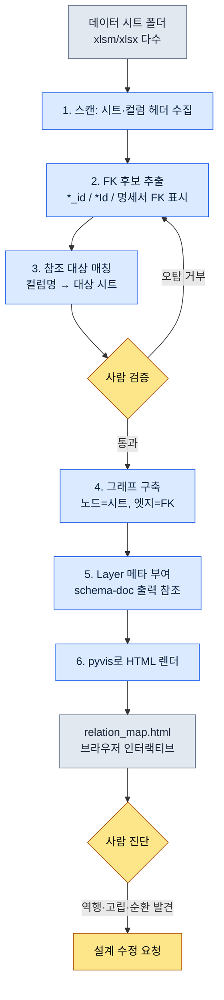

# 3.3 관계도 시각화 — 의존성을 눈으로 본다

신규 기획자가 입사 첫 주에 내 자리로 왔다. "퀘스트 보상 테이블을 손대려는데, 이거 건드리면 어디가 깨지나요?" 나는 모니터를 가리키며 답하려다 멈췄다. 머릿속에는 그림이 있었다. `RewardTable`이 `ItemTable`을 물고, `ItemTable`이 `ItemEffectTable`을 물고, 그 위로 `QuestTable`이 보상을 참조하고… 그런데 그 그림을 말로 옮기는 순간 듣는 사람의 머릿속에서는 형체가 무너졌다. 화이트보드에 박스 일곱 개를 그렸다. 화살표가 엉키기 시작했다. 30분 뒤, 그는 고개를 끄덕이며 자리로 돌아갔고, 다음 날 똑같은 질문을 다시 들고 왔다.

이 장면이 이 챕터를 쓰게 만들었다. 시스템 기획자의 머릿속에는 의존성 그래프가 있다. 문제는 그게 머릿속에만 있다는 것이다. 사람이 바뀌면 그림도 사라진다. 그림을 외부화하는 도구가 필요했고, 그래서 만든 것이 `gen_relation_map.py`다.

데이터 시트가 5\~10개일 때는 머릿속으로 충분하다. 30개를 넘어가면 사람의 작업기억으로는 감당이 안 된다. 한 프로젝트의 시트 폴더는 보통 그 선을 일찌감치 넘는다. 어디서 어디로 의존하는지를 글로 적은 표는, 읽어도 그림이 안 그려진다. 이 챕터는 외래 키 관계를 인터랙티브 HTML 관계도로 자동 생성하는 워크드 과정을 처음부터 끝까지 따라간다.

---

## 3.3.1 관계도가 푸는 네 가지 문제

도구를 만들기 전에, 관계도가 없을 때 실제로 무엇이 막히는지부터 짚는다. 네 장면이 반복됐다.

**신규 기획자 온보딩.** 새 기획자가 시스템 구조를 익히려고 회의를 잡는다. 위의 그 장면이다. 말로 전달된 의존성은 듣는 사람 머릿속에서 며칠을 못 간다. 관계도 한 장을 같이 클릭하면, 첫 회의에서 절반 이상이 그려진다. 화이트보드 손그림과 결정적으로 다른 점은 그림이 지워지지 않고 자리에 남는다는 것이다.

**변경 영향 범위 토론.** 시스템 변경 요청이 올라온다. "이거 어디 영향을 주죠?" 회의가 잡히고, 한참 토론하고도 누락 영역이 한둘 나온다. 관계도가 있으면 변경 대상 노드를 클릭해 인바운드 엣지를 따라가는 것으로 영향 범위가 눈에 들어온다. 토론은 "이 영향이 진짜 맞는지"와 우선순위만 정하면 된다.

**의존 역행 검출.** L3 데이터 시트가 L1 시스템 문서를 참조하는 건 정상이다. 반대 방향(상위 Layer가 하위 데이터 시트를 직접 참조)은 거의 항상 설계 결함이다. 글로 늘어놓은 FK 목록에서는 이 역행을 사람이 못 잡는다. 그림에서는 Layer 색상이 어긋난 화살표 하나로 즉시 드러난다.

**고립된 시트 발견.** 어디서도 참조되지 않는 시트가 가끔 발견된다. 옛 기획의 잔재거나, 폐기하기로 했는데 파일만 남은 경우다. 사무실 한구석에 라벨 없는 박스가 굴러다니는 풍경과 같다. 그림이 있어야 그 외딴섬을 발견한다.

네 문제의 공통점은 모두 "구조를 눈으로 봐야 풀린다"는 점이다. 글과 표로는 막힌다.

---

## 3.3.2 워크드 트랜스크립트: 데이터 시트에서 관계도까지

이제 실제로 따라간다. 입력은 데이터 시트가 든 폴더 하나, 출력은 브라우저에서 여는 인터랙티브 HTML 한 장이다. 그 사이에서 AI가 한 일과 사람이 검증/거부한 지점을 빠짐없이 적는다.

### 3.3.2.1 전체 흐름



핵심은 3번과 5번 사이의 사람 검증 루프다. FK 후보 추출은 기계가 초안을 깔고, 사람이 거기서 오탐을 솎아 낸다. 이 루프를 생략하면 관계도는 그럴듯하지만 틀린 그림이 된다.

### 3.3.2.2 FK는 어디서 나오는가 — 입력 순서

이 도구의 정확도는 입력을 어디서 끌어오느냐로 결정된다. 3.2에서 정한 schema-first 원칙이 그대로 적용된다. FK 정보의 정본 순서는 이렇다.

1. **`$스키마` 시트** — 각 데이터 시트의 첫 번째 정본. 컬럼별로 타입·Enum·FK 대상이 명시돼 있다. 여기에 FK가 적혀 있으면 그게 1순위다.
2. **`*.proto` / Enum 정의** — VBA(엑셀 매크로 언어) Export로 빠져나온 스키마. 명세서가 비어 있을 때 타입을 보강한다.
3. **실제 `csv` 출력** — 시트가 내보낸 실제 데이터. 명세서에 없는 관계도 데이터에서 패턴으로 드러난다(예: `npc_id` 컬럼의 값이 전부 `NPCTable`의 키 범위 안에 있다면 사실상 FK다).

여기서 한 가지 원칙을 분명히 해 둔다. **스키마 문서가 아니라 실제 JSON/csv 출력이 정본이다.** 명세서에 `reward_id`가 FK라고 적혀 있어도, 실제 데이터에서 그 컬럼이 비어 있거나 엉뚱한 값을 가리키면 명세서가 틀린 것이다. 도구는 둘이 어긋날 때 데이터 쪽을 신뢰하고, 어긋남 자체를 리포트에 남긴다. 이게 schema-doc을 정본으로 두지 않는 이유다.

### 3.3.2.3 1단계 — 폴더 스캔과 FK 후보 추출

도구의 첫 동작은 폴더 안 모든 xlsm/xlsx를 열어 시트·컬럼 헤더를 수집하는 것이다. 이 단계 자체는 기계적이라 흥미가 없다. 흥미로운 건 FK 후보를 뽑는 규칙이다. 처음엔 단순했다. 컬럼명이 `*_id` 또는 `*Id`로 끝나면 FK 후보로 본다. 그런데 이 규칙 하나로는 오탐과 누락이 둘 다 났다.

여기서 AI를 붙였다. 컬럼 헤더 목록을 통째로 넘기고 FK 대상 시트를 추론하게 했다. 아래는 실제로 던진 프롬프트 전문과 날것 출력이다.

> **프롬프트:**
> 다음은 게임 데이터 시트들의 시트명과 컬럼 헤더 목록이다. 각 컬럼이 외래 키(FK)인지, FK라면 어느 시트의 어느 컬럼을 참조하는지 추론하라. 컬럼명 규칙은 보통 `<대상시트단수형>_id`다. 단, 확신이 없으면 "불확실"로 표시하고 이유를 적어라. 추측으로 채우지 말 것.
>
> ```
> QuestTable: quest_id, title, npc_id, reward_id, prev_quest_id, region_id
> NPCTable: npc_id, name, region_id, faction_id
> RewardTable: reward_id, item_id, count, currency_id
> ItemTable: item_id, name, item_effect_id, grade
> ItemEffectTable: item_effect_id, effect_type, value
> RegionTable: region_id, name, parent_region_id
> ```

> **Claude 날것 출력(PK 행은 생략, FK 판단만 발췌):**
>
> **QuestTable**
> - `npc_id` → NPCTable.npc_id (퀘스트를 주는 NPC로 추정)
> - `reward_id` → RewardTable.reward_id
> - `prev_quest_id` → QuestTable.quest_id (선행 퀘스트, **자기 참조**)
> - `region_id` → RegionTable.region_id
>
> **NPCTable**
> - `region_id` → RegionTable.region_id
> - `faction_id` → **불확실**: FactionTable이 입력 목록에 없습니다. 컬럼명 규칙상 FactionTable.faction_id를 참조할 것으로 보이나, 해당 시트가 제공되지 않아 대상을 확정할 수 없습니다.
>
> **RewardTable**
> - `item_id` → ItemTable.item_id
> - `currency_id` → **불확실**: CurrencyTable이 목록에 없습니다. 화폐 종류가 Enum으로 관리될 가능성도 있어 FK가 아닐 수 있습니다. 명세서 확인이 필요합니다.
>
> **ItemTable**
> - `item_effect_id` → ItemEffectTable.item_effect_id
> - `grade` → FK 아님 (Enum으로 추정: 등급 값)
>
> **ItemEffectTable**
> - `effect_type` → FK 아님 (Enum으로 추정)
>
> **RegionTable**
> - `parent_region_id` → RegionTable.region_id (**자기 참조**, 지역 계층 구조)
>
> 주의: 위 추론은 컬럼명 규칙에 근거한 것이며, 실제 데이터 값을 확인하지 않았습니다. 특히 `count`, `value`처럼 `_id`로 끝나지 않는 컬럼은 FK 검사 대상에서 제외했는데, 숨은 참조가 있다면 누락됩니다.

이 출력에서 사람이 한 일은 세 가지다.

- **거부 1:** `faction_id` → AI는 FactionTable이 없다고 불확실 처리했다. 옳다. 다만 실제로는 `faction_id`가 Enum이었다. 팩션이 6종으로 고정이라 별도 시트 없이 Enum으로 관리한다. AI가 없는 시트를 지어내지 않고 판단을 멈춘 덕에, 사람이 명세서를 보고 Enum으로 확정할 수 있었다. **FK에서 제외.**
- **거부 2:** `currency_id` → AI가 둘 다 가능성을 열어 뒀다. 실제 데이터를 보니 `CurrencyTable`이 존재했다(입력 목록에서 내가 빠뜨렸다). **FK로 확정.** AI를 탓할 수 없는, 사람의 입력 누락이었다.
- **수용:** `prev_quest_id`와 `parent_region_id`의 자기 참조 검출. 이건 단순 정규식 규칙이었다면 놓쳤을 것이다. AI가 "선행 퀘스트", "지역 계층"이라는 의미까지 붙여 준 게 검증을 빠르게 했다.

여기서 얻은 교훈은 명확하다. AI가 가장 쓸모 있었던 대목은 빠른 추론이 아니라 **모르는 자리를 "불확실"로 비워 둔 절제**였다. 빈칸을 억지로 메웠다면 `faction_id`가 엉뚱한 시트로 연결됐을 것이고, 그 오탐은 관계도에 가짜 화살표로 남아 신규 기획자를 잘못 인도했을 것이다.

### 3.3.2.4 2단계 — 그래프 구축과 Layer 부여

검증된 FK 목록이 나오면 `gen_relation_map.py`가 그래프를 만든다. 시트는 노드, FK는 방향 엣지다. 인바운드 엣지 수(다른 시트가 나를 얼마나 참조하는가)를 세어 노드 크기를 정한다. 많이 참조될수록 큰 노드, 즉 시스템의 허브다.

Layer 메타데이터는 `schema-doc` 스킬이 만든 마크다운 스키마 문서에서 끌어온다. 3.1에서 정의한 Layer 좌표(L0\~L4)가 각 시트에 라벨로 붙어 있고, 도구는 그걸 읽어 노드 색상을 칠한다. 이 연결이 중요하다. 관계도가 Layer를 모르면 그냥 박스와 화살표일 뿐이고, Layer를 알아야 "역행"을 색으로 진단할 수 있다.

도구 내부 구조를 코드 골격으로 보이면 이렇다(핵심 흐름만 발췌).

```python
# gen_relation_map.py (핵심 흐름 발췌)
from pyvis.network import Network

LAYER_COLORS = {          # Layer 팔레트 — atom 1개로 표준화
    "L0": "#2c3e50",      # 메타/공용
    "L1": "#2980b9",      # 시스템
    "L2": "#27ae60",      # 콘텐츠
    "L3": "#f39c12",      # 데이터 인스턴스
    "L4": "#c0392b",      # 파생/캐시
}

def build_graph(fk_list, layer_map):
    net = Network(directed=True, height="900px")
    inbound = count_inbound(fk_list)          # 인바운드 엣지 집계
    for sheet in all_sheets(fk_list):
        layer = layer_map.get(sheet, "L0")
        size = 10 + inbound[sheet] * 3        # 허브일수록 큰 노드
        net.add_node(sheet, color=LAYER_COLORS[layer],
                     size=size, title=sheet_tooltip(sheet))
    for src, dst, col in fk_list:
        # Layer 역행 감지: 상위 Layer가 하위를 참조하면 경고색
        edge_color = "#e74c3c" if is_reverse(src, dst, layer_map) else "#888"
        net.add_edge(src, dst, title=col, color=edge_color)
    return net
```

`is_reverse`가 이 도구의 작은 핵심이다. 엣지의 출발 시트가 도착 시트보다 상위 Layer면(예: L1 → L3) 역행으로 보고 엣지를 빨강으로 칠한다. 사람이 그림을 열었을 때 빨간 화살표가 보이면 그건 거의 항상 손볼 곳이다.

### 3.3.2.5 3단계 — HTML 렌더와 결과 구조

마지막은 pyvis가 인터랙티브 HTML을 뱉는 단계다. 노드 클릭 시 해당 시트의 컬럼·Layer·인바운드 수가 툴팁으로 뜨고, 검색창에서 시트명으로 필터링할 수 있다. 정적 PNG가 아니라 HTML이어야 하는 이유가 여기 있다 — 노드 수가 수십 개를 넘으면 정적 이미지에서는 화살표가 엉켜 아무것도 안 보인다. 마우스로 끌어 펼치고, 관심 영역만 클릭으로 좁혀야 패턴이 잡힌다.

위 예시 데이터로 만든 관계도의 구조를 SVG로 옮기면 이렇다. 색상은 Layer, 빨간 화살표는 (이 예시엔 없지만) 역행 자리를 의미한다.

<svg viewBox="0 0 720 360" xmlns="http://www.w3.org/2000/svg" font-family="sans-serif" font-size="13">
  <defs>
    <marker id="arrow" markerWidth="10" markerHeight="10" refX="9" refY="3" orient="auto" markerUnits="strokeWidth">
      <path d="M0,0 L9,3 L0,6 Z" fill="#888"/>
    </marker>
  </defs>
  <!-- nodes -->
  <rect x="40" y="30" width="130" height="40" rx="6" fill="#2980b9"/>
  <text x="105" y="55" fill="#fff" text-anchor="middle">RegionTable (L1)</text>
  <rect x="300" y="30" width="130" height="40" rx="6" fill="#27ae60"/>
  <text x="365" y="55" fill="#fff" text-anchor="middle">QuestTable (L2)</text>
  <rect x="560" y="30" width="130" height="40" rx="6" fill="#27ae60"/>
  <text x="625" y="55" fill="#fff" text-anchor="middle">NPCTable (L2)</text>
  <rect x="300" y="150" width="130" height="40" rx="6" fill="#f39c12"/>
  <text x="365" y="175" fill="#fff" text-anchor="middle">RewardTable (L3)</text>
  <rect x="560" y="150" width="130" height="40" rx="6" fill="#f39c12"/>
  <text x="625" y="175" fill="#fff" text-anchor="middle">ItemTable (L3)</text>
  <rect x="560" y="270" width="150" height="40" rx="6" fill="#f39c12"/>
  <text x="635" y="295" fill="#fff" text-anchor="middle">ItemEffectTable (L3)</text>
  <!-- edges -->
  <line x1="300" y1="50" x2="172" y2="50" stroke="#888" stroke-width="2" marker-end="url(#arrow)"/>
  <line x1="560" y1="50" x2="432" y2="50" stroke="#888" stroke-width="2" marker-end="url(#arrow)"/>
  <line x1="625" y1="70" x2="380" y2="150" stroke="#888" stroke-width="2" marker-end="url(#arrow)"/>
  <line x1="365" y1="70" x2="365" y2="150" stroke="#888" stroke-width="2" marker-end="url(#arrow)"/>
  <line x1="560" y1="170" x2="432" y2="170" stroke="#888" stroke-width="2" marker-end="url(#arrow)"/>
  <line x1="625" y1="190" x2="625" y2="270" stroke="#888" stroke-width="2" marker-end="url(#arrow)"/>
  <!-- self-ref -->
  <path d="M170,40 q40,-30 0,-10" fill="none" stroke="#888" stroke-width="2" marker-end="url(#arrow)"/>
  <text x="200" y="20" fill="#666" font-size="11">parent_region_id (자기참조)</text>
</svg>

노드 크기를 보면 `RegionTable`이 가장 많이 참조된다(Quest·NPC가 모두 가리킴). 이게 허브다. `ItemEffectTable`은 잎사귀 노드라 작다. 신규 기획자에게 "이 시스템을 이해하려면 어디부터 보냐"는 질문의 답이, 노드 크기 순서로 그림에 이미 들어 있다.

---

## 3.3.3 그림이 만드는 진단 — Layer와 결합

3.1에서 Layer 좌표를 정의했다. 이 챕터의 관계도가 그 좌표를 시각으로 끌어올리면, 글이나 표로는 불가능했던 진단 네 가지가 한 화면에서 가능해진다.

- **Layer 역행** — Layer 색상이 역방향으로 흐르는 화살표(빨강). 데이터 시트가 시스템 설계에 거꾸로 영향을 주는 부자연스러운 구조다.
- **고립된 노드** — 어떤 엣지와도 연결 안 된 외딴섬. 폐기 후보다.
- **허브 과부하** — 인바운드 엣지가 비정상적으로 많은 거대 노드. 한 시트가 너무 많은 책임을 지고 있다는 신호로, 분할을 검토한다.
- **순환 의존** — 화살표가 원을 그리는 자리. 거의 항상 설계 결함이고, 데이터 로딩 순서 문제로 이어진다.

다만 그림이 모든 문제를 잡는다는 뜻은 아니다. 그림은 **구조적 결함**을 잡는다. 이 FK가 정말 의미상 맞는 관계인지(예: `npc_id`가 정말 "퀘스트를 주는 NPC"인지 아니면 "퀘스트에 등장하는 NPC"인지)는 그림으로 안 풀린다. 그건 사람의 도메인 판단 몫이다. 도구는 사람의 판단이 작동할 무대를 깔아 줄 뿐이다.

---

## 3.3.4 자동 갱신이 없으면 부식한다

관계도는 한 번 만들고 끝이 아니다. 시트는 매주 추가·변경된다. 수동 갱신에 맡긴 관계도는 한두 달이면 실제 구조와 어긋나고, 어긋난 지도는 길을 잘못 안내하므로 차라리 없느니만 못해진다. 한 번 틀린 그림에 데인 팀원은 다음부터 그림을 안 본다 — 이게 가장 비싼 실패다.

그래서 갱신을 자동 트리거에 건다.

- **Git pre-push hook** — 데이터 시트를 푸시하기 전에 관계도를 재생성한다. 항상 최신 상태가 보장된다.
- **변경 요청 시점** — 데이터 시트 변경 요청이 올라오면, 변경 전후 관계도를 diff로 비교해 코멘트에 붙인다. 추가된 엣지는 초록, 사라진 엣지는 빨강. 리뷰어가 영향 범위를 그림으로 본다.
- **야간 배치** — 매일 밤 새 관계도를 만들고 전날과 diff를 남긴다.
- **수동 명령** — `/relation-map` 슬래시로 즉시 생성. 회의 중 즉석에서 띄울 때 쓴다.

생성된 HTML은 사내 정적 호스팅(기획 포탈)에 자동 배포한다. 별도 도구 설치 없이 브라우저만 있으면 누구나 같은 지도를 본다. 책상 옆에 항상 펼쳐 둔 지도와 같다. 누가 묻든, 같은 그림을 함께 가리키며 답한다.

---

## 3.3.5 흔한 실수와 회피법

| 실수 | 왜 생기나 | 회피법 |
|---|---|---|
| 노드가 100개를 넘어 그림이 엉킴 | 전 분야를 한 화면에 욱여넣음 | 도메인별 필터링, 그룹별 분할 뷰 |
| Layer 색상이 도구마다 다름 | 팔레트를 코드마다 새로 정의 | 팔레트를 atom 1개로 표준화(`LAYER_COLORS`) |
| FK 검출이 `*_id`만 잡아 누락·오탐 | 정규식 한 줄에 의존 | 명세서 FK 명시 + 실데이터 값 검증을 병행 |
| 그림은 만들었는데 아무도 안 봄 | 워크플로에 연결 안 함 | 변경 요청·회의에 그림 첨부를 강제 |
| 만들고 갱신 안 해 부식 | 수동 갱신에 의존 | 자동 트리거 필수, 수동은 한 달이면 무용 |

`gen_relation_map.py` 운영에서 가장 자주 데인 건 세 번째 줄이다. `*_id` 규칙만 믿으면 `count`나 `value` 같은 숨은 참조를 놓치고(3.3.2.3의 AI도 이 한계를 스스로 경고했다), Enum인 `grade`를 FK로 오탐한다. 명세서와 실데이터를 둘 다 보는 검증 루프가 이 줄의 답이다.

---

## 3.3.6 1인 축소판으로 먼저 해 보기

회사 전체 데이터 시트를 한 번에 다루려 하면 무겁고, 가치를 보여 주기도 전에 지친다. 본인 분야 한 폴더부터 작게 시작한다.

### 따라하기

**setup.**
1. 본인이 담당하는 데이터 시트 5\~10개가 든 폴더 하나를 고르세요.
2. `pip install pyvis openpyxl`로 의존성을 까세요(엑셀 읽기는 `excel-reader` 스킬 또는 openpyxl).
3. 각 시트의 `$스키마` 시트에서 FK가 명시돼 있는지 먼저 확인하세요. 없으면 컬럼 헤더만 모읍니다.

**prompt.** 컬럼 헤더 목록을 모아 3.3.2.3의 프롬프트를 그대로 던지세요. 핵심은 마지막 한 줄입니다 — "확신이 없으면 불확실로 표시하고, 추측으로 채우지 말 것." 이 문장이 가짜 화살표를 막습니다.

**verify.**
1. AI가 던진 FK 후보를 한 줄씩 보세요. "불확실"로 표시된 줄을 명세서/실데이터로 확정합니다.
2. Enum으로 의심되는 컬럼(`grade`, `effect_type`처럼 `_id`가 없는데 FK처럼 보이는 것)은 FK에서 빼세요.
3. 자기 참조(`prev_*_id`, `parent_*_id`)가 맞게 잡혔는지 확인하세요.
4. 검증된 목록으로 그래프를 그리고, 브라우저에서 열어 빨간 화살표(역행)와 외딴섬(고립)을 눈으로 찾으세요.

### 1인 축소판

도구를 만들 시간이 없다면, 첫 주에는 손으로 그린 mermaid 한 장으로 시작해도 됩니다. 시트 5개의 FK를 3.3.2.3의 형식으로 mermaid에 직접 적으세요. 이 한 장을 회의에 들고 가서 "이게 우리 시스템 의존성입니다"라고 보여 주면, 그 자리에서 가치가 증명됩니다. 가치가 보이면 자동화 도구는 자연히 다음에 따라옵니다. 처음부터 동작하는 도구가 나와야 한다는 부담은 내려놓으셔도 됩니다.

확장은 이 순서로 자연스럽게 흐릅니다 — 1주차 본인 시트 mermaid 손그림 → 2주차 Layer 색상과 클릭 추가 → 1개월 자동 갱신(git hook 또는 야간 배치) → 3개월 사내 포탈 배포 → 6개월 전체 시트 통합 관계도.

---

## 3.3.7 다음 챕터로 연결

3.2에서 시트 안쪽(스키마)을, 3.3에서 시트 바깥(관계)을 다뤘다. 3.4은 이 위에 AI 보조 프롬프트 패턴을 얹는다. 스키마와 관계가 잡힌 시스템 위에서, AI가 정합성 검사와 영향 범위 추출을 어떻게 보조하는지의 실용 패턴들로 이어진다.

---

### 이 챕터의 핵심 메시지
- 머릿속 의존성 그래프를 외부화하면 사람이 바뀌어도 같은 그림이 자리에 남는다.
- FK 추출은 AI가 깐 초안에서 사람이 오탐을 솎아 내는 검증 루프가 정확도를 만든다.
- 자동 갱신 없는 관계도는 한두 달이면 부식해 신뢰를 잃는다.

### 다음 챕터 미리보기
- 3.4. AI 보조 시스템 설계 프롬프트 패턴
