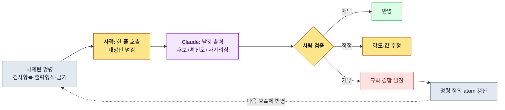
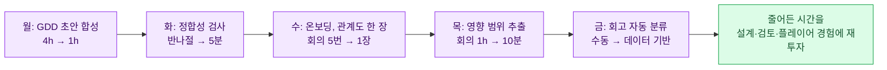

# 3.4 AI 보조 시스템 설계 프롬프트 패턴

알파 빌드를 코앞에 둔 주였다. 스킬 시트에 새 클래스 한 줄을 추가하고 저장했다. 그런데 그 클래스가 참조하는 버프 ID가 전날 누군가 지운 행이라는 걸, 나는 다음 날 아침 빌드가 깨지고 나서야 알았다. 깨진 빌드를 거슬러 올라가 원인을 찾는 데 두 시간이 걸렸다. 행 하나 지우기 전에 "이거 지워도 돼?"라고 물어볼 수만 있었다면 쓰지 않았을 두 시간이다.

이 장은 그 질문을 AI에게 시키는 법에 관한 것이다. 핵심은 프롬프트를 잘 쓰는 요령이 아니다. 같은 질문을 매번 0에서 다시 쓰지 않도록 박제하는 일이다. 3.2에서 스키마를, 3.3에서 관계도를 깔았다. 둘 다 데이터의 뼈대였다. 이 장은 그 뼈대 위에서 사람이 AI에게 던지는 질문 자체를 자산으로 굳힌다.

먼저 한 가지 못을 박아 둔다. AI가 만드는 것은 답이 아니라 후보다. 이 장에 나오는 모든 패턴에서, 마지막 결정의 손은 끝까지 사람 쪽에 남는다.

---

## 3.4.1 즉흥 프롬프트가 새는 두 군데

AI를 처음 쓰면 매번 자연어로 즉석에서 친다. 이런 식이다.

```
스킬 시트 한번 봐줘. 외래 키 깨진 거 없나 확인하고,
이상한 거 있으면 알려줘. 아 그리고 쿨다운 음수인 것도.
```

이 프롬프트는 두 군데에서 샌다.

첫째, 검사 항목이 매번 달라진다. 오늘은 "쿨다운 음수"를 떠올렸지만 내일은 잊는다. 어제 한 번 걸렀던 "중복 PK(Primary Key, 기본 키)"가 오늘 프롬프트엔 빠진다. 사람의 기억에 의존하는 검사는 사람의 컨디션만큼 누락된다.

둘째, 결과 형식이 매번 달라진다. 같은 의도를 "확인해줘" "검사해" "훑어봐"로 다르게 적으면, AI는 어떤 날은 표로, 어떤 날은 줄글로 답한다. 형식이 들쭉날쭉하면 그 결과를 다시 자동 처리할 수가 없다.

해법은 프롬프트를 손에서 떼어 서랍에 넣는 것이다. 매번 손으로 적던 메모를, 라벨 붙은 카드로 바꿔 같은 서랍에서 꺼낸다. 그 카드가 이 책에서 말하는 슬래시 명령(skill)이고 atom이다.

---

## 3.4.2 박제의 세 형태와 고르는 기준

박제에는 세 가지 그릇이 있다. 무엇을 어디에 담을지는 호출 빈도와 안정성으로 갈린다.

<svg viewBox="0 0 720 300" xmlns="http://www.w3.org/2000/svg" font-family="sans-serif" font-size="13">
  <rect x="0" y="0" width="720" height="300" fill="#fbfbfd"/>
  <line x1="120" y1="40" x2="120" y2="280" stroke="#bbb" stroke-width="1"/>
  <line x1="120" y1="160" x2="700" y2="160" stroke="#bbb" stroke-width="1"/>
  <text x="60" y="35" text-anchor="middle" font-weight="bold">호출 빈도</text>
  <text x="60" y="55" text-anchor="middle" fill="#888" font-size="11">높음 ↑</text>
  <text x="60" y="270" text-anchor="middle" fill="#888" font-size="11">낮음 ↓</text>
  <text x="410" y="298" text-anchor="middle" font-weight="bold">정의 안정성 →</text>

  <rect x="150" y="70" width="200" height="70" rx="8" fill="#e8f0fe" stroke="#4285f4"/>
  <text x="250" y="98" text-anchor="middle" font-weight="bold">슬래시 명령(skill)</text>
  <text x="250" y="118" text-anchor="middle" font-size="11" fill="#555">자주·안정 → /check-sheet</text>
  <text x="250" y="133" text-anchor="middle" font-size="11" fill="#555">한 단어 호출, 결과 형식 고정</text>

  <rect x="400" y="70" width="270" height="70" rx="8" fill="#fef7e0" stroke="#f9ab00"/>
  <text x="535" y="98" text-anchor="middle" font-weight="bold">atom 자동 주입(JIT)</text>
  <text x="535" y="118" text-anchor="middle" font-size="11" fill="#555">자주·핵심제약 → 키워드로 트리거</text>
  <text x="535" y="133" text-anchor="middle" font-size="11" fill="#555">외울 필요 없음, 자연어에 끼어듦</text>

  <rect x="150" y="190" width="200" height="70" rx="8" fill="#e6f4ea" stroke="#34a853"/>
  <text x="250" y="218" text-anchor="middle" font-weight="bold">템플릿 파일(.md)</text>
  <text x="250" y="238" text-anchor="middle" font-size="11" fill="#555">가끔·큰 작업 → 파일 호출</text>
  <text x="250" y="253" text-anchor="middle" font-size="11" fill="#555">눈으로 보고 고치기 쉬움</text>

  <rect x="400" y="190" width="270" height="70" rx="8" fill="#f1f3f4" stroke="#9aa0a6"/>
  <text x="535" y="225" text-anchor="middle" font-size="12" fill="#777">가끔·정의 불안정 →</text>
  <text x="535" y="243" text-anchor="middle" font-size="12" fill="#777">아직 박제하지 말 것 (즉흥 유지)</text>
</svg>

자주 쓰고 정의가 굳은 작업은 슬래시 명령으로. 자주 쓰지만 "잊으면 안 되는 제약"은 atom JIT로 자동 주입. 가끔 하지만 덩치 큰 작업은 템플릿 파일로. 그리고 아직 정의가 흔들리는 작업은 박제하지 않고 즉흥으로 둔다. 셋을 처음부터 다 갖출 필요는 없다. 슬래시 명령 한두 개로 시작해 가치가 보이면 늘린다.

---

## 3.4.3 패턴 ① 정합성 검사 — 워크드 트랜스크립트

말로 설명하는 대신, 한 패턴을 처음부터 끝까지 따라가 보겠다. 빈 행 하나를 지우기 전에 "이거 지워도 돼?"를 자동으로 묻는 패턴이다. 이름은 `/check-sheet`. 안에는 검사 항목과 출력 형식이 박제돼 있다.

근거가 되는 자산은 이 책 곳곳에서 임베드된 실측 작업기록에 있다. 데이터 입력은 schema-first 원칙(atom `data_entry_schema_first`)을 따른다. 입력 순서는 `$스키마` 시트 → `Enum/*.proto`(VBA(엑셀 매크로 언어) Export) → csv. 그리고 정본은 스키마 문서가 아니라 실제 JSON 출력이다(atom `json_over_schema_doc_as_source_of_truth`). 정합성 검사는 이 두 원칙을 그대로 검사 규칙으로 옮긴 것이다.

### setup — 박제된 명령의 속

`/check-sheet`를 펼치면 안에 이런 프롬프트 본문이 들어 있다. 이게 매번 손으로 안 쳐도 되는 부분이다.

```
역할: 너는 게임 데이터 시트의 정합성 검사기다.

검사할 시트: {{sheet_name}}
참조 가능한 스키마: $스키마 시트 (컬럼별 타입·범위·FK 대상)
참조 가능한 정본: 같은 시트의 export JSON (스키마 문서보다 우선)

검사 항목 (이 순서로):
1. 외래 키 유효성 — FK 컬럼 값이 참조 대상 시트에 실재하는가
2. 범위 위반 — $스키마에 정의된 min/max를 벗어난 값
3. 필수 컬럼 누락 — required=true 컬럼이 빈 행
4. 중복 PK — 같은 PK가 둘 이상

출력 형식 (반드시 이 표 그대로):
| # | 행 | 컬럼 | 위반 종류 | 현재 값 | 수정 후보 | 확신도 |

규칙:
- 수정 후보는 제안만 한다. 절대 시트를 직접 고치지 않는다.
- 확신도는 높음/중간/낮음 셋 중 하나. 추측이면 낮음.
- 위반이 없으면 "위반 0건"만 출력하고 끝낸다.
```

이 본문에서 중요한 건 마지막 규칙 세 줄이다. "직접 고치지 않는다", "확신도를 매긴다", "추측은 낮음으로 자백한다". 이 세 줄이 AI를 답을 내는 자리가 아니라 후보를 미는 자리에 묶어 둔다.

### prompt — 사람이 실제로 친 한 줄

```
/check-sheet skill_table
```

끝이다. 시트 이름 하나만 넘긴다. 검사 항목 네 개도, 출력 표 형식도 다시 쓰지 않는다. 그게 박제의 값어치다.

### Claude의 날것 출력

아래는 실제로 돌렸을 때 돌아온 출력이다. 요약하지 않고, 애매했던 부분과 AI가 머뭇거린 자리까지 그대로 싣는다.

```
skill_table 정합성 검사 결과입니다. 총 4건의 위반을 발견했습니다.

| # | 행  | 컬럼        | 위반 종류    | 현재 값 | 수정 후보              | 확신도 |
|---|-----|------------|------------|--------|----------------------|------|
| 1 | 142 | buff_id    | 외래 키 위반 | 9007   | 9070 (오타 추정, 1글자) | 중간   |
| 2 | 142 | buff_id    | 외래 키 위반 | 9007   | 9012 (이름 "맹독" 유사) | 낮음   |
| 3 | 88  | cooldown   | 범위 위반    | -1     | 0 (음수 불가)           | 높음   |
| 4 | 215 | combo_next | 필수 누락    | (빈칸)  | 판단 보류               | 낮음   |

주의 사항 몇 가지를 덧붙입니다.

- 1번과 2번은 같은 행(142)의 같은 컬럼에 대한 서로 다른 후보입니다.
  9007이라는 ID는 buff 시트에 존재하지 않습니다. 9070은 숫자 한 자리
  차이라 오타일 가능성이 있고, 9012는 이름이 "맹독"으로 유사해서
  후보로 올렸습니다. 둘 다 확신은 낮습니다. 사람이 골라야 합니다.

- 4번(215행 combo_next 빈칸)은 애매합니다. $스키마에는 required=true로
  되어 있는데, export JSON을 보니 이 컬럼이 빈 행이 12개 더 있습니다.
  명세서가 최신이 아니거나, "콤보 종결 스킬은 combo_next를 비운다"는
  규칙이 있는데 명세서에 반영이 안 됐을 수 있습니다. 제가 단정할 수
  없어서 "판단 보류"로 두었습니다.

- cooldown 외에 범위 검사를 더 돌리고 싶으면 $스키마의 다른 컬럼
  min/max를 확인해야 하는데, 제가 받은 정보에 range_check 컬럼 일부가
  비어 있어서 cast_time 컬럼은 검사하지 못했습니다.
```

여기서 이 출력이 좋은 출력인 이유는, 깔끔해서가 아니라 솔직해서다. 4번을 "필수니까 채워라"라고 단정하지 않고 "명세서가 최신이 아닐 수 있다"고 자기 의심을 드러냈다. cast_time을 못 봤다는 한계도 자백했다. 만약 AI가 4번을 자신만만하게 "0으로 채우세요"라고 했다면, 그건 콤보 종결 스킬을 망가뜨리는 오답이었을 수 있다.

### verify — 사람의 검증과 거부

이제 사람이 한 줄씩 판정한다. 검증이 자동 동반된다는 건 이 표가 자동으로 나온다는 뜻이지, 사람이 안 본다는 뜻이 아니다.

- **3번(cooldown -1 → 0)**: 채택. 확신도 높음, 음수 쿨다운은 명백한 입력 실수. 바로 고침.
- **1·2번(buff_id 9007)**: 보류. 둘 다 확신 낮음. buff 시트를 직접 열어 "맹독" 계열 버프의 실제 ID를 확인하기로. AI 후보 둘 다 채택하지 않음.
- **4번(combo_next 빈칸)**: **거부**. AI가 의심한 게 맞았다. 이 스킬은 콤보 종결기라 combo_next가 비는 게 정상이다. 위반이 아니다. 거부하고, 이건 명세서 쪽 문제다.

마지막 4번이 핵심이다. AI 출력을 그대로 믿었다면 멀쩡한 데이터를 망가뜨렸을 자리에서, 사람의 거부가 작동했다. 동시에 4번은 검사 규칙 자체의 결함도 드러냈다. 명세서의 `required=true`가 틀린 것이다.

### 재요청 — 거부가 규칙을 고친다

여기서 끝내지 않는다. 거부는 다음 검사를 더 똑똑하게 만드는 입력이다. 사람이 이어서 친다.

```
4번은 위반이 아니야. combo_finisher=true인 스킬은 combo_next가 비는 게
정상이거든. 이 예외 규칙을 검사 항목에 넣어서, 앞으로는 finisher 행의
combo_next 빈칸은 위반으로 잡지 마. 그리고 명세서의 required 정의가
틀렸다고 보이는 항목은 따로 "명세서 의심" 섹션으로 빼서 알려줘.
```

```
이해했습니다. /check-sheet의 검사 규칙에 예외를 반영하겠습니다.

추가된 규칙:
- combo_next 필수 검사 시, 같은 행의 combo_finisher 값을 먼저 확인.
  combo_finisher=true이면 combo_next 빈칸은 정상으로 처리(위반 제외).

신설 섹션:
- "명세서 의심" — export JSON의 실제 분포가 $스키마 정의와 어긋날 때,
  데이터가 아니라 명세서를 고쳐야 할 후보로 분리해 보고.
  (정본은 JSON이라는 원칙에 따라, 다수 데이터가 명세서를 거스르면
   명세서 쪽을 의심합니다.)

이 변경을 /check-sheet 명령 정의 atom에 기록해 둘까요?
```

마지막 한 줄이 이 패턴의 완성이다. 한 번의 거부가 일회성 수정으로 끝나지 않고, 명령 정의 atom에 기록되어 다음 사람·다음 검사로 전파된다. 이게 박제의 복리다. 같은 실수를 두 번 거르지 않는다.

---

## 3.4.4 패턴 ② 변경 영향 범위 추출 — 워크드 트랜스크립트

두 번째 패턴은 첫 장면의 그 두 시간을 없애는 것이다. 행 하나, 결정 하나를 바꾸기 전에 "이게 어디까지 번지나"를 먼저 묻는다. 이름은 `/impact`. 3.3에서 만든 관계도(`gen_relation_map.py`가 뽑는 FK 관계 HTML)가 이 패턴의 연료다.

### setup — 박제된 탐색 경로

`/impact` 안에는 "어디를 뒤져야 영향을 빠짐없이 찾는가"가 네 갈래로 박제돼 있다.

```
역할: 너는 변경 영향 범위 추출기다.

변경 대상: {{target}}  (시트명·컬럼·atom_id·시스템 결정 중 하나)

탐색 경로 (넷 다 돌 것):
1. 관계도 인바운드 — gen_relation_map.py 출력에서 {{target}}을
   FK로 참조하는 시트들 (이 시트를 가리키는 화살표)
2. 본문 언급 — sources/manuscript 안에서 {{target}}의 ID·이름이
   직접 등장하는 문서
3. atom affects 관계 — {{target}}과 affects로 연결된 atom들
4. 역참조 — {{target}}을 [[wikilink]]로 가리키는 노트

출력 형식:
| 종류 | 이름 | 연결 근거 | 영향 강도 | 담당 |

규칙:
- 영향 강도는 직접/간접/약 셋이다. 직접 FK는 '직접', 본문 언급은 '간접', 추정은 '약'.
- 누락이 두려우면 약으로라도 올린다. 빠뜨리는 것보다 낫다.
- 우선순위나 작업 지시는 하지 않는다. 목록만 만든다.
```

### prompt

```
/impact buff_id=9012
```

"맹독 버프(9012)를 다른 효과로 교체하려는데, 어디가 흔들리나?"를 한 줄로 묻는다.

### Claude의 날것 출력

```
buff_id=9012(맹독)의 변경 영향 범위입니다. 4개 경로를 모두 탐색했습니다.

| 종류    | 이름                | 연결 근거              | 영향 강도 | 담당      |
|--------|--------------------|----------------------|---------|----------|
| 시트    | skill_table         | buff_id FK 직접 참조    | 직접       | teammate_a |
| 시트    | monster_drop        | reward_buff FK 참조     | 직접       | teammate_b |
| 시트    | set_item_effect     | proc_buff FK 참조       | 직접       | teammate_a |
| 문서    | 독계열_밸런스_노트.md  | 본문에 "9012" 직접 언급  | 간접       | (저자)     |
| atom    | poison_stack_rule   | affects: 9012          | 간접       | (저자)     |
| 노트    | 상태이상_설계.md       | [[맹독]] 역참조          | 약       | (저자)     |

몇 가지 덧붙입니다.

- skill_table에서 9012를 참조하는 행은 3개입니다(암살자 클래스 스킬).
  교체하면 이 3개 스킬의 실제 효과가 바뀝니다. 가장 강한 영향입니다.

- monster_drop의 reward_buff는 제가 확신이 좀 약합니다. 컬럼 이름이
  reward_buff인데 일부 행은 buff가 아니라 item을 가리키는 것 같은
  값이 섞여 있어서요. 이 시트는 직접 한 번 열어 확인하시길 권합니다.

- "독계열_밸런스_노트.md"는 9012를 텍스트로 언급할 뿐 FK는 아니라
  간접으로 두었습니다. 다만 밸런스 의도가 적힌 문서라 실제 영향은
  강할 수 있습니다. 강도(간접)와 중요도가 다를 수 있다는 점 유의하세요.

- set_item_effect는 세트 아이템 4종에서 proc_buff로 9012를 씁니다.
  맹독을 빼면 이 세트들의 컨셉이 바뀝니다.
```

### verify — 사람의 검증과 거부

- **skill_table(직접, 팀원 A)**: 확인. 암살자 스킬 3개가 직접 영향. 팀원 A에게 공유 필요. 채택.
- **monster_drop(직접)**: AI가 스스로 의심한 항목. 시트를 직접 열어 확인. 결과: reward_buff 컬럼에 정말로 item ID가 섞여 있었고, 9012를 참조하는 행은 실제로 1개뿐이었다. AI의 "확신 약함" 자백이 정확했다. 강도를 직접→간접으로 **하향 정정**.
- **set_item_effect(직접, 팀원 A)**: 확인. 세트 4종 영향. 채택.
- **상태이상_설계.md(약)**: 단순 역참조, 본문 영향 없음. 목록엔 남기되 작업 대상에서 제외.

여기서도 AI의 정직함이 검증을 도왔다. monster_drop을 직접이라 단정했다면 영향을 부풀려 불필요한 조율 회의가 잡혔을 것이다. AI가 "확인하시길 권합니다"라고 공을 사람에게 넘긴 덕에 강도를 바로잡았다.

### 재요청 — 추출에서 공유로

목록이 검증되면 그다음 손은 이걸 사람에게 전달하는 일이다.

```
직접 영향 받는 담당자별로 묶어서, teammate_a / teammate_b에게
보낼 짧은 공유 메모 초안 만들어줘. "9012 맹독을 X로 교체 검토 중,
당신 시트 N개 행이 영향" 형식으로. 결정은 아직 안 났으니 통보가
아니라 의견 요청 톤으로.
```

```
담당자별 공유 메모 초안입니다. 통보가 아닌 의견 요청 톤으로 잡았습니다.

[teammate_a 앞]
맹독 버프(9012)를 다른 효과로 교체하는 안을 검토 중입니다. 확정은
아니고 의견을 먼저 듣고 싶습니다. 영향 범위:
- skill_table: 암살자 스킬 3개 행이 9012를 참조 (직접 영향)
- set_item_effect: 세트 아이템 4종이 proc_buff로 9012 사용
교체 시 이 스킬·세트들의 컨셉이 바뀝니다. 반대나 보완 의견 있으면
이번 주 안에 알려주세요.

[teammate_b 앞]
monster_drop의 reward_buff 관련해 확인 부탁입니다. 맹독 버프(9012)
교체를 검토 중인데, 영향 행이 1개로 보입니다(reward_buff 컬럼에
item ID가 섞여 있어 처음엔 더 많아 보였습니다). 실제로 이 1개 행만
맞는지 확인해 주실 수 있을까요?

두 메모 모두 "검토 중·의견 요청"으로 두었고, 확정 통보 표현은
넣지 않았습니다. 보내기 전에 교체 후보 효과(X 자리)를 채우셔야 합니다.
```

첫 장면의 두 시간이 여기서 사라진다. 변경 전에 영향을 묻고, 담당자에게 미리 공유하고, 다음 날 빌드가 깨지기 전에 조율이 끝난다. 그리고 AI가 만든 건 끝까지 메모 초안일 뿐, 보내는 손가락은 사람의 것이다.

---

## 3.4.5 두 패턴이 공유하는 골격

위 두 트랜스크립트는 같은 골격을 따른다. 다른 모든 패턴도 이 골격에 얹힌다.



핵심은 오른쪽 아래의 점선이다. 거부가 끝이 아니라 명령 자체를 고치는 입력으로 돌아간다. 정합성 검사에서 거부된 4번이 finisher 예외 규칙이 됐고, 그 규칙이 atom에 기록되어 다음 검사로 전파됐다. 이 되먹임이 없으면 같은 오답을 매주 다시 거른다.

세 군데에 사람의 손이 남는다. 호출(대상 선택), 검증(채택·정정·거부), 규칙 개선(거부의 환류). AI는 그 사이에서 후보를 미는 일만 한다.

---

## 3.4.6 나머지 패턴 — 같은 골격의 변주

같은 골격을 다른 작업에 옮기면 패턴이 늘어난다. 트랜스크립트 없이 자리만 짚는다. 모두 3.4.5의 골격을 그대로 따르므로, 만들 때 핵심은 "박제된 검사 항목"과 "사람 검증 자리"를 빼먹지 않는 것이다.

| 패턴 | 한 줄 호출 | AI가 미는 후보 | 사람이 쥐는 결정 |
|---|---|---|---|
| GDD 초안 합성 | `/gdd-new <시스템>` | 표준 9섹션 초안, 미정은 [TBD] | 비전·우선순위·삭제 |
| 상태머신/BT 변환 | `/diagram-state` | 자연어 → mermaid + 도달성 검증 | 상태 정의·전이 조건 |
| 인터페이스 충돌 검사 | `/check-interface <GDD>` | 입출력·시간윈도우 충돌 케이스 | 우선순위 규칙 |
| 밸런스 계산 | `/balance-calc <시트> <수식atom>` | 곡선 계산값 + 기존과 diff | 수식·게임 의도 |
| 회고 작업 분류 | `/retro-classify <기간>` | Layer×분야 분포 + 이상 신호 | 분류 보정·해석 |

밸런스 계산에서 한 가지만 못 박아 둔다. 곡선이 수치상 매끄럽게 떨어져도, 그 매끈함이 게임의 의도와 맞는지는 다른 문제다. 보스 직전 구간을 일부러 가파르게 두고 싶었는데 AI가 "이상치"라며 평탄하게 깎아 내는 일이 있다. 그래서 밸런스 계산은 곡선 검증이 자동으로 붙어 있어도, 마지막 한 줄은 사람이 의도와 대조한 뒤에야 닫힌다.

---

## 3.4.7 운영의 다섯 원칙과 수렴점

패턴이 늘면 운영 규율이 필요하다. 아래 다섯 원칙은 외워 두는 규칙이 아니라, 도구 자체에 넣어 두는 설계 원칙이다.

| 원칙 | 왜 |
|---|---|
| 한 명령 = 한 작업 | 작을수록 재사용·디버그가 쉽다. `/check`에 검사·수정·공유를 다 욱여넣지 않는다 |
| 명령에 검증을 자동 동반 | 출력 표 자체에 확신도·근거 칸을 넣어 사람 검증 부담을 줄인다 |
| 명령 정의를 atom으로 | 3.4.3의 거부→규칙 환류처럼, 왜·예시·변경이력을 atom에 남긴다 |
| 사용 빈도 측정 | 월 1회 미만 명령은 폐기 후보. 데이터로 자른다 |
| 사람 손은 결정에만 | 명령은 후보 생성까지. 자동 결정은 금지 |

마지막으로 수렴점 하나. 저자가 운영한 어느 MMORPG 프로젝트에서, 시스템 기획에 안정적으로 남는 슬래시 명령은 시간이 지나며 12개 안팎으로 수렴했다. 공개 표준이 아니라 한 프로젝트의 관찰값(저자 경험, 미검증)이다. 다만 방향은 분명하다. 명령은 무한히 늘리는 게 아니라, 월 1\~2개를 더하고 빼며 머릿속에 담기는 수에서 멈춘다. 라벨 100개 붙은 서랍은 라벨 없는 서랍과 같다.

도입은 한 번에 다 하지 않는다. 첫 달은 매주 반복하는 작업 하나를 슬래시 명령으로 박제하는 것으로 충분하다. 그 하나가 값어치를 보이면 다음 달에 둘, 셋으로 자연히 번진다.

---

## 3.4.8 Part 3을 마치며

3.1에서 시스템 기획의 Layer 좌표를, 3.2에서 스키마를, 3.3에서 관계도를 깔고, 3.4에서 그 위에 AI 보조 프롬프트를 얹었다. 네 장을 통과한 시스템 기획자의 일주일은 이렇게 바뀐다.



잡일 시간이 줄고, 그 시간이 깊은 설계와 플레이어 경험 고민으로 되돌아간다. 줄어든 시간을 다시 잡일로 채우지 않는 것, 그게 도구를 들인 진짜 이유다.

다음 Part 4는 전투 기획이다. 시스템 기획에서 가장 가까운 형제로, 3.1\~3.4의 도구와 패턴이 그대로 넘어간다.

---

## 이 챕터의 핵심 메시지

- 즉흥 프롬프트를 슬래시 명령·atom·템플릿으로 박제하는 사이클이 AI 보조의 가장 큰 값어치 회수 자리다.
- 모든 패턴은 한 줄 호출 → 날것 출력 → 사람 검증·거부 → 규칙 환류의 같은 골격을 따른다.
- AI는 후보를 밀고, 채택·정정·거부의 마지막 손은 끝까지 사람 쪽에 남는다.

---

## 따라하기

**setup.** 매주 반복하는 검사 작업 하나를 고르세요(예: 시트 정합성). 그 작업의 검사 항목 4개와 출력 표 형식을 적어 슬래시 명령 한 개로 박제합니다. 규칙 세 줄("직접 고치지 않는다 / 확신도를 매긴다 / 추측은 자백한다")을 반드시 명령 본문에 넣으세요.

**prompt.** 대상만 한 줄로 넘겨 호출하세요.

```
/check-sheet skill_table
```

**verify.** 돌아온 표를 한 행씩 채택·정정·거부로 판정하세요. 거부가 나오면 그게 운이 아니라 규칙의 결함입니다. 그 예외를 명령 정의에 추가하는 한 줄을 다시 보내, 다음 호출이 같은 실수를 두 번 거르지 않게 하세요.

### 1인 축소판

팀도 atom 시스템도 없다면, 슬래시 명령 대신 메모 앱에 텍스트 블록 하나를 두세요. 제목은 "시트검사 프롬프트". 내용은 위 setup의 검사 항목 4개 + 규칙 3줄. 검사할 때마다 이 블록을 복사해 시트 이름만 바꿔 AI에 붙여 넣으세요. 거부할 일이 생기면 그 메모 블록에 예외 한 줄을 직접 추가합니다. 도구가 슬래시 명령이든 메모 한 장이든, 사이클(박제 → 호출 → 검증·거부 → 규칙 갱신)은 똑같이 돕니다.
