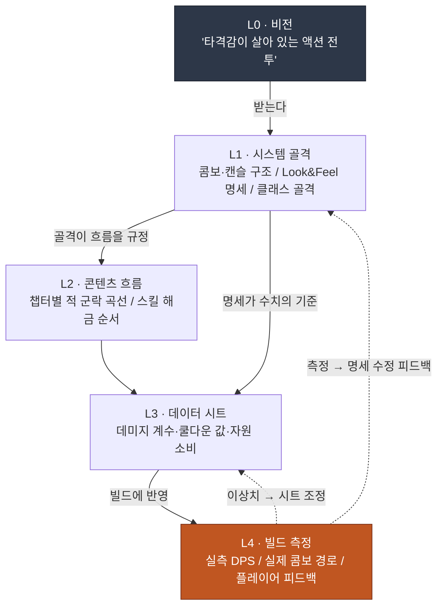

# 4.1 전투 기획자와 Layer — 타격감은 어느 칸에 들어가는가

> **이 장의 학습 목표** (난이도 🟡 실무 · 선행: 사칙연산·표 계산): 타격감 같은 추상 형용사를 측정 가능한 신호로 분해하고, 전투 기획자의 다섯 산출물이 Layer의 어느 칸에 앉는지 좌표로 지정할 수 있게 된다.

빌드 회의실. 프로그래머가 방금 붙인 신규 스킬을 모니터에 띄운다. 캐릭터가 검을 휘두르고, 적이 뒤로 밀려난다. 다섯 명이 보고 있다. 누군가 말한다.

"음… 뭔가 타격감이 좀 약한데."

옆 사람이 고개를 끄덕인다. "맞아요, 좀 밍밍하네."

프로그래머가 묻는다. "어디를 어떻게 바꾸면 될까요?"

침묵. 회의실의 다섯 명 중 누구도 그 질문에 숫자로 답하지 못한다. "타격감이 약하다"는 다섯 명 모두가 느꼈지만, "히트스톱을 3프레임에서 5프레임으로"라고 말할 수 있는 사람은 없다. 회의는 40분간 "좀 더 묵직하게", "임팩트가 부족해" 같은 형용사를 주고받다가 "일단 다음 빌드에서 다시 보죠"로 끝난다.

이 장면이 전투 기획의 모든 문제를 압축한다. 플레이어가 가장 직접 체감하는 분야인데, 그 체감을 말로 옮기는 순간 형용사밖에 안 남는다. 형용사는 측정할 수 없고, 측정할 수 없으면 조정할 수 없다. 전투 기획자의 첫 번째 일은 이 형용사를 숫자로 끌어내리는 것이다.

이 장은 그 숫자가 어느 칸에 들어가는지를 정한다. 전투 기획자가 만드는 산출물 다섯 가지가 각각 Layer의 어디에 앉는지, 그리고 그 좌표가 왜 자동화의 전제 조건이 되는지. 4.2·4.3·4.4의 실전 도구는 이 좌표 위에서 움직인다.

> **비전공자를 위한 한 줄.** 이 부에서 전투 수치나 프레임 단위를 외울 필요는 없습니다. 가져가실 단 하나는 이것입니다 — **"형용사로 오가는 요청은 측정도 조정도 안 된다."** "좀 더 묵직하게"를 "무엇을 몇으로"로 끌어내리는 순간 협업이 굴러간다는 발상은 게임 밖 어느 직무의 모호한 피드백에도 그대로 적용됩니다. 4.1.1의 다섯 산출물은 가볍게 훑고, 이 한 가지만 손에 쥐고 넘어가셔도 됩니다.

---

## 4.1.1 전투 기획자의 책상 위에 있는 다섯 가지

전투 기획자가 책임지는 산출물을 한 줄로 묶으면 "플레이어의 입력이 화면 위 액션으로 변환되는 전 과정"이다. 이걸 다섯 덩어리로 쪼갠다.

**첫째, 전투 Look & Feel 명세.** 타격감·반응성·무게감 같은 추상을 측정 가능한 수치로 번역한 문서다. 이게 이 분야의 가장 어려운 산출물이자, 다른 네 가지를 평가하는 기준이 된다.

Look & Feel은 다시 네 신호로 분해된다.

- **히트 타이밍** — 입력 버튼을 누른 시점부터 시각·청각 반응이 화면에 나오기까지 몇 ms인가
- **히트스톱(히트스탑)** — 타격이 적중하는 순간 화면이 몇 프레임 멈추는가(보통 1~6프레임)
- **카메라 셰이크** — 진폭·지속 시간·감쇠 곡선
- **이펙트 동기화** — VFX·SFX·UI 반응이 같은 프레임에 트리거되는가

이 명세가 없으면 회의실 장면이 반복된다. 명세가 있으면 "히트스톱 3→5프레임, 카메라 셰이크 진폭 +20%"라는 조정 지시가 나온다.

**둘째, 스킬·콤보·캔슬 시스템.** 입력이 액션으로 변환되는 규칙이다.

- 스킬 사용 흐름: 입력 → 캐스팅 → 발동 → 후딜
- 콤보 규칙: 어떤 스킬 다음에 어떤 스킬이 이어지고 그 보너스는 무엇인가
- 캔슬 규칙: 어느 액션 도중에 어느 액션으로 캔슬할 수 있는가
- 입력 큐: 액션 도중 다음 입력을 받는 윈도우(ms)가 얼마인가

**셋째, 캐릭터·몬스터 AI.** NPC 행동 로직 — 행동 트리(Behavior Tree, 이하 BT), 상태 머신(FSM(Finite State Machine, 유한 상태 기계)/HFSM), 결정 테이블. 몬스터 행동 패턴, 보스 페이즈 전환, 동료 NPC 협동, 군집 시뮬레이션이 여기 들어간다.

**넷째, 데미지·자원·쿨다운 수식.** 플레이어의 선택이 결과로 변환되는 수학이다. 데미지 계수·방어 감소·크리티컬·속성 보정, 자원(MP/기력/스태미나) 소비·회복 곡선, 쿨다운 분포.

**다섯째, 애니메이션 제어 명세.** 기획 의도가 실제 빌드에서 어떻게 보이는지를 정하는 도면 — 애니메이션 그래프·BT·IK 연결. 이건 보통 프로그래머·애니메이터와의 협업이지만, 기획자가 의도의 명세를 제공하지 않으면 빌드에서 의도가 깨진다. 자재만 던지고 도면을 안 주면 다른 집이 지어진다.

여기서 핵심은 **다섯 가지가 같은 책상 위에서 만난다**는 점이다. 콤보 규칙(둘째)이 바뀌면 데미지 수식(넷째)의 DPS가 달라지고, 그게 다시 Look & Feel(첫째)의 체감 무게를 바꾼다. 어느 산출물이 어느 산출물의 입력인지가 명시되지 않으면 변경 한 번이 다섯 군데를 흔든다. 그래서 좌표가 필요하다.

---

## 4.1.2 다섯 산출물이 Layer의 어느 칸에 앉는가

2.3에서 잡은 L0~L4 좌표 위에 전투 산출물 다섯을 올린다. 이 매핑이 이 장의 척추다.



표로 다시 정리하면 이렇다.

| Layer | 전투 기획의 산출물 | 변경 빈도 |
|---|---|---|
| L0 | (받는다 — 비전: "타격감이 살아 있는 액션 전투") | 거의 고정 |
| L1 | 콤보·캔슬 구조 / Look & Feel 명세 / 클래스 골격 | 느림 |
| L2 | 챕터별 적 군락 진행 곡선 / 스킬 해금 흐름 | 중간 |
| L3 | 스킬 데미지 계수 시트, 쿨다운 값, 자원 소비 | 빠름 |
| L4 | 빌드 실측 DPS, 실제 콤보 가능 경로, 플레이어 피드백 | 빌드마다 |

전투 기획의 특징은 **L4 비중이 다른 분야보다 크다**는 점이다. 시나리오 기획은 L1 명세가 거의 곧 최종이지만, 전투는 다르다. "타격감이 좋다"는 빌드에서 직접 손으로 쳐 보고 화면을 봐야 알 수 있는 영역이다. 명세에 "히트스톱 5프레임"이라고 적어도, 그게 실제로 묵직하게 느껴지는지는 L4에서만 확인된다. 그래서 시뮬레이션과 자동 측정 도구가 이 분야에서 가장 큰 가치를 만든다(4.4).

다만 L4가 크다고 L1이 덜 중요한 건 아니다. 점선 화살표를 보라. L4의 측정값은 L1 명세로 되먹임된다. 명세가 없으면 측정값은 "비교할 기준"을 잃는다. 5프레임 명세가 있어야 "실측 4프레임, 1프레임 누락"이라는 진단이 나온다. 명세 → 빌드 → 측정 → 명세 수정의 사이클이 다섯 Layer를 모두 거친다. 전투 기획자는 이 사이클 전체에 손을 올려놓고 있는, 한 책상에서 가장 많은 Layer가 동시에 돌아가는 자리다.

---

## 4.1.3 형용사를 숫자로 — 실제 작업의 한 척추

추상론은 여기까지다. 이제 회의실 장면으로 돌아가 "타격감이 약하다"를 실제로 숫자로 끌어내리는 과정을 워크드 트랜스크립트로 본다. 도구는 LLM 하나다. 출력은 다듬지 않고, 사람이 거부한 부분도 그대로 남긴다.

저자가 디렉터로 운영하는 어느 MMORPG 프로젝트(이하 "프로젝트 A")의 전투 TF에서, 신규 근접 스킬 하나의 Look & Feel을 명세화한 실제 흐름을 재구성한다.

### 프롬프트 (전문)

```
이 스킬 Look & Feel을 형용사 말고 ms·프레임 수치로 바꿔줘.
히트 타이밍, 히트스톱, 카메라 셰이크, 이펙트 동기화, 후딜 다섯 개.
확신 없는 건 "이 게임에서 검증 필요"라고 적어줘.

스킬: 대검 종베기 (heavy_overhead_slash)
의도: "묵직하게 내려찍고, 적이 휘청하는 느낌"
프레임레이트: 60fps
```

### Claude 날것 출력 (요약·정리하지 않음)

> 대검 종베기의 "묵직함"은 주로 **히트스톱과 후딜의 길이**, 그리고 **카메라 셰이크의 감쇠**로 만들어집니다. 항목별로 제시합니다.
>
> **1) 히트 타이밍.** 무거운 무기일수록 입력→발동까지 선딜이 길어야 무게감이 삽니다. 입력에서 첫 시각 반응(캐릭터가 검을 들어 올리기 시작)까지 **50~80ms**(3~5프레임) 권장. 단, 첫 *시각* 반응과 첫 *타격* 반응은 다릅니다. 타격 적중까지는 모션 길이에 달려 있어 여기서 단정할 수 없습니다 — **이 게임의 모션 길이로 검증 필요**.
>
> **2) 히트스톱.** 묵직한 일격의 핵심 변수입니다. 가벼운 공격이 1~2프레임이라면, 대검 종베기는 **4~6프레임**(약 67~100ms) 권장. 6프레임을 넘으면 "묵직"이 "끊김"으로 넘어가 반응성이 나빠집니다.
>
> **3) 카메라 셰이크.** 진폭은 화면 높이의 약 1~2%, 지속 0.2~0.3초, 감쇠는 선형보다 **ease-out(빠르게 약해짐)**. 무거운 일격은 첫 진동이 강하고 빠르게 잦아드는 곡선이 자연스럽습니다.
>
> **4) 이펙트 동기화.** VFX(타격 이펙트)·SFX(타격음)·히트스톱은 **반드시 적중 프레임에 동일하게** 트리거돼야 합니다. 1~2프레임만 어긋나도 "밍밍함"으로 체감됩니다. UI 반응(데미지 숫자)은 1~2프레임 늦어도 무방.
>
> **5) 후딜.** 묵직함의 대가로 후딜이 깁니다. 적중 후 피격 가능 복귀까지 **20~30프레임**(333~500ms) 권장. 단 이 값은 게임의 전체 전투 템포(빠른 액션 vs 진중한 소울류)에 따라 크게 달라집니다 — **이 게임의 기준 템포에서 검증 필요**.
>
> 종합하면 "묵직함 = 긴 선딜 + 4~6프레임 히트스톱 + ease-out 셰이크 + 동일 프레임 VFX/SFX/스톱 + 긴 후딜"입니다. 다만 위 숫자는 일반 권장 범위이며, **실제 무게감은 빌드에서 손으로 쳐 보고 조정해야 확정됩니다.**

### 사람의 검증·거부·재요청

여기서 기획자는 출력을 통째로 채택하지 않는다. 두 군데에서 멈춘다.

**거부 1 — 카메라 셰이크 진폭 "화면 높이 1~2%".** 이 게임은 모바일 우선이다. 작은 화면에서 1~2%는 거의 안 보인다. 모바일 멀미 이슈도 있다. 기획자는 이 권장값을 거부하고 "모바일은 셰이크 대신 히트스톱 강조로 무게를 표현한다"는 자체 원칙을 적용한다. LLM은 일반론을 줬을 뿐, 이 게임의 플랫폼 제약은 모른다.

**유보 2 — 히트스톱 "4~6프레임".** 이건 거부가 아니라 보류다. 범위로는 맞지만 정확한 값은 빌드에서 손맛으로 정한다. 명세에는 "4프레임을 기본값으로 빌드에 넣고, 5·6프레임 변형을 만들어 셋을 손으로 비교"라고 적는다.

재요청은 이렇게 나간다.

```
모바일 우선 프로젝트다. 카메라 셰이크는 최소화하고, 무게감을
히트스톱·후딜·SFX로 표현하는 방향으로 명세를 다시 써라.
히트스톱은 4/5/6프레임 세 변형을 빌드 비교용으로 표로.
```

이 두 번째 출력에서 LLM은 모바일 제약을 반영한 명세 표를 만든다. 그 표가 빌드에 들어가고, 다음 빌드 회의에서 기획자는 형용사 대신 "4프레임 변형이 너무 가볍다, 5프레임 채택"이라고 말한다. 40분 회의가 5분 결정으로 줄어든다.

### 이 트랜스크립트가 보여 주는 것

세 가지다. 첫째, LLM은 **형용사를 숫자 범위로 끌어내리는 1차 초안**을 잘 만든다 — 이게 회의실의 침묵을 깬다. 둘째, LLM은 **이 게임의 제약(모바일·템포·모션 길이)을 모른다** — 그래서 일반 권장값을 줄 뿐이고, 거부·조정은 사람의 몫이다. 셋째, LLM 스스로 "빌드에서 손으로 쳐 봐야 확정된다"고 두 번이나 못 박았다 — 무게감의 최종 판단은 L4의 사람 손이라는 사실을 도구도 안다.

---

## 4.1.4 AI가 도입 가치를 회수하는 네 자리

위 트랜스크립트는 한 자리(명세화)만 보여 줬다. 전투 기획 전체에서 AI가 가치를 만드는 자리는 네 곳이다.

**1) 시뮬레이션 — 가장 큰 가치.** DPS(Damage Per Second, 초당 데미지) 곡선·콤보 경로·자원 소비를 빌드 없이 사전 계산한다. 빌드를 만들어 손으로 측정하는 것보다 압도적으로 빠르다. 4.4에서 `simulate_dps` 시뮬레이터로 직접 다룬다.

**2) 상태 머신·BT 자동 생성.** "이 보스는 체력 50% 이하에서 광폭화하고, 광폭화 중에는 3타 연속 패턴을 쓴다" 같은 자연어 설명을 BT/FSM 다이어그램으로 변환한다. 정확도가 높다 — 규칙 구조는 LLM이 잘 다루는 영역이다. 머릿속 로직을 그림으로 옮기는 시간이 절약된다.

**3) 빌드 캡처 자동 분석.** 플레이 영상에서 히트 타이밍·콤보 성공률·피해 분포를 자동 추출한다. 단, 이건 **구현 난이도가 가장 높은 자리**다(아래에서 정직하게 따져 본다).

**4) 밸런스 조정 후보 제안.** 데이터 시트의 각 행을 분석해 이상치·곡선 비매끄러움을 검출하고 조정 후보를 낸다. 사람은 선택만 한다.

이 네 자리 중에서, 빌드 캡처 자동 분석(3)은 "할 수 있다"와 "쉽게 할 수 있다" 사이의 거리가 가장 멀다. 책에서 흔히 "AI가 영상에서 자동으로 다 뽑아 줍니다"라고 쓰지만, 실제로는 그렇게 간단하지 않다. 영상 픽셀 기반 컴퓨터 비전, 기성 비전 API, 게임 내 telemetry 로그 — 세 캡처 방법의 정확도·구현 부담 비교는 **4.4가 정본이니 그쪽을 참고**한다. 여기서는 결론만 짚는다.

가장 현실적인 길은 **게임 내 telemetry 로그**다. 엔진이 "프레임 1204에 skill_overhead가 적중, 데미지 340, 콤보 카운트 3" 같은 이벤트를 직접 찍게 만든다. 이건 소스 데이터라 정확하고, 로깅 코드 한 번 삽입으로 끝난다. LLM은 그 로그를 읽어 자연어 리포트("3콤보까지는 자원 효율이 좋은데 4콤보부터 급감")로 요약하는 데 쓴다. 영상은 사람이 의심스러운 케이스만 눈으로 확인하는 보조로 남긴다.

즉 "AI가 영상을 자동 분석한다"는 비전의 현실적 형태는 **telemetry 로그 + LLM 요약**이지, 픽셀 비전이 아니다. 이 정직한 구분이 4.4 도구 선택의 출발점이다.

그리고 네 자리 전부에서 변하지 않는 한 가지. **"타격감이 좋다"의 최종 판단은 AI가 못 한다.** 그건 플레이어 감정의 영역이고, 그 감정에 대한 책임은 사람이 가져간다. AI는 그 감정 판단의 **근거 자료**를 빠르게 만들어 줄 뿐이다. 시뮬레이션 수치, BT 다이어그램, telemetry 리포트 — 전부 사람이 손맛으로 결정을 내리기 위한 재료다.

---

## 4.1.5 좌표를 나눈 진짜 이유 — 자동화의 전제 조건

여기까지는 "산출물을 Layer로 나누면 협업할 때 말이 통한다"는 표면적 이유였다. 콤보 규칙을 L1에, 데미지 시트를 L3에 둔 건 변경 빈도가 다르기 때문이라고 설명했다. 맞는 말이지만, 그게 전부는 아니다.

좌표를 나눈 본질적 이유는 **자동화가 그 위에서만 작동하기 때문**이다. Layer 분해가 절차적 생성·자동화의 전제라는 일반 논제는 2.3에서 다뤘으니, 여기서는 그 전제가 전투 분야의 자동화 세 가지에서 어떻게 갈리는지로 좁혀 본다.

**첫째, 시뮬레이션은 "무엇을 입력하고 무엇을 바꿀 수 있는지" 구분돼야 돌아간다.** 결정론 코어(물리·히트박스 — L1 골격)와 변경 가능한 명세(데미지 값·쿨다운 — L3 시트)가 섞여 있으면, 시뮬레이터는 "변경 후보 공간"을 정의하지 못한다. 코어는 고정, 시트는 변수 — 이 분리가 있어야 `simulate_dps`가 "데미지 계수를 280에서 340까지 20씩 올려 가며 DPS 곡선을 그려라" 같은 탐색을 한다.

**둘째, 빌드 캡처 자동 분석은 액션 atom이 라벨링돼 있어야 의미를 가진다.** 명세 단에서 "이 프레임 구간은 `skill_overhead`의 hit 단계"라고 라벨된 atom이 있어야, telemetry 로그에서 추출한 신호를 명세와 자동 대조할 수 있다. 라벨이 없으면 로그는 "프레임 1204에 무언가 적중"이라는 의미 없는 점들의 나열이다.

**셋째, LLM 콤보 시퀀스 생성은 캔슬 규칙·입력 큐가 외부 문서로 분리돼 있어야 동작한다.** "이 캐릭터의 캔슬 가능 페어 7개와 입력 큐 200ms 안에서 5콤보 시퀀스 10개를 제안해라" 같은 한정 요청은, 캔슬 규칙이 코드 속에 고정되어 있지 않고 문서로 떨어져 있을 때만 가능하다.

세 가지가 같은 한 문장을 말한다. **결정론 코어가 명세와 섞이면 자동화가 막히고, 분리되면 자동화가 열린다.** Layer 분해는 협업 언어 통일이 표면 목적이고, 본질 목적은 자동 시뮬·캡처 분석·LLM 시퀀스 탐색의 전제 조건을 까는 것이다.

### 보수적 적용에서 진보적 적용으로

이 전제가 깔리면, 전투 운영은 두 단계로 진화한다.

**보수적 적용 — 사람이 설계하고, 자동이 검증한다.** 지금 대부분의 액션·MMORPG 전투 운영이 여기 있다. 사람이 콤보·캔슬 명세를 직접 쓰면, 자동이 DPS·자원을 시뮬하고 telemetry로 캡처해 "명세 vs 측정" 비교 리포트를 낸다. 사람은 그 차이를 해석해 명세 수정을 결정하고, 다시 명세 작성으로 사이클이 돈다. 설계는 사람, 시뮬·캡처·비교는 자동이다.

**진보적 적용 — AI가 후보를 발의하고, 사람은 채택만 한다.** 다음 단계다. AI가 캔슬 페어와 입력 큐 안에서 시퀀스 10~30개를 자동 열거하고, 자동이 각 시퀀스의 DPS·자원을 병렬 시뮬하고, LLM이 "자원 효율 1위, 입력 난이도 중" 식으로 순위·해석을 붙인다. 사람의 손에 남는 결정은 "후보 중 어느 시퀀스를 시그니처로 채택할까" 하나, 그리고 디렉터의 빌드 반영·모션 캡처 결정뿐이다. 시퀀스를 0에서 만드는 것과 30개 중 고르는 것은 작업 부담의 차원이 다르다.

진보적 적용이 자리 잡으려면 세 가지가 갖춰져야 한다. (1) 빌드 없이 1초 안에 DPS·자원·생존 시간을 계산하는 결정론 시뮬레이션 인프라, (2) 콤보·캔슬·입력 큐가 외부 문서로 분리·라벨링된 액션 atom, (3) telemetry 기반 캡처 자동 분석. 세 가지 모두 위에서 말한 Layer 분해의 직접적인 결과물이다.

### 모션 캡처는 비가역 단계다 — 결정 게이트

마지막으로 가역성. 전투 기획자의 검수 사이클에는 되돌릴 수 있는 단계와 없는 단계가 섞여 있고, 그 경계를 아는 게 중요하다.

<svg viewBox="0 0 720 230" xmlns="http://www.w3.org/2000/svg" font-family="sans-serif">
  <rect x="0" y="0" width="720" height="230" fill="#fbfbfb"/>
  <text x="20" y="30" font-size="15" font-weight="bold" fill="#1a202c">가역 ──────────────────▶ 결정 게이트 ──────▶ 비가역</text>

  <!-- 가역 단계 박스들 -->
  <rect x="20" y="55" width="150" height="44" rx="6" fill="#c6f6d5" stroke="#2f855a"/>
  <text x="95" y="78" font-size="12" text-anchor="middle" fill="#22543d">콤보·캔슬</text>
  <text x="95" y="93" font-size="12" text-anchor="middle" fill="#22543d">명세 수정</text>

  <rect x="20" y="110" width="150" height="44" rx="6" fill="#c6f6d5" stroke="#2f855a"/>
  <text x="95" y="133" font-size="12" text-anchor="middle" fill="#22543d">시뮬 실행·리포트</text>
  <text x="95" y="148" font-size="11" text-anchor="middle" fill="#22543d">(결과 폐기 자유)</text>

  <rect x="20" y="165" width="150" height="44" rx="6" fill="#c6f6d5" stroke="#2f855a"/>
  <text x="95" y="188" font-size="12" text-anchor="middle" fill="#22543d">데이터 시트</text>
  <text x="95" y="203" font-size="12" text-anchor="middle" fill="#22543d">수치 조정</text>

  <!-- 부분 가역 -->
  <rect x="220" y="110" width="160" height="44" rx="6" fill="#feebc8" stroke="#c05621"/>
  <text x="300" y="133" font-size="12" text-anchor="middle" fill="#7b341e">빌드 반영 (개발)</text>
  <text x="300" y="148" font-size="11" text-anchor="middle" fill="#7b341e">부분 가역</text>

  <!-- 게이트 -->
  <line x1="430" y1="40" x2="430" y2="215" stroke="#e53e3e" stroke-width="2.5" stroke-dasharray="6 4"/>
  <text x="430" y="225" font-size="12" text-anchor="middle" fill="#e53e3e" font-weight="bold">결정 게이트</text>

  <!-- 비가역 -->
  <rect x="480" y="80" width="210" height="48" rx="6" fill="#fed7d7" stroke="#c53030"/>
  <text x="585" y="103" font-size="12" text-anchor="middle" fill="#742a2a">모션 캡처 (시그니처 액션)</text>
  <text x="585" y="119" font-size="11" text-anchor="middle" fill="#742a2a">캡처 스튜디오·배우·재촬영 비용</text>

  <rect x="480" y="140" width="210" height="48" rx="6" fill="#fed7d7" stroke="#c53030"/>
  <text x="585" y="163" font-size="12" text-anchor="middle" fill="#742a2a">빌드 반영 (라이브)</text>
  <text x="585" y="179" font-size="11" text-anchor="middle" fill="#742a2a">핫픽스 비용·사용자 인식 변화</text>
</svg>

모션 캡처는 전투에서 가장 두꺼운 비가역 단계다. 캡처 스튜디오 일정, 배우 섭외, 재촬영 비용이 전부 크다. 그래서 시그니처 액션의 모션 캡처는 **시뮬·캡처 자동 분석이 충분히 돌아가서 시퀀스를 확정한 다음**에만 진행한다. 보수적이든 진보적이든, 모션 캡처와 라이브 빌드 직전을 결정 게이트로 둔다. 전투 기획자의 모든 검수는 이 게이트 왼쪽의 가역 단계에서 끝나야 안전하다.

---

## 4.1.6 회사에서의 풍경 — 무엇이 줄었나

프로젝트 A의 전투 TF가 위 좌표와 도구를 6개월 운영하면서 측정한 변화다. 아래 수치는 TF 운영 기록에서 뽑은 대략적 평균이며, 정밀 측정값이 아니라 **체감 변화의 방향**으로 읽는 게 정확하다.

| 항목 | 도입 전 | 도입 후 |
|---|---|---|
| Look & Feel 회의 시간 | 평균 2시간 (주관 토론) | 평균 30분 (측정값 기준) |
| 콤보 다이어그램 작성 | 1~2시간/스킬세트 | 10분/스킬세트 |
| DPS 곡선 검증 | 빌드 후 수동 측정 (≈1일) | 시뮬레이션 (≈10분) |
| 새 스킬 밸런스 조정 | 3~4회 빌드 사이클 | 1~2회 빌드 사이클 |

숫자 자체보다 방향이 핵심이다. 네 항목 모두 "주관 토론·수동 측정·빌드 반복"에서 "측정값·시뮬·다이어그램 자동화"로 옮겨 갔다. 회의실에서 형용사가 줄고 숫자가 늘었다. 그게 이 장 전체가 말하려는 한 문장이다 — 전투 기획자의 일은 주관(타격감·재미)에서 객관(수치·시뮬레이션)으로 옮겨 가는 다리를 놓는 일이고, AI는 그 다리를 빠르게 까는 도구다. 다리 끝에서 "묵직하다"를 결정하는 손은 여전히 사람의 것이다.

---

## 핵심 메시지

- 전투 기획은 L1 명세부터 L3 시트, L4 빌드 실측까지 한 책상에서 가장 많은 Layer가 동시에 도는 자리다.
- Layer 분해는 협업 언어 통일이 표면이고, 본질은 시뮬·캡처·LLM 탐색이라는 자동화의 전제 조건이다.
- "타격감이 좋다"의 최종 판단은 사람 몫이고, AI는 그 판단의 근거 자료를 빠르게 만든다.

---

## 따라하기 — 형용사를 숫자로 끌어내리기

**setup.** LLM 하나면 됩니다. 손에 든 스킬 하나를 고르세요(신규든 기존이든). 그 스킬의 의도를 형용사 한 줄로 적습니다 — "묵직하게", "날렵하게", "둔중하게" 같은.

**prompt.** 아래 골격에 스킬 정보를 채워 넣으세요.

```
너는 전투 기획 보조다. 아래 스킬의 Look & Feel을 "측정 가능한
수치 명세"로 변환해라. 형용사가 아니라 ms·프레임·% 단위로.
확신 없는 항목은 "이 게임에서 검증 필요"라고 명시해라.

스킬: [이름]
의도: "[형용사 한 줄]"
프레임레이트: [60fps 등]
항목: 1)히트 타이밍 2)히트스톱 3)카메라 셰이크 4)이펙트 동기화 5)후딜
```

**verify.** 출력의 모든 숫자에 두 가지 질문을 던지세요. (1) 이 게임의 제약(플랫폼·템포·모션 길이)에서 이 값이 맞나요? → 안 맞으면 제약을 알려 주고 재요청하세요. (2) 이 값은 빌드에서 손으로 확정해야 하나요? → 그렇다면 단일 값 대신 2~3개 변형을 명세에 적어 빌드에서 비교하세요. LLM이 "검증 필요"라고 못 박은 항목은 절대 그대로 채택하지 마세요.

## 4.1.7 1인 축소판

혼자 만드는 게임이라면 다섯 산출물·다섯 Layer를 다 갖출 필요는 없습니다. 최소 두 가지만 하세요. **하나, Look & Feel 명세 한 페이지** — 핵심 액션 3~5개에 대해 히트스톱·후딜·동기화만 숫자로 적습니다. 형용사로 적힌 메모는 6개월 뒤의 자신도 못 알아봅니다. **둘, 콤보·캔슬을 코드에서 분리해 한 파일로** — 캔슬 페어를 데이터로 빼 두면, 나중에 LLM에게 "이 페어로 만들 수 있는 콤보 5개 제안"을 시킬 수 있습니다. 이 두 가지가 1인 개발에서도 자동화의 문을 열어 두는 최소 좌표입니다.
