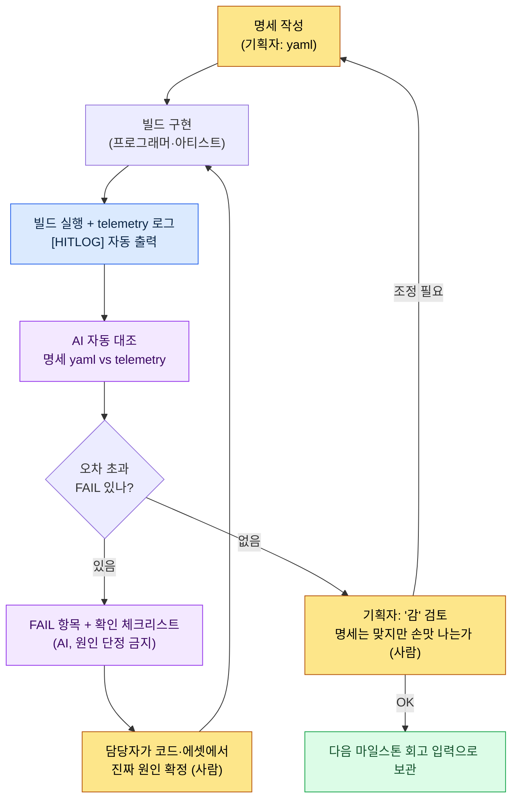

# 4.2 전투 Look & Feel — 손맛을 데이터로 잡는 자리

회의실 모니터 앞에 다섯 명이 모여 있다. 같은 빌드, 같은 스킬, 같은 30초짜리 영상이 화면에서 세 번째 반복 재생되는 중이다. 클라이언트 프로그래머가 먼저 입을 뗀다. "저는 괜찮은데요." 아트 담당이 팔짱을 낀다. "약해요. 뭔가 빠진 느낌." 옆에 있던 기획자가 끼어든다. "이펙트는 좋은데 손에 안 붙어요." 디렉터가 한참 보다가 결정을 내린다. "음… 조금만 더 묵직하게 가죠."

그리고 회의가 끝난다. '조금만 더 묵직하게'가 정확히 몇 ms이고 몇 프레임인지는 아무도 적지 않았다. 다음 빌드에서 프로그래머는 자기가 이해한 '묵직함'을 구현하고, 아트는 자기가 이해한 '묵직함'을 얹는다. 그리고 다음 주 같은 회의실에서 같은 영상을 보며 같은 대화가 반복된다.

타격감, 손맛, Look & Feel. 전투 기획에서 가장 자주 쓰이고 가장 정의가 안 된 단어다. 모두가 안다고 믿지만 머릿속 정의가 제각각이라서, 토론이 끝나도 남는 게 없다. 이 장은 그 '느낌'을 측정 가능한 숫자로 분해하는 일을 다룬다. 손맛을 추상에서 데이터로 끌어내리는 자리다.

---

## 4.2.1 전투 = Look & Feel, 시스템 = 동작

먼저 경계를 그어 두겠다. 전투 기획은 크게 두 갈래다.

- **전투 시스템**: 어떻게 동작하는가. 데미지 공식, 쿨다운, 스택 누적, 상태이상 룰. 다음 장(4.3 콤보·캔슬, 4.4 AI 시뮬레이션)의 영역이다.
- **전투 Look & Feel**: 어떻게 느껴지는가. 버튼을 누르고 나서 화면이 언제 반응하는가, 명중 순간 화면이 얼마나 멈추는가, 이펙트와 소리와 진동이 같은 순간에 터지는가.

이 장은 후자만 다룬다. 데미지가 100이든 120이든 손맛과는 직접 관계가 없다. 그 100의 데미지가 '들어가는 순간'을 플레이어가 어떻게 체감하느냐가 손맛이다. 같은 데미지 공식이라도 히트 타이밍과 히트스톱이 다르면 완전히 다른 게임처럼 느껴진다.

먼저 솔직하게 짚어 둘 게 있다. 타격감은 세 개의 숫자만으로 완성되지 않는다. 공격 모션(애니메이션)의 가속·감속 곡선, 맞은 쪽의 반응(히트 리액션·경직), 80\~90년대 일본 액션 게임이 즐겨 쓴 데포르메(타격 순간 캐릭터를 과장해 늘이고 찌부러뜨리는 잔상·뭉개짐 표현)까지 다 모여야 "맞았다"는 한 덩어리의 감각이 선다. **이 장이 집중해서 측정 가능한 숫자로 끌어내리는 것**은 그중 세 개의 축이다. 모션·리액션·데포르메는 애니메이터·아티스트의 손이 더 크게 닿는 영역이라 다음 장들과 아트 파트에서 다루고, 여기서는 기획자가 명세로 고정하고 빌드에서 검증할 수 있는 세 축에 무게를 둔다. 그 세 축은 이렇게 쪼개진다.

<svg viewBox="0 0 720 250" xmlns="http://www.w3.org/2000/svg" font-family="sans-serif">
  <rect x="0" y="0" width="720" height="250" fill="#fafafa" stroke="#ddd"/>
  <text x="360" y="32" text-anchor="middle" font-size="17" font-weight="bold" fill="#222">측정 가능한 세 축 (손맛의 전부는 아님)</text>
  <!-- axis 1 -->
  <rect x="40" y="70" width="190" height="140" rx="8" fill="#e8f0fe" stroke="#4a76d4" stroke-width="2"/>
  <text x="135" y="100" text-anchor="middle" font-size="15" font-weight="bold" fill="#2a4a9a">히트 타이밍</text>
  <text x="135" y="128" text-anchor="middle" font-size="12" fill="#444">입력 → 반응</text>
  <text x="135" y="148" text-anchor="middle" font-size="12" fill="#444">언제 응답하는가</text>
  <text x="135" y="178" text-anchor="middle" font-size="13" font-weight="bold" fill="#2a4a9a">단위: ms</text>
  <text x="135" y="198" text-anchor="middle" font-size="11" fill="#777">"반응이 빠른가"</text>
  <!-- axis 2 -->
  <rect x="265" y="70" width="190" height="140" rx="8" fill="#fde8e8" stroke="#d44a4a" stroke-width="2"/>
  <text x="360" y="100" text-anchor="middle" font-size="15" font-weight="bold" fill="#9a2a2a">히트스톱</text>
  <text x="360" y="128" text-anchor="middle" font-size="12" fill="#444">명중 순간</text>
  <text x="360" y="148" text-anchor="middle" font-size="12" fill="#444">시간을 멈추는 길이</text>
  <text x="360" y="178" text-anchor="middle" font-size="13" font-weight="bold" fill="#9a2a2a">단위: frame</text>
  <text x="360" y="198" text-anchor="middle" font-size="11" fill="#777">"묵직한가"</text>
  <!-- axis 3 -->
  <rect x="490" y="70" width="190" height="140" rx="8" fill="#e8f6ec" stroke="#3a9a5a" stroke-width="2"/>
  <text x="585" y="100" text-anchor="middle" font-size="15" font-weight="bold" fill="#1a6a3a">이펙트 동기화</text>
  <text x="585" y="128" text-anchor="middle" font-size="12" fill="#444">VFX·SFX·UI·</text>
  <text x="585" y="148" text-anchor="middle" font-size="12" fill="#444">카메라·진동</text>
  <text x="585" y="178" text-anchor="middle" font-size="13" font-weight="bold" fill="#1a6a3a">단위: frame offset</text>
  <text x="585" y="198" text-anchor="middle" font-size="11" fill="#777">"한 사건처럼 터지는가"</text>
  <!-- plus signs -->
  <text x="247" y="148" text-anchor="middle" font-size="26" fill="#999">+</text>
  <text x="472" y="148" text-anchor="middle" font-size="26" fill="#999">+</text>
  <text x="360" y="240" text-anchor="middle" font-size="12" fill="#666">이 셋이 측정 대상 — 모션·히트 리액션·데포르메는 아트·애니 영역(별도)</text>
</svg>

회의실에서 누군가 "약하다"고 말할 때, 그 약함은 셋 중 하나에서 온다. 반응이 늦은 건가(타이밍), 명중감이 없는 건가(히트스톱), 따로 노는 건가(동기화)? 세 축으로 분해해서 물으면 '약하다'가 비로소 고칠 수 있는 문장이 된다.

다만 '약하다'의 원인이 늘 이 세 축에만 있는 건 아니다. 손맛을 이루는 요소를 빠짐없이 늘어놓고, 이 장이 어디까지 책임지는지 선을 긋는다.

| Look & Feel 구성요소 | 무엇인가 | 이 장에서 |
|---|---|---|
| **히트 타이밍** | 입력 → 첫 반응까지의 ms. 가장 먼저 의심받는 요소 | 측정·명세(축 1) |
| **히트스톱** | 명중 순간 시간을 멈춰 무게를 주는 길이 | 측정·명세(축 2) |
| **카메라 셰이크** | 타격에 맞춰 화면이 흔들리는 반동 | 측정·명세(축 3에 포함) |
| **VFX·SFX 타이밍** | 이펙트와 소리가 히트 프레임에 동기되는가 | 측정·명세(축 3에 포함) |
| 공격 모션(애니메이션) | 휘두름의 가속·감속, 예비동작과 후속동작의 곡선 | 언급(아트·애니 영역) |
| 히트 리액션·경직 | 맞은 쪽이 움찔하고 경직되는 반응 | 언급(다음 장·아트 파트) |
| 데포르메 | 타격 순간 늘이고 찌부러뜨리는 과장(잔상·뭉개짐) | 언급(아트 파트) |
| 컨트롤러 진동 | 손에 전해지는 물리 피드백 | 측정·명세(축 3에 포함) |

위쪽 넷이 이 장의 세 축으로 묶여 측정·명세의 대상이 되고, 가운데 셋(모션·리액션·데포르메)은 빠져선 안 되지만 기획자 혼자 숫자로 닫기 어려운 아트·애니 영역이라 '있다는 것'만 분명히 해 둔다. 모션이 뻣뻣하거나 맞은 쪽이 멀쩡히 서 있으면 세 축이 다 맞아도 타격감은 안 산다.

---

## 4.2.2 히트 타이밍 — 입력에서 반응까지

세 축 중 타이밍을 가장 먼저 다루는 데는 이유가 있다. 플레이어가 손맛을 의심할 때 제일 먼저 걸리는 게 '반응이 늦다'는 감각이고, 다른 무엇이 아무리 화려해도 입력이 굼뜨면 그 순간 다 무너지기 때문이다. 그래서 타이밍부터 잡는다.

손맛의 첫 축은 시간이다. 버튼을 누른 그 순간(0ms)부터 화면이 처음 반응하는 순간까지 몇 ms가 걸리는가. 인간은 이 지연에 놀랄 만큼 예민하다. 60ms와 120ms의 차이를 '말로 설명은 못 해도 손은 안다'.

한 번의 공격은 단순한 한 점이 아니라 시간 위에 펼쳐진 여러 사건이다. 기본 공격 1타를 시간축에 올려 보면 이렇게 생겼다.

<svg viewBox="0 0 720 270" xmlns="http://www.w3.org/2000/svg" font-family="sans-serif">
  <rect x="0" y="0" width="720" height="270" fill="#fafafa" stroke="#ddd"/>
  <text x="360" y="28" text-anchor="middle" font-size="16" font-weight="bold" fill="#222">기본 공격 1타 — 시간축 (warrior / skill_id 1001)</text>
  <!-- timeline axis -->
  <line x1="60" y1="220" x2="680" y2="220" stroke="#333" stroke-width="2"/>
  <!-- ticks: 0,100,150,250,350 ms mapped 60..680 over 0..380ms => scale (680-60)/380=1.63px/ms -->
  <g font-size="11" fill="#555">
    <line x1="60" y1="215" x2="60" y2="225" stroke="#333"/><text x="60" y="245" text-anchor="middle">0ms</text>
    <line x1="223" y1="215" x2="223" y2="225" stroke="#333"/><text x="223" y="245" text-anchor="middle">100</text>
    <line x1="305" y1="215" x2="305" y2="225" stroke="#333"/><text x="305" y="245" text-anchor="middle">150</text>
    <line x1="468" y1="215" x2="468" y2="225" stroke="#333"/><text x="468" y="245" text-anchor="middle">250</text>
    <line x1="631" y1="215" x2="631" y2="225" stroke="#333"/><text x="631" y="245" text-anchor="middle">350</text>
  </g>
  <!-- input -->
  <line x1="60" y1="60" x2="60" y2="220" stroke="#4a76d4" stroke-width="2" stroke-dasharray="4 3"/>
  <text x="62" y="55" font-size="11" fill="#2a4a9a">입력(0)</text>
  <!-- casting motion bar 0..100 -->
  <rect x="60" y="70" width="163" height="20" rx="4" fill="#c9d8f5" stroke="#4a76d4"/>
  <text x="141" y="84" text-anchor="middle" font-size="11" fill="#2a4a9a">캐스팅 모션 0~100</text>
  <!-- hitbox 100..150 -->
  <rect x="223" y="98" width="82" height="20" rx="4" fill="#f5d6c9" stroke="#d4764a"/>
  <text x="264" y="112" text-anchor="middle" font-size="10" fill="#9a4a2a">히트박스 100~150</text>
  <!-- vfx 100..250 -->
  <rect x="223" y="126" width="245" height="20" rx="4" fill="#d6e8d9" stroke="#3a9a5a"/>
  <text x="345" y="140" text-anchor="middle" font-size="11" fill="#1a6a3a">시각 이펙트 100~250 (50ms 지연 후 페이드)</text>
  <!-- damage at 110 -->
  <line x1="76" y1="154" x2="76" y2="172" stroke="#d44a4a" stroke-width="0"/>
  <circle cx="239" cy="164" r="6" fill="#d44a4a"/>
  <text x="248" y="168" font-size="10" fill="#9a2a2a">데미지 적용 110 (시각보다 10ms 뒤 → 사실상 동시 인식)</text>
  <!-- afterdelay 150..350 -->
  <rect x="305" y="182" width="326" height="18" rx="4" fill="#eee" stroke="#aaa"/>
  <text x="468" y="195" text-anchor="middle" font-size="10" fill="#777">후딜 150~350 (다음 입력 받기까지)</text>
</svg>

이 그림에서 가장 중요한 숫자는 '히트박스가 처음 켜지는 100ms'다. 버튼을 누르고 100ms 뒤에 공격 판정이 시작된다는 뜻이다. 이 값이 손맛의 체감 속도를 결정한다.

권장 범위는 장르·캐릭터마다 다르지만 대략적인 기준선은 있다.

| 종류 | 권장 입력→반응 | 비고 |
|---|---|---|
| 즉시 반응 (가벼운 공격) | 60\~120ms | 손에 '붙는' 느낌의 핵심 구간 |
| 무거운 반응 (대형 스킬) | 200\~400ms | 묵직함을 위한 의도된 선딜 |
| 차징 (긴 충전) | 500\~2000ms | 의도된 대기, 별개 처리 |

이 범위는 절대 기준이 아니다. **저자 추정(미검증)**으로, 캐주얼 모바일은 입력 관대 쪽으로 ±50ms 흔들리고 격투 콘솔은 더 엄격하게 죄는 경향이 있다. 숫자 자체보다 '우리 게임의 가벼운 공격은 90ms로 합의했다'는 기준선을 팀이 공유하는 것이 핵심이다. 기준선이 있어야 빌드를 보고 '맞다/틀리다'를 말할 수 있다.

그런데 여기에 함정이 하나 있다. 사람 눈으로는 90ms와 110ms를 구분 못 한다. 60fps에서 1프레임은 약 16.67ms이고, 이 20ms 차이는 한 프레임 남짓이다. 회의실에서 "조금 느린 것 같은데?"라는 말이 맞는지 틀리는지, 눈으로는 끝내 판정이 안 난다. 그래서 측정이 필요하다.

---

## 4.2.3 빌드에서 타이밍을 어떻게 뽑아내는가 — 정직한 비교

명세에 '히트박스 100ms'라고 적었다. 빌드에서 실제로 100ms에 켜지는지 어떻게 확인하는가. 자동화의 길은 셋(영상 분석·기성 vision 도구·게임 내 telemetry)으로 갈리는데, 세 방식의 정밀도·난이도 비교는 4.4에서 정본으로 다룬다. 여기서는 결론만 짚는다. 실무에서 가장 먼저 깔아야 하는 건 **게임 내 telemetry**다. 이유는 단순하다. VFX가 화면에 '나타난 프레임'을 영상에서 추론하는 것보다, 코드가 `OnHit` 이벤트를 발생시킨 프레임에 직접 `[HITLOG]` 한 줄을 찍는 것이 비교가 안 되게 정확하고 싸다. 영상 분석은 입력 오버레이가 없는 외부 영상(예: 경쟁작 분석)에나 쓰고, 우리 빌드는 telemetry부터 깐다.

telemetry 로그는 이렇게 생긴다.

```
[HITLOG] frame=6  t_ms=100  evt=hitbox_on    skill=1001 char=warrior
[HITLOG] frame=6  t_ms=100  evt=vfx_trigger  skill=1001
[HITLOG] frame=6  t_ms=100  evt=sfx_trigger  skill=1001
[HITLOG] frame=7  t_ms=117  evt=damage_apply skill=1001 dmg=124
[HITLOG] frame=7  t_ms=117  evt=ui_dmgnum    skill=1001
[HITLOG] frame=6  t_ms=100  evt=cam_shake    skill=1001 amp=0.4
```

기획자가 할 일은 이 로그를 명세와 한 줄씩 맞춰 보는 것이다. 숫자 환산과 기계적 대조가 대부분이라, 사람이 눈으로 반복하면 지치고 틀리지만 LLM은 지치지 않는다. 다음 절에서 실제로 시켜 보겠다.

---

## 4.2.4 워크드 트랜스크립트 — telemetry 로그를 명세와 대조시키기

명세 yaml과 빌드 telemetry 로그를 둘 다 붙여 넣고, AI에게 둘을 대조해 어긋난 곳을 찾으라고 시켰다. 아래는 프롬프트 전문과 Claude의 날것 출력, 그리고 사람의 검증 과정 전체다. 요약하지 않고 그대로 옮긴다.

### 1차 프롬프트

```
다음은 전투 스킬 한 개의 '히트 타이밍 명세'와, 실제 빌드에서 뽑은
telemetry 로그다. 명세 대비 빌드가 어긋난 항목을 표로 정리해줘.

[명세]
character: warrior
skill_id: 1001
fps: 60
events:
  hitbox_on:    {expect_ms: 100, tol_frame: 0}
  vfx_trigger:  {expect_ms: 100, tol_frame: 0}
  sfx_trigger:  {expect_ms: 100, tol_frame: 1}
  damage_apply: {expect_ms: 110, tol_frame: 1}
  ui_dmgnum:    {expect_ms: 100, tol_frame: 2}
  cam_shake:    {expect_ms: 100, tol_frame: 1}

[telemetry 로그]
[HITLOG] frame=6  t_ms=100  evt=hitbox_on    skill=1001
[HITLOG] frame=6  t_ms=100  evt=vfx_trigger  skill=1001
[HITLOG] frame=8  t_ms=133  evt=sfx_trigger  skill=1001
[HITLOG] frame=7  t_ms=117  evt=damage_apply skill=1001
[HITLOG] frame=9  t_ms=150  evt=ui_dmgnum    skill=1001
[HITLOG] frame=6  t_ms=100  evt=cam_shake    skill=1001

60fps(1프레임=16.67ms). expect_ms를 프레임으로 환산해 로그 frame과
비교하고, 차이가 tol_frame을 넘으면 FAIL로 표시해줘.
```

### Claude 날것 출력 (그대로)

> 먼저 명세의 expect_ms를 프레임으로 환산하겠습니다. 60fps에서 frame = round(ms / 16.67) 입니다.
>
> - hitbox_on: 100 / 16.67 ≈ 6.0 → frame 6
> - vfx_trigger: 100 → frame 6
> - sfx_trigger: 100 → frame 6
> - damage_apply: 110 / 16.67 ≈ 6.6 → frame 7 (반올림)
> - ui_dmgnum: 100 → frame 6
> - cam_shake: 100 → frame 6
>
> 로그의 실제 frame과 비교한 결과입니다.
>
> | 이벤트 | 기대 frame | 실제 frame | 차이(frame) | 허용 | 판정 |
> |---|---|---|---|---|---|
> | hitbox_on | 6 | 6 | 0 | 0 | PASS |
> | vfx_trigger | 6 | 6 | 0 | 0 | PASS |
> | sfx_trigger | 6 | 8 | +2 | 1 | **FAIL** |
> | damage_apply | 7 | 7 | 0 | 1 | PASS |
> | ui_dmgnum | 6 | 9 | +3 | 2 | **FAIL** |
> | cam_shake | 6 | 6 | 0 | 1 | PASS |
>
> 두 항목이 허용 오차를 초과했습니다.
> - **sfx_trigger**: 사운드가 시각 히트보다 2프레임(약 33ms) 늦습니다. 허용 1프레임 초과. 플레이어는 "소리가 살짝 따로 논다"고 느낄 가능성이 높습니다.
> - **ui_dmgnum**: 데미지 숫자가 3프레임(약 50ms) 늦게 뜹니다. 허용 2프레임 초과. "맞췄는데 숫자가 늦게 뜬다"는 어색함으로 이어질 수 있습니다.
>
> damage_apply가 frame 7인 것은 명세상 frame 7(110ms 환산)과 일치하므로 정상입니다. 다만 damage_apply가 hitbox_on(frame 6)보다 1프레임 뒤라는 점은 의도된 설계인지 확인이 필요합니다.

### 사람의 검증 — 한 칸을 거부했다

출력을 받고 곧바로 다 믿지 않았다. 검증 포인트가 둘 있었다.

**검증 1 (반올림 경계 — 통과).** damage_apply의 110ms 환산이 의심스러웠다. 110 / 16.67 = 6.598… 이다. 반올림하면 7이 맞다. 그런데 만약 명세 의도가 '6프레임 = 100ms와 같은 프레임'이었다면? 직접 확인해 보니 명세에 `damage_apply: expect_ms 110`으로 vfx(100)와 의도적으로 10ms 차이를 둔 게 맞았다. 그래서 frame 7 환산은 정확했다. AI 통과.

**검증 2 (마지막 문장 — 거부).** AI가 끝에 덧붙인 "damage_apply가 hitbox_on보다 1프레임 뒤라는 점은 의도된 설계인지 확인이 필요합니다"는 노이즈였다. 명세에 이미 expect_ms 110으로 의도가 명시되어 있는데, AI가 그걸 '확인 필요'로 되물은 것이다. 명세를 줬으면 명세 안에서 답을 닫아야 하는데 불필요한 질문을 만들어 냈다. 이 문장은 채택하지 않았다.

거부 사유를 담아 재요청했다.

### 2차 프롬프트 (재요청)

```
damage_apply는 명세에 110으로 의도가 박혀 있으니 '확인 필요' 코멘트는 빼줘.
// 명세 안에서 답이 닫힌 항목을 되묻지 말라는 뜻
FAIL 두 건(sfx, ui_dmgnum)만 남기고, 원인 단정 대신
'확인할 코드/리소스 위치' 체크리스트로 줘.
```

### Claude 2차 출력 (그대로)

> FAIL 두 건에 대한 확인 체크리스트입니다. 원인은 단정하지 않고, 확인 지점만 정리했습니다.
>
> **sfx_trigger (+2프레임 지연)**
> - [ ] 사운드 트리거가 `hitbox_on`과 같은 이벤트에 바인딩돼 있는가, 아니면 별도 애니메이션 노티파이에 걸려 있는가
> - [ ] 오디오 에셋 자체의 선두 무음(leading silence)이 있는가 — 파일 앞단 빈 구간이 지연으로 보일 수 있음
> - [ ] 사운드 재생 호출이 같은 프레임에 들어갔는데 출력 레이턴시로 밀린 건지 (플랫폼 오디오 버퍼)
>
> **ui_dmgnum (+3프레임 지연)**
> - [ ] 데미지 숫자 UI가 `damage_apply`(frame 7) 이후 별도 틱에서 갱신되는 구조인가
> - [ ] UI 갱신이 다음 프레임 끝에 몰아서 처리되는지 (지연 렌더 큐)
> - [ ] 숫자 팝업 애니메이션의 시작 프레임에 추가 딜레이 값이 들어가 있는가
>
> 단정할 수 있는 것: 두 항목 모두 명세 허용 오차를 초과했고, 시각 히트(frame 6)보다 늦습니다. 단정할 수 없는 것: 위 원인 중 무엇인지는 코드/에셋 확인 전까지 알 수 없습니다.

이 두 번째 출력은 그대로 채택했다. 원인을 지어내지 않고 '확인할 곳'으로 바꾼 게 정확히 원하던 형태였다. 이 체크리스트를 사운드 담당과 UI 담당에게 그대로 넘겼고, 사운드는 오디오 에셋 선두 무음 33ms가 범인이었다(체크리스트 2번 항목). UI는 다음 프레임 갱신 구조였다(1번 항목).

여기서 분업의 선이 분명해진다. **AI는 명세와 로그를 기계적으로 대조해 FAIL을 잡고, 사람은 (a) AI가 만들어 낸 불필요한 되물음을 거부하고 (b) FAIL의 진짜 원인을 코드에서 확정한다.** AI에게 원인 단정을 시키면 그럴듯한 거짓말을 만들어 내므로, '확인할 곳'까지만 시키는 게 안전하다.

---

## 4.2.5 히트스톱 — 타격의 무게

두 번째 축은 멈춤이다. 히트가 명중한 순간 게임 시간을 아주 짧게 멈추거나 느리게 만드는 효과. 이게 "맞췄다"는 감각의 강도를 결정한다. 격투 게임과 액션 RPG에서 가장 강력한 손맛 도구다. 너무 길면 답답하고, 너무 짧으면 무게가 없다.

권장 범위(60fps 기준)는 다음과 같다. 이 수치는 액션 게임에서 통용되는 대략적 관행이며, 절대값은 게임마다 조정한다.

| 종류 | 권장 프레임 | 환산 |
|---|---|---|
| 가벼운 히트 | 1\~2 프레임 | 16\~33ms |
| 중간 히트 | 3\~5 프레임 | 50\~83ms |
| 무거운 히트 (필살기) | 6\~12 프레임 | 100\~200ms |
| 치명타·약점 적중 | 위 값 + 2\~3 프레임 | — |

캐릭터·스킬마다 다르게 줘야 한다. 전부 똑같이 주면 무게 차이가 안 나고, 결국 모든 공격이 같은 톤으로 수렴한다. 이게 4.2 핵심 메시지 셋 중 하나로 이어지는 지점이다.

'누가 멈추는가'도 설계 선택이다.

| 옵션 | 효과 | 적합 |
|---|---|---|
| 공격자만 멈춤 | 공격자 쪽 무게감, 피격자는 반동·다운 진행 | 액션 |
| 피격자만 멈춤 | 피격자 일시 정지, 공격자는 자유 이동 | 콤보 친화 |
| 둘 다 멈춤 | 가장 강한 무게감 | 격투 게임 전통 |

명세는 이렇게 입력한다.

```yaml
character: warrior
skill_id: 1001
hit_stop:
  attacker: 2          # frames
  victim: 4
  critical_multiplier: 1.5   # 크리티컬 시 1.5배 (반올림)
```

히트스톱은 명세 숫자만으로는 '맞다/틀리다'를 끝낼 수 없는, 손맛 검증이 가장 까다로운 축이다. telemetry로 '실제로 4프레임 멈췄는지'는 잡을 수 있지만, '4프레임이 적절한지'는 사람이 빌드를 직접 만지며 판정해야 한다. AI는 명세 일치를 보증하고, 사람은 그 명세값 자체의 적절성을 본다.

---

## 4.2.6 이펙트 동기화 — 같은 프레임에 모든 것이 터지는가

세 번째 축은 동시성이다. VFX(시각 이펙트)·SFX(소리)·UI(데미지 숫자)·카메라(셰이크)·진동(컨트롤러)이 같은 프레임에 시작되면 플레이어 뇌는 그걸 '한 사건'으로 묶는다. 1\~2프레임만 어긋나도 "어색하다", 3\~5프레임 어긋나면 "버그 같다"는 반응이 나온다. 앞의 워크드 트랜스크립트에서 sfx가 2프레임, ui가 3프레임 늦어 FAIL이 났던 게 정확히 이 축의 문제였다.

동기화 대상 5종과 허용 오차다.

| 요소 | 트리거 시점 | 허용 오차 |
|---|---|---|
| VFX (시각 이펙트) | 히트 프레임 | ±0 (반드시 동시) |
| SFX (사운드) | 히트 프레임 | ±1 프레임 (16ms) |
| UI 데미지 숫자 | 히트 프레임 | ±2 프레임 |
| 카메라 셰이크 | 히트 프레임 | ±1 프레임 |
| 컨트롤러 진동 | 히트 프레임 | ±2 프레임 |

핵심은 이 5종이 **모두** 명세에 들어가야 한다는 것이다. 흔한 실수가 VFX만 명세에 적고 나머지 넷을 '알아서 맞추겠지'로 두는 것이다. 명세에 없으면 빌드 검증의 기준도 없고, telemetry로 잡아도 비교할 대상이 없다. 5종이 다 명세에 있어야 자동 비교가 닫힌다.

자동 비교는 앞 절의 워크드 트랜스크립트가 그대로 적용된다. telemetry 로그에 5종의 트리거 프레임이 다 찍혀 있으면, AI가 명세와 대조해 오차 초과 항목만 리포트한다. 사람이 100개 스킬을 매 빌드마다 눈으로 확인할 필요가 없다. 다만 AI가 명세 어긋남을 잡는 것과, 사람이 "명세는 다 맞는데 그래도 감이 안 사는" 영역을 잡는 것은 별개로 남는다.

---

## 4.2.7 명세에서 다음 빌드까지 — 전체 루프

지금까지의 조각들을 하나의 흐름으로 잇는다. 이 루프가 돌기 시작하면 회의실의 '조금만 더 묵직하게'가 '히트스톱 victim 4→6프레임'으로 번역된다.



이 루프에서 AI가 맡는 칸(D, F)과 사람이 맡는 칸(A, G, H)이 명확히 갈린다. AI는 기계적 대조와 체크리스트 생성에 강하고, 사람은 기준선 설정·원인 확정·최종 감각 판정에 강하다. 자동화가 사람을 빼는 게 아니라, 사람이 매번 반나절씩 쓰던 '눈으로 프레임 세기'에서 풀려나 '감'에만 집중하게 만든다.

루프의 마지막 칸(I)이 중요하다. 이 측정 데이터는 한 번 쓰고 버리는 게 아니라 다음 마일스톤 회고의 입력으로 다시 들어간다. '지난 분기 손맛 FAIL은 sfx 동기화에 몰려 있었다' 같은 패턴이 데이터로 남으면, 다음 분기엔 오디오 파이프라인을 먼저 손본다.

---

## 4.2.8 측정이 토론을 줄인 자리 — 운영 관찰

저자가 디렉터로 참여한 어느 모바일 MMORPG 프로젝트(이하 '프로젝트 A')에서, 위 루프를 약 6개월 굴리며 관찰한 변화다. 아래 수치는 정밀 계측이 아니라 회의록 타임스탬프와 빌드 검증 기록을 바탕으로 한 **저자의 운영 관찰(추정 포함)**이며, 방향과 비율로 읽어 주기 바란다. 절대값을 인용 가능한 벤치마크로 쓰지 말 것.

| 항목 | 도입 전 | 도입 후 | 성격 |
|---|---|---|---|
| Look & Feel 회의 1건 소요 | 길게 늘어짐 | 절반 이하로 단축 | 회의록 기준, 체감 |
| 빌드 검증 (스킬 다수) | 거의 하루 | 크게 단축 | telemetry 자동 대조 효과 |
| "타격감 약함" 피드백 해소 | 여러 빌드 사이클 | 1\~2 사이클 | 표본 적음, 방향만 |
| 명세 vs 빌드 일치율 | 절반 남짓 | 대부분 일치 | telemetry 도입 후 측정 가능해짐 |

숫자 자체보다 정성적 변화가 본질이다. 회의실에서 "약한데요"가 나오면 곧바로 "어느 축이요? 타이밍? 히트스톱? 동기화?"로 되묻게 됐고, 답이 안 나오면 telemetry를 함께 띄웠다. **측정 가능한 객관이 토론의 종착지를 만들었다는 것**이 6개월의 가장 큰 변화다. '조금 더 묵직하게'가 회의실 밖으로 나가는 일이 줄었다.

---

## 4.2.9 흔한 실수와 회피

| 실수 | 회피 |
|---|---|
| 명세 없이 빌드부터 검증 | 명세 우선. 기준 없으면 '맞다/틀리다'가 불가능 |
| 영상 분석부터 깔려고 함 | 우리 빌드는 telemetry부터. 영상 분석은 외부 영상에만 |
| AI에게 FAIL 원인을 단정시킴 | '확인할 곳' 체크리스트까지만. 원인은 사람이 코드에서 확정 |
| VFX만 명세, 나머지 4종 누락 | 5종(VFX·SFX·UI·카메라·진동) 모두 명세에 |
| 한 캐릭터 명세를 전 캐릭터 복사 | 캐릭터·스킬별 차별화. 같으면 손맛이 한 톤으로 수렴 |
| 히트스톱을 모든 히트에 남발 | 의미 있는 히트에만. 남발하면 답답함 |
| AI 출력의 되물음을 그대로 수용 | 명세 안에서 닫힌 항목의 '확인 필요' 코멘트는 거부 |

---

## 따라하기

자기 프로젝트에 이 루프를 최소 규모로 깔아 보는 절차입니다.

**setup**
1. 검증할 스킬 1개를 고릅니다(기본 공격 추천).
2. 코드의 트리거 지점 6곳(hitbox_on, vfx, sfx, damage_apply, ui_dmgnum, cam_shake)에 로그 한 줄씩 심습니다: `[HITLOG] frame=X t_ms=Y evt=... skill=...`.
3. 명세 yaml을 씁니다(events 블록에 expect_ms + tol_frame). 이 장의 1차 프롬프트 예시를 템플릿으로 쓰세요.

**prompt**
4. 빌드를 한 번 돌려 telemetry 로그를 모읍니다.
5. 명세 yaml + telemetry 로그를 함께 AI에 붙이고 이렇게 시킵니다: "명세 대비 빌드가 어긋난 항목을 60fps 프레임 환산으로 대조해 FAIL만 표로 줘. 원인은 단정하지 말고 '확인할 곳' 체크리스트로." (이 장 2차 프롬프트 형태)

**verify**
6. AI 출력의 프레임 환산을 직접 한 칸 검산하세요(ms / 16.67 반올림). 한 칸이라도 틀리면 전체를 의심하세요.
7. AI가 명세 안에서 닫힌 항목을 되묻거나 원인을 단정하면 거부하고 재요청하세요.
8. FAIL 체크리스트를 담당자에게 넘겨 코드·에셋에서 진짜 원인을 확정하세요.

### 1인 축소판

팀도 telemetry 인프라도 없는 1인 개발자라면 이렇게 줄이세요. 빌드를 60fps로 화면 녹화하고, 입력 순간이 보이도록 키 입력 오버레이를 켭니다. 검증할 스킬 한 번을 녹화한 뒤, 영상 편집기에서 '버튼 누른 프레임'과 '화면이 처음 변한 프레임'을 직접 셉니다. 두 프레임 번호와 명세 기대값을 AI에 주고 "60fps 기준 ms로 환산해서 명세와 비교해줘"라고 시키면, telemetry 없이도 핵심 한 축(히트 타이밍)은 검증됩니다. 5종 동기화까지는 어렵지만, '입력→반응' 한 축만 잡아도 손맛 토론의 절반은 객관으로 옮겨 옵니다.

---

다음 장은 한 번의 히트에서 히트들의 연속으로 넘어간다. 콤보·캔슬·입력 큐 — 한 히트가 다음 히트로 자연스럽게 이어지게 만드는 룰들을 다룬다.

---

### 이 챕터의 핵심 메시지
- 손맛은 히트 타이밍·히트스톱·이펙트 동기화 세 축의 합이라, 한 축만 손보면 나머지가 흔들린다.
- 영상 분석보다 게임 내 telemetry 로그가 정확하고 싸다 — 우리 빌드는 telemetry부터 깐다.
- AI는 명세 대조로 FAIL을 잡고, 사람은 되물음을 거부하고 원인을 코드에서 확정한다.

### 다음 챕터 미리보기
- 4.3. 콤보·캔슬·입력 큐
