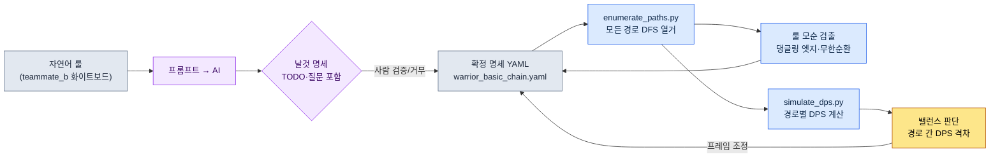

# 4.3 콤보·캔슬·입력 큐 — 경로를 열거하고 검증한다

전투 디자이너 팀원 B가 회의실 화이트보드 앞에 서서 마커로 박스를 그리고 있었다. 기본1, 기본2, 기본3, 그리고 옆으로 빠지는 강공격 분기. 화살표가 일곱 개쯤 늘어났을 때, 누군가 물었다. "그럼 강공격 띄우기 다음에 회피로 캔슬하면 다시 기본1로 돌아올 수 있어요?" 팀원 B는 마커를 멈췄다. 화이트보드 위 그래프에는 그 경로가 그려져 있지 않았다. 그릴 수 있는데 그리지 않은 건지, 룰상 불가능한 건지, 본인도 즉답하지 못했다.

이게 콤보 설계의 진짜 문제다. 콤보는 머릿속에서는 "1-2-3 이어지고 강공격으로 분기"처럼 단순한 줄기로 보인다. 그런데 캔슬과 입력 큐가 끼면, 줄기는 그래프가 된다. 노드 여섯 개에 캔슬 엣지 몇 개만 추가해도 실제로 밟을 수 있는 경로는 수십 갈래로 늘어난다. 사람은 그 수십 갈래를 머릿속에서 전부 펼치지 못한다. 그래서 "이 경로가 너무 세다"는 밸런스 사고가 빌드에 들어간 뒤에야 발견된다.

이 장의 목표는 하나다. **콤보 경로를 손으로 그리지 않고 자동으로 전부 열거하고, 각 경로를 검증하는 워크플로**를 만드는 것. 자연어로 적은 룰을 명세로 바꾸고, 명세에서 경로를 열거하고, 열거된 경로를 시뮬레이션에 태운다. 그 과정에서 AI가 어디까지 해 주고 어디서 거짓말을 하는지, 날것 그대로 보여 주겠다.

---

## 4.3.1 콤보는 표가 아니라 그래프다

콤보를 표로 적으면 이렇게 된다. "기본1 다음에 기본2, 기본2 다음에 기본3." 행과 열로 깔끔하다. 그런데 이 표는 거짓말을 한다. 표는 직선을 가정하기 때문이다. 실제 전투에서 플레이어는 기본2에서 강공격으로 빠지고, 강공격을 회피로 캔슬하고, 회피 직후 다시 기본1을 누른다. 이 분기와 순환은 표의 행 사이에 숨어 버린다.

그래서 콤보의 진짜 모양은 **방향 그래프**다. 액션은 노드, 연결은 엣지. 각 엣지에는 입력 윈도우(언제 입력을 받는지)와 입력 키가 붙는다. 노드에는 지속 프레임이, 일부 노드에는 보너스 조건(특정 노드를 거쳐야 데미지 배수가 붙는다)이 붙는다.

전사 캐릭터의 기본 콤보 한 세트를 그래프로 그리면 다음과 같다. 여섯 노드, 캔슬 분기 포함.

<svg viewBox="0 0 720 300" xmlns="http://www.w3.org/2000/svg" font-family="sans-serif" font-size="13">
  <defs>
    <marker id="arrow" markerWidth="10" markerHeight="10" refX="8" refY="3" orient="auto" markerUnits="strokeWidth">
      <path d="M0,0 L8,3 L0,6 Z" fill="#444"/>
    </marker>
  </defs>
  <!-- main chain -->
  <rect x="20" y="40" width="110" height="40" rx="6" fill="#e8f0fe" stroke="#3367d6"/>
  <text x="75" y="65" text-anchor="middle">기본1 (21f)</text>
  <rect x="200" y="40" width="110" height="40" rx="6" fill="#e8f0fe" stroke="#3367d6"/>
  <text x="255" y="65" text-anchor="middle">기본2 (24f)</text>
  <rect x="380" y="40" width="110" height="40" rx="6" fill="#e8f0fe" stroke="#3367d6"/>
  <text x="435" y="65" text-anchor="middle">기본3 (30f)</text>
  <rect x="560" y="40" width="140" height="40" rx="6" fill="#fce8e6" stroke="#c5221f"/>
  <text x="630" y="65" text-anchor="middle">피니셔 ×1.5</text>
  <!-- branch -->
  <rect x="200" y="150" width="110" height="40" rx="6" fill="#fef7e0" stroke="#e8a000"/>
  <text x="255" y="175" text-anchor="middle">강공격 (33f)</text>
  <rect x="380" y="150" width="110" height="40" rx="6" fill="#fef7e0" stroke="#e8a000"/>
  <text x="435" y="175" text-anchor="middle">띄우기 (28f)</text>
  <rect x="200" y="240" width="110" height="40" rx="6" fill="#e6f4ea" stroke="#137333"/>
  <text x="255" y="265" text-anchor="middle">회피 (18f)</text>
  <!-- edges main -->
  <line x1="130" y1="60" x2="200" y2="60" stroke="#444" marker-end="url(#arrow)"/>
  <text x="165" y="52" text-anchor="middle" font-size="11">10~21f</text>
  <line x1="310" y1="60" x2="380" y2="60" stroke="#444" marker-end="url(#arrow)"/>
  <text x="345" y="52" text-anchor="middle" font-size="11">12~24f</text>
  <line x1="490" y1="60" x2="560" y2="60" stroke="#444" marker-end="url(#arrow)"/>
  <text x="525" y="52" text-anchor="middle" font-size="11">14~30f</text>
  <!-- branch edges -->
  <line x1="255" y1="80" x2="255" y2="150" stroke="#444" marker-end="url(#arrow)"/>
  <text x="300" y="118" text-anchor="middle" font-size="11">강공격 6~24f</text>
  <line x1="310" y1="170" x2="380" y2="170" stroke="#444" marker-end="url(#arrow)"/>
  <line x1="255" y1="190" x2="255" y2="240" stroke="#444" marker-end="url(#arrow)"/>
  <text x="300" y="218" text-anchor="middle" font-size="11">회피 캔슬</text>
  <!-- loop back -->
  <path d="M200,260 C90,260 75,140 75,80" fill="none" stroke="#137333" stroke-dasharray="5,4" marker-end="url(#arrow)"/>
  <text x="110" y="160" text-anchor="middle" font-size="11" fill="#137333">회피 후 기본1 재진입</text>
</svg>

화이트보드와 결정적으로 다른 점이 두 개 있다. 첫째, 각 엣지에 입력 윈도우 프레임 범위가 명시되어 있다. "강공격 6~24f"는 기본2가 시작한 뒤 6프레임째부터 24프레임째까지 강공격 입력을 받는다는 뜻이다. 둘째, 점선으로 그린 회피→기본1 재진입 엣지가 있다. 팀원 B가 회의실에서 즉답하지 못했던 그 경로다. 그래프로 명시하면 "있다/없다"가 분명해진다.

이 그래프를 사람이 손으로 그리면 노드 여섯에 엣지 일고여덟. 캐릭터가 스무 명이고 캐릭터마다 콤보 세트가 서너 개면 그래프는 수백 장이 된다. 손으로는 못 따라간다. 그래서 그래프를 **텍스트 명세**로 적어 두고, 그림과 검증을 거기서 자동 생성한다.

---

## 4.3.2 명세는 사람이 읽되 기계가 파싱한다

위 그래프를 YAML 명세로 옮긴다. 핵심은 노드(`nodes`), 엣지(`edges`), 보너스(`bonuses`) 세 블록이다. 캔슬 룰도 엣지의 한 종류로 본다 — 끊고 다른 노드로 가는 것도 결국 엣지이기 때문이다.

```yaml
# warrior_basic_chain.yaml
character: warrior
combo_id: basic_chain

nodes:
  - { id: basic_1,  name: 기본1,   duration_frames: 21 }
  - { id: basic_2,  name: 기본2,   duration_frames: 24 }
  - { id: basic_3,  name: 기본3,   duration_frames: 30 }
  - { id: heavy,    name: 강공격,  duration_frames: 33 }
  - { id: launch,   name: 띄우기,  duration_frames: 28 }
  - { id: dodge,    name: 회피,    duration_frames: 18, cancels_recovery: true }

edges:
  - { from: basic_1, to: basic_2, input: light, window: [10, 21] }
  - { from: basic_2, to: basic_3, input: light, window: [12, 24] }
  - { from: basic_2, to: heavy,   input: heavy, window: [6, 24] }
  - { from: heavy,   to: launch,  input: heavy, window: [10, 33] }
  - { from: heavy,   to: dodge,   input: dodge, window: [0, 33], type: cancel }
  - { from: basic_3, to: dodge,   input: dodge, window: [0, 30], type: cancel }
  - { from: dodge,   to: basic_1, input: light, window: [8, 18] }   # 재진입

bonuses:
  - { on: basic_3, requires_path: [basic_1, basic_2], damage_multiplier: 1.5 }
```

이 명세는 두 독자를 동시에 만족시킨다. 사람은 `window: [6, 24]`를 읽고 "강공격은 기본2 중반부터 받는구나"를 이해하고, 기계는 같은 줄을 파싱해서 그래프 그림과 경로 열거에 쓴다. 한 소스에서 사람의 이해와 기계의 검증이 동시에 나온다.

위 프레임 수치(`21`, `24`, `[6, 24]`)는 실측이 아니라 이 장의 설명을 위해 저자가 구성한 예시 값(미검증)이다. 실제 프로젝트에서는 이 값들이 애니메이터가 만든 몽타주 길이와 빌드의 노티파이 타이밍에서 나온다. 명세를 처음 적을 때는 디자이너의 의도값을 넣고, 빌드가 나온 뒤 캡처해서 실측값으로 교정한다 — 이 교정 루프는 4.4에서 다룬다.

---

## 4.3.3 워크드 트랜스크립트 — 자연어에서 명세까지

팀원 B가 화이트보드에 그렸던 룰을 자연어로 주고, 명세 YAML로 변환시킨다. 요약하지 않고 프롬프트 전문과 Claude의 날것 출력, 사람의 검증/거부를 그대로 옮긴다.

### 프롬프트 (전문)

```
다음은 전사 캐릭터의 콤보 룰이다. 이걸 콤보 명세 YAML로 변환해라.

규칙:
- 기본 공격은 1, 2, 3타로 이어진다. 가벼운 공격 키.
- 기본2 도중에 강공격 키를 누르면 강공격으로 빠질 수 있다.
- 강공격 다음에 강공격을 한 번 더 누르면 적을 띄운다(띄우기).
- 강공격은 언제든 회피로 캔슬 가능.
- 기본3도 회피로 캔슬 가능.
- 회피 직후에는 가벼운 공격으로 기본1을 다시 시작할 수 있다.
- 기본3은 기본1과 기본2를 모두 거쳤을 때만 데미지가 1.5배.

명세 형식:
- nodes(id, name, duration_frames), edges(from, to, input, window, type),
  bonuses(on, requires_path, damage_multiplier)
- 캔슬 엣지는 type: cancel로 표시.
- 프레임 값은 내가 안 준 건 너가 정하지 말고 TODO로 비워 둬라.
```

마지막 줄이 핵심이다. 프레임을 안 줬으면 지어내지 말라고 명시했다. v3 표준 3번(수치 정직)을 프롬프트 레벨에서 강제하는 것이다.

### Claude 날것 출력 (편집 없음)

````
명세로 변환했습니다. 프레임 값은 제공되지 않아 TODO로 남겼습니다.

```yaml
character: warrior
combo_id: basic_chain
nodes:
  - { id: basic_1, name: 기본1, duration_frames: TODO }
  - { id: basic_2, name: 기본2, duration_frames: TODO }
  - { id: basic_3, name: 기본3, duration_frames: TODO }
  - { id: heavy,   name: 강공격, duration_frames: TODO }
  - { id: launch,  name: 띄우기, duration_frames: TODO }
  - { id: dodge,   name: 회피,   duration_frames: TODO }
edges:
  - { from: basic_1, to: basic_2, input: light, window: TODO }
  - { from: basic_2, to: basic_3, input: light, window: TODO }
  - { from: basic_2, to: heavy,   input: heavy, window: TODO }
  - { from: heavy,   to: launch,  input: heavy, window: TODO }
  - { from: heavy,   to: dodge,   input: dodge, window: TODO, type: cancel }
  - { from: basic_3, to: dodge,   input: dodge, window: TODO, type: cancel }
  - { from: dodge,   to: basic_1, input: light, window: TODO }
bonuses:
  - { on: basic_3, requires_path: [basic_1, basic_2], damage_multiplier: 1.5 }
```

확인이 필요한 부분:
1. "회피 직후 기본1 재시작"을 dodge -> basic_1 엣지로 넣었는데, 이게
   회피의 후딜 중에 입력받는 건지 회피가 완전히 끝난 뒤인지 불명확합니다.
2. 띄우기(launch) 다음에 이어지는 공중 콤보가 있는지 규칙에 없습니다.
   띄우기가 콤보의 끝인지 확인이 필요합니다.
3. 회피를 노드로 둘지 엣지(캔슬 동작)로만 둘지 모호합니다. 일단 노드로
   뒀습니다 — 회피 자체가 지속 시간을 갖는 액션이라고 봤습니다.
````

여기서 평가하자. 좋은 점: 프레임을 지어내지 않고 전부 TODO로 비웠다. 프롬프트의 제약을 지켰다. 그리고 끝에 단 세 가지 질문이 전부 진짜로 모호한 지점이다 — 특히 1번(재진입 입력 타이밍)은 팀원 B가 회의실에서 즉답 못 했던 바로 그 구멍이다. AI가 사람보다 먼저 구멍을 찾았다.

애매한 점: 3번에서 회피를 노드로 둔 건 판단이 갈린다. 회피는 "캔슬 동작"이면서 동시에 "지속 시간을 갖는 액션"이라 양쪽 다 맞다. AI가 한쪽을 골라 놓고 모호하다고 보고한 것은 정직하지만, 이건 설계 결정이라 사람이 정해 줘야 한다.

### 사람의 검증/거부

세 질문에 답하고 일부를 거부한다.

- **1번 (재진입 타이밍):** 회피 후딜 중(8~18f)에 입력받는다. 회피를 끝까지 본 뒤가 아니라 후딜 캔슬로 기본1 재진입. → 채택, `window: [8, 18]`.
- **2번 (띄우기 이후):** 이 장 범위에서는 띄우기를 콤보 끝으로 둔다. 공중 콤보는 별도 세트로 분리. → AI 판단 채택.
- **3번 (회피=노드):** 노드로 둔다. 단 `cancels_recovery: true` 속성을 추가해서 "후딜을 끊는 동작"임을 명시. → 부분 채택 + 속성 추가.

그리고 한 가지를 **거부**한다. AI가 `dodge → basic_1` 엣지에 `type: cancel`을 안 붙였는데, 이건 회피의 후딜을 끊고 진입하는 거라 캔슬 성격이 맞다. 하지만 여기서는 "회피 후 정상 진입"으로 보고 일반 엣지로 둔다 — 후딜 캔슬과 정상 연결의 구분은 이 캐릭터에선 게임 느낌상 차이가 없기 때문이다. 사람이 도메인 판단으로 AI 분류를 덮어쓴 사례다.

### 재요청

```
좋다. 다음을 반영해 최종 명세를 다시 내라:
- dodge에 cancels_recovery: true 추가.
- dodge -> basic_1 엣지의 window는 [8, 18].
- 나머지 프레임은 여전히 내가 안 줬으니 TODO 유지. 단 위 그래프 예시값
  (basic_1=21, basic_2=24, basic_3=30, heavy=33, launch=28, dodge=18)을
  쓸 거니까 그 값으로 채워라. 이건 미검증 예시값이라고 주석으로 박아라.
```

이 재요청으로 나온 결과가 4.3.2의 YAML이다. 한 번에 완성하지 않았다. 프롬프트 → 날것 → 검증/거부 → 재요청. 이 사이클이 명세의 신뢰도를 만든다. AI가 모호한 곳을 표시하고 사람이 도메인 지식으로 결정한다 — 둘 중 하나만으로는 안 된다.

---

## 4.3.4 경로를 자동으로 열거한다

명세가 그래프이므로, 콤보 경로 열거는 **그래프 탐색** 문제가 된다. 시작 노드에서 출발해 끝 노드(또는 피니셔)까지 가는 모든 경로를 찾는 깊이 우선 탐색(DFS). 사람은 이걸 머릿속으로 못 하지만 코드는 한순간에 한다.

저자 팀의 격리 작업공간 `95_BattleTF` 안에는 이 열거를 담당하는 작은 스크립트가 있다. 명세 YAML을 읽어 모든 경로를 뽑고, 각 경로가 룰상 가능한지(엣지가 존재하는지) 검증한다. 핵심 로직만 보이면 이렇다.

```python
# 95_BattleTF/enumerate_paths.py (발췌)
import yaml

def load_graph(path):
    spec = yaml.safe_load(open(path, encoding="utf-8"))
    adj = {}
    for e in spec["edges"]:
        adj.setdefault(e["from"], []).append(e)
    return spec, adj

def enumerate_paths(adj, start, max_depth=8):
    results = []
    def dfs(node, path, edges):
        # 끝 노드(나가는 엣지 없음)거나 깊이 한계면 경로 확정
        outs = adj.get(node, [])
        if not outs or len(path) >= max_depth:
            results.append((list(path), list(edges)))
            return
        for e in outs:
            if e["to"] in path:        # 순환 방지: 한 경로에 같은 노드 1회
                results.append((list(path), list(edges)))
                continue
            dfs(e["to"], path + [e["to"]], edges + [e])
    dfs(start, [start], [])
    return results
```

`basic_1`에서 시작해 돌리면, 손으로는 절대 다 못 펼치는 경로들이 쏟아진다. 일부만 보면 다음과 같다.

| # | 경로 | 비고 |
|---|---|---|
| 1 | 기본1 → 기본2 → 기본3 | 정석 3타, 피니셔 보너스 충족 |
| 2 | 기본1 → 기본2 → 강공격 → 띄우기 | 분기 콤보 |
| 3 | 기본1 → 기본2 → 강공격 → 회피 → 기본1 → … | 순환 진입 |
| 4 | 기본1 → 기본2 → 기본3 → 회피 → 기본1 → … | 피니셔 후 리셋 |

3번과 4번이 중요하다. 회피 재진입 엣지 때문에 콤보가 **순환**한다. 사람이 화이트보드에서 못 봤던 게 바로 이런 순환 경로다. DFS에 순환 방지(같은 노드 한 경로 1회) 가드를 넣지 않으면 열거가 무한 루프에 빠진다 — 이건 코드를 처음 돌렸을 때 실제로 한 번 멈춰 서서 알게 된 함정이다. 그래프에 순환이 있으면 열거기에 반드시 가드가 필요하다.

열거 단계의 산출물은 두 가지다. 첫째, 룰상 가능한 모든 경로 목록. 둘째, **룰 모순 검출** — 명세에 `dodge → basic_1` 엣지가 있는데 정작 `dodge` 노드 정의가 빠져 있으면, 열거기가 "정의되지 않은 노드를 가리키는 엣지"로 잡아낸다. 명세를 손으로 적을 때 가장 흔한 실수가 이 댕글링 참조다.

---

## 4.3.5 열거된 경로를 시뮬레이션에 태운다

경로 목록만으로는 "어느 경로가 너무 센가"를 모른다. 각 경로를 DPS 시뮬레이터에 넣어야 한다. 저자 팀의 `simulate_dps`가 이 역할을 한다 — 경로(노드 시퀀스)와 각 노드의 데미지·프레임, 보너스 룰을 받아 총 데미지와 총 소요 프레임을 계산하고 초당 데미지(DPS)를 낸다.

```python
# 95_BattleTF/simulate_dps.py (발췌, 60fps 가정)
def simulate(path_nodes, node_dmg, node_frames, bonuses):
    total_dmg = 0
    total_frames = 0
    visited = []
    for nid in path_nodes:
        dmg = node_dmg.get(nid, 0)
        # 보너스: requires_path를 모두 거쳤으면 배수 적용
        for b in bonuses:
            if b["on"] == nid and all(r in visited for r in b["requires_path"]):
                dmg *= b["damage_multiplier"]
        total_dmg += dmg
        total_frames += node_frames[nid]
        visited.append(nid)
    seconds = total_frames / 60.0
    return {"dmg": total_dmg, "frames": total_frames,
            "dps": round(total_dmg / seconds, 1) if seconds else 0}
```

4.3.4의 열거 결과를 여기에 통째로 흘려보내면, 각 경로의 DPS가 표로 떨어진다. 아래는 노드 데미지를 예시값(기본 타격 100, 강공격 180, 띄우기 140 — 모두 미검증 가공값)으로 넣고 돌린 결과다.

| 경로 | 총 데미지 | 총 프레임 | DPS |
|---|---|---|---|
| 기본1→기본2→기본3 (피니셔 ×1.5) | 100+100+150 = 350 | 75 | 280.0 |
| 기본1→기본2→강공격→띄우기 | 100+100+180+140 = 520 | 106 | 294.3 |
| 기본1→기본2→기본3→회피→기본1 | 350+0+100 = 450 | 144 | 187.5 |

이 표가 토론을 바꾼다. "강공격 분기가 정석 3타보다 세 보이는데?"라는 직관이, "강공격 경로 DPS 294 vs 정석 280, 5% 우위"라는 숫자로 바뀐다. 5% 우위가 의도된 거면 통과, 아니면 강공격 프레임을 늘려 DPS를 떨어뜨린다. 빌드가 나오기 **전에**, 명세 단계에서 이 판단을 한다.

전체 워크플로를 한 장으로 보면 이렇다.



명세(D)가 중심에 있고, 열거(E)·검증(F)·시뮬(G)이 거기서 갈라져 나온다. 모순이 잡히거나 밸런스가 어긋나면 명세로 돌아가 고친다. 화이트보드에는 이 루프가 없었다 — 그래서 화이트보드의 콤보는 빌드에 들어간 뒤에야 틀린 걸 알았다.

---

## 4.3.6 캔슬과 입력 큐 — 경로를 늘리고 좁히는 두 손잡이

지금까지 콤보 그래프와 경로 열거를 봤다. 캔슬과 입력 큐는 이 그래프를 조정하는 두 개의 손잡이다. 방향이 정반대다.

**캔슬은 엣지를 늘린다.** 캔슬 룰 하나를 추가할 때마다 그래프에 엣지가 붙고, 열거되는 경로 수가 곱으로 불어난다. 그래서 캔슬은 "관대할수록 좋다"가 아니다. 캔슬을 풀수록 경로가 폭증하고, 그중 의도하지 않은 강한 경로(앞 절의 순환 경로 같은)가 섞일 확률이 올라간다. 격투 게임 전통이 캔슬을 엄격하게 두는 이유, 액션 RPG가 관대하게 두는 이유가 여기 있다 — 장르가 "허용할 경로 수"를 정한다. 절대적인 정답 윈도우 값은 없다.

캔슬을 다룰 때 반드시 분리해서 명시한다. 통합 "아무거나 캔슬"로 두면 열거기가 모든 노드 간 캔슬 엣지를 만들어 경로가 통제 불능으로 늘어난다.

| 캔슬 유형 | 명세 표현 | 경로에 미치는 효과 |
|---|---|---|
| 액션 캔슬 | 특정 노드 → 특정 노드, type: cancel | 선택적 분기만 추가 |
| 회피 캔슬 | 다수 노드 → dodge, window: [0, dur] | 거의 모든 노드에서 탈출구 |
| 방어 캔슬 | 다수 노드 → guard | 방어 진입, 보통 후딜 한정 |
| 무캔슬 | 나가는 cancel 엣지 없음 | 발동 후 끝까지 (슈퍼아머) |

**입력 큐는 경로를 좁히지 않고 실제로 밟을 수 있게 만든다.** 큐가 없으면 플레이어는 각 엣지의 입력 윈도우(예: `[12, 24]`)를 프레임 단위로 정확히 맞춰야 한다. 사람 반응으로는 거의 불가능하다. 큐는 윈도우 이전에 누른 입력을 버퍼에 저장했다가, 윈도우가 열리는 순간 자동 발동한다. 즉 큐는 그래프의 경로를 바꾸지 않고, 그래프 위를 사람이 걸을 수 있게 신발을 신겨 준다.

```yaml
input_queue:
  window_start_ratio: 0.5   # 액션 진행률 50%부터 다음 입력을 버퍼링
  expire_frames: 10         # 버퍼된 입력의 유효 기간
  priority: latest          # 동시 다중 입력 시 마지막 우선
```

세 파라미터의 균형이 핵심이다. `window_start_ratio`가 너무 작으면 액션 초반 입력까지 버퍼링되어 의도 안 한 다음 동작이 튀어나온다. `expire_frames`가 너무 짧으면 큐의 의미가 없어져 정확함을 다시 요구하고, 너무 길면 한참 전에 누른 입력이 뒤늦게 발동해 "왜 갑자기 움직이지" 사고가 난다. 권장 출발값은 `expire_frames` 5~15, `window_start_ratio` 0.5 안팎이지만 — 이건 장르와 캐릭터 무게감에 따라 조정할 출발선이지 정답이 아니다.

운영상 한 가지. 입력 큐 파라미터를 캐릭터마다 전부 다르게 두지 말 것. 글로벌 기본값 하나를 두고, 무게감이 특별히 다른 캐릭터(거대 보스형 등)만 override 한다. 캐릭터 스무 명의 큐 값을 따로 관리하면 어느 게 의도된 차이고 어느 게 실수인지 구분이 안 된다.

마지막으로 짚어 둘 것이 하나 더 있다. 지금까지 엣지를 "있다/없다"로만 다뤘는데, 엣지가 있다고 해도 **그 노드에서 다음 노드로 실제로 어떻게 넘어가는가**는 또 다른 결정이다. 콤보 간 연결 방식에는 핵심 분기가 셋 있고, 이 책의 깊이 밖이라 코드로 다루진 않지만 미언급하면 명세가 절반만 그린 셈이 된다.

- **캔슬 노티파이(cancel notify):** 어느 시점부터 현재 애니메이션을 끊고 다음 입력을 받을 것인가. 위의 엣지 윈도우(`window: [10, 21]`)가 바로 이 노티파이의 표현이다. 노티파이를 앞당기면 콤보가 빨라지고(타격이 끝나기 전에 다음으로), 늦추면 한 타 한 타가 묵직해진다. 즉 윈도우 시작값은 단순한 숫자가 아니라 "이 타격을 끝까지 보여 줄 것인가, 다음으로 빨리 넘길 것인가"라는 감각 결정이다.
- **애님 블렌딩(anim blending):** 두 노드 사이를 부드럽게 섞어 넘긴다. 강공격 끝자세에서 띄우기 시작자세로 몇 프레임에 걸쳐 보간한다. 연결이 매끈하고 자연스럽지만, 블렌딩 구간에는 타격 판정 공백이 생기기 쉽고 "끊기는 맛"이 사라진다.
- **프레임 스킵(frame skip):** 블렌딩 없이 현재 애니메이션의 남은 프레임을 건너뛰고 다음 노드를 바로 시작한다. 연결이 시원시원하고 반응이 빠르지만, 자세가 툭툭 끊겨 보일 수 있다. 격투·액션 게임의 "캔슬 느낌"이 대개 이쪽이다.

이 셋은 같은 엣지를 두고도 게임 손맛을 정반대로 만든다. 명세 단계에서는 엣지의 존재와 윈도우만 정하고, 연결 방식(블렌딩 vs 프레임 스킵)은 빌드에서 애니메이터와 함께 정하는 게 보통이다. 다만 명세에 `transition: blend` / `transition: skip` 같은 필드 한 줄을 미리 비워 두면, 빌드 단계에서 "이 엣지는 어떻게 넘기기로 했더라"를 다시 묻지 않아도 된다. 연결 방식은 콤보 그래프의 숨은 세 번째 축이다.

---

## 4.3.7 빌드 검증은 별도의 일이다 (4.4 예고)

여기까지의 모든 검증은 **명세 위에서** 일어났다. 경로 열거도, DPS 시뮬도, 모순 검출도 전부 YAML을 대상으로 했다. 그런데 명세의 프레임 값은 디자이너 의도값이지 빌드 실측값이 아니다. 애니메이터가 만든 몽타주의 실제 길이, 빌드의 노티파이가 실제로 터지는 프레임, 입력 큐가 엔진에서 실제로 작동하는 윈도우 — 이건 빌드를 캡처해서 측정해야 한다.

빌드 영상에서 5신호(타격 발생 프레임, 후딜, 캔슬 윈도우, 입력 큐, 히트스톱)를 자동 추출하는 건 구현 난이도가 높고, 현실적으로 가장 신뢰할 만한 건 게임 내 텔레메트리다 — 빌드 안에 "이 액션이 이 프레임에 이 입력을 받았다"는 로그를 찍게 하고, 그 로그를 명세와 대조한다(캡처 방법 비교는 4.4 참고). 이 대조 루프가 4.4의 주제다. 명세상 `[12, 24]`였던 윈도우가 빌드에서 `[14, 26]`으로 측정되면, 명세를 빌드 실측으로 교정하는 것이다.

---

## 4.3.8 흔한 실수와 회피법

| 실수 | 왜 위험한가 | 회피법 |
|---|---|---|
| 콤보를 직선 표로 적음 | 분기·순환이 행 사이에 숨어 누락 | 그래프(노드+엣지)로 명세, 손으로 안 그림 |
| 캔슬을 "아무거나"로 통합 | 열거 경로가 폭증, 강한 경로 섞임 | 액션·회피·방어 캔슬 분리 명시 |
| 열거기에 순환 가드 없음 | 회피 재진입에서 무한 루프 | 한 경로당 노드 1회 가드 |
| 명세 프레임을 실측이라 착각 | 의도값과 빌드값이 다름 | 의도값 표시, 빌드 캡처로 교정(4.4) |
| 입력 큐를 캐릭터별로 따로 | 의도된 차이/실수 구분 불가 | 글로벌 기본 + 일부만 override |
| AI가 채운 프레임을 그대로 믿음 | 지어낸 수치가 명세에 입력됨 | "안 준 값은 TODO" 프롬프트로 강제 |

---

### 이 챕터의 핵심 메시지
- 콤보는 직선이 아니라 그래프이므로, 경로는 사람이 아니라 코드로 열거한다.
- 캔슬은 경로를 늘리는 손잡이, 입력 큐는 경로를 걷게 하는 신발이다.
- 같은 엣지라도 연결 방식(캔슬 노티파이·애님 블렌딩·프레임 스킵)이 손맛을 정반대로 만든다.
- 명세 위 검증과 빌드 위 검증은 다른 일이며, 후자는 텔레메트리가 현실적이다.

---

## 따라하기 — 콤보 경로 열거 미니 파이프라인

손으로 따라 돌릴 수 있는 최소 절차입니다. 파이썬과 `pyyaml`만 있으면 됩니다.

**setup.** 작업 폴더 하나를 만들고 그 안에 명세 파일과 스크립트 두 개를 두세요.

```
combo-mini/
  warrior_basic_chain.yaml   # 4.3.2의 명세
  enumerate_paths.py         # 4.3.4의 DFS 열거기
  simulate_dps.py            # 4.3.5의 시뮬레이터
```

`pip install pyyaml` 후, 명세 파일에는 4.3.2의 YAML을 그대로 붙여 넣으세요.

**prompt.** 자연어 룰을 명세로 바꾸는 단계는 AI에게 맡기세요. 4.3.3의 프롬프트를 그대로 쓰되, 마지막 제약을 반드시 포함하세요.

```
프레임 값은 내가 안 준 건 너가 정하지 말고 TODO로 비워 둬라.
캔슬 엣지는 type: cancel로 표시하고, 모호한 부분은 질문으로 따로 빼라.
```

이 두 줄이 AI의 수치 날조와 임의 판단을 막습니다. 나온 명세에서 TODO와 질문 목록을 사람이 채웁니다.

**verify.** 명세가 완성되면 두 번 검증하세요.

```bash
python enumerate_paths.py warrior_basic_chain.yaml   # 모든 경로 + 모순 출력
python simulate_dps.py    warrior_basic_chain.yaml   # 경로별 DPS 표
```

열거 출력에서 (1) 순환 경로가 무한히 늘어나지 않는지, (2) 정의 안 된 노드를 가리키는 댕글링 엣지가 없는지 확인하세요. DPS 출력에서 경로 간 격차가 의도 범위 안인지 보세요. 격차가 크면 명세의 프레임/데미지를 고치고 다시 돌리세요.

### 1인 축소판

도구를 따로 만들 시간이 없다면, 명세 작성과 경로 열거를 한 번의 AI 대화로 끝내세요. 자연어 룰을 주고 "콤보 명세 YAML로 바꾼 뒤, 시작 노드부터 가능한 모든 경로를 깊이 우선으로 전부 나열하고, 순환은 한 번만 돌게 끊어라. 정의 안 된 노드를 가리키는 엣지가 있으면 표시하라"고 한 프롬프트에 담으세요. AI가 명세화·열거·모순 검출을 한 번에 해 줍니다. DPS 시뮬은 노드 데미지를 표로 같이 주면 "각 경로 총 데미지와 프레임을 계산해 표로 달라"는 후속 요청으로 받으세요. 정밀도는 떨어지지만, 화이트보드보다는 훨씬 멀리 봅니다. 핵심은 변하지 않습니다 — 콤보는 머릿속에서 펼치지 말고 열거시켜서 보세요.
