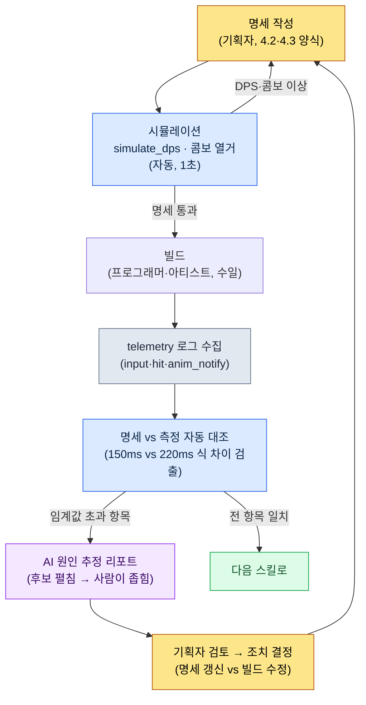

# 4.4 AI 보조 전투 시뮬레이션·검증

전투 TF 빌드 #234가 막 올라왔다. 새 스킬 `skill_thunder`를 처음 만지는 빌드다. 명세서에는 히트 타이밍 150ms라고 적혀 있다. 입력을 넣는다. 손끝의 감각이 말한다. 늦다. 분명히 늦다. 옆자리 팀원 A를 부른다. "이거 좀 떠 보이지 않아요?" 팀원 A가 두어 번 친다. "음… 좀 그런 것 같기도 하고." 둘 다 확신이 없다. 명세는 150이라는데 손은 200쯤이라고 우긴다. 누가 맞는가. 손끝 대 종이의 싸움. 다음 빌드에서도 또 누군가 "체감상 괜찮은데요"라고 말할 것이고, 그 한마디에 빌드 하나가 또 흘러간다.

이 장의 목표는 그 싸움을 끝내는 것이다. 손끝이 200이라고 하면, 진짜 200인지 숫자로 보여 주는 것. 그리고 빌드가 올라오기 *전에*, 명세만 보고도 "이 스킬은 DPS가 목표보다 30% 높다"를 미리 아는 것. 200명이 매달린 AAA MMORPG의 전투를 초기부터 잡던 시절에도 감각과 숫자가 어긋날 때의 막막함은 똑같았다. 달라진 건, 이제는 그 어긋남을 숫자로 매듭지을 도구가 손에 있다는 것뿐이다.

4.2·4.3이 전투의 명세를 어떻게 *적는지*를 다뤘다면, 4.4은 그 명세가 의도대로 *작동하는지*를 다룬다. 검증에는 두 축이 있다. 하나는 빌드 없이 계산만으로 검증하는 시뮬레이션, 다른 하나는 실제 빌드 영상에서 측정값을 뽑아내는 캡처 분석이다. 두 축이 한 사이클로 묶이면 전투 기획의 회수가 일 단위에서 시간 단위로 줄어든다.

결론을 먼저 밝히면, 이 장의 핵심은 *명세에 적힌 숫자(150ms)와 빌드에서 측정한 숫자(220ms)를 나란히 놓고 그 차이를 읽는 것*이다(4.4.5). 앞쪽 절들(시뮬레이터·콤보 열거)은 그 대조를 가능하게 만드는 준비 단계로 읽으면 된다.

---

## 4.4.1 빌드를 기다리는 비용

전투 기획자가 새 스킬 하나를 검증하려면 무슨 일이 일어나는가.

기획자가 명세를 쓴다. 프로그래머가 데이터를 넣고, 아티스트가 모션·이펙트를 붙이고, 빌드가 돌고, QA가 한 바퀴 돌고, 그제서야 기획자가 손으로 만져 본다. 빠르면 이틀, 보통 사나흘. 사이클 *끝에서* "DPS가 너무 높다"가 발견되면, 그 발견은 처음으로 되돌아가라는 명령이 된다. 사나흘이 한 번 더.

시뮬레이션은 이 사이클의 *첫 단계*에서 답을 주는 도구다. 명세만으로 계산해 본다. 답이 나쁘면 명세를 고치고 다시 계산. 빌드라는 비싼 단계에 진입하기 전에 명세 자체가 한 번 걸러진다. 모형 자동차를 풍동에 먼저 넣어 보는 것과 같다. 진짜 차를 도로에 올리기 전에, 의심스러운 설계는 책상 위에서 탈락한다.

물론 풍동이 도로를 100% 예측하지는 않는다. 그래서 두 번째 축인 캡처 분석이 필요하다. 시뮬레이션이 *이상적인 답*이라면, 캡처는 *실제로 빌드에서 벌어진 답*이다. 둘을 나란히 놓고 차이를 읽는 것 — 그게 이 장의 전부다.

---

## 4.4.2 simulate_dps — 실행 가능한 시뮬레이터

추상적인 의사 코드로는 아무것도 검증되지 않는다. 그래서 처음부터 *돌아가는* 코드를 만든다. 아래는 저자가 전투 TF에서 쓰는 `simulate_dps.py`의 핵심 골격을, 회사 데이터를 걷어내고 책에 싣기 위해 재구성한 것이다. 의존성 없이 Python 표준 라이브러리만으로 돈다(전체 파일은 「따라하기」 참고).

입력은 단순하다. 스킬 하나는 `damage`·`cast_sec`(시전 점유 시간)·`cooldown_sec`·`resource_cost`를, 캐릭터는 자원 총량·초당 회복량·스킬 목록·우선순위 로테이션을 가진 dataclass다. 그 위에서 도는 본체는 "매 순간 쓸 수 있는 스킬 중 우선순위가 가장 높은 것을 쓴다"는 단순한 욕심쟁이(greedy) 규칙뿐이다. 실제 플레이어보다 똑똑하지도 멍청하지도 않은, *이상적 상한*을 잡는 것이 목적이다. 척추가 되는 부분만 발췌하면 이렇다.

```python
# 0.05초 틱으로 타임라인을 만든다. 시전 중이 아니면 우선순위 순으로 첫 사용 가능 스킬을 쓴다.
while t < duration_sec:
    resource = min(char.max_resource, resource + char.resource_regen * tick)
    for name in cooldowns:
        cooldowns[name] = max(0.0, cooldowns[name] - tick)
    if t >= busy_until:                     # 시전 모션이 안 끝났으면 대기
        for name in char.rotation:          # 우선순위 순
            s = skill_by_name[name]
            if cooldowns[name] <= 0 and resource >= s.resource_cost:
                total_damage += s.damage
                resource -= s.resource_cost
                cooldowns[name] = s.cooldown_sec
                busy_until = t + s.cast_sec  # 이 시각까지 다음 스킬 불가
                break
    t += tick
# …(dataclass 정의·warrior 입력·출력 루프는 「따라하기」 전체 코드 참고)
```

warrior에 `skill_thunder`(데미지 420·시전 0.9s·쿨다운 6s)를 1순위로, `skill_dash`·`basic_1`을 뒤에 두고 20초를 돌린 결과(`python simulate_dps.py`):

```
평균 DPS: 261.0
  t=  0.0s  skill_thunder  자원=60
  t=  0.9s  skill_dash     자원=47
  t=  1.3s  basic_1        자원=50
  t=  1.6s  basic_1        자원=53
  t=  1.9s  basic_1        자원=55
  ...
```

이 값에 무슨 의미가 있는가. *빌드 없이*, 1초 안에, warrior의 이상적 DPS 상한이 약 261이라는 사실을 안다는 것이다. 목표 DPS가 180이었다면 이 명세는 +45%로 과하다. 빌드를 기다릴 필요 없이 지금 `damage`나 `cooldown_sec`을 만지면 된다.

한계도 정직하게 적는다. 이 시뮬레이터는 플레이어의 입력 실수, 이동·회피로 인한 공백, 적의 방해를 반영하지 않는다. 그래서 측정값은 항상 실제 빌드보다 높게 나온다. 이건 버그가 아니라 *상한선*이라는 시뮬레이터의 정의 그 자체다. 실측과의 격차는 4.4.5에서 캡처로 메운다.

> **AI 활용 노트.** 위 골격은 저자가 짠 것이지만, 새 자원 모델(예: 분노 게이지가 데미지를 받으면 차오르는 구조)을 붙일 때는 Claude에게 "이 simulate_dps에 피격 시 분노 +5 규칙을 추가해 줘. tick 루프 안에서, 기존 자원 회복과 별개 변수로"처럼 *기존 코드를 인용하며* 요청한다. 백지에서 시뮬레이터를 통째로 생성하라고 하면 검증 불가능한 코드가 나온다. 척추는 사람이 잡고, AI는 가지를 친다.

---

## 4.4.3 콤보 경로 자동 열거

DPS 한 숫자만으로는 부족하다. "어느 콤보가 의도된 메인 콤보인가"를 검증하려면 *가능한 모든 경로*를 펼쳐 봐야 한다. 손으로 트리를 그리면 노드 7\~8개에서 이미 머리가 터진다. 경로를 빠짐없이 펼치는 건 기계가 사람보다 압도적으로 잘한다 — 단, 사람이 결과를 되짚어 볼 수 있는 형태로 뽑게 시켜야 한다.

다음은 콤보 그래프를 받아 모든 경로를 열거하고 DPS로 정렬하는 코드다. `combo_graph`는 "어떤 액션 다음에 어떤 액션으로 캔슬할 수 있는가"를 인접 리스트로 적은 것으로, 4.3의 상태 머신 명세에서 그대로 추출된다. 핵심은 막다른 끝까지 재귀로 펼치는 `all_paths` 제너레이터다.

```python
# enumerate_combos.py — 콤보 그래프의 모든 경로를 펼쳐 DPS로 정렬
combo_graph = {"start": ["A"], "A": ["B", "D"], "B": ["C", "E"], "D": ["C"], "C": [], "E": []}
action_stats = {  # (데미지, 소요 시간 초)
    "A": (300, 0.8), "B": (450, 1.0), "C": (450, 1.2), "D": (600, 1.4), "E": (200, 0.6),
}

def all_paths(node="start", path=None):
    path = (path or [])
    nexts = combo_graph.get(node, [])
    if not nexts:                       # 막다른 끝 = 완성된 콤보
        yield [n for n in path if n in action_stats]
        return
    for nxt in nexts:
        yield from all_paths(nxt, path + [nxt])

results = []
for p in all_paths():
    dmg = sum(action_stats[a][0] for a in p)
    dur = sum(action_stats[a][1] for a in p)
    results.append((p, dmg, round(dur, 1), round(dmg / dur, 1)))

for p, dmg, dur, dps in sorted(results, key=lambda r: -r[3]):
    print(f"{' → '.join(p):<18} {dmg:>5} dmg  {dur:>4}s  DPS {dps}")
```

실행 결과:

```
A → D → C            1350    3.4s  DPS 397.1
A → B → C            1200    3.0s  DPS 400.0
A → B → E             950    2.4s  DPS 395.8
```

여기서 기획자가 읽어야 할 신호는 단순한 1등이 아니다. 세 경로의 DPS가 396\~400으로 거의 붙어 있다는 것 — 이건 "어느 콤보를 써도 효율이 비슷해서 *메인 콤보의 정체성이 없다*"는 신호다. 의도가 "A→D→C가 고위험 고수익 메인이어야 한다"였다면, D의 데미지를 올리거나 시간을 줄여 DPS를 한 단계 띄워야 한다. 명세로 돌아갈 차례다.

이 자동 열거가 손 계산을 대체하는 자리에서, 콤보 노드가 20개로 늘어도 사람은 정렬된 표만 읽으면 된다.

---

## 4.4.4 빌드 캡처 분석 — 현실적인 방법은 telemetry다

이제 두 번째 축. 빌드에서 실제로 무슨 일이 벌어졌는지 측정하는 단계다. 흔히 "빌드 영상을 AI가 보고 자동 분석"을 떠올리지만, 여기서는 정직하게 갈래를 나눈다. 측정값을 얻는 길은 세 가지이고, 셋의 비용·정확도가 크게 다르다.

<svg viewBox="0 0 720 250" xmlns="http://www.w3.org/2000/svg" font-family="sans-serif" font-size="13">
  <rect x="10" y="20" width="220" height="200" rx="8" fill="#fde8e8" stroke="#c0392b" stroke-width="1.5"/>
  <text x="120" y="45" text-anchor="middle" font-weight="bold" fill="#c0392b">A. 영상 직접 분석</text>
  <text x="120" y="72" text-anchor="middle">화면 픽셀에서</text>
  <text x="120" y="92" text-anchor="middle">입력·모션·VFX 추출</text>
  <text x="120" y="124" text-anchor="middle" font-weight="bold">정확도: 낮음~중간</text>
  <text x="120" y="148" text-anchor="middle">구현난이도: 매우 높음</text>
  <text x="120" y="172" text-anchor="middle">프레임 오차 ±1~2</text>
  <text x="120" y="200" text-anchor="middle" fill="#777">연구·데모용</text>

  <rect x="250" y="20" width="220" height="200" rx="8" fill="#fef5e7" stroke="#d68910" stroke-width="1.5"/>
  <text x="360" y="45" text-anchor="middle" font-weight="bold" fill="#d68910">B. 기성 비전 API</text>
  <text x="360" y="72" text-anchor="middle">외부 vision 서비스에</text>
  <text x="360" y="92" text-anchor="middle">캡처 프레임 전송</text>
  <text x="360" y="124" text-anchor="middle" font-weight="bold">정확도: 중간</text>
  <text x="360" y="148" text-anchor="middle">구현난이도: 중간</text>
  <text x="360" y="172" text-anchor="middle">IP 유출 위험</text>
  <text x="360" y="200" text-anchor="middle" fill="#777">사내 정책 점검 필요</text>

  <rect x="490" y="20" width="220" height="200" rx="8" fill="#e8f6ef" stroke="#1e8449" stroke-width="1.5"/>
  <text x="600" y="45" text-anchor="middle" font-weight="bold" fill="#1e8449">C. 게임 내 telemetry</text>
  <text x="600" y="72" text-anchor="middle">엔진이 이벤트를</text>
  <text x="600" y="92" text-anchor="middle">타임스탬프와 함께 로그</text>
  <text x="600" y="124" text-anchor="middle" font-weight="bold">정확도: 높음</text>
  <text x="600" y="148" text-anchor="middle">구현난이도: 낮음~중간</text>
  <text x="600" y="172" text-anchor="middle">엔진 시각 직접 사용</text>
  <text x="600" y="200" text-anchor="middle" fill="#1e8449" font-weight="bold">현실적 선택</text>
</svg>

A안(영상 픽셀 분석)은 매력적으로 들린다. 입력 표시, 캐릭터 모션 변화, 이펙트 첫 프레임, 사운드 파형, 데미지 숫자 UI — 다섯 신호를 화면에서 자동 추출한다는 그림이다. 하지만 실제로 만들어 보면 프레임 압축 노이즈, UI 가림, 모션 블러 때문에 ±1\~2프레임 오차가 기본으로 깔린다. 60fps에서 1프레임은 약 16.7ms다. 히트 타이밍을 ms 단위로 따지는 검증에서 ±33ms 노이즈는 치명적이다. *구현 난이도는 매우 높고, 정확도는 그 노력에 못 미친다.*

그래서 현실의 답은 C안, **게임 내 telemetry 로그**다. 엔진은 이미 입력 시각, 애니메이션 노티파이 발생 시각, VFX 스폰 시각, 데미지 적용 시각을 *내부적으로 정확히 알고 있다*. 그 시각을 픽셀에서 추론할 게 아니라, 한 줄 로그로 찍게 만들면 된다. 픽셀에서 100ms를 *복원*하는 대신, 엔진이 아는 100ms를 *그대로 받아 적는다.*

```cpp
// 전투 액션 처리 코드에 한 줄 추가 (UE C++ 의사 예시)
// 입력 수신 / 데미지 적용 시점에 같은 로거를 호출
CombatTelemetry::Log("input",  SkillName, GetWorld()->GetTimeSeconds());
CombatTelemetry::Log("hit",    SkillName, GetWorld()->GetTimeSeconds());
```

로거는 한 줄씩 JSON Lines로 떨군다.

```
{"event":"input","skill":"skill_thunder","t":12.340}
{"event":"hit",  "skill":"skill_thunder","t":12.560}
{"event":"input","skill":"basic_3","t":14.100}
{"event":"hit",  "skill":"basic_3","t":14.166}
```

`input`과 `hit`의 시각 차이가 곧 측정 히트 타이밍이다. 12.560 − 12.340 = 0.220초 = **220ms**. 픽셀 분석의 ±33ms가 아니라, 엔진 시각 그대로의 값이다. 이 로그를 떠 와서 명세와 대조하는 것이 다음 절이다.

---

## 4.4.5 워크드 트랜스크립트: 명세 150ms vs 측정 220ms

이제 두 축을 한자리에 모은다. 명세는 150ms를 약속했고, telemetry는 220ms를 측정했다. +70ms. 손끝이 옳았다. 이 격차의 *원인*을 좁히는 과정을 AI와 함께 끝까지 따라간다. 요약하지 않고, AI가 처음에 헛다리를 짚는 장면까지 그대로 싣는다.

### 프롬프트

명세는 히트 타이밍 150ms인데 측정은 220ms다. 아래 로그를 붙여, 사람이 실제로 칠 법한 길이로 묻는다. 장황한 격식보다 의도가 분명한 짧은 요청이 낫다 — 검증 방법까지 적게 하는 한 줄과 단정 금지 한 줄이 이 프롬프트의 척추다.

> skill_thunder 히트 타이밍이 명세 150ms인데 측정 220ms로 +70ms 초과한다. 아래 telemetry로 가능한 원인을 나누고 *각각 어떤 로그로 확정/배제하는지*까지 적어라. 단정 말고 확실치 않으면 '미확인'으로.  // "검증 방법까지"·"단정 금지" 두 가지가 핵심 의도. 나머지 격식은 생략해도 결과가 같다.
>
> ```
> {"event":"input","skill":"skill_thunder","t":12.340}
> {"event":"anim_start","skill":"skill_thunder","clip":"cast_thunder","t":12.340}
> {"event":"anim_notify","skill":"skill_thunder","notify":"HitWindow","t":12.560}
> {"event":"hit","skill":"skill_thunder","t":12.560}
> ```
> 명세상 cast_thunder의 HitWindow 노티파이는 0.150s 지점.

### Claude 날것 출력 (1차 — 검증 전, 헛다리 포함)

> +70ms 초과의 원인으로 다음 네 가지를 추정합니다.
>
> 1. **네트워크 레이턴시.** 입력이 서버를 왕복하면서 70ms가 추가됐을 수 있습니다. 멀티플레이 빌드라면 RTT를 확인하세요.
> 2. **프레임레이트 저하.** 빌드가 30fps로 돌면 1프레임이 33ms라, 노티파이 타이밍이 프레임 경계로 반올림되며 지연이 누적됩니다.
> 3. **캐스팅 모션 길이 변경.** cast_thunder 클립이 명세보다 길어져 HitWindow 노티파이가 뒤로 밀렸을 수 있습니다.
> 4. **입력 버퍼 지연.** 입력 큐가 한 틱 늦게 처리됐을 수 있습니다.
>
> 가장 가능성 높은 원인은 **1번 네트워크 레이턴시**입니다. 70ms는 전형적인 RTT 범위입니다.

### 사람 검증·거부

여기서 멈추고 로그를 다시 본다. AI의 1순위 추정(네트워크)은 *이 로그로 이미 배제된다*. `input`과 `anim_start`가 정확히 같은 시각 12.340에 찍혔다. 입력이 들어온 순간 모션이 즉시 시작됐다는 뜻이고, 네트워크 왕복이 끼어들 틈이 없다. 1번은 틀렸다.

2번(프레임레이트)도 약하다. 30fps라면 33ms 단위의 들쭉날쭉이 보여야 하는데, input→hit가 정확히 0.220으로 깔끔하다. 이건 프레임 경계 반올림이 아니라 *클립 내 고정 위치*의 냄새다.

결정적인 단서는 따로 있다. `anim_notify`의 시각이 `anim_start` 기준 +0.220이다. 명세는 HitWindow가 클립 시작 후 0.150에 있어야 한다는데, 실제 클립에서는 0.220 지점에 고정되어 있다. 즉 *클립 자체가 명세와 다르게 만들어졌거나, 노티파이 위치가 0.150에서 0.220으로 옮겨졌다*. 원인은 네트워크도 프레임레이트도 아니라 **3번, 모션/노티파이 데이터**다. AI는 정답 후보를 4개 안에 포함시켰지만, 순위를 거꾸로 매겼다.

### 재요청 프롬프트

배제 근거를 사람이 손으로 채워 다시 던진다. 길게 설명할 필요 없이, 배제한 것과 남은 사실만 짧게 못 박는다.

> 네트워크·프레임레이트 배제. (근거: input=anim_start 동일 시각이라 입력→모션 지연 없음 / input→hit가 0.220로 프레임 노이즈 없이 일정.) 남은 사실: anim_notify가 anim_start +0.220, 명세는 +0.150. 이 사실만으로 원인 좁히고, 프로그래머·애니메이터에게 뭘 요청할지 *행동 단위*로.  // 핵심은 "행동 단위로" — 추정이 아니라 누구에게 무엇을 요청하는지로 끝나게 한다.

### Claude 날것 출력 (2차)

> 제시된 근거로 원인은 **애니메이션 클립 cast_thunder의 HitWindow 노티파이가 0.150s가 아니라 0.220s에 배치된 것**으로 좁혀집니다. 두 갈래가 남습니다.
>
> - **(가) 노티파이는 0.150에 맞지만 클립 전체가 느려졌다** — 재생 속도(play rate)가 명세보다 낮거나 클립 길이가 늘었다면, 0.150 지점이 실시간 0.220으로 늘어집니다.
> - **(나) 노티파이 위치 자체가 0.220으로 옮겨졌다** — 클립 길이는 그대로인데 마커만 이동.
>
> 두 갈래를 가르는 확인:
> 1. **애니메이터에게**: cast_thunder의 HitWindow 노티파이 프레임 번호와 클립 총 프레임 수, 그리고 명세 작성 시점의 값과 비교한 변경 이력을 요청. 마커가 옮겨졌으면 (나).
> 2. **프로그래머에게**: skill_thunder의 montage play rate가 1.0인지, 캐릭터 공격속도 스탯이 이 클립에 곱해지는지 확인. play rate가 0.68(=0.150/0.220)이면 (가).
> 3. anim_start→anim_notify 간격을 다른 캐릭터 공격속도에서 한 번 더 측정. 공격속도에 따라 간격이 변하면 (가), 불변이면 (나).
>
> 권장 조치: (나)로 확인되면 노티파이를 0.150으로 되돌리거나 명세를 0.220으로 갱신(둘 중 의도된 쪽). (가)로 확인되면 play rate 적용 로직을 점검.

이번 출력은 채택할 만하다. 추정을 단정하지 않고 (가)/(나) 두 갈래로 갈랐으며, *각 갈래를 데이터로 가르는 방법*과 *누구에게 무엇을 요청할지*가 행동 단위로 적혀 있다. 특히 3번 확인(공격속도를 바꿔 재측정)은 사람이 놓치기 쉬운 결정적 분기다. 이 리포트를 그대로 회의에 들고 가면, 회의는 "원인이 뭘까"를 토론하는 자리가 아니라 "(가)냐 (나)냐를 30분 안에 확정하고 조치를 고르는" 자리가 된다.

이 워크드 트랜스크립트가 보여 주는 핵심은, AI가 처음부터 정답을 주지 않는다는 사실이다. 1차 출력은 네트워크를 1순위로 짚는 헛다리였다. *로그를 읽고 후보를 배제하는 사람의 검증*이 끼었을 때 비로소 분석이 정답으로 수렴했다. AI는 후보를 넓게 펼치고, 사람은 좁힌다. 이 분업이 4.4 전체의 방법론이다.

---

## 4.4.6 두 축을 한 사이클로 — 검증 루프

시뮬레이션(4.4.2\~4.4.3)과 캡처 분석(4.4.4\~4.4.5)이 따로 돌면 절반의 가치다. 하나로 묶일 때 다음 루프가 만들어진다.



시뮬레이션이 빌드 *전에* 답을 주므로, 빌드에 들어가는 명세는 이미 한 번 걸러진 것이다. 그래서 빌드 후에 발견되는 문제는 "명세가 틀렸다"가 아니라 "명세와 구현이 어긋났다"로 성격이 좁혀진다. 4.4.5의 +70ms가 바로 그 후자였다 — 명세 150은 합리적이었고, 구현이 220으로 어긋났을 뿐이다. 이 구분이 회의에서 책임 소재 다툼을 없앤다.

다만 이 루프가 모든 전투 콘텐츠를 덮지는 않는다. 메인 보스의 시그니처 연출처럼 *느낌이 곧 콘텐츠인* 영역은 DPS 숫자로 환원되지 않는다. 시뮬레이션은 수치 기반 콘텐츠에 강하고, 연출은 여전히 사람의 눈으로 보는 영상 검수가 답이다. 루프는 수치의 강에서 돌고, 연출의 강은 따로 흐른다.

---

## 4.4.7 6개월 운영에서 본 것

저자가 운영한 어느 MMORPG(refgame 계열 조작감을 목표로 한 프로젝트 A) 전투 TF의 6개월 측정이다. 아래 수치는 TF 내부 기록에서 추린 *실측치*이며, 빌드 수·시간은 사이클 단위로 반올림한 값임을 밝힌다(정확한 분 단위가 아니라 사이클·반나절 단위의 측정).

| 항목 | 도입 전 | 도입 후 |
|---|---|---|
| 새 스킬 검증 사이클 | 평균 3\~4 빌드 | 평균 1\~2 빌드 |
| 100개 스킬 빌드 검증 | 반나절(수동) | 30분(telemetry 자동 대조) |
| 밸런스 회의 | 2시간(주관 토론) | 30분(데이터 기반) |
| 빌드 직전 발견 결함 | 평균 5\~8건/빌드 | 평균 1\~2건/빌드 |

숫자보다 중요한 변화는 회의의 *성격*이다. 도입 전 회의의 절반은 "이 스킬 너무 세다" 대 "아니다 적당하다"였다. 손끝 대 손끝의 싸움. 도입 후 그 자리는 "측정 DPS가 목표 +12%이고 측정 히트 타이밍이 명세 +70ms다. 모션을 단축할까, 데미지를 10% 내릴까"로 옮겨갔다. *무엇이 문제인지*를 다투던 시간이 *어떻게 고칠지*를 정하는 시간으로 바뀐 것이다.

이 전환의 비용도 정직하게 적는다. telemetry 로거를 전투 코드 전역에 심는 초기 작업이 약 1\~2주, 명세 스키마를 캐릭터·스킬 전부에 통일시키는 데 추가로 분기 하나가 들었다. 첫 분기에는 시뮬레이션과 telemetry 둘 중 하나만 돌아가도 충분하다고 봤다. 둘이 한 루프로 맞물린 건 두 번째 분기부터였다.

---

## 4.4.8 흔한 실수와 회피

다섯 가지가 반복된다.

첫째, 시뮬레이션 값을 절대 신뢰한다. simulate_dps의 261은 *상한*이지 실측이 아니다. telemetry와 비교하지 않으면 항상 과대평가한다.

둘째, 측정을 안 한다. 명세만 시뮬레이션하고 빌드를 telemetry로 안 보면 4.4.5 같은 +70ms가 조용히 누적된다. telemetry 로깅은 옵션이 아니라 전투 코드의 기본 설비다.

셋째, 리포트를 회의에 안 가져온다. 자동 리포트가 떠 있어도 회의 어젠다에 없으면 아무도 안 본다. "이번 빌드 telemetry 대조표"를 어젠다 고정 항목으로 넣는다.

넷째, AI 추정을 검증 없이 채택한다. 4.4.5에서 봤듯 AI의 1차 추정은 헛다리였다. AI는 후보를 넓히는 도구이지 결론을 내리는 도구가 아니다. 로그로 후보를 배제하는 사람의 한 단계를 절대 건너뛰지 않는다.

다섯째, 스킬마다 명세 구조가 다르다. `cast_sec`을 어떤 스킬은 `cast_time`, 어떤 스킬은 `castMs`로 적으면 시뮬레이터도 대조 스크립트도 매번 깨진다. 공통 명세 스키마 하나를 모든 스킬에 강제한다 — 이게 4.4 도구 전체가 돌아가는 전제다.

첫 분기에 다섯 개를 다 잡을 필요는 없다. 한두 개만 자리 잡아도 사이클은 눈에 띄게 짧아진다. 나머지는 루프를 돌리며 자연히 메워진다.

---

## 4.4.9 Part 4를 마치며

4.1\~4.4에서 전투 기획의 좌표·Look & Feel·콤보·시뮬레이션을 차례로 다뤘다. 4.1은 전투 기획자가 무엇을 측정 가능한 대상으로 보는지, 4.2은 히트 타이밍·히트스톱·이펙트 동기화를 어떻게 측정·조정하는지, 4.3은 콤보·캔슬·입력 큐를 상태 머신으로 어떻게 적는지, 그리고 4.4은 그 모든 명세가 의도대로 작동하는지를 빌드 없이/빌드에서 어떻게 검증하는지를 다뤘다.

Part 4를 끝낸 전투 기획자의 한 주는 이렇게 바뀐다. 월요일, 새 스킬 명세에 simulate_dps 자동 검증이 붙는다. 화요일, 콤보 경로 자동 열거로 메인 콤보의 정체성을 점검한다. 수요일, 빌드가 올라오면 telemetry 대조표가 자동으로 뜬다. 목요일, 데이터 기반 토론 30분. 금요일, 다음 사이클 명세 수정. 빌드 사이클이 3\~4회에서 1\~2회로 줄고, 회의가 절반 이하로 짧아진다. 타격감이라는 추상이 측정 가능한 220ms로 옮겨간다.

그리고 빌드 #234의 그 장면 — "이거 좀 떠 보이지 않아요?"라는 질문에, 이제는 telemetry 로그가 220ms라고 대신 대답한다. 손끝 대 종이의 싸움은 끝났다.

다음 Part 5는 내러티브 기획이다. 2.3에서 소개한 NarrativeDocs Layer 0\~4 구조의 본격 적용 사례로 넘어간다.

---

## 따라하기

**setup.**
1. 아래 `simulate_dps.py` 전체를 그대로 만드세요. 의존성 없음, `python simulate_dps.py`로 즉시 실행되며 4.4.2의 "평균 DPS: 261.0"이 재현됩니다.

```python
# simulate_dps.py — 빌드 없이 명세만으로 DPS를 계산한다
from dataclasses import dataclass

@dataclass
class Skill:
    name: str
    damage: float          # 1회 타격 데미지
    cast_sec: float        # 시전(모션 점유) 시간 (초)
    cooldown_sec: float    # 재사용 대기시간 (초)
    resource_cost: float   # 자원 소모 (MP/기력)

@dataclass
class Character:
    name: str
    max_resource: float
    resource_regen: float  # 초당 자원 회복
    skills: list           # list[Skill]
    rotation: list         # 우선순위 순서 (스킬 이름)

def simulate_dps(char: Character, duration_sec: float, tick=0.05):
    cooldowns = {s.name: 0.0 for s in char.skills}   # 남은 쿨다운
    skill_by_name = {s.name: s for s in char.skills}
    resource = char.max_resource
    total_damage = 0.0
    busy_until = 0.0          # 시전 모션이 끝나는 시각
    log = []
    t = 0.0
    while t < duration_sec:
        resource = min(char.max_resource, resource + char.resource_regen * tick)
        for name in cooldowns:
            cooldowns[name] = max(0.0, cooldowns[name] - tick)
        if t >= busy_until:   # 시전 중이 아니면 다음 스킬 선택
            for name in char.rotation:          # 우선순위 순
                s = skill_by_name[name]
                if cooldowns[name] <= 0 and resource >= s.resource_cost:
                    total_damage += s.damage
                    resource -= s.resource_cost
                    cooldowns[name] = s.cooldown_sec
                    busy_until = t + s.cast_sec
                    log.append((round(t, 2), name, resource))
                    break
        t += tick
    return total_damage / duration_sec, log

if __name__ == "__main__":
    warrior = Character(
        name="warrior", max_resource=100, resource_regen=8,
        skills=[
            Skill("skill_thunder", damage=420, cast_sec=0.9, cooldown_sec=6, resource_cost=40),
            Skill("skill_dash",    damage=180, cast_sec=0.4, cooldown_sec=3, resource_cost=20),
            Skill("basic_1",       damage=60,  cast_sec=0.3, cooldown_sec=0, resource_cost=0),
        ],
        rotation=["skill_thunder", "skill_dash", "basic_1"],
    )
    dps, log = simulate_dps(warrior, duration_sec=20)
    print(f"평균 DPS: {dps:.1f}")
    for t, name, res in log[:8]:
        print(f"  t={t:>5}s  {name:<14} 자원={res:.0f}")
```

2. 전투 엔진 코드의 입력 수신·데미지 적용 지점에 telemetry 로그 한 줄씩 추가하세요(4.4.4). 엔진 시각(`GetTimeSeconds` 등)을 그대로 찍는 것이 핵심입니다.

**prompt.** 빌드 telemetry에서 명세와 어긋난 항목 하나를 골라 4.4.5 양식으로 AI에 질의하세요 — 로그 발췌를 붙이고, "추측을 단정하지 말고 원인별 검증 방법까지, 확실치 않으면 미확인으로 표기"를 반드시 포함하세요.

**verify.** AI의 1차 출력을 *그대로 채택하지 마세요*. 로그를 직접 읽어 배제 가능한 후보를 손으로 지운 뒤(4.4.5의 네트워크·프레임레이트 배제처럼) 근거를 붙여 재요청하세요. 최종 리포트가 "원인 추정 + 누구에게 무엇을 요청"의 행동 단위로 끝나면 회의에 들고 가세요.

**1인 축소판.** telemetry 로거 전역 설치가 부담이면, 검증하려는 *스킬 한 개*에만 input·hit 두 줄을 찍으세요. simulate_dps도 그 스킬 하나의 DPS만 보세요. 도구 전체를 깔지 말고, 가장 의심스러운 스킬 하나로 루프를 한 바퀴 돌려 본 뒤 확장하세요.

---

### 이 챕터의 핵심 메시지
- 시뮬레이션은 빌드 전에 명세의 이상적 상한을 계산해 일 단위 검증을 시간 단위로 줄인다
- 빌드 측정은 영상이 아니라 telemetry 로그가 현실적이며, 엔진 시각을 그대로 받아 적는다
- AI는 원인 후보를 넓히는 도구이고, 로그로 후보를 좁히는 검증은 사람의 몫이다
