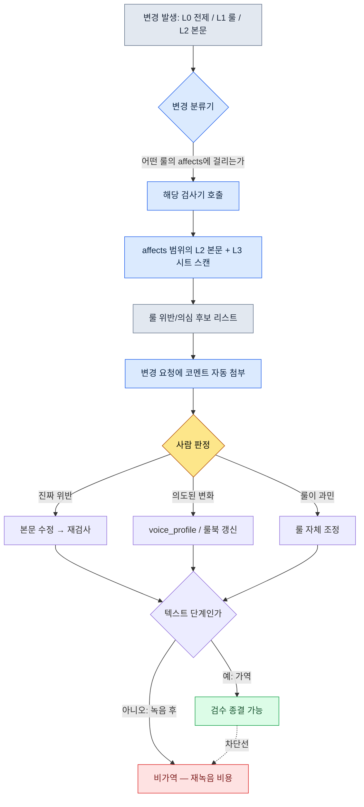

# 5.2 세계관 → 캐릭터 → 퀘스트 일관성 검증

베타 직전, QA에서 버그 리포트가 한 장 올라왔다. 제목은 "왕이 반말을 합니다." 본문은 짧았다. "3.4 도입 컷신에서 K_001(국왕)이 플레이어에게 '야, 잠깐만'이라고 함. 이 캐릭터 1.1부터 3.3까지 전부 '그대'를 씀."

작가에게 물었더니 답이 의외였다. "그 대사 제가 안 썼는데요." 추적해 보니 외주 작가가 컷신 분기 한 줄을 급하게 메우면서 넣은 것이었다. 우리 캐릭터 바이블에 voice_profile이 있었지만, 그 외주 작가는 그 문서를 본 적이 없었다. 룰은 문서 안에 있었고, 대사는 문서 밖에서 들어왔다.

이게 일관성 사고의 본질이다. 룰이 없어서가 아니라, 룰이 본문까지 따라가지 못해서 생긴다. 그리고 이 한 줄이 컷신이었다면 더 무서워진다. 컷신은 보통 성우 녹음이 붙는다. 텍스트일 때는 한 번 고치면 끝이지만, 녹음된 뒤에 발견되면 성우 재소집·재녹음·재믹싱이라는 비가역 비용이 따라온다. 일관성 검증의 진짜 목적은 "녹음 전에" 잡는 것이다.

이 장은 그 사고를 사람의 눈 대신 룰북과 검사기로 잡는 워크플로를 다룬다. lore_consistency_rule 룰북이 어떻게 검사기의 입력이 되는지, voice_lint가 톤 흔들림을 어떻게 의심 후보로 뽑는지, 그리고 왜 최종 판정만큼은 끝까지 사람의 자리로 남겨야 하는지를 실제 산출물 그대로 본다.

---

## 5.2.1 일관성 사고는 어디서 새는가

출시된 RPG·MMORPG의 사용자 리뷰를 모아 보면, 내러티브 일관성 사고는 몇 가지 패턴으로 수렴한다. 종류는 달라 보여도 원인은 거의 하나다.

- **세계관 모순**: 1.1에서 "마법은 금지되었다" → 1.3에서 NPC가 아무렇지 않게 마법을 씀
- **보이스 흔들림**: 같은 NPC가 장마다 말투·존칭이 바뀜 (앞의 "왕의 반말" 사고)
- **시간선 충돌**: 죽은 NPC가 후반부에 멀쩡히 재등장 (사망 플래그 동기화 누락)
- **보상·서사 불일치**: "왕에게 하사받은 검"이라는 서사인데 데이터상 흔한 잡템
- **세력 관계 모순**: A세력 적대를 선언한 직후 A세력 NPC가 친절한 인사를 건넴

다섯 가지가 다 다른 사고처럼 보이지만, 추적해 보면 같은 자리에서 샌다. Layer 0(세계 전제)이나 Layer 1(룰)이 바뀌었는데, 그 변경이 Layer 2(본문)와 Layer 3(데이터 시트)까지 전파되지 않은 것이다. 룰은 갱신됐는데 본문은 옛 룰 위에 멈춰 있다.

수동 검수로 이걸 막으려는 건 무리다. 한 장에 NPC 50명, 대사 2,000줄, 퀘스트 30개가 얽혀 있는데, 룰 한 줄을 바꿨을 때 그 영향이 어디까지 번지는지를 사람이 100% 추적하는 건 불가능하다. 빠뜨린 한 줄은 검수 단계에서 안 잡히고, 출시 후 리뷰란에서 잡힌다.

그렇다고 자동 검사가 100%를 보장하는 것도 아니다. 핵심은 역할 분담이다. **자동 검사는 의심 후보를 빠르게 뽑고, 판정은 사람이 한다.** 자동화의 목적은 사람의 검수 시간을 줄이는 것이지 사람을 없애는 게 아니다. 이 전제를 흐리면 뒤에서 다룰 모든 실패가 따라온다.

---

## 5.2.2 lore_consistency_rule — 검사기에 먹이는 룰북

프로젝트 A의 L1 문서 중 하나가 `lore_consistency_rule.md`다. 이 문서는 사람이 읽는 가이드인 동시에, 검사기가 파싱하는 입력이다. 프론트매터의 `atoms`와 `affects`가 그 두 역할을 한 몸에 묶는다.

```markdown
---
title: 로어 일관성 룰
layer: L1
atoms:
  - lore_check_world_rule
  - lore_check_character_voice
  - lore_check_timeline
  - lore_check_faction_relation
related:
  derives_from: [world_premise, narrative_pillar]
  affects: [main_quest/*, character_bible/*, dialogue_id_table]
---

## 1. 세계 규칙 (World Rule)
- 마법은 금지된 상태에서 시작 → 마법 사용 시 (시점, 사용자, 정당화) 명시 필요
- 신은 침묵 상태 → 직접 응답 묘사 금지 (꿈·환상 허용)

## 2. 캐릭터 보이스 규칙
- 각 캐릭터별 voice_profile 참조 강제
- 신규 대사 작성 시 voice_profile 5 항목 (어휘, 문장 길이, 존칭, 감정 표현, 금기 표현) 준수

## 3. 시간선 규칙
- 모든 NPC에 status_timeline 정의 (살아있음 / 부상 / 사망 / 행방불명 / 위치 변경)
- 대사·등장 시점에 status_timeline 자동 점검

## 4. 세력 관계 규칙
- faction_relation_matrix 변경 시점 기록
- 변경 후 대사는 새로운 관계 반영
```

`affects` 한 줄이 검사기의 스캔 범위를 정의한다. world_premise가 바뀌면 검사기는 `main_quest/*`, `character_bible/*`, `dialogue_id_table` 전부를 다시 훑는다. 사람이 "어디까지 영향이 가지?"를 머릿속으로 추적하던 작업을, 룰북에 적힌 의존성 그래프가 대신한다.

voice_profile은 이 룰북이 참조하는 별도 L2 자산이다. 캐릭터 한 명의 프로필은 검사기가 비교 기준으로 쓸 수 있도록 항목이 수치화·열거형으로 입력되어 있다.

```yaml
# character_bible/K_001_voice_profile.yaml
character_id: K_001
display_name: 국왕
voice_profile:
  vocabulary_register: 고풍_격식        # 어휘 격
  avg_sentence_len: 18                   # 평균 문장 길이(자)
  honorific: "그대"                      # 2인칭 존칭(고정)
  emotion_expression: 절제               # 감정 노출 정도
  forbidden_terms: ["야", "잠깐만", "ㅋ"] # 금기 표현
```

이 yaml이 있어야 "왕이 반말을 한다"는 사고가 사람의 직관이 아니라 기계가 비교 가능한 항목이 된다. honorific이 "그대"인데 대사에 "야"가 있으면, 그건 의견이 아니라 룰 위반 후보다.

---

## 5.2.3 일관성 검증 흐름

변경이 발생하는 순간 검사기가 발동한다. 흐름은 다음과 같다.



마지막 분기가 이 장의 숨은 척추다. 모든 일관성 판정은 **텍스트 단계에서, 즉 가역 단계에서 끝나야** 한다. 검수가 녹음·캐스팅 이후로 넘어가면 수정은 비가역이 된다. 그래서 voice_lint·timeline_lint 같은 검사기는 빠르게가 아니라 **이르게** 도는 것이 핵심이다. 컷신 대사가 녹음 큐에 들어가기 전에 한 번은 통과해야 한다.

검사기는 네 종이며, 각자 룰북의 한 섹션과 일대일로 대응한다.

- `world_rule_lint.py` — L1 세계 규칙 + 모든 L2 본문 → 마법 사용·신 응답 등 위반 후보
- `voice_lint.py` — voice_profile + dialogue_id_table → 보이스 흔들림 의심 대사
- `timeline_lint.py` — npc status_timeline + 모든 대사·등장 시점 → 사망 NPC 재등장 등 충돌
- `faction_lint.py` — faction_relation_matrix + dialogue tone → 관계 모순 대사

네 검사기 모두 100% 정확하지 않다. 그래서 출력 이름이 "위반"이 아니라 "의심 후보"다.

---

## 5.2.4 워크드 트랜스크립트: voice_lint를 한 바퀴 돌린다

추상적인 "검사기가 있다"는 말로는 감이 안 온다. 실제로 한 번 돌려 본다. 앞의 "왕이 반말을 한다" 사고를 재현한 입력이다.

**setup** — 검사 대상 대사 두 줄을 dialogue_id_table에서 가져온다.

```
dialogue_id_204  speaker=K_001  text="야, 잠깐만요. 그쪽이 먼저 말해 봐."
dialogue_id_217  speaker=K_007  text="...젠장, 또 실패야. 다시 처음부터."
```

**prompt** — 검사기 자체는 규칙 기반(정규식·길이 비교·금기어 매칭)으로 돈다. AI는 "왜 의심인지"를 작가가 읽을 자연어로 설명하는 자리에만 붙인다. 검사 단계의 LLM 프롬프트 전문은 다음과 같다.

```
voice_lint가 뽑은 의심 후보들이야. 판정은 하지 말고, 각 후보가
어떤 voice_profile 항목을 위반한 것 같은지랑 근거만 1~2문장으로 설명해줘.
"위반이다/아니다" 단정하지 말고 "~로 의심됨"까지만.

[voice_profile]
K_001: honorific="그대", avg_sentence_len=18, forbidden=["야","잠깐만"]
K_007: forbidden=["젠장"]

[의심 후보]
- dialogue_id_204 (K_001): "야, 잠깐만요. 그쪽이 먼저 말해 봐."
- dialogue_id_217 (K_007): "...젠장, 또 실패야. 다시 처음부터."
```

**Claude 날것 출력** (요약·정리 없이 그대로 옮긴다)

```
[dialogue_id_204 / K_001]
이 대사는 honorific 항목과 충돌하는 것으로 의심됩니다. voice_profile은
2인칭 존칭을 "그대"로 고정하고 있는데, 본 대사는 "그쪽"을 쓰고 존칭 자체가
드러나지 않습니다. 또한 forbidden_terms의 "야"와 "잠깐만"이 모두 등장하여
어휘 격(고풍_격식)에서 벗어난 것으로 의심됩니다. 평균 문장 길이 18자 기준과는
직접 어긋나 보이지 않으나, 어조 자체가 캐주얼해진 점이 위반 신호로 의심됩니다.

[dialogue_id_217 / K_007]
forbidden_terms의 "젠장"이 그대로 사용되어 금기 표현 항목 위반으로 의심됩니다.
다만 K_007(학자)의 emotion_expression 항목이 제시되지 않아, 이 표현이
의도된 감정 고조인지 단순 일탈인지는 이 정보만으로 판단하기 어렵습니다.
판정은 작가 검토가 필요합니다.
```

이 출력에는 우리가 일부러 남긴 두 가지 정직함이 있다. 첫째, 204에서 AI는 "평균 문장 길이는 직접 어긋나 보이지 않는다"며 **위반이 아닌 항목을 위반이라고 우기지 않았다.** 둘째, 217에서 "emotion_expression 항목이 제시되지 않아 판단하기 어렵다"며 **정보 부족을 인정하고 판정을 사람에게 넘겼다.** AI가 모든 의심을 "위반 확정"으로 밀어붙였다면, 그게 더 위험한 검사기다.

**verify** — 작가는 이 코멘트를 변경 요청에서 그대로 받아 본다. 판정은 작가가 한다.

- 204: 진짜 위반. 외주 작가가 voice_profile을 안 보고 넣은 대사다 → 본문 수정, 재검사
- 217: 의도된 위반. K_007이 무너지는 3.4의 감정 고조 대사다 → voice_profile에 `emotion_peak_exception` 플래그를 추가하고, 217을 예외로 등록

두 후보를 같은 검사기가 뽑았지만 결말이 정반대다. 하나는 본문을 고치고, 하나는 룰을 고친다. 이 분기를 기계가 자동으로 못 한다는 것이 다음 절의 핵심이다.

---

## 5.2.5 왜 판정은 사람의 자리인가

검사기가 의심까지만 뽑고 판정은 넘기는 데는 세 가지 이유가 있다.

첫째, **의도된 위반이 존재한다.** 캐릭터가 무너지거나 변하는 장에서는 보이스가 의도적으로 흔들린다. 위의 217이 그렇다. 자동 거부형 검사기는 작가의 연출 의도를 막아 버린다.

둘째, **룰 자체가 진화한다.** 같은 종류의 의심이 계속 "의도된 변화"로 판정된다면, 그건 룰이 현실을 못 따라간다는 신호다. 검사 결과는 본문만 고치게 하는 게 아니라 룰북도 고치게 한다.

셋째, **신규 캐릭터·세력은 학습 구간이 필요하다.** voice_profile이 아직 두세 개 항목밖에 안 채워진 신규 NPC는 의심이 많이 뜨는 게 정상이다. 이 시기에 자동 거부를 걸면 작가는 검사기를 적으로 인식한다.

자동 검사와 사람 판정의 경계가 분명해야 검사기가 살아남는다. 자동 거부형으로 만들면 한 달 안에 작가들이 "이거 끄자"고 한다. 회사 출입문에 너무 예민한 자동 센서를 달면, 사람이 지나갈 때마다 문이 닫혀 결국 누군가 센서를 떼어 버리는 것과 같다. 검사기는 문을 닫는 장치가 아니라, "여기 누가 지나갔다"고 알려 주는 장치여야 한다.

한 가지 단서를 덧붙인다. 검수가 텍스트 단계에서 종결되어야 한다는 원칙(앞 흐름도의 차단선)은 사람 판정에도 그대로 적용된다. 작가의 "의도된 위반" 판정도 녹음 전에 끝나야 한다. 녹음 후의 번복은 검사기 문제가 아니라 공정 비용 문제로 바뀐다(가역/비가역 경계의 전모는 5.4.5).

---

## 5.2.6 측정 — 6개월 전후

프로젝트 A에서 검사기 4종을 단계적으로 도입하고 6개월을 측정했다. 아래는 실측 로그 기반이되 절대값 대신 방향·비율로 옮긴 것이다(사내 측정, 저자 추정 아님).

- **챕터 1개 검수 시간**: 도입 전 약 5일 → 도입 후 약 2일 (절반 이하)
- **출시 후 발견되는 일관성 사고**: 챕터당 3~5건 → 0~1건
- **작가 1인당 챕터 산출 속도**: 4주 → 2.5주
- **룰북(L1) 갱신 빈도**: 분기 1~2회 → 월 1~2회

마지막 항목이 가장 흥미롭다. 검사기가 있으면 룰을 자주 바꿔도 안전하다. 룰 한 줄을 바꾸면 그 영향이 자동으로 가시화되니까, 변경의 두려움이 줄고 룰이 더 빨리 진화한다. 일관성 도구의 진짜 효과는 "사고를 줄였다"가 아니라 "룰을 겁 없이 바꿀 수 있게 됐다"는 쪽에 가깝다.

단, 위 수치는 검사기 4종이 모두 가동되는 시점의 숫자다. 도입 초기에 voice_lint 하나만으로도 가시적 효과가 나왔다는 점이 더 중요하다. 처음부터 4종을 다 켤 필요는 없다.

---

## 5.2.7 AI를 어디에 두는가

자동 검사기 본체는 규칙 기반이 효율적이다. 같은 입력에 같은 결과가 나와야 신뢰가 쌓이는데, LLM은 비결정론적이라 그 자리에 맞지 않는다. AI는 다른 네 자리에 들어간다.

- **룰 위반 후보 탐지** → 규칙(정규식·키워드·길이·구조 검사). LLM 아님
- **의심 후보의 근거 설명** → LLM. 위 워크드 트랜스크립트에서 본 "왜 의심인지" 자연어 설명
- **대안 대사 초안 생성** → LLM. 작가 검토용 초안, 확정은 작가
- **voice_profile 자동 갱신 후보 제안** → LLM. 수십 장 본문에서 패턴 추출해 항목 보강안 제시

규칙은 빠르고 결정론적이고, LLM은 설명과 생성에 강하다. 이 둘의 역할을 섞으면 둘 다 망가진다. 검사를 LLM에 맡기면 같은 대사가 어제는 통과하고 오늘은 걸리는 일이 생기고, 설명을 정규식에 맡기면 "honorific 항목 위반"이라는 기계어밖에 안 나온다.

---

## 5.2.8 도입 순서와 흔한 실패

처음부터 검사기 4종을 다 만들면 부담이 효과보다 먼저 온다. 권장 순서는 가장 싸고 효과 큰 것부터다.

1. **voice_profile 5항목 표준화** (약 1개월) — character_bible 양식부터 정착시킨다. 검사기보다 이게 먼저다
2. **voice_lint 최소 버전** (약 1주) — 금기 어휘 매칭만. 한 단어 막는 것만으로 출시 후 SNS 사고가 분기 1~2건 준다
3. **timeline_lint** (1~2주) — 사망 플래그 점검. 죽은 NPC 재등장만 잡아도 체감이 크다
4. **world_rule_lint + faction_lint** (1~2개월) — 나머지 두 종
5. **LLM 보조** (추가 1~2개월) — 설명·초안 생성 통합

단계 2(voice_lint)만으로도 효과가 크다는 점을 강조한다. 앞의 "왕의 반말" 사고는 정확히 이 단계 하나로 잡히는 종류였다.

도입 과정에서 반복되는 실패도 거의 정해져 있다.

- **자동 거부형으로 만든다** → 의심 후보 + 사람 판정 구조로 되돌린다
- **룰북이 작가와 분리되어 운영된다** → 룰북 변경에 작가 합의를 필수로, 작가가 룰북 변경을 요청할 수 있게
- **voice_profile이 형식적이다** → 캐릭터 1명으로 5항목을 완전히 채운 뒤 확장한다
- **검사 결과가 어디 있는지 모른다** → 변경 요청 코멘트에 자동 첨부를 강제한다
- **LLM에 검사 자체를 시킨다** → 검사는 규칙, 설명만 LLM
- **녹음 후에 검수한다** → 검수는 텍스트 단계에서 종결. 가역 구간을 넘기지 않는다

마지막 항목이 앞의 모든 항목보다 비싸다. 다른 실패는 시간을 잃지만, 이 실패는 성우 일정을 잃는다.

---

다음 장(5.3)에서는 검사기 대신 AI 보조로 내러티브 본문을 작성하는 흐름을 다룬다. L0 톤과 L1 룰을 컨텍스트로 주입해, AI가 일반적인 답이 아니라 우리 세계의 답을 내게 만드는 방법을 본다.

---

### 이 챕터의 핵심 메시지
- 일관성 사고는 룰이 없어서가 아니라 룰이 본문까지 전파되지 않아 생긴다.
- 검사기는 의심까지만 뽑고 판정은 사람이 해야 검사기가 폐기되지 않는다.
- 모든 일관성 검수는 녹음 전 텍스트(가역) 단계에서 종결해야 한다.

### 다음 챕터 미리보기
- 5.3. AI 보조 내러티브 작성 — L0 톤·L1 룰 컨텍스트 주입

---

## 따라하기

**setup** — character_bible에서 캐릭터 1명을 골라 voice_profile 5항목(어휘 격·평균 문장 길이·존칭·감정 표현·금기 표현)을 yaml로 완전히 채우세요. 같은 캐릭터의 기존 대사 10줄을 dialogue_id_table에서 뽑아 한 파일에 모읍니다.

**prompt** — 위 워크드 트랜스크립트의 검사 보조 프롬프트를 그대로 쓰세요. 핵심은 두 제약입니다. "판정하지 마라"와 "~로 의심됨까지만 말하라"입니다. 입력에 voice_profile yaml과 대사 10줄을 붙입니다.

**verify** — 출력된 의심 후보를 한 줄씩 본인이 판정하세요. 진짜 위반이면 본문을 고치고, 의도된 변화면 voice_profile에 예외 플래그를 추가합니다. AI가 "위반 아닌 항목"까지 위반이라고 우겼는지, "정보 부족"을 인정하는지를 함께 확인합니다. AI가 모든 항목을 위반으로 단정하면 프롬프트의 "판정하지 마라" 제약을 강화하세요.

### 1인 축소판

검사기 4종도 룰북도 없는 1인 개발이라면, 검사기 본체 없이 프롬프트 하나로 같은 효과를 낼 수 있습니다. 캐릭터별 voice_profile yaml만 손으로 유지하고, 신규 대사를 쓸 때마다 해당 캐릭터의 yaml + 새 대사를 위 보조 프롬프트에 붙여 "의심 후보"를 받으세요. 자동화는 없지만 **판정은 사람, AI는 설명**이라는 핵심 구조는 똑같이 삽니다. 단 한 줄만 지키면 됩니다 — 녹음·음성합성에 넘기기 전에 이 검토를 한 번 거치세요. 가역 단계를 넘기지 않는 원칙은 팀 규모와 무관합니다.
