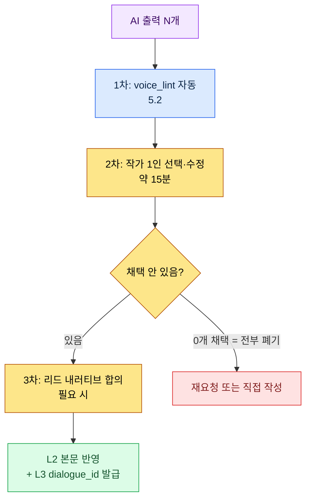
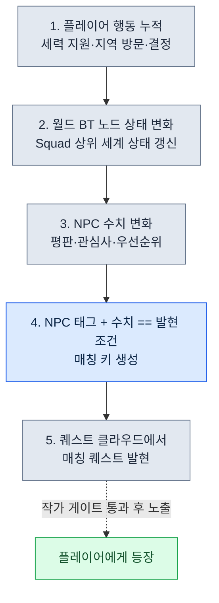

# 5.3 AI 보조 내러티브 작성

새 사이드 NPC의 첫 대사를 뽑던 날이었다. 빈 채팅창에 "마을 대장장이 NPC 대사 5개 만들어줘"라고 쳤다. 5초 뒤 화면에 "용사여, 자네의 무기를 내게 맡기게"가 떴다. 어디서 본 듯한 게 아니라, 정확히 어디서 봤는지 알 것 같은 문장이었다. 같은 프롬프트를 다른 팀의 다른 게임에 넣어도 똑같은 답이 나올 거였다. 그 순간 깨달은 건 모델이 약하다는 게 아니라, 내가 모델에게 우리 게임을 아무것도 알려주지 않았다는 것이었다.

AI는 일반적인 판타지 문장을 잘 쓴다. 그런데 우리 세계의 문장은 못 쓴다. 차이는 단 하나, 컨텍스트 주입이다. L0 톤과 L1 룰을 매 요청마다 함께 보내면, AI가 뱉는 한 줄은 "어디서 본 듯한 문장"에서 "이 게임의 문장"으로 바뀐다. 이 챕터는 그 주입을 4층으로 운영하는 실무를 다루고, 마지막에 같은 원리를 월드 시뮬레이션 규모로 끌어올리는 진보적 적용(월드 BT(BehaviorTree, 행동 트리) + 퀘스트 클라우드)을 RnD 최전선으로 짚는다.

---

## 5.3.1 컨텍스트가 비어 있을 때 일어나는 일

내러티브 분야에서 AI 보조는 가장 빨리 도입되고 가장 빨리 신뢰를 잃는 영역이다. 실패 패턴이 거의 똑같기 때문이다.

"퀘스트 시작 대사 5개"라고 던지면 "용사여, 저희 마을이..."로 시작하는 일반 판타지 5종이 돌아온다. "이 캐릭터 대사 좀 고쳐줘"라고 하면 보이스가 평준화돼서 모든 NPC가 비슷한 말투로 수렴한다. "챕터 1 시놉시스 써줘"라고 하면 본 적 있는 RPG 시놉시스들의 평균값이 나온다.

문제는 모델이 아니라 컨텍스트가 비어 있다는 것이다. 모델은 학습 데이터의 평균을 출력한다. 평균을 원하지 않으면 평균에서 멀어질 단서를 줘야 한다. 이 챕터의 주제는 그 단서를 어떻게 만들고 어떻게 주입하느냐다.

저자가 운영하는 MMORPG 프로젝트(이하 프로젝트 A)에서 내러티브 AI 보조는 4층의 컨텍스트를 순서대로 쌓는다. 5.1에서 NarrativeDocs를 Layer 0\~4로 분해한 그 구조가, 여기서 그대로 주입 단위로 재사용된다.

<svg viewBox="0 0 720 300" xmlns="http://www.w3.org/2000/svg" font-family="sans-serif">
  <rect x="20" y="20" width="680" height="46" rx="6" fill="#1f2d3d"/>
  <text x="40" y="40" fill="#fff" font-size="14" font-weight="bold">Layer A · 시스템 프롬프트</text>
  <text x="40" y="58" fill="#9fb3c8" font-size="11">작가 페르소나 · 금기 (거의 안 바뀜, 한 번 정의)</text>

  <rect x="20" y="78" width="680" height="46" rx="6" fill="#27496d"/>
  <text x="40" y="98" fill="#fff" font-size="14" font-weight="bold">Layer B · L0 비전</text>
  <text x="40" y="116" fill="#bcd4e6" font-size="11">world_premise · narrative_pillar · tone_manifesto (≈7,000 tok, 캐싱)</text>

  <rect x="20" y="136" width="680" height="46" rx="6" fill="#2e6171"/>
  <text x="40" y="156" fill="#fff" font-size="14" font-weight="bold">Layer C · L1 룰 (선택 주입)</text>
  <text x="40" y="174" fill="#cfe8df" font-size="11">작업 관련 룰의 _summary 절만 골라서 (캐싱)</text>

  <rect x="20" y="194" width="680" height="46" rx="6" fill="#3e885b"/>
  <text x="40" y="214" fill="#fff" font-size="14" font-weight="bold">Layer D · L2 인접 본문</text>
  <text x="40" y="232" fill="#e3f2e8" font-size="11">같은 캐릭터 직전 대사 · 같은 챕터 시놉시스 (원본 그대로, 매번 변경)</text>

  <rect x="180" y="254" width="360" height="36" rx="6" fill="#c0392b"/>
  <text x="200" y="277" fill="#fff" font-size="13" font-weight="bold">작업 지시: "이 시점 K_007의 대사 3안"</text>

  <line x1="360" y1="66" x2="360" y2="78" stroke="#888" stroke-width="2"/>
  <line x1="360" y1="124" x2="360" y2="136" stroke="#888" stroke-width="2"/>
  <line x1="360" y1="182" x2="360" y2="194" stroke="#888" stroke-width="2"/>
  <line x1="360" y1="240" x2="360" y2="254" stroke="#888" stroke-width="2"/>
</svg>

4층을 매번 다 넣지는 않는다. 작업 유형에 따라 필요한 층만 꺼낸다. 한 캐릭터의 다음 대사 초안이면 A + B(톤만) + D(그 캐릭터 최근 대사 10줄)면 충분하다. 신규 사이드 퀘스트 시놉시스면 C(quest 구조 룰)가 추가된다. 분기 결과 4안이면 C(분기 규칙) + D(분기 직전 본문 전체)가 무거워진다. 책상 위 서류함에서 페르소나 시트, 세계관 한 줄, 룰북 페이지, 인접 본문 한 묶음을 작업 크기에 맞춰 골라 보내는 셈이다.

---

## 5.3.2 워크드 트랜스크립트 하나 — K_007의 첫 감정 대사

추상으로 설명하는 대신, 실제로 한 요청을 끝까지 따라간다. 같은 캐릭터(학자형 NPC, 사내 ID `K_007`)가 처음으로 감정을 드러내야 하는 장면의 대사 3안을 뽑는 작업이다. 프롬프트 전문부터 시작한다.

**보낸 프롬프트 (Layer A + B(톤) + D + 작업 지시 + 출력 형식):**

```
[시스템]
프로젝트 A 내러티브 작가야. "용사"·"선택받은 자" 같은 RPG 상투어 쓰지 말고,
말투는 아래 직전 대사 톤 그대로 따라가. 모르는 설정은 지어내지 말고
"컨텍스트로는 판단 불가"라고 해. 너는 초안만, 결정은 내가 한다.

[L0 톤 — tone_manifesto 발췌]
이 세계의 정서는 절제다. 인물은 감정을 쉽게 말하지 않는다.
감정은 폭발이 아니라 균열로 드러난다. 말줄임과 짧은 문장.

[참고 — K_007의 직전 5개 대사 (시간순, 원본 그대로)]
1. "...그건 저도 처음 듣는 얘긴데요."
2. "기록이 있나요? 없으면 의심해야죠."
3. "확실해질 때까지 움직이지 맙시다."
4. "제 의견은 그게 끝입니다."
5. "...죄송합니다. 제가 너무 차가웠나요."

[상황]
동료 NPC가 다친 채로 돌아왔다. 학자는 처음으로 감정을 드러내야 한다.

딱 3안만, 각 25자 이내로. 안마다 끝에 (반응유형: 분노/슬픔/부정) 라벨 붙이고,
설명이나 서두는 빼줘.
```

**Claude의 날것 출력 (요약·각색 없이 그대로):**

```
1. "...왜 그걸 혼자 떠안았어요. 바보같이." (반응유형: 슬픔)
2. "기록을 봤어야 했는데. 제가, 제가 놓쳤어요." (반응유형: 부정)
3. "괜찮아요. 다 괜찮아요. 그러니까 그만—" (반응유형: 부정)
```

여기서 멈추지 않는 게 핵심이다. 작가가 세 안을 읽고 검증한다. 1안은 톤이 맞다. 직전 대사 5번의 "...죄송합니다"가 보여준 균열을, 1안이 "바보같이"라는 한 단어로 이어받았다. 채택 후보다. 2안은 "제가, 제가 놓쳤어요"의 말 더듬음이 학자의 절제와 살짝 어긋난다. 보류. 3안은 라벨이 틀렸다. "괜찮아요"를 반복하는 건 부정이 아니라 회피에 가까운데, 우리 voice_profile에는 학자가 감정을 회피로 처리하는 패턴이 없다. 거부.

**재요청 (거부 사유를 명시해서 다시 보냄):**

```
3안은 거부. "괜찮아요" 반복은 이 학자 패턴이 아니야. 얘는 감정을
회피가 아니라 '사실 확인 실패에 대한 자책'으로 처리해. 1안은 채택할게.
2·3안 자리에 1안이랑 결 다른 두 안 다시 줘. 말 더듬음 없이 25자 이내로.
```

**Claude의 두 번째 출력:**

```
2. "기록은 거짓말 안 해요. 내가 안 본 거예요." (반응유형: 자책)
3. "...앉아요. 상처부터. 말은 나중에." (반응유형: 슬픔)
```

이번엔 둘 다 통과했다. 2안은 "기록"이라는 학자의 핵심 어휘(직전 대사 2번 "기록이 있나요?")를 자책의 매개로 다시 썼고, 3안은 절제된 명령형으로 학자가 감정을 행동으로 누르는 패턴을 보여줬다. 최종 채택은 1안 + 2안 + 3안. 이 세 줄은 5.2의 `voice_lint` 자동 검수를 통과한 뒤 L2 본문에 반영되고 L3에서 `dialogue_id`를 발급받는다.

이 한 트랜스크립트에 이 챕터의 모든 게 들어 있다. 톤 주입(L0)이 1안을 살렸고, 원본 그대로의 인접 본문(L2)이 학자의 어휘 "기록"을 재요청에서 재활용하게 했고, 출력 형식 강제가 잡담을 막았고, 작가 거부 게이트가 3안의 틀린 라벨을 걸러냈다. AI는 한 줄도 최종 결정하지 않았다.

---

## 5.3.3 Layer A — 시스템 프롬프트, 한 줄이 전부를 좌우한다

가장 위에 깔리는 페르소나 정의다. 한 번 정해두고 거의 안 바꾼다. 위 트랜스크립트의 시스템 블록이 그 실물이다. 다섯 줄 중 마지막 한 줄("초안 작성, 결정은 작가")이 제일 중요하다. 이게 빠지면 AI가 "최종"인 척하는 문장을 자신 있게 내놓고, 작가는 검수 대신 채점을 하게 된다. 그리고 세 번째 줄("모르는 설정은 만들지 말고 판단 불가라고 답한다")이 두 번째로 중요하다. 이 줄이 없으면 모델은 빈칸을 그럴듯한 거짓말로 채운다. 내러티브에서 그럴듯한 거짓말은 며칠 뒤 로어 충돌로 돌아온다.

---

## 5.3.4 Layer B — L0 비전과 캐싱의 위치

L0는 분량이 작다(5.1 기준 약 4.5장 분량). 거의 매번 전체 주입이 가능하다. 한국어 기준 추정으로 `world_premise.md`가 약 2,500토큰, `narrative_pillar.md`가 약 1,500토큰, `tone_manifesto.md`가 약 3,000토큰, 합쳐서 약 7,000토큰이다. (이 수치들은 저자 추정이며 미검증이다. 토크나이저·문서 개정에 따라 달라진다.)

7,000토큰을 매 요청마다 새로 보내면 비용이 쌓인다. 그래서 프롬프트 캐싱을 건다. Anthropic·OpenAI 모두 지원하는 기능이고, 캐시 적중 시 입력 토큰 비용이 크게 줄어든다. 핵심은 변하는 것과 안 변하는 것을 메시지 안에서 분리해 두는 것이다.

```python
messages = [
    {"role": "system", "content": SYSTEM_PROMPT},
    {"role": "user", "content": [
        {"type": "text", "text": L0_FULL,      "cache_control": {"type": "ephemeral"}},
        {"type": "text", "text": L1_SELECTED,  "cache_control": {"type": "ephemeral"}},
        {"type": "text", "text": L2_ADJACENT},   # 매번 변경 — 캐시 안 함
        {"type": "text", "text": TASK_INSTRUCTION},  # 매번 변경
    ]},
]
```

`cache_control`을 단 L0와 L1은 캐시 대상이고, L2 인접 본문과 작업 지시는 매번 바뀌므로 캐시하지 않는다. 캐시 블록을 항상 메시지 앞쪽에 모아 두는 게 적중률을 좌우한다. 변하는 블록이 앞에 끼면 그 뒤 캐시가 전부 무효화된다. 이 순서를 틀리는 게 캐싱을 켜고도 비용이 안 줄어드는 가장 흔한 원인이다.

> 캐싱 적중률·비용 절감 수치의 상세는 Part 22(비용) 챕터에서 다룬다. 여기서는 "변하는 것을 뒤로 몰아라"는 원리만 기억하면 된다.

---

## 5.3.5 Layer C — L1 룰을 통째로 넣지 않는다

L1 룰북은 분량이 커서 전부 넣으면 컨텍스트가 터지고, 더 나쁘게는 모델이 핵심을 놓친다. 작업과 관련된 룰만, 그것도 `_summary` 절만 고른다.

메인 퀘스트 분기 결과를 뽑을 땐 `dialogue_branching_rule`과 `faction_relation_matrix`를 고른다. 신규 NPC 대사면 해당 NPC의 `voice_profile`과 `tone_manifesto`. 로어 사전 신규 항목이면 `lore_consistency_rule`과 `world_premise`. 사이드 퀘스트 골격이면 `quest_template`과 `reputation_model`. 선택은 사람이 직접 하거나 wikilink 그래프(7부)를 따라 자동 추출하는데, 자동 추출 시엔 정밀도보다 재현율을 우선한다. 룰 하나가 빠지는 손해가, 룰 하나가 더 들어가는 손해보다 훨씬 크기 때문이다.

룰북 본문을 다 넣는 대신, 룰북 파일 머리에 `_summary` 절을 두고 그것만 주입한다.

```markdown
---
title: 분기 규칙
layer: L1
---

## _summary
- 분기는 챕터 끝에만 발생
- 분기는 2~3안. 4안 이상 금지
- 분기 선택은 평판 +/-1 영향, 결말 분기에는 +/-3
- 모든 분기 결과는 24시간 내 결과를 보여줘야 함
- 분기는 되돌릴 수 없음 (세이브 분리 권장 UI 노출)

## 1. 분기 발생 시점 규칙
(상세 설명, 운영자 참고용 — LLM에는 주입하지 않음)
...
```

`_summary` 5줄이 본문 50줄보다 LLM 출력 품질에 더 효과적이다. 모델은 짧고 단정적인 규칙을 더 잘 지킨다. 긴 설명은 모델의 주의를 분산시키고, 분산된 주의는 규칙 위반으로 돌아온다.

---

## 5.3.6 Layer D — 인접 본문은 요약하지 않는다

직전 대사, 인접 퀘스트, 같은 챕터 시놉시스. 가장 변동이 큰 컨텍스트다. 같은 캐릭터 신규 대사엔 그 캐릭터의 직전 대사 10줄을 시간순으로, 챕터 중반 퀘스트엔 챕터 시놉시스와 같은 챕터 퀘스트 1줄 요약들을, 분기 결과 결말엔 분기 직전 본문 전체와 선택지 텍스트를 넣는다. 너무 많이 넣으면 LLM이 평균을 출력하고, 너무 적게 넣으면 일반화된 출력이 나온다. 적정 지점은 토큰 1,500\~3,000 사이(저자 관찰 기준, 미검증)다.

핵심 규칙 하나. 인접 본문은 가공하거나 요약하지 않고 원본 그대로 넣는다. 위 트랜스크립트에서 학자의 직전 대사 5줄을 손대지 않고 그대로 넣었기 때문에, 모델이 재요청 단계에서 "기록"이라는 단어를 정확히 집어 자책의 매개로 재활용할 수 있었다. 만약 그 5줄을 "학자는 신중하고 차갑다"로 요약해 넣었다면, 작가의 미세한 선택은 전부 사라지고 모델은 다시 평균으로 돌아갔을 것이다. 요약은 정보를 줄이는 게 아니라 작가가 이미 내린 결정을 지운다.

---

## 5.3.7 작가 검수 워크플로 — 폐기율을 지표로 쓴다

AI 출력은 항상 초안이다. 검수는 정해진 게이트를 통과한다.



작가가 N개 중 0개를 고르는 경우(전부 폐기)도 정상이다. 위 트랜스크립트에서 3안이 거부됐듯이, 거부는 실패가 아니라 게이트가 작동했다는 증거다. 그래서 폐기율을 작가별·캐릭터별로 측정해 컨텍스트 주입 품질의 지표로 삼는다.

폐기율 0\~20%면 컨텍스트가 충분한 안정 운영이니 그대로 둔다. 20\~50%는 일반적 운영 범위라 모니터링만 한다. 50\~80%로 올라가면 L1 룰 선택이 빠졌는지 재점검한다. 80%를 넘으면 개별 룰 문제가 아니라 시스템 프롬프트·페르소나 자체가 어긋난 것이므로 Layer A를 다시 쓴다. 폐기율은 매주 한 번 작가별로 집계해 회고에서 공유한다.

다만 폐기율은 절대 지표가 아니다. 변화가 빠른 캐릭터(예: 위 트랜스크립트의 K_007처럼 처음 감정을 드러내는 전환점)는 폐기율이 높아도 정상이다. 숫자는 대화의 시작이지 판결이 아니다.

---

## 5.3.8 보안 — 컨텍스트 유출을 어떻게 막는가

L0\~L1은 게임의 핵심 IP다. 외부 LLM API에 그대로 보내는 게 부담스러우면 선택지가 갈린다. 외부 API를 학습 비사용 계약으로 그대로 쓰는 방식이 가장 빠르지만 법무 검토가 필요하다. 회사명·고유명사를 placeholder로 치환해 보내는 방식은 추가 처리 비용이 들고 자연스러움이 손상된다. 자체 호스팅(오픈모델)은 데이터는 안전하지만 품질·운영 부담이 크다. L0는 내부에 두고 초안만 외부로 보내는 하이브리드는 운영이 복잡하다.

저자의 프로젝트 A는 첫 번째 방식(외부 API + 학습 비사용 계약)을 쓴다. 두 번째 방식을 시도했다가 접었다. placeholder 치환이 "○○ 왕국의 ○○ 학자가 ○○에 대해 말했다" 형태로 본문을 평준화시켜 출력 품질을 무너뜨렸기 때문이다. 익명화가 품질을 죽이는 건 책 전체에서 반복되는 트레이드오프다(Part 1 익명화 챕터 참고). 내러티브에서 그 손상이 특히 크다. 고유명사가 곧 톤이기 때문이다.

---

## 5.3.9 흔한 실패와 처방

시스템 프롬프트 없이 작업 지시만 던지면 평균이 나온다. 페르소나와 금기를 먼저 깐다. L0를 매번 전체 주입하면서 캐싱을 안 쓰면 비용이 샌다. 캐시 블록을 앞으로 모은다. L1 룰북을 통째로 넣으면 모델이 핵심을 놓친다. `_summary` 절만 뽑는다. 인접 본문을 요약해서 넣으면 작가의 선택이 지워진다. 원본 그대로 인용한다. 출력 형식을 안 정하면 응답의 상당수가 "여기 3가지 후보입니다:"로 시작하고, 작가가 그 서두를 본문으로 착각하는 사고까지 따라온다. 개수·길이·라벨을 명시한다. AI 출력을 최종으로 쓰면 검수 게이트가 무너진다. 항상 작가 게이트를 통과시킨다. 폐기율을 안 재면 도구의 건강이 사람 인상에 의존한다. 주간으로 집계해 회고에서 공유한다.

---

## 5.3.10 보수적 적용에서 진보적 적용으로

지금까지는 보수적 적용이었다. 작가가 컨텍스트를 정성껏 주입하고, AI는 한 줄 한 줄의 초안만 만든다. 단위는 "이 캐릭터의 다음 대사 3안", "이 퀘스트의 시놉시스" 같은 작은 작업이다. 안정적이지만 양산 규모와 동적 반응성에는 한계가 있다.

여기서 한 가지를 먼저 짚는다. 절차적 생성·월드 시뮬레이션·동적 퀘스트는 기획자들이 20\~30년 전부터 종이 위에 그려 온 비전이다. 결정론 룰북 기반 PCG는 던전 룸·무기 옵션·스폰 분포 같은 수치 영역은 다뤘지만, 자연어 본문·캐릭터 페르소나·서사 분기·NPC 대화엔 손이 닿지 않았다. 기획의 상당 부분이 종이 위에 머물러 있었던 셈이다. 2024\~2026년 LLM과 이미지 모델의 발전이 그 영역을 구현 가능한 자리로 끌어왔다. AI 발전의 핵심 의미는 모델 점수가 아니라, 오래 종이에 있던 기획의 실현 가능성이 열렸다는 데 있다. 다만 가능성이 열린 것과 운영 가능한 시스템으로 정착하는 것은 다른 문제다.

### Layer 분해가 절차적 생성의 전제였다

5.1의 Layer 0\~4 분해는 단순한 정리가 아니라 절차적 생성의 전제였다. 다섯 계층이 각각 생성 파이프라인의 어느 단계(L0 앵커 → L1 룰북 → L2 본문 → L3 수치 → L4 게이트)에 대응하는지는 §6.6과 5.1.11에서 다뤘다. 요점은 하나다 — 한 덩어리 문서 위에서는 생성기가 어디부터 읽고 어디에 쓸지 정하지 못하고, L0가 어디 있는지 몰라 컨텍스트가 흐려지며 L1·L2가 한 파일에서 충돌해 양산 라인이 무너진다. Layer 분해가 먼저 있고, 그 위에서 절차적 생성이 작동한다. 여기서는 그 전제를 내러티브 AI 보조의 양산 단계에 적용한다.

### 진보적 적용의 골격 — 퀘스트 클라우드

세 요소가 묶인다. 첫째, NPC Persona가 절차적으로 생성된다. 메인 NPC는 작가 손이지만 사이드 NPC는 6.2\~6.3의 generator·Squad 파이프라인이 양산한다. 각 Persona는 `voice_profile`과 함께 태그(직업·세력·성향·역할)를 부착한다. 둘째, 월드 BT가 Squad 상위에 자리 잡는다. Squad가 한 사냥터 NPC 그룹의 행동을 묶는다면, 월드 BT는 그 위에서 플레이어 행동 누적 수치를 받아 세계 전체 상태를 갱신한다. 플레이어가 어떤 세력을 도왔는지, 어떤 지역을 자주 갔는지, 어떤 결정을 내렸는지가 월드 BT 노드 상태를 흔들고, 흔들린 노드는 영향권 NPC들의 수치(평판·관심사·우선순위)에 반영된다. 셋째, 퀘스트는 클라우드 모델이다. 메인 퀘스트를 제외한 모든 퀘스트가 절차적으로 생성돼, 각자 태그(누가·어디서·왜·언제)와 발현 조건을 단 채 떠다닌다. 어떤 퀘스트도 특정 NPC에 고정되지 않는다.

발현은 다섯 단계를 거친다.



비유로 보면 퀘스트가 도서관 책장에 꽂혀 있는 게 아니라 공중에 떠다니는 구름이다. NPC가 어떤 상태에 도달하면 자기에게 맞는 구름이 내려와 손에 잡힌다. 이 구조에서 AI는 한 줄을 쓰는 보조자가 아니라 셋을 동시에 다룬다. 절차 생성된 Persona·퀘스트의 자연어 본문(설명·대사), 월드 BT 상태가 NPC에 반영될 때의 어휘 변동(같은 `voice_profile`을 유지하되 화제는 월드 상태에 맞춰 변동), 그리고 검증 단계의 의심 분류기(이 퀘스트가 이 NPC에 발현돼도 되는가).

### 비가역 경계 — 검수는 텍스트 단계에서 끝내야 한다

진보적 적용에서도 가역/비가역 경계(5.4.5)는 그대로 산다. 클라우드에서 발현된 퀘스트의 대사가 검수를 통과하지 못한 채 음성 파이프라인으로 흘러가면 코드 롤백으로 못 되돌린다. 그래서 모든 검수 게이트(`voice_lint`, 의심 분류기, 작가 게이트)를 비가역 경계 앞에 두는 것이 진보적 적용의 안전장치다. 자동 양산이 더해지는 만큼 이 게이트는 보수적 적용보다 더 단단해야 한다.

### 어디서 멈추고, 왜 멈추지 않는가

이 책은 진보적 적용의 완성형까지 다루지 않는다. 별도 책 한 권 분량이고, 회사·프로젝트마다 인프라 전제가 다르다. 두 가지만 기억하면 된다. 먼저, 보수적 적용이 안 되는 팀은 진보적 적용도 안 된다. 보수적 적용에서 검수 게이트가 안 돌면 진보적 적용에서는 클라우드가 폭주한다. 운영이 살아남으려면 절차적 생성 인프라, 월드 BT 노드 정의·테스트 도구, 발현 퀘스트 자동 의심 분류 + 작가 게이트, 발현률·폐기율·플레이어 만족도 동시 추적, 잘못 발현된 퀘스트 자동 회수·교체가 함께 갖춰져야 한다. 다섯 중 하나가 빠지면 한 분기 안에 폐기된다. 일관성 사고가 폭증해 사람 검수가 못 따라가기 때문이다.

다음으로, 진보적 적용은 양산을 늘리는 도구가 아니라 동적 반응성을 늘리는 도구다. 양산만 노리면 일반 RPG 평균이 클라우드 안에 가득 차고, 플레이어는 "더 다양해 보이지만 더 비어 있는" 세계를 만난다. 그렇다고 이 길이 위험하기만 한 건 아니다. 이 영역은 게임 기획 RnD의 최전선이다. 절차적 생성·시뮬레이션·LLM이 만나는 자리에서 진짜로 새로운 게임 형식이 나올 가능성이 가장 높다. 당장 회사에 도입할 일은 드물어도, 다음 5\~10년의 방향 중 하나로는 봐 둘 만하다.

---

## 5.3.11 한 챕터를 끝까지 따라하기

이 챕터의 보수적 적용을 그대로 재현하는 절차입니다.

**setup.** L0 세 파일(`world_premise.md`·`narrative_pillar.md`·`tone_manifesto.md`)을 한 텍스트로 합쳐 `L0_FULL` 변수에 담으세요. 시스템 프롬프트를 위 트랜스크립트의 다섯 줄 그대로 작성하되 마지막 줄("초안 작성, 결정은 작가")을 빼지 마세요. 대사를 뽑을 캐릭터의 직전 대사 10줄을 원본 그대로 텍스트로 모읍니다.

**prompt.** 메시지를 `[시스템] → [L0 톤] → [참고: 직전 대사 원본] → [상황] → [출력 형식]` 순으로 조립하세요. 출력 형식에 "정확히 N안 / 각 안 최대 글자수 / 라벨 / 그 외 일체 금지"를 반드시 명시합니다. L0와 L1에만 `cache_control`을 걸고, 변하는 블록은 메시지 뒤로 몹니다.

**verify.** 받은 N안을 한 줄씩 검증하세요. 톤이 직전 대사와 이어지는가, 라벨이 실제 반응과 맞는가, 우리 캐릭터가 안 쓰는 패턴(회피·말 더듬음 등)이 끼지 않았는가를 봅니다. 거부할 안은 이유를 명시해 재요청합니다. 0개 채택도 정상이며 폐기율로 기록하세요. 통과한 안만 `voice_lint`를 거쳐 L2에 반영하고 L3에서 `dialogue_id`를 발급합니다.

**1인 축소판.** API·캐싱·`voice_lint`가 없어도 핵심은 그대로입니다. ChatGPT/Claude 채팅창 하나면 됩니다. 캐릭터 직전 대사 5\~10줄을 매번 복붙으로 맨 앞에 깔고, 출력 형식 3줄을 항상 붙이고, 받은 답에서 거부할 건 이유를 적어 재요청하세요. 캐싱 대신 같은 대화 스레드를 유지하면 앞 컨텍스트가 그대로 남습니다. 폐기율은 종이 한 장에 "이번 주 채택 12 / 전체 30"처럼 손으로 세어 적으면 충분합니다. 도구가 작아도 4층 주입과 검수 게이트라는 골격은 1인 작가에게도 똑같이 작동합니다.

---

### 이 챕터의 핵심 메시지
- 컨텍스트 4층(시스템·L0·L1·인접본문) 중 한 층만 빠져도 출력은 평균으로 수렴한다
- 캐싱은 안 변하는 L0·L1을 앞으로 몰고 변하는 본문은 뒤로 미는 분리에서 산다
- 검수 게이트와 폐기율이 작동해야 진보적 적용(퀘스트 클라우드)도 폭주하지 않는다

### 다음 챕터 미리보기
- 5.4. 다이얼로그·보이스 일관성 — `voice_profile`을 AI로 추출·갱신하고 보이스를 검수한다
