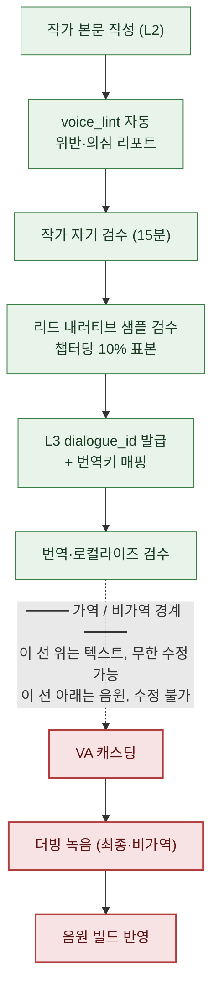

# 5.4 대사·보이스 일관성

녹음 부스. 디렉터가 헤드폰을 끼고 손을 들어 큐를 준다. 성우가 학자 NPC의 대사를 읽는다. "와, 진짜 대박이네요." 디렉터의 손이 멈춘다. 이 캐릭터는 5챕터 내내 "와"라는 감탄사를 한 번도 쓴 적이 없는 사람이다. 욕설도, 현대 감탄사도 입에 담지 않는, 끝까지 말끝을 흐리는 학자다. 그런데 대본에는 그 줄이 그대로 실려 있다.

여기서 두 가지 비용이 동시에 발생한다. 첫째, 그 줄을 고치면 성우는 다시 읽어야 한다. 출연료와 스튜디오 시간은 이미 시계가 돌고 있다. 둘째, 더 무서운 건 디렉터가 그 줄을 못 잡고 넘어가는 경우다. 녹음이 끝나고 음원이 빌드에 들어가면, 그 학자는 게임 안에서 영영 그렇게 말한다. 녹음한 음원은 텍스트처럼 한 줄 수정으로 되돌릴 수 없다. 같은 성우의 같은 컨디션, 같은 부스를 다시 잡아야 한다.

이 챕터는 그 부스 앞 점선을 다룬다. 점선 위는 텍스트라서 무한히 고칠 수 있고, 점선 아래는 음원이라서 못 고친다. 모든 대사 검수는 점선 위에서 끝나야 한다. 그러려면 캐릭터마다 "이 사람은 이렇게 말한다"가 머릿속이 아니라 파일로 기록되어 있어야 하고, 신규 대사가 올라올 때마다 그 파일과 자동으로 대조돼야 한다. 그 파일을 `voice_profile`이라 부르고, 대조 도구를 `voice_lint`라 부른다.

---

## 5.4.1 보이스가 흔들리는 자리

내러티브 일관성 사고 중 가장 자주 터지는 게 캐릭터 보이스 흔들림이다. 출시 후에야 "이 NPC가 왜 갑자기 말투가 바뀌었냐"는 제보가 들어온다. 원인은 매번 거의 같다.

작가가 교체되면 같은 NPC가 다른 사람이 된다. 작가가 안 바뀌어도 6개월 지나면 본인이 자기 톤을 잊는다. 신규 대사를 쓸 때 그 캐릭터의 이전 대사를 안 펼쳐 보면 컨텍스트가 끊긴다. 보이스 규칙이 작가 머릿속에만 있고 문서로 없으면 다음 사람에게 전달이 안 된다. 그리고 최근 2년 사이 가장 빠르게 늘어난 다섯 번째 원인 — LLM에 캐릭터 정보 없이 "이 NPC 대사 만들어줘"라고 던지면, AI는 평균적이고 무난한, 그래서 누구의 목소리도 아닌 대사를 돌려준다.

다섯 번째가 AI 도입의 부작용이다. 앞 챕터(5.3)의 컨텍스트 주입이 처방이지만, 주입할 컨텍스트 자체가 부실하면 주입할 게 없다. 그 컨텍스트가 바로 `voice_profile`이다. 이 챕터는 그 파일을 만들고, 자동으로 검사하고, 녹음 부스 앞에서 종결시키는 한 사이클을 본다.

---

## 5.4.2 voice_profile — 다섯 항목으로 고정된 목소리

프로젝트 A에서 모든 NPC는 다섯 항목으로 `voice_profile`을 갖는다. 어휘 영역(자주 쓰는 단어군 / 절대 안 쓰는 단어군), 문장 길이(평균·최대 글자수), 존칭 체계(1·2인칭, 존댓말 비율, 호칭), 감정 표현(직접·간접·억제 중 어느 방식), 금기 표현(절대 안 쓰는 단어·구문). 다섯 항목 전부에 구체 예시가 붙어야 한다. "진중한 학자" 같은 추상 묘사만 있으면 사람마다 다르게 읽는다. 다음 작가는 그 학자를 자기 식으로 상상한다.

학자 NPC `K_007`의 실제 프로필 형식은 이렇다. 이 파일이 곧 `voice_lint`의 입력이 된다.

```markdown
---
title: K_007 학자 voice_profile
layer: L1
character_id: K_007
atoms:
  - voice_profile_k_007
related:
  derives_from: [character_bible/k_007.md]
  affects: [dialogue_id_table (K_007의 모든 대사)]
---

## 1. 어휘 영역
- 자주: "기록", "근거", "정황", "추정", "데이터", "사례"
- 절대 안 씀: "느낌", "감", "운명", "신의 뜻", "마음의 소리"

## 2. 문장 길이
- 평균: 18자
- 최대: 35자 (그 이상은 두 문장으로 쪼갬)
- 짧은 끊김 자주: "...아닙니다." "기록부터."

## 3. 존칭 체계
- 1인칭: "저"
- 2인칭: 직책 우선(대장님, 사령관님). 친밀해진 후에만 이름.
- 존댓말 100% (회상 장면 제외)
- 감탄사 거의 없음. 있을 때는 "...아."

## 4. 감정 표현
- 직접 표현 거의 없음 (분노·기쁨)
- 침묵·말끝 흐림으로 표현 ("...그런 식이라면.")
- 슬픔: 화제 전환으로 회피 ("...다른 얘기 합시다.")

## 5. 금기 표현
- 욕설 일체
- 현대 감탄사 "와", "헐", "대박"
- 3음절 이상 한자어를 한 문장에 2개 이상
- "운명", "예언" 등 신비주의 어휘
```

이 형식의 핵심은 추상의 자리마다 예시 줄이 붙어 있다는 점이다. "감정을 억제한다"가 아니라 `"...그런 식이라면."`이라는 실제 대사가 붙는다. 그래야 다음 작가도, 번역가도, `voice_lint`도 같은 기준을 본다.
다섯 항목을 번역·현지화의 눈으로 다시 보면 두 부류로 갈린다. **언어 종속** 속성(어휘 영역·문장 길이·존칭 체계의 표면 형태)은 번역하는 언어마다 다시 정해야 하고, **언어 독립** 속성(감정을 억제하느냐 직접 표현하느냐, 무엇을 끝까지 안 말하느냐 같은 태도)은 어느 언어로 옮겨도 그대로 지켜져야 한다. 현지화 작업을 줄 때 이 구분을 함께 넘기면, 번역가가 표면 어휘만 바꾸다 캐릭터의 태도까지 흔드는 일을 막을 수 있다.

---

## 5.4.3 워크드 트랜스크립트: 본문에서 profile을 길어 올리다

처음부터 50명 NPC × 5항목 = 250건을 백지에서 작성하면 추상으로 흐른다. 본문 한 줄도 없이 "이 캐릭터는 차가운 학자"라고 적으면, 그 차가움이 무엇인지 아무도 모른다. 그래서 순서를 뒤집는다. 메인 NPC 5\~7명만 처음부터 풀로 작성하고, 나머지는 본문 대사가 20\~30줄 쌓인 뒤에 그 대사에서 profile을 역추출한다.

아래는 `K_007`의 대사가 25줄 쌓인 뒤, profile 초안을 뽑은 실제 워크드 트랜스크립트다. 요약하지 않고, AI가 틀린 자리까지 그대로 둔다.

**[작가가 던진 프롬프트 전문]**

```
다음은 캐릭터 K_007의 대사 25줄입니다.

1. "기록부터 봅시다."
2. "...정황이 맞지 않습니다."
3. "추정일 뿐입니다. 근거가 없어요."
4. "그 사례는 저도 알고 있습니다."
5. "...아닙니다. 데이터가 다릅니다."
   (... 6~23번 중략 없이 전체 인용 ...)
24. "...그런 식이라면, 저는 빠지겠습니다."
25. "다른 얘기 합시다."

여기서 자주 쓰는 어휘(실제 나온 것만), 평균 문장 길이, 존칭·호칭 패턴,
감정 표현 방식, 한 번도 안 쓴 표현 영역, 이렇게 다섯 가지 뽑아줘.
항목마다 근거 대사 2~3줄을 번호로 인용하고, "진중한"·"차가운" 같은
주관적 인상은 쓰지 마.
```

**[Claude의 날것 출력 — 다듬지 않음]**

```
1. 자주 쓰는 어휘
   - "기록" (1번), "정황" (2번), "추정/근거" (3번),
     "사례" (4번), "데이터" (5번)
   → 사실·증거 계열 명사에 집중.

2. 평균 문장 길이
   - 25줄 평균 약 14.6자. 최장 21자(24번).
   → 짧은 단문 위주.

3. 존칭·호칭
   - 1인칭 "저"(3·24번). 종결어미 "-습니다/-요" 존댓말.
   - 2인칭 호칭은 이 25줄에 등장하지 않음.
     → 호칭 패턴은 이 표본만으로 단정 불가. (작가 확인 필요)

4. 감정 표현
   - 직접 감정어 없음. 거부를 "빠지겠습니다"(24)로,
     슬픔/회피를 화제 전환 "다른 얘기 합시다"(25)로 처리.
   → 억제·간접형.

5. 한 번도 안 쓴 영역
   - 감탄사, 욕설, 신비주의 어휘 모두 미출현.
   ※ 단, "미출현"이 "금기"라는 보장은 아님.
      표본이 25줄로 적어, 우연한 미출현일 수 있음.
```

여기서 두 가지를 짚어야 한다. 첫째, AI가 3번 항목에서 멈췄다. "이 표본만으로 단정 불가"라고 스스로 한계를 그었다. 호칭은 25줄에 안 나왔으니 추정하지 않은 것이다 — 이게 정직한 출력이다. 만약 AI가 "2인칭은 '대장님'으로 추정"이라고 채웠다면 그건 환각이고, profile에 들어가면 오염이다. 둘째, 5번 항목에서 AI가 스스로 면책을 달았다. "미출현 ≠ 금기"는 핵심 경고다. 감탄사가 25줄에 안 나온 건 우연일 수도 있다.

**[작가의 검증·거부]**

작가는 1·2·4번을 채택했다. 3번 호칭은 character_bible을 펼쳐 "대장님 우선, 친밀 후 이름"을 수동으로 채웠다 — AI가 비운 자리를 사람이 메운다. 5번은 AI 경고대로 "미출현"을 곧장 "금기"로 승격하지 않았다. 대신 작가가 캐릭터 설정에 비춰 "현대 감탄사·욕설·신비주의"만 금기로 확정하고, 나머지 미출현 어휘는 보류 처리했다.

**[작가의 재요청]**

```
"운명", "예언"은 금기로 확정할게. 의미 겹치는 신비주의 어휘 10개 더 뽑아줘.
근데 K_007이 학자로서 반증·비판 맥락에선 인용할 수도 있으니, 그 예외 케이스도
한 줄로 같이 표시해줘.
```

이 마지막 재요청이 중요하다. 금기를 기계적으로 넓히면 "학자가 미신을 비판하며 '운명 따위'라고 말하는" 정당한 대사까지 막힌다. 그래서 금기에 예외 맥락을 함께 정의시킨다. AI가 후보를 넓히고, 작가가 경계를 그린다. 이 한 바퀴를 돌고 나서야 `voice_profile_k_007`이 확정돼 L1에 고정된다.

근거 인용을 강제하고("번호로 인용"), 주관 형용사를 금지하면("진중한 금지") AI 환각이 줄고 작가가 검증할 표면이 생긴다. profile은 AI가 쓰는 게 아니라, AI가 초안을 깔고 작가가 고정하는 것이다.

---

## 5.4.4 voice_lint — 신규 대사마다 자동으로 대조

`voice_profile`이 파일로 있으면, 새 대사가 올라올 때마다 자동 대조가 가능하다. 다섯 검사 중 실전에서 효과가 큰 건 금기 어휘 매칭(어휘가 금기 목록에 걸리나)과 어휘 영역 위반(절대 안 쓰는 단어군에 들어가나) 두 가지다. 문장 길이 이탈·존칭 누락·자주 쓰는 어휘 비율은 잘못된 양성(false positive)이 많아 보조로만 쓴다. 회상 장면 한 줄이 평균 길이를 흔드는 것까지 다 잡으면 작가가 경고에 무뎌진다.

`voice_lint`는 챕터 신규 대사 묶음을 받아 이런 리포트를 낸다.

```
voice_lint 결과 (ch04 신규 대사 32줄, profile=voice_profile_k_007)
─────────────────────────────────────────────
[위반] dialogue_id_412 — K_007
  내용: "와, 진짜 대박이네요!"
  사유: 금기 어휘 "와", "대박" (profile §5)
  → 작가 검토 필요

[의심] dialogue_id_421 — K_007
  내용: "그 운명은 받아들이기 어렵습니다."
  사유: 금기 어휘 영역 "운명" (profile §5)
        단, '반증·비판 맥락' 예외 가능 — 작가 판정
  → 작가 검토 필요

[정상] 30개 대사
─────────────────────────────────────────────
요약: 위반 1 / 의심 1 / 정상 30
```

위반은 빨강, 의심은 노랑이다. 둘 다 작가 판정을 거쳐야 통과한다. 여기에 절대 원칙이 하나 있다 — `voice_lint`는 자동으로 거부하지 않는다(5.2 원칙의 연장). 위 `dialogue_id_421`을 보자. "운명"은 금기지만, 학자가 미신을 반박하는 맥락이면 정당한 인용일 수 있다. 그 판단은 도구가 못 한다. 자동 거부형 lint는 이 미묘한 자리를 다 막아버리고, 작가에게서 톤을 다듬을 기회까지 빼앗는다. lint는 의심 지점을 표시하는 손전등이지, 문을 잠그는 자물쇠가 아니다.

---

## 5.4.5 검수 게이트 — 가역과 비가역 사이의 점선

이 챕터의 척추는 이 한 장의 도식이다. 대사 한 줄이 작가의 손에서 출발해 성우의 입까지 가는 동안, 검수 게이트가 단계마다 깔린다. 그리고 그 흐름 한가운데에 굵은 점선이 있다.



초록은 가역 단계, 빨강은 비가역 단계다. 점선 위(초록)는 전부 텍스트다. 대사 한 줄이 마음에 안 들면 키보드로 고치면 된다. 비용은 작가의 몇 분이다. 점선 아래(빨강)는 음원이다. 성우가 부스에서 그 줄을 읽고 음원이 빌드에 들어간 순간, 그 대사는 자산으로 고정된다. 고치려면 같은 성우의 같은 컨디션, 같은 스튜디오를 다시 잡아야 하고, 출연료·스튜디오·디렉터 시간이 처음과 똑같이 또 든다. 빠듯한 일정이면 같은 성우의 추가 세션 자체가 안 잡히기도 한다.

그래서 단 하나의 규칙이 모든 워크플로를 지배한다 — **모든 검수 게이트는 점선 위에서 끝난다.** 녹음은 검수 단계가 아니다. 검수가 다 끝난 결과를 자산으로 고정하는 단계다. 점선 아래에서 "이 대사 이상한데"라는 의문이 생기면, 그건 더 검수할 자리가 아니라 윗단계 검수가 누락됐다는 신호다. 손전등은 점선 위에서 다 비춰야 한다. 부스는 캄캄해도 되는 곳이 아니라, 캄캄하면 안 되는 곳이다.

도식 한가운데 리드 샘플 검수가 "챕터당 10% 표본"으로 잡혀 있다. 이 비율은 검수 시간과 정확도의 균형점이다(저자 운영치, 미검증 추정). 5% 밑으로 내리면 사고가 새고, 20% 위로 올리면 리드 한 사람이 병목이 된다. lint가 위반·의심을 미리 걸러주기 때문에 표본은 lint 통과분 중에서 뽑는다 — 사람의 눈은 도구가 못 잡는 맥락 오류(예: 정당해 보이는 "운명" 인용이 사실은 캐릭터 붕괴)에 집중한다.

---

## 5.4.6 캐릭터는 변한다 — profile의 버전 관리

캐릭터가 끝까지 똑같이 말하면 plot이 정체된다. 동료의 죽음을 겪은 학자가 그 전과 똑같은 톤으로 말하면 오히려 가짜다. 변화가 의도된 것이면 `voice_profile`도 같이 버전을 올린다.

```markdown
---
character_id: K_007
voice_profile_versions:
  - v1: ch01~ch05 (초기 — 감정 억제, 단문 학자)
  - v2: ch06~ch10 (동료 죽음 후 — 감정 표현 빈도 증가)
  - v3: ch11~ (각성 후 — 직접 화법 등장)
---
```

버전마다 profile 파일이 따로 있고, `voice_lint`는 검사 대상 대사의 챕터 번호를 보고 어느 버전을 적용할지 고른다. ch07 대사에 v1의 "감정 억제" 규칙을 들이대면 멀쩡한 변화 대사가 죄다 의심으로 뜬다. 변화는 버그가 아니라 설계다.

버전을 올리는 신호는 세 가지다. 작가가 의도적으로 톤을 흔들면 신규 버전을 발의하고 리드와 합의한다. `voice_lint`의 의심 건수가 한 캐릭터에서 점점 늘면, 그건 작가가 무의식적으로 톤을 옮기고 있다는 — 버전 갱신 시점이 왔다는 신호다. character_bible에 변화 이벤트(죽음·각성·배신)가 추가되면 profile 갱신 alert이 뜬다. 다만 한 캐릭터가 챕터마다 변하면 일관성이 무너지므로, 현실적인 버전 수는 캐릭터당 2\~4개다.

> **[방향 표지 — 보이스 공간으로 캐릭터 사이를 본다면 (아직은 시기상조)]** `voice_lint`가 규칙으로 '한 캐릭터 안'의 일관성을 지킨다면, 캐릭터별 실제 대사 묶음(한 캐릭터가 말한 대사 전체)을 한 점으로 임베딩한 '보이스 공간'은 '캐릭터 사이'가 충분히 벌어져 있는지를 본다 — 점들이 서로 뭉쳐 가면 그게 §5.3.1·§5.4.1이 지목한 보이스 평준화·수렴의 직접 측정값이 된다. 단 거리 임계를 절대수치로 고정하지 말고 '뭉치고 있다'는 방향 표지로만 읽을 일이며, `voice_lint`를 대체하는 판정 게이트가 아니다(이 발상은 §8.2.7의 차원 벡터 압축과 같은 자리이고, 개념 직관은 부록 M에 지도 한 장으로 풀어 두었다 — 처방이 아니라 방향 표지다).

---

## 5.4.7 다국어·VA로 늘어나는 일관성 단위

대사가 다국어로 번역되고 성우 보이스가 입혀지면 관리 단위가 곱절로 늘어난다. 한국어 한 줄이 영어·동남아 언어로 갈라지고, 그 각각에 톤이 실린다.

번역 일관성에서 가장 자주 새는 자리는, 같은 표현이 챕터마다 다르게 번역되는 것이다(번역 메모리 일관성 검사로 잡는다). 캐릭터 `voice_profile`이 번역에 반영 안 되는 것(캐릭터별 번역 가이드를 따로 붙인다), 신규 어휘가 용어집에 미등록인 것(용어집 lint)이 뒤따른다. 번역 가이드는 `voice_profile`에서 자동 생성한다 — "이 캐릭터는 격식체 100%, 감탄사 없음, 신비주의 어휘 금기"를 번역 지시서 머리에 자동으로 붙인다. 번역가가 그 학자를 영어로 옮길 때 같은 경계를 본다.

VA(Voice Actor, 성우) 검수는 점선 아래에 닿기 직전, 마지막 텍스트 가역 단계의 검수다. 톤 일관성(분노·슬픔 표현 강도)은 디렉터와 내러티브가, 발음 정확성(고유명사)은 용어집 담당이, 호흡·끊김(profile의 "짧은 끊김 자주" 같은 지시)은 디렉터가 본다. 검수 결과는 `voice_review_log.md`(L4)에 통과·반려로 기록하고, 다음 캐릭터 캐스팅 때 참조한다.

반려는 가능한 한 캐스팅·녹음 직전에 끝낸다. 부스 안에서 발견되는 대본 오류는 그날 세션을 통째로 무너뜨리고 다음 세션 일정까지 흔든다. 그렇다고 녹음을 미루면서 검수를 끄는 게 답은 아니다. 검수가 부스 직전에서 자주 막힌다면, 그건 윗단계(작가·리드) 워크플로가 늦은 것이지 녹음 일정의 문제가 아니다.

---

## 5.4.8 6개월 측정과 비용

프로젝트 A에서 `voice_profile` + `voice_lint` 도입 전후를 6개월 추적했다. 절대 건수는 저자 추정(미검증), 방향·비율만 신뢰하면 된다.

| 항목 | 도입 전 | 도입 후 | 방향 |
|---|---|---|---|
| 챕터당 보이스 사고 (출시 후) | 5\~8건 | 1\~2건 | 약 1/4 |
| 신규 NPC 보이스 정착 | 챕터 3개 | 챕터 1개 | 1/3 |
| 작가 1인 관리 NPC 수 | 약 15명 | 약 40명 | 약 2.5배 |
| 번역 일관성 사고 (챕터당) | 10\~15건 | 2\~4건 | 약 1/4 |
| 보이스 검수 시간 (챕터당) | 3일 | 1일 | 1/3 |

가장 의미 있는 줄은 작가 1인 관리 NPC 수다. 약 2.5배라는 건 작가를 줄였다는 뜻이 아니라, 같은 작가가 챕터당 NPC 다양성을 늘릴 수 있다는 뜻이다. 세계가 더 붐빈다.

비용 구조를 보면 도입 비용보다 운영 비용이 훨씬 작다. `voice_profile` 작성은 메인 7명에 작가 2주, `voice_lint` 도구는 개발 1\~2주에 유지보수 월 1일. 운영 쪽은 챕터당 작가 자기 검수 15분, 리드 샘플 검수 약 2시간(10% 표본), 변화 챕터의 profile 갱신이 캐릭터당 1\~2일이다. 운영 비용이 작아야 시스템이 살아남는다. 운영이 무거운 도구는 한 분기 안에 조용히 폐기된다.

---

## 5.4.9 흔한 실패

| 패턴 | 처방 |
|---|---|
| profile에 추상 묘사만("진중한") | 5항목마다 실제 대사 예시 강제 |
| 처음부터 50명 풀 작성 노림 | 메인 7명 풀 + 나머지는 본문 누적 역추출 |
| voice_lint 자동 거부형 | 위반·의심 + 작가 판정. 거부는 사람만 |
| 금기를 기계적으로 넓힘 | 금기에 예외 맥락("반증 인용 가능") 병기 |
| 캐릭터 변화 시 profile 미갱신 | 버전 관리(v1·v2·v3), 챕터 번호로 적용 |
| 번역에 profile 미전달 | profile에서 번역 가이드 자동 생성 |
| 녹음 후 대사 수정 시도 | 녹음은 비가역. 검수는 점선 위에서 종결 |
| 녹음 일정에 검수 압축 | 윗단계 워크플로 개선으로 푼다 |
| profile을 머릿속에만 보관 | 무조건 파일화. 머릿속은 작가 교체 시 소실 |

---

## 따라하기 — voice_lint 한 사이클

신규 챕터 대사가 올라왔을 때, profile 한 개로 한 바퀴 돌리는 최소 절차입니다.

**setup**
1. 대상 캐릭터의 `voice_profile_<id>.md`를 여세요. 없으면 본문 대사 20\~30줄을 모읍니다.
2. 신규 대사를 `id / 캐릭터 / 내용` 형식의 평문 묶음으로 준비합니다.

**prompt**

```
K_007의 voice_profile §5(금기 표현)이야.
[금기 목록 붙여넣기]

ch04 신규 대사 32줄.
[id / 내용 형식으로 붙여넣기]

각 대사를 [위반](금기 어휘 직접 포함) / [의심](금기 영역에 닿지만 예외 맥락 가능)
/ [정상]으로 분류해줘. [위반]·[의심]은 id·내용·사유를 표로. 판정은 내가 하니까
자동으로 거부하진 마.
```

**verify**
1. [위반]을 먼저 보세요. 명백하면 텍스트를 고칩니다(점선 위라 무료).
2. [의심]은 맥락으로 판정합니다. 정당한 인용이면 통과, 아니면 수정합니다.
3. 통과분에서 10%를 표본으로 리드에게 보내 맥락 오류를 한 번 더 거릅니다.
4. 모든 판정이 끝난 뒤에만 dialogue_id를 발급하고 녹음 큐로 넘기세요. 부스 앞에서는 더 이상 검사하지 않습니다.

**1인 축소판** — 도구를 못 만드는 1인 개발자라면, `voice_profile`을 캐릭터당 §5(금기 표현) 한 항목만 적으세요. 신규 대사를 쓸 때마다 그 금기 목록을 프롬프트 머리에 붙여 AI에게 "이 목록에 걸리는 줄만 표시해줘"라고 시킵니다. 도구 없이 프롬프트 한 줄로 lint의 80%를 얻습니다. 녹음(또는 TTS)에 넘기기 전, 이 한 번만 통과시키면 부스 앞 점선은 지켜집니다.

---

### 이 챕터의 핵심 메시지
- 보이스 흔들림의 다섯 원인 중 AI 평준화가 가장 빠르게 늘었고, 처방은 부실한 컨텍스트가 아니라 예시가 실린 voice_profile이다.
- voice_lint는 위반·의심을 표시할 뿐 거부는 사람이 하며, 금기에는 예외 맥락을 함께 정의한다.
- 모든 검수는 녹음 부스 앞 점선 위에서 끝낸다 — 점선 아래 음원은 텍스트처럼 되돌릴 수 없다.

### 다음 챕터 미리보기
- 6.1. 절차적 콘텐츠 생성과 AI — 어디서 만나는가
