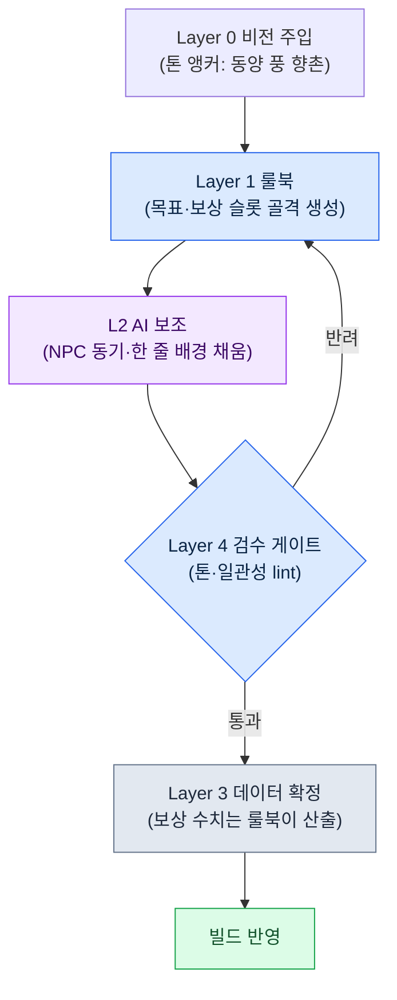

# 6.1 절차적 콘텐츠 생성과 AI — 두 축이 교차하는 한 칸

월요일 아침 기획 회의. 화이트보드에 한 줄이 적혀 있다. "출시까지 사이드 퀘스트 1,000개." 누군가 계산기를 두드린다. 작가 한 명이 하나에 하루를 쓰면 4년. 다섯 명이 붙어도 1년에 가깝다. 방 안의 공기가 무거워진다. 24년째 이 방에 앉아 온 나는 그 숫자 앞에서 사람들이 늘 같은 두 갈래로 갈라진다는 걸 안다. 한쪽은 "분량을 줄이자"고 하고, 다른 쪽은 "도구로 찍어내자"고 한다. 그리고 거의 항상 결정은 둘 다였다.

절차적 콘텐츠 생성(Procedural Content Generation, 이하 PCG)은 그 "도구로 찍어내자" 쪽의 오래된 답이다. 던전 룸 배치, 무기 옵션 조합, 적 스폰 풀은 20년 전부터 룰북과 확률표로 자동화돼 왔다. 새로운 건 PCG 자체가 아니라, 자연어·이미지·서사가 들어가는 자리에 LLM과 생성 모델이 올라왔다는 점이다.

그런데 이 책에서 말하려는 건 "AI를 PCG에 붙이세요"가 아니다. 그건 누구나 한다. 문제는 *어디에* 붙이느냐다. 콘텐츠 한 덩어리를 놓고, 그게 자동화의 어느 강도와 구조의 어느 층에서 만나는지를 한 칸으로 못 박지 않으면, 도구는 있는데 자리가 없는 상태가 된다. 이 챕터는 그 한 칸을 좌표로 그리는 법, 그리고 그 칸 위에서 콘텐츠 하나가 실제로 파이프라인을 한 바퀴 도는 모습을 본다.

---

## 6.1.1 PCG가 멈춰 있던 자리

전통 PCG는 결정론에 강하다. 같은 입력에 같은 출력이 나오고, 검증이 가능하다. 던전 룸 그래프, 무기 옵션 prefix·suffix, 적 스폰 분포는 그래서 일찍 자리 잡았다. "불꽃의 검 +5"는 20년 전에도 자동으로 나왔다.

문제는 항상 그 다음 자리였다. 룸은 배치됐는데 룸 안 NPC의 이름·외형·짧은 배경은 작가 손에 남았다. "불꽃의 검 +5"는 나오지만 "왕이 잃어버린 마지막 검"이라는 한 줄은 안 나왔다. 퀘스트 generator가 목표와 보상의 조합을 뽑아 줘도 "왜 이 퀘스트를 하는가"는 사람이 적었다.

규모가 큰 게임에서는 이 자리가 늘 병목이었다. 양산 가능한 영역과 사람 손이 필요한 영역의 비율은 대략 4 대 6이었고, 그 사람 손 6쪽이 일정의 대부분을 먹었다. 양산 라인이 4쪽을 빠르게 만들어도 6쪽이 따라오지 못하면 사이클 전체가 그 속도로 묶인다.

LLM과 이미지 모델이 들어오는 자리가 정확히 거기다. 룰북이 못 다루던 자연어·서사·시각 영역까지 양산 가능 범위가 넓어진다. 그렇다고 그 자리를 통째로 AI에 넘기는 게 답은 아니다. AI는 매번 약간 다른 답을 내고, 컨텍스트가 비면 일반 RPG 평균을 토해낸다. 그래서 *결합 지점*의 설계가 필요하다. 결합 지점은 두 개의 좌표축으로 정의된다.

---

## 6.1.2 첫 번째 축: 자동화 강도 (L0\~L3)

세로축은 사람과 룰북과 AI를 *어떤 비율로 섞느냐*다. 저자가 일하는 어느 MMORPG 개발사(이하 '프로젝트 A')에서는 네 단계로 끊어 쓴다.

**L0 — 완전 수작업.** 모든 글자·결정이 사람 손에서 나온다. 메인 퀘스트 본문, 시그니처 캐릭터 대사, 분기 결말. 일관성과 서사 깊이가 게임 정체성에 직결되는 자리.

**L1 — 룰북 자동화.** 전통 PCG의 자리. 룰북·확률표·BSP 같은 결정론 알고리즘이 출력을 만들고 사람은 검수만 한다. 던전 룸 배치, 무기 옵션 조합, 적 스폰이 대표.

**L2 — 룰북 + AI 보조.** 룰북이 골격을 잡고 AI가 디테일을 채운다. 사이드 퀘스트 시놉시스, 일반 NPC 이름·짧은 배경, 사냥터 소개문. 사람은 입력 메타데이터와 마지막 검수 게이트만 책임진다.

**L3 — AI 우선 + 사람 검수.** AI가 본문을 만들고 사람은 검수에만 들어간다. 매력적이지만 비결정성·환각·일관성 손상 위험이 모두 여기 모인다.

핵심은 L2다. L1의 안정성과 L3의 양산력을 합치고, 두 영역의 단점은 검증 게이트로 막는다. L3는 빨리 도입하고 싶은 유혹이 크지만, 검수 부담이 폭증해 한두 분기 안에 폐기되는 사례를 여러 번 봤다. 100개 중 70개가 의심 항목으로 올라오면, 사람이 처음부터 100개 쓰는 것보다 비싸다.

---

## 6.1.3 두 번째 축: Layer 구조 (L0\~L4)

세로축만 들고는 양산 라인이 굴러가지 않는다. 콘텐츠 *자체*가 층으로 분해돼 있어야 자동화가 들어올 자리가 생긴다. 이게 5부에서 다룬 Layer 분해이고, 콘텐츠 분야에서의 가로축이다. 다섯 계층이 각각 절차적 생성의 한 역할(앵커·룰북·본문·수치·게이트)에 대응한다는 일반 설명은 §2.3.6에서 다뤘고, 여기서는 콘텐츠 양산 라인에 그대로 대입한다. Layer 0 비전은 톤·세계관 앵커(매 생성마다 주입), Layer 1 시스템은 생성 룰북(규칙·확률표·태그 체계), Layer 2 콘텐츠는 생성 결과가 쌓이는 본문 자리(사이드 퀘스트·NPC 배경·도시 소개문), Layer 3 데이터는 수치·ID·관계(보상·스폰·곡선), Layer 4 빌드·QA는 검증 게이트(lint·일관성 검사·작가 검수)다.

이 두 축은 다른 이야기다. 세로축은 "사람이 얼마나 손대나", 가로축은 "콘텐츠의 어느 부위인가"를 말한다. 그런데 둘은 곱셈으로만 의미가 산다. 콘텐츠 하나를 두 축의 교차점, 즉 *한 칸*에 못 박을 때 비로소 "이건 누가, 어디를, 어떻게 만드는가"가 정해진다.

---

## 6.1.4 두 축을 한 장으로 — 자동화 × Layer 매트릭스

여태 글로 풀어 온 두 축을 한 장의 격자로 겹쳐 본다. 가로는 콘텐츠의 Layer, 세로는 자동화 강도. 각 칸에 들어간 라벨은 프로젝트 A에서 실제 그 칸을 차지하는 콘텐츠다. 색이 진한 칸일수록 양산 라인의 무게중심에 가깝다.

<svg viewBox="0 0 760 440" xmlns="http://www.w3.org/2000/svg" font-family="sans-serif" font-size="12">
  <rect x="0" y="0" width="760" height="440" fill="#ffffff"/>
  <!-- 축 제목 -->
  <text x="380" y="22" text-anchor="middle" font-size="14" font-weight="bold">자동화 강도(세로) × Layer 구조(가로)</text>
  <text x="380" y="416" text-anchor="middle" font-weight="bold">→ Layer 구조 (콘텐츠의 어느 부위인가)</text>
  <text x="18" y="220" text-anchor="middle" font-weight="bold" transform="rotate(-90 18 220)">↑ 자동화 강도 (사람이 얼마나 손대나)</text>
  <!-- 열 헤더 -->
  <g text-anchor="middle" font-size="11" font-weight="bold">
    <text x="190" y="52">L0 비전</text>
    <text x="310" y="52">L1 시스템(룰북)</text>
    <text x="430" y="52">L2 콘텐츠(본문)</text>
    <text x="550" y="52">L3 데이터</text>
    <text x="670" y="52">L4 빌드·QA</text>
  </g>
  <!-- 행 헤더 -->
  <g text-anchor="end" font-size="11" font-weight="bold">
    <text x="124" y="92">L0 수작업</text>
    <text x="124" y="172">L1 룰북</text>
    <text x="124" y="252">L2 룰북+AI</text>
    <text x="124" y="332">L3 AI우선</text>
  </g>
  <!-- 격자 칸: x=130..730 (5열,120폭) y=60..380 (4행,80높이) -->
  <!-- 행 L0 수작업 -->
  <rect x="130" y="60" width="120" height="80" fill="#dfe7f3" stroke="#7a93c0"/>
  <text x="190" y="104" text-anchor="middle" font-size="10">톤 한 줄 직접 작성</text>
  <rect x="250" y="60" width="120" height="80" fill="#f4f6fa" stroke="#c8c8c8"/>
  <rect x="370" y="60" width="120" height="80" fill="#eef1f6" stroke="#c8c8c8"/>
  <text x="430" y="98" text-anchor="middle" font-size="10">메인 퀘스트</text>
  <text x="430" y="112" text-anchor="middle" font-size="10">시그니처 대사</text>
  <rect x="490" y="60" width="120" height="80" fill="#f4f6fa" stroke="#c8c8c8"/>
  <rect x="610" y="60" width="120" height="80" fill="#f4f6fa" stroke="#c8c8c8"/>
  <!-- 행 L1 룰북 -->
  <rect x="130" y="140" width="120" height="80" fill="#f4f6fa" stroke="#c8c8c8"/>
  <rect x="250" y="140" width="120" height="80" fill="#b9cae6" stroke="#5b78ad"/>
  <text x="310" y="178" text-anchor="middle" font-size="10">던전 룸 배치</text>
  <text x="310" y="192" text-anchor="middle" font-size="10">옵션·스폰 확률표</text>
  <rect x="370" y="140" width="120" height="80" fill="#f4f6fa" stroke="#c8c8c8"/>
  <rect x="490" y="140" width="120" height="80" fill="#eef1f6" stroke="#c8c8c8"/>
  <text x="550" y="184" text-anchor="middle" font-size="10">보상 곡선 산출</text>
  <rect x="610" y="140" width="120" height="80" fill="#f4f6fa" stroke="#c8c8c8"/>
  <!-- 행 L2 룰북+AI (무게중심) -->
  <rect x="130" y="220" width="120" height="80" fill="#f4f6fa" stroke="#c8c8c8"/>
  <rect x="250" y="220" width="120" height="80" fill="#eef1f6" stroke="#c8c8c8"/>
  <text x="310" y="264" text-anchor="middle" font-size="10">생성 룰북 정의</text>
  <rect x="370" y="220" width="120" height="80" fill="#7fa0d4" stroke="#385583"/>
  <text x="430" y="258" text-anchor="middle" font-size="10" font-weight="bold" fill="#ffffff">사이드 퀘스트 골격</text>
  <text x="430" y="274" text-anchor="middle" font-size="10" fill="#ffffff">NPC 짧은 배경·소개문</text>
  <text x="430" y="289" text-anchor="middle" font-size="9" fill="#ffffff">★ 무게중심</text>
  <rect x="490" y="220" width="120" height="80" fill="#f4f6fa" stroke="#c8c8c8"/>
  <rect x="610" y="220" width="120" height="80" fill="#eef1f6" stroke="#c8c8c8"/>
  <text x="670" y="264" text-anchor="middle" font-size="10">lint·일관성 검사</text>
  <!-- 행 L3 AI우선 -->
  <rect x="130" y="300" width="120" height="80" fill="#f4f6fa" stroke="#c8c8c8"/>
  <rect x="250" y="300" width="120" height="80" fill="#f4f6fa" stroke="#c8c8c8"/>
  <rect x="370" y="300" width="120" height="80" fill="#e6ddec" stroke="#a98ec0"/>
  <text x="430" y="344" text-anchor="middle" font-size="10">패치 노트 초안</text>
  <rect x="490" y="300" width="120" height="80" fill="#f4f6fa" stroke="#c8c8c8"/>
  <rect x="610" y="300" width="120" height="80" fill="#eef1f6" stroke="#c8c8c8"/>
  <text x="670" y="344" text-anchor="middle" font-size="10">작가 검수 게이트</text>
</svg>

이 격자가 이 챕터의 핵심이다. 산문으로 흩어져 있던 "메인은 L0", "사이드는 L2", "보상은 룰북" 같은 판단이 *한 좌표*로 모인다. 회의에서 새 콘텐츠가 안건에 오르면 "이건 어느 칸인가" 한 질문이면 된다. 칸이 정해지면 그 칸의 세로 좌표가 누가 손대는지를, 가로 좌표가 어느 부위인지를 알려 준다.

격자를 읽다 보면 두 가지가 눈에 들어온다. 첫째, 무게중심(짙은 칸)은 L2 행 × Layer 2 열에 있다. 사이드 퀘스트 골격·NPC 배경이 그 자리다. 양산 라인의 심장이다. 둘째, 한 콘텐츠가 한 칸에만 있는 게 아니다. 사이드 퀘스트는 본문(Layer 2)이 L2 칸에 있지만, 그 보상 수치(Layer 3)는 L1 칸으로 내려간다. 같은 퀘스트라도 *부위마다 다른 칸*에 산다. 이게 두 축을 분리해 둔 이유다.

---

## 6.1.5 한 칸 위에서 도는 미니 파이프라인

무게중심 칸 — L2 행 × Layer 2 열, 사이드 퀘스트 골격 — 위에서 콘텐츠 하나가 실제로 한 바퀴 도는 모습을 본다. 흐름은 다음과 같다.



이 흐름을 워크드 트랜스크립트로 한 번 따라가 본다. 향촌 마을의 잡일 퀘스트 하나를 만든다고 하자.

**1단계 — Layer 1 룰북이 골격을 뽑는다.** 룰북은 결정론이다. 슬롯만 채워 나온다.

```
[퀘스트 골격 — 룰북 출력]
지역: 향촌_3
의뢰인 역할: 약초꾼
목표 타입: 수집(약재 x6)
방해 요소: 늑대 스폰(밤)
보상 슬롯: { gold: ?, exp: ?, item: 채집낫 }
```

**2단계 — AI에 디테일을 요청한다.** 프롬프트 전문은 이렇다. (Layer 0 비전을 컨텍스트로 먼저 입력한다.)

> 너는 동양 판타지 향촌을 무대로 한 MMORPG의 퀘스트 작가다. 톤 앵커: "소박하지만 미신과 두려움이 깔린 시골". 아래 골격을 받아, 의뢰인의 동기 한 줄과 NPC 이름, 그리고 플레이어에게 보이는 의뢰문 두 문장을 써라. 보상 수치는 절대 만들지 마라(시스템이 정한다). 출력은 JSON.
> 골격: { 지역: 향촌_3, 의뢰인: 약초꾼, 목표: 약재 6개 수집, 방해: 밤의 늑대, 보상아이템: 채집낫 }

**3단계 — Claude의 날것 출력.** (요약하지 않고 그대로 옮긴다.)

```json
{
  "npc_name": "삼월 어멈",
  "motive": "밤마다 늑대 울음에 약초밭이 망가져, 마지막 약재를 캐러 갈 엄두를 못 낸다.",
  "quest_text": "밤이 되면 늑대들이 약초밭을 헤집어 놓는다오. 무서워 발이 안 떨어지니, 산기슭의 약재 여섯 뿌리만 대신 캐다 주시구려.",
  "reward": { "gold": 120, "exp": 300 }
}
```

여기서 멈춰서 봐야 할 게 있다. AI는 `reward` 필드를 *시키지 않았는데도* 만들어 넣었다. 이게 1축과 2축이 왜 분리돼야 하는지를 그대로 보여 준다. 보상 수치(Layer 3)는 L1 룰북의 자리지, AI(L2)의 자리가 아니다. AI에 그걸 맡기면 호출마다 숫자가 흔들려 보상 곡선이 무너진다.

**4단계 — 사람 검증·거부.** 검수자는 두 가지를 한다. (1) `reward` 필드를 *삭제*한다 — 이건 룰북이 채울 칸이다. (2) 톤을 본다. "삼월 어멈", 동기 한 줄, 의뢰문 두 문장은 향촌 톤에 맞다. 통과. 만약 AI가 "마법사 길드의 의뢰"처럼 세계관 밖 단어를 넣었다면 여기서 반려하고 골격 단계로 되돌린다.

**5단계 — Layer 3 데이터 확정.** 삭제된 보상 슬롯을 룰북이 다시 채운다. 지역 레벨·목표 난이도에 묶인 결정론 공식이다. `gold: 85, exp: 240`. AI가 임의로 뱉었던 120·300이 아니라, 곡선에 맞는 값이 들어간다.

이 한 바퀴가 무게중심 칸의 표준 사이클이다. 룰북이 골격, AI가 살, 사람이 게이트, 룰북이 다시 수치. 콘텐츠 1,000개가 모두 이 사이클을 돈다. 칸이 정해져 있으니 매번 "이건 누가 만드나"를 다시 논쟁하지 않는다.

---

## 6.1.6 칸을 정할 때 던지는 다섯 질문

새 콘텐츠를 격자의 어느 칸에 둘지 결정하려면 다섯 질문이 도움이 된다. 회의에서 양산 안건이 오를 때마다 적어 두고 함께 답해 보면, 칸 배치의 일관성이 한 분기 안에 정착한다.

하나, 양산 부담이 얼마인가. 출시까지 N개가 필요한가. N이 100을 넘으면 L0 행은 거의 불가능하다.

둘, 일관성 요구가 얼마나 큰가. 콘텐츠 간 일관성이 체험의 핵심이면 검수 게이트(Layer 4)가 강해야 하고, 다양성이 핵심이면 더 위 행으로 갈 여지가 있다.

셋, 비결정성을 허용할 수 있는가. 매번 약간 다른 결과가 풍부함을 만드는 영역인지, 같은 결과가 신뢰의 핵심인 영역인지.

넷, 검수 비용은 얼마인가. 콘텐츠당 5분인지 30분인지가 운영 사이클의 길이를 정한다.

다섯, 사고가 났을 때의 비용은 얼마인가. 폐기·재작성이 자유로운지, 한 번 나가면 사용자 사고로 직결되는지.

사이드 퀘스트에 이 다섯을 던지면 답이 한 방향으로 모인다. 1,000개 이상(L0 불가), 일관성은 메인보다 낮음, 비결정 허용, 검수 5\~10분, 사고 비용 낮음(개별 폐기 가능). 다섯 답이 모이니 L2 행 × Layer 2 칸이 자연스럽다. 같은 다섯을 메인 퀘스트에 던지면 정반대로 모인다. 50개, 일관성·서사 깊이 최고, 비결정 불허, 검수 비용 큼, 사고 비용 매우 큼 — L0 칸이다.

---

## 6.1.7 흔한 함정 네 가지

격자를 그려 놔도 빠지는 함정은 비슷하다. 네 가지가 반복된다.

첫째, **L3 행부터 시작하는 경우.** "AI가 알아서 100개"라는 기대로 출발하면 검수가 폭증한다. L1 칸을 먼저 정착시키고, L2로 올라가고, L3는 일부에만 신중히. 위 미니 파이프라인에서 보상 필드를 사람이 지운 그 한 동작이, L3 행이 왜 위험한지를 작게 보여 준다.

둘째, **룰북 없이 통째로 AI에 위임하는 경우.** "사이드 퀘스트 100개 만들어 줘"는 일반 RPG 평균을 부른다. Layer 1 룰북이 골격을 먼저 잡고 AI는 그 위에서 살을 채워야 우리 게임의 콘텐츠가 나온다. 룰북 한 권을 쓰는 일은 PCG에서 가장 품이 들고 가장 재미없는 작업이지만, 이걸 건너뛰면 그 위의 모든 양산이 평균값으로 주저앉는다.

셋째, **검수 게이트(Layer 4)가 빈 경우.** AI 출력이 자동으로 빌드에 반영되면 일관성 사고가 직결된다. 어느 칸이든 사람 게이트는 필수다.

넷째, **비용만 보고 도구를 정하는 경우.** LLM API 비용은 분기마다 떨어지지만 일관성 사고 비용은 떨어지지 않는다. 도구 결정은 API 비용에 일관성·검수 시간의 합계를 더해서 본다.

---

## 6.1.8 측정 — 무게중심 칸으로 옮긴 6개월

프로젝트 A에서 사이드 퀘스트를 L0 칸에서 L2 칸으로 옮긴 뒤 6개월을 측정했다. 아래 수치 중 절대값은 저자 추정(미검증)이고, 변화의 방향과 비율이 실측에서 관찰된 부분이다.

| 항목 | L0 시기 | L2 전환 후 |
|---|---|---|
| 작가 1인당 퀘스트 1개 작성 | 약 4시간 | 약 50분 (메타 30분 + AI 5분 + 검수 8분) |
| 주당 양산 | 5개 | 30\~40개 |
| 폐기율 | 거의 0% | 약 20% |
| 일관성 사고 (분기당) | 3\~5건 | 5\~8건 (보강 후 정상) |
| 작가 만족도 (10점) | 8 | 6 → 7 (정책 보강 후) |

폐기율은 20%로 올라갔지만 양산 속도가 6\~8배라 순 처리량은 4\~5배 늘었다. 일관성 사고는 분기당 5\~8건으로 소폭 늘었으나, 검수 게이트와 룰북 보강으로 분기 안에 정상 범위로 돌아왔다.

가장 큰 변화는 숫자가 아니라 사람이었다. 처음엔 작가들이 "양산 검수자"가 된 기분이라며 만족도가 8에서 6으로 떨어졌다. 이걸 회복하려고 메인 퀘스트와 시그니처 사이드 퀘스트(도시당 1\~2개)에 작가 시간을 명시적으로 보장하는 정책을 끼웠다. 양산 라인이 작가 시간을 빨아들이는 게 아니라, 그 시간을 메인으로 돌려보내는 도구가 되도록 못 박은 것이다. 6개월 후 만족도는 7로 돌아왔다.

이 측정에서 가져갈 한 가지. 칸을 옮기는 결정은 처리량·작가 시간 분배·만족도가 같이 따라가야 한다. 처리량만 보면 양산은 성공이지만 사람은 떠난다.

---

## 6.1.9 Layer 분해가 먼저, PCG가 그 위에

Layer 분해가 절차적 생성의 전제라는 일반 논제는 §2.3.6에 있다. 여기서는 그것이 PCG 격자 위에서 어떻게 드러나는지만 본다. 가로축(Layer 0\~4)이 흐릿한 팀에서는 어떤 칸도 안정적으로 못 굴러간다. Layer 0 비전이 어디 있는지 모르면 generator마다 톤 앵커가 비어 일반 RPG 평균이 나오고, Layer 1 룰북과 Layer 2 본문이 한 파일에 섞이면 규칙 한 줄을 고칠 때 본문 수십 곳을 같이 만져야 하며, Layer 3 데이터가 본문에 입력되어 있으면 보상 곡선 한 번 조정에 작가가 1주를 쓴다 — 위 미니 파이프라인에서 보상을 별도 슬롯으로 떼어 둔 이유가 이거다.

그래서 PCG 도입 전에 점검할 건 도구 선택이 아니라 *가로축이 분해돼 있는가*다. 5층이 갖춰진 팀에서 L1 generator를 붙이는 비용은 작가 한 명의 한 분기다. 5층이 섞인 팀에서 같은 도입은 두 분기 안에 일관성 사고로 폐기된다.

처음부터 다섯 칸이 완벽할 필요는 없다. 분리는 점진적으로, 인터페이스는 좁게. 첫 분기에는 Layer 0 톤 한 줄과 Layer 1 룰북 한 권만 떼어 놔도 generator 들어올 자리가 열린다. 그렇다고 무한히 미뤄도 된다는 뜻은 아니다. Layer 2 본문과 Layer 3 데이터가 끝까지 한 덩어리면, 다음 장의 구체 도구도 자리를 못 잡는다.

---

## 6.1.10 다음 장 예고

다음 장에서는 이 격자의 무게중심 칸을 차지하는 구체 도구 하나를 해부한다. 도시별 사냥터를 양산하는 `proj_city_hunting_generator`다. 입력 메타데이터·룰북 골격·AI 본문·검증 게이트가 한 사이클로 어떻게 묶이는지, 이 챕터의 미니 파이프라인이 실제 도구 규모에서 어떻게 커지는지를 본다.

---

### 이 챕터의 핵심 메시지
- 자동화 강도(세로 L0\~L3)와 Layer 구조(가로 0\~4)는 곱셈으로만 의미가 산다.
- 양산 라인의 무게중심은 L2 행 × Layer 2 칸, 사이드 퀘스트 골격이다.
- 가로축 분해가 먼저고, PCG는 그 위 한 칸에서만 굴러간다.

---

## 따라하기 — 콘텐츠 하나를 한 칸에 올리기

**setup.** 양산 후보 콘텐츠 1종을 고르세요(예: 사이드 퀘스트). Layer 0 톤 한 줄과 Layer 1 룰북 골격(슬롯 정의)을 별도 파일로 떼어 둡니다. 보상 수치 슬롯은 룰북 쪽에 비워 둡니다.

**prompt.** 비전을 컨텍스트로 입력한 뒤 골격을 주고, "보상 수치는 만들지 마라, 출력은 JSON"을 명시하세요. 위 2단계 프롬프트를 그대로 변형해 쓰면 됩니다.

**verify.** 세 가지를 보세요. (1) AI가 보상 필드를 임의로 넣었으면 삭제합니다(L3은 룰북 자리). (2) 세계관 밖 단어가 있으면 골격 단계로 반려합니다. (3) 통과분만 룰북이 보상 수치를 채워 빌드에 넣습니다.

**1인 축소판.** 팀이 없어도 됩니다. 본인이 룰북 한 권(슬롯 5개)과 톤 한 줄만 텍스트 파일로 만드세요. 퀘스트 10개를 위 사이클로 돌려 보고, 검수에서 몇 개를 반려하는지 세어 보세요. 반려율이 30%를 넘으면 칸이 잘못된 것이니 — 룰북 골격을 더 촘촘히 하거나 한 행 내려(L1) 다시 보세요. 반려율이 안정되면 그게 본인 규모에서 그 칸이 작동한다는 신호입니다.
