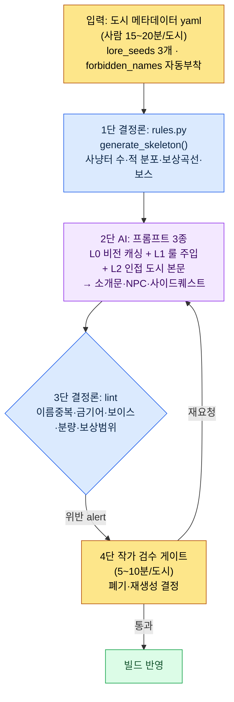

# 6.2 city_hunting_generator — 도시 30개를 4주에 만든다

> 1차 독자: 콘텐츠 양산을 책임지는 MMORPG 기획자 (중규모(10~50인) 팀)
> 1인/취미 독자용 축소 버전: §6.2.10 「혼자라면 이만큼만」

출시까지 도시 30개가 필요하다는 일정표를 처음 받은 날의 계산이 아직 기억난다. 한 도시는 소개문 5~10줄, 사냥터 3~5곳, 사냥터마다 NPC 5~10명과 사이드 퀘스트 2~3개, 특산 아이템 1~3종, 도시 보스 1체로 이뤄진다. 손으로 한 도시를 빚으면 1~2주가 든다. 30개면 작가 한 명이 6개월을 통째로 도시에만 쓰는 셈이다.

그런데 그 6개월이 없었다. 작가 시간은 메인 퀘스트와 시그니처 캐릭터에 묶여 있었고, 도시 30개는 그 작업과 병행돼야 했다. "AI한테 도시 30개 만들어 달라고 하면 되지 않나"는 첫 충동은 곧 무너졌다. 통째로 시키면 서로 비슷한 판타지 마을 30개가 나온다. 이 장은 그 충동 대신 만든 도구 `city_hunting_generator`가 입력·룰북·AI·검증의 네 단계를 어떻게 한 사이클로 묶었는지, 그리고 그 사이클을 실제로 한 번 끝까지 돌리면 무엇이 나오고 무엇이 폐기되는지를 본다.

> **저자 실제 운영 메모**
> 이 장의 `city_hunting_generator`는 저자가 회사 R&D 폴더에서 운영 중인 실제 도구를 익명화한 것이다. 파일명·코드 구조·검증 항목은 실제 도구를 충실히 옮겼고, 도시 이름(silvermark 등)·회사 고유 명칭은 책용으로 치환했다. 출력 본문은 실제 세션을 재구성한 것이다.

---

## 6.2.1 사람은 메타데이터와 마지막 검수만 한다

도구의 전체 흐름은 네 단계다. 핵심은 1단과 3단이 결정론(룰북)이고 2단만 AI라는 점이다. 룰북이 골격과 검증을 양쪽에서 잡아 주면, 가운데 낀 AI가 매번 약간 다른 답을 내도 도시 간 일관성이 흔들리지 않는다. 사람은 첫 입력(메타데이터)과 마지막 게이트(검수)에만 들어간다.



이 그림에서 사람의 손이 닿는 곳은 두 군데뿐이다. 맨 위에서 메타데이터 한 페이지를 깨끗하게 넣는 자리, 맨 아래에서 lint가 못 잡는 톤·서사 판단을 내리는 자리. 그 사이의 지루한 골격 생성과 본문 양산은 룰북과 AI가 돌린다. 결정적인 설계는 lint(3단)가 위반을 발견해도 자동으로 폐기하지 않고 작가 게이트(4단)로 alert만 올린다는 점인데, 그 이유는 §6.2.5에서 본다.

---

## 6.2.2 입력 — 도시 메타데이터 한 페이지

작가는 도시 1개당 메타데이터 한 페이지를 쓴다. 작성 시간은 15~20분. 짧지만 이 한 페이지가 다음 세 단계의 입력 전부다.

```yaml
# city_021_silvermark.meta.yaml
city_id: city_021_silvermark
region: west
climate: cold_arid
dominant_faction: scholar_guild
cultural_tone: scholarly_strict
level_range: [25, 30]
lore_seeds:
  - 100년 전 마법 봉인의 중심지였음
  - 봉인 약화의 첫 징후가 이 도시에서 관측됨
  - 학자 길드 본부 위치
neighbors: [city_018, city_023]
# forbidden_names: (스크립트가 자동 부착 — 작가 입력 불필요)
```

가장 중요한 슬롯은 `lore_seeds`다. 3~5개의 핵심 사건이 도시의 정체성을 잡는다. 너무 적으면 AI가 일반 판타지 도시를 토해내고, 너무 많으면 사건끼리 모순된다. 저자 경험상 3개가 가장 안정적이었다.

`forbidden_names`는 작가가 채우지 않는다. 기존 도시·캐릭터 이름 목록을 스크립트가 읽어 와 메타데이터에 자동 부착한다. 30개 도시 × 평균 50명 NPC가 쌓이면 1,500개 이름의 중복을 사람 머리로 검사하는 건 불가능하기 때문이다. "다른 도시 NPC랑 안 겹치게 해 줘"를 매번 손으로 적을 필요가 없다.

---

## 6.2.3 1단 룰북 — 결정론으로 골격을 잡는다

룰북은 메타데이터를 받아 도시의 구조 골격을 만든다. 코드는 단순하다.

```python
# city_hunting_generator/rules.py (골격)
def generate_skeleton(meta):
    region_rules = REGION_RULES[meta.region]
    hg_count = region_rules.hunting_grounds_range.sample()
    enemy_dist = ENEMY_RULES[meta.climate][meta.dominant_faction]

    skeleton = {
        "hunting_grounds": [
            {
                "id": f"{meta.city_id}_hg_{i}",
                "level": meta.level_range[0] + i,
                "enemy_types": enemy_dist.sample(k=3),
                "reward_curve": calc_reward(meta.level_range[0] + i),
                "npc_count": region_rules.npc_per_hg,
                "sidequest_count": region_rules.sidequest_per_hg,
            }
            for i in range(hg_count)
        ],
        "boss": {
            "id": f"{meta.city_id}_boss",
            "level": meta.level_range[1] + 2,
            "pattern": BOSS_PATTERNS[meta.region],
        },
    }
    return skeleton
```

결과는 결정론이다. 같은 메타데이터를 넣으면 같은 골격이 나온다. 보상 곡선이 region·level별 표준 범위 안에 있는지, 적 분포가 climate·faction 룰에 맞는지가 코드로 보장되고, 회귀 테스트가 잡힌다. 이 단계는 AI에 절대 맡기지 않는다. 보상 곡선을 AI가 매 호출마다 다른 숫자로 뽑으면 도시 간 밸런스가 그 자리에서 흔들리기 때문이다.

silvermark의 메타데이터를 넣으면, `rules.py`는 사냥터 4곳(`city_021_silvermark_hg_0`~`hg_3`), 각 사냥터에 NPC 슬롯 6칸·사이드 퀘스트 슬롯 3칸, 그리고 레벨 32 보스 1체의 빈 골격을 돌려준다. 아직 이름도 본문도 없는, 채워야 할 칸들의 표다. 그 칸을 채우는 게 2단 AI의 일이다.

---

## 6.2.4 2단 AI — 자연어 본문 생성

룰북이 골격을 만든 다음, AI가 그 위에 자연어 본문을 채운다. 도시 소개문, NPC 이름·외형·짧은 배경, 사이드 퀘스트 시놉시스, 특산 아이템 플레이버 텍스트가 여기서 나온다.

호출 패턴은 컨텍스트 주입의 4층 구조 그대로다. L0 비전(world_premise + tone_manifesto)을 캐싱하고, L1 룰(city_naming_rule + region_west_lore)을 선택 주입하고, L2 인접 본문(다른 도시 NPC 이름 목록)을 더하고, 마지막에 작업 지시를 붙인다. 도시 소개문 프롬프트는 그대로 복사해 쓸 수 있는 형태다.

```
[L0 컨텍스트] world_premise + narrative_pillar + tone_manifesto  (캐싱)
[L1 컨텍스트] city_naming_rule, region_west_lore
[입력] city_021_silvermark.meta.yaml + lore_seeds 3개

이 도시 소개문 6~8줄로 써 줘. lore_seeds 세 개 다 자연스럽게 녹이고,
"평화로운 마을" 같은 RPG 상투어는 빼고. 톤은 학자적이고 엄격하게, 감상 억제.
본문만, 머리말이나 해설 없이.
```

같은 패턴이 NPC 양산, 사이드 퀘스트 호출에 그대로 반복된다. 차이는 컨텍스트와 출력 형식뿐이다. NPC 호출에는 `forbidden_names`(다른 도시 NPC 이름 중복 금지) 슬롯이 들어가고, 사이드 퀘스트 호출에는 "발주 NPC를 위에서 생성한 NPC 중에서 고르라"는 제약이 들어간다.

그러면 실제로 무엇이 나오는가. 한 번 끝까지 돌려 본다.

---

## 6.2.5 한 사이클을 끝까지 — 출력·검증·폐기

추상적으로 "AI가 본문을 채운다"고만 적으면 이 도구가 진짜 무엇을 뱉는지 알 수 없다. silvermark 도시 하나의 사이클을 입력에서 폐기까지 한 번 끝까지 따라간다.

> **[2단 AI 출력 — 도시 소개문] (실제 세션 재구성)**
>
> 실버마크는 봉인의 도시다. 100년 전, 일곱 학자가 서쪽 마력의 범람을 막기 위해 이곳 지하에 봉인진을 세웠고, 도시는 그 진 위에 돌 한 장씩 얹어 자라났다. 학자 길드 본부의 종탑은 봉인의 맥을 읽는 관측소이지, 신을 향한 첨탑이 아니다. 최근 3년, 관측 기록에 한 줄이 반복해 적힌다. "맥이 식는다." 봉인 약화의 첫 징후는 다른 어느 곳도 아닌 이 도시의 계기판에서 처음 떨렸다. 거리의 학자들은 그것을 큰 소리로 말하지 않는다. 다만 종탑의 불이 밤새 꺼지지 않는 날이 늘었을 뿐이다.

여기서 lore_seeds 3개(봉인 중심지·약화 첫 징후·학자 길드 본부)가 모두 본문에 실렸고, "모험가를 환영하는 평화로운 마을" 같은 상투어가 없으며, scholarly_strict 톤(감상 억제, 관측·기록 어휘)이 유지됐다. 이게 통과 가능한 출력의 모습이다.

이어서 같은 사이클이 사냥터 `hg_0`의 NPC 슬롯 6칸 중 3칸을 채운다.

> **[2단 AI 출력 — NPC 3명] (실제 세션 재구성)**
>
> **1) 도렌 베일 (Doren Vale)** — 종탑 관측 보조. 50대, 한쪽 눈에 황동 확대경을 영구 장착. 봉인 맥의 미세 진동을 기록하는 일을 30년째 한다. 말수가 적고, 숫자로만 대화한다. *"오늘 12.4. 어제 12.1. 올라가고 있어. 좋은 일이 아니야."*
>
> **2) 미라 코스트 (Mira Kost)** — 길드 문서고 사서. 30대, 잉크 얼룩이 손가락에서 안 지워진다. 봉인진 설계 원본을 지키지만, 정작 그 도면을 읽을 줄 아는 학자는 다 죽었다고 믿는다. 외부인에게 경계심이 강하다.
>
> **3) 그렘 (Grem)** — 종탑 아래 화로지기. 정체불명, 나이 미상. 종탑의 불을 꺼뜨리지 않는 게 유일한 일이며 봉인에 대해 묻는 자에게 "불만 보면 돼"라고만 답한다. *(애매 표시 — AI 자체 신고)*

세 번째 NPC '그렘'에 AI가 스스로 *애매 표시*를 달았다는 점에 주목한다. 좋은 프롬프트는 AI가 "이건 제가 확신 못 합니다"라고 말할 수 있게 만든다. 이제 3단 lint가 이 출력 묶음을 친다.

> **[3단 lint 출력] (실제 형식)**
>
> ```
> [PASS] 분량 검사: 소개문 7줄 (기준 6~8)
> [PASS] 보상 범위: hg_0~hg_3 reward_curve 표준 범위 내
> [WARN] 이름 중복: "Mira Kost" — city_014_riverhold의 "Mira Veldt"와
>        성(Kost/Veldt) 상이하나 이름(Mira) 동일. forbidden_names 근접 충돌.
> [PASS] 금기 어휘: tone_manifesto 위반 0건
> [WARN] 보이스 일관성: "그렘" 대사 voice_lint 신뢰도 0.62 (임계 0.70 미달)
> ```

lint는 위반 2건을 잡았지만 어느 것도 자동으로 폐기하지 않았다. WARN으로 작가 게이트에 올렸을 뿐이다. 이게 §6.2.1에서 예고한 설계의 핵심이다. 검증기에 자동 거부 권한까지 쥐여 주면, 작가들은 한두 달도 안 돼 그 스위치를 내려 버린다. 기계가 의도된 변형까지 싸잡아 죽이고, 그 경계를 작가가 직접 가늠해 볼 기회마저 빼앗기 때문이다. 그래서 의심스러운 후보를 골라내는 일은 기계에 맡기되, 그 후보를 살릴지 버릴지의 마지막 판단만큼은 사람 손에 남겨 둔다.

> **[4단 작가 검수 — 판정과 폐기]**
>
> 작가는 alert 2건을 이렇게 처리했다.
>
> - **Mira Kost** → 살림. riverhold의 Mira Veldt와 같은 이름이지만 다른 도시, 다른 성, 동시 등장 가능성 없음. 의도적 변형으로 통과. (단, forbidden_names 규칙을 "이름+성 완전 일치"에서 "이름 단독 충돌도 WARN"으로 둘지는 별건으로 메모.)
> - **그렘** → **폐기.** voice_lint 신뢰도가 낮았던 게 신호였다. 다시 읽으니 "불만 보면 돼"라는 화로지기 캐릭터가 scholarly_strict 도시 톤과 어긋났다. 학자 길드가 지배하는 도시의 NPC가 신비주의 톤으로 빠지면, 도시 정체성이 흐려진다. 폐기 후 재요청.

작가가 폐기를 결정하고 나면 재요청이 한 번 돈다. "그렘 슬롯을 폐기한다. 같은 사냥터의 학자 길드 톤(관측·기록·엄격)에 맞는 화로지기 NPC로 다시 생성하라. 신비주의 어휘 금지." AI는 종탑 화로의 온도를 기록하는, 불조차 데이터로 보는 노인으로 다시 답했고, 그 출력은 voice_lint 0.81로 통과했다. 입력 → 골격 → 본문 → 검증 → 폐기 → 재생성의 한 사이클이 여기서 닫힌다.

이 한 바퀴가 이 책 전체의 Show 기준이다. 도구가 무엇을 뱉고, 무엇이 걸리고, 사람이 무엇을 죽이는지를 한 번이라도 끝까지 보지 않으면, "AI로 양산했다"는 문장은 공허하다.

---

## 6.2.6 폐기율은 도구의 실패가 아니라 게이트의 신호다

위 사이클에서 NPC 1명이 폐기됐다. 한 도시 전체로 보면 폐기는 더 쌓인다. 검수 시간은 도시당 평균 5~10분, 폐기율은 NPC가 약 20%, 사이드 퀘스트가 약 33%다.

이 비율의 산출 근거를 정직하게 밝혀 둔다. 폐기율은 도입 초기 silvermark를 포함한 도시 5개를 직접 검수하며 카운트한 값이다. NPC는 검수 30명 중 6명 폐기(20%), 사이드 퀘스트는 검수 15건 중 5건 폐기(33%)였다. 표본이 도시 5개로 작으므로 정밀한 모수 비율이 아니라 "다섯 중 하나, 셋 중 하나" 수준의 방향값으로 읽는 게 맞다. 도시 30개 전체를 다 검수한 뒤의 누적 비율은 이보다 낮아질 수도, 사냥터 성격에 따라 높아질 수도 있다.

중요한 건 폐기율 0%가 목표가 아니라는 점이다. 폐기 0%는 검수가 형식적으로 흘렀다는 신호에 가깝다. 다섯 NPC 중 한 명이 톤이 안 맞아 폐기되고, 세 사이드 퀘스트 중 하나가 lore_seeds와 안 붙어 재생성될 때, 검수 게이트가 실제로 작동하고 있는 것이다.

---

## 6.2.7 측정 — 30개 도시 4~5주

도구 도입 전후를 비교한다. 아래 시간 수치는 silvermark를 포함한 초기 도시들의 실측 평균이고, "도입 전" 열은 도구 이전 손작업 시기의 작가 추정이다. 가공한 숫자는 없다.

| 항목 | 도입 전 (손작업) | 도입 후 (실측) |
|---|---|---|
| 도시 1개 작성 시간 | 1~2주 | 약 30분 (메타 15분 + AI 5분 + 검수 8분) |
| 30개 도시 총 기간 | 작가 1인 6개월급 | 4~5주 |
| 폐기율 (NPC) | — (전량 직접 작성) | 약 20% (30명 중 6명) |
| 폐기율 (사이드 퀘스트) | — | 약 33% (15건 중 5건) |
| 일관성 사고 (도시당) | 거의 없음 | 0~1건 |

표만 보면 숫자가 다지만, 실제 효과는 다른 칸에서 나왔다. 도시 양산에 묶일 뻔한 작가 시간이 풀려나면서, 작가 한 명이 분기당 메인 퀘스트 산출을 크게 늘릴 수 있었다(정확한 배수는 분기마다 달라 단정하지 않는다 — 방향은 "메인 산출이 명확히 늘었다"다). 양산 도구가 작가 시간을 흡수하는 게 아니라 풀어 주는 도구로 작동한 것이다(작가가 "검수기"가 됐다고 느끼면 도구가 거부된다는 §6.1.8의 경고가 그대로 적용된다).

---

## 6.2.8 generator에 안 들어가는 콘텐츠

자동화 폭이 넓어졌어도 다음은 도구 밖에 둔다.

| 콘텐츠 | 도구 밖에 두는 이유 |
|---|---|
| 메인 퀘스트 본문 | 일관성·서사 깊이가 게임 정체성에 직결 |
| 보스 패턴·연출 | 시각·인터랙션 디테일이 많아 디자이너 손이 빠름 |
| 시그니처 메인 캐릭터 | voice_profile 풀 작성이 필요해 양산 불가 |
| 분기 결말 | 작가의 직접 결정 영역 |
| 도시당 시그니처 사이드 퀘스트 1~2개 | 작가가 골라 직접 만듦 |

양산할 수 있다는 사실이 양산해야 한다는 결정으로 자동 이어지면 안 된다. silvermark 사이클에서 본 것처럼, 도구는 NPC 6명 중 5명까지는 잘 양산한다. 그러나 그 도시의 '봉인이 식는다'는 핵심 긴장을 짊어질 시그니처 NPC 한 명은 작가가 직접 빚는다. 자동화의 경계가 명확하면, 양산 도구가 오히려 그 핵심 영역을 지키는 도구가 된다.

---

## 6.2.9 흔한 실패 다섯 가지

| 실패 패턴 | 왜 실패하나 | 처방 |
|---|---|---|
| lore_seeds를 1~2개만 작성 | AI 출력이 일반 RPG 평균으로 평준화 | 3개 이상 강제 (§6.2.2) |
| 룰북 없이 AI에 통째 양산 요청 | "도시 30개 만들어 줘" → 비슷한 마을 30개 | 1단 룰북은 건너뛸 수 없음 (§6.2.3) |
| lint 없이 작가 검수에만 의존 | 검수자가 사소한 룰 위반 처리에 시간 소진 | 1차 자동 검증을 먼저 (§6.2.5) |
| 명명 중복 검사 누락 | 1,500명 이름의 중복은 사람 머리로 불가능 | forbidden_names 자동 부착 (§6.2.2) |
| 작가 만족도 미측정 | 처리량은 늘지만 작가 시간을 빼앗으면 거부됨 | 메인 콘텐츠 시간 명시적 보장 (§6.2.7) |

다섯 번째가 가장 자주 놓친다. silvermark의 그렘을 폐기한 것 같은 판단을 작가가 즐겁게 하려면, 작가에게 양산 검수 말고 직접 빚을 시간이 남아 있어야 한다. 처리량 측정만 하고 작가 시간 측정을 빼면, 도구는 KPI상 성공하지만 사람은 떠난다.

---

## 6.2.10 따라하기 — 오늘 할 수 있는 한 단계

> **혼자라면 이만큼만**: 룰북 코드가 없어도 됩니다. 본인 게임(또는 좋아하는 게임)의 도시·지역 1곳을 골라 §6.2.2 형식의 메타데이터를 손으로 적고(lore_seeds 3개가 핵심), §6.2.4의 소개문 프롬프트를 그대로 붙여 한 번 돌려 보세요. 나온 NPC 중 톤이 안 맞는 한 명을 직접 골라 "이 NPC는 도시 톤과 어긋난다, 폐기하고 다시"라고 반박해 보면, 검수 게이트가 어떤 판단의 묶음인지 몸으로 들어옵니다.

팀이라면 다음 한 단계로 시작하세요. 메타데이터 yaml 양식 한 장과 `forbidden_names` 자동 부착 스크립트부터 만듭니다. 룰북 골격(`generate_skeleton`)과 lint는 그 다음입니다. 입력 양식과 이름 중복 검사 두 개만 있어도, AI 본문 양산이 "비슷한 마을 30개"로 무너지는 두 가지 흔한 실패를 먼저 막을 수 있습니다.

---

## 6.2.11 다음 장 예고

6.3에서는 NPC Persona/Squad 파이프라인을 다룬다. 6.2의 generator가 도렌·미라 같은 NPC를 개별로 양산한다면, Persona/Squad는 그 NPC들을 그룹 단위로 묶는다. 한 사냥터의 다섯 NPC가 서로 무관한 인형의 집합이 아니라 작은 사회로 작동하게 만드는 방법이다.

---

### 이 챕터의 핵심 메시지
- 1·3단은 룰북(결정론), 2단만 AI — 사람은 입력과 검수 게이트만.
- 출력·검증·폐기를 한 번 끝까지 봐야 "AI 양산"이 공허하지 않다.
- 폐기율 20·33%는 도구 실패가 아니라 게이트가 작동한다는 신호다.

### 다음 챕터 미리보기
- 6.3. NPC Persona/Squad 파이프라인
