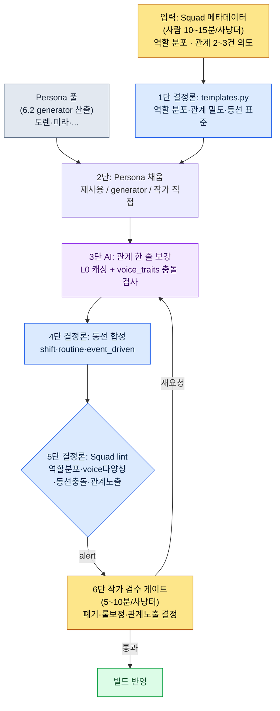

# 6.3 NPC Persona와 Squad — 인형 박물관에서 작은 사회로

> 1차 독자: NPC·사냥터 콘텐츠를 책임지는 MMORPG 기획자 (중규모(10~50인) 팀)
> 1인/취미 독자용 축소 버전: §6.3.10 「혼자라면 이만큼만」

6.2의 generator로 한 사냥터에 NPC 다섯 명을 양산해 게임 안에 띄워 본 날의 기억이 있다. 이름·외형·짧은 배경이 다 채워졌고, 좌표만 찍어 배치했다. 그런데 막상 그 사냥터를 걸어 다녀 보니 묘하게 죽어 있었다. 다섯 명이 같은 공간에 있는데 서로 한 번도 언급하지 않았다. 두 명이 같은 바위에 겹쳐 서 있었다. 누군가는 상인 역할이 필요했는데 다섯 명 전부 학자였다. 도렌도 미라도 개별로는 멀쩡한 NPC였는데, 묶어 두니 인형의 집합이었다.

이게 인형 박물관 상태다. 개별 NPC는 다 만들었는데 그룹으로 살아 있지 않다. 이 장은 그 다섯 명을 작은 사회로 묶는 파이프라인을 다룬다. 핵심 분해는 Persona와 Squad다. 사무실에 비유하면 Persona는 직원 개인 명함이고 Squad는 한 팀의 조직도다. 명함을 50장 쌓아 두고 조직도가 없으면 회사가 돌아가지 않는다. 그리고 이 장의 척추는 마지막 단계, 즉 묶은 그룹이 '서로 아는 사이처럼 말하고 움직이는가'를 AI와 한 사이클 끝까지 검증하는 자리다.

> **저자 실제 운영 메모**
> 이 장의 Squad 파이프라인은 저자가 회사 R&D 폴더에서 운영 중인 NPC Persona/Squad 도구를 익명화한 것이다. yaml 구조·검증 항목·voice_lint 임계값은 실제 도구를 충실히 옮겼고, 도시·NPC 이름은 6.2와 동일하게 책용으로 치환했다. 출력 본문은 실제 세션을 재구성한 것이다.

---

## 6.3.1 Persona는 명함, Squad는 조직도

Persona는 개별 NPC의 정체성이다. 이름·외형·voice_profile·역할을 담는다. 6.2의 generator가 만드는 게 Persona다. 도렌 베일, 미라 코스트가 각각 하나의 Persona다.

Squad는 그 Persona들을 그룹으로 묶는 단위다. 사냥터 한 곳에 다섯 명이 어떤 역할로 분포하고, 서로 어떤 관계이며, 어떻게 움직이는지를 정의한다.

| 단위 | 담는 내용 | 만드는 주체 |
|---|---|---|
| Persona | 이름·외형·voice_profile·역할 | generator (6.2) |
| Squad | 역할 분포·관계·동선 | Squad 파이프라인 (이 장) |

이 둘을 분리하지 않으면 두 가지가 동시에 막힌다. Persona만 양산하면 인형 박물관이 되고, Squad부터 만들려 하면 채울 Persona가 없다. 분리하면 각 단위의 운영이 단순해진다. 다만 분리가 곧 단절은 아니다. 핵심은 두 단위 사이에 재사용·검증 경로를 깔아 두는 것이고, 이게 이 장의 본론이다.

이 Persona→Squad 분해는 단순한 정리가 아니라 더 멀리 가는 길을 연다. NPC 그룹이 역할·관계·수치로 정형화돼 있어야, 나중에 월드 상태(플레이어 행동 누적)가 NPC 수치를 흔들고 그 수치가 퀘스트 발현 조건이 되는 동적 반응성까지 갈 수 있다. 이 장은 그 진보적 적용의 입구만 짚고, 정면으로는 '사람이 검수하는 보수적 양산'까지만 다룬다.

---

## 6.3.2 입력 — Squad 메타데이터 한 페이지

Squad 골격은 사냥터 1개당 메타데이터 한 페이지에서 시작한다. 6.2의 도시 메타데이터와 같은 사상이다. 사람이 역할 분포와 관계 의도만 잡고, 채우는 일은 룰북과 AI가 한다.

```yaml
# city_021_hg_3.squad.yaml
squad_id: city_021_hg_3_squad
hunting_ground: city_021_silvermark_hg_3
type: hunting_ground_residents
size: 5
roles:
  - role: quest_giver
    count: 1
    voice_traits: [authoritative, scholarly]
  - role: lore_keeper
    count: 1
    voice_traits: [scholarly, withdrawn]
  - role: merchant
    count: 1
    voice_traits: [practical, dry]
  - role: bystander
    count: 2
    voice_traits: [varied]
relationships:
  - between: [quest_giver, lore_keeper]
    type: mentor_and_former_student
  - between: [merchant, bystander_1]
    type: regular_customer
movement_pattern: stationary_with_shifts
```

가장 중요한 슬롯은 `relationships`다. 관계가 0건이면 다섯 명은 끝까지 남남이다. 관계가 너무 많으면(5명에 5건 이상) 사용자가 외울 게 많아져 오히려 묻힌다. 저자 경험상 5인 Squad에 핵심 관계 2~3건이 가장 안정적이다. `voice_traits`는 다섯 명이 서로 다른 목소리를 갖도록 잡는 장치다. 다섯 명 모두 `scholarly`로 채우면 검증 단계에서 voice 평준화로 걸린다.

---

## 6.3.3 1단·2단 — 룰북 골격과 Persona 채움

룰북이 먼저 Squad 골격의 표준을 잡는다. 사냥터 region·type별로 사이즈·역할 분포·관계 밀도·동선 패턴의 기본값이 코드에 입력되어 있다.

```python
# npc_squad/templates.py (발췌)
SQUAD_TEMPLATES = {
    ("west", "hunting_ground_residents"): {
        "size_range": (4, 6),
        "role_distribution": {
            "quest_giver": 1,
            "merchant": 1,
            "lore_keeper": (0, 1),
            "bystander": (1, 3),
        },
        "relationship_density": 2,        # 권장 관계 수
        "movement_pattern": "stationary_with_shifts",
    },
    ("east", "outpost_squad"): {
        "size_range": (3, 4),
        "role_distribution": {
            "commander": 1,
            "scout": 1,
            "support": (1, 2),
        },
        "relationship_density": 1,
        "movement_pattern": "patrol_loop",
    },
}
```

이 단계는 결정론이다. 서부 거주민 Squad는 quest_giver만 다섯 명인 사고가 코드 차원에서 불가능하다. 역할 분포가 룰을 벗어나면 그 자리에서 막힌다.

다음으로 각 슬롯에 Persona를 채운다. 길은 셋이다. 풀에 맞는 Persona가 있으면 재사용하고(출연 가중치 +1), 없으면 6.2의 generator로 새로 만들고, 메인 퀘스트 핵심 인물이면 작가가 직접 쓴다. silvermark의 hg_3 Squad는 quest_giver·lore_keeper를 6.2에서 이미 양산한 미라·도렌으로 채웠고, merchant와 bystander 2명을 새로 뽑았다. 여기까지는 6.2의 generator 사이클과 같다. 이 장의 진짜 일은 그 다음, 묶은 그룹이 정말 그룹처럼 작동하는지를 검증하는 자리다.

---

## 6.3.4 한 사이클을 끝까지 — 관계 보강·동선·일관성 검증

추상적으로 "AI가 관계를 보강한다"고만 적으면 이 파이프라인이 무엇을 뱉는지 알 수 없다. silvermark hg_3 Squad 하나의 후반 사이클을, 관계 텍스트 생성에서 폐기·재요청까지 한 번 끝까지 따라간다.

### 3단 — AI 관계 보강

Squad 골격에 입력된 관계 태그(`mentor_and_former_student`)는 추상이라 게임 안에서 보이지 않는다. 이걸 한 줄 묘사로 바꿔 NPC 대사·이벤트에 심는 게 3단이다. 프롬프트는 그대로 복사해 쓸 수 있는 형태다.

```
[L0 컨텍스트] world_premise + tone_manifesto  (캐싱)
[L1 컨텍스트] city_021_silvermark.lore (학자 길드 지배, scholarly_strict)
[Persona 1] quest_giver — 미라 코스트, 길드 문서고 사서, 30대, 잉크 얼룩
[Persona 2] lore_keeper — 도렌 베일, 종탑 관측 보조, 50대, 숫자로만 대화
[관계 태그] mentor_and_former_student

이 둘(스승–옛 제자)의 관계를 게임 대사에 쓸 배경으로 1~2줄만 묘사해 줘.
도렌은 숫자, 미라는 문서 — 두 말투가 안 부딪히게. 톤은 엄격한 학자풍으로,
신비주의나 "오랜 친구" 같은 상투어는 빼고. 본문만.
```

> **[3단 AI 출력 — 관계 한 줄] (실제 세션 재구성)**
>
> 도렌은 20년 전 미라에게 봉인진 관측 기록의 표기법을 가르쳤다. 지금은 입장이 뒤집혀, 도렌이 측정한 수치를 미라가 문서고 장부에 옮겨 적는다. 둘은 매주 화요일, 관측값이 장부와 어긋나는 한 칸을 두고 짧게 다툰다.

이 출력은 좋다. `mentor_and_former_student`가 구체화됐고, 도렌의 '숫자'와 미라의 '문서'가 충돌 없이 한 장면(수치를 장부로 옮김)으로 묶였고, scholarly_strict 톤이 유지됐다. 같은 프롬프트가 merchant–bystander_1의 `regular_customer` 관계에도 반복된다.

### 4단 — 동선 합성

NPC가 종일 한 자리에 서 있으면 다시 인형이 된다. 룰북이 동선 패턴을 채운다. stationary는 한 자리 고정(경비·보스), stationary_with_shifts는 8시간마다 위치 미세 변경(일반), routine_loop은 시간표 기반(주민), event_driven은 트리거 시에만 이동(퀘스트 NPC). 이건 결정론이라 AI를 부르지 않는다.

### 5단 — Squad 일관성 lint (이 파이프라인의 게이트)

이제 묶인 다섯 명이 정말 그룹처럼 작동하는지를 친다. 6.2의 lint가 개별 NPC를 봤다면, 이 lint는 그룹 일관성을 본다.

> **[5단 Squad lint 출력] (실제 형식)**
>
> ```
> [PASS] 역할 분포: quest_giver 1 · lore_keeper 1 · merchant 1 · bystander 2 (룰 충족)
> [PASS] 관계 밀도: 2건 (권장 2, 충족)
> [WARN] voice 다양성: scholarly 계열 3/5 — quest_giver·lore_keeper·bystander_2
>        가 voice_profile 코사인 유사도 0.83 (임계 0.80 초과). 평준화 위험.
> [WARN] 동선 충돌: 14:00~16:00 구간 merchant·bystander_1 좌표 반경 1.5m 중첩
> [FAIL] 관계 노출: 관계 2건이 정의됐으나, 5명 대사 어디에도 다른 멤버 언급 0건.
>        관계가 데이터에만 존재 — 게임 내 가시성 0.
> ```

lint가 세 건을 잡았다. 셋 다 자동으로 폐기하지 않고 게이트로 올린다 — 의심 후보는 기계가 뽑되 죽일지 살릴지는 사람이 정한다는, §6.2.5와 같은 설계다.

> **[6단 작가 검수 — 판정과 폐기]**
>
> 작가는 alert 세 건을 이렇게 처리했다.
>
> - **voice 평준화 (WARN)** → bystander_2를 폐기. 학자 도시라도 다섯 명이 다 학자 말투면 사냥터가 단조롭다. bystander_2를 `practical, dry` 톤의 잡역부로 재생성 요청. (quest_giver·lore_keeper가 둘 다 학자인 건 도시 정체성이라 유지.)
> - **동선 충돌 (WARN)** → 룰 보정. merchant의 shift 시작 오프셋을 +2시간으로 밀어 14:00 중첩 해소. AI 호출 없이 동선 패러미터만 조정.
> - **관계 노출 0 (FAIL)** → 가장 중요한 건. 관계를 두 건이나 정의해 놓고 게임 안에서 한 번도 안 보이면 그 데이터는 죽은 데이터다. 작가가 핵심 관계 1건(도렌–미라)을 골라 대사에 심기로 결정.

세 건 중 두 건은 룰·재생성으로 닫혔고, 마지막 FAIL이 이 파이프라인의 핵심이다. 작가는 도렌의 대화 분기 한 줄을 추가 요청했다.

```
도렌 대사에 미라와의 관계가 흘리듯 드러나는 한 줄만 끼워 줘.
설명조 말고 곁가지로. 학자풍 톤, 대사 한 줄만.
```

> **[재요청 출력]**
>
> *"그 도면은 문서고에 있어. 미라한테 물어봐. ...20년 전엔 내가 그 친구한테 읽는 법을 가르쳤는데, 요즘은 거꾸로야."*

이 한 줄이 들어가는 순간 두 NPC의 관계가 데이터 시트에서 게임 화면으로 옮겨 온다. 입력(Squad 메타) → 골격 → Persona 채움 → 관계 보강 → 동선 → 일관성 검증 → 폐기·노출 결정의 한 사이클이 여기서 닫힌다.

이 한 바퀴가 이 장의 Show 기준이다. "Squad로 NPC를 사회로 묶었다"는 문장은, 관계 노출 0건 FAIL을 사람이 한 줄 대사로 닫는 장면을 한 번이라도 보지 않으면 공허하다.

---

## 6.3.5 Persona→Squad 전체 흐름

위 사이클을 한 그림으로 실어 둔다. 핵심은 1·2·4·5단이 결정론(룰북·lint)이고 3단만 AI라는 점, 그리고 사람의 손은 맨 위 입력과 맨 아래 게이트에만 닿는다는 점이다.



사람의 손이 닿는 곳은 두 군데뿐이다. 맨 위에서 역할·관계 의도를 잡는 자리, 맨 아래에서 lint가 못 잡는 톤·서사를 판정하는 자리. 그 사이의 골격·동선·검증은 룰북이, 관계 본문은 AI가 돌린다.

---

## 6.3.6 관계를 게임에 보이게 만드는 세 장치

5단 lint의 `관계 노출` 항목이 가장 자주 FAIL이 난다. 관계가 데이터에만 살아 있기 때문이다. 관계를 게임 안으로 끌어내는 장치는 셋이다.

첫째, **대사 인용**. §6.3.4의 도렌 대사처럼 NPC가 다른 멤버를 한 줄 언급한다. 가장 싸고 가장 효과가 크다.

둘째, **동선 교차**. 매주 화요일 도렌과 미라가 문서고에 함께 있는 장면이 게임 안에서 관찰된다. 사용자가 우연히 보면 "저 둘이 엮였나" 알아챈다. 4단 동선과 관계가 일치하면 자연히 나온다.

셋째, **분기 조건**. quest_giver의 부탁을 거절하면 lore_keeper 호감도가 같이 떨어진다. 이 셋째 장치가 §6.3.1에서 말한 진보적 적용의 입구다 — 관계가 단순 묘사를 넘어 게임 상태에 영향을 주기 시작하는 자리.

세 장치를 다 쓸 필요는 없다. 5인 Squad에서 핵심 관계 2~3건만 첫째·둘째 장치로 노출돼도 사냥터의 체감이 크게 달라진다. 과하면 사용자가 외울 게 많아진다. 작가는 검수 단계에서 노출할 관계를 골라 끼우고, 나머지는 데이터로만 둔다.

---

## 6.3.7 측정 — 정직하게

도구 도입 전후를 비교한다. 가공 수치는 쓰지 않는다. 시간·비율은 silvermark를 포함한 초기 사냥터 몇 곳을 직접 검수하며 카운트한 값이고, "도입 전" 열은 손작업 시기의 작가 추정이다.

| 항목 | 도입 전 (손작업·추정) | 도입 후 (실측) |
|---|---|---|
| 사냥터 1곳 Squad 묶기 | 약 3~4시간 | 약 25분 (메타 12분 + AI 5분 + 검수 8분) |
| 관계 노출(대사·동선) 건수 | 사냥터당 0~1건 | 핵심 2~3건 중 노출 1~2건 |
| 동선 충돌 (같은 좌표 2명+) | 사냥터당 2~3건 | lint로 사전 차단, 0~1건 |
| voice 평준화 폐기 | — (검사 없음) | 5명 중 0~1명 재생성 |

표본이 사냥터 몇 곳으로 작으므로 정밀한 모수 비율이 아니라 방향값으로 읽는 게 맞다. 가장 큰 변화는 표에 안 담긴다. lint의 `관계 노출` FAIL이 강제로 작가에게 "이 사냥터, 관계가 하나도 안 보입니다"를 들이밀기 때문에, 양산물이 인형 박물관으로 출시되는 일이 구조적으로 줄었다. 폐기 0%·노출 0건이 목표가 아니라는 점(§6.2.6)은 여기도 같다. Squad가 묶는 일의 대부분을 흡수하되, 도렌의 마지막 대사 한 줄 같은 핵심은 작가가 직접 빚을 시간이 남아 있어야 한다.

---

## 6.3.8 Persona 풀 — 같은 인물이 여러 도시에 나타나면

Squad가 안정되면 자연히 따라오는 운영이 Persona 풀이다. 같은 Persona가 여러 도시에 출연할 수 있다. 학자 길드 소속 NPC가 도시 서너 곳에서 마주쳐지는 건 오히려 자연스럽다. 세계가 좁아 보이는 게 아니라 연결돼 보인다.

```yaml
persona_pool:
  - id: persona_doren_vale
    voice_traits: [terse, numeric]
    appearance_count: 3
    appearance_cities: [city_021, city_018, city_023]
    signature: false
  - id: persona_mira_kost
    voice_traits: [scholarly, withdrawn]
    appearance_count: 2
    signature: false
```

재사용 비율에는 건강 범위가 있다.

| 재사용 비율 | 상태 |
|---|---|
| 20% 미만 | NPC 분량 폭증, 식별 부담 |
| 30~50% | 건강한 운영 범위 |
| 70% 이상 | NPC 식상함, 다양성 손상 |

다만 한 NPC를 너무 많은 도시에 등장시키면 "이 사람 또 나오네"가 된다. 한 Persona의 최대 출연 도시는 5곳으로 한도를 둔다. 보스 룸·시그니처 인물은 재사용 금지(`signature: true`). 같은 Persona의 두 번째 출연부터는 시각 변주(라이트·소품)를 강제한다. 이 30~50% 범위는 정밀 수치가 아니라 운영 가이드라인이다 — 팀·게임 규모에 따라 보정해야 한다.

> **[방향 표지 — 페르소나 풀을 분포로 본다면 (아직은 시기상조)]** 풀이 수백 NPC로 커진 팀이라면 한 발 더 나간 방향이 있다 — §8.2.7의 '차원 벡터' 절과 같은 자리의 방향 표지다(처방이 아니다 — 개념 직관은 부록 M). §6.3.4의 voice_lint는 이미 두 Persona의 코사인 유사도(0.83 같은 값)로 '가까움'을 본다. 같은 임베딩을 풀 전체에 올리면, 식상함을 작가의 인상이 아니라 분포 밀도로 진단할 수 있다 — '학자 말투가 한 구석에 떼로 몰린' 상태가 그 영역의 점 밀도로 보인다. 그러면 저밀도 영역에 '또 비슷한 학자'를 새로 찍는 대신, 가까운 두 Persona 사이를 보간한 변주를 채워 다양성을 메우는 길이 열린다. 다만 같은 호흡으로 둘 주의점이 둘이다. 보간으로 뽑은 Persona는 두 NPC를 어색하게 섞은 '죽은 중간값'이 되기 쉬워, 결국 사람이 voice를 다시 살려야 한다. 그리고 위 식상함 비율(30~50%)은 정밀치가 아니라 운영 가이드라인이라, 그걸 임베딩 거리로 환산하는 순간 느슨함이 정밀한 척 숨을 위험이 있다 — 거리값은 작가의 판정을 돕는 신호지 판정 자체가 아니다.

---

## 6.3.9 흔한 실패 여섯 가지

| 실패 패턴 | 왜 실패하나 | 처방 |
|---|---|---|
| Persona만 양산하고 Squad를 무시 | NPC 50명이 다 있는데 사냥터가 죽어 있음 | Squad 골격 룰북 도입 (§6.3.3) |
| 역할 분포 룰 없이 자율 생성 | 상인만 다섯, 학자 0명 같은 분포 사고 | role_distribution 강제 (§6.3.3) |
| 관계 태그만 두고 한 줄 묘사 누락 | 관계가 추상이라 게임에 안 보임 | 3단 AI 관계 보강 (§6.3.4) |
| 관계 노출 검사 없음 | 관계 정의해 놓고 대사·동선에 0건 노출 | 5단 `관계 노출` lint (§6.3.4) |
| 동선 충돌 검사 누락 | 같은 시간 같은 자리 2명, 출시 후 빈번 | 좌표·시간대 자동 검사 (§6.3.4) |
| 재사용 비율 0% 또는 70%+ | 0%는 양산 폭증, 70%+는 식상함 | 풀 운영 + 출연 한도 (§6.3.8) |

네 번째가 가장 자주 놓친다. 관계를 정의하는 일과 관계를 게임에 보이게 하는 일은 다른 작업이고, 검사 없이는 거의 항상 후자가 빠진다. silvermark hg_3에서 lint가 관계 노출 0건을 FAIL로 들이밀지 않았다면, 도렌과 미라는 데이터 시트에서만 사제 관계였을 것이다.

---

## 6.3.10 따라하기 — 오늘 할 수 있는 한 단계

> **혼자라면 이만큼만**: 룰북도 lint도 없어도 됩니다. 본인 게임(또는 좋아하는 게임)의 한 장소에 있는 NPC 3~5명을 골라, §6.3.2 형식으로 역할과 관계 2건을 손으로 적어 보세요. 그다음 §6.3.4의 관계 보강 프롬프트를 그대로 붙여 한 줄 묘사를 받고, 마지막으로 직접 물어보세요 — "이 관계가 지금 게임 대사 어디에서 보이는가?" 한 군데도 없으면, 그게 바로 lint의 `관계 노출 0` FAIL입니다. NPC 한 명의 대사에 다른 멤버를 한 줄 끼워 그 FAIL을 손으로 닫아 보면, Squad 검증이 무엇을 잡는 작업인지 몸으로 들어옵니다.

팀이라면 다음 한 단계로 시작하세요. Squad 메타데이터 yaml 양식 한 장과, 5단 lint 중 **`관계 노출` 검사 한 줄**부터 만듭니다(각 NPC 대사 텍스트에 다른 멤버 이름·역할이 등장하는지 grep). 역할 분포 검사·동선 충돌 검사는 그 다음입니다. 관계 노출 검사 하나만 있어도, 양산된 사냥터가 인형 박물관으로 출시되는 가장 흔한 실패를 먼저 막습니다.

setup → prompt → verify로 요약하면 — **setup**: Squad 메타 yaml에 역할·관계를 정의하고 templates.py로 골격을 잡습니다. **prompt**: §6.3.4 형식으로 관계 한 줄을 받되 voice_traits 충돌 금지·상투어 금지를 강제합니다. **verify**: 5단 lint를 돌려 `관계 노출` FAIL을 확인하고, 핵심 관계 1건을 대사에 심어 직접 닫습니다.

---

### 이 챕터의 핵심 메시지
- Persona는 명함, Squad는 조직도 — 분리해야 인형 박물관이 사회가 된다.
- 관계 보강·동선·일관성 검증을 한 번 끝까지 봐야 "사회로 묶었다"가 안 공허하다.
- `관계 노출 0` FAIL을 사람이 한 줄 대사로 닫는 게 이 파이프라인의 심장이다.

### 다음 챕터 미리보기
- 6.4 콘텐츠 양산 워크플로 — Persona·Squad·도시 생성을 1주 사이클로 묶기
