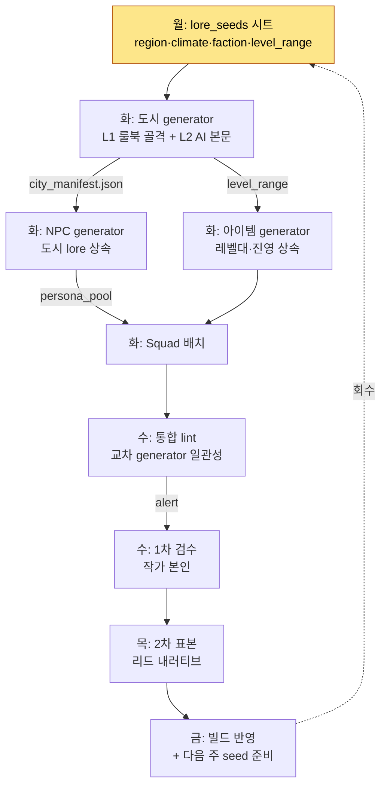

# 6.4 콘텐츠 양산 워크플로 — 여러 generator를 한 라인으로 묶는다

세 도구를 각자 완성한 그 주, 나는 한 자리에서 도시 generator를 돌리고, NPC generator를 돌리고, 아이템 generator를 돌렸다. 셋 다 각자 잘 작동했다. 도시는 7곳이 나왔고, NPC는 110명이 나왔고, 무기는 60개가 나왔다. 그런데 며칠 뒤 검수에 앉아서야 나는 같은 함정을 세 번 밟았다는 걸 알았다.

도시 `port_harman`은 "몰락한 어촌"으로 생성됐는데, 그 도시에 배치된 NPC들의 페르소나는 "번성하는 무역항의 부유한 상인"이었다. 도시 generator와 NPC generator가 서로 다른 lore_seeds를 봤기 때문이다. 무기 generator는 그 도시의 권장 레벨이 12~18인데 레벨 40짜리 전설 무기를 상점에 깔아 놨다. 세 도구는 각자 옳았고, 묶이지 않아서 틀렸다.

이 챕터는 도구 하나를 만드는 이야기가 아니다. 6.2의 도시 generator, 6.3의 NPC Squad, 그리고 아이템 generator를 **한 생산 라인으로 묶는** 운영 이야기다. 도구가 세 개면 함정도 세 개가 아니라, 도구 사이의 틈에서 새로 생긴다.

---

## 6.4.1 생산 라인이라는 관점

도시·NPC·아이템 generator를 따로 돌리면, 각 도구의 출력이 다른 도구의 입력과 어긋난다. 해법은 도구를 더 똑똑하게 만드는 게 아니라, **공유 메타데이터를 상류에 한 번 고정하고, 도구들을 그 아래로 줄 세우는** 것이다. 6.2 ch2의 도시 생성기가 단일 도구의 모범이라면, 이 챕터는 그 도구를 라인의 한 스테이션으로 격하시키는 작업이다.

전체 라인은 이렇게 흐른다.



핵심은 `city_manifest.json`이라는 화살표다. 도시 generator가 도시를 만들면서 그 도시의 정체성(몰락한 어촌인지 번성한 무역항인지)을 manifest로 떨어뜨리고, NPC generator와 아이템 generator가 **그 manifest를 입력으로 받는다**. 내가 그때 밟은 함정은 이 화살표가 없었기 때문이다. 도구를 묶는다는 건, 도구 사이에 이 한 줄의 계약을 넣는 것이다.

---

## 6.4.2 도구를 묶는 한 줄의 계약 — manifest

도시 generator가 도시 하나를 만들 때마다 함께 뱉는 `city_manifest.json`의 실제 형태는 이렇다. 이 파일이 NPC·아이템 generator의 입력이 된다.

```json
{
  "city_id": "port_harman",
  "display_name": "하르만 항",
  "lore_seeds": ["몰락한 어촌", "옛 무역의 잔향", "소금 부족"],
  "region": "남부 연안",
  "dominant_faction": "어민 길드",
  "level_range": [12, 18],
  "tone": "쇠락·끈질김",
  "forbidden_names": ["하란", "하르멘"],
  "neighbors": ["salt_marsh", "old_pier"]
}
```

NPC generator는 `lore_seeds`와 `tone`을 상속해 "몰락한 어촌의 끈질긴 사람들"을 만든다. 아이템 generator는 `level_range`를 상속해 12~18레벨 무기만 깐다. `forbidden_names`는 이미 옆 도시에서 쓴 이름이라 양쪽 모두 피한다. 도구 세 개가 같은 한 장의 계약서를 본다.

이 manifest를 만들 때 내가 Claude에게 준 프롬프트는 다음과 같다. 양산 라인의 상류를 묶는 가장 중요한 한 번의 호출이라, 전문을 그대로 옮긴다.

> 너는 MMORPG 도시 generator의 manifest 작성기다. 아래 작가 메타데이터를 받아 city_manifest.json을 생성하라.
>
> 작가 입력:
> - city_id: port_harman
> - lore_seeds: 몰락한 어촌, 옛 무역의 잔향, 소금 부족
> - region: 남부 연안
> - level_range: 12-18
>
> 규칙:
> 1. dominant_faction은 lore_seeds에서 추론하되, 옆 도시(salt_marsh, old_pier)의 진영과 겹치면 안 된다. 옆 도시 진영은 [염전 조합, 밀수단]이다.
> 2. forbidden_names에는 이미 인접 도시에서 사용된 NPC/지명을 넣어라. 제공된 목록: [하란, 하르멘].
> 3. tone은 두 단어 이내. lore_seeds와 모순되지 않게.
> 4. 추측한 값과 작가가 명시한 값을 구분해 표시하라.

Claude의 날것 출력은 이랬다. 요약하지 않고 그대로 옮긴다. 한 군데에서 규칙을 어겼다.

> ```json
> {
>   "city_id": "port_harman",
>   "display_name": "하르만 항",
>   "lore_seeds": ["몰락한 어촌", "옛 무역의 잔향", "소금 부족"],
>   "region": "남부 연안",
>   "dominant_faction": "밀수단",   // ← 추론: 소금 부족 + 옛 무역 = 밀무역
>   "level_range": [12, 18],
>   "tone": "쇠락·탐욕",
>   "forbidden_names": ["하란", "하르멘"],
>   "neighbors": ["salt_marsh", "old_pier"]
> }
> ```
> (추론한 값: dominant_faction, tone, display_name / 작가 명시: 나머지)
> 주의: dominant_faction을 "밀수단"으로 골랐는데, 규칙 1에서 옆 도시 old_pier가 이미 "밀수단"입니다. 규칙 위반입니다. 대체 후보로 "어민 길드"를 제안합니다.

여기서 중요한 건 AI가 스스로 규칙 위반을 보고했다는 점이다. "밀수단"은 lore_seeds(소금 부족·옛 무역)에서 보면 매력적인 추론이지만, **라인 차원에서는 충돌**이다. 옆 도시가 이미 밀수단이다. 나는 AI의 제안을 받아 `dominant_faction`을 "어민 길드"로, `tone`을 "쇠락·끈질김"으로 고쳤다. "탐욕"은 밀수단 전제에서 나온 단어라 어민 길드와 안 맞았다.

이 한 번의 검증·거부·재지정이 라인의 상류를 지킨다. manifest가 틀리면 그 아래 NPC 110명과 무기 60개가 전부 틀린 전제 위에 생성된다. 상류에서 5분을 쓰면 하류에서 3시간을 아낀다.

---

## 6.4.3 통합 lint — 도구 사이의 틈을 검사한다

단일 generator의 lint는 자기 출력만 본다. 도시 lint는 도시가 룰북을 지켰는지 보고, NPC lint는 페르소나가 voice 일관성을 지켰는지 본다. 하지만 내가 처음에 밟은 함정은 **각 도구 안이 아니라 도구 사이**에 있었다. 그래서 라인에는 단일 lint 위에 한 겹이 더 필요하다. 도시·NPC·아이템을 함께 읽고 교차 검증하는 통합 lint다.

통합 lint가 실제로 잡는 항목은 이렇다.

| 검사 | 무엇을 비교하나 | 그때 놓친 것 |
|---|---|---|
| lore 정합 | city.lore_seeds ↔ npc.persona | 어촌인데 부유한 상인 |
| 레벨대 정합 | city.level_range ↔ item.required_level | 12~18 도시에 40레벨 무기 |
| 진영 충돌 | city.faction ↔ neighbor.faction | 밀수단 두 도시 인접 |
| 이름 중복 | 전체 city·npc·item 이름 풀 | forbidden_names 미수집 |

이 통합 lint를 돌렸을 때의 실제 출력 일부다. 자동 폐기는 하지 않는다. 사람이 판정하도록 alert만 띄운다.

> ```
> [통합 lint] port_harman 라인 검사 — 3 alert
>
> ALERT-1 (lore 정합) port_harman
>   city.lore_seeds = ["몰락한 어촌", ...]
>   npc[merchant_04].persona = "번성하는 무역항의 부유한 상인"
>   → 모순 가능. 의도된 변형인지 확인 필요.
>
> ALERT-2 (레벨대 정합) port_harman
>   city.level_range = [12,18]
>   item[blade_legend_07].required_level = 40
>   → 권장 레벨대 초과 28. 상점 배치 재검토.
>
> ALERT-3 (이름 중복) — 정보
>   npc[fisher_02].name = "하란"
>   city.forbidden_names = ["하란", ...]
>   → forbidden_names와 충돌. NPC 이름 재생성 권장.
> ```

ALERT-1을 보고 나는 잠깐 고민했다. NPC가 "번성하는 무역항의 부유한 상인"인 게 무조건 틀린 건 아니다. **옛날엔 번성했다가 지금 몰락한** 도시라면, "한때 부유했던, 지금은 가난한 상인"은 오히려 좋은 서사다. 그래서 나는 ALERT-1을 폐기가 아니라 "의도된 변형"으로 판정하되, NPC 페르소나를 "한때 번성했던 무역항의 흔적을 붙잡은 늙은 상인"으로 한 줄 수정 요청했다. ALERT-2는 명백한 사고라 무기를 제거했다. ALERT-3은 이름만 재생성했다.

자동 lint가 사고를 막은 게 아니다. 자동 lint가 사고를 **사람 눈앞에 끌어다 놓았고**, 판정은 사람이 했다. 이게 6.1에서 말한 L2(룰북+AI 보조)의 핵심이다. AI가 골격과 alert을 만들고, 사람이 마지막 판정을 한다. ALERT-1처럼 "틀린 것처럼 보이지만 좋은 서사"를 가려내는 건, 룰북이 못 한다.

---

## 6.4.4 1주 사이클로 라인을 굴린다

도구를 묶었으면 리듬이 필요하다. 라인은 1주 단위로 도는 게 가장 안정적이었다. 일주일은 검수가 폭증하지 않을 만큼 짧고, 회수가 더디지 않을 만큼 길다. 내 책상 달력 한 칸과 맞물린다.

| 요일 | 라인 스테이션 | 작가 시간 |
|---|---|---|
| 월 | lore_seeds 시트 작성 (manifest 상류) | 반나절 (5~7도시 × 15~20분) |
| 화 | 도시→NPC→아이템 generator 연쇄 실행 | 작가 개입 없음 |
| 수 | 통합 lint + 1차 검수 (본인) | 1시간 (5~10분/도시) |
| 목 | 2차 표본 검수 (리드 내러티브) | 2~3분/도시 |
| 금 | 빌드 반영 + 다음 주 seed 준비 | 짧음 |

화요일이 라인의 심장이다. 도시 generator가 manifest를 떨어뜨리면 NPC generator가 그걸 물고, 아이템 generator가 그걸 물고, Squad가 배치까지 한다. 이 연쇄가 작가 개입 없이 백그라운드로 돈다. 작가는 그동안 메인 퀘스트(L0 완전 수작업)를 쓴다. 도구를 묶은 진짜 보상이 여기다. 도구가 따로따로면 작가가 화요일에 세 번 손을 대야 하지만, 묶이면 한 번도 안 댄다.

작가 1인이 한 주에 도시 5~7개, 그에 딸린 NPC·무기까지 양산한다. 4주면 도시 20~28개. 30개 목표가 6주에 도달했다.

---

## 6.4.5 라인의 건강도 — 매주 보는 네 지표

라인이 건강한지는 인상이 아니라 숫자로 본다. 매주 자동 집계되는 네 지표다.

| 지표 | 정상 범위 | 이탈 시 신호 |
|---|---|---|
| 통합 lint 통과율 | 80~95% | 60% 미만이면 manifest 상류가 망가짐 |
| 교차 generator 충돌 | 도시당 3~5건 | 10건+면 generator 간 계약 깨짐 |
| 사람 검수 폐기율 | 10~20% | 30%+면 양산 파라미터 잘못됨 |
| 작가 1인 사이클 시간 | 5일 | 7일+면 인지 부담 과다 |

가장 라인다운 지표는 두 번째, **교차 generator 충돌 건수**다. 단일 도구만 쓸 땐 이 숫자가 존재하지 않는다. 이 숫자가 갑자기 10건을 넘으면, 도구 하나가 망가진 게 아니라 **도구 사이의 계약(manifest)이 깨진** 것이다. 보통 도시 generator의 manifest 스키마를 바꿨는데 NPC generator가 옛 스키마를 읽고 있을 때 터진다. 이 지표가 없으면 그 사고를 출시까지 못 본다.

네 지표는 매주 분기 회고로 입력된다. 추세가 나빠지면 다음 주 양산 도시 수를 5~7개에서 3~5개로 줄이고 원인을 본다.

---

## 6.4.6 라인이 무너지는 세 가지 사고

여러 도구를 묶으면 단일 도구엔 없던 사고가 생긴다. 자주 본 셋을 적어 둔다.

**첫째, 계약 불일치 사고.** 도시 generator의 manifest에 새 필드를 추가했는데, NPC generator가 그 필드를 모른다. 교차 충돌 지표가 급증한다. 도구를 따로 개발하다 보면 한쪽만 업데이트되기 쉽다. 대응은 manifest 스키마에 `version` 필드를 넣고, 하류 generator가 버전 불일치를 즉시 alert으로 띄우게 하는 것이다. 사람을 다그치는 게 아니라 계약을 강제한다.

**둘째, 상류 오염 사고.** manifest가 틀린 전제로 생성되면(§6.4.2의 "밀수단" 같은) 그 아래 전부가 오염된다. 사람 검수 폐기율이 30%를 넘는데, 폐기된 출력을 보면 NPC 개별 품질은 멀쩡하다. 개별은 멀쩡한데 전제가 틀린 것이다. 대응은 manifest 생성 단계에 검수를 하나 더 넣는 것이다. 하류 110개를 검수하느니 상류 1개를 검수한다.

**셋째, 모델 드리프트 사고.** LLM이 자동 업데이트돼 출력 특성이 바뀐다. 도시·NPC·아이템 세 generator가 동시에 흔들린다. 최근 1주 변경 사항을 점검하고, 폐기 샘플 5개를 분석하고, 프롬프트나 컨텍스트를 조정한다. 1주 모니터링 후 복귀를 확인한다.

세 사고의 공통 대응은 같다. **사람을 비난하지 않고 계약을 보강한다.** 작가가 lore_seeds를 한 줄만 적은 게 원인이라면, "세 줄 적으세요"라고 말하는 대신 manifest lint에 강제 검사를 추가한다. 그렇다고 사람 책임이 0이라는 뜻은 아니다. 시스템 보강과 별개로, 사고 패턴은 회고에서 공유한다.

---

## 6.4.7 작가 시간은 어디로 가는가

라인을 묶는 진짜 목적은 작가를 없애는 게 아니라, 작가가 시그니처에 집중하게 하는 것이다. 도구가 따로따로일 때 작가 시간이 어떻게 흩어지고, 묶은 뒤 어떻게 모이는지를 한 장에 그려 둔다.

<svg viewBox="0 0 640 250" xmlns="http://www.w3.org/2000/svg" font-family="sans-serif" font-size="13">
  <text x="160" y="20" text-anchor="middle" font-weight="bold">도입 전 (도구 분리)</text>
  <text x="480" y="20" text-anchor="middle" font-weight="bold">도입 후 (라인 통합)</text>
  <!-- before bars -->
  <rect x="40" y="40" width="180" height="28" fill="#1d4ed8"/>
  <text x="50" y="59" fill="#fff">메인 퀘스트 30%</text>
  <rect x="40" y="72" width="120" height="28" fill="#2563eb"/>
  <text x="50" y="91" fill="#fff">시그니처 20%</text>
  <rect x="40" y="104" width="180" height="28" fill="#9ca3af"/>
  <text x="50" y="123" fill="#fff">양산 사이드 검수 30%</text>
  <rect x="40" y="136" width="90" height="28" fill="#9ca3af"/>
  <text x="50" y="155" fill="#fff">양산 NPC 15%</text>
  <rect x="40" y="168" width="30" height="28" fill="#d1d5db"/>
  <text x="76" y="187" fill="#374151">운영 5%</text>
  <!-- after bars -->
  <rect x="360" y="40" width="280" height="28" fill="#1d4ed8"/>
  <text x="370" y="59" fill="#fff">메인 퀘스트 50%</text>
  <rect x="360" y="72" width="170" height="28" fill="#2563eb"/>
  <text x="370" y="91" fill="#fff">시그니처 30%</text>
  <rect x="360" y="104" width="85" height="28" fill="#9ca3af"/>
  <text x="370" y="123" fill="#fff">검수 15%</text>
  <rect x="360" y="136" width="30" height="28" fill="#9ca3af"/>
  <text x="396" y="155" fill="#374151">NPC 5%</text>
  <text x="360" y="187" fill="#374151" font-size="12">운영 0% — 라인이 흡수</text>
  <text x="40" y="225" fill="#b45309" font-size="12">메인+시그니처 50% →</text>
  <text x="360" y="225" fill="#b45309" font-size="12">메인+시그니처 80%</text>
</svg>

메인과 시그니처에 작가 시간의 80%가 모인다. 하지만 이 분배는 저절로 유지되지 않는다. 라인을 도입하면 작가 시간이 검수로 다 흘러가는 경향이 있다. 그래서 매월 시간 분배를 측정하고, 메인이 50% 아래로 떨어지면 양산 도시 수를 줄여 메인 시간을 회복시킨다. 시간 분배는 정책으로 지켜야 한다.

---

## 6.4.8 라인을 다른 콘텐츠로 확장하기

도시·NPC·아이템 라인이 안정되면, 같은 골격을 던전·도감·라이브 이벤트로 확장한다. 핵심은 **새 패턴을 만들지 않는 것**이다. "던전은 도시와 다르니 다른 구조로"라는 유혹이 늘 온다. 하지만 라인의 골격(공유 manifest → generator 연쇄 → 통합 lint → 사람 검수)은 똑같다. 입력 메타데이터 양식과 도메인 룰북만 갈아 끼운다.

던전이라면 `dungeon_manifest.json`에 `boss_pattern`·`encounter_flow` 같은 필드가 추가되고, 보스 동선 같은 도메인 룰이 통합 lint에 한 줄 더 붙는다. 골격은 같게, 룰만 다르게. 같은 골격을 유지하면 작가가 새 도구를 또 배울 필요가 없고, 통합 lint 인프라가 그대로 재사용된다. 다만 도메인 특수성을 무시하라는 뜻은 아니다. 던전엔 도시에 없는 동선 룰이 분명히 필요하다.

---

## 6.4.9 6개월 가동 결과

내 프로젝트에서 이 통합 라인을 6개월 가동한 결과다. 도시·NPC·아이템 generator를 따로 돌리던 시기와 비교한다. 아래 절대 수치는 정확한 집계가 아닌 **저자 추정(미검증)**이며, 방향과 비율은 실측 경향을 따른다.

| 지표 | 도구 분리 시기 | 라인 통합 후 |
|---|---|---|
| 양산 도시 (6주) | 18곳 | 28곳 |
| 화요일 작가 개입 횟수 | 도시당 3회 | 0회 |
| 교차 generator 충돌(출시 후 발견) | 분기 8~12건 | 분기 2~4건 |
| 작가 1인 분기당 메인 퀘스트 | 3개 | 8개 |
| 상류 검수 시간 / 하류 검수 시간 | 0 / 3시간 | 5분 / 1시간 |

가장 중요한 변화는 마지막 줄이다. 도구가 분리됐을 땐 상류 검수가 0이고 하류 검수가 3시간이었다. 라인을 묶고 manifest를 상류에 검수하니, 상류 5분이 하류 2시간을 지웠다. 사고가 도구 사이의 틈에서 새지 않으니, 출시 후 일관성 사고도 분기 8~12건에서 2~4건으로 줄었다.

그리고 트레이드오프가 명시적이 됐다. 전에는 "양산은 위험하다"는 추상 논쟁이 분기마다 돌았다. 지금은 "충돌 -8건 / 메인 +5개"라는 구체 비교 위에서 결정한다.

---

## 6.4.10 흔한 실패 일곱 가지

1) 도구를 묶지 않고 따로 돌리는 경우. 함정은 도구 안이 아니라 도구 사이에서 생긴다.

2) manifest 없이 generator를 연결하는 경우. 공유 계약이 없으면 하류가 상류와 어긋난다.

3) 통합 lint를 단일 lint로 대체하는 경우. 단일 lint는 교차 충돌을 못 본다.

4) 사이클을 5일에서 3일로 압축하는 경우. 5일이 검수의 안전 마진이다.

5) 상류(manifest)를 검수하지 않고 하류를 검수하는 경우. 하류 110개보다 상류 1개를 봐라.

6) 사고를 사람 책임으로만 묻는 경우. 계약 보강·룰 자동화가 답이다.

7) 라인을 갖춘 후 "안 쓰는" 경우. 1주 사이클을 강제하는 게 도구만큼 중요하다.

---

## 따라하기

**setup.** 도시 generator(6.2)와 NPC generator(6.3)를 준비하세요. 둘이 공유할 `city_manifest.json` 스키마를 하나 정합니다. 필드는 최소 `lore_seeds·region·faction·level_range·forbidden_names·tone·version`.

**prompt.** 위 본문의 manifest 작성기 프롬프트를 그대로 쓰세요. 핵심은 마지막 두 규칙입니다. "옆 도시 진영과 겹치지 마라"(교차 충돌 방지)와 "추측한 값과 명시한 값을 구분 표시하라"(검수 가능성). 도시를 만들면 manifest를 떨어뜨리고, NPC·아이템 generator가 그 manifest를 입력으로 받게 연결하세요.

**verify.** 통합 lint를 한 번 돌리세요. lore 정합·레벨대 정합·진영 충돌·이름 중복 네 가지를 교차 검사합니다. alert이 뜨면 자동 폐기하지 말고 사람이 판정합니다. "틀린 것처럼 보이지만 좋은 서사"(몰락한 무역항의 늙은 상인)를 가려내는 게 사람의 몫입니다.

**1인 축소판.** 도구가 도시·NPC 둘뿐이라도 라인은 성립합니다. 스프레드시트 한 장에 도시별 lore_seeds·level_range·forbidden_names를 적고, NPC generator 프롬프트에 그 행을 통째로 붙여 넣는 것만으로 manifest 역할을 합니다. 통합 lint는 도시-NPC lore 정합 한 줄만 있어도 그 함정을 막습니다. 거창한 인프라 없이, "도구 사이에 한 줄의 계약을 넣는다"는 원칙 하나면 라인이 시작됩니다.

---

### 이 챕터의 핵심 메시지
- 함정은 도구 안이 아니라 도구 사이에서 생긴다, manifest로 그 틈을 묶어라
- 통합 lint는 폐기가 아니라 사람 눈앞에 사고를 끌어다 놓는 장치다
- 상류 5분 검수가 하류 2시간 검수를 지운다, 위에서 막아라
