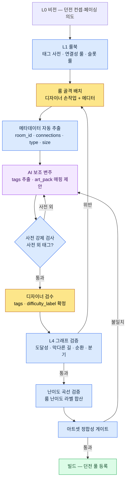

# 7.1 절차적 레벨 디자인 마스터

던전 47번 룸의 출구가 막혀 있었다. 빌드는 통과했고, QA도 통과했다. 사용자가 보스 룸 직전에서 벽을 보고 서 있는 스크린샷이 커뮤니티에 올라온 건 라이브 사흘째였다. 그 룸은 두 분기 전에 손으로 만든 룸을 복사해 붙인 것이었고, 복사하는 과정에서 동쪽 통로 하나가 연결 정보 없이 비주얼만 남았다. 누구도 그걸 검증하지 않았다. 검증할 도구가 없었다.

이 챕터는 그 사고가 빌드 단계에서 자동으로 차단되는 구조를 만드는 이야기다. 핵심은 공간을 그리는 손재주가 아니라, 공간에 붙는 데이터를 룰로 운영하는 방식에 있다.

---

레벨 디자인의 작업장은 도면실에 가깝다. 도면 한 장 한 장은 사람 손에서 나오지만, 도면 사이의 일관성·재사용·검증은 도면 캐비닛의 운영 규칙이 결정한다. 손으로 그린 던전 한 개는 누구나 만든다. 던전 100개를 일관된 난이도 곡선과 막다른 길 없는 그래프로 운영하는 건 손재주가 아니라 시스템의 문제다.

저자가 디자인 디렉터로 일하는 프로젝트 A(국내 + 동남아 타깃 MMORPG, 중규모(10\~50인) 팀, 모바일 우선)에서 이 시스템의 이름은 `Procedural_Level_Design_Master`라는 한 개의 문서다. 이 챕터는 그 문서가 무엇을 통합하고, AI가 어디까지 손을 대고, 어디서 멈추는지를 다룬다. 매 런마다 던전이 새로 생성되는 모바일 로그라이트 RPG의 기획을 리드하며 절차적 공간을 룰로 운영해 본 경험이, 이 장의 바탕에 깔려 있다.

## 7.1.1 두 갈래 — 공간을 만들 것인가, 공간의 메타데이터를 운영할 것인가

레벨 자동화는 두 방향으로 갈린다. 하나는 공간 자체를 절차적으로 생성하는 것이다. BSP 분할(Binary Space Partitioning, 공간을 재귀적으로 이등분해 룸을 배치하는 고전 기법), wave function collapse, 드렁큰 워크 그리드 같은 전통 PCG(Procedural Content Generation)가 여기에 속한다. 다른 하나는 공간의 메타데이터 — 룸 태그·연결성·난이도 라벨·이벤트 슬롯 — 를 운영하는 것이다.

전통 PCG는 첫 번째에 강하다. 로그라이크나 샌드박스처럼 "매 판마다 새로운 맵"이 게임성의 핵심인 장르에서는 첫 번째가 정답이다. 그런데 MMORPG는 다르다. 사용자가 같은 던전을 수십 번 돈다. 동선이 외워질 만큼 돈다. 그래서 던전은 손으로 다듬은 고정 공간이어야 하고, 자동화가 들어갈 자리는 공간 자체가 아니라 **그 공간을 운영 가능하게 만드는 메타데이터**다.

메타데이터가 왜 운영의 척추인지는 산출물별로 보면 분명하다.

| 산출물 | 메타데이터가 없으면 |
|---|---|
| 던전 풀 수십 개 | 어느 룸이 어디 있는지 검색 불가, 재사용 불가 |
| 난이도 곡선 검증 | 룸별 난이도 라벨이 없어 곡선을 그릴 수 없음 |
| 퀘스트·보스 위치 자동 배치 | 이벤트 슬롯 메타가 없어 수동 좌표 입력 |
| 아트 팀 동기화 | 룸 타입 → 아트셋 매핑이 없어 비주얼 불일치 |
| 사용자 동선·체류 시간 측정 | 룸 ID 기반 텔레메트리 불가 |

메타데이터 없는 던전은 빌드는 되지만 운영이 안 된다. 책은 가득한데 색인이 없는 도서관과 같다. 이 챕터가 "공간 메타데이터 운영"에 집중하는 이유다.

## 7.1.2 마스터 문서는 무엇을 통합하는가

`Procedural_Level_Design_Master`는 네 개의 표준을 한 문서에 묶는다. 룸 메타데이터 양식, 룸 태그 사전, 연결성 룰, 검증 체크리스트다. 이 네 개가 흩어져 있을 때 무슨 일이 벌어지는지부터 보자. 디자이너 다섯 명이 각자 다른 파일에서 양식을 참조하면, `type` 필드를 누구는 `combat`, 누구는 `Combat`, 누구는 `battle_room`이라고 적는다. 검색이 깨지고, 통계가 깨지고, 결국 자동화가 깨진다.

이 네 표준은 Layer로 정렬하면 각자의 자리가 분명하다. 양식·사전·룰은 생성을 지배하는 룰북(L1)에, 생성된 룸 본문은 콘텐츠(L2)에, 시트 값은 데이터(L3)에, 검증은 빌드·QA 게이트(L4)에 있다.

<svg viewBox="0 0 720 300" xmlns="http://www.w3.org/2000/svg" font-family="sans-serif" font-size="13">
  <rect x="20" y="20" width="680" height="44" rx="6" fill="#1e3a5f" stroke="#0f1f33"/>
  <text x="36" y="40" fill="#fff" font-weight="bold">L0 비전</text>
  <text x="120" y="40" fill="#cfe2ff">레벨 컨셉·페이싱 의도 (불변 앵커, 생성·검증에 매번 주입)</text>
  <text x="120" y="56" fill="#9fc0e8" font-size="11">— art_pack 톤, 난이도 의도</text>

  <rect x="20" y="76" width="680" height="44" rx="6" fill="#2a5d3a" stroke="#173a22"/>
  <text x="36" y="96" fill="#fff" font-weight="bold">L1 시스템</text>
  <text x="120" y="96" fill="#d6f5df">룰북 — 룸 메타 양식 · 태그 사전 · 연결성 룰</text>
  <text x="120" y="112" fill="#a8dcb8" font-size="11">— Master 문서가 묶는 자리</text>

  <rect x="20" y="132" width="680" height="44" rx="6" fill="#5d4a2a" stroke="#3a2e17"/>
  <text x="36" y="152" fill="#fff" font-weight="bold">L2 콘텐츠</text>
  <text x="120" y="152" fill="#f5e6cf">메타데이터가 부착된 룸 본문 (생성·다듬어진 공간)</text>

  <rect x="20" y="188" width="680" height="44" rx="6" fill="#4a2a5d" stroke="#2e173a"/>
  <text x="36" y="208" fill="#fff" font-weight="bold">L3 데이터</text>
  <text x="120" y="208" fill="#ead6f5">룸 크기·연결 시트·이벤트 슬롯 ID·적 데이터</text>

  <rect x="20" y="244" width="680" height="44" rx="6" fill="#5d2a2a" stroke="#3a1717"/>
  <text x="36" y="264" fill="#fff" font-weight="bold">L4 빌드·QA</text>
  <text x="120" y="264" fill="#f5d6d6">그래프 검증 · 난이도 곡선 검증 · 아트셋 정합성 게이트</text>
</svg>

마스터 문서가 네 표준을 통합한다는 말은 "본문을 한 파일에 몰아넣는다"가 아니라 "L1 자리에 룰을 모은다"는 뜻이다. 그래서 뒤에 나올 자동화가 Layer 경계 위에 얹힐 수 있다(분리가 무너지면 무슨 일이 벌어지는지는 7.1.11에서 다룬다).

## 7.1.3 룸 메타데이터 양식 — 자동화가 붙는 입력 자리

룸 하나는 다음 양식을 따른다. 이 양식이 자동화의 입력 인터페이스다.

```yaml
room_id: dungeon_021_room_07
dungeon: dungeon_021_silvermark_library
type: combat_room          # combat / puzzle / lore / safe / boss
size: medium               # small / medium / large
difficulty_label: hard_for_level_28
tags: [scholar_theme, vertical_layout, water_hazard]
connections:
  - target_room: dungeon_021_room_06
    type: door
    direction: south
  - target_room: dungeon_021_room_08
    type: passage
    direction: east
event_slots:
  - slot: enemy_spawn_1
    constraints: [scholar_enemy, level_28]
  - slot: lore_object_1
    constraints: [scholar_lore]
movement_complexity: 4     # 1~5
estimated_clear_time_sec: 90
art_pack: scholar_library_v2
```

각 필드는 한 개 이상의 자동화 소비처를 가진다. `type`은 던전 풀 통계와 난이도 계산에, `tags`는 검색·재사용·아트셋 매핑에, `connections`는 그래프 검증(막다른 길 검사)에, `event_slots`는 퀘스트·보스 자동 배치에 쓰인다. 소비처가 없는 필드는 양식에 넣지 않는다. 입력 비용만 늘고 가치가 없기 때문이다.

## 7.1.4 룸 태그 사전 — 작고 직교하게

태그는 메타데이터의 검색 키다. 무한 증식하면 검색이 깨진다. 서랍에 라벨이 200개 붙으면 무엇이 어디 있는지 찾을 수 없다. 그래서 5개 카테고리 × 카테고리당 약 6개 enum, 합쳐서 약 30개로 운영한다.

| 카테고리 | enum 수 | 예 |
|---|---|---|
| theme | 8 | scholar_theme, ruins_theme, forest_theme … |
| layout | 5 | vertical_layout, horizontal_corridor, open_arena … |
| hazard | 6 | water_hazard, fire_hazard, falling_hazard … |
| interaction | 4 | puzzle_required, lever_activation … |
| narrative | 7 | flashback_trigger, dialogue_zone … |

한 룸에 태그 5개를 넘기지 않는다. 정상은 3\~4개다. 신규 태그를 추가하려면 네 단계 게이트를 통과해야 한다. 분기당 5룸 이상 사용 후보일 것, 기존 태그 조합으로 표현 불가일 것, 검색·아트셋 매핑 활용이 명확할 것, 운영 1개월 후에도 5룸 유지될 것. 마지막 조건이 핵심이다. 임시로 만든 태그가 한 번 쓰이고 버려지면 사전이 오염된다.

## 7.1.5 절차적 레벨 파이프라인 — 룰북에서 검증까지

지금까지의 표준이 한 흐름으로 어떻게 연결되는지, 그 연결선이 이 챕터가 떠받치는 골격이다. 룰북에서 시작해 AI 보조 변주를 거쳐 가드레일 검증으로 끝나는 파이프라인이다.



이 파이프라인의 세 가지 성격을 짚어 둔다. 첫째, 룰북(L1)이 모든 생성의 상류에 있다. 둘째, AI는 룰북이 정의한 사전 안에서만 변주한다 — F 게이트가 사전 외 출력을 되돌려보낸다. 셋째, 검증(H·I·J)이 빌드 직전 게이트로 고정되어 있어, 위반은 코드로 차단되지 사람의 주의력에 의존하지 않는다. 47번 룸 사고는 H 게이트가 없어서 일어난 일이다.

## 7.1.6 연결성 룰 — 그래프로 검증하는 가드레일

룸 메타의 `connections` 필드는 던전 전체를 하나의 방향 그래프로 만든다. 그래프가 되면 검증은 자동이다.

| 검사 | 위반 시 처리 |
|---|---|
| 시작 룸 → 보스 룸 도달 가능 | 빌드 실패로 차단 |
| 막다른 길 (출구 1개 + non-safe_room) | alert — 디자이너 검토 |
| 양방향 연결 정합성 (A→B 있는데 B→A 없음) | 자동 보정 |
| 순환 길이 — 2\~3룸짜리 짧은 루프 | alert |
| 분기 폭 — 동시 4개 이상 분기 | 디자이너 검토 |

측정 스크립트는 다음 형태다. 표준 그래프 알고리즘(최장 경로·평균 출차수·루프 카운트·최단 경로) 위에 던전 어휘를 입힌 얇은 래퍼다.

```python
# level_graph_metrics.py
def measure(dungeon):
    graph = build_graph(dungeon.rooms)
    return {
        "depth":            longest_path_length(graph),
        "branching_factor": avg_out_degree(graph),
        "loop_count":       count_loops(graph),
        "dead_ends":        count_dead_ends(graph),
        "boss_reachability": shortest_path(graph.start, graph.boss),
    }
```

다섯 지표가 다른 던전과 비교 가능한 형태로 출력된다. 던전 풀의 다양성 지표로 쓴다. 다만 지표가 다양하다고 던전이 재밌다는 뜻은 아니다. 지표는 사고 차단용이지 재미 보장용이 아니다. 막다른 길 0건이 재미를 보장하지 않는다. 재미는 디자이너의 인사이트에서 나오고, 그래프 검증은 그 인사이트가 사고에 묻히지 않도록 바닥을 받쳐줄 뿐이다.

## 7.1.7 워크드 예제 — tags 추출을 AI에게 맡기고, 거부하고, 재요청하다

자동화 중 사람이 가장 자주 손을 떼고 싶어 하는 부분이 `tags` 입력이다. 룸 100개에 태그를 다는 건 지루하고, 룸 스크린샷만 보면 사람도 헷갈린다. 반복되고 판정 기준이 명확한 이런 일이야말로 AI가 초안을 떠받치기 좋은 자리다. 이 절은 그 작업을 실제로 돌렸던 워크플로를 — 프롬프트, AI의 거부당한 출력, 사람의 재요청까지 — 가공 없이 펼친다.

**1차 프롬프트:**

```
[입력]
- 룸 스크린샷: (첨부)
- 룸 면적: 18m × 12m, 천장 높이 9m (수직 2층 구조)
- 배치된 적: scholar_phantom × 3, water_elemental × 1
- 인접 룸 type: lore_room(서쪽), combat_room(동쪽)
- 룸 안에 얕은 물웅덩이 있음

이 룸에 맞는 태그 3~5개를 아래 사전에서만 골라 줘. 사전 밖 태그는 만들지 말고,
태그 enum만 콤마로.

[태그 사전 30개]
theme: scholar_theme, ruins_theme, forest_theme, cave_theme,
       crypt_theme, swamp_theme, mechanical_theme, celestial_theme
layout: vertical_layout, horizontal_corridor, open_arena,
        maze_layout, bridge_layout
hazard: water_hazard, fire_hazard, falling_hazard,
        poison_hazard, crush_hazard, dark_hazard
interaction: puzzle_required, lever_activation, key_gate, hidden_passage
narrative: flashback_trigger, dialogue_zone, lore_object_zone,
           ambush_setup, ritual_site, vista_point, rest_anchor
```

**Claude 1차 출력 (날것 그대로):**

```
scholar_theme, vertical_layout, water_hazard, ambush_setup, two_story_layout
```

여기서 두 가지 문제가 그대로 드러난다. 하나는 `two_story_layout`이 사전에 없는 태그라는 점이다. 모델이 "수직 2층 구조"라는 입력에 끌려 사전 밖 단어를 만들어냈다. 또 하나는 태그가 5개로 상한에 닿았는데, `vertical_layout`과 `two_story_layout`이 의미상 겹친다는 점이다. layout 카테고리에서 두 칸을 쓴 셈이다.

**사람의 거부 판단.** `two_story_layout`은 사전 강제 위반이므로 자동 거부 대상이다(파이프라인 F 게이트). `ambush_setup`은 판단이 갈린다 — 적 3마리가 배치돼 있지만 스크린샷상 매복 구도인지, 단순 전투 룸인지 모호하다. 이건 모델이 과잉 해석했을 가능성이 있다. 인접 룸이 둘 다 lore/combat이라 서사적 매복 트리거의 근거가 약하다. 거부.

**2차 재요청:**

```
two_story_layout은 사전에 없고 vertical_layout이랑 겹쳐. 빼.
ambush_setup도 빼 — 적 있다고 매복은 아니야.
// (의도: narrative 태그는 서사 의도가 명시될 때만, 단순 전투는 type으로 이미 표현됨)
빈 자리 굳이 안 채워도 돼. 3~4개가 정상이야. 다시 태깅해 줘.
```

**Claude 2차 출력:**

```
scholar_theme, vertical_layout, water_hazard
```

이번엔 3개로 줄었고, 전부 사전 안에 있고, 카테고리 중복이 없다. 사람은 이 결과를 받아들였다. 룸 양식의 `tags: [scholar_theme, vertical_layout, water_hazard]`가 이렇게 확정된다.

이 워크드 예제의 교훈은 두 줄이다. 첫째, AI는 입력의 한 디테일("2층")에 과적합해 사전 밖으로 나간다 — 사전 강제 게이트가 코드 레벨에서 이걸 잡아야 한다. 둘째, AI는 빈 자리를 채우려는 경향이 있다 — "굳이 채우지 마라"를 명시하지 않으면 5칸을 다 메우려 든다. 두 실패 모두 흔하고, 두 처방 모두 프롬프트가 아니라 룰북(사전 + 상한)에서 강제돼야 안정적이다.

## 7.1.8 메타데이터 양산 — 누가 채우고 누가 검수하는가

디자이너가 룸 1개 메타를 손으로 채우면 5\~10분이 든다. 던전 1개(20\~30룸)면 2\~5시간, 던전 100개면 200\~500시간이다(저자 추정, 미검증 — 룸당 평균 입력 시간 × 룸 수로 환산한 상한치). 전부 손으로 채우면 디자이너는 메타데이터 입력 노예가 된다.

그래서 영역별로 채우는 주체를 나눈다.

| 영역 | 채우는 주체 |
|---|---|
| room_id · dungeon · connections | 에디터 자동 추출 (L3) |
| type · size | 룸 면적·연결 수 기반 자동 분류 |
| tags | AI 보조 + 디자이너 검수 (7.1.7) |
| event_slots | 룸 type별 룰북 |
| difficulty_label | 룸 내 적 데이터 합산 자동 계산 |
| art_pack | 룸 type · 던전 theme 매핑 |

디자이너가 손으로 확정하는 건 `tags` 검수와 `difficulty_label` 최종 승인 정도다. 나머지는 도구가 채우고 사람은 검수한다. 자동화의 목적은 디자이너를 입력에서 빼내 페이싱·시그니처 룸·재활용 정책 판단으로 돌려보내는 것이다.

## 7.1.9 룸 재활용과 그 함정

마스터 표준의 가장 큰 효과는 룸 재활용이다. 태그로 검색 가능한 룸 30개가 있으면 던전 5\~10개를 조합으로 만들 수 있다. 그런데 재활용 비율이 높아지면 던전이 식상해진다. 그래서 재활용에는 가드레일을 함께 둔다.

| 가드레일 | 정의 |
|---|---|
| 한 룸은 최대 5개 던전에 출연 | 출연 빈도 자동 추적 |
| 두 번째 출연 시 시각 변주 강제 | 라이트·소품 변경 |
| 보스 룸·시그니처 룸 재활용 금지 | flag로 강제 |
| 재활용 룸의 부정 피드백 추적 | 사용자 텔레메트리 |

재활용은 비용을 줄이는 수단이지 목적이 아니다. 재활용률 자체를 KPI로 삼는 순간 사용자 체험이 단조로워진다. 0%(모든 룸 신규)면 양산 비용이 폭발하고, 70%를 넘으면 던전들이 서로 구별되지 않는다. 경험상 30\~40% 구간이 비용과 다양성의 균형점이다(방향성 관찰, 정밀 임계치는 프로젝트마다 다름).

## 7.1.10 흔한 실패와 처방

| 패턴 | 처방 |
|---|---|
| 메타 양식을 5인이 5가지로 해석 | Master 문서로 L1 통합 |
| 태그를 50\~100개로 증식 | 30개 사전 + 4단 게이트 |
| 막다른 길 검사 없이 빌드 | 그래프 검증을 빌드 게이트로 |
| 디자이너가 모든 메타 손작업 | 에디터 추출 + AI 보조 |
| AI가 사전 밖 태그 생성 | 사전 강제 게이트로 자동 거부 |
| 재활용 0% 또는 70%+ | 30\~40% 구간 + 변주 가드레일 |

## 7.1.11 Layer 분해는 절차적 레벨 생성의 전제다

지금까지 룰북·생성·검증으로 풀어 둔 7.1.2\~7.1.6의 구조 자체가 Layer 분해의 결과물이다. Layer 분해가 절차적 생성·자동화의 전제라는 일반 논제(L0 앵커 → L1 룰북 → L2 본문 → L3 수치 → L4 게이트, 한 덩어리면 생성이 무너진다)는 §6.6에서 다뤘다. 여기서는 그것을 레벨 메타데이터 운영에 적용한다.

이 분리가 없으면 룸 배치·BSP·페이싱·서사 트리거가 한 파일에 섞이고, 룸 한 칸을 옮길 때마다 페이싱 의도·이벤트 슬롯·연결성 그래프가 동시에 망가진다. 도면실·자재 창고·검수실이 한 책상에 쌓여 있어, 도면 한 장을 빼면 자재 송장과 검수표가 같이 빠지는 상황이다. 그래서 7.1.7의 AI 보조가 작동한 것도 Layer 덕분이다. 룸 ID·연결성은 에디터(L3 자동 추출)에서, 태그는 AI(L1 사전 강제)에서, difficulty_label은 합산(L3→L4)에서 채워진다. 자동화는 Layer 경계 위에 얹히지, 한 덩어리 위에 얹히면 첫 분기 안에 사고가 폭증해 도구 자체가 폐기된다.

다만 처음부터 다섯 칸 서랍을 완벽히 갖춰야 한다는 뜻은 아니다. 분리는 점진적으로, 인터페이스는 좁게가 원칙이다. 첫 분기에는 L1 룰북(태그 사전 + 연결성 룰)과 L3 시트(룸 메타 시트)만 분리해도 자동화가 들어올 자리가 생긴다. L0 페이싱 의도와 L4 검증 게이트는 분기를 거치며 채운다. 표준이 통일돼야 자동화가 들어올 자리가 생기고, 자동화가 들어올수록 디자이너는 룸 한 칸의 수작업이 아니라 페이싱·시그니처·재활용 판단에 집중하게 된다.

---

### 이 챕터의 핵심 메시지

- 레벨 자동화의 새 자리는 공간 자체가 아니라 공간 메타데이터 운영에 있다.
- 검증은 사람 주의력이 아니라 빌드 게이트로 고정해야 사고가 라이브로 새지 않는다.
- AI 변주는 룰북이 정의한 사전 안에서만 허용하고 사전 밖 출력은 코드로 거부한다.

---

## 따라하기

**setup.** 던전 한 개를 골라 룸마다 `room_id · type · connections · tags` 네 필드만 가진 YAML 시트를 만드세요. 태그는 5 카테고리 약 30개 enum 사전을 먼저 종이 한 장에 고정합니다.

**prompt.** 룸 스크린샷 + 면적 + 적 종류 + 인접 룸 type을 넣고 "이 사전에서 태그 3\~5개만 골라라, 사전 밖 태그 금지, 빈 자리 채우지 마라"로 요청하세요(7.1.7 프롬프트 그대로).

**verify.** (1) AI 출력에 사전 밖 태그가 있으면 거부하고 재요청하세요. (2) `connections`로 그래프를 만들어 시작→보스 도달성과 막다른 길을 검사합니다 — 위반이 하나라도 나오면 그 룸은 빌드 불가로 표시하세요.

### 1인 축소판

도구 인프라가 없는 1인 개발자라면, 마스터 문서를 마크다운 한 장으로 시작하세요. 태그 사전 30줄, 연결성 룰 5줄, 검증 체크리스트 5줄이면 충분합니다. 그래프 검증은 룸 10개 이하라면 종이에 화살표를 그려 막다른 길만 눈으로 확인해도 효과의 80%가 나옵니다. 핵심은 도구가 아니라 "룸에 데이터를 붙이고, 그 데이터를 룰로 검사한다"는 습관 자체입니다. 도구는 룸 50개를 넘어 손으로 검사하기 버거워질 때 붙이면 됩니다.

### 다음 챕터 미리보기

- 7.2 BehaviorTree 에디터 — 레벨의 인접 영역인 AI 행동 트리를 룰북·메타데이터 기반으로 운영
