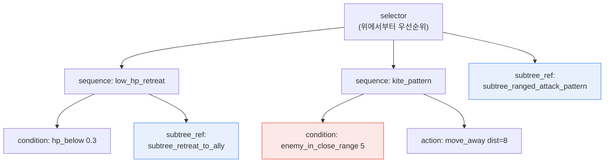
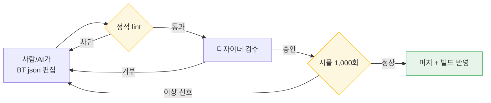

# 7.2 BehaviorTree 에디터 — 사람과 AI가 함께 BT json을 편집하고 검증하는 워크드 트랜스크립트

견습 마법사 한 마리가 플레이어에게 달라붙어 칼을 휘두르고 있었다. 원거리 마법 캐스터로 설계한 NPC였다. HP는 종잇장이고 근접에서는 한 대만 맞아도 죽는데, 그놈은 거리를 벌릴 생각이 없었다. 빌드 로그에는 아무 에러도 없었다. 에디터에서 BehaviorTree를 다시 열어 봐도 노드는 멀쩡하게 연결돼 있었다. 한 시간을 들여다본 끝에 원인을 찾았다. 후퇴 분기의 거리 조건이 `5`가 아니라 `0.5`로 들어가 있었다. 5미터 안으로 들어오면 도망쳐야 하는데, 0.5미터 — 즉 거의 코앞이 아니면 후퇴 분기가 발동하지 않았던 것이다.

숫자 하나였다. 그래픽 노드 에디터에서는 그 숫자가 노드 안쪽 패널을 펼쳐야만 보였고, 변경 이력에는 남지 않았다. 누가 언제 그 값을 바꿨는지 추적할 방법이 없었다. 그날 이후로 저자의 프로젝트 A는 BehaviorTree를 그래픽이 아니라 json으로 다루기 시작했다. 이 챕터는 그 json을 사람과 AI가 함께 편집하고, 기계가 자동으로 검증하는 한 사이클의 기록이다.

---

## 7.2.1 BT(BehaviorTree, 행동 트리)가 손에서 빠져나가는 지점

BehaviorTree는 적 NPC의 전투·이동·반응을 정의하는 사실상의 표준 구조다. 선택자(selector)가 우선순위대로 분기를 시도하고, 시퀀스(sequence)가 조건과 액션을 순서대로 묶는다. 구조 자체는 단순하다. 문제는 규모다.

저자의 프로젝트 A에서 적 NPC 한 체의 BT는 대략 50~200개 노드로 구성됐고, 운영 대상 NPC는 100체를 넘겼다. 곱하면 BT 노드 총량이 수만 단위가 된다. 이 규모에서 "이 후퇴 패턴을 바꾸면 어느 NPC가 영향을 받지?"라는 질문에 사람이 답할 수 없게 되는 순간이 온다. 책상 위에 노트 백 권이 펼쳐져 있는데, 첫 권의 한 줄을 고치면 나머지 아흔아홉 권의 어디가 번지는지를 눈으로 좇는 일과 같다.

저자가 그래픽 BT에서 json으로 넘어가며 요구한 것은 네 가지였다.

<svg viewBox="0 0 720 250" xmlns="http://www.w3.org/2000/svg" font-family="sans-serif">
  <rect x="0" y="0" width="720" height="250" fill="#fafafa" stroke="#ddd"/>
  <rect x="30" y="30" width="300" height="80" rx="8" fill="#e8f0fe" stroke="#4285f4"/>
  <text x="180" y="58" text-anchor="middle" font-size="15" font-weight="bold" fill="#1a73e8">텍스트로 저장 (json)</text>
  <text x="180" y="82" text-anchor="middle" font-size="12" fill="#444">git diff로 변경 한 줄까지 추적</text>
  <text x="180" y="100" text-anchor="middle" font-size="12" fill="#444">"숫자 하나" 사고가 이력에 남음</text>

  <rect x="390" y="30" width="300" height="80" rx="8" fill="#e6f4ea" stroke="#34a853"/>
  <text x="540" y="58" text-anchor="middle" font-size="15" font-weight="bold" fill="#188038">노드 메타데이터 표준화</text>
  <text x="540" y="82" text-anchor="middle" font-size="12" fill="#444">category·tags로 검색·재사용</text>
  <text x="540" y="100" text-anchor="middle" font-size="12" fill="#444">"비슷한 BT 찾기"가 한 줄 질의</text>

  <rect x="30" y="140" width="300" height="80" rx="8" fill="#fef7e0" stroke="#fbbc04"/>
  <text x="180" y="168" text-anchor="middle" font-size="15" font-weight="bold" fill="#b06000">subtree 인용 (참조 재사용)</text>
  <text x="180" y="192" text-anchor="middle" font-size="12" fill="#444">공통 패턴 1개를 다수 BT가 공유</text>
  <text x="180" y="210" text-anchor="middle" font-size="12" fill="#444">복붙 대신 한 곳 수정 → 일괄 반영</text>

  <rect x="390" y="140" width="300" height="80" rx="8" fill="#fce8e6" stroke="#ea4335"/>
  <text x="540" y="168" text-anchor="middle" font-size="15" font-weight="bold" fill="#c5221f">변경 영향 자동 가시화</text>
  <text x="540" y="192" text-anchor="middle" font-size="12" fill="#444">subtree 수정이 어느 BT에 닿는지</text>
  <text x="540" y="210" text-anchor="middle" font-size="12" fill="#444">사람의 추정 대신 스크립트가 산출</text>
</svg>

상용 게임 엔진의 내장 BT 에디터는 통합이 편하고 시각적 디버깅이 강하다. 다만 이진(binary) 자산으로 저장되는 경향이 있어 텍스트 diff와 변경 영향 추적이 약하다. 저자의 프로젝트 A는 운영 BT가 100체를 넘는 라이브 게임을 전제했기 때문에 별도 json BT 포맷과 에디터를 자체 개발하는 쪽을 골랐다. 분명히 해 두자. 이건 모든 팀의 정답이 아니다. 운영 BT가 50체 미만이면 엔진 내장 에디터를 그대로 쓰는 편이 거의 항상 더 싸다. 자체 개발의 정당화는 이 챕터 끝에서 다시 다룬다.

---

## 7.2.2 BT json — 한 마리 적의 행동을 텍스트로

먼저 결과물의 모양을 본다. 아래는 학자 길드 원거리 지원형 NPC의 BT 일부다. 핵심은 두 가지다. 모든 행동이 텍스트라 git이 한 줄 단위로 추적할 수 있다는 것, 그리고 공통 패턴을 `subtree_ref`로 인용한다는 것.

```json
{
  "bt_id": "bt_scholar_archer_v3",
  "category": "ranged_combatant",
  "tags": ["scholar_faction", "ranged", "support"],
  "description": "학자 길드 원거리 지원형. 거리 유지 + 후퇴 우선.",
  "root": {
    "type": "selector",
    "children": [
      {
        "type": "sequence",
        "name": "low_hp_retreat",
        "children": [
          {"type": "condition", "fn": "hp_below", "param": 0.3},
          {"type": "subtree_ref", "id": "subtree_retreat_to_ally"}
        ]
      },
      {
        "type": "sequence",
        "name": "kite_pattern",
        "children": [
          {"type": "condition", "fn": "enemy_in_close_range", "param": 5},
          {"type": "action", "fn": "move_away", "param": {"distance": 8}}
        ]
      },
      {"type": "subtree_ref", "id": "subtree_ranged_attack_pattern"}
    ]
  }
}
```

이 트리를 그림으로 펼치면 선택자가 위에서부터 세 분기를 시도하는 구조다. 도입부의 그 버그 — `enemy_in_close_range`의 `param`이 `5`냐 `0.5`냐 — 가 json에서는 한눈에 보이는 한 줄이 된다는 점에 주목하자.



| 요소 | 역할 |
|---|---|
| `bt_id` | git diff·변경 추적 키 |
| `category`·`tags` | 검색·재사용 단위 |
| `subtree_ref` | 공통 패턴 인용 (한 곳 수정 → 다수 BT 갱신) |
| `description` | 디자이너·시나리오 작가 공유용 |

붉게 칠한 `enemy_in_close_range 5`가 도입부에서 사람을 한 시간 잡아먹은 그 노드다. json에서는 코드 리뷰 한 번에 잡힌다.

---

## 7.2.3 subtree 라이브러리 — 복붙 대신 인용

100체가 넘는 적의 행동에는 반복되는 덩어리가 있다. "동맹 뒤로 후퇴" "엄폐물로 후퇴" "원거리 공격 패턴" 같은 것들이다. 이걸 BT마다 복사해 넣으면, 후퇴 로직 하나를 고칠 때 백 군데를 손으로 찾아 고쳐야 한다. 그래서 공통 패턴은 별도 subtree 파일로 떼어 두고 `subtree_ref`로 인용만 한다.

```
subtree_library/
├── retreat_patterns/
│   ├── subtree_retreat_to_ally.json
│   ├── subtree_retreat_to_cover.json
│   └── subtree_retreat_random.json
├── attack_patterns/
│   ├── subtree_ranged_attack_pattern.json
│   ├── subtree_melee_combo.json
│   └── subtree_aoe_attack.json
└── reaction_patterns/
    ├── subtree_react_to_ally_death.json
    └── subtree_react_to_player_taunt.json
```

이렇게 두면 "이 subtree를 고치면 누가 영향을 받지?"라는 질문이 사람의 추정이 아니라 스크립트의 출력이 된다. 영향 추적기는 단순하다. 모든 BT를 열어 보고, 해당 subtree를 인용하는 BT의 `bt_id`를 모은다.

```python
# bt_impact_tracker.py
import json, glob

def has_subtree_ref(node, target_id):
    if isinstance(node, dict):
        if node.get("type") == "subtree_ref" and node.get("id") == target_id:
            return True
        for child in node.get("children", []):
            if has_subtree_ref(child, target_id):
                return True
    return False

def find_affected_bts(subtree_id):
    affected = []
    for bt_file in glob.glob("bts/*.json"):
        bt = json.load(open(bt_file, encoding="utf-8"))
        if has_subtree_ref(bt["root"], subtree_id):
            affected.append(bt["bt_id"])
    return affected

# 사용
affected = find_affected_bts("subtree_ranged_attack_pattern")
# → ["bt_scholar_archer_v3", "bt_ranger_v2", "bt_sniper_v1", ...]
```

저자의 프로젝트 A에서는 이 함수를 변경 요청(Pull Request) 단계에 묶어 두었다. 누군가 subtree 파일을 건드리면, 영향 받는 BT 목록이 자동으로 PR 코멘트에 달린다. 리뷰어는 "후퇴 패턴 한 줄 고쳤는데 원거리 적 12체가 전부 바뀐다"는 사실을 머지 전에 본다.

---

## 7.2.4 워크드 트랜스크립트 — AI가 새 BT 초안을 쓰는 한 사이클

여기서부터가 이 챕터에서 가장 무게가 실리는 대목이다. 새 적 NPC "견습 마법사"의 BT 초안을 AI에게 맡기고, 그 출력을 사람이 검증·거부·재요청하는 한 사이클을 다듬지 않고 그대로 옮긴다. 매끄럽게 줄이지 않는 데는 이유가 있다. AI가 첫 출력에서 무엇을 어떻게 틀렸는지, 그 실패의 결이 이 챕터가 전하려는 전부이기 때문이다.

### Step 1 — 사람이 던진 프롬프트 (전문)

```
[적 NPC 컨셉]
학자 길드의 견습 마법사. HP 낮고 마법 데미지 높음.
근접 회피 우선. 동맹 뒤로 후퇴한 뒤 마법 공격.

[category] ranged_combatant

[참고 BT] bt_scholar_archer_v3
(구조 유사. 다만 활 공격 대신 마법 공격으로 교체)

[정의된 함수 enum]
condition: hp_below, enemy_in_close_range, ally_nearby, mana_below
action: move_away, cast_spell, retreat, wait
subtree_ref id (사용 가능 목록):
- subtree_retreat_to_ally
- subtree_ranged_attack_pattern   # 활 기반. 마법용 아님
- subtree_magic_attack_pattern

이 컨셉으로 BT root 노드 json만 짜 줘. subtree_ref 최대한 쓰고 직접 노드는 최소로,
함수는 위 enum 안에서만. 컨셉에 없는 행동은 추가하지 말고. 설명 없이 json만.
```

### Step 2 — Claude의 1차 출력 (가공 없이 그대로)

```json
{
  "bt_id": "bt_scholar_apprentice_v1",
  "category": "ranged_combatant",
  "tags": ["scholar_faction", "magic", "fragile"],
  "description": "학자 길드 견습 마법사. 근접 회피 + 동맹 뒤 후퇴 + 마법 공격.",
  "root": {
    "type": "selector",
    "children": [
      {
        "type": "sequence",
        "name": "low_hp_retreat",
        "children": [
          {"type": "condition", "fn": "hp_below", "param": 0.4},
          {"type": "subtree_ref", "id": "subtree_retreat_to_ally"}
        ]
      },
      {
        "type": "sequence",
        "name": "avoid_melee",
        "children": [
          {"type": "condition", "fn": "enemy_in_close_range", "param": 6},
          {"type": "action", "fn": "move_away", "param": {"distance": 10}}
        ]
      },
      {
        "type": "sequence",
        "name": "mana_recover",
        "children": [
          {"type": "condition", "fn": "mana_below", "param": 0.2},
          {"type": "action", "fn": "wait", "param": {"frames": 120}}
        ]
      },
      {"type": "subtree_ref", "id": "subtree_ranged_attack_pattern"}
    ]
  }
}
```

### Step 3 — 사람의 검증·거부

출력을 받아 lint(다음 절에서 다룬다)에 걸고, 눈으로 읽었다. 세 군데가 걸렸다.

1. **마지막 분기가 틀렸다.** `subtree_ranged_attack_pattern`은 활 기반 공격 패턴이다. enum 주석에 "마법용 아님"이라고 적어 두었는데도 AI가 이름이 비슷한 활 패턴을 가져왔다. 견습 마법사는 `subtree_magic_attack_pattern`을 써야 한다. — **거부.**

2. **컨셉에 없는 행동을 추가했다.** `mana_recover` 분기(`mana_below` → `wait 120frame`)는 컨셉에 한 줄도 없는 행동이다. 프롬프트에 "명시되지 않은 행동 추가 금지"라고 못 박았는데도 AI가 "마법사니까 마나 관리가 자연스럽다"고 판단해 끼워 넣은 것으로 보인다. 그럴듯하지만 명세 위반이다. — **거부.**

3. **후퇴 임계값이 의심스럽다.** `hp_below 0.4`는 참고 BT(`0.3`)보다 후퇴를 빨리 시작한다. 견습 마법사가 더 약한 건 맞으니 의도일 수 있다. 다만 AI가 근거를 댄 적이 없으므로 디자이너가 결정할 사항이다. — **보류, 디자이너 확인.**

### Step 4 — 사람의 재요청

```
세 군데만 고쳐 줘. 마지막 분기 subtree_ranged_attack_pattern은 활 패턴이니
subtree_magic_attack_pattern으로 바꾸고, mana_recover 분기는 컨셉에 없으니 통째로 삭제,
hp_below 0.4는 참고 BT(0.3)로 되돌려 줘 — 0.4로 할 근거 있으면 description에 한 줄로.
나머지는 그대로, json만.
```

### Step 5 — Claude의 2차 출력 (수정본)

```json
{
  "bt_id": "bt_scholar_apprentice_v1",
  "category": "ranged_combatant",
  "tags": ["scholar_faction", "magic", "fragile"],
  "description": "학자 길드 견습 마법사. 근접 회피 + 동맹 뒤 후퇴 + 마법 공격. HP 낮아 후퇴 임계값 0.3 유지(archer와 동일).",
  "root": {
    "type": "selector",
    "children": [
      {
        "type": "sequence",
        "name": "low_hp_retreat",
        "children": [
          {"type": "condition", "fn": "hp_below", "param": 0.3},
          {"type": "subtree_ref", "id": "subtree_retreat_to_ally"}
        ]
      },
      {
        "type": "sequence",
        "name": "avoid_melee",
        "children": [
          {"type": "condition", "fn": "enemy_in_close_range", "param": 6},
          {"type": "action", "fn": "move_away", "param": {"distance": 10}}
        ]
      },
      {"type": "subtree_ref", "id": "subtree_magic_attack_pattern"}
    ]
  }
}
```

2차 출력은 lint를 통과했고, 디자이너 검수에서 `avoid_melee`의 거리 `6`을 archer와 맞춰 `5`로 한 칸 내린 뒤 시뮬레이션 게이트로 넘겼다. 여기서 배울 점은 명확하다. AI는 BT의 골격을 빠르게 채우지만, "이름이 비슷한 잘못된 subtree를 끌어오고" "그럴듯한 추가 행동을 명세 없이 끼워 넣는" 두 가지 사고를 거의 매번 낸다. 이 두 사고는 사람의 눈과 lint 게이트로만 걸린다. 그래서 AI 출력은 초안이지 최종이 아니다.

---

## 7.2.5 자동 lint — 사람이 놓치는 것을 기계가 먼저 잡는다

BT는 사용자 체험에 직결된다. 적이 코앞에서 도망 안 가는 사고가 그대로 출시되면 리뷰 점수로 돌아온다. 그래서 머지 전에 기계가 먼저 검사한다.

| 검사 | 위반 시 |
|---|---|
| 도달 불가 노드 | alert (선택자에서 영영 닿지 않는 분기) |
| 무한 루프 위험 | 차단 (탈출 조건 없는 sequence 반복) |
| `subtree_ref` 대상 미존재 | 차단 |
| 액션·조건 함수가 enum 밖 | 차단 |
| 노드 수 폭증 (>500) | alert (BT 분할 권고) |
| 같은 category 내 BT 응답 시간 편차 | alert (밸런스 회귀 의심) |

마지막 항목이 이 lint의 특이점이다. 같은 `ranged_combatant`로 묶인 BT 다섯이 시뮬레이션 평균 응답 시간이 크게 벌어지면, 그건 누군가 한 체의 밸런스를 모르게 깨뜨렸다는 신호다. 정적 검사가 잡지 못하는 "분위기"를 통계로 잡는 장치다.

정적 lint 다음은 시뮬레이션 검증이다. BT를 실제 게임 빌드 없이 시뮬레이터에서 1,000회 돌려 통계를 뽑는다.

| 측정 | 정상 범위 |
|---|---|
| 평균 생존 시간 (표준 플레이어 상대) | category별 기준값 |
| 공격 패턴 다양성 (엔트로피) | 0.6 이상 |
| 후퇴·접근 행동 비율 | category별 기준값 |
| 행동 1회 평균 소요 frame | 60 frame 이하 |

빌드를 굽지 않고도 5~10분 안에 "이 BT가 너무 빨리 죽는지" "한 가지 행동만 반복하는지"를 본다. 이상 신호가 뜨면 json을 고치고 시뮬을 다시 돌린다. 이 사이클이 일 단위에서 분 단위로 줄어드는 게 json화의 실질 이득이다.



---

## 7.2.6 측정 — 무엇이 줄었나

저자의 프로젝트 A의 도입 전후를 표로 둔다. 절대 수치는 팀 규모·게임 장르에 따라 달라지므로 저자 추정(미검증)이다. 다만 방향과 비율은 실제 운영에서 관찰한 그대로다.

| 항목 | 도입 전 (엔진 내장 BT 직접) | 도입 후 (json + 에디터) |
|---|---|---|
| 새 적 1체 BT 작성 | 1~2일 | 2~4시간 |
| BT 변경 영향 파악 | 추정·경험에 의존 | 자동 (subtree 영향 목록) |
| 변경 후 검증 | 실제 빌드 필요 | 시뮬 5~10분 |
| 적 NPC 100체 운영 | 디자이너 3인 풀타임 | 디자이너 1~2인 |
| 출시 후 BT 사고 (이상 행동) | 분기당 10~15건(저자 추정) | 분기당 2~4건(저자 추정) |

가장 의미 있는 건 마지막 두 줄이 동시에 움직였다는 점이다. 보통 인원을 줄이면 품질이 떨어진다. 여기서는 디자이너 수가 줄면서 사고도 줄었다. 사람이 손으로 추적하던 변경 영향과 검증을 기계가 떠안았기 때문이다. 자동화의 가치는 "빨라짐"보다 이 "줄면서 동시에 좋아짐"에 있다.

---

## 7.2.7 자체 개발이냐, 차용이냐

이 챕터를 읽고 "우리도 json BT 에디터를 만들자"고 결론 내리면 곤란하다. 저자의 프로젝트 A가 자체 개발을 고른 건 특정 조건이 맞아떨어졌기 때문이다.

| 옵션 | 장 / 단 |
|---|---|
| 엔진 내장 BT 그대로 사용 | 통합 쉬움 / json 변환·diff 약함 |
| 외부 BT 라이브러리 차용 | 표준화 이점 / 학습 곡선·커스터마이즈 한계 |
| 자체 json BT 에디터 + 런타임 | 자유도·추적성 최고 / 개발 비용 큼 |

프로젝트 A가 3번을 고른 근거는 네 가지였다.

- diff·git 추적이 필수였다 — 내장 BT는 이진 자산이라 도입부의 "숫자 하나" 사고를 추적할 수 없었다.
- subtree 인용과 자동 영향 추적이 운영 핵심이었다 — 표준 BT 도구에는 약한 기능이다.
- 빌드와 분리된 런타임에서 시뮬레이션 검증을 돌려야 했다.
- AI 보조 작성을 전제했다 — 텍스트(json) 기반이 대형 언어 모델(LLM, Large Language Model)에 압도적으로 친화적이다.

개발 비용은 1~2개월. 운영 BT가 100~300체에 이르고 라이브 운영 기간이 길어야 회수된다. 30~50체 규모에서는 회수가 안 된다. 자체 개발의 투자 회수(ROI, Return On Investment)는 규모와 운영 기간이 둘 다 보장될 때만 나온다는 뜻이다. 작은 팀이라면 이 챕터에서 "json으로 저장한다" "subtree로 인용한다" "AI 출력은 lint+검수 게이트를 통과시킨다"는 원칙만 가져가고, 도구는 내장 에디터나 외부 라이브러리에 얹어 쓰는 편이 옳다.

---

## 7.2.8 흔한 실패

| 패턴 | 처방 |
|---|---|
| BT를 이진 자산으로만 관리 | json으로 저장해 git 추적을 살린다 |
| subtree 없이 BT마다 같은 패턴 복붙 | subtree 라이브러리로 떼어 인용한다 |
| BT 영향 추적을 수작업으로 | 영향 분석 스크립트를 PR에 묶는다 |
| 시뮬 없이 실제 빌드에서만 검증 | 빌드와 분리된 시뮬레이터를 운영한다 |
| AI 출력 BT를 검수 없이 사용 | lint + 디자이너 + 시뮬 3중 게이트를 통과시킨다 |
| 자체 개발 ROI를 재지 않음 | 100체 이상·라이브 운영일 때만 자체 개발한다 |

---

### 이 챕터의 핵심 메시지

- BT를 json으로 저장해야 "숫자 하나" 사고가 git diff에 남고 추적된다.
- subtree 인용과 자동 영향 추적이 100체 운영의 복붙 지옥을 막는다.
- AI는 BT 골격을 빠르게 채우지만, 잘못된 인용과 명세 밖 행동은 사람이 잡는다.

---

## 따라하기

작은 팀이 오늘 시도할 수 있는 최소 사이클입니다.

**setup** — 운영 중인 적 NPC 한 체의 BT를 json으로 손수 적으세요(`bt_id`, `category`, `tags`, `root`). 공통 후퇴·공격 패턴 한 덩어리를 `subtree_library/`로 떼어 `subtree_ref`로 인용합니다.

**prompt** — 비슷한 새 적 한 체를 AI에 맡기세요. 위 워크드 트랜스크립트의 프롬프트 골격(컨셉 + category + 참고 BT + 사용 가능 함수 enum + "명시 안 된 행동 추가 금지" + "json만")을 그대로 쓰면 됩니다.

**verify** — AI 출력을 (1) enum 밖 함수·미존재 subtree를 거르는 lint, (2) 사람 눈, (3) 시뮬 또는 인게임 짧은 검증, 이 세 게이트에 통과시킨 뒤에만 머지하세요. AI가 "이름 비슷한 잘못된 subtree"와 "그럴듯한 명세 밖 행동"을 끼워 넣었는지 반드시 확인하세요.

### 1인 축소판

에디터를 만들 여력이 없다면 도구는 텍스트 편집기와 git, 그리고 30줄짜리 `bt_impact_tracker.py` 한 개면 충분합니다. 내장 에디터로 짠 BT를 json으로 한 번 내보내 git에 올리고, subtree만 별도 파일로 떼어 인용하세요. 영향 추적 스크립트를 커밋 훅에 걸면, 혼자서도 "이 후퇴 패턴을 고치면 어느 적이 바뀌는지"를 추정이 아니라 출력으로 볼 수 있습니다. 이 한 개의 습관만으로 도입부의 "숫자 하나에 한 시간"은 코드 리뷰 한 줄로 줄어듭니다.

---

### 다음 챕터 미리보기

- 7.3 던전·필드 패턴 라이브러리 — 룸 메타데이터와 subtree 패턴을 결합해 레벨을 운영 단위로 묶는다.
