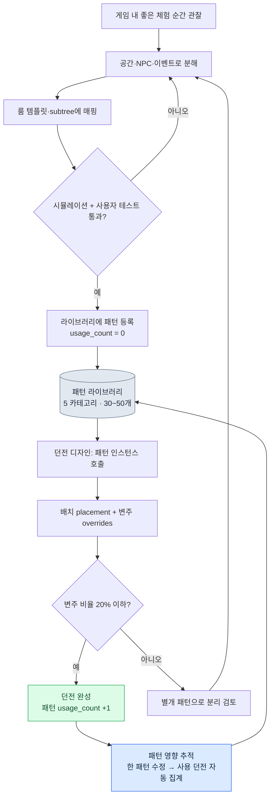

# 7.3 던전·필드 패턴 라이브러리

던전 리뷰 자리에서, 신입 레벨 디자이너가 자기 던전 한 개를 화면에 띄웠다. 좁은 복도, 후방에서 따라붙는 빠른 적, 분기점에서의 회피 결정. 잘 만든 던전이었다. 문제는 그게 우리가 이미 열한 개의 다른 던전에서 만들었던 것과 미묘하게 달랐다는 점이다. 적의 추격 속도, 함정이 터지는 타이밍, 분기점이 나타나는 시점. 어느 것 하나 같지 않았다. 신입은 "추격 던전"이라는 같은 이름의 체험을 만들었다고 믿었지만, 사용자가 받은 감각은 던전마다 제각각이었다.

그날 우리가 결정한 것은 단순했다. "복도 추격"이라는 체험을 한 번 정확히 정의하고, 그 정의를 박제해 두자. 다음에 누가 추격 던전을 만들 때는 처음부터 짜는 게 아니라 그 박제된 정의를 꺼내 쓰자. 이것이 패턴 라이브러리의 시작이었다.

룸이 공간 단위이고 BehaviorTree가 행동 단위라면, 패턴은 공간과 행동과 이벤트를 하나로 묶은 운영 단위다. 패턴 하나가 던전 여러 개에 재사용되면 양산 부담이 줄고, 더 중요하게는 사용자가 받는 체험이 던전 사이에서 일관된다.

---

## 7.3.1 패턴이라는 운영 단위

요리책의 레시피를 떠올려 보면 정확하다. 레시피 한 장에는 재료, 조리 순서, 불 세기, 완성 사진이 함께 들어 있다. 식당이 바뀌어도 같은 레시피를 따르면 같은 맛이 난다. 다만 식당마다 약간의 변주는 허용한다. 패턴도 같다. 공간(룸), 행동(BT subtree), 사건(event), 결과(보상·난이도), 그리고 디자이너의 의도 설명이 한 묶음으로 들어간다.

<svg viewBox="0 0 720 250" xmlns="http://www.w3.org/2000/svg" font-family="sans-serif" font-size="13">
  <rect x="10" y="10" width="700" height="230" fill="#fafafa" stroke="#ccc"/>
  <text x="360" y="35" text-anchor="middle" font-size="15" font-weight="bold">패턴 = 다섯 요소의 묶음</text>
  <rect x="40" y="60" width="120" height="60" rx="6" fill="#e3f0ff" stroke="#5a8fd0"/>
  <text x="100" y="85" text-anchor="middle" font-weight="bold">공간</text>
  <text x="100" y="105" text-anchor="middle" font-size="11">룸 메타 1~3개</text>
  <rect x="180" y="60" width="120" height="60" rx="6" fill="#e9f7e9" stroke="#6aa86a"/>
  <text x="240" y="85" text-anchor="middle" font-weight="bold">행동</text>
  <text x="240" y="105" text-anchor="middle" font-size="11">BT subtree 1~2개</text>
  <rect x="320" y="60" width="120" height="60" rx="6" fill="#fdf3e0" stroke="#d0a05a"/>
  <text x="380" y="85" text-anchor="middle" font-weight="bold">사건</text>
  <text x="380" y="105" text-anchor="middle" font-size="11">event 슬롯</text>
  <rect x="460" y="60" width="120" height="60" rx="6" fill="#fde9ec" stroke="#d05a6e"/>
  <text x="520" y="85" text-anchor="middle" font-weight="bold">결과</text>
  <text x="520" y="105" text-anchor="middle" font-size="11">보상·난이도 룰</text>
  <rect x="600" y="60" width="90" height="60" rx="6" fill="#f0e9fd" stroke="#8a5ad0"/>
  <text x="645" y="85" text-anchor="middle" font-weight="bold">의도</text>
  <text x="645" y="105" text-anchor="middle" font-size="11">설명</text>
  <text x="360" y="160" text-anchor="middle" font-size="13" font-style="italic">"복도 추격 패턴" = 좁은 복도 + 빠른 적 BT + 함정 event + 회피 보상</text>
  <line x1="100" y1="180" x2="620" y2="180" stroke="#999" stroke-width="1"/>
  <text x="360" y="210" text-anchor="middle" font-size="12">→ 한 번 검증되면 던전 5~10개에서 같은 체험을 재생산</text>
</svg>

패턴 하나가 정의되면 던전마다 같은 체험을 일관되게 만들 수 있다. 한 번 검증된 레시피가 여러 식당에서 같은 맛을 내듯이. 다만 같은 레시피라도 식당마다 약간의 변주는 둔다. 이 변주를 어떻게 관리하느냐가 패턴 운영의 절반이다. 뒤에서 다룰 overrides가 그 자리다.

---

## 7.3.2 패턴 조합 흐름

패턴 라이브러리의 핵심은 패턴을 룰북으로 박제한 뒤, 그것을 조합해 던전을 생성한다는 점이다. 디자이너가 빈 화면에서 던전을 짜는 게 아니라, 검증된 패턴을 골라 배치하고 일부만 변주한다.



이 흐름의 왼쪽 절반(관찰→분해→매핑→검증→등록)은 패턴을 만드는 과정이고, 오른쪽 절반(호출→배치·변주→완성→추적)은 패턴을 소비하는 과정이다. 만드는 일은 드물게, 소비하는 일은 자주 일어난다. 라이브러리가 잘 운영되면 이 비대칭이 양산 효율로 이어진다.

---

## 7.3.3 다섯 개의 기본 카테고리

저자의 프로젝트 A는 액션 RPG 계열이라 다섯 개 카테고리로 패턴을 분류한다. 이 분류는 장르에 종속된다. 호러 게임이라면 매복과 서사 비트의 비중이 다를 것이고, 퍼즐 게임이라면 환경 활용 전투가 중심에 올 것이다. 분류 자체를 절대시하지 말고, 자기 게임의 핵심 체험이 무엇인지를 먼저 정한 뒤 카테고리를 잡아야 한다.

| 카테고리 | 핵심 체험 | 예 |
|---|---|---|
| pursuit | 추격·도주 | 복도 추격, 협곡 도주 |
| ambush | 매복·기습 | 룸 진입 시 매복, 시야 사각 매복 |
| puzzle_combat | 환경 활용 전투 | 레버·함정 + 전투 |
| boss_phase | 보스 페이즈 | 보스 페이즈 1\~3 패턴 |
| narrative_beat | 서사 비트 | 회상 트리거, 동료 등장 |

다섯 카테고리 안에서 패턴은 대략 서른에서 쉰 개 사이를 유지한다. 이 숫자에는 이유가 있다. 패턴이 백 개를 넘어가면 디자이너가 라이브러리 전체를 머릿속에 담지 못한다. 그 순간 라이브러리는 검색하는 데 시간이 걸리는 창고가 되고, 디자이너는 차라리 새로 짜는 쪽을 택한다. 라이브러리가 외면받기 시작하면 일관성이라는 원래 목표가 무너진다. 그래서 패턴 개수의 상한을 의식적으로 관리하는 것이 카테고리 설계만큼 중요하다.

---

## 7.3.4 패턴을 박제하는 양식

패턴 하나는 YAML 파일 한 장으로 박제된다. 아래는 프로젝트 A에서 실제로 쓰는 형식을 익명화한 것이다. 회사 고유 자산명과 던전 번호는 가렸지만, 필드 구조와 운영 방식은 그대로다.

```yaml
---
pattern_id: pattern_corridor_pursuit_v2
category: pursuit
description: 좁은 복도에서 빠른 적이 후방 추격, 플레이어는 분기점에서 회피 결정
tags: [horizontal_corridor, scholar_theme_compatible]
rooms:
  - room_template: corridor_long
    size: medium
    connections_required: 2
  - room_template: junction_3way
    size: small
    connections_required: 3
npc_behaviors:
  - subtree_ref: subtree_aggressive_chase
    count: 2
  - subtree_ref: subtree_ranged_support
    count: 1
events:
  - type: trap_activation
    trigger: room_1_midpoint
  - type: enemy_spawn
    trigger: room_1_entry
difficulty_modifier: 1.2   # 일반 룸 대비 1.2배 부담
reward_modifier: 1.3
clear_time_estimate_sec: 60
art_pack_compatible: [scholar_library, generic_dungeon]
narrative_slots:
  - slot: dialogue_during_chase
    constraints: [short_dialogue, fear_emotion]
usage_count: 12            # 12개 던전에서 사용
last_modified: 2026-05-18
deprecated: false
---
```

이 파일이 던전 열두 개의 한 부분씩을 동시에 정의한다. `usage_count: 12`라는 한 줄의 무게가 거기서 나온다. 이 패턴을 수정하면 열두 개 던전이 한꺼번에 영향을 받는다는 뜻이고, 그래서 패턴 파일을 건드리는 일은 룸 하나를 고치는 일과 다른 무게를 가진다.

`subtree_aggressive_chase`나 `subtree_ranged_support` 같은 참조는 7.2의 BehaviorTree 에디터에서 정의한 subtree를 그대로 가리킨다. 패턴이 BT를 직접 품지 않고 참조만 하는 것이 핵심이다. BT를 고치면 그 BT를 참조한 모든 패턴이 자동으로 따라온다. 공간(룸 템플릿)과 행동(subtree)은 각자의 라이브러리에서 관리되고, 패턴은 그 둘을 엮는 조합표 역할만 한다. `clear_time_estimate_sec`이나 `difficulty_modifier` 같은 수치는 저자 환경의 운영값일 뿐 보편 상수가 아니다. 자기 게임의 시뮬레이션과 사용자 테스트로 직접 측정해 채워야 한다.

---

## 7.3.5 패턴을 던전에 인스턴스화하기

던전을 디자인할 때는 패턴을 처음부터 짜지 않는다. 라이브러리에서 호출하고, 어디에 놓을지를 지정하고, 이 던전에서만 다르게 할 부분을 overrides로 덮는다.

```yaml
---
dungeon_id: dungeon_021_silvermark_library
pattern_instances:
  - instance: corridor_pursuit_1
    pattern_id: pattern_corridor_pursuit_v2
    placement:
      - room_id: dungeon_021_room_03
        as: corridor_long
      - room_id: dungeon_021_room_04
        as: junction_3way
    overrides:
      - field: npc_behaviors.0.subtree_ref
        value: subtree_scholar_chase   # 학자 테마 변종
      - field: events.0.trigger
        value: room_1_2nd_third         # 트리거 위치 미세 조정
---
```

여기서 던전 021은 "복도 추격" 패턴을 그대로 쓰되, 추격하는 적을 일반 적에서 학자 테마 변종으로 바꾸고, 함정이 터지는 위치를 복도 중간에서 약간 뒤로 옮겼다. 패턴의 80%는 그대로, 20%만 변주했다.

이 비율에는 운영 경험에서 나온 근거가 있다. 변주가 너무 적으면(0%에 가까우면) 던전들이 서로 베낀 듯 식상해진다. 변주가 너무 많으면(50%를 넘으면) 그건 더 이상 같은 패턴이 아니다. 같은 패턴을 호출했다고 믿지만 실제 체험은 완전히 다른, 신입이 가져왔던 그 던전과 똑같은 상황으로 되돌아간다. 그래서 우리는 운영 규칙을 둔다. 한 인스턴스의 overrides가 패턴 필드의 절반을 넘기면, 그건 변주가 아니라 새 패턴의 신호다. 별개 패턴으로 분리할 때가 된 것이다.

---

## 7.3.6 한 줄을 고치면 어디가 흔들리는가

`pattern_corridor_pursuit_v2`를 수정하면 열두 개 던전이 영향을 받는다. 사람이 이걸 손으로 추적하면 반드시 한두 개를 빠뜨린다. 그래서 패턴과 던전의 관계를 자동으로 훑는 작은 도구를 둔다.

```python
# pattern_impact.py
import json
from glob import glob

def find_dungeons_using(pattern_id):
    affected = []
    for d in glob("dungeons/*.json"):
        dungeon = json.load(open(d, encoding="utf-8"))
        for inst in dungeon.get("pattern_instances", []):
            if inst["pattern_id"] == pattern_id:
                affected.append({
                    "dungeon": dungeon["dungeon_id"],
                    "instance": inst["instance"],
                    "has_overrides": bool(inst.get("overrides")),
                })
    return affected
```

이 함수가 돌려주는 목록에서 핵심은 `has_overrides` 플래그다. overrides가 없는 던전은 패턴을 그대로 쓰므로 자동 갱신해도 안전하다. overrides가 있는 던전은 그 던전만의 변주가 패턴 수정과 충돌할 수 있으므로 사람의 추가 검수가 필요하다.

수정의 무게를 사람이 일일이 느끼는 대신, 도구가 "이번 수정으로 던전 12개가 영향받고 그중 4개는 변주가 있으니 직접 봐야 한다"고 5분 안에 보고하게 만든다. 패턴 변경의 두려움을 줄여주는 것이 이 도구의 진짜 가치다. 영향 범위가 보이지 않으면 디자이너는 패턴을 아예 고치지 않으려 하고, 라이브러리는 고인 물이 된다.

---

## 7.3.7 패턴은 어떻게 태어나는가, 그리고 AI의 자리

여기서 가장 자주 받는 질문을 정면으로 다루겠다. "패턴 작성도 AI에게 시키면 되지 않나요?"

답은 분명하다. 안 된다. 패턴 하나를 작성하는 일은 디자이너의 인사이트가 척추다. 좋은 추격 체험이 무엇인지, 분기점이 왜 거기여야 하는지, 함정이 왜 복도 중간이 아니라 2/3 지점에서 터져야 긴장이 사는지 — 이건 게임을 직접 만지고 사용자 반응을 본 사람의 판단이다. AI에게 패턴을 처음부터 짜게 하면, 모든 패턴이 무난하고 평균적인 형태로 수렴한다. 라이브러리는 "안 틀린 패턴"으로 가득 차지만 "기억에 남는 패턴"은 사라진다.

그렇다고 AI가 할 일이 없는 건 아니다. 패턴 작성의 다섯 단계 중 두 군데에서 AI는 강력한 보조다.

| 단계 | 산출 | AI의 역할 |
|---|---|---|
| 1. 게임 내 좋은 체험 순간 관찰 | 노트 | 디자이너 단독 |
| 2. 그 순간의 공간·NPC·이벤트 분해 | 초안 yaml | 디자이너 단독 |
| 3. 기존 룸 템플릿·subtree에 매핑 | 후보 매핑 | AI 보조 (후보 추천) |
| 4. 시뮬레이션 + 사용자 테스트 | 검증 | AI 보조 (시뮬레이션 실행) |
| 5. 라이브러리 등록 | usage_count = 0 | 디자이너 단독 |

3단계가 AI 보조의 핵심이다. 디자이너가 "좁은 복도에서 빠른 적이 후방 추격"이라는 초안을 적으면, 이미 수십 개씩 쌓인 룸 템플릿과 subtree 라이브러리 중에서 무엇이 이 의도에 맞는지를 사람이 다 뒤지기는 비효율적이다. 여기서 AI에게 매핑 후보를 추천하게 한다. 아래는 실제로 쓰는 프롬프트를 익명화한 것이다.

```
[입력]
- 디자이너의 패턴 초안 yaml (아래 첨부)
- 룸 템플릿 라이브러리 (이름 + 태그 + 크기 목록)
- subtree 라이브러리 (이름 + 행동 요약 목록)

이 패턴을 구현할 룸 템플릿이랑 subtree를 라이브러리에서 골라 추천해 줘.
각각 2~3개씩, 적합도 1~5점이랑 태그·크기 기준 한 줄 근거 붙여서.
라이브러리에 없는 건 지어내지 말고 추천만, 다 3점 이하면 신규 작성 필요하다고 말해 줘.
```

이 프롬프트에 Claude가 실제로 돌려준 출력은 다음과 같았다. 어디서 머뭇거리고 어디서 단언하는지가 그대로 드러나도록, 한 글자도 손보지 않고 옮긴다.

```
룸 템플릿 후보:
1. corridor_long  (적합도 5)
   근거: 태그 horizontal_corridor 일치, size medium이 "좁은 복도" 의도에 부합.
2. corridor_narrow_short  (적합도 3)
   근거: 좁기는 하나 길이가 짧아 추격 거리 확보가 어려움. 분기점 배치 공간 부족.
3. hall_wide  (적합도 1)
   근거: 넓은 홀은 "좁은 복도" 의도와 정반대. 추격 압박감이 살지 않음.

subtree 후보:
1. subtree_aggressive_chase  (적합도 5)
   근거: 후방 추격 행동 정의됨, 이동속도 가중치 있음.
2. subtree_ranged_support  (적합도 3)
   근거: 추격 자체는 아니나 압박 보조용으로 1기 배치 가능.
3. subtree_patrol_basic  (적합도 2)
   근거: 순찰 행동은 추격 의도와 맞지 않음. 트리거 후 추격 전환 노드 없음.

분기점(junction) 룸 템플릿:
라이브러리에서 3way 분기 + small 크기 조건을 동시에 만족하는 항목을
찾지 못했습니다. junction_3way가 가장 근접하나 size 태그가 비어 있어
적합도를 확정할 수 없습니다. 디자이너 확인이 필요합니다.
```

마지막 단락이 이 출력에서 가장 값진 부분이다. AI는 분기점 룸 템플릿에 대해 "확실하지 않다"고 말했고, 없는 답을 지어내지 않았다. 디자이너는 이 보고를 받고 `junction_3way`의 size 태그가 실제로 비어 있다는 사실을 발견했고, 그 메타데이터부터 채웠다. 만약 AI가 빈 태그를 무시하고 적합도 5를 부여했다면, 디자이너는 잘못된 신뢰로 그대로 채택했을 것이다.

이것이 AI 보조의 올바른 형태다. AI는 후보를 펼치고 불확실을 표시하며, 선택과 책임은 디자이너에게 남는다. 매핑 결과 적합도가 모두 낮으면 그때는 새 템플릿을 작성하는 별도 작업이 생기고, 그 작성은 다시 사람의 일이 된다.

> **[방향 표지 — 패턴을 '체험 벡터'로 압축해 본다면 (아직은 시기상조)]** 처방이 아니라 연구 동향으로 읽어 주기 바란다. §7.3.1이 이미 패턴을 '레시피'라 부른다. 한 패턴은 룸 메타·행동 subtree·event·difficulty/reward_modifier·clear_time이 한 묶음인 좌표값에 가깝다. 이 묶음을 '체험 벡터'로 압축하면, 적합도가 다 낮을 때 신규를 짜는 위 흐름을 일일이 뒤지는 대신 압축 공간의 빈 영역으로 잡고, §7.3.8의 deprecated 판정도 근접 중복을 좌표 거리로 보강할 수 있다. 단 세 가지 단서가 붙는다. difficulty/reward_modifier는 §7.3.4 말대로 저자 운영값이라 게임마다 축 스케일이 달라 압축 공간을 그대로 이식할 수 없고, 보간은 패턴 '생성'이 아니라 빈칸 '표지'까지만이며, 그 표지 위에서 패턴을 실제로 짜는 일은 여전히 디자이너 인사이트가 척추라는 이 절의 원칙을 넘지 않는다. 이 발상은 §8.2.7의 차원 벡터 압축과 같은 자리이고 개념 직관은 부록 M에 있다 — 토대가 충분히 쌓인 팀이 몇 년 뒤 들여다볼 영역으로 남겨 둔다.

---

## 7.3.8 쓰지 않는 패턴을 거두는 일

라이브러리는 채우는 것보다 비우는 것이 어렵다. 운영을 1년쯤 하면 만들어 두고 거의 쓰이지 않는 패턴이 쌓인다. 그대로 두면 라이브러리 검색 비용이 올라가고, 디자이너가 패턴을 고를 때 죽은 선택지까지 훑어야 한다. 그래서 정기적으로 거둔다.

| 조건 | 처리 |
|---|---|
| 6개월간 usage_count 증가 0 | deprecated 후보로 분류 |
| 검토 회의에서 폐기 결정 | `deprecated: true` 표시 |
| 기존 사용 던전 | 그대로 보존 (역사적 보존) |
| 신규 던전 | 해당 패턴 사용 금지 |

핵심은 폐기가 삭제가 아니라는 점이다. 이미 그 패턴을 쓰고 있는 던전들은 그대로 둔다. 라이브 서비스에서 동작 중인 던전을 건드리는 것이 새 패턴을 막는 것보다 위험하기 때문이다. `deprecated: true`는 "지금부터 새로 쓰지 말라"는 표지일 뿐, 과거를 지우는 명령이 아니다.

책상 서랍의 안 쓰는 도구를 분기마다 한 번씩 꺼내 정리하듯이, 라이브러리도 분기에 한 번 거두는 일정을 잡아 둔다. 이 일정이 없으면 라이브러리는 한 방향으로만 부풀고, 어느 순간 디자이너가 외면하는 창고가 된다.

---

## 7.3.9 효과를 정직하게 측정하기

저자의 프로젝트 A에서 패턴 라이브러리를 1년 운영하며 관찰한 변화다. 아래 표의 시간 수치는 저자 환경의 추정(미검증)이고, 방향과 상대 비율만 실제로 관찰된 것이다.

| 항목 | 도입 전 | 도입 후 | 비고 |
|---|---|---|---|
| 던전 1개 디자인 시간 | 약 2주 | 약 1주 | 저자 추정, 방향은 명확 |
| 던전 간 체험 일관성 | 분산 큼 | 안정 | 사용자 평가 기반, 정성 |
| 패턴 1개당 사용 던전 평균 | — | 약 8개 | 양산 효율의 핵심 지표 |
| 신규 디자이너 온보딩 | 약 2개월 | 약 3주 | 저자 추정, 가장 큰 체감 효과 |
| 패턴 변경 영향 파악 | 1\~2일 수작업 | 자동 5분 보고서 | pattern_impact.py 도입 효과 |

가장 인상적이었던 변화는 마지막에서 두 번째 줄, 신입 온보딩이다. 패턴 라이브러리는 의도하지 않게 디자인 교과서 역할을 했다. 신입이 "이 게임의 추격 체험은 이렇게 만든다"를 패턴 파일 한 장으로 읽고 이해할 수 있게 되니, 선배가 옆에 붙어 설명하는 시간이 크게 줄었다. 처음 신입이 가져왔던 제각각인 던전 문제가, 라이브러리 자체로 해소된 셈이다.

"패턴 1개당 사용 던전 평균 약 8개"라는 숫자는 곧 같은 패턴을 여덟 번 재사용했다는 뜻이고, 이것이 양산 효율의 정직한 척도다. 다만 이 8이라는 값은 저자 게임의 던전 규모와 패턴 설계에 종속된다. 던전 수가 적거나 매번 다른 컨셉을 요구하는 게임에서는 이 값이 훨씬 작아진다.

---

## 7.3.10 라이브러리를 만들지 않는 결정

마지막으로, 이 장 전체를 뒤집는 이야기를 해야 정직하다. 패턴 라이브러리는 만능이 아니다. 라이브러리를 구축하고 운영하는 비용이 회수되지 않는 환경이 분명히 있다.

| 조건 | 권고 |
|---|---|
| 던전 5개 미만 | 손으로 충분, 라이브러리 불필요 |
| 디자이너 1인 | 머릿속이 곧 라이브러리 |
| 출시 한 번, 라이브 운영 없음 | 재사용 기회 자체가 적음 |
| 매번 완전히 다른 컨셉 | 재사용 비율이 낮아 ROI 미회수 |

라이브러리의 ROI(Return on Investment, 투자 대비 효과)는 세 조건이 함께 갖춰질 때 회수된다. 라이브 운영이 있고, 디자이너가 셋 이상이며, 던전이 스무 개를 넘는 경우다. 라이브 운영 MMORPG가 전형적인 적용 대상인 이유가 여기 있다. 위 표의 어느 줄에 자기 프로젝트가 걸린다면, 라이브러리를 짓기 전에 멈춰서 다시 생각해야 한다. 도구는 문제가 있을 때만 가치가 있고, 던전 다섯 개짜리 프로젝트에 패턴 라이브러리는 문제보다 비용이 크다.

---

## 7.3.11 흔한 실패와 처방

| 증상 | 처방 |
|---|---|
| 패턴이 100개를 넘어 디자이너가 못 외움 | 30\~50개로 정리, 분기마다 deprecated 거두기 |
| 패턴 영향 추적을 손으로 함 (누락 발생) | pattern_impact.py 같은 자동 추적 도구 |
| overrides가 80% 이상 (실질 재사용 아님) | 변주가 너무 큼 → 별도 패턴으로 분리 |
| 패턴 작성을 AI에 통째로 위임 | 작성은 디자이너 인사이트, AI는 3·4단계 보조만 |
| usage_count를 측정하지 않음 | 자동 집계 + 분기 회고에서 검토 |
| 신입에게 라이브러리 설명 없음 | 온보딩 자료에 라이브러리 투어 포함 |

이 표의 두 번째 줄과 네 번째 줄이 가장 자주 발목을 잡는다. 영향 추적을 자동화하지 않으면 디자이너가 패턴 수정을 두려워해 라이브러리가 굳고, 작성을 AI에 위임하면 라이브러리가 평균으로 수렴한다. 두 실패 모두 라이브러리의 생명, 즉 "검증된 체험의 재사용"을 죽인다.

---

## 7.3.12 7부를 닫으며

7부는 레벨 분야를 세 층위로 쌓아 올렸다. 7.1에서 룸 메타데이터와 태그와 연결성의 표준을 세웠고(공간), 7.2에서 JSON 기반 BehaviorTree 에디터와 subtree와 시뮬레이션을 다뤘으며(행동), 이 장에서 그 둘을 이벤트와 함께 묶어 재사용하는 패턴 라이브러리에 도달했다(운영 단위). 공간과 행동을 따로 다루던 운영에서, 같은 자리의 결정이 매주 다른 형태로 흔들리던 그 문제를, 패턴이라는 묶음으로 박제해 해결한 것이 7부 전체의 줄기다.

이 흐름은 Layer 통합 설계와 그대로 맞물린다. 게임 전체의 공간 톤이라는 비전이 위에 있고, 그 아래에 레벨 생성 규칙과 BT 룰이라는 시스템이 있으며, 룸과 BT와 패턴 라이브러리가 콘텐츠 층을 이루고, 던전 인스턴스와 패턴 사용 통계가 데이터로 쌓이며, lint와 시뮬레이션과 사용자 텔레메트리가 빌드·QA에서 이를 검증한다. 패턴 라이브러리는 이 다섯 층 중 콘텐츠 층의 척추이면서, 위로는 시스템 룰을 따르고 아래로는 데이터 통계를 생성하는 연결 고리다.

---

### 이 챕터의 핵심 메시지
- 패턴은 공간·행동·이벤트를 묶은 운영 단위이고, 셋을 따로 다루면 같은 체험이 매주 다르게 흔들린다
- 80% 재사용 + 20% 변주가 권장 비율이고, 변주가 절반을 넘으면 그건 새 패턴의 신호다
- 패턴 작성은 디자이너 인사이트의 자리이고, AI는 매핑 후보 추천과 시뮬레이션 보조까지만이다

### 다음 챕터 미리보기
- 8.1 CombatBalance · CombatFormula 운영 — 밸런스 디자인의 두 문서 분리

---

## 따라하기 — 추격 패턴 하나를 박제하기

### setup
1. 작업 폴더에 `patterns/`와 `dungeons/` 두 디렉터리를 만드세요.
2. 룸 템플릿 이름 목록과 subtree 이름 목록을 각각 텍스트 한 줄씩 적은 파일로 준비하세요. (라이브러리가 없으면 가상의 이름 5개씩으로 시작해도 됩니다.)
3. 위 본문의 `pattern_impact.py`를 그대로 저장하세요.

### prompt
디자이너가 직접 패턴 초안 yaml을 적습니다(이 부분은 사람의 몫). 그다음 AI에게 매핑만 맡기세요. 본문의 매핑 프롬프트를 그대로 쓰되, 입력에 자기 초안과 두 라이브러리 목록을 붙이세요. 핵심 제약 두 줄을 빠뜨리지 마세요.

```
- 라이브러리에 없는 새 템플릿을 지어내지 마세요. 추천만 하세요.
- 적합도가 모두 3 이하이면 신규 작성이 필요하다고 명시하세요.
```

### verify
1. AI가 라이브러리에 없는 템플릿 이름을 지어내지 않았는지 한 줄씩 확인하세요.
2. 적합도 점수에 태그·크기 기준의 근거가 붙어 있는지 보세요. 근거 없는 점수는 신뢰하지 마세요.
3. 패턴을 던전 2개 이상에 인스턴스화한 뒤 `find_dungeons_using("pattern_...")`를 돌려, 그 두 던전이 정확히 잡히는지 확인하세요.

### 1인 축소판
혼자 작은 게임을 만든다면 라이브러리 시스템은 과합니다. 대신 가장 마음에 드는 던전 구간 하나를 골라 그 체험을 yaml 한 장으로 적어 두는 것만 해도 충분합니다. 다음 던전을 만들 때 그 한 장을 열어 복사하고 20%만 고치세요. 패턴 라이브러리의 본질 — 검증된 체험의 재사용 — 은 파일 한 장에서도 작동합니다. 규모가 커지면 그때 카테고리와 추적 도구를 더하면 됩니다.
