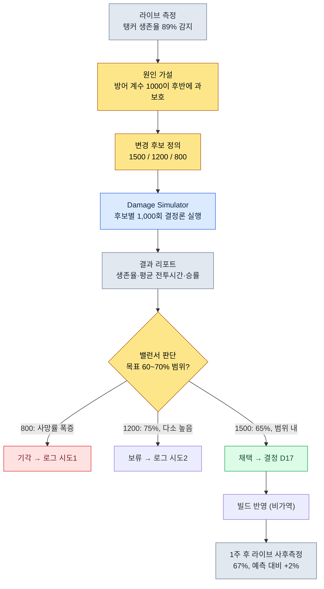

# 8.1 전투 밸런스 공식 — 결정론이라는 룰북의 자리

> **이 장의 학습 목표** (난이도 🟡 실무 · 선행: 사칙연산·표 계산): 전투 밸런스를 공식의 자리와 수치의 자리로 분리하고, 결정론·추적 가능성이라는 두 성질을 근거로 어디까지 AI에 맡기고 어디부터 사람이 룰북으로 잠가야 하는지 구분할 수 있게 된다.

새벽 두 시, 라이브 서버의 탱커 직업 생존율이 89%를 찍었다는 알림이 떴다. 보스를 끝까지 못 잡는 탱커는 없고, 죽지 않는 탱커는 너무 많다. 누군가 손을 댔던 흔적을 찾으려고 데이터 시트를 연다. 방어 계수 한 줄이 보인다. `DEF / (DEF + 1000)`. 이 1000이라는 숫자가 언제, 누구의 손에, 어떤 근거로 1200에서 1000으로 내려갔는지 시트 어디에도 적혀 있지 않다. 채팅 로그를 뒤지고, 빌드 히스토리를 뒤지고, 결국 3년 전 퇴사한 밸런서의 기억에 도달해야 끝나는 추적이 시작된다.

이 장면은 전투 밸런스를 운영해 본 사람이라면 누구나 한 번쯤 겪는다. 그리고 이 장면의 진짜 원인은 그 1000이라는 숫자가 틀렸다는 데 있지 않다. 그 숫자가 **공식**의 자리에 살았는데, 공식이 바뀐 **이력**이 어디에도 없었다는 데 있다. 전투 밸런스 공식은 게임에서 가장 결정론적이어야 하는 영역이고, 가장 추적 가능해야 하는 영역이다. 이 두 성질이 왜 AI를 이 자리에 들이면 안 되는 이유가 되는지가 이 챕터의 척추다.

> **비전공자를 위한 한 줄.** 이 부의 z-score·시뮬레이션·곡선이 낯설어도 괜찮습니다. 가져가실 단 하나는 이것입니다 — **"같은 입력에 항상 같은 출력이어야 하는 규칙(공식)에는 AI를 들이지 않는다."** 결정론이 필요한 자리와 탐색이 필요한 자리를 가르는 이 판단은, 회계 규정·정산 로직·계약 조항처럼 '틀리면 안 되는 규칙'을 다루는 모든 직무에 그대로 옮겨집니다. 수식 자체는 8.1.2부터 천천히 보셔도 됩니다.

---

## 8.1.1 공식은 룰북이다

게임 디자인을 오래 하다 보면 두 종류의 문서가 손에 잡힌다. 자주 바뀌는 문서와, 거의 안 바뀌는 문서다. 전투 밸런스에서 거의 안 바뀌는 쪽이 공식이다. "데미지를 어떻게 계산하는가"는 분기에 한두 번 손대고, "이 캐릭터의 공격력이 몇인가"는 주에 대여섯 번 손댄다. 빈도가 다른 두 흐름을 한 파일에 묶으면, 자주 여닫는 손길에 가끔 여닫는 종이가 찢어진다.

저자가 운영하는 프로젝트 A에서 전투 밸런스는 두 자리로 분리되어 있다. 공식의 자리(여기서 `CombatFormula`라 부른다)와 수치의 자리(`CombatBalance`)다. 공식의 자리에 사는 한 줄을 그대로 인용한다.

```
final_damage = base_damage × dmg_multiplier × (1 − defense_factor) × variation

  base_damage    = skill_base × ATK × skill_coeff
  defense_factor = DEF / (DEF + 1000)
  variation      = uniform(0.95, 1.05)
```

이 공식은 룰북이다. 보드게임의 규칙서를 떠올리면 된다. 규칙서는 "주사위를 굴려 나온 눈만큼 이동한다"라고 쓰지, "이번 판은 운이 좋으면 좀 더 가도 된다"라고 쓰지 않는다. 같은 입력에는 항상 같은 출력. 이게 결정론(determinism)이다. 공격력 180, 방어력 80, 스킬 계수 2.1을 넣으면 언제 어디서 몇 번을 계산하든 같은 데미지가 나와야 한다. 만약 같은 입력에 다른 출력이 나온다면, 그건 밸런스 도구가 아니라 도박 기계다.

이 결정론이라는 한 성질이 AI를 이 자리에 들이면 안 되는 첫 번째 이유다. 잠시 뒤에 다시 본다. 먼저 공식이 룰북답게 어떻게 생겨야 하는지를 보자.

전투 공식의 핵심 영역은 데미지 한 줄로 끝나지 않는다. 적어도 세 줄이 한 묶음으로 산다.

```
# 데미지
final_damage = base_damage × dmg_multiplier × (1 − defense_factor) × variation

# 치명타
crit_damage  = final_damage × crit_multiplier
crit_chance  = base_crit + (LUK × 0.1)            # 상한 50%

# 회복
heal         = base_heal × healing_power × (1 − sickness_factor)
```

세 줄을 자연어가 아니라 코드 블록으로 적는 데에는 이유가 있다. 자연어는 해석의 여지를 남긴다. "방어력이 높을수록 데미지가 줄어든다"라는 문장은 선형으로 주는지, 곡선으로 주는지, 어디서 멈추는지를 말하지 않는다. `DEF / (DEF + 1000)`은 단 하나로 읽힌다. 룰북은 해석의 여지를 0으로 만드는 게 일이다.

---

## 8.1.2 곡선이 결정론을 정한다

방어 계수 `DEF / (DEF + 1000)` 한 줄에 이 게임의 밸런스 철학 전체가 들어 있다. 이 한 줄을 그래프로 그려 보면 왜 그런지 보인다. 가로축이 방어력, 세로축이 받는 데미지를 줄이는 비율이다.

<svg viewBox="0 0 640 320" xmlns="http://www.w3.org/2000/svg" font-family="sans-serif">
  <rect x="0" y="0" width="640" height="320" fill="#ffffff"/>
  <!-- axes -->
  <line x1="70" y1="270" x2="610" y2="270" stroke="#333" stroke-width="1.5"/>
  <line x1="70" y1="270" x2="70" y2="30" stroke="#333" stroke-width="1.5"/>
  <!-- y gridlines -->
  <line x1="70" y1="150" x2="610" y2="150" stroke="#e0e0e0" stroke-width="1"/>
  <text x="40" y="275" font-size="12" fill="#666">0%</text>
  <text x="34" y="155" font-size="12" fill="#666">50%</text>
  <text x="34" y="55" font-size="12" fill="#666" >~91%</text>
  <text x="300" y="300" font-size="13" fill="#333">방어력 DEF →</text>
  <!-- x ticks -->
  <text x="60" y="288" font-size="11" fill="#666">0</text>
  <text x="190" y="288" font-size="11" fill="#666">1000</text>
  <text x="320" y="288" font-size="11" fill="#666">2500</text>
  <text x="470" y="288" font-size="11" fill="#666">5000</text>
  <text x="585" y="288" font-size="11" fill="#666">10000</text>
  <!-- DEF/(DEF+1000) curve: x in [0,10000] mapped to [70,610]; y reduction in [0, ~0.909] mapped to [270, 50] -->
  <path d="M70,270 C 110,180 160,140 200,135 C 280,124 360,98 470,78 C 540,66 580,58 610,52"
        fill="none" stroke="#c0392b" stroke-width="2.5"/>
  <!-- diminishing-return marker at DEF=1000 (50%) -->
  <circle cx="200" cy="135" r="4" fill="#c0392b"/>
  <line x1="200" y1="135" x2="200" y2="270" stroke="#c0392b" stroke-width="1" stroke-dasharray="4 3"/>
  <text x="208" y="128" font-size="11" fill="#c0392b">DEF=1000일 때 데미지 50% 감소</text>
  <!-- linear ghost for contrast -->
  <line x1="70" y1="270" x2="430" y2="50" stroke="#95a5a6" stroke-width="1.5" stroke-dasharray="5 4"/>
  <text x="430" y="48" font-size="11" fill="#95a5a6">(선형이라면 — 채택 안 함)</text>
  <text x="120" y="240" font-size="11" fill="#c0392b">초반 가파름</text>
  <text x="470" y="100" font-size="11" fill="#c0392b">후반 완만 (수확 체감)</text>
</svg>

이 곡선은 점근선(asymptote)에 천천히 붙는다. 방어력 1000에서 데미지를 정확히 절반으로 깎고, 그 뒤로는 아무리 올려도 100%에 닿지 못한다. 무적이 불가능하다는 게 이 한 줄에 들어 있다. 회색 점선처럼 선형이었다면 방어력 1000에서 데미지를 다 막고 그 위로는 음수 데미지(맞을수록 체력 회복)라는 말이 안 되는 영역으로 넘어간다. 그래서 선형은 채택하지 않았다.

여기서 새벽 두 시의 사고로 돌아가 보자. 누군가 이 1000을 1200으로 올린다고 해 보자. 곡선 전체가 오른쪽으로 밀린다. 같은 방어력으로 데미지를 덜 막게 되니, 게임 전체의 탱커가 약해지고 딜러의 시간당 데미지가 올라간다. **공식의 상수 하나가 게임 전체를 흔든다.** 수치 하나(어떤 캐릭터의 공격력)를 바꾸는 것과는 영향의 크기가 다르다. 이 차이가 공식과 수치를 다른 자리에 둬야 하는 이유이고, 공식 변경에는 반드시 이력이 따라붙어야 하는 이유다.

---

## 8.1.3 공식 변경에는 이력이 따라붙는다

새벽 두 시의 추적이 지옥이었던 이유는 단 하나, 변경 이력이 없었기 때문이다. 프로젝트 A에서 공식 변경은 코드 한 줄을 고치는 일이 아니라 **결정 한 건을 기록하는 일**이다. 공식 옆에는 `CombatFormula_Decisions`라는 별도 문서가 따라다니고, 거기에 이렇게 적힌다.

```markdown
## 결정 D17 (2026-04-22)
- 변경: defense_factor를 DEF/(DEF+1000) → DEF/(DEF+1500)
- 사유: 고레벨 구간(LV40+)에서 탱커 생존율 89% (라이브 측정). 보스전이 늘어지는 원인.
- 시도 1: 800으로 시뮬 → 탱커 사망률 폭증, 보스 입장 1분 내 전멸 다수 → 롤백
- 시도 2: 1200으로 시뮬 → 생존율 75% → 양호하나 목표(60~70%)보다 높음
- 시도 3: 1500 채택 → 시뮬 생존율 65% (목표 범위 안)
- 영향 atom: combat_defense_formula, combat_tank_class_balance
- 사후 측정(1주): 라이브 생존율 67% (시뮬 예측 65% 대비 +2%, 범위 내)
```

이 한 건이 6개월 뒤의 "왜 이렇게 됐는지"에 답한다. 더 중요한 건 시도 1과 시도 2가 남아 있다는 점이다. 800이 왜 안 됐는지, 1200이 왜 채택 안 됐는지가 기록되어 있으면, 다음 사람이 같은 실수를 반복하지 않는다. 신규 밸런서가 합류했을 때 이 결정 로그 한 묶음이 가장 좋은 온보딩 자료가 된다.

여기서 정직하게 짚을 것이 하나 있다. 위의 시도 1·2·3 시뮬 수치(사망률, 생존율 75%, 65%)는 운영 흐름을 보이기 위한 **저자 추정값(미검증)**이다. 실제 게임마다 곡선도 목표 범위도 다르다. 다만 "변경에는 시도가 따르고, 시도에는 시뮬 근거가 따르고, 채택 뒤에는 사후 측정이 따른다"라는 **구조**는 실제 운영 그대로다. 이 구조에서 한 칸이라도 비면, 비는 칸이 새벽 두 시의 추적으로 돌아온다.

공식과 수치, 이력 세 자리를 한눈에 두면 이렇다.

<svg viewBox="0 0 660 280" xmlns="http://www.w3.org/2000/svg" font-family="sans-serif">
  <rect x="0" y="0" width="660" height="280" fill="#ffffff"/>
  <!-- CombatFormula -->
  <rect x="30" y="40" width="180" height="120" rx="8" fill="#fdecea" stroke="#c0392b" stroke-width="1.5"/>
  <text x="120" y="66" font-size="14" text-anchor="middle" fill="#c0392b" font-weight="bold">CombatFormula</text>
  <text x="120" y="88" font-size="11" text-anchor="middle" fill="#333">공식 (룰북)</text>
  <text x="120" y="110" font-size="11" text-anchor="middle" fill="#666">분기 1~2회 변경</text>
  <text x="120" y="130" font-size="11" text-anchor="middle" fill="#666">결정론 · AI 금지</text>
  <text x="120" y="150" font-size="11" text-anchor="middle" fill="#666">영향: 게임 전체</text>
  <!-- CombatBalance -->
  <rect x="240" y="40" width="180" height="120" rx="8" fill="#eaf2fb" stroke="#2c6fbb" stroke-width="1.5"/>
  <text x="330" y="66" font-size="14" text-anchor="middle" fill="#2c6fbb" font-weight="bold">CombatBalance</text>
  <text x="330" y="88" font-size="11" text-anchor="middle" fill="#333">수치 (시트)</text>
  <text x="330" y="110" font-size="11" text-anchor="middle" fill="#666">주 5~10회 변경</text>
  <text x="330" y="130" font-size="11" text-anchor="middle" fill="#666">시뮬 게이트 통과</text>
  <text x="330" y="150" font-size="11" text-anchor="middle" fill="#666">영향: 해당 캐릭터</text>
  <!-- Decisions -->
  <rect x="450" y="40" width="180" height="120" rx="8" fill="#eafaf1" stroke="#27865a" stroke-width="1.5"/>
  <text x="540" y="66" font-size="14" text-anchor="middle" fill="#27865a" font-weight="bold">_Decisions</text>
  <text x="540" y="88" font-size="11" text-anchor="middle" fill="#333">결정 이력 (로그)</text>
  <text x="540" y="110" font-size="11" text-anchor="middle" fill="#666">변경마다 1건</text>
  <text x="540" y="130" font-size="11" text-anchor="middle" fill="#666">사유·시도·사후측정</text>
  <text x="540" y="150" font-size="11" text-anchor="middle" fill="#666">온보딩 핵심 자료</text>
  <!-- arrows -->
  <line x1="210" y1="100" x2="240" y2="100" stroke="#888" stroke-width="1.5" marker-end="url(#ah)"/>
  <line x1="120" y1="160" x2="120" y2="200" stroke="#27865a" stroke-width="1.5" marker-end="url(#ah)"/>
  <line x1="540" y1="160" x2="540" y2="200" stroke="#27865a" stroke-width="1.5" stroke-dasharray="4 3"/>
  <path d="M120,205 L540,205" stroke="#27865a" stroke-width="1.5" fill="none"/>
  <path d="M540,205 L540,162" stroke="#27865a" stroke-width="1.5" fill="none" marker-end="url(#ah)"/>
  <text x="225" y="225" font-size="11" text-anchor="middle" fill="#27865a">공식 변경 한 건 → 결정 로그 한 건 (사유·시도·사후측정 동봉)</text>
  <defs>
    <marker id="ah" markerWidth="8" markerHeight="8" refX="6" refY="3" orient="auto">
      <path d="M0,0 L6,3 L0,6 Z" fill="#888"/>
    </marker>
  </defs>
</svg>

---

## 8.1.4 한 공식이 바뀌는 실제 흐름

이제 D17이 어떻게 결정됐는지를 처음부터 따라가 본다. 이게 결정론적 룰북이 실무에서 움직이는 방식이다.



이 흐름에서 시뮬레이터의 역할을 정확히 봐야 한다. `Damage Simulator`는 후보 세 개를 각각 1,000번씩 돌린다. 여기서 1,000번은 같은 입력을 1,000번 반복하는 게 아니다. 공식 안의 `variation = uniform(0.95, 1.05)`이라는 ±5% 난수와, 치명타 확률이라는 또 다른 난수 때문에 한 판 한 판의 결과가 다르다. 1,000판을 돌려 **분포**를 본다. 평균 생존율, 최악 케이스, 전투 시간의 흩어짐을 본다.

이 시뮬레이터 자체가 결정론적이어야 한다는 점이 중요하다. 같은 난수 시드를 주면 1,000판이 토씨 하나 안 틀리고 재현돼야 한다. 그래야 "1500으로 65%가 나왔다"라는 D17의 한 줄이 6개월 뒤에도 똑같이 재현되어 검증된다. 시뮬레이터가 매번 다른 결과를 내면 결정 로그는 거짓말이 된다.

저자가 이 데미지 시뮬레이터를 처음 만든 게 2008년이다. 그때는 엑셀 매크로였고, 지금 프로젝트 A에서는 `balance-sim` 스킬로 캡슐화되어 있다. 18년 동안 도구의 껍데기는 바뀌었지만, 안에 든 룰북은 한 번도 확률적이었던 적이 없다. 이게 핵심이다.

---

## 8.1.5 왜 보상 곡선과 공식에 AI는 절대 금지인가

이제 이 챕터가 가장 하고 싶은 말로 온다. AI가 게임 디자인의 거의 모든 자리에 들어오는 지금, 단 하나 절대 들이면 안 되는 자리가 있다. 전투 공식과 보상 곡선이라는 결정론의 핵심이다.

LLM은 본질적으로 확률적이다. 같은 질문에 매번 조금씩 다르게 답한다. 그게 좋은 글과 아이디어를 내는 힘의 원천이지만, 룰북의 자리에는 치명적이다. "방어력 80인 캐릭터가 데미지를 얼마나 받지?"를 LLM이 답하게 만들면, 오늘은 92, 내일은 94를 답할 수 있다. 보드게임 규칙서가 페이지를 넘길 때마다 주사위 눈의 의미가 바뀌는 셈이다.

보상 곡선은 더 위험하다. "레벨 30에서 31로 갈 때 필요 경험치"는 한 번 정하면 수십만 명의 진행 속도를 동시에 규정한다. 여기에 ±2%의 흔들림만 들어가도 어떤 유저는 같은 사냥을 하고도 옆 사람보다 느리게 큰다. 형평성이 무너진다. 결정론은 공정성과 같은 말이다. 그래서 보상 곡선은 사람이 손으로 정하고, 시트에 입력하고, 다시는 확률에 맡기지 않는다.

그렇다고 밸런스 영역 전체에서 AI를 쫓아내라는 말이 아니다. 경계가 핵심이다.

| 영역 | AI | 이유 |
|---|---|---|
| 데미지·회복 공식 계산 | 절대 금지 | 결정론 코어. 같은 입력 = 같은 출력이 깨지면 도박 기계 |
| 보상·경험치 곡선 | 절대 금지 | 수십만 명 진행 동시 규정. 흔들리면 공정성 붕괴 |
| 시뮬레이터 내부 연산 | 절대 금지 | 재현 불가 시 결정 로그가 거짓이 됨 |
| 시뮬 결과 이상 패턴 탐지 | 가능 | 1,000건 결과에서 "이 캐릭터가 정상 밖" z-score 감지 |
| 변경 후보 탐색 | 가능 | "base_atk ±10%에서 5개 후보 제안" 같은 한정 탐색 |
| 결정 로그 초안 작성 | 가능 | 회의 내용 → Decisions 항목 초안 (사람이 검수) |
| 사후 측정 리포트 요약 | 가능 | 라이브 데이터 자연어 요약 |

선이 명확하다. **AI는 결정론 코어의 바깥에만 산다.** 계산하고 시뮬하는 안쪽은 룰북이고, 분석하고 제안하고 글로 옮기는 바깥쪽이 AI의 자리다. 이 선을 한 번 넘으면, 같은 입력에 다른 결과가 나오기 시작하고, 그 순간부터 밸런스 도구는 신뢰를 잃는다.

이 경계는 8.2에서 볼 경제 시스템과 똑같은 구조다. 경제에서도 자원 생산·소비 공식은 결정론이고, 인플레이션 패턴 탐지가 AI의 자리다. 밸런스 분야 전체가 같은 골격으로 움직인다.

---

## 8.1.6 한 발 더 — z-score로 후보를 발의하는 진보적 적용

지금까지는 사람이 후보를 만들고 시뮬이 검증하는 보수적 적용이었다. 한 발 더 나가면, 후보를 만드는 일까지 도구가 대신할 수 있다. 단, 룰북은 여전히 사람과 결정론의 것이다.

이상 패턴 탐지가 출발점이다. 1,000판 시뮬 결과에서 캐릭터별 승률·생존율의 분포를 보고, 평균에서 표준편차 몇 배만큼 벗어났는지를 z-score로 잰다. z가 2를 넘는 캐릭터는 "정상 범위 밖"으로 자동 표시된다. 새벽 두 시의 탱커도 이 탐지에 걸렸을 것이다.

탐지가 후보 발의로 이어지려면 두 가지가 더 필요하다. 첫째는 **변경 공간의 정의**다. CombatBalance 시트에 `tunable_range` 같은 칸을 둬서 "이 수치는 어느 범위에서 건드려도 되는지"를 명시한다. 둘째는 **시뮬 병렬화**다. 후보 10개 × 1,000판 = 10,000판을 빌드 게이트 시간 안에 돌리려면 병렬 인프라가 있어야 한다.

이 세 가지(z-score 탐지 · 변경 공간 정의 · 시뮬 병렬화)가 갖춰지면, 밸런서의 손에 남는 결정은 "어떤 후보를 채택할지" 하나로 좁혀진다. 후보를 0에서 만드는 일과 다섯 개 중 고르는 일은 부담이 다르다. 여기서도 AI가 닿는 건 후보 발의와 리포트 해석뿐, 시뮬 안쪽 연산과 채택 결정은 결정론과 사람의 자리다.

마지막으로 가역성을 짚는다. 시트 수정도 시뮬 실행도 가역이라 마음껏 되돌릴 수 있다. 비가역인 단 한 자리는 빌드 반영이다. 라이브에 나간 수치는 유저가 본 순간 커뮤니티 반응으로 남아 롤백해도 흔적이 지워지지 않는다. 그래서 모든 검수는 빌드 반영 직전, 가역 단계에서 끝낸다.

---

## 따라하기 — 공식 변경 한 건을 안전하게 처리하기

**setup.** 전투 공식을 자연어 설명에서 분리해 코드 블록으로만 적은 `CombatFormula` 문서와, 그 옆에 빈 `CombatFormula_Decisions` 로그 문서를 만드세요. 수치는 별도 시트(`CombatBalance`)로 떼어냅니다.

**prompt.** 공식 변경이 아니라 **분석·초안**에만 AI를 쓰세요. 예를 들어 시뮬 결과 CSV를 주고 이렇게 요청합니다.

```
첨부한 1,000회 시뮬 결과에서 캐릭터별 승률의 z-score를 계산하고,
z>2인 캐릭터를 표로 정리해 줘. 각 캐릭터에 대해
어떤 수치(공격력/방어력/스킬계수)가 이상 원인일 가능성이 높은지
근거와 함께 추정해 줘. 수치 자체를 고치지는 말 것 — 후보만 제안.
```

**verify.** AI가 낸 후보를 그대로 믿지 마세요. 후보 수치를 `CombatBalance` 시트에 직접 입력하고, `Damage Simulator`(또는 `balance-sim`)로 같은 시드를 주고 1,000회를 다시 돌립니다. 두 가지를 확인하세요. (1) 시뮬 결과가 목표 범위에 드는가. (2) 같은 시드로 한 번 더 돌려 토씨 하나 안 틀리고 재현되는가. 둘 다 통과하면 채택하고, 채택 즉시 `_Decisions`에 사유·시도(기각된 후보 포함)·예측값을 적으세요. 빌드 반영 1주 뒤 라이브 측정값을 그 로그에 덧붙입니다.

### 1인 축소판

팀도 시뮬레이터도 없는 1인 개발이라도 골격은 똑같이 작동합니다. 공식은 코드 주석이나 별도 `.md` 한 장에 코드 블록으로 기록하고, 그 파일 맨 아래에 `## 변경 이력`을 두세요. 공식 상수를 하나라도 바꾸면 날짜·사유·바꾸기 전 값을 한 줄 적습니다. 시뮬레이터는 30줄짜리 파이썬 루프로 충분합니다. 난수 시드를 고정하고, 공식에 캐릭터 수치를 넣어 1,000번 돌려 평균 승률만 출력해도 "감으로 바꿨다"에서 "근거로 바꿨다"로 넘어갑니다. AI는 그 출력 CSV를 읽고 "어느 캐릭터가 이상한지"를 요약하는 데만 쓰세요. 공식 한 줄을 LLM에 계산시키는 일만은, 규모와 상관없이 하지 마세요.

---

### 이 챕터의 핵심 메시지

- 전투 공식은 같은 입력에 같은 출력을 내는 룰북이고, 그 결정론이 깨지는 순간 밸런스 도구는 도박 기계가 된다.
- 공식 변경에는 사유·시도·사후측정을 담은 결정 이력이 반드시 따라붙어야, 6개월 뒤의 "왜 이렇게 됐는지"에 답할 수 있다.
- AI는 결정론 코어 바깥(이상 탐지·후보 발의·리포트)에만 살고, 공식 계산과 보상 곡선에는 절대 들어오지 않는다.
