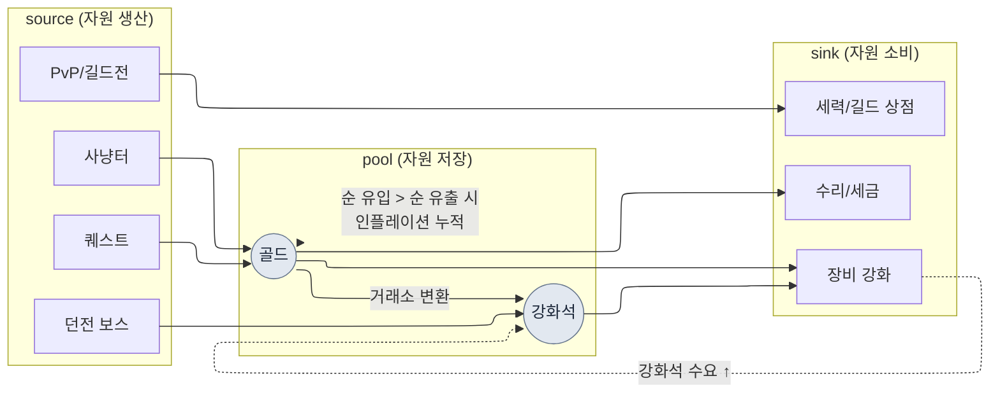

# 8.2 경제 모델을 Machinations로 — 인플레이션을 회의 대신 시뮬로 잡는다

> 1차 독자: 라이브 경제를 책임지는 MMORPG 밸런스/시스템 기획자 (중규모(10~50인) 팀)
> 1인/취미 독자용 축소 버전: §8.2.10 「혼자라면 이만큼만」

골드가 새기 시작한 걸 처음 안 건 청구서가 아니라 거래소였다. 출시 두 달째, 강화석 시세가 슬그머니 올랐고 한 달 뒤엔 두 배가 됐다. 원인을 찾으러 회의를 잡았는데, 회의실에서 나온 건 전부 "느낌"이었다. 누군가는 새 던전 보상이 과하다고 했고, 누군가는 사냥터 효율이 높아진 탓이라 했고, 누군가는 그냥 고레벨 유저가 늘어서라고 했다. 다 그럴듯했고, 그래서 아무것도 결정되지 않았다. 한 시간을 추측으로 태우고 "일단 다음 주에 데이터 더 보자"로 끝났다.

문제는 자원이 한 개가 아니라는 데 있다. 골드·강화석·평판·명예·영혼석이 각자 source(들어오는 길)와 sink(나가는 길)를 가지고, 그 길들이 서로를 먹인다. 강화석 보스가 골드도 떨군다. 골드로 산 장비가 강화석을 태운다. 자원 5종에 흐름이 수십 개로 얽히면, 머릿속 계산기로는 한 자원의 1주 수지조차 정직하게 못 뽑는다. 이 장은 그 얽힘을 **Machinations 노드 모델**로 옮기고, 경제 변경 결정을 회의 추측이 아니라 **시뮬레이션 게이트**로 통과시키는 방법을 다룬다. 경제 설계의 일반 이론은 다른 책에 충분하니, 이 장은 그 이론을 *AI 워크플로로 돌리는 자리*에만 집중한다.

> **저자 실제 운영 메모**
> 이 장의 사례는 저자가 회사 R&D 폴더에서 운영 중인 경제 파일럿 문서(`Economy_Machinations_Pilot`)와 경제 리서치 작업 영역을 익명화한 것이다. 자원 종류·source/sink 구조·Pilot 4단계는 실제 운영을 충실히 옮겼고, 회사 고유 명칭·실수치는 책용으로 치환하거나 비율·방향으로만 적었다. AI 출력 본문은 실제 세션을 재구성한 것이다.

---

## 8.2.1 경제는 '자원 5종'이 아니라 '흐름 수십 개'다

경제 자원을 표로 적으면 다섯 줄이라 단순해 보인다. 함정은 자원이 아니라 자원을 잇는 **흐름**의 개수에 있다.

| 자원 | source (들어옴) | sink (나감) |
|---|---|---|
| 골드 | 사냥, 퀘스트 보상, 거래소 판매 | 장비 구매, 강화, 수리, 세금 |
| 강화석 | 던전 보스, 이벤트 | 장비 강화, 합성 |
| 평판 | 사이드 퀘스트 | 세력 상점, 직업 변경 |
| 명예 | PvP, 길드전 | PvP 상점, 길드 시설 |
| 영혼석 | 보스 처치 | 캐릭터 부활, 스킬 학습 |

자원은 5종이지만 source·sink는 합쳐 스물 몇 개이고, 게다가 자원끼리 변환된다(골드로 강화석을 사는 거래소가 골드 sink이자 강화석 source다). 흐름이 서로를 먹이는 순간, "골드를 5% 더 풀면 강화석 시세가 어떻게 되나" 같은 질문은 한 자원만 봐서는 답이 안 나온다. 이게 캐릭터 밸런스(8.1)와 경제 밸런스가 결정적으로 다른 지점이다. 캐릭터 밸런스는 수식 한 줄로 닫히지만, 경제는 **시간에 따라 누적되는 동적 시스템**이라 1주 수지가 0에 가까워도 26주를 누적하면 거래소가 무너진다.

그래서 경제 작업의 본질은 "숫자를 잘 고르는 것"이 아니라 **"흐름이 시간에 따라 어떻게 누적되는지를 시뮬레이션으로 보는 것"**이다. 그리고 그 시뮬레이션 모델을 손으로 짜고 수정하는 일은 지루하고, 할 때마다 누락이 생긴다. 반복적이고 빠뜨리기 쉬운 초안 작업, 그러나 검수는 사람이 꽉 쥐어야 하는 일 — 이 결의 작업이 AI와 사람의 분업선이 가장 깔끔하게 그어지는 자리다.

먼저 이 장이 다루는 경제 순환의 골격을 한 장으로 실어 둔다.



점선이 이 장의 핵심이다. 강화 sink가 강화석 수요를 끌어올려 강화석 시세를 밀고(`UP -.-> S`), 골드 순 유입이 순 유출을 넘으면 그 초과분이 매주 풀(pool)에 쌓여 인플레이션으로 누적된다. 이 점선 두 개를 손계산으로 추적하는 게 불가능해서, 모델이 필요하다.

---

## 8.2.2 Machinations — 경제를 노드 그래프로 옮기는 도구

Machinations는 경제 흐름을 노드 그래프로 그리고 그 위에서 시뮬레이션을 돌리는 도구다. §8.2.1의 mermaid를 실제로 돌릴 수 있는 모델로 옮기는 자리다.

| 노드 | 역할 | 위 그림에서 |
|---|---|---|
| Pool | 자원 저장소 | 골드·강화석 |
| Source | 자원 생산 | 사냥·퀘스트·보스 |
| Drain | 자원 소비 | 강화·수리·상점 |
| Converter | 자원 변환 | 거래소(골드→강화석) |
| Trigger | 조건부 발동 | 이벤트·승급 보상 |

이 노드들로 경제를 모델링하고 시뮬레이션을 1,000회 돌리면, 단일 결과가 아니라 분포가 나온다. "26주 후 골드 시세 중앙값 +X%, 상위 10% 유저는 +Y%" 같은 식이다. 다만 Machinations가 만능은 아니고, 도입 자체가 비용이다.

| 한계 | 처방 |
|---|---|
| 게임 코드와 별개로 돌아 동기화가 어긋남 | 실제 telemetry로 매월/분기 보정 (§8.2.6) |
| 노드 그래프가 커지면 가독성 붕괴 | 자원별 서브그래프로 분할, 단일 자원부터 (§8.2.4) |
| 시뮬은 단순화된 유저 모델 | 실제 행동 분포로 보정, 오차 임계 설정 |
| 결과 해석이 도메인 지식에 의존 | 시뮬 수치 → 결정으로 잇는 게이트 표준화 (§8.2.5) |

그래서 Machinations는 무조건 도입하는 도구가 아니다. **자원 5종 이상 + 자원 변환 흐름 + 라이브 운영**이라는 세 조건이 겹칠 때 값을 한다. 자원 2~3종의 단순 경제는 엑셀로 충분하고, 그 경우 Machinations 도입은 효과보다 운영 부담이 먼저 도달한다.

---

## 8.2.3 [워크드 트랜스크립트] 골드 단일 자원 모델을 AI로 초안 잡기

도구 설명만으로는 이게 실제로 무엇을 뱉는지 알 수 없다. 골드 하나를 Machinations 모델로 옮기는 한 사이클을, 입력 프롬프트에서 사람의 거부까지 끝까지 따라간다. 입력 프롬프트는 그대로 복사해 쓸 수 있고, 출력은 실제 세션을 재구성했다.

### 1단계 — 입력: 골드 흐름을 기계가 읽을 표로

먼저 골드의 source·sink를 데이터 시트에서 뽑아 표로 만든다. 새로 쓰는 게 아니라 추출이다.

```yaml
# gold_flows.yaml — 골드 단일 자원 흐름 (현행 데이터 시트 발췌)
resource: gold
sources:
  - id: hunting        # 사냥터 드랍
    trigger: per_kill
    note: 레벨대별 드랍 곡선은 reward_curve 룰 적용
  - id: quest_reward   # 퀘스트 보상
    trigger: per_complete
  - id: market_sell    # 거래소 판매
    trigger: per_trade
sinks:
  - id: gear_buy       # 장비 구매
  - id: enhance        # 강화 비용
  - id: repair         # 수리
  - id: tax            # 거래소 세금 (sink이자 골드 회수 핵심)
# 유저 행동 분포(시간당 사냥 횟수·퀘스트 완료율)는 아직 비어 있음 → AI가 가정하면 표시하게 함
```

### 2단계 — 프롬프트: 모델을 시키되 가정과 형식을 강제한다

```
첨부 gold_flows.yaml은 골드 단일 자원의 source 3개·sink 4개다.
이걸 Machinations 모델로 옮길 노드 명세 초안을 만들어라.

규칙:
1) 각 흐름을 노드 종류(Source/Drain/Pool/Converter)로 분류하라.
2) 각 노드에 '1주 기준 유저 1명당 기대 유량'의 산식을 제안하되,
   유저 행동 가정(시간당 사냥 횟수·퀘스트 완료율 등)이 필요하면
   그 가정을 별도 줄로 '★가정'이라 명시하라. 가정을 본문에 숨기지 마라.
3) source 총 유입과 sink 총 유출을 분리해 1주 순 수지(net)를 계산하라.
4) 거래소 세금(tax)이 골드를 경제에서 영구 제거하는 유일한 sink임을
   반영하고, 다른 sink(강화·수리)는 골드가 NPC로 이동할 뿐 회수가
   아님을 구분하라.
5) 네가 '확신 못 하는' 가정은 따로 ★표시하고 사람 결정에 넘겨라.

출력 형식: 표 (노드 | 종류 | 1주 유량 산식 | 가정 | 확신도). 그 외 설명 금지.
```

이 프롬프트에서 정작 길게 적힌 건 모델을 만들라는 지시가 아니라, 가정을 어디에 어떻게 적으라는 규칙이다. 경제 모델링에서 AI를 자유롭게 풀면 그럴듯한 숫자를 가정을 숨긴 채 토해낸다. 그러면 모델이 틀려도 *어디가 틀렸는지*를 못 짚는다. **유저 행동 가정을 본문 밖으로 끄집어내 별도 줄에 세우게 하는 것** — 거기에 이 요청의 무게가 다 실려 있다. 가정이 보여야 검증할 수 있다.

### 3단계 — Claude의 출력 (재구성, 발췌)

```
| 노드          | 종류      | 1주 유량 산식                          | 가정             | 확신도 |
|--------------|-----------|----------------------------------------|------------------|-------|
| hunting      | Source    | 시간당 처치 × 평균드랍 × 주간플레이시간  | ★주 15h, 처치 80/h| 중    |
| quest_reward | Source    | 일일퀘 수 × 보상 × 7 × 완료율           | ★완료율 0.7      | 중    |
| market_sell  | Source    | (유저간 이전 — 순증 아님)               | 순 경제엔 0 기여  | 높음  |
| gear_buy     | Drain     | 구매빈도 × 평균가                        | ★주 1.2회        | 낮음  |
| enhance      | Drain     | 강화시도 × 회당비용                      | ★주 8회          | 중    |
| repair       | Drain     | 사냥시간 × 수리율                        |                  | 높음  |
| tax          | Drain     | 거래액 × 세율 (★유일한 영구 회수 sink)   | ★세율 5%         | 높음  |
| ── 순 수지   | net       | Σsource − Σsink ≈ +(중활성 기준 양수)    | 위 가정 합산 시   | ★낮음 |

★가정 경고: market_sell은 유저↔유저 골드 이동이라 경제 총량에 0 기여.
이걸 source로 더하면 인플레를 이중계상함. 모델에서 별도 처리 필요.
★확신 못 하는 점: gear_buy 빈도(주 1.2회)는 추측. 실제 구매 telemetry
없이는 sink가 과소/과대 추정될 수 있음 → 사람 결정 필요.
```

출력에서 가장 값진 건 표가 아니라 **맨 아래 두 줄, "★가정 경고"와 "★확신 못 하는 점"**이다. AI가 자기 모델의 약점을 두 군데 스스로 신고했다. 좋은 프롬프트는 AI가 "이 가정은 못 믿겠습니다"라고 말하게 만든다.

### 4단계 — 검증과 거부 (사람의 자리)

이 출력을 그대로 모델에 넣으면 안 된다. AI가 신고한 두 ★ 중 하나가 실제로 모델을 망가뜨리는 결함이었다.

`market_sell`(거래소 판매)을 AI는 처음에 Source로 분류했다. 그런데 거래소 판매는 **유저 A의 골드가 유저 B에게 가는 이전**이지, 경제에 골드가 새로 생기는 게 아니다. 이걸 source 유입에 더하면 인플레이션을 이중으로 계상한다. AI가 ★가정 경고로 스스로 짚긴 했지만, 표 본문에서는 여전히 Source 칸에 남겨 뒀다 — 신고는 했으되 모델에서 빼지는 않은, 절반만 맞은 출력이다. 이건 입력 yaml에서 `market_sell`의 성격(유저간 이전 vs 신규 생성)을 명시하지 않은 사람 쪽 데이터 결함이기도 했다.

그래서 재요청한다.

```
market_sell은 유저↔유저 골드 이전이라 경제 총량 source가 아니다(입력
누락 수정). 이 노드를 source 합산에서 빼고, 대신 '거래소 세금(tax)이
이전액의 일부를 영구 회수하는 sink'로만 모델에 반영하라. 순 수지를
다시 계산하고, market_sell 제외가 net에 미친 영향을 한 줄로 보여라.
```

AI는 `market_sell`을 source에서 제거하고 세금만 sink로 남긴 모델로 다시 답했다. 그 결과 순 수지(net)가 처음 추정보다 낮아졌다 — 거래소 판매를 source로 잘못 넣었을 때 인플레이션을 과대평가하고 있었다는 게 드러났다. **이 한 번의 왕복이 핵심이다.** 사람이 처음부터 손으로 짜면 반나절이고 노드 분류 실수를 본인이 잡기 어렵지만, AI 초안 + "가정 명시" 강제 + 1회 거부면 한 시간 안쪽이고, AI가 신고한 ★를 사람이 판정하는 구조 덕에 이중계상 같은 결함이 모델에 들어가기 전에 걸린다(저자 추정 — 절약 시간은 팀·자원 수에 따라 다르니 절대값보다 "손으로 처음부터"와 "초안+검수"의 구조 차이로 읽는 게 맞다).

---

## 8.2.4 한 자원씩 — Pilot 4단계로 들여온다

골드 모델 하나가 닫혔다고 전 자원을 한 번에 모델링하면 안 된다. 저자의 운영도 전체를 한꺼번에 넣지 않았다. 단일 자원에서 시작해 검증·보정을 거쳐 확장하는 4단계를 밟았다.

| 단계 | 범위 | 핵심 게이트 |
|---|---|---|
| 1. 단일 자원(골드) 모델링 | source 3·sink 4, §8.2.3 세션 | 노드 분류·가정 명시 |
| 2. 시뮬 vs 실제 비교 | 시뮬 1주 net vs telemetry 1주 | 오차 임계 통과 여부 |
| 3. 모델 정밀도 보정 | 유저 행동 분포(저/중/고활성) 반영 | segment별 오차 재측정 |
| 4. 자원 확장(5종) | 강화석·평판·명예·영혼석 단계 추가 | 변환 흐름(거래소) 검증 |

2단계의 비교 검증이 이 4단계의 심장이다. 시뮬과 실제가 어긋나면, 잘못된 건 게임이 아니라 모델이다. 어긋난 모델로 결정을 내리면 그 결정이 라이브에 사고로 돌아온다. 그래서 확장(4단계)은 항상 2·3단계의 검증을 통과한 다음에만 한다. 이 순서가 깨지면, 즉 단일 자원 검증을 건너뛰고 5종을 한꺼번에 넣으면, 어느 자원의 모델이 틀렸는지조차 분리해서 짚을 수 없게 된다.

---

## 8.2.5 시뮬 게이트 — 경제 변경 결정에 차단막을 건다

모델이 검증을 통과하면, 이제 경제에 영향을 주는 모든 변경 결정 앞에 **시뮬 게이트**를 세운다. 회의에서 "느낌"으로 통과시키던 결정을 시뮬 통과로 바꾸는 자리다.

| 결정 종류 | 시뮬 의무 |
|---|---|
| source·sink 신규 추가 | 필수 |
| 자원 변환 비율 변경 (거래소 환율 등) | 필수 |
| 새 던전·이벤트 보상 설계 | 필수 |
| 가격 변경 (±10% 이상) | 필수 |
| 신규 직업 효율 검증 | 필수 |
| UI 변경 등 경제 무관 | 면제 |

게이트가 실제로 어떻게 작동하는지, §8.2.3에서 검증한 골드 모델 위에서 한 결정을 통과시켜 본다.

> **[시뮬 게이트 — 이벤트 보상 결정] (실제 형식 재구성)**
>
> ```
> [변경안]   주말 이벤트: 일일 로그인 보상 +500 골드
> [게이트]   source 신규 추가 → 시뮬 필수
> [시뮬 1000회 결과]
>   - 1주 골드 순 수지: +6,900 → +10,400 (+50%)
>   - 26주 누적 시 골드 시세 중앙값 ~+28% (인플레 경고: ±10% 초과)
>   - 상위 10% 활성 유저: ~+41% (segment 편차 큼)
> [판정]     FAIL — 안정 범위(±10%/장기) 초과
> [보정안]   이벤트 source에 동시 sink 부착: 이벤트 한정 상점(골드 회수)
>            재시뮬 → 26주 누적 +9% (PASS)
> ```

게이트의 값은 마지막 두 줄에 있다. "보상 +500을 풀자"는 결정이 회의 추측이었다면 "괜찮을 것 같다"로 통과됐을 것이다. 시뮬 게이트는 그 결정을 26주 +28% 인플레로 환산해 보여 주고, **source를 추가할 거면 sink를 같이 달아라**는 보정까지 강제한다. 경제 변경을 추측이 아니라 시뮬 통과/실패로 판정하는 것 — 이게 게이트의 전부다.

여기서 자주 빠지는 함정 하나를 짚는다. segment 편차다. 중활성 유저 기준 +28%여도 상위 10%는 +41%다. 골드를 가장 많이 버는 유저층이 인플레이션을 가장 빠르게 누적시키므로, 시뮬은 평균만 보지 말고 segment별로 돌려야 한다. 평균만 보면 고활성 유저발 시세 붕괴를 놓친다.

---

## 8.2.6 모델은 출시 후 telemetry로 매월 진화한다

시뮬 게이트가 신뢰받으려면 모델이 실제 게임과 어긋나지 않아야 한다. 게임은 매주 바뀌므로 모델도 따라 보정해야 한다. 출시 후엔 실제 telemetry로 매월(변경이 적은 시기엔 분기) 모델을 친다.

```
모델 보정 사이클 (월간)
─────────────────────────────────
1. 실제 유저 telemetry 1개월치 추출 (자원별 흐름 집계)
2. segment(저/중/고활성)별 source·sink 실측 유량 산출
3. Machinations 시뮬과 항목별 비교
4. 오차 >15% 항목 = 모델 파라미터 조정 (그 항목의 ★가정이 틀린 것)
5. 조정 후 재시뮬 → 다음 달 게이트의 기준 모델로 사용
```

핵심은 4번이다. 오차가 큰 항목은 곧 §8.2.3에서 AI가 ★로 신고했던 "확신 못 하는 가정"이 실제와 어긋났다는 신호다. 예컨대 AI가 추측한 `gear_buy` 빈도(주 1.2회)가 실측 주 2회였다면, 그 가정을 telemetry 값으로 교체한다. 이 보정을 멈추면 모델이 게임과 천천히 벌어지고, 어느 분기 시뮬 게이트가 "통과시켰는데 실제로는 인플레가 온" 사고를 낸다. 그 순간 시뮬 자체의 신뢰가 사후에 무너진다. 보정은 운영의 부수 작업이 아니라 게이트를 살아 있게 하는 정규 사이클이다.

---

## 8.2.7 진보적 적용 — 이상 패턴 탐지·변경 공간·시뮬 병렬화

여기까지가 경제 모델링의 '보수적 적용'이다. 사람이 변경을 발의하고, 모델로 검증하고, 결과로 결정한다. 한 발 더 나가면 8.1.6에서 본 진보적 적용의 세 축 — z-score 탐지 · 변경 공간 정의 · 시뮬 병렬화 — 이 경제 인프라 위에서도 똑같이 열린다.

**첫째, 이상 패턴 탐지.** 매월 보정 사이클(§8.2.6)의 오차 비교를 사람이 눈으로 하는 대신, 모델-실측 편차가 임계를 넘는 항목을 코드가 먼저 골라 올린다. 강화석 시세가 두 배가 된 걸 거래소를 보고 아는 게 아니라, "강화석 source 유량이 모델 대비 +30% 이탈"이라는 alert가 회의 전에 도착한다.

**둘째, 변경 공간 정의.** "보상을 +500 풀자/말자"의 이분법이 아니라, 보상 범위(0~+1000)와 동시 sink 범위를 변경 공간으로 정의해 두면, 그 공간 안에서 인플레 ±10%를 만족하는 조합을 탐색할 수 있다. 사람은 "어디서 어디까지"를 정하고, 그 안의 최적 조합 탐색은 자동화한다.

**셋째, 시뮬 병렬화.** 변경안 하나를 1,000회 돌리는 대신, 변경 공간 안의 후보 수십 개를 병렬로 1,000회씩 돌려 분포를 한 번에 비교한다. 회의실에서 한 안씩 토론하던 자리가, 후보 매트릭스의 시뮬 결과 비교로 바뀐다.

공통 사상은 사람이 변경을 *발의*하던 자리를 코드가 변경 공간을 *탐색*하는 자리로 옮기는 것이다. 단, 보수적 적용(§8.2.3~8.2.6)이 안정적으로 돌고 모델이 telemetry로 검증된 다음의 이야기다. 검증 안 된 모델로 변경 공간을 자동 탐색하면, 틀린 모델이 틀린 최적값을 자신 있게 내놓는다.

> **[급진적 적용 — 경제를 '차원 벡터'로 압축해 탐색하기] (아직은 시기상조)**
>
> 진보적 적용에서 한 발 더 나간 영역이다. 단정이 아니라 연구 동향으로 읽어 주기 바란다(차원 벡터·임베딩이 처음이라면 부록 M의 '지도' 한 장을 먼저 보면 아래가 쉽게 읽힌다 — 이 책의 다섯 '방향 표지'가 전부 그 그림 위에서 돈다). 여기까지 온 경제 모델은 자원 5종에 흐름 수십 개가 얽힌 고복잡도 시스템이고, §8.2.7의 변경 공간 탐색도 결국 그 수십 개 흐름을 일일이 파라미터로 잡고 도는 방식이다. 급진적 발상은 이 복잡도 자체를 **차원 벡터로 압축**한 다음, 그 압축 공간 위에서 해를 찾는 것이다.
>
> 멀어 보이는 비유 하나가 단서가 된다. 정성적이고 손에 안 잡히는 영역으로 흔히 꼽히는 요리 레시피를, 한 연구(Epicure — Radzikowski·Chen, 2026, arXiv:2605.22391 · 데모 epicure.kaikaku.ai)에서는 11개 출처의 레시피 414만 건에서 표준 재료 1,790종을 추려, 재료 사이의 관계를 수백 차원의 벡터로 압축했다. 핵심은 "맛"이라는 정성적 대상도 재료 간 관계를 좌표로 환산하면, 비슷한 레시피는 벡터 공간에서 가까이 모이고 그 사이를 보간해 새 조합을 탐색할 수 있다는 점이다 — Epicure도 이 압축 공간에서 한 재료를 특정 요리권 방향으로 회전시켜 대응 재료를 찾는 보간 탐색을 보인다.
>
> 경제도 원리는 같다. source·sink·변환 흐름을 각각 차원으로 둔 벡터로 경제 상태를 표현하면, "인플레 ±10% 안에서 안정적인 경제"가 그 공간의 한 영역으로 잡힌다. 그러면 변경안을 하나씩 시뮬에 거는 대신, 그 안정 영역 안/근처에서 해를 직접 탐색하는 길이 열린다. 후보를 일일이 돌려 비교하던 §8.2.7의 병렬 시뮬이, 압축 공간 위의 탐색 한 번으로 좁혀질 가능성이다.
>
> 왜 "아직은 시기상조"인가. 첫째, 무엇을 차원으로 잡을지(어떤 흐름이 독립이고 어떤 게 종속인지)를 정하는 일 자체가 도메인 난제다. 둘째, 압축은 본질적으로 정보를 버리는 일이라, 버린 차원에서 라이브 사고가 터질 수 있다. 셋째, 이 모든 게 보수적 적용의 telemetry 검증(§8.2.6)이 단단할 때만 의미가 있다 — 압축 전 모델이 게임과 어긋나 있으면, 압축은 그 오차까지 깔끔하게 압축할 뿐이다. 그래서 이 절은 처방이 아니라 **방향 표지**다. 지금 할 일은 보수적 적용을 정직하게 돌리는 것이고, 차원 벡터는 그 토대가 충분히 쌓인 팀이 몇 년 뒤 들여다볼 연구 영역으로 남겨 둔다.

---

## 8.2.8 측정 — 회의가 시뮬로 바뀐 자리

도구 도입 전후를 비교한다. 아래 시간·빈도는 도입 초기 운영에서 체감한 방향을 담은 것이라, 정밀한 절대값으로 읽기보다 어느 쪽으로 움직였는지로 읽어야 맞다.

| 항목 | 도입 전 (회의·손계산) | 도입 후 (시뮬 게이트) |
|---|---|---|
| 경제 변경 결정 → 적용 | 2~4주 (추측·재논의 반복) | 1~3일 (시뮬 검증 1회) |
| 인플레이션 사고 | 분기당 1~2건 (사후 발견) | 분기당 0~1건 (게이트 사전 차단) |
| source·sink 추가 빈도 | 분기 1~2회 (무서워서 보수적) | 월 1~2회 (시뮬이 안전 보장) |
| 경제 회의 빈도 | 주 3~4회 | 주 1~2회 |

표의 숫자보다 마지막 줄의 의미가 크다. 회의 빈도 감소는 시뮬레이션이 토론을 대체했기 때문이다. "내 생각엔 강화석에 인플레가 올 것 같다"가 "시뮬 결과 26주 +28%"로 바뀌면, 추측을 두고 한 시간 다투던 자리가 5분 결과 공유로 끝난다. 이건 저자 시스템의 회고에 박제된 개념(atom `automation_signal_value_over_time_savings` — 자동화의 가치는 시간 절약이 아니라 신호 노출)과 정확히 같은 자리다. 시뮬 게이트의 진짜 산출물은 절약된 시간이 아니라, 회의에서 추측이 차지하던 자리를 숫자가 차지하게 만든 것이다.

다만 한 가지는 정직하게 둔다. 표의 "분기당 1~2건 → 0~1건"은 정밀 측정값이 아니라 운영 체감의 방향이다. 인플레이션 사고는 정의(시세 ±몇 %를 사고로 볼지)에 따라 카운트가 달라지므로, 절대 건수보다 "사후 발견에서 사전 차단으로 옮겨 갔다"는 구조 변화로 읽는 게 맞다.

---

## 8.2.9 흔한 실패

| 패턴 | 왜 실패하나 | 처방 |
|---|---|---|
| 전 자원을 한 번에 모델링 | 어느 자원 모델이 틀렸는지 분리 불가 | 단일 자원 Pilot부터 (§8.2.4) |
| AI 모델의 가정을 검수 없이 수용 | 거래소 이중계상 같은 결함이 그대로 들어감 | 가정 명시 강제 + 사람 거부 (§8.2.3) |
| 시뮬 게이트 없이 경제 변경 | 사후 인플레 회복 비용이 막대 | 의무 시뮬 항목 정의 (§8.2.5) |
| 평균만 시뮬, segment 무시 | 고활성 유저발 시세 붕괴 놓침 | segment별 시뮬 (§8.2.5) |
| 출시 후 telemetry 보정 안 함 | 모델이 게임과 벌어져 게이트 신뢰 붕괴 | 월/분기 보정 사이클 (§8.2.6) |
| 검증 안 된 모델로 변경 공간 자동 탐색 | 틀린 모델이 틀린 최적값을 확신 있게 냄 | 보수적 적용 안정 후 진보 (§8.2.7) |

두 번째가 가장 자주 놓친다. §8.2.3에서 본 거래소 이중계상처럼, AI는 그럴듯한 모델을 자신 있게 뱉되 자기 가정의 약점은 ★로 신고만 하고 본문엔 결함을 남겨 둔다. 그 ★를 사람이 판정하지 않으면, 틀린 모델이 통과되고 그 위의 모든 시뮬 결정이 함께 틀린다.

---

## 8.2.10 따라하기 — 오늘 할 수 있는 한 단계

> **혼자라면 이만큼만**: Machinations도 telemetry도 없어도 됩니다. 본인 게임(또는 좋아하는 게임)의 자원 하나를 골라 source·sink를 종이에 적고, §8.2.3의 프롬프트를 그대로 붙여 1주 순 수지 모델 초안을 받아 보세요. AI가 ★로 명시한 가정 하나를 골라 "이 가정은 못 믿겠다, 근거를 다시 대라"고 반박해 보면, 경제 모델이 어떤 가정들의 묶음인지 — 그리고 그 가정 하나가 틀리면 결론이 어떻게 뒤집히는지 — 몸으로 들어옵니다.

팀이라면 다음 한 단계로 시작하세요. 전 자원이 아니라 **가장 문제인 자원 하나**(보통 골드 또는 강화석)를 골라 §8.2.3의 단일 자원 모델만 먼저 세우고, 경제 변경 결정 한 종류(예: 이벤트 보상)에 §8.2.5의 시뮬 게이트를 거세요. 자원 한 개 + 결정 한 종류만으로도, 회의에서 추측을 두고 다투던 자리를 숫자 한 줄로 바꿀 수 있습니다.

setup → prompt → verify로 요약하면 — **setup**: 문제 자원 하나의 source·sink를 yaml로 추출합니다. **prompt**: §8.2.3 형식으로 노드 모델 초안을 받되 유저 행동 가정을 ★로 명시하게 강제합니다. **verify**: AI가 신고한 ★ 가정과 노드 분류(특히 유저간 이전 vs 신규 생성)를 사람이 직접 거부·재요청합니다.

---

### 이 챕터의 핵심 메시지
- 경제는 자원 5종이 아니라 시간에 누적되는 흐름 수십 개라 시뮬이 필요하다.
- AI 모델 초안은 가정을 명시하게 강제하고, 그 가정을 사람이 거부한다.
- 경제 변경은 회의 추측이 아니라 시뮬 게이트의 통과/실패로 판정한다.

### 다음 챕터 미리보기
- 8.3 Damage Simulator (2008~) — 18년 산 시뮬 도구가 AI 시대에 어떻게 재활용되는가
