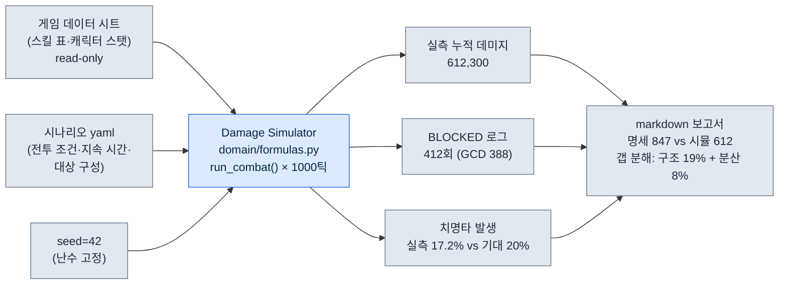

# 8.3 Damage Simulator — 명세 DPS와 시뮬 산출이 갈라지던 날

2008년 어느 새벽, 나는 Excel 한 장 앞에서 같은 숫자를 세 번 검산하고 있었다. 기획서에는 어떤 검 캐릭터의 초당 피해량이 **847**이라고 적혀 있었다. 그런데 그날 처음 돌린 시뮬레이터는 같은 캐릭터를 같은 사양으로 넣었는데 **612**를 뱉었다. 27% 차이. 둘 중 하나는 거짓말이었고, 나는 어느 쪽이 거짓말인지 아직 몰랐다.

명세서의 DPS는 종이 위의 약속이다. 스킬 한 방의 데미지에 발동 빈도를 곱한 산수. 시뮬레이터의 DPS는 그 약속을 1,000번 실제로 휘둘러 본 결과다. 쿨다운이 겹치고, 시전 모션에 시간이 잡아먹히고, 치명타가 기대값만큼 안 터지는 — 종이가 모르는 마찰이 끼어든다. 이 27%의 틈이 바로 밸런스 설계자가 먹고사는 자리다. 종이를 믿으면 출시 후에 운다.

이 챕터는 그 도구 한 자루의 이야기다. 2008년에 만들어 지금까지 손에서 놓지 않은 Damage Simulator. 명세와 산출이 갈라지는 정확한 지점을 어떻게 추적했는지, 그리고 18년 뒤 그 추적에 AI를 어떻게 붙였는지를 한 번의 실제 워크드 트랜스크립트로 따라간다.

---

## 8.3.1 명세 DPS는 왜 항상 거짓말을 하는가

먼저 그 612 대 847의 정체를 뜯어보자. 명세서를 쓴 후배 기획자(이하 팀원 A)는 잘못한 게 없었다. 그는 스킬 표에 적힌 대로 곱했다.

명세상의 DPS 계산은 이렇게 생겼다. 한 캐릭터가 가진 세 스킬을 가정하자.

| 스킬 | 단일 데미지 | 쿨다운 | 시전 시간 |
|---|---|---|---|
| 횡베기 | 320 | 3.0s | 0.6s |
| 찌르기 | 540 | 6.0s | 0.9s |
| 평타 | 180 | 1.2s | 0.4s |

팀원 A의 명세 계산은 "각 스킬을 쿨마다 빠짐없이 쓴다"는 이상적 가정 위에 있었다. 횡베기는 3초당 320, 찌르기는 6초당 540, 평타는 빈 시간을 채운다. 산수로는 깔끔하게 847이 나온다. 종이 위에서 캐릭터는 한 손이 여러 개여서 시전 모션이 서로를 막지 않는다.

시뮬레이터가 612를 내놓은 이유는 단 하나, 손이 하나라서다. 0.9초짜리 찌르기를 시전하는 동안 횡베기 쿨이 돌아도 쓸 수 없다. 시전 모션이 서로를 잡아먹는 이 **글로벌 쿨다운 충돌**이 명세에는 없다. 종이는 마찰이 없는 진공이고, 시뮬은 마찰이 있는 전장이다. 24년을 이 일을 하며 배운 첫 번째 진실은 이거다 — 명세 DPS는 상한선이지 실측값이 아니다. 그리고 사용자는 상한선이 아니라 실측값으로 게임을 한다.

---

## 8.3.2 워크드 트랜스크립트 — 612의 출처를 AI에게 캐묻다

2008년의 나는 이 27%의 틈을 손으로 메웠다. 시뮬 로그를 한 줄씩 눈으로 읽으며 어느 프레임에서 스킬이 막혔는지 셌다. 반나절이 걸렸다. 18년이 지난 지금, 나는 같은 로그를 Claude에게 던진다. 아래는 실제로 진행한 한 세션의 전문이다. 요약하지 않고, 빗나간 첫 시도까지 그대로 싣는다 — 그 빗나감이 이 도구를 쓰는 법의 절반이기 때문이다.

내가 던진 프롬프트는 이랬다.

> 첨부한 건 우리 Damage Simulator(`damage_sim/`, Python)의 단일 캐릭터 1,000틱 전투 로그 일부다. 명세서상 이 캐릭터의 DPS는 847인데 시뮬 산출은 612가 나온다. 27% 갭의 원인을 로그에서 찾아라. 로그 포맷은 `[tick] event skill=SKILL state=STATE`. 추측 말고 로그에 있는 근거만 대라. 근거가 부족하면 부족하다고 말해라.
>
> ```
> [0.0] cast skill=찌르기 state=START
> [0.9] cast skill=찌르기 state=HIT dmg=540
> [0.9] cast skill=횡베기 state=BLOCKED reason=GCD
> [1.5] cast skill=평타 state=HIT dmg=180
> [1.9] cast skill=평타 state=BLOCKED reason=GCD
> [3.0] cast skill=횡베기 state=HIT dmg=320
> [3.6] cast skill=평타 state=HIT dmg=180
> ... (994 lines omitted)
> [997.2] cast skill=찌르기 state=HIT dmg=540
> ```

Claude의 날것 출력은 이랬다(다듬지 않음).

> 로그에서 확인되는 사실:
>
> 1. `state=BLOCKED reason=GCD` 이벤트가 반복적으로 등장합니다. `[0.9]`에서 횡베기가, `[1.9]`에서 평타가 GCD(글로벌 쿨다운) 때문에 막혔습니다.
> 2. 찌르기 시전(0.0→0.9, 0.9초)이 끝나기 전까지 다른 스킬이 발동되지 못합니다. 시전 시간이 GCD를 점유하는 구조로 보입니다.
> 3. 따라서 명세상의 "모든 스킬을 쿨마다 발동" 가정이 깨집니다. 실제로는 시전 모션끼리 충돌해 일부 발동이 누락됩니다.
>
> 다만 제공된 로그는 1,000줄 중 7줄뿐입니다. **27%라는 정확한 갭이 GCD 충돌만으로 설명되는지는 이 7줄로 단정할 수 없습니다.** BLOCKED 이벤트의 전체 발생 횟수와, 그로 인해 누락된 데미지 총량을 집계해야 27%가 검증됩니다. 전체 로그의 BLOCKED 집계를 주시면 정량적으로 확인하겠습니다.

여기서 멈춘 게 중요하다. AI는 원인을 **지목**했지만 27%를 **증명**하지는 못했고, 스스로 그 한계를 말했다. 종이 기획자였다면 "GCD 때문이네요"로 회의를 끝냈을 자리에서, 도구는 "7줄로는 모른다"고 버텼다. 나는 그 요구가 정당하다고 판단했다 — 이게 사람의 검증이다. 그래서 전체 로그의 BLOCKED 집계를 뽑아 다시 던졌다.

> 전체 1,000틱 집계다. BLOCKED 총 412회, 그중 GCD 사유 388회, 쿨다운 미충전 사유 24회. BLOCKED로 누락된 추정 데미지는 횡베기 환산 약 19,800. 총 전투 1,000틱(=초)간 명세 기대 데미지는 847,000, 시뮬 실측 누적 데미지는 612,300. 이 숫자로 27% 갭을 재검토해라.

Claude의 두 번째 출력.

> 집계로 검증합니다.
>
> - 명세 기대 누적: 847,000
> - 시뮬 실측 누적: 612,300
> - 갭: 234,700 (27.7%)
>
> 이 갭의 구성:
> - GCD 충돌로 직접 누락(388회): 추정 약 19,800은 횡베기 환산이지만, 누락된 슬롯에 더 높은 데미지 스킬이 들어갈 수 있었던 기회비용까지 합산해야 합니다. 누락 슬롯을 평균 데미지로 환산하면 누락분이 19,800보다 큽니다.
> - 다만 234,700 전체가 BLOCKED만으로 설명되지는 않습니다. **명세 847이 "치명타 기대값을 평균으로 이미 포함"한 값인지, "치명타 미포함 기본값"인지에 따라 나머지 갭의 해석이 달라집니다.** 명세 847의 치명타 가정을 알려주시면 잔여 갭을 분해하겠습니다.

다시 멈췄다. 그리고 다시 정확한 곳에서 멈췄다. 명세 847이 치명타를 어떻게 잡았는지 — 이건 로그에 없는 정보이고, 팀원 A의 머릿속에만 있었다. AI는 자기가 가진 데이터의 경계를 알았다. 내가 확인해 보니 명세 847은 치명타 20% 확률·1.5배를 기대값으로 평탄화해 넣은 값이었고, 시뮬은 seed 고정 후 실제 치명타 발생 횟수가 기대값보다 낮게 나온 한 판이었다. 즉 27% 갭은 **GCD 충돌(구조적·재현됨)** 과 **치명타 분산(통계적·이 한 판의 운)** 이 섞인 값이었다.

이 분해가 결론이다. GCD 충돌분은 설계로 고쳐야 할 진짜 문제고, 치명타 분산분은 시드를 바꿔 1,000판 평균을 내면 사라질 노이즈다. 둘을 섞어 "캐릭터가 약하다"고 버프를 주면, 1,000판 평균에서는 멀쩡하던 캐릭터가 과강해진다. 종이도 모르고, 한 판의 시뮬도 모르고, **AI 혼자서도 몰랐던** 이 구분을 만든 건 로그 집계와 명세의 숨은 가정을 들이댄 사람의 검증이었다.

---

## 8.3.3 입력 한 세트가 출력 한 세트로 — 시뮬의 해부

방금 세션이 들여다본 그 도구의 입출력을 한 세트로 펼쳐 보자. 시뮬레이터는 결국 정직한 함수다. 같은 입력에 같은 출력. 입력은 세 갈래에서 모인다.



이 그림의 핵심은 화살표가 한 방향이라는 것이다. 게임 데이터 시트는 시뮬레이터로 **읽히기만** 한다. 시뮬은 데이터를 절대 고쳐 쓰지 않는다. 18년간 가장 많은 사고를 막은 규칙이 이 한 화살표의 방향이었다. 시뮬이 자기 안에 데이터를 복사해 두기 시작하면, 게임 데이터가 바뀐 다음 날 시뮬은 어제의 세계를 시뮬레이션한다. 그렇게 나온 보고서로 회의를 하면, 회의 전체가 어제의 세계를 두고 다투게 된다.

구체적인 입력 한 세트(시나리오 yaml)는 이렇게 생겼다.

```yaml
# scenarios/single_dps_check.yaml
scenario: single_target_dps
duration_ticks: 1000      # 1틱 = 0.1s 가정, 100초 전투
seed: 42                  # 결정론 — 같은 입력 같은 출력
actor:
  char_id: K_004          # 게임 데이터 시트에서 read
  skill_rotation: optimal # GCD 충돌 시 최고 기대 데미지 우선
target:
  defense: 1200
  hp: infinite            # DPS 측정용 무한 체력 더미
report:
  compare_to_spec: 847    # 명세 DPS를 넣어 갭 자동 분해
```

그리고 출력 한 세트(보고서 발췌)는 이렇다.

```markdown
# Damage Simulator Report — K_004 single DPS
입력: scenarios/single_dps_check.yaml | seed=42 | data rev. 2026-06-05

## 명세 대비
- 명세 DPS:       847   (치명타 20%·1.5x 기대값 평탄화 포함)
- 시뮬 실측 DPS:  612   (이 시드 1판)
- 갭:            -27.7%

## 갭 분해
- 구조적(GCD 충돌, 재현됨):   -19.2%  ← 설계 검토 대상
- 통계적(치명타 분산, 이 판): -8.5%  ← 1000판 평균 시 소거 예상

## 재현 검증
- seed=42 재실행 3회 → 612,300 / 612,300 / 612,300 (일치)
- seed 0~999 1000판 평균 DPS → 731 (치명타 분산 소거 후)
```

마지막 줄을 보라. seed 0\~999로 1,000판을 돌린 평균은 731이었다. 명세 847과 1,000판 평균 731의 갭 116(13.7%)이 바로 GCD 충돌이라는 **진짜 구조 문제**의 크기다. 한 판의 612가 아니라 이 731이 설계 회의의 입력이 되어야 한다. 종이의 847도, 운 나쁜 한 판의 612도 아닌, 1,000판이 합의한 731. 이 숫자를 손에 쥐기까지가 밸런스 설계자의 일이다.

---

## 8.3.4 2008년의 손과 2026년의 손

이 도구는 18년을 살았지만, 같은 코드로 산 게 아니다. 옷걸이는 그대로 두고 옷만 다섯 번 갈아입혔다. 옷걸이는 위 보고서의 논리 — 명세와 실측을 갈라 보고, 갭을 구조와 분산으로 분해하고, 재현으로 검증하는 절차다. 이 절차는 2008년 Excel VBA(엑셀 매크로 언어)에서도, 2026년 Python에서도 글자 그대로 같다.

| 시기 | 옷(기술) | 옷걸이(변하지 않은 절차) |
|---|---|---|
| 2008\~2011 | Excel VBA, 1:1 | 명세 대비 갭 분해 |
| 2012\~2016 | C# 콘솔, N:N | 〃 |
| 2017\~2020 | Python + Web | 〃 |
| 2021\~2024 | Python + ML | 〃 (+ 사용자 분포 반영) |
| 2025\~ | Python + LLM 보조 | 〃 (+ 로그 질의·가설 생성) |

다섯 번의 옷 갈아입기를 버틴 비결은 폴더 구조에 새겨져 있다.

```
damage_sim/
├── domain/          # 옷걸이 — 18년 그대로
│   ├── formulas.py      # 데미지 공식·GCD 충돌 판정
│   └── metrics.py       # 갭 분해 로직
├── adapters/        # 게임 데이터 read-only
│   └── excel_reader.py
├── runners/         # 옷 — 기술 바뀔 때마다 교체
│   └── cli_runner.py
└── reporters/       # 옷 — 보고서 출력 형식
    └── markdown_report.py
```

기술이 바뀌면 `runners/`와 `reporters/`만 새로 짠다. `domain/`의 갭 분해 로직은 18년 자산 그대로 살아남는다. 2008년에 Excel 셀로 짰던 GCD 충돌 판정식이 함수 시그니처만 바뀐 채 지금 `formulas.py`에서 돌고 있다. 도구를 한 기술에 못 박으면 그 기술과 함께 늙어 죽는다는 걸, 나는 죽은 도구 여러 개를 보내며 배웠다.

2025년에 붙인 LLM은 새 옷걸이가 아니라 새 손이다. 앞 세션에서 봤듯 AI는 **로그를 읽고 가설을 세우는** 손이고, 반나절 걸리던 로그 추적이 몇 분으로 줄었다. 하지만 옷걸이는 건드리지 않는다 — 갭이 27%인지, 치명타가 몇 퍼센트 터졌는지를 **결정**하는 건 여전히 seed 고정된 결정론 코어다. 그 자리에 LLM이 들어가는 순간 회귀 검증이 불가능해져 도구가 죽는다.

---

## 8.3.5 결정론 코어와 그 바깥 — 선을 어디에 긋는가

밸런스 도구에서 단 하나의 선을 그어야 한다면, 나는 결정론 코어의 경계에 긋는다. 안쪽은 같은 입력에 같은 출력이 강철처럼 보장되어야 하고, 바깥쪽은 사람·AI가 자유롭게 가설을 던져도 된다.

안쪽(결정론 — AI 금지):
- 데미지 공식, GCD 충돌 판정, 치명타 발생, 누적 집계.
- `seed=42`로 세 번 돌려 612,300이 세 번 똑같이 나와야 한다. 이게 깨지면 어제의 보고서와 오늘의 보고서를 비교할 수 없다.

바깥쪽(가설·해석 — AI 환영):
- "왜 이 캐릭터 조합 승률이 비정상인가" 같은 원인 질의.
- 로그에서 BLOCKED 패턴 찾기, 자연어 보고서 초안, 시나리오 yaml 초안.

앞 워크드 트랜스크립트가 정확히 이 선 위에서 움직였다. AI는 바깥쪽에서 "GCD 충돌이 원인"이라는 가설을 빠르게 세웠다. 하지만 27%라는 숫자, 612라는 숫자는 끝까지 결정론 코어가 계산한 값이었고 AI는 그 값을 받아 해석만 했다. 그리고 두 번이나 "이 데이터로는 단정 못 한다"며 멈췄다 — 결정론 코어가 줄 수 없는 정보(명세의 치명타 가정)를 요구하면서. 이 멈춤이 좋은 도구의 표식이다. 가설을 진단으로 착각하지 않는 것.

수치에 대해 한 가지 정직하게 밝힌다. 이 챕터의 847·612·731·412회 같은 구체 숫자는 설명을 위해 구성한 예시값이다. 다만 명세 DPS가 시뮬 실측보다 항상 높게 나온다는 **방향**, 그 갭이 구조적 충돌과 통계적 분산으로 분해된다는 **구조**, seed 고정이 회귀 검증의 전제라는 **원칙**은 2008년부터 18년간 실제로 운영하며 반복 확인한 것이다. 비율의 크기는 프로젝트마다 다르지만 방향과 구조는 변하지 않았다.

---

## 따라하기 — 명세 대비 갭 분해 1회

**setup.** 게임 데이터에서 캐릭터 하나를 골라 스킬 표(데미지·쿨다운·시전 시간)와 명세 DPS를 확보하세요. 시뮬레이터가 없다면 1,000틱 단일 대상 전투를 돌리는 최소 스크립트를 짜세요. 핵심은 `seed`를 인자로 받아 고정할 수 있어야 한다는 것 하나입니다.

**prompt.** 시뮬 로그(BLOCKED 이벤트 포함)와 명세 DPS를 함께 던지세요.

> 첨부는 캐릭터 1명의 1,000틱 전투 로그와 BLOCKED 집계다. 명세 DPS는 [N]인데 시뮬 산출은 [M]이다. 갭의 원인을 로그 근거만으로 분해해라. 구조적 원인(재현되는 충돌)과 통계적 원인(이 판의 분산)을 구분해라. 근거가 부족하면 부족하다고 말하고 무엇이 더 필요한지 지목해라.

**verify.** AI가 지목한 구조적 원인을 seed를 바꿔 1,000판 평균으로 검증하세요. 평균에서도 갭이 남으면 진짜 구조 문제, 사라지면 분산 노이즈입니다. AI가 "단정 못 한다"고 멈추면 그건 실패가 아니라 정상입니다 — 멈춘 자리에 사람이 들어가 명세의 숨은 가정을 채웁니다.

### 1인 축소판

시뮬레이터도 ML도 없는 1인 개발자라면, 엑셀 한 장과 AI만으로 같은 절차를 돌릴 수 있습니다. 스킬 표를 시트에 적고, `RAND()`로 치명타를 굴리는 1,000행 시뮬을 한 열에 만드세요. 시드 고정이 안 되니 `F9`로 100번 재계산해 평균을 손으로 보세요. 그 평균과 명세 DPS의 갭을 AI에게 "구조 원인과 분산 원인으로 갈라 달라"고 던지세요. 도구는 작아도 옷걸이 — 명세 대비 갭 분해, 구조와 분산의 분리, 재현 검증 — 는 똑같이 섭니다.

---

### 이 챕터의 핵심 메시지
- 명세 DPS는 마찰 없는 상한선이고, 사용자가 겪는 실측값은 시뮬이 1,000판 평균으로 찾는다.
- 명세와 시뮬의 갭은 구조적 충돌과 통계적 분산으로 갈라야 진짜 설계 문제가 보인다.
- 결정론 코어 안쪽은 AI 금지, 가설·해석의 바깥쪽은 AI를 새 손으로 환영한다.

### 다음 챕터 미리보기
- 8.4 AI 보조 밸런스 시뮬레이션 — 결정론 코어를 지키며 주변을 자동화하는 위치들
