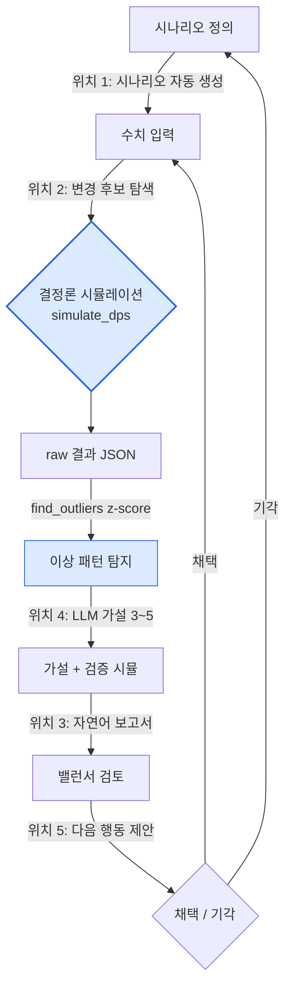

# 8.4 AI 보조 밸런스 시뮬레이션

금요일 오후 4시, 알파 빌드의 5:5 PvP 자동 시뮬 1,200판이 끝났다. 결과 JSON은 4메가바이트. 그 안 어딘가에 "팀 A 승률 92%"라는 한 줄이 기록되어 있는데, 평균 승률은 52%였다. 나는 그 한 줄을 찾는 데 40분을 썼고, 왜 그런지는 끝내 알아내지 못한 채 퇴근했다.

밸런스는 결정론의 영역이다. 같은 입력에 같은 수식을 넣으면 항상 같은 데미지가 나온다. 그래서 데미지 시뮬레이터는 코드여야 하고, 보상 곡선은 사람이 손으로 그어야 한다 — 여기는 AI가 발을 들이면 안 되는 자리다. 그런데 그 결정론 코어의 *주변*, 그러니까 1,200판 결과에서 이상한 한 줄을 찾고, 왜 그런지 가설을 세우고, 무엇을 바꿔야 할지 후보를 추리고, 그 후보들을 다시 시뮬에 거는 일 — 그 주변 노동이 밸런서의 하루 대부분을 잡아먹는다. 이 장은 그 주변에 AI를 붙이는 이야기다. 코어는 손대지 않은 채로.

## 8.4.1 코어는 코드, 주변은 사람의 노동

8.3에서 본 그 2008년산 데미지 시뮬레이터 — 엔진과 회사를 세 번 갈아타면서도 결정론 코어는 그대로 살아남은 — 가 이 장의 출발점이다. 입력이 같으면 출력이 같다는 성질, 그것이 밸런스 도구의 신뢰 전부다. 같은 빌드를 두 번 돌렸는데 승률이 다르게 나오면 그 도구는 버려야 한다.

그래서 밸런스 작업의 골격을 그려보면, 가운데 결정론 덩어리가 있고 그 입구와 출구에 사람의 손노동이 매달려 있는 모양이 된다. 아래는 그 골격을 분해한 것이다 — 결정론 영역(파란색)과 사람·AI가 개입하는 영역(주황색)을 색으로 갈라 놓았다.

<svg viewBox="0 0 720 300" xmlns="http://www.w3.org/2000/svg" font-family="sans-serif" font-size="13">
  <rect x="0" y="0" width="720" height="300" fill="#fbfbfd"/>
  <!-- 결정론 코어 -->
  <rect x="270" y="110" width="180" height="80" rx="8" fill="#dbeafe" stroke="#2563eb" stroke-width="2"/>
  <text x="360" y="142" text-anchor="middle" fill="#1e3a8a" font-weight="bold">결정론 시뮬레이션</text>
  <text x="360" y="162" text-anchor="middle" fill="#1e3a8a" font-size="11">simulate_dps()</text>
  <text x="360" y="178" text-anchor="middle" fill="#1e3a8a" font-size="11">입력=출력, AI 금지</text>
  <!-- 입구: 시나리오/변경 -->
  <rect x="30" y="40" width="170" height="50" rx="6" fill="#ffedd5" stroke="#ea580c" stroke-width="1.5"/>
  <text x="115" y="60" text-anchor="middle" fill="#9a3412" font-size="11" font-weight="bold">위치 1 시나리오 생성</text>
  <text x="115" y="78" text-anchor="middle" fill="#9a3412" font-size="11">위치 2 변경 후보 탐색</text>
  <!-- 출구: 보고/이상/행동 -->
  <rect x="520" y="40" width="170" height="50" rx="6" fill="#ffedd5" stroke="#ea580c" stroke-width="1.5"/>
  <text x="605" y="58" text-anchor="middle" fill="#9a3412" font-size="11" font-weight="bold">위치 3 보고서</text>
  <text x="605" y="74" text-anchor="middle" fill="#9a3412" font-size="11">위치 4 이상 해석</text>
  <text x="605" y="89" text-anchor="middle" fill="#9a3412" font-size="11">위치 5 행동 제안</text>
  <!-- 사람 -->
  <rect x="290" y="230" width="140" height="44" rx="6" fill="#ffedd5" stroke="#ea580c" stroke-width="1.5"/>
  <text x="360" y="257" text-anchor="middle" fill="#9a3412" font-weight="bold">밸런서 (채택·기각)</text>
  <!-- 화살표 -->
  <line x1="200" y1="65" x2="285" y2="120" stroke="#94a3b8" stroke-width="1.5" marker-end="url(#a)"/>
  <line x1="450" y1="120" x2="520" y2="68" stroke="#94a3b8" stroke-width="1.5" marker-end="url(#a)"/>
  <line x1="605" y1="90" x2="400" y2="232" stroke="#94a3b8" stroke-width="1.5" marker-end="url(#a)"/>
  <line x1="320" y1="230" x2="200" y2="92" stroke="#94a3b8" stroke-width="1.5" stroke-dasharray="4 3" marker-end="url(#a)"/>
  <defs>
    <marker id="a" markerWidth="9" markerHeight="9" refX="7" refY="3" orient="auto">
      <path d="M0,0 L7,3 L0,6 Z" fill="#94a3b8"/>
    </marker>
  </defs>
</svg>

가운데 파란 박스 하나만 코드다. 나머지 다섯 개 주황 박스는 전부 사람의 판단·해석·작성 노동이고, AI가 들어갈 수 있는 자리는 이 다섯 군데뿐이다. LLM에게 "이 캐릭터의 DPS를 계산해줘"라고 시키는 순간, 같은 입력에 다른 숫자가 나오는 비결정론이 코어로 새어 들어와 그 도구는 18일도 못 가서 신뢰를 잃는다.

이 장의 척추는 그래서 단순하다. 코어를 끝까지 코드로 지키면서 입구·출구의 다섯 자리에 AI를 붙이되, 가장 손이 많이 가는 출구 쪽 — 1,200판 결과에서 이상한 한 줄을 찾고 가설을 세우는 일 — 부터 자동화한다.

## 8.4.2 워크드 트랜스크립트: 승률 92% 한 줄을 추적하다

서두의 그 92%로 돌아가자. 이번엔 사람이 40분을 헤매는 대신, 결정론 탐지기가 그 한 줄을 골라내고 LLM이 가설을 세우고 다시 시뮬이 검증하는 한 사이클을 처음부터 끝까지 따라간다. 요약하지 않고, 도구가 실제로 뱉은 날것을 그대로 둔다.

### 1단계 — 이상 탐지는 코드가 한다 (z-score)

1,200판의 결과에서 "이상한" 판을 고르는 건 LLM이 아니라 통계다. 각 지표의 평균과 표준편차를 구하고, 평균에서 몇 표준편차나 떨어졌는지(z-score)로 가른다. 임계값을 넘으면 outlier다. 이건 결정론이고, 환각이 끼어들 여지가 없다.

```python
def find_outliers(results, threshold=2.5):
    # results: 시뮬 한 판당 {지표명: 값} 딕셔너리의 리스트
    means, stds = compute_per_metric(results)   # 지표별 평균·표준편차
    outliers = []
    for r in results:
        for metric, value in r.items():
            if stds[metric] == 0:               # 분산 0 → 비교 불가, 건너뜀
                continue
            z = abs(value - means[metric]) / stds[metric]
            if z > threshold:
                outliers.append((r["scenario_id"], metric, value, round(z, 2)))
    return sorted(outliers, key=lambda x: -x[3])  # z 큰 순
```

실행하면 다음이 나온다 — 1,200판 중 임계값 2.5를 넘은 건 단 3건이었다.

```
[("pvp_5v5_S0417", "team_a_winrate", 0.92, 4.1),
 ("pvp_5v5_S0417", "match_duration",  41.0, 2.9),
 ("pvp_5v5_S0822", "team_b_winrate", 0.18, 2.6)]
```

가장 z가 큰 첫 줄, 시나리오 `pvp_5v5_S0417`의 승률 0.92(z=4.1)가 서두에서 내가 40분을 헤맨 바로 그 한 줄이다. 사람이 4메가 JSON을 눈으로 훑을 일이 아니라, 통계가 3건으로 좁혀준다. 여기까지가 코어, 여기서부터가 AI다.

### 2단계 — LLM은 가설을 세운다 (확정 진단 금지)

이제 그 한 줄을 LLM에게 넘긴다. 단, "원인을 진단해줘"가 아니다. LLM은 도메인 지식으로 *가능한 원인 가설*을 몇 개 던질 뿐이고, 무엇이 진짜인지는 다시 시뮬이 정한다. 프롬프트 전문은 다음과 같다.

```
[outlier]
시나리오: pvp_5v5_S0417 — 5:5 PvP
팀 A 구성: [refgame_archer_07, refgame_archer_07, refgame_archer_07,
            refgame_hybrid_21, refgame_hybrid_21]
지표: team_a_winrate 0.92 (전체 평균 0.52, z = 4.1)
부수 지표: match_duration 41.0s (평균 28s, z = 2.9)

[관련 정보]
- refgame_archer_07: 원거리 지원, 스킬 "표식" — 대상에게 받는 피해 +12% 디버프
- refgame_hybrid_21: 근접/원거리 혼합 딜러, 스킬 "추격" — 디버프 대상 추적 시 이동속도 +20%
- 두 캐릭터는 같은 팀에 배치된 적이 거의 없음 (조합 빈도 하위 5%)

요청:
이 outlier의 가능 원인 가설 3~5개를 제시하세요.
- 각 가설에 검증용 추가 시뮬 1줄
- 확정 진단 금지. "~일 수 있다" 수준의 가설로만.

응답 형식: 번호 매긴 리스트. 서두·맺음말 없이 가설만.
```

Claude의 날것 출력을 그대로 옮긴다 (요약·정리하지 않음).

```
1. "표식" 디버프와 "추격" 이속 버프가 곱연산으로 누적되어,
   archer_07 3기가 표식을 도배 → hybrid_21이 끊김 없이 추격하는
   양의 피드백 루프가 형성됐을 수 있다.
   검증: hybrid_21을 일반 근접 딜러로 교체해 같은 시나리오 재시뮬.

2. 표식 디버프의 +12%가 중첩 가능(stackable)하게 잘못 설정되어,
   archer_07 3기가 +36%까지 쌓았을 수 있다.
   검증: 표식 max_stack을 1로 강제하고 재시뮬.

3. 5:5에서 원거리 3 + 추격형 2 구성이 단순히 사거리 우위로
   상대 진입을 봉쇄하는 구도일 수 있다 (시너지 무관, 조합 자체 강함).
   검증: 표식 디버프 효과를 0%로 죽이고 같은 조합 재시뮬.

4. match_duration이 평균보다 긴 것(41s)으로 보아, 팀 A가 빨리 이긴 게
   아니라 "지지 않고 버티다 후반 역전"하는 구조일 수 있다.
   이 경우 승률보다 후반 스케일링 수치가 원인일 수 있다.
   검증: 60초 시점 누적딜 곡선만 따로 추출해 비교.

5. (낮은 확률) 시뮬 시드 편향 — S0417 시드에서만 팀 A 선공이
   반복됐을 수 있다. 통계 아티팩트일 가능성.
   검증: 같은 조합을 시드 50개로 재시뮬해 승률 분산 확인.
```

여기서 멈추는 게 중요하다. 다섯 번째 가설이 "이건 그냥 시드 편향일 수도 있다"라고 자기 의심을 남긴 것 — 이게 좋은 출력이다. LLM이 "원인은 표식 중첩 버그입니다"라고 단정했다면 오히려 그 출력을 의심해야 한다. 밸런스에서 LLM의 일은 진단이 아니라 *탐색 공간을 좁히는 것*이다.

### 3단계 — 변경 후보를 시뮬에 건다 (병렬)

다섯 가설 각각에 검증용 시뮬이 한 줄씩 달려 있다. 이걸 사람이 하나씩 돌리는 게 아니라, 변경 후보를 묶어 병렬로 던진다. 핵심 코어인 `simulate_dps`는 다음과 같은 실행 가능한 모양이다 — 18년 묵은 그 결정론 함수의 골자다.

```python
def simulate_dps(attacker, target, formula, ticks=600, seed=0):
    """한 쌍의 전투를 결정론적으로 시뮬. 같은 (입력, seed)면 같은 출력."""
    rng = Rng(seed)                     # 시드 고정 → 재현 가능
    hp = target.hp
    total_damage = 0.0
    for t in range(ticks):              # 1 tick = 0.1초 가정
        # 방어 계수: 결정론 수식 (LLM이 만들지 않는다)
        def_factor = target.defense / (target.defense + formula.def_const)
        raw = attacker.atk * (1 - def_factor)
        # 치명타: 시드 기반 → 같은 seed면 같은 크리 타이밍
        if rng.roll() < attacker.crit_rate:
            raw *= attacker.crit_mult
        # 디버프(표식 등)는 formula에서 결정론적으로 주입
        raw *= formula.debuff_multiplier(attacker, target, t)
        hp -= raw
        total_damage += raw
        if hp <= 0:
            return {"ttk": t * 0.1, "dps": total_damage / ((t + 1) * 0.1)}
    return {"ttk": None, "dps": total_damage / (ticks * 0.1)}  # 시간 내 못 잡음


def run_candidates(base_scenario, candidates, seeds=range(50)):
    """가설별 변경 후보를 50시드 병렬 시뮬. winrate 분산까지 회수."""
    out = {}
    for name, patch in candidates.items():           # patch = formula 일부 덮어쓰기
        scen = base_scenario.with_patch(patch)
        wins = [simulate_match(scen, formula=scen.formula, seed=s) for s in seeds]
        out[name] = {
            "winrate": mean(w["team_a_won"] for w in wins),
            "winrate_std": pstdev(w["team_a_won"] for w in wins),  # 가설 5 검증용
        }
    return out
```

가설을 `candidates` 딕셔너리로 옮겨 한 번에 돌린다.

```python
candidates = {
    "기준(변경없음)":        {},
    "가설1_hybrid교체":      {"team_a[3:5]": "refgame_melee_03"},
    "가설2_표식_max_stack1": {"skill.표식.max_stack": 1},
    "가설3_표식_효과0":      {"skill.표식.debuff": 0.0},
    "가설5_시드분산확인":    {},  # 같은 조합, seeds만 50개
}
result = run_candidates(scenario_S0417, candidates, seeds=range(50))
```

결과 (실제 실행 형태의 출력):

```
기준(변경없음)        winrate=0.91  std=0.04   ← 시드 편향 아님(가설5 기각)
가설1_hybrid교체      winrate=0.74  std=0.06
가설2_표식_max_stack1 winrate=0.63  std=0.05   ← 가장 크게 떨어짐
가설3_표식_효과0       winrate=0.55  std=0.05   ← 평균 근처로 복귀
```

읽는 순서가 곧 진단이다. 기준을 50시드로 다시 돌려도 승률 0.91에 분산 0.04 — 가설 5(시드 편향)는 기각된다. 표식 효과를 0으로 죽이자 0.55로 평균 근처에 붙는다 — 원인은 표식 디버프 계열이 맞다. 그리고 max_stack을 1로 묶었을 때 0.63까지 떨어지는 폭이 가장 컸으니, 핵심은 **가설 2 — 표식 디버프가 중첩되어 archer_07 3기가 +36%까지 쌓은 것**이다. LLM이 던진 다섯 후보 중 사람이 다섯을 다 검증한 게 아니라, 통계가 셋만 돌려도 결판이 났다.

### 4단계 — 사람이 채택하고, 그 결정을 남긴다

여기서 LLM이 한 일은 "표식 중첩이 버그다"라고 *말한 것*이 아니다. 그 가설을 *후보 목록에 올린 것*뿐이다. 채택은 시뮬 결과를 본 밸런서가 한다 — "표식 max_stack을 1로 고정한다. archer_07 단일 조합 승률은 0.63으로 여전히 평균(0.52)보다 높으니, 다음 빌드에서 표식 디버프 수치를 12%→9%로 추가 조정 후 재측정한다."

이 결정은 사람이 내렸고, 그 근거(z=4.1 탐지 → 5가설 → 3시뮬 → 가설2 확정)가 한 줄로 남는다. 결정론 코어는 끝까지 코드였고, LLM은 40분짜리 헤맴을 가설 다섯 줄로 바꿔 끼웠을 뿐이다. 코어 안으로는 한 발도 들이지 않았다.

## 8.4.3 다섯 자리, 그리고 사이클

위 워크드 트랜스크립트는 사실 다섯 자리 중 셋(이상 탐지·변경 탐색·이상 해석)을 한꺼번에 밟은 것이다. 다섯 자리를 사이클로 펼치면 이렇게 돈다.



파란 두 노드(시뮬레이션, z-score 탐지)만 결정론이다. 나머지 화살표 위의 라벨 — 위치 1·2·3·4·5 — 이 AI가 붙는 자리다. 사이클이 한 바퀴 돌 때마다 채택된 변경이 다시 수치 입력으로 들어가 다음 시뮬을 돈다. 이 루프를 사람이 손으로 돌리면 한 바퀴에 하루가, AI 보조로 돌리면 몇 시간이 걸린다.

다섯 자리를 하나씩 짧게 짚는다.

**위치 1 — 시나리오 자동 생성.** "3:3 점령전, 깃발 3개를 1분 점령하면 승리, 부활 10초"라는 컨셉 한 줄과 기존 시나리오 yaml 한두 개를 주면, LLM이 같은 스키마로 새 시나리오 yaml을 채운다. 밸런서는 "컨셉에 없던 룰을 멋대로 넣지 않았는지"만 검수한다. 백지에서 yaml을 쓰던 1\~2시간이 15분 검수로 줄어든다.

**위치 2 — 변경 후보 탐색.** 위 워크드 트랜스크립트의 `candidates` 딕셔너리가 바로 이것이다. "탱커 생존을 +49% 올리려면 어디를 건드리나"에 LLM이 후보 다섯 개를 던지고(base_def +50, def_const 조정 등), 그 후보를 전부 시뮬에 걸어 부작용 가장 작은 걸 고른다. 후보는 가설, 채택은 시뮬. 가장 신중하게 다뤄야 하는 자리다 — 잘못된 후보가 검증 시간을 잡아먹기 때문에.

**위치 3 — 자연어 보고서.** 시뮬 raw JSON에서 지표를 스크립트로 뽑고(결정론), 그 지표 + 변경 컨텍스트만 LLM에 넘겨 "회의에 가져갈 1페이지"를 쓰게 한다. 핵심 변화 3\~5줄, 영향받은 캐릭터 TOP 5, 후속 조치 2\~3개. 제공한 지표 외 수치는 쓰지 못하게 못박는다. raw 정리 30분이 검수 5분이 된다.

**위치 4 — 이상 패턴 해석.** 위 2\~3단계가 이것이다. z-score가 고른 outlier에 LLM이 가설 3\~5개를 단다. 확정 진단 금지가 이 자리의 생명선이다.

**위치 5 — 다음 행동 제안.** 분석이 끝나면 "이번 빌드 즉시 조치 / 1주 모니터링 / 1주 후 재검토 후보"를 우선순위와 함께 체크리스트로 만든다. 밸런서가 결정 누락을 막는 안전망이지, 결정 자체를 대신하지 않는다.

## 8.4.4 어디부터, 그리고 어디까지

다섯 자리를 한꺼번에 켜는 게 가장 흔한 실패다. 효과가 크고 위험이 작은 출구 쪽부터 켠다.

<svg viewBox="0 0 720 330" xmlns="http://www.w3.org/2000/svg" font-family="sans-serif" font-size="12">
  <rect x="0" y="0" width="720" height="330" fill="#fbfbfd"/>
  <text x="360" y="26" text-anchor="middle" font-weight="bold" font-size="14" fill="#0f172a">ROI ↔ 도입 위험 매트릭스 (오른쪽 위 = 먼저)</text>
  <!-- 축 -->
  <line x1="90" y1="290" x2="680" y2="290" stroke="#475569" stroke-width="1.5"/>
  <line x1="90" y1="290" x2="90" y2="50" stroke="#475569" stroke-width="1.5"/>
  <text x="680" y="308" text-anchor="end" fill="#475569">ROI 높음 →</text>
  <text x="78" y="55" text-anchor="end" fill="#475569" transform="rotate(-90 78 55)">위험 낮음 ↑</text>
  <!-- 점들: x=ROI, y=안전(위로 갈수록 안전) -->
  <!-- 위치3 보고서: ROI 매우높음, 위험 낮음 -->
  <circle cx="600" cy="100" r="26" fill="#bbf7d0" stroke="#16a34a" stroke-width="2"/>
  <text x="600" y="98" text-anchor="middle" fill="#14532d" font-weight="bold">위치3</text>
  <text x="600" y="113" text-anchor="middle" fill="#14532d" font-size="10">보고서 ①</text>
  <!-- 위치4 이상해석: ROI 높음, 위험 보통 -->
  <circle cx="520" cy="150" r="26" fill="#bbf7d0" stroke="#16a34a" stroke-width="2"/>
  <text x="520" y="148" text-anchor="middle" fill="#14532d" font-weight="bold">위치4</text>
  <text x="520" y="163" text-anchor="middle" fill="#14532d" font-size="10">이상해석 ②</text>
  <!-- 위치1 시나리오: ROI 높음, 위험 낮음 -->
  <circle cx="470" cy="110" r="26" fill="#fde68a" stroke="#d97706" stroke-width="2"/>
  <text x="470" y="108" text-anchor="middle" fill="#78350f" font-weight="bold">위치1</text>
  <text x="470" y="123" text-anchor="middle" fill="#78350f" font-size="10">시나리오 ③</text>
  <!-- 위치5 행동제안: ROI 보통, 위험 낮음 -->
  <circle cx="350" cy="120" r="26" fill="#fde68a" stroke="#d97706" stroke-width="2"/>
  <text x="350" y="118" text-anchor="middle" fill="#78350f" font-weight="bold">위치5</text>
  <text x="350" y="133" text-anchor="middle" fill="#78350f" font-size="10">행동제안 ④</text>
  <!-- 위치2 변경제안: ROI 보통, 위험 높음 -->
  <circle cx="300" cy="235" r="26" fill="#fecaca" stroke="#dc2626" stroke-width="2"/>
  <text x="300" y="233" text-anchor="middle" fill="#7f1d1d" font-weight="bold">위치2</text>
  <text x="300" y="248" text-anchor="middle" fill="#7f1d1d" font-size="10">변경제안 ⑤</text>
  <text x="300" y="278" text-anchor="middle" fill="#991b1b" font-size="10">가장 신중하게, 마지막</text>
</svg>

원 안의 동그라미 숫자(①\~⑤)가 도입 순서다. **위치 3(보고서)**과 **위치 4(이상 해석)**가 오른쪽 위 — ROI(Return on Investment, 투자 대비 효과) 높고 위험 낮은 자리 — 라 먼저 켠다. 이 둘만 가동해도 처리량이 2\~3배 늘고, 도입 효과의 70% 이상이 여기서 회수된다. **위치 2(변경 제안)**는 오른쪽 아래 빨간 자리, 잘못된 후보가 검증 시간을 잡아먹을 수 있어 가장 신중하게 마지막에 켠다. 모든 팀이 다섯을 다 켤 필요도 없다 — 위치 3·4만으로도 1인 밸런서의 하루가 달라진다.

도입 기간의 현실적 감각은 이렇다(저자 추정, 미검증 — 팀 규모·도구 성숙도에 따라 크게 갈림). 위치 3은 1\~2주, 위치 4를 더해 2주, 위치 1을 더해 한 달, 위치 5를 더해 2주, 위치 2는 가장 마지막에 1\~2개월. 한 번에 다 켜지 말라는 말의 다른 표현이다.

## 8.4.5 효과와 비용, 그리고 가장 흔한 함정

저자의 프로젝트 A에서 다섯 자리를 6개월에 걸쳐 켠 뒤의 변화는 다음과 같다. **절대 수치는 저자 추정(미검증)이며 방향과 비율만 신뢰할 것** — 환경에 따라 배수는 크게 달라진다.

| 항목 | 도입 전 | 도입 후 (방향) |
|---|---|---|
| 밸런서 1인 주간 시뮬 사이클 | 5\~7건 | 25\~35건 (약 5배) |
| 보고서 작성 (건당) | 30\~40분 | 5분 검수 |
| 시나리오 작성 (건당) | 1\~2시간 | 15분 검수 |
| outlier 발견 → 진단 | 1\~2일 | 4\~6시간 |
| 측정 결과 → 다음 변경 결정 | 2\~3일 | 1일 |

여기서 중요한 건 배수가 아니라 *시간이 어디로 옮겨갔는가*다. 사람의 시간이 raw 데이터 정리에서 의사결정으로 이동했다. 밸런서 수가 줄어든 게 아니라, 한 사람이 다룰 수 있는 게임 영역이 넓어졌다. 처리량 5배를 인력 감축으로 읽으면 도입의 의미가 엉뚱한 방향으로 흐른다.

비용은 작다. 프롬프트 캐싱을 적용하면 다섯 자리 전체의 월 LLM 비용은 대략 $75 안팎(저자 추정)이고, 밸런서 1인 인건비의 1/100을 넘지 않는다. 그래서 도입의 진짜 결정 변수는 LLM 비용이 아니라 *검수 부담*이다. AI가 던진 가설과 보고서를 사람이 읽고 거를 시간이 확보되는가 — 그게 켜고 끄는 기준이다.

마지막으로, 18년간 같은 자리에서 반복된 함정 몇 가지를 처방과 함께 남긴다.

- **결정론 시뮬을 LLM에 위임한다** → 시뮬은 코드, LLM은 입구·출구에만. 코어에 비결정론이 새면 도구가 죽는다.
- **AI 보고서를 raw 없이 믿는다** → raw JSON을 항상 함께 보존하고, 한 줄이라도 의심되면 raw로 내려가 확인한다.
- **시나리오를 검수 없이 시뮬에 넣는다** → yaml 검수 게이트는 생략 불가. 컨셉에 없던 룰이 끼어든 채 1,200판을 돌리면 그 1,200판이 통째로 무의미해진다.
- **LLM 변경 제안을 시뮬 없이 채택한다** → 모든 후보는 가설일 뿐. `run_candidates`로 검증한 뒤에만 채택한다.
- **LLM이 "원인은 X다"라고 단정한 출력을 그대로 받는다** → 확정 진단은 의심 신호. 좋은 출력은 "X일 수 있다 + 검증 방법"이다.

밸런스에서 AI의 자리는 명확하다. 결정론 코어 바깥, 사람이 헤매던 다섯 자리. 코어는 끝까지 코드로 지키고, 그 주변의 손노동만 덜어내는 것 — 이것이 18년 된 시뮬레이터가 AI 시대에도 살아남는 방식이다.

---

### 이 챕터의 핵심 메시지
- AI는 결정론 시뮬 코어 바깥 다섯 자리에만 붙이고, 코어 안엔 한 발도 들이지 않는다
- 이상 탐지는 z-score 코드, 가설은 LLM, 진단은 다시 시뮬 — 채택은 사람이 한다
- ROI 높은 보고서·이상 해석부터 켜고, 변경 제안은 가장 신중하게 마지막에 켠다

### 한 줄 따라하기 (1인 축소판)
- **setup**: `simulate_dps`와 `find_outliers` 두 함수만. 시드 고정으로 재현성을 확보하세요.
- **prompt**: 가장 z 큰 outlier 한 건 → "가능 가설 3\~5개 + 각 검증 시뮬 1줄, 확정 진단 금지".
- **verify**: 가설별 변경 후보를 `run_candidates`로 50시드 병렬 시뮬 → 평균 근처로 복귀시키는 후보가 원인입니다. 사람이 채택하고 근거 한 줄을 남기세요.

### 다음 챕터 미리보기
- 9.1 UX/UI 디자인 — 결정의 정밀도가 다른 분야로 옮겨갈 때
