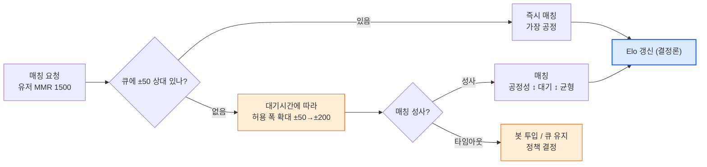
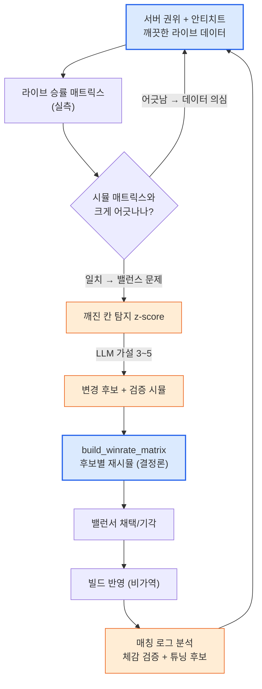

# 8.5 PvP·경쟁 밸런스 — 승률 매트릭스·매치메이킹·서버 권위

지금까지 이 부의 네 챕터는 한 적과 싸웠다. 보스 하나를 몇 초 만에 잡는가, 탱커가 89% 생존하는가, 골드가 새는가. 전부 **단일 대상**을 향한 데미지·생존·수지의 이야기였다. 그런데 PvP에서는 적이 사람이다. 사람은 보스처럼 정해진 패턴으로 움직이지 않고, 같은 직업이라도 손이 다르고, 무엇보다 *서로의 약점을 노린다*. PvE 밸런스가 깊어도 PvP가 통째로 비는 경우가 흔한 건 이 때문이다. 단일 대상 DPS 곡선은 8.1\~8.4가 끝까지 다뤘지만, "가위가 보를 이긴다"는 상성의 그물은 아직 한 번도 안 그렸다.

이 장은 그 빈자리를 메운다. 다룰 것은 셋이다 — 클래스·조합 간 상성을 담는 **승률 매트릭스**, 누구를 누구와 붙일지 정하는 **매치메이킹/MMR**, 그리고 그 모든 수치를 거짓으로 만들 수 있는 **서버 권위·안티치트**. 그리고 이 부 전체를 관통한 경계는 여기서도 그대로다. 전투 공식은 결정론, 매칭과 상성 탐지는 AI 보조. 한 발도 어긋나지 않는다.

---

## 8.5.1 PvP가 PvE와 다른 단 하나

PvE에서 캐릭터의 강함은 **절대값**이다. 검사의 DPS가 800이면 800이고, 보스는 그 800을 그냥 맞는다. 그런데 PvP에서 강함은 **상대적**이다. 검사의 800이 궁수에게는 충분하지만, 자신에게 받는 피해를 30% 줄이는 방패병에게는 560으로 깎여 모자랄 수 있다. 같은 캐릭터의 강함이 *상대가 누구냐에 따라* 달라진다. 이 한 가지가 PvP 밸런스를 PvE와 근본적으로 다른 문제로 만든다.

그래서 PvP 밸런스의 단위는 한 캐릭터의 숫자가 아니라 **한 쌍의 관계**다. "검사 vs 궁수"의 승률, "검사 vs 방패병"의 승률이 각각 따로 존재하고, 이 관계들을 전부 모으면 표 하나가 된다. 가로축에도 세로축에도 같은 클래스 목록이 들어가고, 칸마다 "행이 열을 이길 확률"이 적힌다. 이게 **승률 매트릭스**다. PvE에 DPS 곡선이 있다면, PvP에는 이 매트릭스가 있다.

<svg viewBox="0 0 660 300" xmlns="http://www.w3.org/2000/svg" font-family="sans-serif" font-size="13">
  <rect x="0" y="0" width="660" height="300" fill="#ffffff"/>
  <text x="330" y="28" text-anchor="middle" font-weight="bold" font-size="14" fill="#0f172a">PvE는 절대값, PvP는 관계</text>
  <!-- PvE side -->
  <rect x="30" y="60" width="120" height="60" rx="8" fill="#eaf2fb" stroke="#2c6fbb" stroke-width="1.5"/>
  <text x="90" y="86" text-anchor="middle" fill="#2c6fbb" font-weight="bold">검사</text>
  <text x="90" y="106" text-anchor="middle" fill="#333" font-size="11">DPS 800</text>
  <line x1="150" y1="90" x2="210" y2="90" stroke="#888" stroke-width="1.5" marker-end="url(#ph)"/>
  <rect x="210" y="60" width="120" height="60" rx="8" fill="#f3f4f6" stroke="#6b7280" stroke-width="1.5"/>
  <text x="270" y="86" text-anchor="middle" fill="#374151" font-weight="bold">보스</text>
  <text x="270" y="106" text-anchor="middle" fill="#333" font-size="11">800 그대로 받음</text>
  <text x="180" y="150" text-anchor="middle" fill="#2c6fbb" font-size="11">PvE: 강함 = 절대값</text>
  <!-- PvP side -->
  <rect x="30" y="190" width="120" height="50" rx="8" fill="#fdecea" stroke="#c0392b" stroke-width="1.5"/>
  <text x="90" y="220" text-anchor="middle" fill="#c0392b" font-weight="bold">검사 800</text>
  <line x1="150" y1="200" x2="210" y2="200" stroke="#16a34a" stroke-width="1.5" marker-end="url(#ph)"/>
  <rect x="210" y="180" width="120" height="34" rx="6" fill="#dcfce7" stroke="#16a34a" stroke-width="1.2"/>
  <text x="270" y="202" text-anchor="middle" fill="#14532d" font-size="11">궁수 → 800 (유효)</text>
  <line x1="150" y1="215" x2="210" y2="232" stroke="#dc2626" stroke-width="1.5" marker-end="url(#ph)"/>
  <rect x="210" y="222" width="120" height="34" rx="6" fill="#fee2e2" stroke="#dc2626" stroke-width="1.2"/>
  <text x="270" y="244" text-anchor="middle" fill="#7f1d1d" font-size="11">방패병 → 560 (부족)</text>
  <text x="200" y="284" text-anchor="middle" fill="#c0392b" font-size="11">PvP: 강함 = 상대에 따라 달라짐</text>
  <!-- matrix hint -->
  <rect x="400" y="60" width="230" height="196" rx="8" fill="#fbfbfd" stroke="#94a3b8" stroke-width="1.2"/>
  <text x="515" y="84" text-anchor="middle" fill="#0f172a" font-size="12" font-weight="bold">→ 승률 매트릭스</text>
  <text x="515" y="106" text-anchor="middle" fill="#475569" font-size="11">행이 열을 이길 확률</text>
  <text x="430" y="140" fill="#475569" font-size="11" font-family="monospace">       궁수  방패  법사</text>
  <text x="430" y="162" fill="#16a34a" font-size="11" font-family="monospace">검사   .58  .42  .50</text>
  <text x="430" y="184" fill="#475569" font-size="11" font-family="monospace">궁수   --   .55  .47</text>
  <text x="430" y="206" fill="#475569" font-size="11" font-family="monospace">방패   --   --   .61</text>
  <text x="515" y="238" text-anchor="middle" fill="#94a3b8" font-size="10">(숫자는 예시 — 실측 아님)</text>
  <defs>
    <marker id="ph" markerWidth="8" markerHeight="8" refX="6" refY="3" orient="auto">
      <path d="M0,0 L6,3 L0,6 Z" fill="#888"/>
    </marker>
  </defs>
</svg>

오른쪽 표를 읽는 법은 단순하다. "검사 vs 방패병" 칸이 0.42라면, 검사가 방패병을 이길 확률이 42%, 곧 방패병이 우세한 상성이다. 모든 칸이 0.50에 가까우면 완벽한 균형이지만, 그런 게임은 재미가 없다. 가위바위보처럼 **순환하는 상성**이 있어야 직업 선택에 의미가 생긴다. 문제는 그 순환이 어디선가 끊겨 한 클래스가 모두를 이기는 칸이 생길 때다. 새벽 두 시의 탱커가 PvE의 사고였다면, "방패병 vs 전 직업 승률 60% 초과"는 PvP의 사고다.

여기서 미리 못박아 둘 것이 있다. 이 칸들을 채우는 숫자(0.58, 0.42 등)는 전부 **예시이며 실측이 아니다.** 게임마다 직업 수도, 스킬도, 목표 균형선도 다르다. 이 장에서 신뢰할 것은 숫자가 아니라 *매트릭스를 어떻게 채우고, 어떻게 점검하고, 그 점검의 어디에 AI가 붙는가*라는 구조다.

---

## 8.5.2 매트릭스를 채우는 건 시뮬, 읽는 건 AI

승률 매트릭스의 한 칸을 채우는 일은 8.4에서 본 그 결정론 시뮬과 정확히 같은 도구다. "검사 vs 궁수"를 1,000판 자동 시뮬해서 검사가 몇 판 이겼는지 세면, 그게 그 칸의 승률이다. 직업이 N개라면 칸은 N×N개, 각 칸을 1,000판씩 돌리면 표 하나가 채워진다. 이 시뮬은 끝까지 코드다 — 같은 시드를 주면 같은 매트릭스가 토씨 하나 안 틀리고 재현돼야 한다. 그래야 "이번 빌드에서 방패병이 세졌다"라는 말이 거짓이 아니다.

여기서 PvP만의 함정이 하나 있다. PvE 시뮬에서 적(보스)은 고정 패턴이지만, PvP 시뮬에서 **상대도 행동을 골라야 한다.** 검사가 어떻게 싸우는지를 정하는 봇(bot policy)이 양쪽에 다 필요하다. 그리고 이 봇이 멍청하면 매트릭스 전체가 거짓이 된다 — 컨트롤이 끔찍한 봇끼리 붙이면 "스킬을 아무 때나 쓰는 직업"이 이기는 매트릭스가 나오는데, 실제 숙련 유저의 손에서는 정반대일 수 있다. 그래서 PvP 매트릭스에는 항상 "이 봇이 어느 수준의 플레이를 흉내 내는가"라는 단서가 붙어야 한다. 봇은 휴리스틱(쿨다운 되면 쓴다, HP 30% 미만이면 후퇴 등)으로 짜는 게 보통이고, 이 휴리스틱 자체는 결정론이다.

봇 정책의 골자를 실행 가능한 모양으로 옮기면 이렇다 — 입력이 같으면 같은 행동을 고르는, 환각이 끼어들 여지가 없는 함수다.

```python
def bot_decide(me, enemy, cooldowns, t):
    """결정론 봇 정책. 같은 (상태)면 같은 행동. LLM이 만들지 않는다."""
    # 1) 생존 우선: HP 30% 미만이면 회피/후퇴
    if me.hp_ratio < 0.30 and cooldowns["escape"] <= 0:
        return Action("escape")
    # 2) 상성 스킬: 적이 디버프 면역이 아니면 표식 우선
    if cooldowns["mark"] <= 0 and not enemy.has("debuff_immune"):
        return Action("mark", target=enemy)
    # 3) 사거리 관리: 근접 적이 붙으면 거리 벌리기 (원거리 직업)
    if me.is_ranged and dist(me, enemy) < me.kite_range:
        return Action("reposition")
    # 4) 그 외: 쿨다운 된 최대 데미지 스킬
    return best_ready_damage_skill(me, cooldowns)


def simulate_pvp_match(class_a, class_b, formula, seed=0):
    """1:1 한 판을 결정론적으로 시뮬. 데미지는 8.1의 공식 그대로 사용."""
    rng = Rng(seed)
    a, b = spawn(class_a), spawn(class_b)
    for t in range(MAX_TICKS):
        for me, foe in ((a, b), (b, a)):
            act = bot_decide(me, foe, me.cooldowns, t)
            apply_action(act, me, foe, formula, rng)   # formula = 결정론 데미지 공식
        if a.hp <= 0 or b.hp <= 0:
            break
    return {"winner": "a" if b.hp <= 0 else "b" if a.hp <= 0 else "draw",
            "duration": t * TICK}
```

매트릭스 한 장을 통째로 채우는 건 이 함수를 칸마다 1,000번 돌리는 바깥 루프다.

```python
def build_winrate_matrix(classes, formula, n=1000):
    matrix = {}
    for ca in classes:
        for cb in classes:
            if ca == cb:
                continue
            wins = sum(
                simulate_pvp_match(ca, cb, formula, seed=s)["winner"] == "a"
                for s in range(n)
            )
            matrix[(ca, cb)] = wins / n          # ca가 cb를 이긴 비율
    return matrix
```

여기까지가 코어, 끝까지 코드다. AI는 이 표를 *만드는* 데가 아니라 *읽는* 데 붙는다. N이 8이면 칸은 56개, 사람이 56개 승률을 눈으로 훑으며 "어디가 깨졌나"를 찾는 건 새벽 두 시의 4메가 JSON과 같은 노동이다. 이상한 칸을 고르는 건 8.4의 z-score 탐지가 그대로 한다.

```python
def find_broken_cells(matrix, low=0.40, high=0.60):
    """균형선(0.5) 밖으로 크게 벗어난 칸을 결정론적으로 추린다."""
    broken = []
    for (ca, cb), wr in matrix.items():
        if wr > high or wr < low:
            broken.append((ca, cb, round(wr, 2)))
    return sorted(broken, key=lambda x: abs(x[2] - 0.5), reverse=True)
```

탐지가 칸을 좁히면, 그 칸을 LLM에게 넘긴다. 단, 8.4와 같은 규율이다 — **확정 진단 금지, 가설과 검증 시뮬만.** 예를 들어 "방패병 vs 법사 0.68(z 가장 큼)" 한 줄을 주고 이렇게 요청한다.

```
[깨진 칸]
방패병 → 법사 승률 0.68 (균형선 0.50, 매트릭스 내 z 가장 큼)
부수: 이 매치의 평균 지속시간 38s (전체 평균 22s)

[관련 정보]
- 방패병: 받는 피해 -30% 패시브 "철벽", 침묵 스킬 "방패 강타"(2초)
- 법사: 전 데미지의 70%가 시전 1.5초짜리 스킬에 집중
- 두 직업의 매치 빈도는 실측 큐에서 상위 (인기 조합)

요청: 이 상성 붕괴의 가능 원인 가설 3~5개 + 각 검증 시뮬 1줄.
확정 진단 금지. "~일 수 있다" 수준으로만.
```

LLM은 "철벽 -30%와 침묵 2초가 겹쳐, 법사가 핵심 시전 스킬을 한 번도 못 넣고 죽는 양의 피드백일 수 있다 / 검증: 침묵 지속을 1초로 줄여 같은 칸 재시뮬"처럼 탐색 공간을 좁히는 가설을 던질 뿐이다. 무엇이 진짜인지는 다시 `build_winrate_matrix`를 후보별로 돌려서 정한다. 매치 지속시간이 평균의 1.7배라는 단서까지 LLM이 가설에 엮어 주는 것 — 사람이 56칸을 훑다가는 놓치기 쉬운 그 연결이, 이 자리에서 AI가 버는 시간이다.

---

## 8.5.3 매치메이킹: 상성을 가리는 또 다른 밸런스

승률 매트릭스를 완벽하게 맞춰도 유저가 "졌다"고 느끼는 진짜 원인은 따로 있다. **누구와 붙느냐**다. 실력 1500인 유저가 2200인 유저를 만나면, 직업 상성이 5:5라도 결과는 정해져 있다. 그래서 매치메이킹은 단순한 서버 기능이 아니라 **밸런스의 일부**다. 매트릭스가 직업 간 공정성을 맡는다면, 매치메이킹은 실력 간 공정성을 맡는다.

대부분의 경쟁 게임은 MMR(Matchmaking Rating, 매치메이킹 점수)을 둔다. 이기면 오르고 지면 내리는 숨은 점수로, 비슷한 점수끼리 붙인다. 점수 갱신은 결정론 공식이다 — Elo가 가장 널리 쓰이고, 공개 표준이라 이 책에서 인용해도 되는 몇 안 되는 수식 중 하나다.

```
# Elo: 공개 표준 갱신식 (지어낸 값 아님)
expected_a = 1 / (1 + 10 ** ((rating_b - rating_a) / 400))
new_rating_a = rating_a + K * (score_a - expected_a)
#   score_a: 이기면 1, 지면 0
#   K: 갱신 강도 상수 (게임이 정하는 값. 보통 16~40 범위에서 선택)
#   400, 10: Elo 정의에 박힌 상수
```

이 식 자체는 결정론이고, AI가 들어갈 자리가 아니다. 그런데 매치메이킹에는 결정론 공식만으로 안 풀리는 *긴장*이 하나 있다. **공정성 ↔ 대기시간**의 맞교환이다. 점수가 정확히 같은 상대만 붙이면 매치는 공정하지만, 그런 상대가 큐에 없으면 유저는 10분을 기다린다. 점수 차를 너그럽게 허용하면 빨리 잡히지만 매치가 불공정해진다. 새벽 시간대, 비인기 직업, 고점수 구간일수록 이 긴장이 심해진다.



파란 노드(Elo 갱신)만 결정론이다. 주황 노드 — 허용 폭을 언제 얼마나 넓힐지, 타임아웃에 뭘 할지 — 가 AI 보조가 닿는 자리다. 단, 여기서도 AI가 *실시간 매칭 결정*을 내리는 게 아니다. 그건 빠르고 재현 가능해야 하는 서버 로직이라 규칙 기반 코드의 자리다. AI가 붙는 건 그 규칙을 **튜닝하기 위한 분석**이다. "지난주 매칭 로그에서 어느 점수대·시간대·직업의 매치 품질(승률 편차·대기시간)이 나빴는가"를 요약하고, "허용 폭 곡선을 어떻게 바꾸면 어느 구간의 대기시간이 줄어드는지" 후보를 제안하는 일. 8.4의 위치 3(보고서)·위치 4(이상 해석)·위치 2(변경 후보 탐색)가 매칭 로그로 무대만 옮긴 것이다.

매치메이킹이 승률 매트릭스와 얽히는 지점도 짚어 둔다. 매칭 알고리즘이 직업을 고려하지 않고 점수만 맞추면, 깨진 상성 칸이 그대로 노출된다. 방패병이 법사를 68% 이기는 칸이 살아 있는데 매칭이 둘을 자주 붙이면, 법사 유저의 체감 패배가 매트릭스 수치보다 더 크게 쌓인다. 그래서 매트릭스 점검과 매칭 로그 분석은 따로 도는 게 아니라, *같은 사이클의 입구와 출구*다 — 매트릭스에서 깨진 칸을 고치고, 매칭 로그에서 그 칸이 실제로 얼마나 붙었는지를 확인한다.

---

## 8.5.4 서버 권위: 밸런스의 전제

지금까지의 모든 이야기 — 매트릭스, MMR, 시뮬 — 는 한 가지를 암묵적으로 깔고 있었다. **유저가 보고하는 결과가 진실이라는 것.** PvE에서는 이게 거의 문제가 안 된다. 혼자 보스를 잡는데 누구를 속이겠는가. 그런데 PvP에서는 상대가 있고, 이기면 점수가 오르고, 그래서 **속일 동기가 생긴다.** 데미지를 조작하고, 위치를 조작하고, 쿨다운을 무시하는 클라이언트가 나타나는 순간, 8.1의 결정론 공식은 종이 위에서만 결정론이다. 실제 서버에서는 누군가의 검사가 공식보다 두 배 센 데미지를 넣고 있다.

그래서 경쟁 게임의 첫 번째 밸런스 규칙은 매트릭스보다 앞선다. **결과를 클라이언트가 정하게 하지 마라.** 데미지 계산, 쿨다운 판정, 적중 판정 — 밸런스에 닿는 모든 연산은 서버가 권위를 가진다. 클라이언트는 입력(어디로 이동, 어떤 스킬)만 보내고, 그 입력이 공식에 맞는지, 쿨다운이 돌았는지, 사거리 안인지는 전부 서버가 다시 검증한다. 클라이언트가 보낸 "데미지 999"는 서버가 무시하고, 서버가 공식으로 계산한 값만 적용한다.

<svg viewBox="0 0 680 270" xmlns="http://www.w3.org/2000/svg" font-family="sans-serif" font-size="12">
  <rect x="0" y="0" width="680" height="270" fill="#ffffff"/>
  <text x="340" y="26" text-anchor="middle" font-weight="bold" font-size="14" fill="#0f172a">서버 권위 = 밸런스 공식의 유일한 집행자</text>
  <!-- client -->
  <rect x="40" y="80" width="160" height="110" rx="8" fill="#fdecea" stroke="#c0392b" stroke-width="1.5"/>
  <text x="120" y="106" text-anchor="middle" fill="#c0392b" font-weight="bold">클라이언트</text>
  <text x="120" y="128" text-anchor="middle" fill="#333">입력만 전송</text>
  <text x="120" y="148" text-anchor="middle" fill="#666" font-size="11">"스킬1 사용, 좌표(x,y)"</text>
  <text x="120" y="170" text-anchor="middle" fill="#991b1b" font-size="11">결과를 정하지 못함</text>
  <!-- arrow -->
  <line x1="200" y1="120" x2="290" y2="120" stroke="#888" stroke-width="1.5" marker-end="url(#sh)"/>
  <text x="245" y="112" text-anchor="middle" fill="#666" font-size="10">입력</text>
  <line x1="290" y1="155" x2="200" y2="155" stroke="#16a34a" stroke-width="1.5" marker-end="url(#sh)"/>
  <text x="245" y="172" text-anchor="middle" fill="#16a34a" font-size="10">검증된 결과</text>
  <!-- server -->
  <rect x="290" y="70" width="200" height="130" rx="8" fill="#dbeafe" stroke="#2563eb" stroke-width="2"/>
  <text x="390" y="96" text-anchor="middle" fill="#1e3a8a" font-weight="bold">서버 (권위)</text>
  <text x="390" y="118" text-anchor="middle" fill="#1e3a8a" font-size="11">쿨다운/사거리 검증</text>
  <text x="390" y="138" text-anchor="middle" fill="#1e3a8a" font-size="11">데미지 = 공식(8.1)</text>
  <text x="390" y="158" text-anchor="middle" fill="#1e3a8a" font-size="11">결정론 · 집행</text>
  <text x="390" y="184" text-anchor="middle" fill="#1e40af" font-size="11">"데미지 999" 무시</text>
  <!-- anticheat / logs -->
  <rect x="540" y="80" width="110" height="110" rx="8" fill="#ffedd5" stroke="#ea580c" stroke-width="1.5"/>
  <text x="595" y="106" text-anchor="middle" fill="#9a3412" font-weight="bold" font-size="12">이상 로그</text>
  <text x="595" y="128" text-anchor="middle" fill="#9a3412" font-size="11">불가능 입력</text>
  <text x="595" y="146" text-anchor="middle" fill="#9a3412" font-size="11">패턴 탐지</text>
  <text x="595" y="170" text-anchor="middle" fill="#9a3412" font-size="11">AI 보조 가능</text>
  <line x1="490" y1="135" x2="540" y2="135" stroke="#888" stroke-width="1.5" marker-end="url(#sh)"/>
  <defs>
    <marker id="sh" markerWidth="8" markerHeight="8" refX="6" refY="3" orient="auto">
      <path d="M0,0 L6,3 L0,6 Z" fill="#888"/>
    </marker>
  </defs>
</svg>

서버 권위가 무너지면 밸런스 작업 전체가 거짓이 된다. 승률 매트릭스를 아무리 정교하게 맞춰도, 라이브에서 한 직업이 데미지를 조작하면 그 매트릭스는 종이 위의 약속일 뿐이다. 그래서 안티치트는 별개의 보안 업무가 아니라 **밸런스 데이터의 신뢰성 문제**다. 라이브 승률이 시뮬 매트릭스와 크게 어긋날 때, 첫 번째로 의심할 것은 "공식이 틀렸나"가 아니라 "이 데이터가 깨끗한가"여야 한다.

여기서 AI의 자리가 다시 명확해진다. 치트 판정 자체 — "이 입력을 무효로 한다" — 는 결정론 규칙의 일이다. 0.1초 만에 30미터를 이동한 입력은 물리적으로 불가능하니 규칙으로 막는다. 같은 입력에 같은 판정이 나와야 하고, 억울한 정지를 만들면 안 되니 여기에 확률적 LLM을 둘 수 없다. 반면 **이상 패턴을 *후보*로 추리는 일**은 AI 보조가 닿는다. 서버 로그에서 "이 계정의 적중률 분포가 인간 분포에서 z 몇 만큼 벗어났다", "이 계정군이 동일한 비정상 패턴을 공유한다" 같은 후보를 모아 사람 검토에 올린다. 8.1의 표를 PvP로 옮기면 경계는 이렇다.

| 영역 | AI | 이유 |
|---|---|---|
| 서버 데미지·적중·쿨다운 판정 | 절대 금지 | 결정론 코어. 같은 입력=같은 판정이 깨지면 공정성 붕괴 |
| Elo/MMR 점수 갱신 | 절대 금지 | 공개 표준 결정론 식. 흔들리면 순위가 거짓이 됨 |
| 치트 차단(밴) 판정 자체 | 절대 금지 | 억울한 정지 불가. 같은 증거=같은 판정 |
| 승률 매트릭스 시뮬 | 절대 금지 | 재현 불가 시 "직업이 세졌다"가 거짓이 됨 |
| 깨진 상성 칸 탐지·해석 | 가능 | z-score로 칸 추리고 LLM이 가설(확정 진단 금지) |
| 매칭 로그 품질 분석·튜닝 후보 | 가능 | 대기/공정 맞교환의 변경 후보 제안 (시뮬 검증) |
| 치트 의심 패턴 후보 추출 | 가능 | 사람 검토에 올릴 후보만. 밴 결정은 사람·규칙 |

선은 8.1과 토씨 하나 다르지 않다. **AI는 결정론 코어의 바깥에만 산다.** 집행하는 안쪽 — 데미지, 점수, 밴 — 은 룰북이고, 탐지하고 해석하고 후보를 미는 바깥쪽이 AI의 자리다.

---

## 8.5.5 한 사이클로 묶기

세 주제 — 매트릭스, 매칭, 서버 권위 — 는 따로 도는 세 개의 일이 아니다. 하나의 경쟁 밸런스 사이클의 세 구간이다. 서버 권위가 깨끗한 데이터를 보장하고, 그 데이터로 매트릭스를 점검하고, 매칭 로그로 점검 결과가 실제 큐에서 어떻게 체감되는지를 확인하고, 다시 시뮬로 후보를 검증해 빌드에 반영한다.



파란 노드(서버 권위, 시뮬 재계산)가 결정론, 주황 노드(탐지·가설·매칭 분석)가 AI 보조다. 이 사이클에서 가장 흔한 실패는 C 분기를 건너뛰는 것이다. 라이브 매트릭스가 시뮬과 어긋날 때 곧장 공식부터 손대면, 사실은 치트로 오염된 데이터를 좇아 멀쩡한 직업을 너프하게 된다. 데이터의 청결을 먼저 의심하는 이 한 분기가, 8.1의 "변경 이력"과 같은 역할을 PvP에서 한다 — 빼먹으면 새벽 두 시가 돌아온다.

마지막으로 PvP 밸런스의 18년 함정 몇 가지를 처방과 함께 남긴다.

- **봇 정책이 멍청한데 매트릭스를 믿는다** → 봇 수준을 항상 명시하고, 가능하면 라이브 실측 승률로 교정한다. 봇 매트릭스는 *방향*만, 절대값은 실측으로.
- **매칭을 점수만 맞추고 직업 상성을 무시한다** → 깨진 칸이 살아 있으면 매칭이 그 칸을 노출한다. 매트릭스 점검과 매칭 분석은 같은 사이클로 묶는다.
- **라이브 승률 어긋남을 곧장 공식 탓으로 본다** → 먼저 데이터 청결(치트·버그)을 의심한다. 오염된 데이터로 너프하면 멀쩡한 직업이 망가진다.
- **치트 탐지를 LLM에 위임한다** → 밴 판정은 결정론 규칙. LLM은 *후보 추출*까지만. 억울한 정지는 되돌릴 수 없다.
- **승률 0.50을 목표로 모든 칸을 평탄화한다** → 완전 균형은 직업 선택의 의미를 죽인다. 목표는 *순환하는 상성*이지 모든 칸 0.50이 아니다.

PvP에서 AI의 자리는 PvE와 같다. 결정론 코어 — 데미지, 점수, 밴, 시뮬 — 바깥의 탐지·해석·후보. 코어는 코드와 서버 권위로 지키고, 사람이 56칸을 훑고 매칭 로그를 헤매던 손노동만 덜어낸다 — 이 부 전체가 한 골격으로 움직인다는 마지막 증거가 이 장이다.

---

## 따라하기 — 승률 매트릭스 한 장을 점검하기

**setup.** 8.4의 `simulate_dps`를 1:1로 확장한 `simulate_pvp_match`와, 양쪽 봇을 굴릴 `bot_decide`(휴리스틱 결정론)를 만드세요. 시드를 고정해 같은 매트릭스가 재현되는지부터 확인합니다. 데미지는 반드시 8.1의 공식을 그대로 가져다 쓰고, 봇이 흉내 내는 플레이 수준을 한 줄로 기록하세요.

**prompt.** `find_broken_cells`로 균형선(0.40\~0.60) 밖 칸을 추린 뒤, z가 가장 큰 한 칸만 LLM에 넘깁니다.

```
첨부한 깨진 칸(방패병 vs 법사 0.68, 매치 지속시간 38s/평균 22s)에 대해
가능 원인 가설 3~5개와 각 검증용 재시뮬 1줄을 제시해 줘.
관련 스킬·패시브 정보는 아래에 첨부. 확정 진단 금지 — "~일 수 있다"로만.
수치를 직접 고치지 말고 후보만 제안할 것.
```

**verify.** AI 가설을 그대로 믿지 마세요. 각 가설의 변경 후보를 `build_winrate_matrix`에 넣어 같은 시드로 재시뮬하고, 그 칸이 0.50 근처로 돌아오면서 *다른 칸을 깨뜨리지 않는지*를 함께 확인합니다 (PvP 변경은 한 칸을 고치다 옆 칸을 망치기 쉽습니다). 두 조건을 만족하는 후보만 채택하고, 8.1처럼 결정 로그에 사유·기각된 후보·예측값을 남기세요. 빌드 반영 1주 뒤 라이브 실측 승률을 그 로그에 덧붙입니다.

### 1인 축소판

직업이 둘뿐이고 서버도 없는 1인 프로토타입이라도 골격은 같습니다. 매트릭스는 2×2면 충분하고, 시뮬은 8.1의 30줄 루프에 봇 정책 한 줄(쿨다운 되면 최대 데미지 스킬)만 더하면 됩니다. 서버 권위는 "결과를 클라이언트가 못 정하게 한다"는 원칙만 코드 구조로 지키면 되고, 정식 안티치트는 유저가 생기기 전엔 필요 없습니다. MMR도 처음엔 생략하고, 매트릭스가 한쪽으로 60% 넘게 기우는지만 1,000판 돌려 확인하세요. AI는 그 결과를 읽고 "어느 매치가 깨졌고 왜일 수 있는지"를 요약하는 데만 씁니다. 규모와 상관없이 단 하나 지킬 선 — 데미지와 승패는 코드와 서버가 정하고, LLM에는 절대 시키지 않는다.

---

### 이 챕터의 핵심 메시지

- PvP에서 강함은 절대값이 아니라 관계다. 단위는 한 캐릭터의 숫자가 아니라 승률 매트릭스의 한 칸이며, 목표는 모든 칸 0.50이 아니라 순환하는 상성이다.
- 매트릭스를 채우는 건 결정론 시뮬, 깨진 칸을 추리고 가설을 세우는 건 z-score와 AI다. 매치메이킹의 공정성↔대기 맞교환과 치트 패턴도 같은 경계로 — 집행은 코드·서버, 탐지·후보는 AI.
- 서버 권위는 밸런스의 전제다. 라이브 승률이 시뮬과 어긋나면 공식보다 데이터 청결을 먼저 의심한다.

### 다음 챕터 미리보기
- 9.1 UX/UI 디자인 — 결정의 정밀도가 다른 분야로 옮겨갈 때
