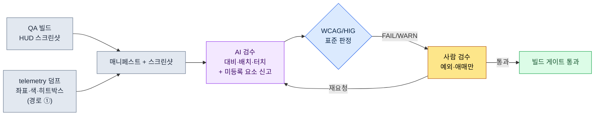

# 9.1 HUD 스크린샷을 lint에 건다 — 시선 이탈·대비 미달을 AI가 잡는 자리

> 1차 독자: HUD·UI를 책임지는 UX 기획자 (중규모(10\~50인) 팀)
> 1인/취미 독자용 축소 버전: §9.1.8 「혼자라면 이만큼만」

QA 빌드에서 새 디버프 알림을 HUD에 얹은 날, 디자이너는 "잘 보인다"고 했고 다음 날 사용자 게시판에는 "디버프가 안 보여서 죽었다"가 올라왔다. 알림은 화면 중앙, 회색 배경에 옅은 노란 글씨로 떠 있었다. 디자이너 모니터에서는 보였고, 전투 중 폭발 이펙트가 화면을 덮은 6인치 폰에서는 안 보였다. 문제는 이게 처음이 아니라는 점이었다. 매 빌드, 매 화면, 같은 종류의 사고가 "이번엔 괜찮겠지"로 반복됐다.

이 장은 그 반복을 끊는 한 가지 작업에 집중한다. **완성된 HUD 스크린샷 한 장을 입력으로 받아, P0 요소가 시선이 닿는 영역(상단 상태대·양쪽 하단 액션 코너)을 벗어났는지, 글자 대비가 가독 임계를 넘는지를 자동으로 검출하는 lint 게이트**다. 우선순위 표·시선 흐름·플랫폼 분기 같은 HUD 설계의 일반 원칙은 이미 다른 책에 충분하니, 이 장은 그 원칙을 *매 빌드 자동으로 강제하는 검수 루프*에만 자리를 쓴다. 핵심은 AI가 화면을 보고 "이 글자는 대비 2.0:1이라 WCAG 4.5:1 미달"이라고 좌표와 숫자로 말하게 만드는 것이다. "잘 보이는데요"라는 말싸움을 코드와 표준으로 대체한다.

---

## 9.1.1 검수 기준은 '느낌'이 아니라 공개 표준이다

HUD 검수가 매번 사람마다 다른 결론을 내는 이유는 기준이 "잘 보인다/안 보인다"라는 주관이기 때문이다. 다행히 가독성·접근성의 상당수는 이미 표준 기구가 숫자로 못 박아 두었다. 지어낼 필요가 없다.

| 검수 항목 | 표준 기준 (출처) | 자동 판정 |
|---|---|---|
| 일반 텍스트 명암 대비 | 4.5:1 이상 (WCAG 2.1 SC 1.4.3) | 가능 — 전경·배경 색상값으로 계산 |
| 큰 텍스트(18pt+) 대비 | 3:1 이상 (WCAG 2.1 SC 1.4.3) | 가능 |
| 비텍스트(아이콘·게이지) 대비 | 3:1 이상 (WCAG 2.1 SC 1.4.11) | 가능 |
| 터치 타깃 최소 크기 | 44×44 pt (Apple HIG) / 48×48 dp (Material) | 가능 — 요소 크기로 |
| 엄지 도달 영역 | **가로 그립 양손 조작** 시 좌·우 하단 코너가 '쉬움' (좌 엄지=이동, 우 엄지=스킬). 업계 통용 thumb-zone 모델 | 부분 — 영역 규칙으로 |

마지막 줄(엄지 도달 영역)만 정량 합격선이 아니라 업계 통용 모델이고, 위 네 줄은 W3C·Apple·Google이 공개한 합격선이다. 명암 대비는 특히 명확하다. WCAG는 두 색의 상대 휘도를 `(L1+0.05)/(L2+0.05)`로 계산하라고 공식까지 공개해 두었다. 회색(#888) 배경에 옅은 노란(#D4C84A) 글씨의 대비는 이 공식에 넣으면 약 2.0:1이 나온다 — 4.5:1 미달, 즉 표준상 명백한 불합격이다. "디자이너 모니터에선 보였다"는 반박이 통하지 않는 자리다.

여기서 한 가지를 분명히 한다. MMORPG·RPG의 모바일 화면은 **가로(landscape)가 표준**이다. 이유는 정보량과 조작이다. 같은 인치라도 가로로 쥐면 한 화면에 담기는 상시 정보가 세로보다 많고, 양손 엄지로 좌(이동)·우(스킬)를 동시에 조작할 수 있다. 세로 한 손 그립은 캐주얼 퍼즐·방치형에는 맞지만, 동시 정보가 많고 양손 조작이 필요한 MMORPG에는 맞지 않는다. 그래서 이 장의 모든 시선·배치 판정은 가로 양손 그립을 전제한다. 화면은 위쪽 가로 상태대, 좌우 두 하단 액션 코너, 그 사이 중앙 게임 영역, 그리고 게임 영역 아래 중앙 하단 슬롯대(소비·자동 아이템·퀵슬롯)로 나뉜다.

이 다섯 줄이 이 장에서 AI에게 줄 **검수 룰북**이다. "디버프가 좀 안 보이는 것 같다"가 아니라 "디버프 텍스트는 대비 2.0:1로 SC 1.4.3 위반"이라고 말할 수 있어야, 사람이 검수하든 AI가 검수하든 같은 판정이 나온다.

플랫폼 기준을 PC와 나란히 두면 검수의 출발점이 분명해진다. 프로젝트 A는 모바일 우선 + PC 보조이므로, 두 기준을 모두 룰북에 둔다.

| 기준 | PC (보조 플랫폼) | 모바일 (우선 플랫폼, 가로) |
|---|---|---|
| 화면·입력 | 27인치+ / 마우스 1px 정밀·호버·단축키 | 6.x인치 가로 / 양손 엄지, 호버 없음 |
| 동시 상시 정보 | 30\~50종 감당 | 12\~16종이 한계 (저자 추정, 미검증) |
| 시선·조작 도달 | 화면 전역 (커서가 어디든 닿음) | 상단 상태대 + 좌·우 하단 코너 + 중앙 하단 슬롯대만 '쉬움' |
| 정밀도 | 1px 클릭 | 최소 44pt 터치 타깃 (HIG) |
| 핵심 검수 위험 | 정보 과밀로 인한 인지 부하 | 좁은 화면 + 손가락 가림 + 중앙 묻힘 |

PC는 마우스 정밀도·호버 툴팁·큰 화면 덕에 정보를 많이 띄워도 시선과 조작이 닿는다. 모바일은 가로라 세로보다 낫지만 PC만큼은 못 담고, 누르는 요소가 양쪽 엄지 코너에 묶이며 호버가 없어 P0 정보는 상시 노출이어야 한다. 그래서 모바일 HUD 검수의 본질은 "예쁜가"가 아니라 **"P0가 시선 닿는 자리(상단·양 코너)에 있고, 글자가 표준 대비를 넘는가"**다. 그 판정이 사람마다 흔들리지 않게 표준으로 못 박는 것이 이 장의 일이다.

---

## 9.1.2 [워크드 트랜스크립트] HUD 스크린샷 한 장을 lint에 건다

실제로 어떻게 돌리는지 한 사이클을 끝까지 보여준다. 아래는 저자 프로젝트(모바일 우선 MMORPG, 이하 "프로젝트 A")의 전투 HUD 검수 세션을 충실히 재현한 것이다. 입력 프롬프트는 그대로 복사해 쓸 수 있고, 출력은 실제 세션을 재구성했다.

### 1단계 — 입력: 스크린샷 + 요소 매니페스트를 함께 던진다

스크린샷만 던지면 AI가 화면을 "추측"한다. 그래서 빌드가 이미 알고 있는 요소 좌표·색상·분류를 매니페스트로 같이 넣는다. 이건 새로 쓰는 게 아니라 빌드 산출물에서 추출만 하면 된다(추출 방법의 현실은 §9.1.4에서 정직하게 비교한다).

```yaml
# hud_capture_manifest.yaml — QA 빌드 스크린샷에 동봉
screen: { w_pt: 844, h_pt: 390 }   # 6.x인치 가로, pt 단위 (가로 그립)
elements:
  - id: hp_bar        # 체력바
    class: P0
    rect_pt: [12, 18, 150, 16]      # x, y, w, h — 상단 좌측
    fg: "#FF5A5A"  ; bg: "#1A1A1A"
  - id: skill_slot_1  # 스킬 슬롯 (우엄지)
    class: P0
    rect_pt: [760, 300, 40, 40]     # ← 우하단 코너, 크기 주목
    fg: "#FFFFFF"  ; bg: "#202830"
  - id: debuff_alert  # 디버프 알림 (어제 추가)
    class: P0
    rect_pt: [400, 180, 70, 24]     # ← 화면 중앙, 위치 주목
    fg: "#D4C84A"  ; bg: "#888888"   # ← 대비 주목
  - id: minimap
    class: P1
    rect_pt: [744, 20, 80, 80]       # 우상단
    fg: "#A0C0FF"  ; bg: "#101820"
```

### 2단계 — 프롬프트: 검수를 시키되, 표준과 형식을 강제한다

```
첨부 스크린샷은 프로젝트 A 전투 HUD고(가로 그립 양손), yaml은 그 화면 요소별 좌표·색·분류야. 둘을 대조해서 검수해줘.
대비는 fg/bg로 WCAG 계산해서 수치까지 적어줘 — 텍스트 4.5:1, 아이콘·큰글자 3:1 미달이면 FAIL.
P0가 상단 상태대나 좌·우 하단 코너를 벗어나 화면 중앙에 떠 있으면 WARN(중앙은 전투 이펙트에 묻혀).
조작 요소가 44pt 미만이거나, 엄지 코너·중앙 하단 슬롯대를 벗어나면 FAIL.
매니페스트에 없는데 화면에 보이는 게 있으면 따로 신고하고, 확신 못 하는 건 '애매'로 빼서 나한테 넘겨.
표로만 줘(요소|검사|측정값|판정|비고), 설명 빼고.
// (의도: P0=0.5초 안에 찾아야 하는 정보 / 소비·자동·퀵슬롯은 중앙 하단이 정상)
```

검수 규칙보다 그 규칙을 어떻게 출력할지에 더 많은 줄이 들어갔다는 점이 중요하다. AI에게 자유를 주면 "전반적으로 깔끔하네요" 같은 칭찬을 토해낸다. 그래서 **계산식(WCAG 대비), 합격선(4.5:1·44pt), 출력 형식(표), 측정값 표기 의무, 그리고 "확신 못 하면 사람에게 넘겨라"는 탈출구**를 미리 못 박는다. 이 다섯 개의 못이 칭찬을 측정값으로 바꾼다.

### 3단계 — Claude의 출력 (재구성, 날것)

```
| 요소         | 검사  | 측정값                    | 판정 | 비고                              |
|-------------|------|--------------------------|------|----------------------------------|
| hp_bar      | 대비  | #FF5A5A/#1A1A1A = 5.7:1   | PASS | 비텍스트 게이지, 3:1 충족          |
| hp_bar      | 배치  | 상단 좌측 (12,18)         | PASS | P0 상단 상태대                     |
| skill_slot_1| 터치  | 40×40 pt, 우하단 코너     | FAIL | HIG 44pt 미달, 4pt 부족 (코너는 OK)|
| skill_slot_1| 배치  | 우하단 (760,300)          | PASS | 우엄지 도달 코너                   |
| debuff_alert| 대비  | #D4C84A/#888888 = 2.0:1   | FAIL | 일반 텍스트 4.5:1 미달 (SC 1.4.3) |
| debuff_alert| 배치  | 화면 중앙부 (400,180)     | WARN | P0인데 중앙 — 전투 이펙트에 묻힘   |
| minimap     | 대비  | #A0C0FF/#101820 = 9.8:1   | PASS |                                  |
| minimap     | 배치  | 우상단 (744,20)           | PASS | P1, 상단 상태대 우측 허용          |

추가 신고:
- 매니페스트엔 4종이나 스크린샷 좌하단에 노란 점멸 아이콘이 하나 더
  보인다(좌표 추정 ~70,330). 매니페스트 누락 의심. (애매 — 화면만으론
  무슨 요소인지 단정 못 함)

요약: FAIL 2건(skill_slot_1 터치, debuff_alert 대비), WARN 1건(debuff_alert
배치), 애매 1건(미등록 아이콘).
```

출력에서 가장 가치 있는 부분은 합격/불합격 표가 아니라 **맨 아래 "추가 신고"와 "애매"**다. AI가 매니페스트에 없는 점멸 아이콘을 화면에서 잡아내고, 그게 뭔지는 자기가 단정 못 한다고 사람에게 넘긴 자리. 좋은 프롬프트는 AI가 "이건 제가 모릅니다"라고 말할 수 있게 만든다.

### 4단계 — 검증과 거부 (사람의 자리)

이 출력을 그대로 받으면 안 된다. AI의 검수 자체를 사람이 한 번 검수한다. 실제로 이 세션에서 한 건이 사람 손에 뒤집혔다.

`debuff_alert`의 대비 FAIL과 배치 WARN은 옳다. 회색 배경 옅은 노랑은 §9.1.1에서 본 그대로 표준 위반이고, P0 알림을 가로 화면 중앙에 둔 것도 전투 이펙트에 묻히는 전형적 실수다. 여기까진 AI가 맞았다.

문제는 `skill_slot_1`의 터치 FAIL이다. AI는 매니페스트의 `40×40 pt`를 그대로 믿고 "44pt 미달"이라 판정했는데, 실제 빌드에서 이 슬롯은 시각적으로 40pt지만 **터치 히트박스가 사방 6pt 확장**되어 실제 탭 영역은 52pt다. 매니페스트 `rect_pt`는 *그려지는 사각형*만 담고 *히트박스*를 담지 않았다 — 즉 입력 데이터의 결함이지 AI의 오판이 아니다. AI는 준 데이터 안에서 정확히 판정했고(코너 위치 판정은 옳았다), 사람은 코드가 모르는 빌드 사정(히트박스 확장)을 알고 있었다. 이 FAIL은 사람이 기각한다.

그래서 두 가지를 동시에 한다. 매니페스트 추출 스크립트가 히트박스도 뽑도록 고치고(데이터 결함 수정), AI에게 재요청한다.

```
skill_slot_1은 시각 크기는 40pt지만 히트박스가 사방 6pt 확장돼서 실제 탭 영역은 52pt야(매니페스트에 hit_rect 추가함). 이 기준으로 터치 다시 봐줘.
debuff_alert FAIL/WARN은 그대로 두고, 대비 4.5:1 넘기는 색 조합 3개 제안해줘(노란 계열 유지, 배경 어둡게). 중앙에서 상단 상태대 우측으로 옮길 좌표도 하나 줘.
```

AI는 `skill_slot_1`을 히트박스 52pt 기준 PASS로 정정하고, 디버프 대비를 위해 배경을 #2A2A00으로 어둡게 깔아 7.8:1을 만드는 색 조합 3안과, 알림을 상단 상태대 우측(약 600,18)으로 옮기는 좌표를 돌려줬다. 한 번의 왕복으로 끝난다. **빌드마다 화면을 눈으로 훑으면 같은 사고가 반복되지만, 스크린샷+매니페스트를 lint에 걸면 대비·배치·터치 위반이 숫자로 떨어지고 사람은 코드가 모르는 예외(히트박스)와 애매(미등록 아이콘)만 판정한다**(검수 1화면이 손으로는 십수 분, 이 루프로는 수 분 — 저자 추정, 미검증 가설. 절대 시간보다 "눈으로 훑기"와 "표준으로 측정"의 구조 차이로 읽는 게 맞다).

---

## 9.1.3 가로 HUD 시선·배치 — 왜 중앙은 위험한가

위 세션에서 `debuff_alert`가 WARN을 받은 이유, 그리고 P0 정보를 어디에 둬야 하는지를 그림 한 장으로 남겨 두면 이후 모든 배치 판정이 빨라진다. 가로로 쥔 폰에서 화면은 네 자리로 나뉜다. **위쪽 가로 상태대**(시선이 먼저 닿고 손가락은 안 가는 읽기 전용), **좌·우 두 하단 코너**(양손 엄지가 닿는 조작 자리 — 좌엄지=이동, 우엄지=스킬), 그 사이 **중앙 게임 영역**(전투가 벌어지는 자리), 그리고 게임 영역 아래 **중앙 하단 슬롯대**(소비·자동 아이템과 퀵슬롯·스킬 슬롯을 두는 자리)다. 아래에서 초록·앰버가 P0와 슬롯이 안전한 영역, 빨강이 P0 알림이 묻히는 게임 중앙이다.

<svg viewBox="0 0 660 340" xmlns="http://www.w3.org/2000/svg" role="img" aria-label="모바일 가로 HUD의 시선 영역과 P0/P1 배치도">
  <!-- 폰 외곽 (가로) -->
  <rect x="20" y="30" width="620" height="280" rx="30" ry="30" fill="#0f1117" stroke="#3a3f4b" stroke-width="3"/>
  <rect x="34" y="44" width="592" height="252" rx="14" ry="14" fill="#11151d"/>
  <!-- 상단 상태 band (초록 — 시선 1순위, 읽기 전용) -->
  <rect x="34" y="44" width="592" height="56" fill="#14532d" opacity="0.55"/>
  <path d="M44 52 H616" fill="none" stroke="#22c55e" stroke-width="2.5" stroke-dasharray="6 4"/>
  <text x="330" y="92" fill="#bbf7d0" font-family="sans-serif" font-size="12" text-anchor="middle" font-weight="bold">상단 가로 상태대 — 시선 1순위 (HP · MP · 타깃, 읽기만)</text>
  <!-- 중앙 위험대(빨강): 게임 영역, P0 두면 이펙트에 묻힘 -->
  <rect x="180" y="100" width="300" height="138" fill="#7f1d1d" opacity="0.4"/>
  <text x="330" y="158" fill="#fecaca" font-family="sans-serif" font-size="13" text-anchor="middle">중앙 — 게임 영역(이펙트 폭주)</text>
  <text x="330" y="178" fill="#fecaca" font-family="sans-serif" font-size="11" text-anchor="middle">P0 알림 두면 묻힘 — debuff_alert가 걸린 자리</text>
  <!-- 중앙 하단 슬롯대 (앰버 — 소비·퀵슬롯·자동, 게임 영역 아래) -->
  <text x="330" y="240" fill="#b45309" font-family="sans-serif" font-size="11" text-anchor="middle" font-weight="bold">중앙 하단 — 소비·퀵슬롯·자동</text>
  <rect x="248" y="248" width="164" height="42" rx="8" fill="#f59e0b" opacity="0.5" stroke="#f59e0b" stroke-width="2" stroke-dasharray="5 4"/>
  <circle cx="298" cy="270" r="11" fill="#fbbf24"/><text x="298" y="274" fill="#000" font-size="8" text-anchor="middle">포션</text>
  <circle cx="330" cy="270" r="11" fill="#fbbf24"/><text x="330" y="274" fill="#000" font-size="8" text-anchor="middle">자동</text>
  <circle cx="362" cy="270" r="11" fill="#fbbf24"/><text x="362" y="274" fill="#000" font-size="8" text-anchor="middle">슬롯</text>
  <!-- 좌하단 엄지 코너 (초록) -->
  <path d="M34 296 L34 146 A150 150 0 0 1 184 296 Z" fill="#14532d" opacity="0.7"/>
  <path d="M34 146 A150 150 0 0 1 184 296" fill="none" stroke="#22c55e" stroke-width="2.5" stroke-dasharray="5 4"/>
  <text x="92" y="254" fill="#bbf7d0" font-family="sans-serif" font-size="13" text-anchor="middle" font-weight="bold">좌엄지</text>
  <text x="92" y="274" fill="#bbf7d0" font-family="sans-serif" font-size="12" text-anchor="middle">이동</text>
  <!-- 우하단 엄지 코너 (초록) -->
  <path d="M626 296 L626 146 A150 150 0 0 0 476 296 Z" fill="#14532d" opacity="0.7"/>
  <path d="M626 146 A150 150 0 0 0 476 296" fill="none" stroke="#22c55e" stroke-width="2.5" stroke-dasharray="5 4"/>
  <text x="568" y="254" fill="#bbf7d0" font-family="sans-serif" font-size="13" text-anchor="middle" font-weight="bold">우엄지</text>
  <text x="568" y="274" fill="#bbf7d0" font-family="sans-serif" font-size="12" text-anchor="middle">스킬</text>
  <!-- 실제 요소 점 -->
  <rect x="60" y="60" width="60" height="10" rx="3" fill="#ef4444"/><text x="90" y="68" fill="#fff" font-size="8" text-anchor="middle">HP</text>
  <rect x="60" y="78" width="60" height="10" rx="3" fill="#3b82f6"/><text x="90" y="86" fill="#fff" font-size="8" text-anchor="middle">MP</text>
  <rect x="300" y="56" width="44" height="20" rx="4" fill="#0ea5e9" opacity="0.8"/><text x="322" y="70" fill="#fff" font-size="8" text-anchor="middle">타깃</text>
  <rect x="560" y="54" width="48" height="40" rx="6" fill="#0ea5e9" opacity="0.7"/><text x="584" y="78" fill="#fff" font-size="8" text-anchor="middle">맵 P1</text>
  <circle cx="330" cy="204" r="13" fill="#facc15" opacity="0.5"/><text x="330" y="208" fill="#000" font-size="6" text-anchor="middle">디버프?</text>
  <circle cx="92" cy="220" r="17" fill="#22c55e"/><text x="92" y="224" fill="#000" font-size="9" text-anchor="middle">이동</text>
  <circle cx="556" cy="222" r="14" fill="#22c55e"/><text x="556" y="226" fill="#000" font-size="9" text-anchor="middle">스킬</text>
  <circle cx="592" cy="210" r="13" fill="#22c55e"/><text x="592" y="214" fill="#000" font-size="9" text-anchor="middle">스킬</text>
  <circle cx="600" cy="272" r="12" fill="#22c55e"/><text x="600" y="276" fill="#000" font-size="8" text-anchor="middle">스킬</text>
</svg>

규칙이 단순하다. **P0 정보(HP·MP·핵심 알림)는 초록(상단 가로 상태대 또는 양쪽 하단 코너) 안에 둔다.** 시선이 먼저 닿거나 엄지가 늘 머무는 길목이기 때문이다. 반대로 **게임 중앙(빨강)은 전투 자체가 벌어지는 자리**라, 여기에 P0 알림을 두면 이펙트가 화면을 덮는 순간 정보가 묻힌다. 한 가지 주의 — 게임 중앙과 **중앙 하단**은 다르다. 게임 중앙은 위험하지만, 그 아래 **중앙 하단 슬롯대(앰버)는 소비·자동 아이템과 퀵슬롯·스킬 슬롯이 사는 자리**다. 내가 쓰거나 자동으로 소비되는 것을 한눈에 보려고 양 엄지 사이에 둔다. 그리고 **읽기만 하는 정보(HP/MP/타깃 체력)는 상단에**, **누르는 요소(이동·스킬)는 양쪽 하단 코너에**, **소비·슬롯은 중앙 하단에** — 이 셋이 손가락·시선 영역이다. §9.1.2에서 디버프 알림이 WARN을 받은 이유가 이 그림 한 장으로 설명된다 — 0.5초 안에 봐야 하는 P0를, 하필 가장 안 보이는 게임 중앙에 뒀기 때문이다. 정정안에서 상단 상태대 우측으로 옮긴 것은 정확히 이 그림의 초록으로 돌려보낸 것이다.

---

## 9.1.4 좌표를 어떻게 뽑을 것인가 — 구현 정직성

이 장의 lint는 "요소별 좌표·색상"이 깨끗이 들어온다는 전제 위에 선다. 그런데 그 좌표를 *어디서 어떻게 뽑느냐*가 실제로는 가장 현실적인 갈림길이다. 책이 흔히 얼버무리는 자리라, 세 경로를 정직하게 비교한다. 정답은 하나가 아니고, 팀 상황에 따라 갈린다.

| 경로 | 무엇을 하나 | 강점 | 약점 / 현실 |
|---|---|---|---|
| ① 게임 내 telemetry 로그 | UI 프레임워크가 그리는 위젯의 좌표·크기·색을 빌드가 직접 덤프 | 좌표가 **정확**(추정 아님), 히트박스·앵커까지 나옴 | UI 코드에 덤프 훅을 심어야 함. 프로그래머 협업 필요. 한 번 깔면 가장 신뢰 가능 |
| ② 기성 vision API | 스크린샷을 OCR·객체검출 API에 넣어 텍스트·박스 좌표 추출 | 빌드 수정 불필요, 외부 스크린샷도 가능 | 좌표가 **근사값**, 게이지·아이콘 같은 비텍스트는 분류가 약함. 외부 전송 = 미공개 빌드 유출 리스크 |
| ③ 직접 구현(픽셀 분석) | 스크린샷을 직접 읽어 색 경계·박스를 휴리스틱으로 추출 | 의존성 최소, 색 대비 계산엔 충분 | 요소 *의미*(이게 P0인지)를 모름. 매니페스트와 대조해야만 쓸모. 유지보수 부담 |

세 경로의 관계가 이 장의 워크드 트랜스크립트를 그대로 설명한다. §9.1.2에서 **대비 검사가 정확했던 건 색상값(fg/bg)이 ①·③로 정확히 들어왔기 때문**이고, **터치 FAIL이 사람 손에 뒤집힌 건 히트박스가 매니페스트에 빠졌기 때문**(②·③은 히트박스를 못 본다, ①만 본다)이다. 즉 *대비*는 픽셀만으로도 잡히지만 *터치 히트박스*는 ① telemetry 없이는 못 잡는다. 이 한계를 알고 시작해야, AI 검수 결과를 어디까지 믿을지 선이 선다.

저자 프로젝트의 선택은 **① telemetry를 정본으로, AI는 스크린샷+telemetry 매니페스트를 대조하는 검수자**로 쓰는 구조다. 화면에만 보이고 매니페스트엔 없는 것(§9.1.2의 미등록 점멸 아이콘)을 AI가 잡고, 매니페스트엔 있고 화면엔 어긋난 것을 사람이 잡는다. 둘 중 하나만으로는 양쪽 사각이 남는다.



사람의 손이 닿는 곳은 두 군데뿐이다. telemetry 덤프를 깨끗이 넣는 자리(맨 앞)와, 코드·표준이 못 잡는 예외(히트박스)·애매(미등록 요소)를 판정하는 자리(맨 뒤). 그 사이의 지루한 대비 계산과 배치 대조는 AI와 표준이 돌린다.

---

## 9.1.5 룰북을 코드로 — 대비·터치·코너 자동 게이트

AI 검수가 매번 산수를 새로 하면 토큰과 시간이 든다. 대비·터치·코너 도달처럼 **결정론으로 떨어지는 항목은 코드가 먼저 친다.** AI는 코드가 못 잡는 것(화면 의미 해석, 미등록 요소)에만 들어간다. 둘은 경쟁이 아니라 분담이다.

```python
# hud_lint.py — HUD 매니페스트 표준 검증 (골격)
# 입력: telemetry 매니페스트(요소별 rect/hit_rect/fg/bg/class/interactive)
# 출력: WCAG/HIG + 양손 도달 위반 목록

def _luminance(hex_color):           # WCAG 상대 휘도
    r, g, b = (int(hex_color[i:i+2], 16) / 255 for i in (1, 3, 5))
    f = lambda c: c/12.92 if c <= 0.03928 else ((c+0.055)/1.055) ** 2.4
    R, G, B = f(r), f(g), f(b)
    return 0.2126*R + 0.7152*G + 0.0722*B

def contrast_ratio(fg, bg):          # WCAG 명암 대비
    L1, L2 = sorted((_luminance(fg), _luminance(bg)), reverse=True)
    return (L1 + 0.05) / (L2 + 0.05)

def in_thumb_corner(e, w, h):
    """가로 그립 양손 엄지가 닿는 좌·우 하단 코너인가."""
    x, y = e["hit_rect"][0] / w, e["hit_rect"][1] / h
    bottom = y > 0.55
    left_corner  = bottom and x < 0.30   # 왼손 엄지 = 이동
    right_corner = bottom and x > 0.70   # 오른손 엄지 = 스킬
    return left_corner or right_corner

def lint(elements, screen_w, screen_h):
    issues = []
    for e in elements:
        # 규칙 A: 명암 대비 (텍스트 4.5:1 / 비텍스트·큰글자 3:1)
        need = 4.5 if e["kind"] == "text" else 3.0
        cr = contrast_ratio(e["fg"], e["bg"])
        if cr < need:
            issues.append(f"[A] {e['id']}: 대비 {cr:.1f}:1 < {need}:1 (WCAG SC 1.4.3)")
        # 규칙 B: 터치 타깃 — 히트박스 기준 (시각 크기 아님)
        if e.get("interactive"):
            tap = min(e["hit_rect"][2], e["hit_rect"][3])   # ← rect 아닌 hit_rect
            if tap < 44:
                issues.append(f"[B] {e['id']}: 탭 {tap}pt < 44pt (HIG)")
            # 규칙 C: 조작 요소는 양손 엄지 코너(좌·우 하단)에 있어야
            if not in_thumb_corner(e, screen_w, screen_h):
                issues.append(f"[C] {e['id']}: 조작 요소가 양손 엄지 코너 밖에 배치됨 "
                              f"(x={e['hit_rect'][0]}, y={e['hit_rect'][1]})")
    return issues
```

이 코드가 회의에서 "이 글자 좀 안 보이지 않아요?"라는 입씨름을 끝낸다. `[A] debuff_alert: 대비 2.0:1 < 4.5:1 (WCAG SC 1.4.3)`이라고 코드가 출력하면 토론할 게 없다. 고치면 된다. 주목할 두 줄은 규칙 B가 `rect`가 아니라 `hit_rect`를 본다는 점, 그리고 규칙 C가 조작 요소를 좌·우 두 하단 코너로만 통과시킨다는 점이다 — §9.1.2에서 사람이 AI를 뒤집은 그 교훈(히트박스)과, 가로 양손 그립의 도달 한계가 함께 코드에 들어갔다. 단일 '엄지 호' 임계 하나가 아니라 좌엄지(이동)·우엄지(스킬) 두 코너를 따로 본다는 점이 가로 판정의 핵심이다. 한 번 사람이 잡은 예외는 다음부터 코드가 잡는다. 그래서 AI에게는 "코드가 PASS 처리한 것 말고, 화면에서만 보이는 이상(미등록 요소·시각적 겹침·잘림)을 신고하라"는 좁은 역할만 남긴다. 결정론으로 잡히는 건 코드가, 화면 의미 해석이 필요한 건 AI가, 빌드 사정을 아는 예외는 사람이 — 이 분담이 핵심이다.

---

## 9.1.6 이 장 수치의 출처

이 장에 나온 수치는 출처가 셋뿐이다. 대비 4.5:1·터치 44pt·48dp는 WCAG SC 1.4.3·HIG·Material의 공식 값이고, #888 배경 #D4C84A 글씨가 약 2.0:1인 것도 그 공식에 색상값을 넣은 계산값이다(§9.1.1·§9.1.5). "검수 한 화면이 손으로 십수 분, 루프로 수 분"·"가로 상시 정보 12\~16종"은 미검증 저자 추정이라 본문에 그렇게 명시했다. 나머지(빌드별 대비 FAIL 건수, 터치 히트박스 미달 수, 엄지 코너 이탈 건수, telemetry 오탭률)는 빌드 로그로 직접 셀 수 있는 값이다. 사용자 불만 건수처럼 HUD 하나로 인과를 단정할 수 없는 결과 지표는 KPI로 올리지 않았다.

---

## 9.1.7 흔한 실패

| 패턴 | 왜 실패하나 | 처방 |
|---|---|---|
| 디자이너 모니터에서 눈으로 검수 | 6인치·전투 이펙트 조건이 빠져 대비 사고 반복 | 스크린샷 lint를 빌드 게이트로 (§9.1.2) |
| 스크린샷만 AI에 던지고 "검토해줘" | 좌표를 추측해 근사 판정, 신뢰 불가 | telemetry 매니페스트 동봉 (§9.1.4) |
| 시각 크기로 터치 타깃 판정 | 히트박스 확장을 놓쳐 멀쩡한 버튼을 FAIL | `hit_rect` 기준 검사 (§9.1.5) |
| P0 알림을 화면 중앙에 배치 | 전투 이펙트에 묻혀 "안 보여서 죽음" | 상단 상태대·양 코너로 (§9.1.3) |
| 조작 버튼을 화면 좌측 중앙·상단에 배치 | 가로 양손 그립에서 엄지가 안 닿음 | 좌·우 하단 코너로 (§9.1.5 규칙 C) |
| 세로 한 손 그립을 전제로 설계 | MMORPG는 가로 양손이 표준, 정보·조작이 안 맞음 | 가로 양손으로 전환 (§9.1.1) |
| 대비를 "보인다/안 보인다"로 토론 | 결론이 사람마다 다름 | WCAG 4.5:1 계산값으로 (§9.1.1) |

네 번째가 가장 자주 반복된다. 새 알림을 급히 얹을 때 빈 공간이 화면 중앙뿐이라 거기 둔다 — 그리고 그 중앙이 정확히 게임이 벌어지는 자리다.

---

## 9.1.8 따라하기 — 오늘 할 수 있는 한 단계

> **혼자라면 이만큼만**: telemetry도 매니페스트도 없어도 됩니다. 본인 게임(또는 좋아하는 게임)의 가로 HUD 스크린샷을 한 장 찍고, 가장 작은 글씨·아이콘 두세 개의 전경/배경 색을 스포이드로 뽑아 손으로 적은 뒤, §9.1.2의 프롬프트를 붙여 한 번 돌려 보세요. AI가 계산한 대비 수치 하나를 골라 온라인 WCAG 대비 계산기로 직접 검산해 보면, "보인다/안 보인다"가 어떻게 숫자가 되는지 몸으로 들어옵니다. AI가 화면 중앙에 둔 P0가 있으면 "왜 중앙이 위험한지 다시 보라"고 반박해 보세요.

팀이라면 다음 한 단계로 시작하세요. UI 프레임워크에서 위젯 좌표·색·히트박스를 덤프하는 telemetry 훅(경로 ①)을 프로그래머와 먼저 합의하고, §9.1.5의 `contrast_ratio` 한 함수부터 빌드에 넣습니다. 대비 계산은 표준 공식이라 이견이 없고, 한 함수만 있어도 매 빌드 대비 FAIL이 숫자로 떨어집니다. 그다음 `in_thumb_corner`를 얹으면 가로 양손 조작 요소의 코너 이탈까지 코드가 잡습니다. 배치·미등록 요소 같은 해석은 그 위에 AI로 얹으면 됩니다.

---

### 이 챕터의 핵심 메시지
- HUD 검수 기준은 느낌이 아니라 공개 표준이다 (WCAG 4.5:1·HIG 44pt).
- 스크린샷+telemetry 매니페스트를 AI에 걸어 대비·배치·미등록 요소를 검출한다.
- 가로 양손 그립에서 누르는 요소는 양쪽 하단 코너, 읽는 정보는 상단 상태대 — 중앙은 묻힌다.

### 다음 챕터 미리보기
- 9.2 스킬 슬롯 4컬럼이냐 8컬럼이냐 — 한 결정이 인지·전투·플랫폼·면적에 동시에 미치는 영향을 측정으로 푸는 사례
