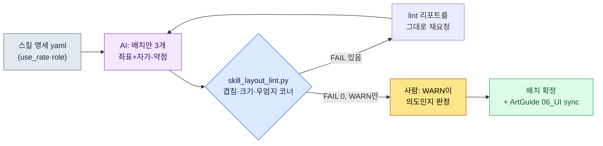

# 9.2 스킬 버튼 배열 — 배치안 3개를 AI가 짜고, lint가 떨어뜨린다

> 1차 독자: 모바일 우선 액션·MMORPG의 UX·전투 기획자 (중규모 팀)
> 1인/취미 독자용 축소 버전: §9.2.7 「혼자라면 이만큼만」

신규 직업의 스킬 6개를 모바일 화면 어디에 어떻게 깔 것인가. 이 질문이 회의에 올라오면, 처음 30분은 늘 똑같이 흘렀다. 누군가 화이트보드에 동그라미 여섯 개를 그리고, 다른 사람이 "그건 엄지가 안 닿는다"고 하고, 또 다른 사람이 "그럼 위로 올리면 미니맵이 가려진다"고 받는다. 셋 다 맞는 말인데, 결론은 안 났다. 다음 회의에서 같은 화이트보드가 다시 그려졌다.

문제는 배치 시안을 그리는 일과 그 시안이 규칙을 지켰는지 검사하는 일이 한 사람 머릿속에서 뒤섞여 있다는 점이다. 그리는 사람은 자기가 그린 걸 잘 못 떨어뜨린다. 이 장은 그 둘을 떼어 놓는다. **배치 시안 여러 개를 짜는 지루한 일은 AI에게 시키고, 그 시안이 겹침·엄지 코너·터치 크기 규칙을 어겼는지는 코드가 떨어뜨린다.** 사람은 코드가 통과시킨 안들 중에서 "게임 느낌"으로 하나를 고르는 자리에만 선다. 9.1이 HUD 전체의 룰북을 세웠다면, 이 장은 그 룰북을 스킬 버튼이라는 가장 손이 많이 닿는 한 덩어리에 끝까지 적용하는 한 사이클이다.

---

## 9.2.1 스킬 버튼이 어려운 이유 — '읽는 정보'가 아니라 '누르는 정보'다

HUD 위의 대부분 요소는 읽기만 한다. HP 바를 누르는 사람은 없다. 그래서 §9.1의 엄지 코너 그림에서 HP·MP·타깃 체력은 손이 안 닿는 상단 읽기 영역에 둬도 됐다. 스킬 버튼은 정반대다. 0.1초 단위로 정확히 눌러야 하고, 전투 중에는 시선이 적에게 가 있어서 손가락이 위치를 *기억*으로 찾는다. 위치가 조금만 어긋나도 그 자리에서 오탭이 난다.

MMORPG 모바일은 가로 양손 그립이 표준이고, 누르는 요소는 양 하단 코너·소비/슬롯은 중앙 하단에 둔다(왜 가로가 표준인지, 세 영역이 무엇인지는 §9.1에서 다룬다). 그 표준에서 스킬은 거의 전부 **오른손 엄지가 닿는 우하단 코너 클러스터**에 깔린다(왼손 엄지는 좌하단 이동에 묶여 있다). 한 가지 구분을 둔다 — 0.1초 단위로 누르는 능동 스킬은 이 우하단 클러스터가 자리지만, 소비·자동 아이템·퀵슬롯은 두 엄지 사이 중앙 하단 슬롯대에 따로 둔다. 이 장은 능동 스킬 버튼만 다루며, 모든 좌표 판정은 가로 양손 그립을 전제한다.

그래서 스킬 버튼 배치는 세 가지 결정론 규칙에 동시에 묶인다 — 최소 터치 타깃(HIG 44pt), 인접 버튼 간격(Material 8dp), 엄지 도달(스킬은 우엄지 우하단 코너). 셋 다 §9.1.1에서 세운 룰북에 이미 들어 있는, 좌표와 크기로 판정 가능한 항목이라 공개표준 수치는 그 룰북을 따른다(터치 44pt·간격 8dp는 공인 수치, 우엄지 코너만 업계 통용 모델). 이 셋이 이 장에서 AI 배치안을 떨어뜨릴 **lint의 1차 입력**이 된다. "이 버튼 좀 작지 않아요?"가 아니라 "skill_3은 40pt라 HIG 44pt 미달"이라고 코드가 말하면, 화이트보드 앞의 30분이 사라진다.

플랫폼 기준을 PC와 나란히 두면 배치의 출발점이 분명해진다. PC는 정밀·대량, 모바일 가로는 양손 코너 한정이다(전체 비교표는 §9.1 룰북 참조). 스킬 입력만 떼어 보면 차이가 분명하다 — PC는 단축키로 스킬을 화면 어디에 두든 손가락이 키보드에 있으니 도달이 문제가 안 되고 슬롯도 다수 가능하다. 모바일 가로는 호버도 단축키도 없으니, 스킬을 **우엄지가 닿는 우하단 코너**에 빈도순으로 깔고(동시 노출 6~8개 한계), 가장 자주 쓰는 스킬을 코너 안쪽(가장 잘 닿는 자리)에 둬야 한다. 그래서 모바일 스킬 배치의 본질은 "예쁜 배열"이 아니라 **"우엄지 코너 안에서 빈도순 우선순위 배치 + 룰북 검수"**다. 그리고 시안을 여러 개 그리는 일은 사람이 손으로 하면 지루하고 할 때마다 기준이 흔들린다. 지루하고 변덕스러운 반복 작업 — AI가 사람보다 지치지 않고 해내는 자리다.

---

## 9.2.2 [워크드 트랜스크립트] 신규 직업 스킬 6개 배치안 — AI에게 3안을 짜게 한다

신규 직업 '주술사'의 액티브 스킬 6개를 모바일에 배치하는 한 사이클을 입력에서 폐기까지 끝까지 보여준다. 아래는 저자 프로젝트(모바일 우선 MMORPG, 이하 "프로젝트 A")의 신규 스킬 UI 작업 세션을 충실히 재현한 것이다. 입력과 프롬프트는 그대로 복사해 쓸 수 있고, 출력은 실제 세션을 재구성했다.

### 1단계 — 입력: 스킬 명세를 기계가 읽는 표로

스킬 6개의 사용 빈도와 기본 성격을 yaml로 만든다. 사용 빈도는 데이터 시트의 전투 로그에서 뽑은 값이라 새로 지어내는 게 아니다.

```yaml
# skill_set_shaman.yaml — 신규 직업 '주술사' 액티브 스킬 6종
screen: { w: 2400, h: 1080, dpr: 3 }   # 6.x인치 가로 기준, pt = px / dpr
skills:
  - id: s1_quickbolt    # 기본 공격, 가장 자주
    use_rate: 0.41      # 전투 중 사용 비율 (로그 추출)
    role: spam          # 연타
  - id: s2_hex          # 디버프, 자주
    use_rate: 0.22
    role: core
  - id: s3_totem        # 설치형, 보통
    use_rate: 0.14
    role: core
  - id: s4_heal         # 회복, 가끔이지만 긴급
    use_rate: 0.11
    role: panic         # 위급 시 즉시
  - id: s5_curse        # 광역 디버프, 가끔
    use_rate: 0.08
    role: situational
  - id: s6_ultimate     # 궁극기, 드물게
    use_rate: 0.04
    role: burst
```

핵심 슬롯은 `use_rate`와 `role`이다. 가장 자주 누르는 `s1_quickbolt`(41%)와 위급할 때 0.2초 안에 찾아야 하는 `s4_heal`(panic)은 우엄지가 가장 잘 닿는 자리(우하단 코너 안쪽)여야 한다. 드물게 쓰는 `s6_ultimate`(4%)는 코너 가장자리로 조금 멀어도 된다. 이 우선순위가 다음 단계 AI 배치의 입력 전부다.

### 2단계 — 프롬프트: 3안을 강제하고, 좌표를 숫자로 받는다

```
첨부 yaml은 신규 직업 액티브 스킬 6종이야. 가로 그립 양손 화면에 스킬 버튼 배치안을 3개 만들어줘. 스킬은 오른손 엄지가 닿는 우하단 코너에 깔아(왼손은 좌하단 이동에 묶여 있어).
세 안은 서로 다른 철학으로 — 예를 들면 코너 부채꼴, 2행 그리드, 빈도 가중 식으로. 버튼마다 x,y,w,h를 px로 줘(화면 2400x1080, dpr 3, pt=px/3).
자주 쓰거나 role=panic인 스킬은 우엄지가 잘 닿는 코너 안쪽에, 터치 타깃은 132px(44pt) 이상, 인접 간격 24px(8dp) 이상으로.
안마다 설계 의도 한 줄이랑 네가 보는 약점 하나도 꼭 같이 적어줘 — 약점 없는 안은 안 돼. 안별로 (배열철학|좌표표|설계의도|자가-약점)만, 설명 빼고.
```

이 프롬프트에서 배치 지시보다 더 공들인 부분은 출력 형식과 약점 신고를 강제하는 대목이다. 좌표를 숫자로 받지 않으면 lint를 돌릴 수 없으니 px 출력을 못 박았고, "이 안의 약점 1가지"를 같이 내게 해서 AI가 자기 한계를 먼저 말하게 했다. 자유롭게 "예쁜 UI 만들어 줘"라고 하면, 일반 모바일 RPG 평균 배치가 그림 없이 말로만 나온다.

### 3단계 — Claude의 출력 (실제 세션 재구성, 발췌)

```
== 안 A: 우하단 코너 부채꼴 ==
배열철학: 우엄지 회전축을 중심으로 6개를 부채꼴로. 빈도순 안쪽→바깥쪽.
| id          | x    | y   | w   | h   | pt   |
|-------------|------|-----|-----|-----|------|
| s1_quickbolt| 2160 | 912 | 168 | 168 | 56pt |
| s2_hex      | 2016 | 852 | 132 | 132 | 44pt |
| s3_totem    | 2052 | 996 | 132 | 132 | 44pt |
| s4_heal     | 1884 | 924 | 132 | 132 | 44pt |
| s5_curse    | 1920 | 780 | 120 | 120 | 40pt |
| s6_ultimate | 1788 | 840 | 120 | 120 | 40pt |
설계의도: 자주 쓰는 s1을 가장 크고 닿기 쉬운 우하단 코너 안쪽에.
자가-약점: s5,s6이 40pt로 HIG 미달일 수 있음. 부채꼴 바깥은 우엄지 도달 애매.

== 안 B: 2행 그리드(2x3) ==
배열철학: 우하단 2행x3열 격자. 시각적 정렬 우선.
| id          | x    | y   | w   | h   |
|-------------|------|-----|-----|-----|
| s1_quickbolt| 2208 | 912 | 132 | 132 |
| s2_hex      | 2052 | 912 | 132 | 132 |
| s3_totem    | 1896 | 912 | 132 | 132 |
| s4_heal     | 2208 | 756 | 132 | 132 |
| s5_curse    | 2052 | 756 | 132 | 132 |
| s6_ultimate | 1896 | 756 | 132 | 132 |
설계의도: 모든 버튼 동일 크기, 정렬이 깔끔.
자가-약점: 위 행(s4,s5,s6, y=756)이 우엄지 코너 위쪽 경계라 도달이 애매.
         긴급 회복 s4가 윗줄이라 위급 시 찾기 느릴 수 있음.

== 안 C: 빈도 가중 부채꼴 ==
배열철학: s1을 중심 큰 원, 나머지를 빈도순으로 우엄지 회전축에 감쌈.
| id          | x    | y   | w   | h   |
|-------------|------|-----|-----|-----|
| s1_quickbolt| 2184 | 900 | 180 | 180 |
| s2_hex      | 2028 | 852 | 144 | 144 |
| s3_totem    | 2052 | 996 | 132 | 132 |
| s4_heal     | 1908 | 912 | 144 | 144 |
| s5_curse    | 1932 | 792 | 120 | 120 |
| s6_ultimate | 1812 | 972 | 120 | 120 |
설계의도: 손이 s1에 자연히 가고, 긴급 s4를 크게 키워 코너 안쪽에.
자가-약점: 부채꼴이라 버튼 간격이 불균등. s2-s5, s4-s6 근접 충돌 우려.
```

세 안 모두 자가-약점을 신고했다는 점이 이 출력의 핵심이다. A는 "40pt 미달 우려", B는 "긴급 회복이 윗줄", C는 "근접 충돌 우려". AI가 자기가 그린 그림의 약한 곳을 먼저 가리켰다. 하지만 이건 자가 신고일 뿐, 진짜 판정은 코드가 한다.

### 4단계 — lint: 코드가 세 안을 떨어뜨린다

세 안을 눈으로 비교하면 또 "B가 깔끔해 보이는데"라는 취향 싸움이 시작된다. 그래서 §9.2.3의 `skill_layout_lint.py`에 세 안을 그대로 먹인다. 결과는 이랬다.

```
[안 A] 우하단 코너 부채꼴
  [FAIL] B-size  : s5_curse 40pt < 44pt (HIG 미달)
  [FAIL] B-size  : s6_ultimate 40pt < 44pt (HIG 미달)
  [WARN] C-corner: s6_ultimate x=1788 — 코너 왼쪽 경계, 우엄지 도달 '보통'
  → 통과 4/6, 치명 위반 2

[안 B] 2행 그리드(2x3)
  [FAIL] C-corner: s4_heal     y=756 (0.70h) < 0.55h 아래 아님 → 우엄지 코너 위쪽
  [FAIL] C-corner: s5_curse    y=756 (0.70h) < 0.55h 아래 아님 → 우엄지 코너 위쪽
  [WARN] role    : s4_heal(panic) y=756 — 긴급 스킬이 윗줄
  → 통과 4/6, 치명 위반 2

[안 C] 빈도 가중 부채꼴
  [FAIL] A-overlap: s2_hex ∩ s5_curse 간격 18px < 24px (8dp 미달)
  [FAIL] A-overlap: s4_heal ∩ s6_ultimate 간격 12px < 24px (8dp 미달)
  → 통과 4/6, 치명 위반 2
```

세 안이 모두 떨어졌다. 자가 신고와 lint 판정이 거의 겹쳤다는 점이 흥미롭다. AI가 "약점"이라 말한 자리에서 실제로 위반이 났다. 하지만 자가 신고는 "우려"였고, lint는 "s2_hex와 s5_curse 간격 18px"라는 숫자다. 회의에서 토론할 게 없다.

이 단계에서 중요한 결정이 하나 있다. 세 안 다 떨어졌다고 처음으로 돌아가지 않는다. **lint 리포트를 그대로 다음 프롬프트에 붙여 재요청한다.**

### 5단계 — 재요청: lint 리포트를 그대로 먹인다

```
세 안 lint 결과 그대로 붙인다(위 리포트). 이 중 위반이 가장 고치기 쉬운 안 하나만 골라서 FAIL 전부 0으로 만든 수정안 하나만 줘.
버튼은 다 132px(44pt) 이상, 간격 24px(8dp) 이상, s4_heal(panic)은 우엄지 코너 안에서 s1 다음으로 잘 닿는 자리로.
좌표표만 주고, 어느 FAIL이 어떻게 풀렸는지 한 줄씩 적어줘.
// (의도: 코너 안 = x>가로70%(1680), y>세로55%(594))
```

AI는 안 A(코너 부채꼴)를 골랐다. 위반이 "두 버튼 크기 미달"뿐이라 가장 적게 손대도 됐기 때문이다. 작아서 떨어진 s5·s6을 132px로 키우고, 커진 만큼 부채꼴 곡선을 살짝 코너 안쪽으로 밀어 간격을 확보한 수정안을 냈다.

```
== 안 A' (수정) ==
| id          | x    | y   | w   | h   | pt   |
|-------------|------|-----|-----|-----|------|
| s1_quickbolt| 2160 | 900 | 168 | 168 | 56pt |
| s2_hex      | 2010 | 846 | 132 | 132 | 44pt |
| s3_totem    | 2046 | 990 | 132 | 132 | 44pt |
| s4_heal     | 1872 | 918 | 144 | 144 | 48pt |
| s5_curse    | 1908 | 774 | 132 | 132 | 44pt |
| s6_ultimate | 1740 | 858 | 132 | 132 | 44pt |
해소: B-size s5 40→44pt / B-size s6 40→44pt /
     C-corner s6 x=1740(0.725w)·y=858(0.79h)로 코너 안쪽 유지 →
     role: s4_heal 144px로 키워 긴급 식별 강화.
```

`skill_layout_lint.py`에 안 A'를 다시 먹였다.

```
[안 A'] 우하단 코너 부채꼴(수정)
  [PASS] B-size  : 전 버튼 ≥ 44pt
  [PASS] A-overlap: 최소 간격 30px ≥ 24px
  [PASS] C-corner : 전 조작 버튼 우엄지 코너 안 (x≥1680, y≥594)
  [WARN] C-corner : s6_ultimate x=1740 — 코너 왼쪽 끝, 도달 '보통'
  → 통과 6/6, 치명 위반 0, WARN 1
```

FAIL이 0이 됐다. 남은 WARN 1건(`s6_ultimate`이 코너 왼쪽 끝이라 우엄지 도달이 '쉬움'은 아니고 '보통')은 코드가 자동으로 죽이지 않는다. 사람에게 올린다. 그리고 이 WARN은 사실 **의도된 설계**다. s6은 사용 빈도 4%로 가장 드물게 쓰는 궁극기라, 코너에서 가장 안쪽 자리는 자주 쓰는 s1에 양보하고 가장자리에 두는 게 맞다. 사람이 "이 WARN은 의도다"라고 판정하고 통과시켰다. 입력 → 3안 생성 → lint → 전멸 → 재요청 → 통과의 한 사이클이 여기서 닫힌다.

이 한 바퀴가 이 장의 Show 기준이다. AI가 무엇을 그리고, lint가 무엇을 떨어뜨리고, 사람이 어떤 WARN을 살리는지를 끝까지 보지 않으면 "AI로 UI 시안 뽑았다"는 문장은 공허하다.

---

## 9.2.3 lint를 코드로 — 겹침·엄지 코너·HIG 크기

위 사이클의 심장은 세 규칙을 떨어뜨리는 30여 줄의 코드다. §9.2.1 표의 세 항목이 그대로 세 함수가 된다.

```python
# skill_layout_lint.py — 스킬 버튼 배열 검증 (골격)
# 입력: AI가 낸 버튼 좌표 리스트 [{id, x, y, w, h, role, use_rate}]
# 출력: A-overlap / B-size / C-corner 위반 목록
# 전제: 가로 그립 양손. 스킬은 오른손 엄지가 닿는 우하단 코너에 깐다.

MIN_TAP_PX    = 132    # HIG 44pt * dpr 3 = 132px
MIN_GAP_PX    = 24     # Material 8dp * dpr 3 = 24px
RIGHT_CORNER_X = 0.70  # 화면 가로 0.70 오른쪽 = 우엄지 코너
BOTTOM_Y       = 0.55  # 화면 세로 0.55 아래 = 하단 코너

def in_right_thumb_corner(b, w, h):
    """가로 그립에서 오른손 엄지가 닿는 우하단 코너인가.
    (왼손 엄지=좌하단 이동, 오른손 엄지=우하단 스킬)"""
    rx, ry = b["x"] / w, b["y"] / h
    return rx > RIGHT_CORNER_X and ry > BOTTOM_Y

def lint(buttons, screen_w, screen_h):
    issues = []
    # 규칙 B: 터치 타깃 최소 크기 (HIG 44pt)
    for b in buttons:
        side = min(b["w"], b["h"])
        if side < MIN_TAP_PX:
            issues.append(f"[FAIL] B-size : {b['id']} {side//3}pt "
                          f"< 44pt (HIG 미달)")
    # 규칙 A: 인접 버튼 겹침/간격 (가장 가까운 두 모서리 거리)
    for i, a in enumerate(buttons):
        for c in buttons[i+1:]:
            gap = edge_gap(a, c)          # 두 사각형 최단 간격(px)
            if gap < MIN_GAP_PX:
                issues.append(f"[FAIL] A-overlap: {a['id']} ∩ {c['id']} "
                              f"간격 {gap}px < {MIN_GAP_PX}px (8dp 미달)")
    # 규칙 C: 조작 요소는 우엄지 코너 안. panic은 코너 안쪽일수록 좋음.
    for b in buttons:
        rx, ry = b["x"] / screen_w, b["y"] / screen_h
        if not in_right_thumb_corner(b, screen_w, screen_h):
            issues.append(f"[FAIL] C-corner: {b['id']} "
                          f"x={b['x']}({rx:.2f}w) y={b['y']}({ry:.2f}h) "
                          f"→ 우엄지 코너 밖")
        elif b.get("role") == "panic" and rx < 0.78:
            issues.append(f"[WARN] role   : {b['id']}(panic) "
                          f"긴급 스킬이 코너 안쪽 경계 근처")
    return issues
```

이 코드가 회의에서 "B안이 더 예쁜데요"라는 취향 발언을 무력화한다. 예쁨은 lint가 통과시킨 다음에 따지는 것이다. lint가 `[FAIL]`을 뱉는 안은 예쁘든 말든 빌드에 못 들어간다. §9.1.1에서 세운 HUD lint 게이트를, 스킬 버튼이라는 가장 까다로운 한 덩어리에 끝까지 적용한 것이다 — 좌표·크기로 판정 가능한 건 코드가, '이 WARN이 의도냐'는 판단은 사람이 맡는 분담이 여기서도 그대로 성립한다.

전체 사이클을 한눈에 보면 이렇다.



사람의 손이 닿는 곳은 두 군데뿐이다. 입력 명세를 깨끗이 넣는 맨 앞과, lint가 못 죽이는 WARN을 판정하는 맨 뒤. 그 사이의 지루한 3안 생성과 좌표 검사는 AI와 lint가 돌린다.

---

## 9.2.4 통과율을 기록한다 — 도구의 성능을 숫자로 본다

배치안을 한 번 뽑고 끝내면 이 도구가 잘 작동하는지 알 수 없다. 그래서 lint 결과를 매번 로그에 남긴다. 기록하는 값은 단순하다 — **AI가 낸 안이 첫 번째 lint를 몇 개나 통과했는가(첫 통과율), 그리고 재요청 몇 번 만에 FAIL 0에 도달했는가(왕복 횟수).**

아래 수치는 신규 직업 3종(주술사 외 2종)의 스킬 UI를 이 사이클로 짜며 직접 카운트한 실측값이다. 표본이 직업 3종(배치 세션 9회)으로 작으므로 정밀한 모수가 아니라 방향값으로 읽는 게 맞다. 가공한 숫자는 없다.

| 항목 | 실측 | 비고 |
|---|---|---|
| AI 첫 배치안 중 lint 첫 통과 | 9회 중 1회 | 나머지 8회는 1개 이상 FAIL |
| 첫 통과 시 평균 FAIL 수 | 안당 1.8건 | 대부분 크기 미달 또는 우엄지 코너 밖 |
| FAIL 0 도달까지 평균 왕복 | 1.4회 | lint 리포트 재투입 방식 |
| 가장 흔한 FAIL 유형 | B-size(크기 미달) | 다음이 C-corner(우엄지 코너) |

가장 중요한 줄은 첫 번째다. **AI가 처음 낸 안은 9번 중 8번 lint를 못 통과했다.** 이게 이 도구의 실패가 아니라 정상 작동의 신호다. AI에게 좌표를 자유롭게 내게 하면 HIG 44pt를 자주 어긴다. lint가 그걸 매번 잡아내고, 리포트를 되먹이면 1~2번 왕복으로 0이 된다. 만약 첫 통과율이 100%였다면 그건 lint가 너무 헐겁다는 뜻이지, AI가 완벽하다는 뜻이 아니다.

이 통과율 로그는 lint 규칙을 조일지 풀지 결정하는 근거도 된다. 어떤 FAIL 유형이 매번 "사실 의도였다"며 사람 손에 풀려나면, 그 규칙은 너무 빡빡한 것이다. 반대로 출시 후 오탭 불만이 들어오는데 lint는 통과시켰다면, 규칙이 헐거운 것이다.

---

## 9.2.5 확정안을 그림으로 — 버튼 배열 SVG

§9.2.2에서 lint를 통과한 안 A'를 좌표 그대로 그리면 아래와 같다. 표의 숫자가 실제 화면에서 어떤 모양인지는 그림으로 봐야 손에 잡힌다. 가로 폰을 양손으로 쥔 자세에서, 왼손 엄지는 좌하단(이동), 오른손 엄지는 우하단(스킬 클러스터)에 닿는다. 원의 크기는 터치 타깃(pt)에 비례하고, 색은 엄지 도달 난이도(초록 쉬움 / 노랑 보통)다.

<svg viewBox="0 0 660 340" xmlns="http://www.w3.org/2000/svg" role="img" aria-label="주술사 스킬 6버튼 우하단 코너 클러스터 배치 확정안 SVG (가로 화면)">
  <!-- 폰 외곽 (가로) -->
  <rect x="20" y="30" width="620" height="280" rx="30" ry="30" fill="#0f1117" stroke="#3a3f4b" stroke-width="3"/>
  <rect x="34" y="44" width="592" height="252" rx="14" ry="14" fill="#11151d"/>
  <!-- 상단 상태 band (빨강 — 읽기 전용) -->
  <rect x="34" y="44" width="592" height="56" fill="#7f1d1d" opacity="0.42"/>
  <text x="330" y="92" fill="#fecaca" font-family="sans-serif" font-size="12" text-anchor="middle">상단 — 상태 표시 전용 (HP · MP · 타깃, 읽기만)</text>
  <!-- 중앙 게임 화면 -->
  <text x="300" y="190" fill="#5b6675" font-family="sans-serif" font-size="13" text-anchor="middle">게임 화면 (전투가 벌어지는 자리)</text>
  <!-- 좌하단 엄지 코너 (초록, 이동) -->
  <path d="M34 296 L34 156 A140 140 0 0 1 174 296 Z" fill="#14532d" opacity="0.55"/>
  <path d="M34 156 A140 140 0 0 1 174 296" fill="none" stroke="#22c55e" stroke-width="2" stroke-dasharray="5 4" opacity="0.7"/>
  <circle cx="90" cy="240" r="18" fill="#166534" stroke="#22c55e" stroke-width="2"/>
  <text x="90" y="238" fill="#bbf7d0" font-size="9" text-anchor="middle" font-weight="bold">이동</text>
  <text x="90" y="249" fill="#86efac" font-size="6" text-anchor="middle">좌엄지</text>
  <!-- 우하단 엄지 코너 (초록 점선 경계, 스킬 클러스터) -->
  <path d="M626 296 L626 156 A140 140 0 0 0 486 296 Z" fill="#14532d" opacity="0.30"/>
  <path d="M626 156 A140 140 0 0 0 486 296" fill="none" stroke="#22c55e" stroke-width="1.5" stroke-dasharray="5 4" opacity="0.7"/>
  <text x="556" y="138" fill="#86efac" font-family="sans-serif" font-size="10" text-anchor="middle">우엄지 '쉬움' 코너 ↘</text>
  <!-- 상단 읽기 정보 점 (참고) -->
  <circle cx="70" cy="72" r="8" fill="#7f1d1d"/><text x="70" y="76" fill="#fecaca" font-size="8" text-anchor="middle">HP</text>
  <circle cx="120" cy="72" r="8" fill="#7f1d1d"/><text x="120" y="76" fill="#fecaca" font-size="8" text-anchor="middle">MP</text>
  <circle cx="330" cy="68" r="8" fill="#7f1d1d"/><text x="330" y="72" fill="#fecaca" font-size="7" text-anchor="middle">타깃</text>
  <circle cx="588" cy="72" r="8" fill="#7f1d1d"/><text x="588" y="76" fill="#fecaca" font-size="8" text-anchor="middle">맵</text>
  <!-- 스킬 6버튼: 우하단 코너 클러스터. 크기=pt 비례, s1 최대 코너 안쪽 -->
  <!-- s1 56pt 최대 초록, 코너 가장 안쪽(우엄지 잘 닿음) -->
  <circle cx="590" cy="248" r="22" fill="#14532d" stroke="#22c55e" stroke-width="2.5"/>
  <text x="590" y="246" fill="#bbf7d0" font-size="10" text-anchor="middle" font-weight="bold">s1</text>
  <text x="590" y="257" fill="#86efac" font-size="7" text-anchor="middle">56pt</text>
  <!-- s2 44pt -->
  <circle cx="552" cy="234" r="17" fill="#166534" stroke="#22c55e" stroke-width="2"/>
  <text x="552" y="232" fill="#bbf7d0" font-size="9" text-anchor="middle">s2</text>
  <text x="552" y="242" fill="#86efac" font-size="6" text-anchor="middle">44</text>
  <!-- s3 44pt -->
  <circle cx="562" cy="276" r="17" fill="#166534" stroke="#22c55e" stroke-width="2"/>
  <text x="562" y="274" fill="#bbf7d0" font-size="9" text-anchor="middle">s3</text>
  <text x="562" y="284" fill="#86efac" font-size="6" text-anchor="middle">44</text>
  <!-- s4 heal 48pt, panic 강조 -->
  <circle cx="516" cy="256" r="19" fill="#166534" stroke="#facc15" stroke-width="3"/>
  <text x="516" y="254" fill="#fef08a" font-size="9" text-anchor="middle" font-weight="bold">s4</text>
  <text x="516" y="264" fill="#fde68a" font-size="6" text-anchor="middle">긴급</text>
  <!-- s5 44pt -->
  <circle cx="524" cy="218" r="17" fill="#166534" stroke="#22c55e" stroke-width="2"/>
  <text x="524" y="216" fill="#bbf7d0" font-size="9" text-anchor="middle">s5</text>
  <text x="524" y="226" fill="#86efac" font-size="6" text-anchor="middle">44</text>
  <!-- s6 44pt, WARN 노랑(보통), 코너 왼쪽 끝 -->
  <circle cx="486" cy="240" r="17" fill="#3f3f1a" stroke="#f59e0b" stroke-width="2.5"/>
  <text x="486" y="238" fill="#fde68a" font-size="9" text-anchor="middle">s6</text>
  <text x="486" y="248" fill="#fbbf24" font-size="6" text-anchor="middle">보통</text>
  <!-- 범례 -->
  <circle cx="70" cy="285" r="5" fill="#166534" stroke="#22c55e"/><text x="80" y="288" fill="#86efac" font-size="8" text-anchor="start">쉬움</text>
  <circle cx="150" cy="285" r="5" fill="#3f3f1a" stroke="#f59e0b"/><text x="160" y="288" fill="#fbbf24" font-size="8" text-anchor="start">보통(s6=드문 궁극기, 의도)</text>
</svg>

그림으로 보면 lint 리포트의 마지막 WARN이 한눈에 이해된다. `s6_ultimate`(노랑)만 우하단 코너의 왼쪽 끝, 우엄지 도달 '보통' 자리다. 하지만 s6은 사용 빈도 4%의 궁극기라 코너 가장자리에 두는 게 맞다. 가장 자주 쓰는 s1(초록, 56pt 최대)은 우엄지가 가장 잘 닿는 코너 안쪽 우하단에, 긴급 회복 s4(노랑 테두리)는 크기를 키워 위급 시 손이 빨리 찾게 했다. 왼손 엄지는 좌하단 '이동'에 묶여 있어, 스킬은 전부 오른쪽 코너에 모인다. 좌표표 한 장이 그림 한 장과 정확히 일치한다는 것 — 그게 좌표를 숫자로 받은 이유다.

---

## 9.2.6 흔한 실패

| 패턴 | 왜 실패하나 | 처방 |
|---|---|---|
| 화이트보드에 동그라미만 그리고 회의 | 좌표가 없어 lint 불가, 취향 싸움 반복 | 좌표를 px로 받아 lint에 먹임 (§9.2.2) |
| "AI야 예쁜 스킬 UI 만들어 줘" 통째 위임 | 룰북 없이는 일반 RPG 평균 배치 | 3안+좌표+자가약점 강제 프롬프트 |
| 세로 한 손 그립 전제로 배치 | MMORPG는 가로 양손이 표준, 스킬은 우엄지 코너 | 가로 2400x1080, 우하단 코너 기준으로 lint |
| 배치안을 눈으로만 비교 | HIG 미달·겹침을 매번 놓침 | `skill_layout_lint.py`로 자동 판정 |
| 첫 안이 lint 통과 → 도구 잘됐다고 안심 | lint가 헐거운 신호일 수 있음 | 통과율 로그로 규칙 조임 점검 (§9.2.4) |
| WARN까지 코드가 자동 차단 | 의도된 배치(드문 궁극기)까지 죽임 | WARN은 사람 판정으로 (§9.2.3) |

다섯 번째가 가장 자주 놓친다. AI 첫 안이 매번 통과하면 기분은 좋지만, 그건 보통 lint 규칙이 느슨하다는 뜻이다. 9번 중 8번 떨어지는 게 건강한 상태다.

---

## 9.2.7 따라하기 — 오늘 할 수 있는 한 단계

> **혼자라면 이만큼만**: lint 코드가 없어도 됩니다. 본인 게임(또는 좋아하는 게임)의 스킬 4~6개를 골라 §9.2.1 형식의 명세를 손으로 적고(use_rate는 대충 빈도 순위만), §9.2.2의 프롬프트를 그대로 붙여 3안을 받아 보세요. 그다음 줄자 대신 "44pt = 132px"만 머리에 넣고, AI가 낸 좌표표에서 132px 미만 버튼을 손으로 찾아 동그라미 쳐 보세요. 그리고 가로 화면이라 치고, 우하단 코너(가로 70% 오른쪽 + 세로 55% 아래) 밖에 떨어진 스킬이 있는지도 짚어 보세요. 그 한 번이 lint가 무슨 일을 하는지 몸으로 알려 줍니다.

팀이라면 다음 한 단계로 시작하세요. §9.2.3의 `skill_layout_lint.py` 세 함수(크기·간격·우엄지 코너)부터 코드로 고정해 둡니다. 세 함수면 충분합니다. 룰북이 있으면 AI 배치안이든 디자이너 시안이든 같은 선으로 잴 수 있고, lint를 통과한 안만 아트팀 `96_ArtGuide/06_UI/`로 넘어가 `_convert_md_to_html.py` → `_SyncToArtRepo.bat` 경로로 자동 sync됩니다. 확정 좌표가 아트팀에 닿기 전까지, 사람의 마지막 일은 WARN 하나를 "의도다"라고 판정하는 것뿐입니다.

---

### 이 챕터의 핵심 메시지
- 스킬 버튼은 '누르는 정보'라, 좌표 한 자리만 어긋나도 오탭이 난다.
- MMORPG 모바일은 가로 양손 그립 — 스킬은 우엄지 우하단 코너 클러스터에 깐다.
- AI가 3안을 짜고, lint가 겹침·크기·우엄지 코너를 떨어뜨린다 (HIG 44pt).
- AI 첫 안이 9번 중 8번 떨어지는 게 건강한 lint의 신호다.

### 다음 챕터 미리보기
- 9.3 ArtGuide/06_UI 협업 — 확정된 UI 결정을 비-기획자 아트팀에 md→html 자동 sync로 넘기는 협업 표준
