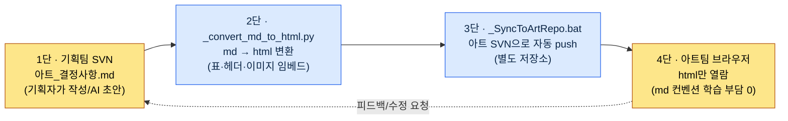

# 9.3 ArtGuide/06_UI 협업 — 기획자는 md로 쓰고, 아트팀은 html만 본다

> 1차 독자: 비-기획 직군(아트)과 매일 협업하는 UX·UI 기획자 (중규모 팀)
> 1인/취미 독자용 축소 버전: §9.3.8 「혼자라면 이만큼만」

기획자가 마크다운으로 UI 결정사항을 정리해 두면 일이 깔끔해진다. 버전 관리가 되고, diff가 보이고, AI에게 그대로 던질 수 있다. 문제는 아트팀이 마크다운을 읽지 않는다는 것이다. 더 정확히는, 읽을 이유가 없다. 아트 디자이너에게 "`아트_결정사항.md`를 SVN에서 받아서 보세요"라고 말하면, 절반은 SVN 클라이언트를 안 깔았고, 나머지 절반은 `##` 헤더와 표 문법이 깨진 채로 메모장에서 연 화면을 보며 "이거 어떻게 봐요"라고 묻는다.

여기서 잘못된 처방은 "아트팀에게 마크다운을 가르치자"다. 아트 디자이너의 시간은 픽셀을 미는 데 써야 한다. 마크다운 컨벤션, SVN 체크아웃, diff 보는 법을 배우는 데 쓰는 시간은 전부 손실이다. 옳은 처방은 **기획자 쪽에서 변환과 전달을 자동화해서, 아트팀의 학습 부담을 0으로 만드는 것**이다. 기획자는 md로 쓰고, 스크립트가 html로 바꾸고, 또 다른 스크립트가 아트 저장소로 밀어 넣고, 아트팀은 브라우저에서 html만 본다. 이 장은 그 파이프라인을 실제로 한 번 끝까지 돌린다 — 결정사항 초안을 AI로 뽑는 자리부터, 변환·전달의 자동화, 그리고 사람이 무엇을 거부하는지까지.

---

## 9.3.1 협업이 깨지는 진짜 자리는 '포맷'이다

기획과 아트의 협업이 깨지는 이유를 "결정권 모호"로 정리하는 책이 많다. 누가 색을 정하고 누가 기능을 정하느냐. 그 분담도 중요하지만, 분담표를 아무리 잘 그려도 **그 분담표를 아트팀이 못 읽으면** 아무 일도 일어나지 않는다. 실무에서 더 자주 사고가 나는 자리는 결정권이 아니라 전달 포맷이다.

저자의 프로젝트(모바일 우선 MMORPG, 이하 "프로젝트 A")에서 실제로 반복된 사고는 이렇다.

| 사고 | 표면 원인 | 진짜 원인 |
|---|---|---|
| 아트가 구버전 결정사항으로 작업 | "최신 안 받았네요" | 전달이 수동(메일 첨부)이라 누락 |
| 결정사항 표가 깨져 보임 | "이거 왜 이래요" | md를 메모장에서 열어서 |
| "그 결정 어디 적혀 있어요?" | 구두 전달 | 정본(canonical)이 채팅에 흩어짐 |

세 사고 모두 결정권 문제가 아니다. **정본 문서가 아트팀이 읽는 포맷으로, 자동으로, 항상 최신 상태로 전달되지 않아서** 생긴다. 그래서 이 장의 도구는 분담표가 아니라 전달 파이프라인이다. 분담은 한 번 합의하면 끝이지만, 전달은 결정이 바뀔 때마다 매번 일어나기 때문이다.

실제 폴더 구조부터 본다. 프로젝트 A의 아트 가이드는 `workspace/96_ArtGuide/` 아래 7개 도메인으로 나뉜다.

```
96_ArtGuide/
├── 00_Common/      # 공통 (스타일·컬러팔레트·라이팅 기준)
├── 01_Character/
├── 02_Animation/
├── 03_Monster/
├── 04_NPC/
├── 05_VFX/
├── 06_UI/          # ← 이 장이 다루는 영역
└── 07_Env/
```

그리고 이 폴더에는 운영 파일 두 개가 같이 산다. `_convert_md_to_html.py`와 `_SyncToArtRepo.bat`다. 이 두 파일이 이 장의 척추다.

---

## 9.3.2 4단 sync 파이프라인 — 기획자 md에서 아트팀 브라우저까지

전체 흐름은 네 단계다. 핵심은 **사람(기획자)은 1단의 md만 만지고, 나머지 3단은 전부 스크립트가 돌린다**는 점이다. 아트팀은 4단의 html만 본다. md의 존재 자체를 몰라도 된다.



각 단계가 정확히 무엇을 하는지 짚는다.

**1단(기획자, 사람)** — `06_UI/아트_결정사항.md`에 결정사항을 마크다운으로 쓴다. 이 자리에 AI를 끼우는 법이 §9.3.4의 척추다. 결정사항은 "버튼 primary 색상 #3A7BD5", "터치 타깃 최소 44pt" 같은 항목이다.

**2단(`_convert_md_to_html.py`, 자동)** — md를 html로 변환한다. 단순 변환이 아니라, 아트팀이 보기 좋게 표를 렌더링하고, `` 이미지 참조를 인라인으로 임베드하고, 목차를 단다. 아트 디자이너가 브라우저에서 더블클릭 한 번으로 열 수 있는 자기완결 html이 나온다.

**3단(`_SyncToArtRepo.bat`, 자동)** — 변환된 html을 **아트팀의 별도 SVN 저장소**로 push한다. 기획 저장소와 아트 저장소가 분리돼 있는 게 핵심이다. 아트팀은 자기 저장소만 보면 되고, 기획 저장소의 권한·구조를 알 필요가 없다.

**4단(아트팀, 사람)** — 아트 디자이너는 자기 저장소에 동기화된 html을 브라우저에서 연다. 마크다운 문법도, SVN 명령도, diff 보는 법도 배울 필요가 없다. **md 컨벤션 학습 부담이 0**이라는 게 이 파이프라인의 설계 목표이자 성공 기준이다.

피드백은 4단에서 1단으로 돌아온다. 아트가 "이 결정 이상해요"라고 말하면 기획자가 md를 고치고, 2~3단이 다시 자동으로 돈다. 아트는 갱신된 html을 다시 열기만 하면 된다.

---

## 9.3.3 왜 변환·전달을 자동화하는가 — 학습 부담의 비대칭

여기서 한 번 멈추고 설계 의도를 명시한다. md를 html로 바꾸는 일은 그 자체로는 사소하다. 진짜 설계는 **누구의 학습 부담을 누가 떠안느냐**를 결정한 데 있다.

선택지는 두 갈래였다.

<svg viewBox="0 0 640 300" xmlns="http://www.w3.org/2000/svg" role="img" aria-label="학습 부담 분배 두 방식 비교 — 아트팀이 md를 배우는 안 vs 기획자가 자동화를 떠안는 안">
  <!-- 왼쪽: 잘못된 안 -->
  <rect x="20" y="20" width="280" height="260" rx="10" fill="#1a1014" stroke="#7f1d1d" stroke-width="2"/>
  <text x="160" y="48" fill="#fecaca" font-family="sans-serif" font-size="15" text-anchor="middle" font-weight="bold">안 A — 아트팀이 md를 배운다</text>
  <rect x="50" y="70" width="100" height="44" rx="6" fill="#3a1518" stroke="#b91c1c"/>
  <text x="100" y="97" fill="#fca5a5" font-family="sans-serif" font-size="12" text-anchor="middle">기획자</text>
  <text x="100" y="135" fill="#fca5a5" font-family="sans-serif" font-size="11" text-anchor="middle">md만 작성</text>
  <line x1="150" y1="92" x2="190" y2="92" stroke="#b91c1c" stroke-width="2" marker-end="url(#arrowR)"/>
  <rect x="190" y="70" width="100" height="44" rx="6" fill="#3a1518" stroke="#b91c1c"/>
  <text x="240" y="91" fill="#fca5a5" font-family="sans-serif" font-size="12" text-anchor="middle">아트 5인</text>
  <text x="240" y="107" fill="#fca5a5" font-family="sans-serif" font-size="10" text-anchor="middle">×SVN·md학습</text>
  <text x="160" y="170" fill="#fda4af" font-family="sans-serif" font-size="11" text-anchor="middle">학습 비용 = 1회 작성 ×</text>
  <text x="160" y="188" fill="#fda4af" font-family="sans-serif" font-size="11" text-anchor="middle">아트 인원수만큼 곱해짐</text>
  <text x="160" y="222" fill="#f87171" font-family="sans-serif" font-size="12" text-anchor="middle" font-weight="bold">부담이 픽셀 작업 시간을</text>
  <text x="160" y="240" fill="#f87171" font-family="sans-serif" font-size="12" text-anchor="middle" font-weight="bold">갉아먹음 → 거부됨</text>
  <!-- 오른쪽: 채택안 -->
  <rect x="340" y="20" width="280" height="260" rx="10" fill="#0d1512" stroke="#15803d" stroke-width="2"/>
  <text x="480" y="48" fill="#bbf7d0" font-family="sans-serif" font-size="15" text-anchor="middle" font-weight="bold">안 B — 기획자가 자동화한다</text>
  <rect x="370" y="70" width="100" height="44" rx="6" fill="#0f2417" stroke="#16a34a"/>
  <text x="420" y="91" fill="#86efac" font-family="sans-serif" font-size="12" text-anchor="middle">기획자</text>
  <text x="420" y="107" fill="#86efac" font-family="sans-serif" font-size="10" text-anchor="middle">md+스크립트1회</text>
  <line x1="470" y1="92" x2="510" y2="92" stroke="#16a34a" stroke-width="2" marker-end="url(#arrowG)"/>
  <rect x="510" y="70" width="100" height="44" rx="6" fill="#0f2417" stroke="#16a34a"/>
  <text x="560" y="91" fill="#86efac" font-family="sans-serif" font-size="12" text-anchor="middle">아트 5인</text>
  <text x="560" y="107" fill="#86efac" font-family="sans-serif" font-size="10" text-anchor="middle">html 더블클릭</text>
  <text x="480" y="170" fill="#86efac" font-family="sans-serif" font-size="11" text-anchor="middle">학습 비용 = 기획자 1회</text>
  <text x="480" y="188" fill="#86efac" font-family="sans-serif" font-size="11" text-anchor="middle">(아트 부담 0)</text>
  <text x="480" y="222" fill="#4ade80" font-family="sans-serif" font-size="12" text-anchor="middle" font-weight="bold">아트는 픽셀에만 집중</text>
  <text x="480" y="240" fill="#4ade80" font-family="sans-serif" font-size="12" text-anchor="middle" font-weight="bold">→ 지속됨</text>
  <defs>
    <marker id="arrowR" markerWidth="8" markerHeight="8" refX="6" refY="3" orient="auto"><path d="M0,0 L6,3 L0,6 Z" fill="#b91c1c"/></marker>
    <marker id="arrowG" markerWidth="8" markerHeight="8" refX="6" refY="3" orient="auto"><path d="M0,0 L6,3 L0,6 Z" fill="#16a34a"/></marker>
  </defs>
</svg>

핵심은 비대칭이다. 안 A는 학습 비용이 아트 인원수만큼 곱해지고, 그 비용이 매 신규 입사자마다 재발한다. 안 B는 기획자가 한 번 스크립트를 짜면 끝이고, 아트 쪽 한계 비용이 0이다. **부담을 인원이 많은 쪽이 아니라 자동화가 가능한 쪽에 몰아주는 것** — 이게 비-기획 직군 협업 도구의 1원칙이다. 이 원칙이 깨지면, 즉 협업 도구가 상대 직군에게 새 학습을 강요하면, 그 도구는 한두 분기 안에 "안 쓰게" 된다.

---

## 9.3.4 [워크드 트랜스크립트] UI 결정사항 md 초안을 AI로 뽑는다

1단에서 기획자가 md를 쓴다고 했는데, 그 md 초안을 AI로 뽑는 자리를 한 사이클 끝까지 보여준다. 결정 회의가 끝나면 산발적인 메모(채팅·화이트보드 사진·구두 합의)가 남는다. 이걸 정본 결정사항 md로 정리하는 일은 지루하고, 매번 형식이 흔들린다. AI에게 딱 맞는 일이다. 단, **결정 자체는 사람이 하고, AI는 결정을 정해진 포맷으로 정리만 한다**는 경계가 핵심이다.

### 1단계 — 입력: 회의 메모 날것

```
[UI 결정 회의 메모 — 06_UI 스킬 슬롯 관련, 날것]
- 스킬 슬롯 버튼 사이즈 키우자 했음. 모바일에서 작대서.
- 색은 아트가 정하기로. 근데 primary 톤은 파란 계열 유지.
- 슬롯 비활성(쿨다운) 상태 표현 회색+숫자 오버레이로 합의
- 다국어... 스킬명 길어지는 거 어떡하지? 일단 보류
- 아 그리고 롱프레스로 스킬 설명 뜨게 (이건 기능, 기획 확정)
```

### 2단계 — 프롬프트: 결정/보류/책임자를 강제 분리한다

```
첨부는 UI 결정 회의 날것 메모야. 아트팀에 넘길 결정사항 마크다운으로 정리해줘.
각 항목을 [확정]/[보류]/[아트결정]으로 분류하고(확정=기획이 정해 아트가 따름, 보류=미결+이유, 아트결정=시각 표현이라 아트가 정함·기획은 제약만), 근거/제약 한 줄씩 붙여줘 — 메모에 근거 없으면 '근거 미기재'라고 솔직히 적고 추측으로 채우지 마.
터치 크기처럼 공개 표준으로 검증되는 건 표준 명시하고, 메모에 없는 항목은 절대 새로 지어내지 마.
표는 |항목|분류|결정/제약|근거|검증가능 여부|, frontmatter(title, layer: L1) 포함해서 전문으로 줘.
```

이 프롬프트의 무게중심은 정리 작업이 아니라 분류 강제와 지어내기 금지에 실려 있다. AI에게 결정사항 정리를 시키면, 메모에 없던 "베스트 프랙티스"를 친절하게 추가해 버린다. 그 추가분이 아트팀에게는 "기획이 확정한 결정"으로 읽힌다. 그래서 **[확정]/[보류]/[아트결정] 분류, 근거 의무, 그리고 "메모에 없으면 지어내지 마라"는 못**을 박는다.

### 3단계 — Claude의 날것 출력 (실제 세션 재구성)

```markdown
---
title: 06_UI 결정사항 — 스킬 슬롯
layer: L1
---

# 06_UI 결정사항 — 스킬 슬롯

| 항목 | 분류 | 결정/제약 | 근거 | 검증가능 |
|---|---|---|---|---|
| 스킬 슬롯 버튼 크기 | [확정] | 최소 44×44 pt 이상 | 모바일 터치 타깃, Apple HIG 44pt 권장 | ✅ 좌표·크기 |
| primary 톤 | [아트결정] | 파란 계열 유지(제약), 정확한 값은 아트 | 메모: "primary 톤은 파란 계열 유지" | △ 색상값 |
| 쿨다운 상태 표현 | [확정] | 회색 오버레이 + 잔여 숫자 | 회의 합의 | ◯ 시각 검수 |
| 스킬명 다국어 길이 | [보류] | 추후 회의 | 메모: "일단 보류" — 긴 언어(독·러) 검증 미실시 | — |
| 롱프레스 스킬 설명 | [확정] | 롱프레스 → 툴팁 표시 | 기능 확정(기획 영역) | ◯ 동작 검수 |
| 슬롯 간 간격 | [확정] | 최소 8 dp 권장 | 근거 미기재 — 메모에 없음, Material 권장값 참고 | ✅ |
```

### 4단계 — 검증과 거부 (사람의 자리)

이 출력을 그대로 정본으로 올리면 안 된다. 한 줄이 걸린다.

마지막 줄 `슬롯 간 간격 | 최소 8 dp`다. 메모를 다시 보면, 회의에서 간격 얘기는 **나온 적이 없다**. AI가 "모바일 UI니까 간격 기준도 있어야겠지"라고 판단해 Material Design 권장값을 친절하게 추가한 것이다. 규칙 5("메모에 없는 항목 지어내기 금지") 위반이다. AI는 `근거 미기재`라고 솔직히 적긴 했지만, 항목 자체를 만들지는 말았어야 했다. 이 한 줄이 아트팀에게 가면 "기획이 8dp 간격을 확정했다"로 읽힌다.

그래서 재요청한다.

```
'슬롯 간 간격'은 회의 메모에 없고 네가 추가한 거야. 표에서 빼줘.
메모엔 없지만 결정이 필요해 보이는 건 표 말고 맨 아래 '## 미결 — 다음 회의 안건'에 후보로만 올리고, 결정사항 표엔 메모에 실제로 있던 항목만 남겨줘.
```

AI는 간격 항목을 표에서 빼고, 맨 아래에 "다음 회의 안건: 슬롯 간 간격 기준(현재 미정), 다국어 스킬명 길이 처리"를 후보로 분리했다. 이제 결정사항 표에는 회의에서 실제로 정한 것만 남고, AI가 떠올린 합리적 후보는 "확정"이 아니라 "안건"으로 강등됐다. 이 분리가 중요한 이유는, 아트팀이 받는 문서에서 **무엇이 확정이고 무엇이 아직 논의 중인지가 섞이면, 아트가 미정 사항을 확정으로 알고 작업을 시작**하기 때문이다.

이 한 번의 왕복으로 1단(md)이 완성됐다. 이제 사람의 손을 떠나 2~3단 자동화로 넘어간다.

---

## 9.3.5 2~3단 자동화 — 변환과 전달은 사람이 손대지 않는다

완성된 md는 이제 스크립트가 처리한다. 변환 스크립트의 골격은 단순하다.

```python
# _convert_md_to_html.py (골격)
# 입력: 06_UI/*.md (기획자가 쓴 결정사항)
# 출력: 같은 이름의 .html (아트팀이 브라우저에서 열 자기완결 파일)

def convert(md_path):
    md_text = read(md_path)
    front, body = split_frontmatter(md_text)          # title·layer 추출
    html_body = markdown_to_html(body, extensions=[
        "tables",        # 표 렌더링 (아트가 메모장서 보던 깨진 표 해결)
        "fenced_code",
    ])
    html_body = embed_images_inline(html_body, base_dir=md_path.parent)
    # ↑  같은 참조를 인라인 임베드 →
    #   아트가 이미지 파일을 따로 안 받아도 됨
    toc = build_toc(html_body)                         # 목차 자동 생성
    return render_template(title=front["title"], toc=toc, body=html_body)
```

여기서 변환이 단순 md→html이 아니라는 점이 핵심이다. 세 가지를 더 한다. **표를 제대로 렌더링하고**(아트가 메모장에서 보던 깨진 `|---|`가 사라진다), **이미지를 인라인 임베드하고**(아트가 이미지 파일을 따로 받을 필요가 없다), **목차를 자동으로 단다**(결정사항이 길어져도 아트가 원하는 항목으로 점프한다). 이 세 가지가 "html만 보면 된다"를 실제로 성립시킨다.

전달 스크립트는 이렇게 묶인다.

```bat
REM _SyncToArtRepo.bat (골격)
REM 1) 06_UI의 모든 md를 html로 변환
python _convert_md_to_html.py 06_UI\*.md

REM 2) 변환된 html을 아트 SVN 작업본으로 복사
xcopy 06_UI\*.html %ART_REPO%\UI\ /Y

REM 3) 아트 SVN에 자동 커밋·push (별도 저장소)
svn add %ART_REPO%\UI\*.html --force
svn commit %ART_REPO%\UI -m "[auto] 06_UI 결정사항 갱신"
```

기획자가 하는 일은 `_SyncToArtRepo.bat` 더블클릭 한 번이다(혹은 결정사항 커밋 시 자동 실행되도록 훅을 건다). 그러면 변환·복사·아트 저장소 push가 한 번에 돈다. 아트팀은 자기 저장소를 업데이트하면 최신 html이 와 있다.

> **AI는 어디까지 들어가나** — 이 2~3단 자동화 코드를 AI에게 짜게 시켜도 된다. "md 폴더를 받아 표·이미지 포함 html로 변환하고 별도 SVN으로 push하는 스크립트를 써 줘"는 AI가 잘하는 영역이다. 그러나 **어떤 결정을 확정으로 둘지, 무엇을 아트결정으로 넘길지**(§9.3.4)는 AI에게 위임하지 않는다. 코드는 AI, 결정은 사람 — 이 책 전체에서 반복되는 분담이 여기서도 그대로다.

---

## 9.3.6 이미지 프롬프트도 '설계 의도'를 먼저 적는다

아트 협업에서 AI가 잘못 쓰이는 대표 사례가 이미지 프롬프트다. 기획자가 아트팀에 레퍼런스를 줄 때, 혹은 컨셉을 빠르게 시각화할 때 이미지 생성 AI를 쓴다. 이때 흔한 실수는 결과 묘사("파란색 둥근 버튼, 글로우 효과, 4K")부터 적는 것이다.

저자의 협업 원칙 중 하나는 `image_prompt_design_intent_first` — **이미지 프롬프트도 결과 묘사가 아니라 설계 의도를 먼저 적는다**는 것이다.

| 방식 | 프롬프트 | 문제/효과 |
|---|---|---|
| 결과 우선 (나쁨) | "파란 둥근 버튼, 글로우, 4K, 게임 UI" | 아트가 "왜 파란색?"을 못 물음. 의도가 증발 |
| 의도 우선 (좋음) | "쿨다운 가능 상태를 직관적으로 알리는 스킬 버튼. 활성=즉시 누르고 싶은 시각적 끌림, 쿨다운=억제. 톤은 primary 파란 계열" | 아트가 의도를 보고 더 나은 시각안을 역제안 가능 |

차이는 아트팀이 프롬프트를 받았을 때 무엇을 할 수 있느냐다. 결과 묘사만 받으면 아트는 그대로 그리거나 무시하거나 둘 중 하나다. **설계 의도를 받으면, 아트는 그 의도를 더 잘 푸는 자기 시각안을 제안할 수 있다.** 이게 기획자가 아트의 결정 영역(§9.3.4의 [아트결정])을 침범하지 않으면서도 방향을 주는 방법이다. 기획자는 "무엇을 위해"를 주고, 아트는 "어떻게 보이게"를 정한다.

그래서 §9.3.4의 결정사항 md에 이미지 레퍼런스를 넣을 때도, 캡션을 "파란 버튼"이 아니라 "쿨다운 상태 구분이 목적인 슬롯 — 정확한 표현은 아트결정"으로 적는다. 변환 스크립트가 이 캡션째로 html에 임베드하므로, 아트는 이미지와 의도를 함께 받는다.

---

## 9.3.7 측정 — 무엇을 정직하게 셀 수 있나

이 파이프라인의 효과를 "협업 사고가 70% 줄었다" 같은 숫자로 적고 싶은 유혹이 있다. 그런 수치는 검증되지 않으면 책의 신뢰를 깎는다. 정직하게 구분한다.

**공개 표준으로 검증 가능한 것** — 결정사항에 실리는 터치 44pt·간격 8dp·대비 4.5:1 같은 공개표준은 §9.1 룰북을 따른다. 지어낸 수치가 아니라 그대로 인용하고 lint로 자동 검증할 수 있는 값이다.

**측정 가능한 운영 지표** — 이 파이프라인이 실제로 셀 수 있는 것은 이런 것들이다. 아트가 구버전으로 작업한 사고 건수(전달이 자동이면 0에 수렴), 아트팀 신규 입사자가 결정사항을 처음 열어 보기까지 걸리는 시간(html 더블클릭이면 분 단위), 결정 변경이 아트 저장소에 반영되기까지의 지연(스크립트 실행 시간). 이 셋은 "느낌"이 아니라 로그·관측으로 셀 수 있다.

**저자 추정(미검증 가설)** — "수동 메일 전달 때보다 누락이 줄었다"는 방향은 분명하지만, 정확한 감소율은 표본을 따로 기록하지 않아 단정하지 않는다. 절대값보다 **방향**으로 읽으면 된다: 전달이 사람 손에 달려 있으면 바쁜 주에 반드시 누락이 나고, 전달이 스크립트면 누락이 구조적으로 사라진다.

---

## 9.3.8 따라하기 — 오늘 할 수 있는 한 단계

> **혼자라면 이만큼만**: 아트팀도 SVN도 없어도 됩니다. 본인이 의뢰하는 외주 아트, 혹은 협업하는 친구에게 UI 결정을 전달한다고 해 보세요. §9.3.4의 프롬프트를 그대로 써서, 머릿속의 산발적인 UI 결정을 [확정]/[보류]/[아트결정]으로 분류한 md 한 장을 AI로 뽑아 보세요. 그중 AI가 "친절하게 추가한" 항목(메모에 없던 것) 하나를 찾아 "이건 내가 정한 적 없다, 빼라"고 반박해 보면, 결정 정리에서 사람과 AI의 경계가 어디인지 몸으로 들어옵니다. 변환은 `markdown` 패키지로 `python -m markdown decision.md > decision.html` 한 줄이면 충분합니다.

팀이라면 다음 한 단계로 시작하세요. 거창한 양방향 동기화부터 짜지 말고, **변환 한 줄 + 전달 한 줄**부터 넣습니다. 결정사항 md를 html로 바꾸는 변환 스크립트(§9.3.5의 표 렌더링·이미지 임베드만)와, 그 html을 아트가 보는 위치(공유 드라이브든 별도 저장소든)로 복사하는 한 줄. 이 두 줄만 있어도 "아트가 md를 메모장에서 보다 깨진 표를 만나는" 가장 흔한 사고가 사라집니다. 분담표·결정권 정리는 그 다음입니다.

setup → prompt → verify로 요약하면 이렇다.

| 단계 | 할 일 |
|---|---|
| setup | `_convert_md_to_html.py`(변환) + 전달 한 줄(복사/push)을 먼저 넣습니다 |
| prompt | §9.3.4 프롬프트로 회의 메모를 [확정]/[보류]/[아트결정] md로 정리합니다 |
| verify | AI가 지어낸 항목(메모에 없는 것) 거부 → 변환·전달 자동 실행 → 아트가 html만 확인합니다 |

---

### 이 챕터의 핵심 메시지
- 협업이 깨지는 진짜 자리는 결정권이 아니라 전달 포맷이다.
- 기획자는 md로 쓰고 스크립트가 html로 전달 — 아트 학습 부담 0.
- 결정 정리는 AI 초안, 지어낸 항목 거부는 사람 — 코드는 AI, 결정은 사람.

### 다음 챕터 미리보기
- 10.1 integrity_check atom 종합 — UI 검증을 게임 데이터 전체 검증으로 확장.
