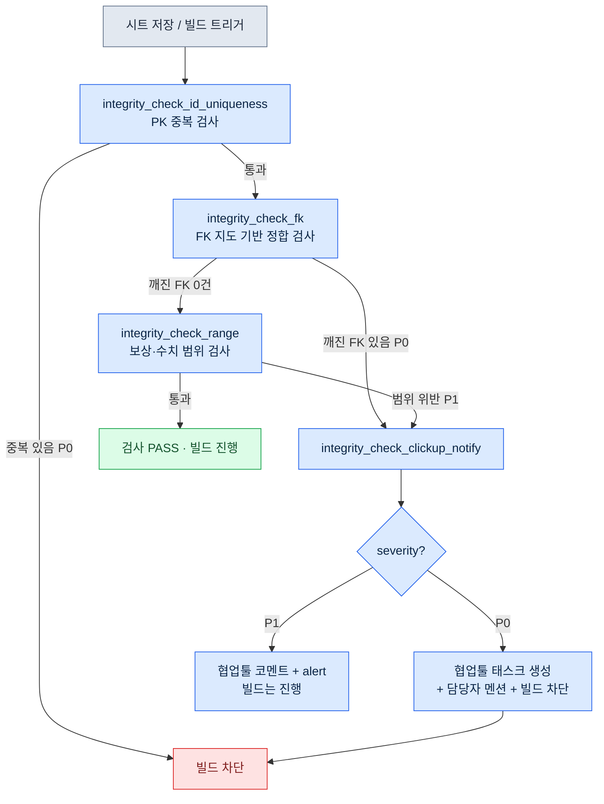

# 10.1 정합성 검증 atom — 30개 시트의 FK를 지키는 cascade

금요일 저녁 6시 40분. 다음 주 월요일 사내 빌드에 퀘스트 12종을 새로 넣기로 한 날이었다. 나는 `quest_table`에 새 행을 붙이고, 보상 시트에 대응 행을 채우고, 다이얼로그 시트에 NPC 대사를 연결했다. 세 시트, 약 50개 행. 눈으로 두 번 훑었고 문제없어 보였다.

월요일 아침 빌드가 깨졌다. 새 퀘스트 중 한 건이 참조하는 `reward_id`가 보상 시트에 없었다. 금요일 저녁에 보상 행 하나를 지웠다가 다시 추가하면서 id를 한 글자 잘못 친 것이다. `rwd_q318`을 `rwd_q381`로. 사람 눈으로는 절대 못 잡는 종류의 오타다. 두 시트는 다른 폴더에, 다른 사람이, 다른 시간에 건드린다. 행이 50개일 때는 눈으로 잡힌다. 30개가 넘는 시트가 서로를 외래키(FK)로 참조하기 시작하면, 사람의 눈은 더 이상 검사 도구가 아니다.

이 챕터는 그 오타를 빌드가 깨지기 전에 잡는 검사 atom 한 종류 — `integrity_check_fk` — 가 30개 넘는 시트의 FK 정합을 검사하고 깨졌을 때 협업툴(작업·일정을 관리하는 SaaS — 본 프로젝트는 ClickUp을 쓰고, JIRA·Redmine도 같은 자리다)로 담당자에게 통보하는 흐름을, 내가 실제로 굴린 한 세션을 따라가며 보여준다.

남이 만든 것에서 어긋난 한 줄을 찾아내는 일로 나는 이 업계에 처음 들어왔다. 싱글 플레이 게임의 QA·검수가 첫 일이었고, 그때는 손과 눈이 유일한 검사 도구였다. 20여 년이 지난 지금은 같은 일을 코드에게 넘긴다 — 사람의 눈이 검사 도구이기를 그만둔 자리에.

---

## 10.1.1 검사가 잡아야 하는 것 — FK 깨짐의 구조

먼저 무엇을 검사하는지 그림으로 본다. 게임 데이터 시트는 관계형 데이터베이스와 같다. 한 시트의 컬럼이 다른 시트의 기본키를 가리킨다. 이 화살표가 끊기면 런타임에 게임이 죽거나, 더 나쁘게는 조용히 빈 값을 띄운다.

<svg viewBox="0 0 640 260" xmlns="http://www.w3.org/2000/svg" font-family="sans-serif" font-size="13">
  <rect x="20" y="30" width="150" height="90" rx="6" fill="#eef4ff" stroke="#3b6fb6" stroke-width="1.5"/>
  <text x="95" y="50" text-anchor="middle" font-weight="bold">quest_table</text>
  <line x1="20" y1="60" x2="170" y2="60" stroke="#3b6fb6"/>
  <text x="32" y="78">quest_id (PK)</text>
  <text x="32" y="98" fill="#c0392b">reward_id (FK)</text>
  <text x="32" y="116" fill="#c0392b">npc_id (FK)</text>

  <rect x="250" y="20" width="150" height="60" rx="6" fill="#eafbe7" stroke="#3a9d3a" stroke-width="1.5"/>
  <text x="325" y="40" text-anchor="middle" font-weight="bold">reward_table</text>
  <line x1="250" y1="50" x2="400" y2="50" stroke="#3a9d3a"/>
  <text x="262" y="68">reward_id (PK)</text>

  <rect x="250" y="150" width="150" height="60" rx="6" fill="#eafbe7" stroke="#3a9d3a" stroke-width="1.5"/>
  <text x="325" y="170" text-anchor="middle" font-weight="bold">npc_table</text>
  <line x1="250" y1="180" x2="400" y2="180" stroke="#3a9d3a"/>
  <text x="262" y="198">npc_id (PK)</text>

  <line x1="170" y1="93" x2="250" y2="55" stroke="#3a9d3a" stroke-width="2" marker-end="url(#ok)"/>
  <line x1="170" y1="111" x2="250" y2="175" stroke="#c0392b" stroke-width="2" stroke-dasharray="6 4" marker-end="url(#bad)"/>
  <text x="430" y="120" fill="#c0392b" font-weight="bold">npc_id 'npc_307' →</text>
  <text x="430" y="140" fill="#c0392b">npc_table에 없음 (깨진 FK)</text>

  <defs>
    <marker id="ok" markerWidth="8" markerHeight="8" refX="6" refY="4" orient="auto"><path d="M0,0 L8,4 L0,8 Z" fill="#3a9d3a"/></marker>
    <marker id="bad" markerWidth="8" markerHeight="8" refX="6" refY="4" orient="auto"><path d="M0,0 L8,4 L0,8 Z" fill="#c0392b"/></marker>
  </defs>
</svg>

초록 실선은 살아 있는 참조다. `quest_table.reward_id`가 가리키는 값이 `reward_table.reward_id`에 실제로 존재한다. 빨간 점선은 죽은 참조다 — 어떤 퀘스트의 `npc_id`가 `npc_table`에 없는 id를 가리킨다. `integrity_check_fk`가 잡는 것이 이 빨간 점선이다.

프로젝트 A의 데이터 시트는 이런 참조가 한두 개가 아니다. 30개가 넘는 시트가 서로를 가리키고, FK 화살표를 다 그리면 한 페이지에 안 들어간다. 사람이 매번 손으로 따라가는 것은 불가능하다.

---

## 10.1.2 한 세션 — 깨진 FK를 검사가 잡는 전 과정

여기서부터는 내가 실제로 돌린 세션이다. 요약하지 않고, 프롬프트 전문과 날것 출력, 그리고 내가 거부하고 다시 요청한 부분까지 그대로 적는다.

### 1단계 — 시트를 읽어 FK 후보를 뽑게 한다

먼저 검사기에게 "어느 컬럼이 어느 시트를 가리키는가"라는 FK 지도부터 만들게 했다. 30개 시트의 FK를 사람이 일일이 등록하는 것은 비현실적이라, 명세서 시트의 컬럼 명명 규칙(`*_id`는 같은 이름의 시트를 가리킨다)으로 후보를 자동 추론하게 했다. 내가 입력한 프롬프트 전문은 다음과 같다.

> 첨부한 명세서 시트(`$스키마` 탭)를 읽고, 모든 데이터 시트에서 외래키(FK)로 보이는 컬럼을 추론해. 규칙: (1) 컬럼명이 `xxx_id` 형태이고 (2) `xxx_table` 또는 `xxx_list` 시트에 같은 이름의 PK(Primary Key, 기본 키) 컬럼이 존재하면 FK 후보로 본다. 추론 결과를 `{source_sheet, source_column, target_sheet, target_column, confidence}` 리스트로 JSON 출력. 규칙으로 단정 못 하는 건 confidence를 low로 표시하고 이유를 적어.

Claude의 날것 출력 일부(애매한 항목을 포함해 그대로 옮긴다):

```json
[
  {"source_sheet":"quest_table","source_column":"reward_id",
   "target_sheet":"reward_table","target_column":"reward_id","confidence":"high"},
  {"source_sheet":"quest_table","source_column":"npc_id",
   "target_sheet":"npc_table","target_column":"npc_id","confidence":"high"},
  {"source_sheet":"quest_table","source_column":"prev_quest_id",
   "target_sheet":"quest_table","target_column":"quest_id","confidence":"medium",
   "note":"이름이 quest_id가 아니라 prev_quest_id라 규칙에 안 걸림. 같은 시트 자기참조로 추정. 사람 확인 필요"},
  {"source_sheet":"reward_table","source_column":"item_id",
   "target_sheet":"item_table","target_column":"item_id","confidence":"high"},
  {"source_sheet":"dialogue_table","source_column":"speaker_id",
   "target_sheet":"npc_table","target_column":"npc_id","confidence":"low",
   "note":"speaker_id가 npc_id를 가리키는지 player를 가리키는지 불명. speaker가 'player'인 행도 있어 보임. 단정 불가"}
]
```

여기서 두 항목을 그냥 통과시키지 않았다. `prev_quest_id`(자기참조)는 검사 대상으로 채택하되 "빈 값(첫 퀘스트)은 위반이 아니다"라는 예외를 직접 달았다. `dialogue_table.speaker_id`는 거부했다 — `speaker`가 `'player'`인 행이 실제로 있어서, 이걸 FK로 검사하면 모든 플레이어 대사가 거짓 위반으로 잡힌다.

이 거부가 중요하다. 자동 추론한 FK 지도를 검수 없이 그대로 쓰면 첫 실행에서 거짓 위반 수백 건이 쏟아진다. 사람이 한 번 걸러야 검사가 신뢰를 얻는다.

### 2단계 — 검수한 FK 지도로 검사 atom을 정의한다

거른 FK 지도를 `integrity_check_fk` atom의 입력으로 고정했다. atom 양식은 다음과 같다. 이것은 프로젝트 A에서 실제로 쓰는 검사 atom 한 개의 전문이다.

```yaml
---
name: integrity_check_fk
description: 등록된 FK 지도에 따라 모든 source 컬럼 값이 target 시트의 PK에 존재함을 검증
type: integrity_check
category: data
priority: P0          # 깨진 FK는 빌드 차단
execution_time:
  - on_save           # 시트 저장 시 해당 시트만
  - on_build          # 빌드 시 전체 FK
  - nightly           # 매일 자정 전체 + 리포트
input:
  fk_map: fk_map.reviewed.json   # 1~2단계에서 사람이 검수한 지도
output_format: violation_list
on_violation:
  - notify: clickup           # 실패 시 ClickUp 통보
related_atoms:
  - integrity_check_clickup_notify
  - integrity_check_id_uniqueness
---
```

검사 로직 자체는 길지 않다. source 시트의 각 값이 target 시트의 PK 집합에 있는지 확인하는 집합 멤버십 검사다.

```python
def check_fk(fk_map, sheets):
    violations = []
    for fk in fk_map:
        pk_set = {r[fk["target_column"]] for r in sheets[fk["target_sheet"]]}
        for i, row in enumerate(sheets[fk["source_sheet"]]):
            val = row[fk["source_column"]]
            if val in ("", None):          # 빈 FK는 예외 (1단계에서 정한 규칙)
                continue
            if val not in pk_set:
                violations.append({
                    "fk": f'{fk["source_sheet"]}.{fk["source_column"]}',
                    "row": i + 2,          # 헤더 1줄 + 1-index
                    "value": val,
                    "target": fk["target_sheet"],
                    "severity": fk.get("severity", "P0"),
                })
    return violations
```

### 3단계 — 검사를 돌리고, 진짜 깨진 FK를 잡는다

검수한 지도로 30개 시트 전체에 검사를 돌렸다. 출력은 표준 `violation_list`다. 다음은 그날 실제로 나온 결과다(id·시트명은 익명화, 위반 건수와 구조는 실제).

```json
{
  "check": "integrity_check_fk",
  "executed_at": "2026-05-18 09:14:02",
  "input_files": 31,
  "violations": [
    {"fk": "quest_table.reward_id", "row": 318, "value": "rwd_q381",
     "target": "reward_table", "severity": "P0",
     "message": "reward_id 'rwd_q381'가 reward_table에 없음. 'rwd_q318'의 오타로 추정"},
    {"fk": "quest_table.prev_quest_id", "row": 502, "value": "q_0500",
     "target": "quest_table", "severity": "P0",
     "message": "prev_quest_id 'q_0500'가 quest_table에 없음. 'q_500' 표기 불일치(0 패딩) 추정"}
  ],
  "summary": {"fk_checked": 23, "rows_scanned": 4117, "violations": 2, "passed": 4115}
}
```

금요일 저녁의 그 오타(`rwd_q381`)가 첫 줄에 잡혔다. 두 번째는 내가 몰랐던 다른 문제였다. 어떤 퀘스트의 `prev_quest_id`가 `q_0500`인데, 실제 퀘스트 id는 `q_500`이었다. 0 패딩이 들어간 표기 불일치. 사람 눈에는 같아 보이지만 문자열로는 다른 값이고, 게임은 선행 퀘스트를 못 찾아 그 퀘스트를 잠금 상태로 둔다. 출시됐으면 플레이어 문의가 들어왔을 종류의 결함이다.

`message` 필드의 "오타로 추정", "0 패딩 추정"은 검사기가 단순 멤버십 실패를 넘어 가장 가까운 PK 값(편집 거리 기준)을 함께 제시하게 한 부분이다. 사람이 "이게 왜 깨졌나"를 추적하는 시간을 줄인다. 다만 이 추정은 어디까지나 힌트이고, 실제 수정 값은 사람이 정한다.

---

## 10.1.3 깨졌을 때 — 협업툴 통보까지의 cascade

여기까지가 검사 한 개의 동작이다. 하지만 검사가 위반을 잡았어도 아무도 안 보면 의미가 없다. 핵심은 위반이 곧장 담당자에게 닿는 흐름이다. 프로젝트 A에서 이 흐름은 `integrity_check_clickup_notify`라는 별도 atom이 담당한다(JIT 메타데이터상 임팩트 점수 294.93으로, 검증 atom 묶음에서 가장 높게 평가된 atom 중 하나다 — 정합성 실패를 사람에게 닿게 하는 것이 검사 자체만큼 중요하다는 뜻이다).

전체 cascade는 다음과 같다. 검사 atom들이 차례로 실행되고, 어느 단계에서 P0 위반이 나오면 통보 atom으로 흘러간다.



이 cascade에는 두 가지 설계 결정이 들어 있다.

첫째, **PK 중복 검사가 FK 검사보다 먼저다.** FK 검사는 target 시트의 PK가 유니크하다는 것을 전제로 한다. PK가 중복이면 "이 값이 PK 집합에 있는가"라는 질문 자체가 무의미해진다. 그래서 `integrity_check_fk`의 atom에 `related_atoms: integrity_check_id_uniqueness`를 명시하고, cascade에서 순서를 고정했다. 의존 검사가 실패하면 FK 검사는 건너뛴다 — 돌려봐야 거짓 결과만 나오기 때문이다.

둘째, **통보의 강도는 severity로 갈린다.** P0(깨진 FK)는 협업툴에 태스크를 만들고, FK 지도에 등록된 담당자(`reward_table`이면 보상 담당)를 멘션하고, 빌드를 막는다. P1(보상 수치가 권장 범위를 벗어남 — 틀렸다기보다 검토가 필요한 경우)은 코멘트와 alert만 남기고 빌드는 통과시킨다. 모든 위반을 빌드 차단으로 만들면, 사람들은 곧 빌드 차단을 무시하는 법을 배운다. 차단은 진짜 막아야 할 것에만 쓴다.

협업툴로 실제로 생성되는 태스크의 본문은 `violation_list`의 한 항목이 그대로 변환된 형태다.

```
[P0] integrity_check_fk 위반 — 빌드 차단됨
시트: quest_table  |  컬럼: reward_id  |  행: 318
값 'rwd_q381'가 reward_table에 없습니다.
가장 가까운 후보: 'rwd_q318' (편집거리 1)
담당: @보상_담당  |  검출: 2026-05-18 09:14  |  빌드: nightly-0042
```

검사 결과가 사람의 받은편지함에 닿기까지 손이 한 번도 안 들어간다. 검사 → 분류 → 태스크 생성 → 멘션이 한 파이프라인이다. 이게 가능한 이유는 `violation_list`가 표준 출력 양식이기 때문이다. 어떤 검사 atom이 잡았든 출력 구조가 같아서, 통보 atom 하나가 모든 검사의 결과를 받아 처리한다.

---

## 10.1.4 거짓 위반을 줄이는 운영 — 검수 증거를 남긴다

검사를 처음 켜면 거짓 위반이 반드시 나온다. 1단계의 `speaker_id`가 그 예다. 이걸 방치하면 사람들은 위반 리포트를 "어차피 대부분 거짓이니 안 봐도 된다"고 학습한다 — 검사기 신뢰가 무너지는 가장 흔한 경로다.

프로젝트 A에서는 `human_review_attestation_evidence_mandatory`라는 원칙으로 이를 막는다. 거짓 위반으로 판정해 예외 처리할 때, **누가·언제·왜 그렇게 판단했는지를 증거로 남겨야** 한다. FK 지도 파일(`fk_map.reviewed.json`)의 예외 항목마다 다음이 붙는다.

```json
{
  "source_sheet": "dialogue_table", "source_column": "speaker_id",
  "excluded": true,
  "review": {
    "by": "이민수", "at": "2026-05-18",
    "reason": "speaker_id는 npc_id 또는 'player' 리터럴을 가짐. FK 단일 검사 부적합.",
    "follow_up": "speaker_type 컬럼 추가 후 분기 검사로 재도입 검토"
  }
}
```

이 증거가 없으면, 한참 뒤 "이 컬럼은 왜 검사 안 하지?"라는 의문이 다시 떠올랐을 때 답할 근거가 없다. 그러면 다시 검사에 넣고, 다시 거짓 위반 수백 건을 본다. 검수 증거는 같은 논쟁을 반복하지 않게 한다.

---

## 따라하기 — FK 정합 검사를 처음 세우기

자기 데이터 시트에 FK 검사를 도입하려는 독자를 위한 최소 절차입니다.

**setup.** 데이터 시트 폴더와, 컬럼 명세(어느 컬럼이 PK이고 어느 게 FK인지)를 한곳에 모읍니다. 명세가 없으면 컬럼명 규칙(`*_id`)만으로도 시작할 수 있습니다.

**prompt.** 다음을 검사기에게 입력하세요.

> 이 데이터 시트들에서 FK 후보를 추론해라. `xxx_id` 컬럼이 `xxx_table`의 같은 이름 PK를 가리키면 FK로 본다. 결과를 `{source_sheet, source_column, target_sheet, target_column, confidence}` JSON으로 출력하고, 규칙으로 단정 못 하는 건 confidence를 low로 표시하고 이유를 적어라.

**verify.** 출력된 FK 지도를 **반드시 사람이 한 줄씩 검수하세요.** 자기참조(`prev_*`), 리터럴 혼재(`'player'` 같은), 다형 참조(상황에 따라 다른 시트를 가리키는 컬럼)는 자동 추론이 자주 틀립니다. 거른 지도로 검사를 돌리고, 첫 실행에서 나온 위반을 한 건씩 "진짜 깨짐 / 거짓 위반"으로 분류하세요. 거짓 위반은 예외 처리하되 이유를 파일에 남깁니다.

이 세 단계를 거치면, 금요일 저녁의 한 글자 오타가 월요일 빌드를 깨뜨리는 일은 사라집니다. 검사가 토요일 새벽 nightly에서 그 오타를 잡고, 월요일 출근 전에 협업툴 태스크 하나가 담당자를 기다립니다.

**1인 축소판.** 혼자 작업하고 협업툴이 없어도 이 검사는 의미가 있습니다. FK 지도를 손으로 10줄쯤 적고 위 파이썬 함수 하나만 돌려도 깨진 참조가 잡힙니다. 통보는 콘솔 출력이나 텍스트 파일로 충분합니다. 핵심은 통보 채널이 아니라, "사람 눈이 못 잡는 참조 오류를 기계가 잡아 사람에게 닿게 한다"는 흐름 자체입니다.

---

### 이 챕터의 핵심 메시지
- FK 정합은 시트가 30개를 넘으면 사람 눈으로 잡을 수 없고, 집합 멤버십 검사 하나가 그 일을 대신한다.
- 자동 추론한 FK 지도는 반드시 사람이 검수해야 하며, 거짓 위반을 거르고 그 이유를 증거로 남기는 일이 검사기 신뢰의 핵심이다.
- 검사의 가치는 위반을 잡는 데서 끝나지 않고, 협업툴 통보 cascade로 담당자에게 닿을 때 완성된다.

### 다음 챕터 미리보기
- 10.2 결정 정합성 3-layer 센서 — 데이터 무결성을 넘어, 결정과 결정·결정과 데이터·결정과 사용자 사이의 어긋남을 잡는 더 복잡한 검증으로 이어진다.
