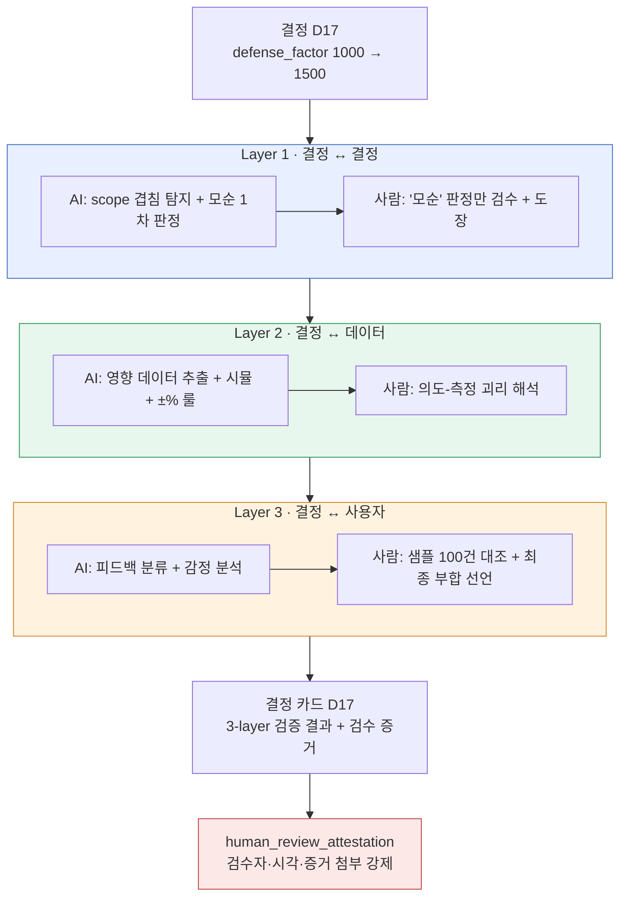

# 10.2 결정 검증 3-layer 센서 — 사람 검수 증거의 자리

밤 11시, nightly 잡이 협업툴에 카드를 하나 꽂았다. 제목은 `[integrity] D17 부합 측정 미수행 7일 경과`. 적용한 지 일주일 된 결정 하나가 "정말 의도대로 작동했는지" 아무도 확인하지 않은 채 빌드에 남아 있다는 알림이었다. 데이터는 멀쩡했다. 시트 형식도, FK도, enum도 통과했다. 그런데 결정은 검증되지 않았다.

이 간극이 이 챕터의 출발점이다. 데이터가 무결해도 결정은 틀릴 수 있고, 그 틀림을 잡는 자리는 데이터 검사와 다른 곳에 있다. 그 자리를 세 개 층으로 나누고, 각 층에서 AI가 어디까지 보조하고 사람이 어디서 도장을 찍는지를 명시하는 것 — 그게 결정 검증 3-layer 센서다.

---

## 10.2.1 데이터가 통과해도 결정은 틀린다

`check` cascade는 네 종류 검사를 한 번에 돌린다 — doc-audit(문서 일관성), data-qa(데이터 품질), integrity(무결성), link(상호참조 끊김). 이 넷이 통과하면 "데이터는 멀쩡하다"는 뜻이다. 하지만 멀쩡한 데이터 위에 틀린 결정이 얹힐 수 있다.

보상 시트가 형식상 완벽해도 그 수치가 인플레이션을 유발하면, FK가 유니크해도 두 퀘스트가 같은 시각 같은 NPC를 점유하면, voice가 일관돼도 두 캐릭터의 관계 설정이 모순되면 — 데이터 검사는 전부 통과하고 결정은 전부 틀린다. 데이터 검사는 "칸이 채워졌는가"를 보고, 결정 검사는 "그 값이 다른 결정·다른 데이터·실제 사용자와 맞는가"를 본다. 회계로 치면 앞은 전표 양식 점검이고 뒤는 재무제표 정합성 감사다.

그래서 결정 검증은 데이터 검증과 **분리된 센서**를 둔다. 한 검사에 묶으면 "통과/실패" 한 줄로 뭉개져서, 실패했을 때 데이터 문제인지 결정 문제인지 해석이 모호해진다. 분리하면 책임이 명확해진다.

---

## 10.2.2 세 층, 세 시점, 세 종류의 검수자

3-layer 센서의 핵심은 검증 **차원**을 세 개로 쪼갠 점이다. 각 층은 보는 대상도, 작동 시점도, AI와 사람의 역할 분담도 다르다.



세 층 모두 마지막 도장은 사람이 찍는다 — 그 도장이 곧 `human_review_attestation_evidence_mandatory` atom이 강제하는 증거다. 각 층이 무엇을 보고 누가 어디서 도장을 찍는지는 아래에서 차례로 본다.

---

## 10.2.3 Layer 1 — AI가 추리고, 사람이 '모순'만 검수한다

새 결정이 기존 결정과 부딪치는지 검사하는 층이다. 결정 쌍은 결정 수의 제곱으로 늘어나서, 200개 결정이면 약 2만 쌍이다. 사람이 손으로 다 볼 수 없다. 그래서 AI가 1차 필터를 돌린다.

```python
# decision_conflict_check.py — Layer 1 센서
def check_new_decision(new_decision, existing_decisions):
    conflicts = []
    for existing in existing_decisions:
        if has_overlap(new_decision.scope, existing.scope):   # 기계적 1차: scope 교집합
            verdict = llm_judge(new_decision, existing)        # AI 2차: 모순/보완/무관
            if verdict.label == "모순":
                conflicts.append({
                    "with": existing.id,
                    "label": verdict.label,
                    "reason": verdict.reason,
                    "needs_human_review": True,                # 사람 검수 플래그
                })
    return conflicts
```

`has_overlap`은 기계적 1차 필터다. scope는 atom 영역(`combat`·`narrative`·`economy` 등)이라 교집합 계산이 정확하다. 겹치지 않는 쌍은 즉시 버린다. 2만 쌍이 보통 수십 쌍으로 줄어든다. 그 수십 쌍만 AI가 본다.

### 완결 워크드 트랜스크립트 — Layer 1 모순 판정

여기서 실제로 무엇이 오가는지를 끝까지 보여준다. 요약하지 않고, 애매한 출력도 그대로 둔다.

**① 사람이 보낸 프롬프트 (전문)**

```
다음 두 결정이 모순되는지 판단하세요.

[결정 A] (2026-03-XX) 전투 글로벌 쿨다운 0.5초로 전 스킬 통일
[결정 B] (2026-04-XX) 회복 계열 스킬은 글로벌 쿨다운 적용 제외

판정 형식 (이 형식만, 다른 말 금지):
- label: 모순 | 보완 | 무관
- reason: 한 줄
- confidence: 0.0~1.0

추측하지 마세요. 근거가 약하면 confidence를 낮추세요.
```

**② Claude 날것 출력 (가공 없음)**

```
- label: 보완
- reason: 결정 B는 결정 A가 정한 0.5초 통일 규칙에 회복 계열이라는 명시적 예외를 추가하는 구조라, 규칙을 뒤집지 않고 좁힌다.
- confidence: 0.74
```

**③ 사람의 검증 / 거부**

판정은 "보완", confidence 0.74다. 룰상 '보완·무관'은 자동 통과지만 confidence 0.8 미만이면 사람이 한 줄이라도 확인하게 돼 있다. 검수자 팀원 A가 결정 B 원문을 다시 읽고 한 가지를 발견했다 — 결정 B에는 "단, 회복 스킬도 자체 쿨다운 1.2초를 가진다"는 단서가 붙어 있었다. AI는 요약된 한 줄만 받아 이 단서를 입력으로 받지 못했다. 팀원 A는 AI 판정을 **수용하되 보강** 처리하고, "AI가 본 입력이 불완전했다"를 기록으로 남겼다.

**④ 재요청 (입력 보강 후)**

```
[추가 단서] 결정 B에는 "회복 스킬은 글로벌 쿨다운은 면제하되 자체 쿨다운 1.2초를
가진다"는 조건이 붙어 있습니다. 이 단서를 포함해 다시 판정하세요.
```

```
- label: 보완
- reason: 자체 쿨다운 1.2초가 글로벌 0.5초보다 길어, 회복 스킬은 면제에도 불구하고
  오히려 더 긴 간격을 가진다. A의 의도(난사 방지)와 충돌하지 않으므로 보완이 강화됨.
- confidence: 0.91
```

판정은 그대로 "보완"이지만 근거가 단단해졌고 confidence가 0.74→0.91로 올랐다. 팀원 A가 여기서 도장을 찍었다. 핵심은 결과가 아니라 **과정의 기록**이다 — AI 1차 판정, 사람이 발견한 입력 누락, 보강 재요청, 최종 검수. 이 네 단계가 그대로 결정 카드의 Layer 1 증거란에 입력된다.

이 트랜스크립트의 원칙은 하나다. **AI의 '보완·무관' 판정도 무조건 통과시키지 않는다.** AI가 틀린 게 아니라 AI가 받은 정보가 불완전했고, 그걸 발견하는 건 결정 원문을 아는 사람이다.

검사 시점은 세 군데다. 신규 결정 추가 시 즉시 + alert, pending atom 승격 시 검사 후 승격, nightly에 전체 쌍 재검사.

---

## 10.2.4 Layer 2 — AI가 거의 다 하고, 사람은 괴리를 해석한다

결정이 데이터에 어떻게 반영됐고 의도와 부합하는지 측정하는 층이다. 가장 자동화하기 쉽고 가장 정확하다. 시뮬레이터와 데이터 시트가 이미 있으면 검증 룰만 얹으면 된다.

결정 `D17`(defense_factor 1000→1500)을 예로 들면, 센서가 자동으로 `CombatBalance` 시트와 자동 시뮬 결과와 영향받은 캐릭터 데이터를 끌어와, 의도(탱커 생존 +49%)와 측정(시뮬 +52%)을 비교한다. 부합 판정 룰은 정량적이다.

| 의도 대비 측정 차이 | 처리 | 누가 |
|---|---|---|
| ±10% 이내 | 부합 (자동 통과) | AI |
| ±10~25% | alert · 재검토 | 사람이 해석 |
| ±25% 초과 | 위반 · 결정 재검토 의무 | 사람이 결정 |

여기서 사람의 역할은 "AI가 부합이라고 했으니 통과"가 아니다. **alert 구간과 위반 구간을 해석하는 것**이 사람의 일이다. D17 시뮬은 +52%로 ±10% 안에 들어 자동 부합이었지만, 같은 시뮬이 부수 효과를 하나 뱉었다 — 하이브리드 캐릭터 `K_021`이 의도 밖으로 +28% 강해졌다. D17의 직접 의도가 아니라서 부합 룰에 안 걸린다. 룰은 통과인데 사람 눈엔 사고인 이 구간을 잡는 게 Layer 2에서 사람이 존재하는 이유다.

이 층의 자동화율이 약 95%로 가장 높다. 그래도 5%가 남는 건 바로 이 해석 때문이다. 숫자가 룰을 통과하는 것과 그 숫자가 게임에 옳은 것은 다른 질문이다.

---

## 10.2.5 Layer 3 — AI가 분류하고, 사람이 최종 부합을 선언한다

세 층 중 가장 어렵다. 결정이 실제 사용자에게 의도대로 작용했는지를 본다. 빌드 출시 1~2주 후의 실측 지표(탱커 평균 생존 시간, 탱커 포함 5:5 PvP 승률)와 자연어 피드백(포럼·SNS)을 입력으로 받는다.

자연어 피드백이 검증의 입력이 된다는 게 이 층의 특징이다. 포럼 약 200건, SNS 약 1,500건을 AI가 카테고리로 분류하고 감정을 매긴다.

```
[AI 피드백 분류 — 탱커 관련 1주 수집]
   긍정 62%   부정 23% ("탱커 너무 강해짐"이 다수)   무관 15%
```

여기서 멈추면 함정이다. AI 감정 분류는 한국어·영어가 섞이면 정확도가 떨어진다("탱커 강해졌다 ㅋㅋ"가 긍정인지 비꼼인지 판정이 흔들린다). 그래서 운영 규칙으로 **분기마다 사람이 샘플 100건을 직접 분류해 AI 결과와 대조한다.** 대조에서 오차가 임계 이상이면 그 분기 분류는 신뢰하지 않고 사람이 전수 재분류한다.

최종 부합 선언은 사람이 한다. D17의 경우 실측 +44%(시뮬 예측 +52%, 오차 8% — 정상 범위), 피드백 긍정 우세였다. AI는 "긍정 우세 + 의도 범위 내"라는 입력을 정리해 올렸고, **부합이라고 도장을 찍은 건 사람**이다. 자동화율 약 70%, 사람 30%. 이 층만큼은 완전 자동이 원천적으로 불가능하다. 사용자의 의미를 기계가 끝까지 판정할 수 없기 때문이다.

---

## 10.2.6 사람 검수 증거는 선택이 아니라 강제다

세 층의 마지막 도장이 사람이라면, 그 도장이 **실제로 찍혔다는 증거**가 없으면 시스템 전체가 무너진다. 검수했다고 말만 하고 안 한 경우를 어떻게 막는가. 프로젝트 A에서는 atom `human_review_attestation_evidence_mandatory`가 이걸 강제한다.

이 atom의 규칙은 단순하고 타협이 없다. **결정 카드의 어떤 층이든 'AI 판정 → 사람 검수'가 일어났다면, 검수자 식별·검수 시각·검수 증거(보강 메모, 거부 사유, 샘플 대조 결과 중 최소 하나)가 카드에 첨부돼야 한다. 증거가 비면 그 카드는 "검증 완료"로 승격되지 못한다.**

증거가 비면 `integrity_check_clickup_notify` atom이 작동한다. 정합성 실패 — 여기서는 "검수 도장은 있는데 증거가 없음" — 을 감지하면 협업툴에 카드를 즉시 만든다. 이 챕터 첫 장면의 밤 11시 카드가 바로 이 메커니즘이다.

이 두 atom이 짝을 이뤄 "검증의 검증"을 만든다. 3-layer 센서가 결정을 검증하고, attestation atom이 그 검증을 사람이 실제로 했는지 검증하고, notify atom이 증거 누락을 잡아 통보한다. AI 보조는 광범위해도, **책임의 마지막 한 칸은 증거를 남긴 사람의 이름**으로 채워진다.

---

## 10.2.7 결정 카드 — 검증과 증거가 한 장에 모이는 곳

세 층의 결과와 검수 증거가 모이는 단위가 결정 카드다. 카드 한 장이 결정 하나의 완결 단위이고, 분기 회고의 입력으로 흘러간다. 아래는 D17 카드의 구조다.

<svg viewBox="0 0 720 430" xmlns="http://www.w3.org/2000/svg" font-family="sans-serif" font-size="13">
  <rect x="10" y="10" width="700" height="410" rx="10" fill="#fafbfc" stroke="#888"/>
  <text x="30" y="40" font-size="16" font-weight="bold">결정 카드 D17</text>
  <text x="30" y="62" fill="#555">변경: defense_factor 1000 → 1500   ·   적용 2026-03-XX</text>
  <line x1="30" y1="74" x2="690" y2="74" stroke="#ccc"/>

  <rect x="30" y="86" width="660" height="86" rx="6" fill="#e8f0ff" stroke="#4a72c0"/>
  <text x="42" y="106" font-weight="bold" fill="#2a4a90">Layer 1 · 결정 정합</text>
  <text x="42" y="126">✓ 모순 결정 없음   ·   7개 인접 결정과 보완 관계</text>
  <text x="42" y="146" fill="#b03a3a">증거: 팀원 A, 2026-03-XX 14:20, 입력 누락 보강 메모 1건</text>
  <text x="42" y="164" fill="#777" font-size="11">AI 1차 판정 → 사람 검수 (confidence 0.74 → 보강 후 0.91)</text>

  <rect x="30" y="180" width="660" height="78" rx="6" fill="#e8f7ed" stroke="#3a9a5a"/>
  <text x="42" y="200" font-weight="bold" fill="#1f6a3a">Layer 2 · 데이터 부합</text>
  <text x="42" y="220">✓ 시뮬 +52% vs 의도 +49% (부합, ±10% 내)</text>
  <text x="42" y="240" fill="#c07a1a">⚠ K_021 하이브리드 의도 밖 +28% — 사람 해석: 후속 결정 필요</text>

  <rect x="30" y="266" width="660" height="78" rx="6" fill="#fff3e0" stroke="#d08a2a"/>
  <text x="42" y="286" font-weight="bold" fill="#9a5a10">Layer 3 · 사용자 부합</text>
  <text x="42" y="306">✓ 실측 +44% vs 시뮬 +52% (오차 8%, 정상)   ·   피드백 긍정 우세</text>
  <text x="42" y="326" fill="#b03a3a">증거: 분기 샘플 100건 사람 대조 완료, AI 분류 일치율 88%</text>

  <rect x="30" y="352" width="660" height="52" rx="6" fill="#fde8e8" stroke="#c04a4a"/>
  <text x="42" y="374" font-weight="bold" fill="#a02020">전체: ✓ 부합 (K_021 부작용 후속 결정 협업툴 등록)</text>
  <text x="42" y="394" fill="#777" font-size="11">attestation 검증: 3개 층 모두 검수 증거 첨부 확인 → 카드 승격 허용</text>
</svg>

빨간 줄이 핵심이다. 각 층의 "증거:" 행이 비면 attestation atom이 카드 승격을 막고 notify atom이 협업툴에 알린다. 6개월 뒤 누군가 "왜 defense_factor를 1500으로 했지"라고 물으면, 이 카드 한 장이 의도·측정·실측·검수자까지 다 답한다. 결정 카드는 18부의 의사결정 추적 atom과 같은 메타데이터 흐름 위에서 작동한다.

---

## 10.2.8 자동화율과 도입 순서

세 층은 자동화 정도가 다르다(각각 약 80%·95%·70%, 앞 절들에서 본 대로). 셋 다 부분 자동이고 마지막 도장은 셋 다 사람이지만, 사람 작업량은 전체적으로 80% 이상 줄어든다.

도입은 Layer 2부터다. 시뮬과 데이터 시트가 이미 있으면 검증 룰만 추가하면 돼서 1~2개월이면 효과가 난다. 그다음 Layer 1(인프라는 적은데 효과가 큼, 추가 1개월), 마지막에 Layer 3(인프라가 가장 크고 효과도 큼, 추가 2~3개월). Layer 3을 처음부터 붙이려다 좌초하는 게 흔한 실패다.

> **수치 표기에 관하여**: 위 자동화율과 아래 효과 비율은 저자 프로젝트의 운영 관찰에 기반한 **저자 추정(미검증)**이다. 정밀 측정값이 아니라 방향과 대략적 비율로 읽어야 한다. 부합 룰의 ±10%/±25% 임계는 실제 운영 룰이고, atom 이름(`integrity_check_clickup_notify`, `human_review_attestation_evidence_mandatory`)은 실재 atom이다.

도입 전후의 변화는 방향으로 정리하면 이렇다. 분기당 결정 모순 사고는 여러 건에서 거의 0건으로, 결정 후 1주 부합 측정 수행률은 일부에서 대부분으로, 사고 발생 전 부작용 발견율은 절반 미만에서 대부분으로 올라갔다. 가장 의미 있는 변화는 추적성이다 — 한참 지난 뒤 결정의 배경을 되짚을 수 있는 비율이 소수에서 거의 전부로 바뀌었다. 결정 카드가 게임의 결정 역사를 보존하기 때문이다.

---

## 10.2.9 흔한 실패

| 패턴 | 처방 |
|---|---|
| Layer 1만 운영 (모순 검사만) | Layer 2·3 추가로 차원을 채운다 |
| Layer 3을 처음부터 도입 | Layer 2부터, 인프라 작은 순서로 |
| AI의 '보완·무관' 판정 무비판 수용 | confidence 임계 + 사람 샘플 검수 |
| 검수 도장만 찍고 증거 미첨부 | attestation atom이 승격 차단 |
| 증거 누락 알림 무시 | notify atom의 협업툴 카드를 미완료로 취급 |
| 사용자 피드백 AI 분류 맹신 | 분기 샘플 100건 사람 대조 |

---

### 이 챕터의 핵심 메시지

- 데이터 무결과 결정 정합은 다른 센서다. 한 검사로 묶으면 실패 해석이 모호해진다.
- 세 층 모두 AI가 보조하되 마지막 도장은 사람이 찍는다. 차원만 다를 뿐 원칙은 같다.
- 검수 증거가 비면 카드는 승격되지 못한다. attestation atom이 검증의 검증을 한다.

---

### 따라 하기 — 1인 축소판

**setup.** 결정 로그를 한 파일에 모으세요(결정 id·scope·의도·적용일). scope는 `combat`·`narrative`·`economy`처럼 enum으로 고정합니다. 시뮬이 없으면 Layer 2는 "관련 데이터 시트 수동 비교"로 시작해도 됩니다.

**prompt.** 새 결정이 생길 때마다 기존 결정과 한 쌍씩 AI에 물으세요. 형식을 고정하세요.
```
다음 두 결정이 모순되는지 판단하세요.
[결정 A] ...
[결정 B] ...
형식만 출력: label(모순|보완|무관) / reason 한 줄 / confidence 0.0~1.0
추측 금지. 근거 약하면 confidence 낮춤.
```

**verify.** '모순' 판정과 confidence 0.8 미만 판정은 사람이 결정 원문을 다시 읽고 확인하세요. 확인했으면 결정 카드에 **검수자 이름·시각·메모(보강/거부/대조 중 하나)**를 반드시 남깁니다. 증거란이 비면 그 카드는 "검증 완료"로 올리지 마세요 — 이 한 줄이 attestation atom의 1인 버전입니다. 1인 운영이라도 6개월 뒤의 나를 위해 증거는 남깁니다.
