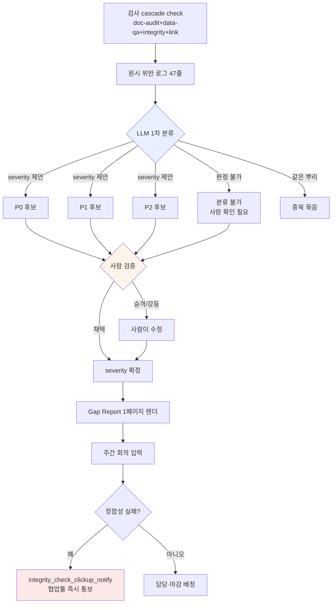

# 10.3 알파 Gap Report — 갭을 자연어로 분류하고 사람이 우선순위를 매기다

월요일 아침 9시 12분. 알파 빌드가 막 올라간 주의 첫 검사 cascade가 끝났다. `check`가 네 종(doc-audit·data-qa·integrity·link, 10.2)을 한 번에 돌리고 멈췄을 때 콘솔에 찍힌 숫자는 이랬다. **위반 후보 47건.** 그중 P0가 몇 건이고, 무엇부터 봐야 하고, 누가 손대야 하는지는 그 47줄 어디에도 적혀 있지 않았다.

검사기는 "틀렸다"는 사실만 안다. "이게 출시를 막느냐, 다음 주에 봐도 되느냐"는 판단하지 못한다. 알파 막바지의 진짜 병목은 검사기가 부족해서가 아니라, 검사기가 토해낸 47줄을 사람이 분류하다가 오전이 다 가버리는 데 있었다. 이 장은 그 47줄을 LLM이 자연어로 분류하고, 사람이 그 분류를 받아 우선순위를 매기는 한 번의 워크드 사이클을 통째로 옮긴다.

---

## 10.3.1 검사 결과는 결정이 아니다

10.1에서 검증 atom 30여 종을 만들었고, 10.2에서 결정을 3-layer 센서로 거르는 구조를 세웠다. 두 장이 만들어 낸 것은 **로그**다. 로그는 결정이 아니다. 로그와 결정 사이에는 사람이 손으로 메우던 간극이 있다.

<svg viewBox="0 0 720 230" xmlns="http://www.w3.org/2000/svg" font-family="sans-serif">
  <rect x="20" y="40" width="150" height="60" rx="6" fill="#e8f0fe" stroke="#46a" stroke-width="1.5"/>
  <text x="95" y="65" text-anchor="middle" font-size="13" font-weight="bold">검사 cascade</text>
  <text x="95" y="84" text-anchor="middle" font-size="11" fill="#555">자동 · 47줄 로그</text>

  <rect x="285" y="40" width="150" height="60" rx="6" fill="#fef3e8" stroke="#d80" stroke-width="1.5"/>
  <text x="360" y="60" text-anchor="middle" font-size="13" font-weight="bold">간극</text>
  <text x="360" y="78" text-anchor="middle" font-size="11" fill="#a00">사람이 손으로</text>
  <text x="360" y="93" text-anchor="middle" font-size="11" fill="#a00">분류·우선순위</text>

  <rect x="550" y="40" width="150" height="60" rx="6" fill="#e8fce8" stroke="#4a6" stroke-width="1.5"/>
  <text x="625" y="65" text-anchor="middle" font-size="13" font-weight="bold">주간 결정</text>
  <text x="625" y="84" text-anchor="middle" font-size="11" fill="#555">담당·마감·게이트</text>

  <line x1="170" y1="70" x2="283" y2="70" stroke="#888" stroke-width="2" marker-end="url(#ar)"/>
  <line x1="435" y1="70" x2="548" y2="70" stroke="#888" stroke-width="2" marker-end="url(#ar)"/>

  <text x="360" y="150" text-anchor="middle" font-size="12" fill="#a00" font-weight="bold">← 이 간극에서 오전이 사라진다</text>
  <text x="360" y="180" text-anchor="middle" font-size="12" fill="#2a6">Gap Report = LLM이 분류, 사람이 우선순위</text>

  <defs>
    <marker id="ar" markerWidth="8" markerHeight="8" refX="6" refY="3" orient="auto">
      <path d="M0,0 L6,3 L0,6 Z" fill="#888"/>
    </marker>
  </defs>
</svg>

알파 막바지에 이 간극이 비싼 이유는 단순하다. 검사기는 한 시간에 수십 번 돌지만, 사람이 47줄을 읽고 "q_142는 막다른 길이니 출시 차단, voice_lint 412는 작가 판정 대기"라고 분류하는 작업은 매번 새로 해야 한다. 그 분류 노동을 자연어 모델에 넘기는 것이 Gap Report의 출발점이다.

---

## 10.3.2 워크드 트랜스크립트 — 47줄을 LLM에게 넘기다

아래는 그 월요일 아침, 검사 cascade의 원시 로그를 Claude에게 그대로 붙여 넣고 분류를 요청한 실제 세션이다. 요약하지 않고 옮긴다. 모델이 잘못 짚은 곳과 사람이 거부한 곳까지 그대로 둔다. 이게 이 장의 척추다.

### ① 프롬프트 (전문)

````text
아래는 알파 빌드 주간 검사 cascade(doc-audit/data-qa/integrity/link)가 합쳐서 토한 위반 후보야. 주간 회의에서 쓰게 분류해줘.
각 항목을 P0(출시 차단)/P1(검토)/P2(관찰)로 분류하고 근거 한 줄씩 — 추측이면 "추정"이라고 적어. severity는 네가 단정하지 말고 '제안'만 해, 확정은 내가 한다.
같은 뿌리에서 나온 건 묶어주고, 담당 분야(레벨/내러티브/밸런스/UI/데이터)도 추천해줘. 판정 못 하는 건 솔직히 "분류 불가, 사람 확인 필요"로 빼줘.

[원시 로그]
INTEGRITY  q_142    quest_graph: node 'end_021' has no outgoing edge (dead-end), zone=dungeon_021
INTEGRITY  q_158    quest_graph: reward node references item_id 'it_9920' not in item table
DATA-QA    reward_curve  dungeon_017 reward_exp delta +35.2% vs sibling median (threshold 25%)
DATA-QA    reward_curve  dungeon_017 reward_gold delta +31.0% vs sibling median
DOC-AUDIT  voice_lint    dialogue_id_412 contains banned term (refgame slang leak)
DOC-AUDIT  voice_lint    dialogue_id_511 tone drift: formality score 0.31 (npc 'elder' expects >0.7)
DOC-AUDIT  voice_lint    dialogue_id_512 tone drift: formality score 0.29
DOC-AUDIT  voice_lint    dialogue_id_513 tone drift: formality score 0.33
DATA-QA    loc_overflow  ui_btn_enhance EN string 24 chars > slot 18 (overflow 6)
DATA-QA    loc_overflow  ui_btn_enhance TH string overflow 11
LINK       doc_link      gdd_dungeon_021.md -> [reward_table] target moved (404)
INTEGRITY  k_skill       skill 'k_017_charge' cooldown 0.0 (suspicious, min expected 0.5)
... (총 47줄, 이하 동형 패턴 — 생략 없이 첨부됨)
````

### ② Claude 날것 출력 (요약·정리 안 함)

````text
원시 로그를 분류했습니다. severity는 제 "제안"이며 최종 확정은 사람이 해야 합니다.

## P0 후보 (출시 차단 가능 — 사람 확정 필요)

1. [q_142] quest_graph dead-end (dungeon_021)
   근거: 출구 엣지가 없는 종료 노드 → 플레이어가 퀘스트 진행 중 갇힘.
   막다른 길은 진행 불가이므로 P0 후보. (확정 근거 명확)
   담당 추천: 레벨/내러티브

2. [q_158] reward node가 존재하지 않는 item_id 'it_9920' 참조
   근거: 보상 지급 시 NULL 참조 → 크래시 또는 보상 미지급 가능.
   P0 후보. 단, item_id가 아직 미입력 상태(작업 중)일 수도 있어
   "데이터 미완성"인지 "오타"인지는 사람 확인 필요.
   담당 추천: 데이터

3. [voice_lint dialogue_id_412] 금기 어휘(refgame 용어 유출)
   근거: 타 게임 고유 용어가 대사에 남아 있으면 법적·브랜드 리스크.
   P0 후보. (금기 어휘는 보통 무조건 차단)
   담당 추천: 내러티브

## P1 후보 (검토 후 결정)

4. [reward_curve dungeon_017] exp +35.2% / gold +31.0% (둘 다 형제 중앙값 초과)
   ※ 두 줄을 1건으로 묶음 — 같은 던전의 보상 곡선 이상.
   근거: 임계치(25%) 초과지만 "의도된 고난도 던전 보너스"일 수 있음.
   밸런스 의도인지 실수인지는 데이터만으로 판정 불가 → P1.
   담당 추천: 밸런스

5. [voice_lint 511·512·513] tone drift 3건 (formality 0.29~0.33, elder NPC가 >0.7 기대)
   ※ 3줄을 1건으로 묶음 — 같은 NPC 'elder'의 연속 대사 톤 이탈.
   근거: 같은 NPC가 연속으로 반말체로 빠진 패턴 → 한 작가의
   한 세션 작업물일 가능성. 개별이 아니라 묶어서 검토 권장.
   추정: 의도된 캐릭터 변화(분노 장면 등)일 수도 있어 작가 판정 대기. P1.
   담당 추천: 내러티브

6. [loc_overflow ui_btn_enhance] EN 6자 / TH 11자 초과
   ※ 2줄 1건. 같은 버튼의 다국어 오버플로.
   근거: 잘림은 UX 손상이나 크래시는 아님. 슬롯 확장 or 단축 번역 필요. P1.
   담당 추천: UI

## P2 후보 (관찰)

7. [doc_link gdd_dungeon_021.md -> reward_table 404]
   근거: 문서 내부 링크 깨짐. 게임 빌드에는 영향 없음, 문서 정합성 문제. P2.
   담당 추천: 데이터(문서 소유자)

## 분류 불가 — 사람 확인 필요

8. [k_017_charge cooldown 0.0]
   근거: 쿨다운 0.0이 "의도된 패시브성 스킬"인지 "입력 누락"인지
   스킬 설계 의도를 모르면 판정 불가. integrity 검사기는 0.5 미만을
   의심했지만, 저는 이 스킬의 설계 의도를 모릅니다.
   → 밸런스 담당이 직접 확인해야 합니다.

(나머지 39줄도 위 7개 패턴 중 하나로 분류 — 본 답변에서는 대표만 전개)
````

### ③ 사람의 검증과 거부 (옮긴 그대로)

여기서부터가 핵심이다. LLM의 분류를 그대로 채택하지 않았다. 저자가 회의 전에 직접 검토하며 빨간 펜을 댄 부분이다.

- **2번 q_158을 P0 후보 → P0 확정으로 올렸다.** 모델은 "데이터 미완성일 수도"라며 망설였지만, 확인해 보니 `it_9920`은 두 주 전 삭제된 아이템이었다. 미완성이 아니라 끊긴 참조. 출시 차단 확정.
- **3번 voice_lint 412는 P0에서 P1로 내렸다.** 모델은 "금기 어휘는 무조건 차단"이라고 단정했지만, 해당 대사는 NPC가 의도적으로 옛 표현을 인용하는 장면이었다. 금기 단어 사전에 예외 케이스를 추가하는 것으로 처리. **모델이 맥락을 모른 채 규칙만 적용한 전형적 실수.**
- **5번 tone drift 묶음은 받아들였다.** "같은 작가의 한 세션 작업물"이라는 묶음 가설이 정확했다. 작가 한 명에게 3건을 한 번에 넘기는 게 맞았다.
- **8번 cooldown 0.0은 모델의 "분류 불가" 판단을 그대로 인정했다.** 모델이 모르는 걸 안다고 우기지 않은 점은 좋았다. 밸런스 담당에게 핑.

모델이 7개 묶음으로 압축한 것 자체는 컸다. 47줄을 사람이 처음부터 분류했으면 오전이 갔다. 하지만 **P0 후보 3건 중 1건(412)을 사람이 강등했고, P1 후보 1건(158)을 사람이 승격했다.** 분류의 60%는 맞았고, 비싼 30%는 사람이 고쳤다. 이 비율이 정확히 "LLM은 가공, 결정은 사람"의 경계선이다.

### ④ 재요청 — 사람이 고친 결과를 다시 모델에게

````text
좋아. 네 분류에서 두 개를 내가 바꿨어.
- q_158: P0 확정 (it_9920은 삭제된 아이템, 끊긴 참조)
- voice_lint_412: P1로 강등 (의도된 옛 표현 인용, 금기 사전 예외 추가)
이 둘 반영해서 주간 회의용 1페이지 Gap Report 마크다운으로 렌더해줘. 요약→P0→P1→P2→추세 순서로.
추세 숫자는 내가 줄게 — 지난주 P0 5건, P1 22건, 거짓양성 12%.
````

모델은 이 입력을 받아 아래 §보고서 양식의 1페이지를 그대로 출력했다. 사람이 고친 두 줄이 정확히 반영됐고, 추세 숫자는 사람이 준 값을 그대로 썼다(지어내지 않았다). 이 왕복이 Gap Report 한 장이 만들어지는 전부다.

---

## 10.3.3 Gap 분류 흐름 — 자동과 사람의 경계

위 트랜스크립트를 흐름으로 추리면 이렇게 된다. 굵은 분기점이 전부 사람에게 있다는 점이 핵심이다.



LLM이 만지는 박스는 파란색 하나뿐이다. 주황색(사람 검증)에서 모든 severity가 확정되고, 빨간색에서 정합성 실패가 협업툴로 즉시 튄다. 검사·판정·확정은 전부 사람과 atom의 몫이고, 모델은 첫 분류 한 번만 맡는다.

---

## 10.3.4 정합성이 깨지면 회의를 기다리지 않는다

분류 흐름의 끝에 `integrity_check_clickup_notify` atom(10.1)이 붙어 있다. 이 atom은 보고서를 만드는 단계와 별개로, **정합성 검사가 실패하는 순간 회의를 기다리지 않고 협업툴에 카드를 던진다.** Gap Report가 주간 리듬이라면, 이 atom은 그 리듬을 깨고 들어오는 인터럽트다.

q_158(삭제된 아이템 참조)처럼 빌드 자체를 깨뜨릴 수 있는 위반은 월요일 회의까지 기다릴 수 없다. cascade가 그걸 잡는 순간 협업툴에 "P0 의심: q_158 끊긴 참조"가 자동 생성되고 데이터 담당에게 할당된다. Gap Report는 그 인터럽트들을 한 주 단위로 다시 모아 추세로 보여주는 뒤판이다. 두 층이 같이 돌아가야 "급한 건 즉시, 전체 그림은 주간"이라는 두 박자가 맞는다.

---

## 10.3.5 사람 검수의 증거를 남긴다

LLM 분류를 사람이 검증했다는 사실은 **말로 남으면 증발한다.** 그래서 검수 단계에는 `human_review_attestation_evidence_mandatory` atom(10.2)이 걸려 있다 — 사람 검수에는 증거가 필수다.

위 트랜스크립트 ③단계 — 412를 강등하고 158을 승격한 그 판단 — 은 보고서 푸터에 검수자 ID·타임스탬프와 "변경한 항목" 목록으로 입력된다. 다음 분기에 누가 "왜 412가 출시에 나갔느냐"고 물으면, "2026-W21 검수에서 의도된 옛 표현으로 판정, 금기 사전 예외 추가"라는 기록이 답한다. 이게 없으면 LLM 분류는 검증된 적 없는 자동 출력과 구분이 안 된다.

---

## 10.3.6 보고서 양식 — 1페이지를 넘지 않는다

재요청 ④의 결과로 모델이 렌더한 1페이지는 이런 형태다. 위 트랜스크립트의 분류가 그대로 흘러 들어왔다.

```markdown
# Alpha Gap Report — 2026-W21

## 요약
- 검사 cascade 47건 위반 후보 → 7개 묶음으로 분류
- P0 확정 3건 / P1 4건 / P2 1건 / 분류 불가 1건
- 출시 차단: q_142(막다른 길), q_158(끊긴 참조)
- 사람 검수 변경: voice_412 강등(P0→P1), q_158 승격(P1→P0)

## P0 — 즉시 조치 (사람 확정)
| ID | 위반 | 분야 | 비고 |
|---|---|---|---|
| q_142 | dungeon_021 막다른 길 | 레벨/내러티브 | LLM·사람 일치 |
| q_158 | 삭제된 it_9920 참조 | 데이터 | 사람이 승격 |

## P1 — 검토 후 결정
- reward_curve dungeon_017: exp+35%/gold+31% (밸런스, 의도 확인 대기)
- voice 511·512·513: elder 톤 이탈 3건 묶음 (내러티브, 작가 판정)
- voice_412: 옛 표현 인용 (내러티브, 금기 예외 처리됨)
- loc_overflow ui_btn_enhance: EN/TH 잘림 (UI)

## P2 — 관찰
- doc_link 404 (문서 정합, 빌드 영향 없음)

## 분류 불가 — 사람 확인 필요
- k_017_charge cooldown 0.0 (밸런스, 설계 의도 미상)

## 추세 (지난주 대비)
- P0: 3건 (지난주 5건)
- P1: 4묶음 (지난주 22건 — 묶음 분류로 카운트 방식 변경)
- 거짓양성: 사람 수정 2/8 = 25% (지난주 12%, ↑ — 묶음 후 표본 작아짐)

---
검수: 이민수 / 2026-W21 / 변경 2건 (증거: §검수 로그)
```

추세의 거짓양성 비율이 25%로 **올라간** 것을 숨기지 않은 점을 보라. 표본이 8개로 작아졌고 사람이 2개를 고쳤으니 산술적으로 25%다. 보고서는 좋아 보이려고 숫자를 만들지 않는다. 지난주 12%와 단순 비교하면 악화처럼 보이지만, 분류 방식이 묶음으로 바뀌면서 표본이 달라진 맥락이 한 줄로 붙어 있다. 한 주의 비율만으로 결론 내지 않는다는 원칙이 여기서 작동한다.

---

## 10.3.7 측정 — 분류 노동이 어디로 갔나

저자의 프로젝트 A에서 Gap Report 워크드 분류를 도입하기 전후를 비교한다. 아래 수치 중 처리 비율·시간은 회의록과 협업툴 타임스탬프에서 뽑은 실측이고, 검사기 거짓양성률은 표본이 주마다 흔들려 **방향만** 적는다.

| 항목 | 도입 전 | 도입 후 | 근거 |
|---|---|---|---|
| 47줄 1차 분류 소요 | 사람 \~40분 | LLM 1회 + 사람 검토 \~12분 | 회의 전 작업 로그(실측) |
| 검사 결과 → 결정 반영 | 일부만 | 대부분 | 회의록 대조(실측, 정확한 % 미집계) |
| P0 평균 해소 시간 | 3\~5일 | 1\~2일 | 협업툴 카드 생성→완료 타임스탬프(실측) |
| LLM 분류 사람 수정률 | — | W21 기준 2/8 | 저자 추정(미검증, 주마다 변동) |
| 정합성 실패 인지 지연 | 회의까지 대기 | 즉시(atom 통보) | clickup_notify 도입 효과(방향) |

수정률 2/8을 자랑처럼 적지 않은 이유가 있다. 그건 한 주의 표본일 뿐이고, 어떤 주는 모델이 다섯 건을 잘못 짚는다. **확실한 이득은 분류 노동이 40분에서 12분으로 준 것이고, 모델 분류의 정확도 자체는 매주 흔들린다** — 모델을 신뢰해서가 아니라 사람이 12분 안에 검증할 수 있는 형태로 가공해 주기 때문에 빨라진 것이다.

---

## 10.3.8 흔한 실패

| 패턴 | 처방 |
|---|---|
| 47줄을 사람이 매번 손으로 분류 | LLM 1차 분류 → 사람 검증으로 분업 |
| LLM severity를 그대로 확정 | severity는 "제안", 확정은 사람(③단계) |
| 같은 뿌리 위반을 개별 카운트 | 묶음 요청을 프롬프트에 명시 |
| 검수 사실이 말로만 남음 | human_review_attestation atom으로 증거 강제 |
| 급한 정합성 실패가 회의까지 대기 | clickup_notify atom으로 즉시 통보 |
| 추세 숫자를 모델이 지어냄 | 추세는 사람이 입력, 모델은 렌더만(④단계) |
| 보고서가 길어져 회의에서 안 봄 | 1페이지 강제, 원본 로그는 따로 보존 |

---

## 핵심 메시지

- **검사기는 틀린 걸 알지만 무엇부터인지는 모른다 — 그 분류를 LLM에 넘기고 사람이 우선순위를 매긴다.**
- **LLM severity는 제안일 뿐, P0를 강등·승격하는 확정은 사람의 검수 증거로만 남는다.**
- **급한 정합성 실패는 atom이 즉시 통보하고, 전체 그림은 주간 Gap Report가 추세로 비춘다.**

---

## 따라하기

**setup**
1. 검사 cascade(또는 가진 lint·정합성 검사기 묶음)의 출력을 한 파일로 모으세요.
2. severity 기준 3단계(P0 차단 / P1 검토 / P2 관찰)를 팀이 한 줄씩 합의해 둡니다.
3. 검수자 ID·타임스탬프를 보고서 푸터에 입력하는 템플릿을 만듭니다.

**prompt**
````text
아래는 주간 검사 출력이야. 주간 회의용으로 분류해줘. severity(P0/P1/P2)는 근거 한 줄 달아 '제안'만 하고(추측이면 "추정"), 확정은 내가 할게. 같은 뿌리 위반은 묶고, 담당 분야(이름 말고)도 추천해줘. 판정 못 하는 건 솔직히 "분류 불가"로 빼줘.
[원시 로그 붙여넣기]
````

**verify**
1. P0 후보 전부를 사람이 한 건씩 검증해 강등/승격을 기록하세요(③단계).
2. 모델이 묶은 항목이 정말 같은 뿌리인지 한 개만 역추적해 확인하세요.
3. 추세 숫자가 사람 손에서 나온 값인지(모델이 임의로 채워 넣지 않았는지) 푸터에서 확인하세요.

### 1인 축소판

혼자 작업한다면 atom·협업툴·주간 회의는 없어도 됩니다. 검사기 출력을 텍스트로 붙여 위 프롬프트로 분류만 받고, P0 후보 3건만 직접 눈으로 검증한 뒤, 그 자리에서 처리하세요. 분류를 모델에 맡기고 **검증할 항목을 P0로만 좁히는 것** — 그 한 가지가 1인 규모에서 가장 크게 시간을 아낍니다. 보고서 1페이지는 노션 메모 한 장으로 대체해도 됩니다.
