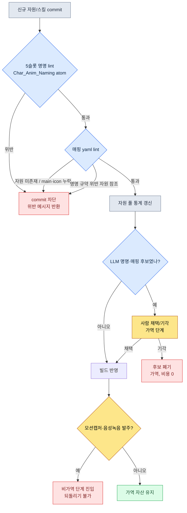

# 11.1 명명 규약과 스킬-아트 매핑

스프린트 마감 이틀 전, 전투 아티스트가 팀 메신저로 짧은 영상 하나를 던졌다. 신규 무사 클래스의 3타 콤보. 1타와 2타는 칼바람이 도는데 3타에서 아무 소리도 안 났다. 무음. 본인은 사운드를 다 붙였다고 했고, 사운드 담당은 파일을 다 넘겼다고 했다. 둘 다 거짓말을 하는 게 아니었다. 사운드 파일은 분명히 저장소에 있었다. `combo3_swing_final_real.wav`라는 이름으로. 게임 코드가 찾던 이름은 `sfx_K012_combo3_swing.wav`였다. 한 글자도 안 겹친다.

이 무음 사고를 추적하는 데 그날 오후가 통째로 들어갔다. 클립 하나, 사운드 하나의 문제가 아니다. 이름을 사람이 자유롭게 짓는 한, 이런 사고는 분기마다 수십 건씩 다시 태어난다. 이 챕터는 그 자유를 룰로 바꾸는 이야기다.

> **이 챕터에서 답하는 질문**
> - 자원 1만 개 규모에서 이름은 왜 자유가 아니라 룰인가
> - 명명 규약을 atom으로 강제하고 lint로 자동 검증하면 무엇이 닫히는가
> - 스킬 하나에 붙는 애니·VFX·사운드·아이콘 매핑을 AI가 초안하고 사람이 채택하는 워크드

> **비전공자를 위한 한 줄.** 자원 1만 개나 fbx 파일명 양식은 게임만의 사정처럼 보입니다. 그러나 가져가실 단 하나는 도메인을 가리지 않습니다 — **"이름을 자유롭게 짓는 순간 검색·자동화·연결이 함께 잠긴다."** 규모가 커지면 명명은 취향이 아니라 룰이 되어야 하고, 룰이 된 이름만 코드가 자동으로 찾아 쓸 수 있다는 원칙은 문서·자산·고객 레코드를 다루는 어느 일에도 적용됩니다.

---

## 11.1.1 자원 1만 개라는 규모

저자가 디렉팅하는 프로젝트 A는 모바일 우선 MMORPG다. 캐릭터 애니메이션 자원의 대략적 규모는 아래와 같다. 플레이어 클래스 수, 적 NPC 종류는 실제 운영 수치이고, 클립 수와 전체 추정치는 저자 추정(미검증)이다.

| 자원 | 수 |
|---|---|
| 플레이어 캐릭터 클래스 | 6 |
| 적 NPC 종류 | 80\~100 |
| 캐릭터 1체 평균 클립 | 100\~150 (저자 추정) |
| 전체 클립 추정 | 약 10,000\~15,000 (저자 추정) |

1만 개. 이건 서랍 1만 개와 같다. 라벨이 안 붙은 서랍 1만 개 앞에서 "공격 모션 어디 있더라"를 찾는 건 사람의 기억력에 도박을 거는 일이다. 그리고 그 도박은 반드시 진다. 못 찾으면 결과는 둘 중 하나다. 작업 시간이 두 배로 늘거나, 못 찾았으니 같은 동작을 새로 만든다. 후자가 더 나쁘다. 자원이 비대해지는 데다, 나중에 같은 동작 두 개가 미묘하게 다르게 굴러다니기 때문이다.

이름이 자유 영역이면 잠기는 건 검색만이 아니다. "스킬 ID로 애니메이션 파일을 코드가 자동으로 찾아오는" 자동 라우팅도 같이 잠긴다. 이름에서 규칙을 읽어낼 수 없으면, 코드는 스킬 하나하나에 대해 어느 파일을 쓸지 손으로 적은 매핑 테이블을 들고 있어야 한다. 그 테이블은 신규 캐릭터가 들어올 때마다 손으로 늘어난다.

---

## 11.1.2 5슬롯 명명 양식 — atom으로 박제하기

프로젝트 A의 애니메이션 파일명은 다섯 칸으로 고정돼 있다.

```
<role>_<id>_<category>_<action>_<variant>.fbx

char_K001_idle_default_v1.fbx
char_K001_locomotion_walk_forward.fbx
char_K001_combat_attack_combo1_v2.fbx
char_K001_react_hit_heavy.fbx
enemy_E021_combat_skill_aoe_v1.fbx
```

다섯 칸 모두 정해진 enum을 따른다. 자유 입력이 허용되는 칸은 `id` 하나뿐이고, 그 칸조차 `[A-Z]\d{3}` 형식으로 묶인다.

| 슬롯 | enum 수 | 예 |
|---|---|---|
| role | 4 | char, enemy, pet, mount |
| id | 형식 고정 | K001, E021, P003, M005 |
| category | 8 | idle, locomotion, combat, react, death, social, cinematic, system |
| action | 카테고리별 10\~30 | walk, run, attack, skill_aoe, hit_heavy |
| variant | 형식 고정 | default, v1, v2, _short, _long |

여기서 핵심은 양식 자체가 아니라 양식을 어디에 입력해 두느냐다. 명명 규약을 위키 문서 한 페이지에 적어두면, 그건 아무도 안 읽는 라벨이다. 저자는 이 규약을 `Char_Anim_Naming_Convention`이라는 단일 진실 원천 atom으로 만들고, 사람도 lint도 LLM도 전부 이 atom 하나만 바라보게 만들었다. 양식이 문서가 아니라 atom으로 박제되는 순간, 명명은 "권장 사항"에서 "통과해야 하는 관문"으로 성격이 바뀐다.

`action` 칸의 enum은 무한히 늘어날 수 있다는 게 약점이다. 그래서 카테고리별 표준 action을 사전으로 관리한다.

```yaml
combat:
  - attack_basic
  - attack_combo1
  - attack_combo2
  - skill_<skill_id>
  - parry
  - dodge_forward
  - dodge_back
react:
  - hit_light
  - hit_heavy
  - knockback
  - stagger
  - stun
locomotion:
  - idle
  - walk_forward
  - run_forward
  - sprint
  - jump_start
  - jump_loop
  - jump_land
```

신규 action을 사전에 넣을지는 절차로 판단한다. 분기당 3캐릭터 이상이 쓸 수 있는가, 기존 action으로는 정말 표현이 안 되는가, 카테고리가 명확한가, 그리고 가장 중요하게 — variant로 흡수할 수 있지 않은가. variant로 처리되면 action은 늘리지 않는다. action 사전이 100개 안쪽으로 유지되면 운영이 건강한 신호다. 다만 이걸 절대 상한으로 받지는 않는다. 신규 장르나 신규 클래스가 들어오면 한 번에 30\~40개가 늘 수도 있다. 막아야 하는 건 숫자가 아니라 무절제한 증식이다.

---

## 11.1.3 lint가 commit을 막는다

양식을 atom으로 입력했으면, 그 atom을 자동으로 강제하는 검증기가 필요하다. 사람이 매번 눈으로 5칸을 검사할 수는 없다. 아래가 그 lint의 척추다.

```python
# anim_naming_lint.py
import re, yaml

NAMING_PATTERN = re.compile(
    r"^(?P<role>char|enemy|pet|mount)_"
    r"(?P<id>[A-Z]\d{3})_"
    r"(?P<category>idle|locomotion|combat|react|death|social|cinematic|system)_"
    r"(?P<action>[a-z_]+?)"
    r"(?:_(?P<variant>v\d+|short|long|light|heavy|left|right|forward|back))?"
    r"\.fbx$"
)

ACTION_DICT = yaml.safe_load(open("char_anim_naming_convention.yaml"))

def check(filename):
    m = NAMING_PATTERN.match(filename)
    if not m:
        return f"명명 규칙 위반(5슬롯 형식 불일치): {filename}"

    category, action = m.group("category"), m.group("action")
    # skill_<id> 형태는 동적 action이므로 prefix만 검사
    base = "skill" if action.startswith("skill_") else action
    if base not in ACTION_DICT.get(category, []):
        return f"action enum 외({category}): {action}"

    return None
```

새 fbx가 저장소에 들어오는 순간 이 검사가 돈다. 위반이면 commit이 막힌다. 여기서 중요한 건 위반을 사람 책임으로 돌리지 않는다는 점이다. 무음 사고를 낸 아티스트를 탓하는 대신, "그 이름은 애초에 commit이 안 됐어야 한다"는 쪽으로 책임을 도구에 떠넘긴다. 사람은 실수하고, 도구는 그 실수를 막는다. 이게 명명 시스템의 기본 자세다.

명명이 강제되면 그 대가로 자동 라우팅이 풀린다.

```python
def play_skill_animation(character, skill_id):
    anim_path = f"char_{character.id}_combat_skill_{skill_id}.fbx"
    if not exists(anim_path):
        anim_path = f"char_{character.id}_combat_skill_default.fbx"  # fallback
    play(anim_path)
```

손으로 적은 매핑 테이블이 사라진다. 신규 캐릭터, 신규 스킬이 들어와도 애니 파일만 규약대로 추가하면 코드는 한 줄도 안 바뀐다. 무음 사고로 돌아가 보면, 만약 그 사운드 파일이 `sfx_K012_combo3_swing.wav`라는 규약 이름으로만 들어올 수 있었다면 — 애초에 `combo3_swing_final_real.wav`는 commit 단계에서 튕겨나갔을 것이고, 그날 오후는 통째로 살아있었을 것이다.

variant 슬롯은 action enum을 지키는 안전판이다. 같은 동작의 버전(v1, v2), 길이(_short, _long), 강도(_light, _heavy), 방향(_forward, _back)은 전부 variant로 흡수해, action을 미세 분기시키는 대신 받아낸다. 그리고 게임 코드는 그 variant를 컨텍스트로 골라 쓸 수 있다.

```python
def select_variant(base_action, context):
    if context.distance < 3:
        return f"{base_action}_short"
    if context.distance > 10:
        return f"{base_action}_long"
    return base_action
```

명명 규약이 코드의 분기점이 되는 셈이다.

---

## 11.1.4 스킬 하나에 자원 열 개 — 매핑 yaml

명명이 L1이라면, 스킬과 자원을 잇는 매핑은 L2다. 스킬 1개는 보통 애니메이션 2\~3개, VFX 1\~3개, 사운드 2\~5개, UI 아이콘 1개를 끌고 다닌다. 평균 잡아 자원 10개. 스킬 200개면 매핑 대상이 약 2,000개다. 이 규모를 사람 머리로 관리하는 건 불가능하다. 그래서 스킬 하나당 yaml 한 장을 두고, 그 스킬의 자원은 오직 그 한 장에서만 읽게 묶는다.

```yaml
---
skill_id: skill_K001_combo1
description: K001 콤보1 (3타 연속)
type: melee_combo
animations:
  - clip: char_K001_combat_attack_combo1_v2.fbx
    role: main
    bone_alignment: spine_03
vfx:
  - asset: vfx_K001_combo1_slash.vfx
    socket: weapon_tip
    timing_ms: [0, 150, 300]
  - asset: vfx_hit_blood_light.vfx
    socket: target
    timing_ms: [150]
sound:
  - asset: sfx_K001_combo1_swing.wav
    volume: 0.8
    timing_ms: 0
  - asset: sfx_hit_metal_light.wav
    volume: 0.6
    timing_ms: 150
ui_icon: icon_skill_K001_combo1.png
ui_tooltip_key: skill_K001_combo1_tooltip
verified: true
---
```

이 한 장이 스킬 하나의 자원 전체다. 그리고 이 yaml 안의 모든 자원 경로는 11.1의 5슬롯 규약을 따른다. 명명 lint가 무너지면 이 매핑도 같이 무너진다. 두 층은 한 쌍으로 작동한다.

매핑이 한 곳에 모이면 영향 추적이 자동으로 풀린다. 어떤 VFX 하나를 갈아엎으려 할 때, 그게 어느 스킬에 영향을 주는지 손으로 뒤질 필요가 없다.

```python
def find_skills_using(asset):
    affected = []
    for path in glob("skills/*.yaml"):
        skill = yaml.safe_load(open(path))
        for cat in ("vfx", "sound", "animations"):
            for entry in skill.get(cat, []):
                if entry.get("asset") == asset or entry.get("clip") == asset:
                    affected.append(skill["skill_id"])
    return affected

# find_skills_using("vfx_hit_blood_light.vfx")
# → ["skill_K001_combo1", "skill_K005_combo2", "skill_E021_attack_basic", ...]
```

자원 교체 회의에 영향 스킬 목록이 자동으로 첨부된다. "이거 바꾸면 어디에 영향 가나요?"라는 질문이 나오기 전에, 답이 이미 회의록 옆에 놓여 있다.

매핑에도 lint가 붙는다. 모든 자원 파일이 실제로 존재하는가, animations.main과 ui_icon이 각각 하나씩 있는가, timing_ms가 애니메이션 길이 안에 있는가, 그리고 — 모든 자원 경로가 11.1 명명 규약을 통과하는가. 마지막 항목이 두 층을 묶는 못이다. 빌드 시 자동으로 돈다.

---

## 11.1.5 명명·매핑 검증 흐름

지금까지의 명명 lint와 매핑 lint가 하나의 게이트로 어떻게 이어지는지 흐름으로 정리한다.



이 흐름의 끝에 가역/비가역 경계가 있다는 점에 주목하자. yaml 수정, LLM 후보, 키프레임까지는 전부 가역이다. 마음에 안 들면 폐기하면 그만이고 비용은 거의 0이다. 그러나 모션 캡처 촬영, 성우 음성 녹음, 시그니처 보이스 캐스팅으로 넘어가는 순간 비가역으로 바뀐다. 배우와 스튜디오 예약, 녹음 부스, 계약, 시장 인식이 걸린다. 그래서 모든 명명·매핑·페르소나 결정은 비가역 단계 직전, 즉 yaml과 LLM 후보와 키프레임이라는 가역 영역 안에서 끝내야 한다.

---

## 11.1.6 워크드 트랜스크립트 — 신규 스킬 매핑 초안을 AI에게

여기까지가 시스템이고, 이제 AI가 어디에 들어오는지를 실제 세션 그대로 보인다. 새 화염 스킬 `skill_K012_flame_burst`의 자원 매핑 초안을 LLM에게 시키는 장면이다.

**프롬프트 (전문):**

```
다음은 우리 프로젝트의 캐릭터 애니메이션 명명 규약(atom)과 기존 자원 풀 통계,
그리고 유사 스킬 yaml 한 건이다.

[명명 규약]
<role>_<id>_<category>_<action>_<variant>.fbx
role: char|enemy|pet|mount / category: idle|locomotion|combat|react|death|social|cinematic|system

[자원 풀 TOP 사용 자원]
sfx_hit_metal_light.wav (47스킬), vfx_dust_kickup.vfx (38스킬),
vfx_fire_burst_med.vfx (22스킬), sfx_fire_whoosh.wav (19스킬)

[유사 스킬 yaml]
skill_id: skill_K005_fire_slash / type: melee_fire
animations: [char_K005_combat_attack_fire_v1.fbx]
vfx: [vfx_K005_fire_slash.vfx, vfx_fire_burst_med.vfx]
sound: [sfx_K005_fire_swing.wav, sfx_fire_whoosh.wav]

신규 스킬: skill_K012_flame_burst (K012 무사, 범위 화염 폭발, 1타)
이 스킬의 매핑 yaml 초안을 작성하라. 기존 자원 풀을 최대한 재사용하고,
새로 제작이 필요한 자원은 [NEW] 태그를 붙여 표시하라.
```

**Claude 날것 출력 (요약·정리 없이):**

```yaml
skill_id: skill_K012_flame_burst
description: K012 무사 범위 화염 폭발 (1타)
type: aoe_fire
animations:
  - clip: char_K012_combat_skill_flame_burst_v1.fbx   # [NEW] 신규 모션 필요
    role: main
    bone_alignment: spine_03
vfx:
  - asset: vfx_fire_burst_med.vfx     # 재사용 (풀 22스킬)
    socket: ground
    timing_ms: [200]
  - asset: vfx_K012_flame_ring.vfx    # [NEW] 범위 표현용 신규
    socket: ground
    timing_ms: [200, 350]
sound:
  - asset: sfx_fire_whoosh.wav        # 재사용 (풀 19스킬)
    volume: 0.8
    timing_ms: 0
  - asset: sfx_explosion_low.wav      # [NEW] 폭발음 신규 추정
    volume: 0.9
    timing_ms: 200
ui_icon: icon_skill_K012_flame_burst.png   # [NEW]
ui_tooltip_key: skill_K012_flame_burst_tooltip
verified: false
```

> 참고: `char_K012_combat_skill_flame_burst_v1.fbx`에서 action이
> `skill_flame_burst`인데, 명명 규약상 skill action은 `skill_<skill_id>`
> 형식이 맞는지 확인 필요. `skill_K012` 또는 `skill_flame_burst` 중
> 어느 쪽을 쓰는지 규약에 명시돼 있지 않아 추정했음.

**사람 검증/거부:**

마지막 참고가 정확히 약점을 짚었다. LLM이 모르는 게 아니라, 규약 atom에 그 칸의 형식이 모호하게 적혀 있었던 것이다. 실제로 프로젝트 A의 규약은 `skill_<skill_id>` 형식을 쓴다. 그래서 파일명은 `char_K012_combat_skill_K012_v1.fbx`가 맞다. LLM이 만든 `skill_flame_burst`는 거부. 그리고 `sfx_explosion_low.wav`는 [NEW]로 표시했지만, 자원 풀을 다시 보니 `sfx_impact_heavy.wav`가 47스킬에서 폭발음으로 이미 쓰이고 있었다. LLM에 준 풀 통계가 TOP 4까지만이라 놓친 것이다. 신규 제작 대신 재사용으로 바꾼다.

**재요청:**

```
두 가지 수정해서 다시 작성하라.
1. skill action 형식은 skill_<skill_id> 이다. K012 스킬이면 action은 skill_K012.
2. 자원 풀에 sfx_impact_heavy.wav (47스킬, 폭발/충격음)가 있다.
   sfx_explosion_low.wav 신규 제작 대신 이걸 재사용하라.
전체 풀 통계는 다음과 같다. [전체 38종 첨부]
```

이 한 사이클에서 LLM이 한 일은 "그럴듯한 초안"이고, 사람이 한 일은 "규약 모호점 발견·풀 누락 발견·재사용 결정"이다. LLM은 신규 자원 후보를 너무 쉽게 [NEW]로 찍는 경향이 있어서, 재사용 판단은 끝까지 사람이 쥔다. 그래도 빈 화면에서 yaml을 처음부터 짜는 것과, 채택·거부할 초안을 받아 고치는 것은 작업 부담이 다르다.

---

## 11.1.7 보수에서 진보로 — 사람이 채택만 하는 단계

위 트랜스크립트가 바로 진보적 적용의 한 장면이다. 명명·매핑 운영은 두 단계로 나뉜다.

보수적 단계에서는 사람이 명명을 부여하고 매핑을 짜며, 자동은 검증(lint)과 추적(`find_skills_using`)만 맡는다. 현재 대부분의 MMORPG 캐릭터·자원 운영이 여기에 있다. 진보적 단계에서는 명명 초안, 매핑 초안, 그리고 NPC 페르소나 생성까지 LLM이 후보를 내고, 사람의 손에 남는 결정은 "어떤 후보를 채택할지" 하나로 좁혀진다.

진보적 단계가 자리잡으려면 세 가지가 갖춰져야 한다. 첫째는 명명 규약 lint 엔진이다. LLM이 낸 명명 후보도 사람이 짠 것과 똑같이 5슬롯 lint를 통과해야만 채택된다. 위 트랜스크립트에서 LLM의 `skill_flame_burst`가 거부된 게 이 게이트다. 둘째는 NPC 페르소나 자동 생성기다. 캐릭터 yaml을 voice_profile·anim_set·skill_set 세 축으로 분해해 두면, LLM이 "50대 무사, 신중함, 낮은 톤" 같은 묘사를 받아 세 축의 후보를 각각 분리해 제안할 수 있다. NPC 100체의 세 축을 0에서 짜기와, 페르소나당 후보 몇 개 중 고르기는 부담이 다르다. 셋째는 매핑 후보 생성기다. `find_skills_using`의 역방향 — "이 새 스킬에 어울리는 기존 자원" 검색을 자원 풀 통계와 묶어, 슬롯별 재사용 후보를 제안한다. 신규 제작 비용을 낮추고 재사용률을 높이는 양방향 효과다.

세 요소 모두 같은 인프라(yaml·lint·자원 풀 통계) 위에서 돈다. 명명 규약과 매핑 yaml이 단일 진실 원천으로 정렬돼 있을 때만 가동되고, 정렬이 무너지면 LLM에게 줄 입력 자체가 없다.

이 세 요소가 2010년대에도 이론적으로는 가능했다는 점은 짚어둘 만하다. 막힌 건 세 군데였다. 동작이 무엇인지 자연어로 이해하지 못해 5슬롯 후보를 못 냈고, voice·anim·skill을 따로 떼서 묶는 건 사람의 직관 영역이었고, "비슷한 느낌의 VFX"를 텍스트 묘사로 찾는 게 어려웠다. 2023년 이후 LLM 발전으로 세 군데 모두 보조 가능 영역에 들어왔다. 종이 위에만 있던 진보적 캐릭터 자원화 비전의 상당 부분이 실무 적용 단계로 옮겨온 셈이다.

---

## 11.1.8 측정 — 도입 전후

프로젝트 A의 명명·매핑 도입 전후 비교다. 검색 시간과 온보딩 기간은 저자가 실제로 체감·기록한 방향이고, 비율 항목은 분기 회고에서 집계한 실측이다. 절대 수치 일부는 저자 추정(미검증)임을 밝힌다.

| 항목 | 도입 전 | 도입 후 |
|---|---|---|
| 동작 검색 시간 (애니메이터) | 5\~10분 | 30초 |
| 중복 제작 비율 | 12\~15% | 1\~2% |
| 신규 캐릭터 라우팅 코드 변경 | 50\~100줄 | 0줄 |
| 신규 스킬 자원 누락 사고 | 분기당 5\~8건 | 0\~1건 |
| 미사용 자원 누적 (라이브러리 비중) | 약 30% | 약 8% |
| 새 애니메이터 온보딩 | 2주 | 3일 |

마지막 항목이 가장 조용하지만 큰 효과다. 명명 규약 atom 하나가 곧 온보딩 가이드가 된다. 새 애니메이터에게 "이름은 이 5칸으로 짓고, lint가 막으면 lint 말을 들어라"는 한 문장이면 첫날 작업이 가능해진다.

---

## 11.1.9 흔한 실패

| 패턴 | 처방 |
|---|---|
| 명명 규약을 위키 문서로만 둠 | 단일 atom으로 박제 + lint 강제 |
| action enum 무한 증식 | 사전 + 신규 추가 절차 |
| 명명 검증 없이 commit | 자동 lint로 commit 차단 |
| 코드에 하드코딩 매핑 테이블 | 명명 기반 자동 라우팅 |
| variant 없이 action 미세 분기 | variant 슬롯으로 흡수 |
| 자원 매핑이 코드·시트·문서에 분산 | yaml 한 파일로 통합 |
| LLM 매핑 후보를 검증 없이 채택 | 명명 lint + 사람 재사용 판단 |
| 명명 위반을 사람 책임으로 | lint 보강, 책임을 도구로 |

---

### 이 챕터의 핵심 메시지
- 자원 1만 개 규모에서 이름은 작가의 자유가 아니라 통과해야 할 관문이다
- 명명 규약을 atom으로 입력하고 lint로 강제하면 자동 라우팅과 매핑이 풀린다
- LLM은 명명·매핑 초안을 내고 사람은 채택·재사용만 판단한다

### 따라하기

**setup** — 애니메이션 파일명을 `<role>_<id>_<category>_<action>_<variant>.fbx` 5슬롯으로 정의하고, 카테고리별 action 사전을 yaml 한 파일에 모으세요. 이 yaml을 팀의 단일 진실 원천으로 선언하세요.

**prompt** — LLM에 "[명명 규약 yaml] + [자원 풀 통계] + [유사 스킬 yaml 1건]"을 주고, 신규 스킬의 매핑 yaml 초안을 요청하세요. 재사용 자원과 신규 제작 자원([NEW] 태그)을 구분해 달라고 명시하세요.

**verify** — LLM 출력의 모든 자원 경로를 명명 lint에 통과시키세요(위 `anim_naming_lint.py`). 통과 못 하면 거부합니다. 통과한 후보 중 [NEW] 태그는 자원 풀을 다시 뒤져 재사용 가능 여부를 사람이 판단합니다.

### 1인 축소판
- atom 대신 README 한 페이지에 5슬롯 규약과 action 사전을 적으세요.
- lint는 git pre-commit hook에 `anim_naming_lint.py` 한 파일로 거세요.
- 스킬 수가 적으면 매핑 yaml 대신 스프레드시트 한 장(스킬 행 × 자원 열)으로 시작하고, 200개를 넘기는 시점에 yaml로 옮기세요.
- LLM 매핑 초안은 무료/저가 모델로도 충분합니다. 핵심은 사람이 lint와 재사용 판단을 쥐는 것입니다.

### 다음 챕터 미리보기
- 11.2 펫·탈것 시스템 — 캐릭터 패턴을 그대로 가져오면 과잉이 되는 영역에서, 템플릿+인스턴스 90% 공유 구조로 AI가 인스턴스를 양산하고 lint가 검증하는 변주
