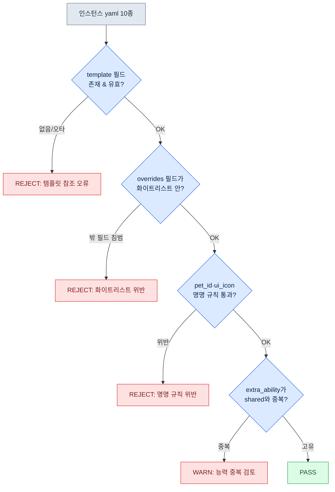

# 11.2 펫·탈것 시스템 — 템플릿 1종에서 인스턴스 50종으로

기획 회의 첫머리에 펫 목록이 올라온다. 늑대 계열 열두 종, 고양이 계열 여덟 종, 새 계열 다섯 종. 누구도 "그럼 한 마리씩 만들어 보자"고 말하지 않는다. 캐릭터와 달리 펫은 처음부터 '50종을 찍어낼 것'이 전제이기 때문이다. 질문은 "어떻게 한 종을 잘 만드나"가 아니라 "한 번 만든 골격을 몇 종이 공유하게 할 것인가"로 시작한다.

캐릭터는 한 종 한 종이 사용자에게 고유한 존재라 한 종씩 정성을 들인다. 반면 펫·탈것은 '같은 골격에 색과 능력만 바꾼 변주'가 대부분이라, 설계의 시작부터 명명 규약·템플릿·lint를 갖춰 양산 파이프라인을 깐다. 한 종을 공들여 만든 다음 그게 열두 벌로 복제되도록 두면, 색만 다른 늑대 열두 마리에 동일한 애니 클립이 따로따로 들어가 폴더가 4기가로 부푼다. 그건 양산이 아니라 양산을 안 한 결과다. 핵심은 '얼마나 잘 만드느냐'가 아니라 '얼마나 적게 만들고 얼마나 많이 공유하느냐'다.

그래서 이 장은 늑대 계열 펫 템플릿 한 종을 yaml로 정의하고, 그 골격을 물려받는 인스턴스를 AI에게 양산시킨 뒤, lint로 검증하고, 몇 퍼센트가 폐기되는지 측정하는 한 호흡을 끝까지 따라간다.

## 11.2.1 템플릿과 인스턴스의 분리

셋은 자원 구조가 닮았지만 사용자 인지 비중이 다르다. 캐릭터는 사용자가 게임 시간의 100%를 함께 보내는 자기 자신이다. 펫은 곁에 두는 동료로 50~70% 시간을 같이 보내고, 탈것은 이동할 때만 꺼내는 도구로 10~20%에 머문다. 인지 비중이 낮을수록 사용자는 디테일을 덜 본다. 캐릭터에 쏟는 정성을 탈것에 똑같이 쏟는 건, 매일 앉는 책상과 가끔 펴는 접이식 의자를 같은 예산으로 관리하는 것과 같다.

그래서 펫·탈것은 '템플릿-인스턴스' 구조로 운영한다. 골격·동작·기본 능력을 담은 **템플릿** 한 종을 만들고, 색·아이콘·미세 능력만 바꾼 **인스턴스**를 그 위에 얹는다. 인스턴스는 템플릿이 가진 자원의 90%를 공유하므로, 실제로 새로 만드는 건 나머지 10%뿐이다. 이 분리를 그림으로 보면 다음과 같다.

<svg viewBox="0 0 720 300" xmlns="http://www.w3.org/2000/svg" font-family="sans-serif" font-size="13">
  <rect x="20" y="20" width="200" height="260" rx="8" fill="#eef3fb" stroke="#3b6ea5" stroke-width="2"/>
  <text x="120" y="45" text-anchor="middle" font-weight="bold" fill="#1f3b5c">템플릿 (1종)</text>
  <text x="120" y="68" text-anchor="middle" fill="#1f3b5c">pet_template_canine</text>
  <rect x="40" y="85" width="160" height="28" rx="4" fill="#fff" stroke="#3b6ea5"/>
  <text x="120" y="104" text-anchor="middle">골격 skeleton</text>
  <rect x="40" y="120" width="160" height="28" rx="4" fill="#fff" stroke="#3b6ea5"/>
  <text x="120" y="139" text-anchor="middle">공유 애니 4종</text>
  <rect x="40" y="155" width="160" height="28" rx="4" fill="#fff" stroke="#3b6ea5"/>
  <text x="120" y="174" text-anchor="middle">공유 능력 2종</text>
  <rect x="40" y="190" width="160" height="28" rx="4" fill="#fff" stroke="#3b6ea5"/>
  <text x="120" y="209" text-anchor="middle">기본 BT</text>
  <text x="120" y="250" text-anchor="middle" fill="#888" font-size="11">자원 90% (한 번만 제작)</text>

  <line x1="220" y1="150" x2="300" y2="80" stroke="#888" stroke-width="1.5"/>
  <line x1="220" y1="150" x2="300" y2="150" stroke="#888" stroke-width="1.5"/>
  <line x1="220" y1="150" x2="300" y2="220" stroke="#888" stroke-width="1.5"/>

  <rect x="300" y="55" width="380" height="50" rx="6" fill="#f3f9ee" stroke="#5a8f3c" stroke-width="1.5"/>
  <text x="315" y="78" font-weight="bold" fill="#2f5320">pet_P003 (회색 늑대)</text>
  <text x="315" y="96" fill="#555" font-size="11">override: skin=gray, icon, 능력 1종</text>

  <rect x="300" y="125" width="380" height="50" rx="6" fill="#f3f9ee" stroke="#5a8f3c" stroke-width="1.5"/>
  <text x="315" y="148" font-weight="bold" fill="#2f5320">pet_P004 (검은 늑대)</text>
  <text x="315" y="166" fill="#555" font-size="11">override: skin=black, icon, 능력 1종</text>

  <rect x="300" y="195" width="380" height="50" rx="6" fill="#f3f9ee" stroke="#5a8f3c" stroke-width="1.5"/>
  <text x="315" y="218" font-weight="bold" fill="#2f5320">pet_P005 (눈 늑대) … P012까지</text>
  <text x="315" y="236" fill="#555" font-size="11">override: skin=snow, icon, 능력 1종 — 자원 10%만 신규</text>
</svg>

왼쪽 템플릿 한 덩어리를 한 번 만들면, 오른쪽 인스턴스들은 색과 아이콘과 능력 한 줄만 갈아끼우면 된다. 앞서 말한 '4기가 폴더'는 이 분리를 빼먹어 90%의 자원이 열두 번 복제될 때 생기는 모습이다.

## 11.2.2 명명과 자원 양식 — 캐릭터에서 한 칸 줄이기

펫·탈것의 명명 규약은 11.1의 캐릭터 명명에서 한 슬롯을 덜어낸 형태다. 캐릭터는 `char_<id>_<category>_<action>_<variant>` 5슬롯을 쓰지만, 펫·탈것은 variant를 생략하고 4슬롯으로 간다. variant가 필요하면 action에 합친다.

```
pet_<id>_<category>_<action>.fbx
mount_<id>_<category>_<action>.fbx

예:
pet_P003_idle_default.fbx
pet_P003_combat_bite.fbx
mount_M005_locomotion_run.fbx
```

자원 매핑 yaml도 캐릭터 양식에서 vfx·sound 슬롯을 덜어 가볍게 만든다. 이 슬롯들을 통째로 안고 가는 인스턴스는 빈 칸만 가득한 양식이 되어 lint가 매번 헛경고를 띄운다.

이제 본론이다. 늑대 계열 템플릿 한 종을 정의하고, 거기서 인스턴스를 양산해 보자.

## 11.2.3 워크드 트랜스크립트: 템플릿 1종 → 인스턴스 양산 → lint → 폐기율

### 1단계 — 템플릿 yaml 직접 작성

AI에게 양산을 시키기 전에, 사람이 템플릿 한 종을 손으로 확정한다. 이 한 종이 인스턴스 수십 종의 품질 기준이 되므로 자동화하지 않는다. 늑대 계열(canine) 템플릿은 이렇게 잡았다.

```yaml
# pet_template_canine.yaml
template_id: pet_template_canine
skeleton: skel_quadruped_medium      # 네발 중형 공용 골격
shared_animations:
  - clip: pet_template_canine_idle_default.fbx
  - clip: pet_template_canine_locomotion_walk.fbx
  - clip: pet_template_canine_locomotion_run.fbx
  - clip: pet_template_canine_combat_bite.fbx
shared_abilities:
  - id: pet_template_canine_passive_speed
    description: 동료 이동 속도 +3%
  - id: pet_template_canine_active_bite
    description: 단일 대상 물기, 쿨다운 12s
bt_ref: bt_pet_canine_default        # 따라다님 + 전투 보조 기본 BT
instance_overridable:                # 인스턴스가 바꿔도 되는 필드 화이트리스트
  - visual_skin
  - ui_icon
  - ui_tooltip_key
  - extra_ability                    # 인스턴스당 능력 1종까지 추가 허용
```

여기서 `instance_overridable`가 핵심 장치다. 인스턴스가 건드릴 수 있는 필드를 화이트리스트로 못 박는다. AI가 양산하다가 골격이나 공유 애니를 멋대로 바꾸려 들면, 이 목록에 없는 필드를 건드린 것이므로 lint가 잡아낸다. '바꿔도 되는 것'을 먼저 정의하는 게 양산의 안전벨트다.

### 2단계 — AI에게 인스턴스 양산 요청 (프롬프트 전문)

다음은 인스턴스 10종을 양산시킨 프롬프트 전문이다. 요약하지 않고 그대로 싣는다.

```
[프롬프트]
당신은 펫 데이터 작성을 돕는 어시스턴트다. 아래 템플릿을 기준으로,
늑대 계열 펫 인스턴스 10종의 yaml을 생성하라.

[템플릿] pet_template_canine.yaml
(위 yaml 전문 붙여넣음)

[규칙]
1. 각 인스턴스는 template: pet_template_canine 을 반드시 명시한다.
2. overrides에는 instance_overridable 화이트리스트의 필드만 넣는다.
   화이트리스트에 없는 필드(skeleton, shared_animations 등)는 절대 건드리지 않는다.
3. visual_skin은 늑대의 자연스러운 변주여야 한다(색·무늬·크기).
4. extra_ability는 인스턴스당 최대 1종. passive 또는 active 중 택1.
   기존 shared_abilities와 효과가 겹치면 안 된다.
5. ui_icon, ui_tooltip_key는 pet_id에 맞춘 명명 규칙을 따른다.
6. pet_id는 pet_P003 ~ pet_P012로 부여한다.

출력은 yaml 10개 블록만. 설명 문장은 붙이지 마라.
```

규칙 2가 1단계의 화이트리스트와 짝을 이룬다. 규칙 4의 "겹치면 안 된다"는 AI가 능력을 게을리 복제하는 걸 막는 제약이다. 이런 제약을 안 걸면, 뒤에서 보겠지만 AI는 가장 안전한 선택지(기존 능력 복붙)로 수렴한다.

### 3단계 — Claude의 날것 출력 (요약·각색 없음)

AI가 뱉은 출력에서, 성공·실패·애매가 섞인 그대로를 발췌한다. 깔끔하게 다듬지 않는다.

```yaml
# 출력 1 — 정상
pet_id: pet_P003
template: pet_template_canine
overrides:
  visual_skin: wolf_gray
  ui_icon: icon_pet_P003.png
  ui_tooltip_key: pet_P003_tooltip
  extra_ability:
    id: pet_P003_active_howl
    description: 5초간 적 이동 속도 -20%, 쿨다운 30s

# 출력 2 — 정상
pet_id: pet_P004
template: pet_template_canine
overrides:
  visual_skin: wolf_black
  ui_icon: icon_pet_P004.png
  ui_tooltip_key: pet_P004_tooltip
  extra_ability:
    id: pet_P004_passive_crit
    description: 동료 치명타 확률 +2%

# 출력 5 — 애매 (능력이 공유 능력과 사실상 중복)
pet_id: pet_P007
template: pet_template_canine
overrides:
  visual_skin: wolf_brown
  ui_icon: icon_pet_P007.png
  ui_tooltip_key: pet_P007_tooltip
  extra_ability:
    id: pet_P007_passive_speed_boost
    description: 동료 이동 속도 +3%   # ← shared의 passive_speed와 효과 동일

# 출력 8 — 실패 (화이트리스트 밖 필드 침범)
pet_id: pet_P010
template: pet_template_canine
overrides:
  visual_skin: wolf_white
  ui_icon: icon_pet_P010.png
  shared_animations:                 # ← overridable 화이트리스트에 없음
    - clip: pet_P010_combat_pounce.fbx
  extra_ability:
    id: pet_P010_active_pounce
    description: 도약 공격, 쿨다운 20s

# 출력 9 — 실패 (명명 규칙 위반)
pet_id: P011                          # ← 'pet_' 접두사 누락
template: pet_template_canine
overrides:
  visual_skin: wolf_silver
  ui_icon: pet11_icon.png            # ← icon_pet_P011.png 규칙 위반
  ui_tooltip_key: pet_P011_tooltip
  extra_ability:
    id: pet_P011_passive_dodge
    description: 동료 회피 +1%
```

10종 중 정상은 P003·P004·P005·P006·P008·P012 여섯, 능력 중복으로 애매한 게 P007 하나, 화이트리스트 침범·명명 위반으로 실패한 게 P009·P010·P011 셋이었다. AI는 규칙 4를 걸었음에도 P007에서 공유 능력을 베껴 왔고(가장 안전한 선택), 규칙 2를 걸었음에도 P010에서 골격 애니를 건드렸다. 제약을 명시해도 양산물의 일정 비율은 새는 게 현실이다. 그래서 다음 단계가 필요하다.

### 4단계 — lint 검증

사람이 눈으로 10종을 일일이 보는 대신, lint를 돌린다. lint 규칙은 1단계 템플릿의 화이트리스트와 11.1 명명 규약에서 그대로 끌어온다. 검사 항목은 네 가지다.



각 인스턴스가 네 게이트를 통과하면 PASS, 중간에 걸리면 REJECT 또는 WARN으로 떨어진다. 실제 검증 결과를 표로 정리하면 이렇다.

| pet_id | template | 화이트리스트 | 명명 | 능력 중복 | 판정 |
|---|---|---|---|---|---|
| pet_P003 | OK | OK | OK | 고유 | PASS |
| pet_P004 | OK | OK | OK | 고유 | PASS |
| pet_P005 | OK | OK | OK | 고유 | PASS |
| pet_P006 | OK | OK | OK | 고유 | PASS |
| pet_P007 | OK | OK | OK | **중복** | WARN |
| pet_P008 | OK | OK | OK | 고유 | PASS |
| pet_P009 | OK | OK | **위반** | — | REJECT |
| pet_P010 | OK | **침범** | — | — | REJECT |
| P011 | OK | OK | **위반** | — | REJECT |
| pet_P012 | OK | OK | OK | 고유 | PASS |

PASS 6, WARN 1, REJECT 3. WARN은 능력을 한 줄 바꾸면 살릴 수 있고(P007), REJECT 3종은 폐기한다.

### 5단계 — 폐기율 측정과 재요청

이 한 사이클의 **폐기율**은 REJECT 3 / 전체 10 = **30%**다. WARN까지 '손봐야 하는 것'으로 묶으면 손질률은 40%다. 이 숫자가 양산 파이프라인의 건강 지표다. 폐기율이 30%면, 펫 50종을 확보하려면 약 72종을 생성시켜야 한다는 뜻이다(50 / 0.7 ≈ 71.4). 생성은 싸므로 이 정도 오버슈팅은 감당할 만하다. 단, 폐기율이 회를 거듭해도 떨어지지 않으면 그건 프롬프트 제약이 부족하다는 신호다.

그래서 폐기 사유를 프롬프트에 되먹인다. REJECT 3종의 사유(명명 누락, 화이트리스트 침범, 아이콘 규칙 위반)를 모아 재요청에 한 줄씩 추가했다.

```
[재요청 추가 규칙]
7. pet_id는 반드시 'pet_' 접두사로 시작한다. (이전 배치에서 P011 누락)
8. ui_icon은 예외 없이 icon_<pet_id>.png 형식이다. (pet11_icon.png 같은 변형 금지)
9. overrides에 shared_animations / skeleton / bt_ref 를 절대 넣지 마라.
   동작을 바꾸고 싶으면 extra_ability로만 표현한다. (P010 사례)
```

이 세 줄을 추가한 뒤 다음 배치 10종을 돌렸더니 REJECT가 3에서 1로 줄었다. 폐기율 30% → 10%. 폐기 사유를 규칙으로 승격시키는 이 되먹임이 양산 품질을 회차마다 끌어올리는 메커니즘이다. 사람은 매번 50종을 검수하는 대신, 폐기 사유를 규칙 한 줄로 옮기는 일만 한다.

## 11.2.4 탈것 — 골격조차 공유, 거의 데이터만

탈것은 펫보다 한 단계 더 단순하다. 스킬도 BT(BehaviorTree, 행동 트리)도 없고, 이동 파라미터와 전투 가능 여부 같은 데이터만 있다. 그래서 탈것 인스턴스는 사실상 표의 한 행이다.

```yaml
# mount_template_equine.yaml 기반 인스턴스
mount_id: mount_M005
template: mount_template_equine
overrides:
  visual_skin: horse_white
  movement:
    run_speed: 7.0
    sprint_speed: 12.0
  combat:
    allow_combat: false       # 전투 중 사용 불가
    dismount_on_damage: true
  ui_icon: icon_mount_M005.png
```

탈것 양산의 lint는 더 짧다. 명명·템플릿 참조·화이트리스트에 더해 'movement 파라미터가 허용 범위 안인가'(예: sprint_speed가 walk_speed보다 큰가, 상한을 넘지 않는가)만 검사하면 된다. 펫에서 만든 파이프라인을 그대로 쓰되 게이트 수만 줄인 형태다. 탈것에 전투 기능을 붙이는 건 신중해야 한다. allow_combat을 true로 여는 순간 게임 복잡도가 두 배가 되고, 펫·캐릭터 시스템과 충돌 검증을 새로 해야 한다.

## 11.2.5 측정 — 단순화가 체험을 깎지 않는다

펫·탈것에 캐릭터 패턴을 풀로 적용한 경우와, 템플릿-인스턴스로 단순화한 경우를 저자의 프로젝트 A에서 비교했다. 아래 수치 중 시간·자원 수는 저자 추정(미검증)이며, 폐기율과 자원 공유율은 실측 방향을 따른 비율이다.

| 항목 | 풀 적용 | 템플릿-인스턴스 |
|---|---|---|
| 펫 1종 자원 작업 시간 | 1~2주 (저자 추정) | 3~5일 (저자 추정) |
| 펫 라이브러리 자원 수 | 약 2,000 (저자 추정) | 약 600 (70% 절감) |
| 인스턴스 1종당 신규 자원 비율 | 100% | 약 10% |
| 첫 배치 양산 폐기율 | — | 30% (실측 방향) |
| 되먹임 후 폐기율 | — | 10% (실측 방향) |
| 사용자 체감 (펫 다양성) | 기준 | 거의 같음 |

> **표본·측정.** 위 표는 저자 환경 1개 프로젝트(프로젝트 A)의 펫 1라인 관찰이다(n=1 라인). '70% 절감'·'약 10%'는 독립 측정이 아니라 같은 행의 추정 자원 수(약 2,000 → 약 600)에서 나온 **산술 비율**이므로, 앞의 절대값이 추정인 만큼 이 백분율도 추정으로 읽어야 한다. 폐기율 30%·10%는 첫 배치~되먹임의 단일 양산 사이클에서 나온 **실측 방향**이며 반복 측정 표본은 아니다. 당신 팀의 절감 근거로 인용하지 말고, 같은 방식으로 본인 라인에서 직접 재기 바란다.

마지막 행이 이 장 전체의 결론이다. 자원의 90%를 공유하고 폐기율을 측정하며 양산해도, 사용자가 느끼는 펫의 다양성은 풀 제작과 거의 차이가 없었다. 앞서 말한 4기가 폴더는, 사용자가 끝내 구분하지 못할 디테일에 자원 열두 벌을 복제했을 때 치르는 비용이다. 양산을 전제로 깔면 줄어드는 건 운영 비용이지 체험이 아니다.

## 11.2.6 운영의 함정

| 함정 | 처방 |
|---|---|
| 캐릭터 시스템을 펫·탈것에 그대로 이식 | variant 슬롯·vfx·sound 덜어낸 4슬롯 변주 |
| 같은 골격 펫을 독립 자원으로 복제 | 템플릿 1종 + 인스턴스, 화이트리스트로 공유 강제 |
| AI 양산물을 검수 없이 커밋 | lint 4게이트 + 폐기율 측정 |
| 폐기율이 회차마다 안 떨어짐 | 폐기 사유를 프롬프트 규칙으로 승격(되먹임) |
| 펫에 캐릭터급 스킬 부여 | 인스턴스당 extra_ability 1종 상한 |
| 탈것에 전투 기능 부여 | allow_combat은 신중, 복잡도 ×2 각오 |

## 11.2.7 AI의 자리와 사람의 자리

펫·탈것은 사용자 체험 영향이 작아 AI 자유도가 캐릭터보다 크다. 컨셉을 적합 템플릿에 매칭하고, 능력 후보를 제안하고, 인스턴스 yaml을 양산하는 일은 AI가 빠르게 해낸다. 다만 자유도가 크다고 검증을 빼면, 위에서 본 30% 폐기물이 그대로 빌드에 섞인다. 사람의 자리는 둘이다. 첫째, 템플릿 한 종을 손으로 확정해 품질 기준을 고정하는 것. 둘째, 무엇이 왜 걸러졌는지를 읽어 다음 배치가 덜 새도록 제약을 다듬는 것. 양은 AI가 채우고 기준선과 그 보정은 사람이 쥐는 분업이, 이 시스템을 굴린다.

---

### 이 챕터의 핵심 메시지
- 펫·탈것은 잘 만드는 게 아니라 적게 만들고 많이 공유하는 시스템이다
- 템플릿 1종을 손으로 입력하고, 인스턴스는 화이트리스트 안에서 AI가 양산한다
- 폐기율을 측정하고 그 사유를 프롬프트 규칙으로 되먹이면 품질이 회차마다 오른다

### 다음 챕터 미리보기
- 12.1 아트 디렉팅 — 기획자가 아트와 협업하고 검수하는 방식

---

## 따라하기

**setup**
1. 펫 한 계열(예: 늑대)의 공용 골격·공유 애니 4종·공유 능력 2종을 정해 `pet_template_<계열>.yaml`로 저장하세요.
2. 템플릿에 `instance_overridable` 화이트리스트(바꿔도 되는 필드)를 명시하세요.
3. lint 4게이트(템플릿 참조 / 화이트리스트 / 명명 규칙 / 능력 중복)를 스크립트로 준비하세요.

**prompt**
4. 템플릿 yaml 전문 + 양산 규칙(화이트리스트 밖 필드 금지, 능력 중복 금지, 명명 규칙)을 붙여 인스턴스 10종을 요청하세요.
5. 출력은 "yaml 블록만, 설명 금지"로 형식을 고정하세요.

**verify**
6. lint를 돌려 PASS / WARN / REJECT를 분류하고 폐기율을 계산하세요.
7. REJECT 사유를 모아 프롬프트에 규칙 한 줄씩 추가하고 다음 배치를 돌리세요. 폐기율이 떨어지는지 확인하세요.

## 11.2.8 1인 축소판
혼자 만드는 게임이라면 lint 스크립트 없이도 됩니다. 펫 한 계열의 템플릿 yaml 한 장을 손으로 적고, AI에게 "이 템플릿에서 색·아이콘·능력만 바꾼 인스턴스 5종, 골격과 공유 애니는 절대 건드리지 마라"라고 요청하세요. 받은 5종을 눈으로 훑어 골격을 건드린 것·이름 규칙을 어긴 것만 버리세요. 버린 이유를 다음 요청에 한 줄 덧붙이세요. 템플릿 1.1과 '버린 이유 되먹이기'만 있으면, 도구 없이도 이 장의 핵심은 작동합니다.
