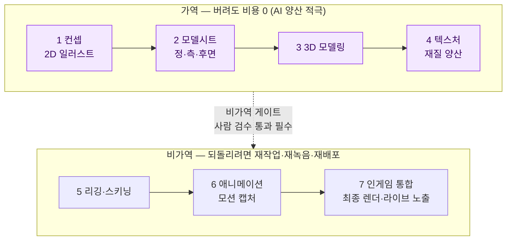
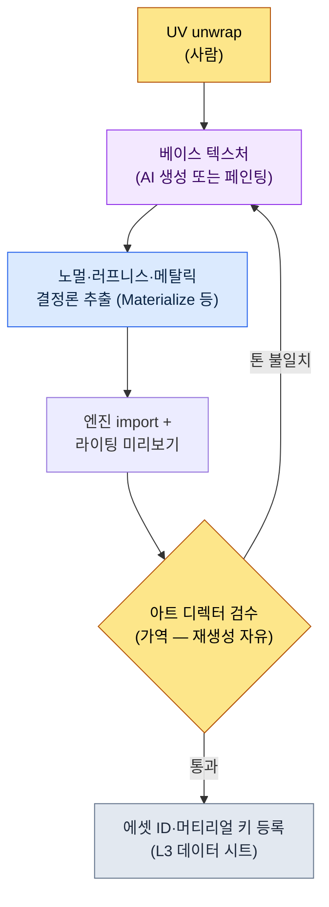

# 12.1 AI 아트 에셋 파이프라인 — 가역 단계에서 양산하고, 비가역 게이트 앞에서 멈춘다

> 1차 독자: 아트팀과 협업하는 게임 기획자·아트 디렉터 (중규모(10\~50인) 팀)
> 1인/취미 독자용 축소 버전: §12.1.8 「혼자라면 이만큼만」

AI로 뽑은 컨셉 아트 100장을 회의실 벽에 붙였던 날의 기억이 있다. 30초 만에 인쇄된 100장 중 아트 디렉터가 고른 건 3장이었고, 97장은 그 자리에서 버려졌다. 누군가는 그걸 "97% 낭비"라고 불렀다. 그런데 손으로 그렸다면 그 3장에 도달하기 위해 작가가 2주를 썼을 것이다. 무엇이 낭비인지가 뒤집혀 있었다.

이 장이 다루는 건 그 뒤집힘을 운영으로 만드는 방법이다. 핵심은 한 줄이다. **AI 아트는 가역 단계(컨셉·텍스처 탐색)에서는 마음껏 양산하되, 비가역 단계(최종 렌더·모션 캡처·빌드 반영) 앞에는 사람이 지키는 게이트를 둔다.** 버려도 되는 곳에서는 99장을 버리고, 되돌릴 수 없는 곳에서는 한 장도 그냥 통과시키지 않는다. 아트 도구의 사용법은 다른 책에 충분히 있으니, 이 장은 그 도구를 *기획자의 파이프라인에 안전하게 끼우는 자리*에만 집중한다.

---

## 12.1.1 아트 파이프라인에는 되돌릴 수 있는 선이 있다

아트 에셋이 컨셉에서 인게임까지 가는 길은 7단계다. 저자 프로젝트(이하 "프로젝트 A")의 캐릭터 에셋 라인을 그대로 옮기면 이렇다. 중요한 건 단계 수가 아니라 그 한가운데를 지나는 **가역/비가역 경계선**이다.



왼쪽 네 단계(컨셉\~텍스처)는 **가역**이다. 컨셉 100장을 뽑아 97장을 버려도 잃는 건 토큰 비용뿐이고, 텍스처를 다섯 번 다시 생성해도 파일을 덮어쓰면 끝이다. 그래서 이 구간은 AI 양산이 가장 큰 ROI(Return on Investment, 투자 대비 효과)를 내는 자리다. 양산 도구는 자체 호스팅하는 Stable Diffusion(SDXL)/ComfyUI가 주축이다. 이유는 IP 보호다 — 자산을 외부 폐쇄 서비스에 올리지 않고 로컬에서 돌리며, 캐릭터로 파인튜닝한 LoRA와 ControlNet으로 같은 인물의 일관성을 반복 생성마다 통제할 수 있다. 폐쇄형 도구(미드저니 등)는 초기 무드보드를 빠르게 깔 때만 제한적으로 쓰고, 일관성·반복 통제가 필요한 본 양산은 SD/ComfyUI로 가져온다.

오른쪽 세 단계(리깅 이후)는 **비가역**이다. 모션 캡처는 스튜디오·배우 일정이 묶이고, 최종 렌더가 빌드에 올라 라이브에 노출되면 유저 기억과 커뮤니티 반응이 따라붙는다. 한번 넘어가면 되돌리는 비용이 만드는 비용보다 크다. 그래서 경계선 위에 **사람이 지키는 게이트**가 선다. AI가 가역 구간에서 아무리 많이 양산해도, 비가역으로 넘어가는 에셋은 사람 검수를 통과한 것만이다.

이 한 장의 그림이 이 챕터의 골격이다. "AI를 아트에 얼마나 쓸까"라는 질문은 사실 "이 작업이 경계선 어느 쪽이냐"라는 질문이다.

---

## 12.1.2 [워크드 트랜스크립트] 컨셉 한 체를 양산에서 폐기·재요청까지

가역 구간의 첫 단계인 컨셉 양산을 한 사이클 끝까지 보여준다. 추상적으로 "AI가 컨셉을 뽑는다"고만 적으면 무엇이 진짜 나오고 무엇이 폐기되는지 알 수 없다. 아래는 프로젝트 A에서 학자 길드 시니어 NPC 컨셉을 양산한 세션을 충실히 재현한 것이다. 프롬프트는 그대로 복사해 쓸 수 있고, 출력은 실제 세션을 재구성했다.

### 1단계 — 입력: 기획 의도를 먼저 명시한다

여기서 가장 자주 틀리는 자리가 있다. 프롬프트를 "비주얼 묘사"로 시작하는 것이다. 회사 피드백 atom `image_prompt_design_intent_first`가 못 박는 원칙이 정반대다 — **이미지 프롬프트도 설계 의도가 먼저**다. 외형 형용사 나열이 아니라, 이 캐릭터가 게임에서 무슨 기능·서사를 짊어지는지를 앞에 둔다.

```yaml
# concept_brief_scholar_senior.yaml — 컨셉 양산 입력
asset_id: npc_scholar_senior_01
role: 학자 길드 시니어 — 봉인 약화를 처음 관측한 인물
function: 메인 퀘스트 발주 NPC (플레이어가 신뢰해야 하는 정보원)
narrative_seed:
  - 30년간 종탑에서 봉인 맥을 기록해 온 사람
  - 감정을 숫자 뒤에 숨김 (scholarly_strict 톤)
style_anchor: semi-realistic, painted, 동아시아 판타지   # L0 비전에서 고정
forbidden: anime 스타일 · 현대 의복 · 일반 판타지 마법사 로브
```

`function`과 `narrative_seed`가 외형보다 먼저다. "왜 이 캐릭터가 이렇게 생겨야 하는가"를 입력이 들고 있어야, 양산 결과에서 "왜 이게 더 나은가"를 판단할 수 있다.

### 2단계 — 프롬프트: 양산하되 형식과 금기를 강제한다

```
첨부한 concept_brief를 바탕으로 캐릭터 컨셉 방향 제안 6안을 생성하라.
이건 탐색용 양산이다 — 최종이 아니라 아트 디렉터가 고를 후보다.

규칙:
1) function과 narrative_seed를 시각으로 번역하라. 단순 미형 금지.
   (예: "감정을 숫자 뒤에 숨김" → 표정·소품·자세로 어떻게 드러나는가)
2) style_anchor를 벗어나지 마라. forbidden 항목은 절대 금지.
3) 6안은 서로 충분히 달라야 한다. 미세 변주 6장은 탐색 가치가 없다.
4) 각 안에 한 줄 의도 근거를 붙여라 (왜 이 방향이 function에 맞는가).
5) 네가 'style_anchor와 충돌할 수 있다'고 의심하는 안은 따로 표시하라.

출력 형식: (안 번호 | 핵심 비주얼 | 의도 근거 | 충돌의심). 그 외 설명 금지.
```

이 프롬프트에서 비주얼 묘사가 차지하는 분량은 거의 없다. 대부분이 출력 형식을 잠그고 금기를 못 박는 데 쓰였다. AI에게 자유를 주면 학습 데이터의 평균 — 일반 판타지 마법사 — 으로 회귀하기 때문이다. **의도 번역 의무, style_anchor 고정, 6안 다양성 강제, 그리고 "충돌하면 신고하라"는 탈출구**가 회귀를 막는 네 개의 빗장이다.

### 3단계 — Claude의 출력 (재구성, 발췌)

```
| 안 | 핵심 비주얼                          | 의도 근거                         | 충돌 |
|----|--------------------------------------|-----------------------------------|------|
| 1  | 황동 확대경 영구 장착, 잉크 얼룩 손가락 | 관측이 곧 정체성 — 도구가 신체화   |      |
| 2  | 표정 없는 노학자, 손에 계기판 두루마리 | 감정을 숫자 뒤에 숨김 = 무표정+기록물 |    |
| 3  | 종탑 배경, 등 뒤로 식어가는 봉인 맥 빛  | 직무 공간이 인물을 설명            |      |
| 4  | 화려한 별 자수 로브, 손에 마력 구체     | 위엄 강조                          | ★    |
| 5  | 한쪽 눈 의안, 평생 관측의 흔적          | 30년 직무의 신체 대가              |      |
| 6  | 젊고 단정한 학자, 미형 강조             | 호감도 우선                        | ★    |
```

출력에서 가장 가치 있는 건 표가 아니라 **★ 표시 두 줄**이다. 4안(화려한 마법사 로브, 마력 구체)과 6안(미형 우선)에 AI가 스스로 "style_anchor·forbidden과 충돌할 수 있다"고 신고했다. 5번 규칙의 탈출구가 없었다면 이 두 안은 다른 네 안과 똑같은 얼굴로 표에 섞여 들어왔을 것이다. 의심스러운 자리를 AI가 직접 손들어 표시하게 만드는 것 — 그게 자유로운 양산과 통제된 양산을 가른다.

### 4단계 — 검증과 거부 (사람의 자리)

이 출력을 그대로 받지 않는다. 아트 디렉터가 6안을 brief로 한 번 친다. 실제로 이 세션에서 판정이 이렇게 갈렸다.

- **4안 폐기.** AI가 신고한 대로다. "마력 구체를 든 별 자수 로브"는 `forbidden: 일반 판타지 마법사 로브` 정면 위반이다. 이 캐릭터는 마법을 쓰는 사람이 아니라 마력을 *관측·기록*하는 사람이다. function 오역.
- **6안 폐기.** 미형 우선은 `narrative_seed: 30년 직무의 신체 대가`와 어긋난다. 이 NPC의 설득력은 "오래 한 사람"의 마모에서 나온다. 젊고 깨끗한 얼굴은 서사를 깎는다.
- **1·5안 채택, 2·3안 보류.** 1안(확대경 신체화)과 5안(의안)은 "도구·직무가 인물을 만든다"는 의도에 정확히 붙었다.

여기서 폐기 2건은 손실이 아니다. 손으로 그렸다면 이 두 방향이 틀렸다는 걸 알기까지 며칠이 걸렸을 것을, 양산이 6안을 동시에 펼쳐 한 시간 안에 솎아 냈다.

### 5단계 — 재요청

```
1안(확대경 신체화)과 5안(의안)의 방향을 합쳐라.
- 황동 확대경 + 한쪽 의안을 한 인물에 통합
- 감정 억제(scholarly_strict): 표정은 무, 소품으로만 직무를 말함
- forbidden 재확인: 마법사 로브·마력 구체·미형 강조 모두 금지
이건 아트 디렉터가 수작업 정비로 넘길 '최종 후보 1안'을 만드는 단계다.
```

AI는 확대경과 의안을 한 노학자에게 통합한 단일 방향을 다시 답했고, 그 한 장이 컨셉 아티스트의 책상으로 넘어가 수작업으로 마무리됐다. **양산(6안) → 폐기(2안) → 수렴(1안) → 사람 마무리**의 한 사이클이 여기서 닫힌다. AI가 만든 건 최종 에셋이 아니라, 아트 디렉터가 고를 후보의 폭이었다.

이 한 바퀴가 이 책 전체의 Show 기준이다. AI가 무엇을 뱉고, 무엇이 폐기되고, 사람이 무엇을 마무리하는지를 한 번이라도 끝까지 보지 않으면, "AI로 컨셉을 양산했다"는 문장은 공허하다.

---

## 12.1.3 폐기율이 높은 건 탐색이 깊다는 신호다

위 세션에서 6안 중 2안이 폐기됐다. 컨셉 라인 전체로 보면 폐기는 훨씬 더 쌓인다. 회의실 벽에 붙인 100장에서 채택은 3장이었다.

이 비율을 정직하게 다뤄 둔다. 이건 도입 초기 컨셉 세션 몇 건을 직접 카운트한 방향값이지, 정밀한 모수 비율이 아니다(저자 추정, 미검증 — 캐릭터 성격·브리프 품질에 따라 크게 흔들린다). 그러므로 "정확히 몇 %"가 아니라 **"손작업 시기보다 폐기를 훨씬 자유롭게 하게 됐다"는 방향**으로 읽는 게 맞다.

중요한 건 폐기율 0%가 목표가 아니라는 점이다. 종이 한 장이 비싸면 한 장을 끝까지 다듬는다. 종이 100장이 30초에 인쇄되면 99장을 버려도 부담이 없고, 그만큼 탐색 폭이 넓어진다. **폐기율이 오르는 건 탐색의 깊이가 깊어진다는 신호**다. 폐기율 자체를 줄이려는 운영은 — 예컨대 "AI가 뽑은 건 웬만하면 쓰자"는 압력은 — 탐색의 가치를 같이 깎는다. §12.1.2에서 4·6안을 망설임 없이 버릴 수 있었던 건, 버리는 비용이 0이었기 때문이다.

---

## 12.1.4 텍스처 양산 — 가역 구간의 두 번째 자리

컨셉과 함께 가역 구간에서 ROI가 큰 또 한 자리가 텍스처다. 3D 모델에 입힐 재질을 생성하는 단계인데, 여기서도 AI가 들어가는 칸과 결정론이 맡는 칸이 명확히 갈린다.



AI가 들어가는 건 **베이스 텍스처** 한 칸뿐이다. 노멀·러프니스·메탈릭 같은 PBR 맵은 AI에게 매번 다르게 뽑게 두지 않고 결정론 추출 도구가 맡는다. 같은 베이스에서 같은 맵이 나와야 재질이 일관되기 때문이다. 이건 §6.2의 도시 생성기에서 보상 곡선을 AI에 안 맡기고 룰북이 잡던 것과 같은 분담이다 — **결정론으로 보장할 수 있는 건 코드가, 탐색이 필요한 건 AI가.**

베이스 텍스처조차 모든 에셋에 AI가 적합한 건 아니다. 캐릭터 얼굴처럼 미세한 디테일이 게임 정체성을 좌우하는 자리에는 여전히 사람 손이 우선이다. 그래서 검수 게이트가 "톤 불일치"를 잡으면 자동 폐기가 아니라 재생성으로 되돌린다. 여기까지가 전부 경계선 왼쪽 — 몇 번을 다시 돌려도 잃는 게 없는 가역 구간이다.

---

## 12.1.5 비가역 게이트 — 일관성 검증과 시각 회귀

경계선을 넘기 직전, 가역 구간에서 양산된 에셋이 게임 전체의 결과 어긋나지는 않는지 검사한다. 이건 사람 눈만으로는 새는 자리라 코드가 1차로 친다.

```python
# visual_regression.py — 에셋 교체 시 의도 외 변화 검출 (골격)
# 입력: 에셋 ID + 교체 전/후 동일 조건 렌더 캡처
# 출력: 변화 등급 (사람 검수 게이트로 alert)

def compare_renders(asset_id, before_png, after_png, threshold=(1.0, 5.0)):
    diff = pixel_diff(before_png, after_png)   # 0~100 정규화
    if diff > threshold[1]:
        return ("BLOCK", f"{asset_id}: 큰 변화 {diff:.1f}% — 검수 전 비가역 진입 금지")
    elif diff > threshold[0]:
        return ("WARN",  f"{asset_id}: 경미한 변화 {diff:.1f}% — 의도 확인 필요")
    else:
        return ("PASS",  f"{asset_id}: 변화 없음")
```

이 30줄이 "텍스처 한 장 갈았더니 다른 캐릭터 그림자가 깨졌다"는 사고를 비가역 진입 *전에* 잡는다. 중요한 설계는 `BLOCK`이 자동 폐기가 아니라 **검수 게이트로 alert만 올린다**는 점이다 — 의도된 변경(리디자인)까지 코드가 죽여 버리면 작가들이 한두 분기 안에 "끄자"고 한다. 의심 후보는 기계가 뽑되, 비가역으로 넘길지는 사람이 정한다.

검수가 잡는 또 하나는 **스타일 일관성**이다. AI 출력은 매번 미세하게 다르므로, 양산된 컨셉·텍스처가 게임의 결을 유지하는지 사람이 마지막으로 본다. 이 게이트를 통과한 것만 리깅·모션 캡처·최종 렌더라는 비가역 단계로 넘어간다. 한번 모션을 캡처하고 빌드에 올리면, 일관성 사고는 재작업·재녹음·재배포로만 고칠 수 있기 때문이다.

---

## 12.1.6 아트팀에게는 결정만 넘어간다 — md→html→sync

기획자가 AI로 컨셉·텍스처를 양산해도, 실제로 그림을 그리는 아트팀은 별도 조직이다. 여기서 협업의 핵심은 **아트팀이 기획팀의 도구·컨벤션을 배울 필요가 없게** 만드는 것이다. 프로젝트 A의 아트 가이드(`96_ArtGuide/`)는 이걸 자동화로 푼다.

아트 결정사항은 기획팀이 md로 쓰고, `_convert_md_to_html.py`가 html로 변환한 뒤, `_SyncToArtRepo.bat`가 별도 아트 리포지토리로 push한다. 아트팀은 그 리포에서 html만 본다 — md 컨벤션도, 기획팀 SVN도 몰라도 된다(파이프라인 도식은 §12.2.4).

그리고 이 결정 문서는 7개 도메인(`00_Common`·`01_Character`\~`07_Env`)으로 나뉘어 각자 자기 스타일 룰을 들고 통합 게이트에서 합쳐진다. 이게 다음 장(12.2)에서 다룰 ArtGuide 7영역인데, 핵심만 미리 말하면 이렇다 — **스타일 룰북을 한 칸이 아니라 7칸 서랍으로 나누면, AI 양산 프롬프트가 매번 작가 머릿속에서 새로 조립되지 않고 서랍에서 꺼내진다.** §12.1.2의 `style_anchor`·`forbidden`이 바로 그 서랍에서 나온 입력이다. 룰북이 분리돼 있어야 양산 결과가 일반 판타지 평균으로 회귀하지 않는다.

그렇다고 모든 게임이 7영역을 다 가져야 하는 건 아니다. 캐주얼 장르라면 캐릭터·환경 두 칸으로도 충분하다. 분리는 점진적으로, 인터페이스는 좁게.

---

## 12.1.7 수치와 위험을 정직하게 다루는 법

이 장의 수치는 세 종류뿐이다. (1) **방향·비율** — "100장 양산에 채택 3장"은 저자 경험 기반 방향값(미검증)이라, 절대값이 아니라 "가역 구간에서는 폐기 비용이 0에 수렴"이라는 방향으로 읽는다. (2) **측정값** — 시각 회귀 변화율(`diff %`), 일관성 사고 건수, BLOCK 처리 건수는 `visual_regression.py`가 숫자로 뱉으니 회의에서 "느낌" 대신 숫자로 말할 수 있다. 반면 "리텐션이 올랐다"는 아트 하나로 좌우되지 않으니 인과를 단정하지 않는다.

(3) **위험은 운영 비용 안에** 둔다. AI 아트의 세 위험 — 학습 데이터 저작권, 스타일 일관성 손상, 아티스트 일자리 — 은 ROI 계산 밖이 아니라 안이다. 저자 방침은 가역 구간에 AI 적극, 비가역으로 넘기는 최종 에셋은 수작업 정비이며, 빌드에 직접 들어가는 에셋의 AI 출력 비율은 0을 원칙으로 둔다. 다만 이건 한 정책일 뿐이다 — 라이선스가 명시된 모델만 쓰며 최종 에셋까지 AI를 활용하는 팀도 있다. 법무 정책은 회사마다 다르고, 이 책은 정답이 아니라 경계선 긋는 법을 제시한다.

세 위험 중 가장 자주 놓치는 건 셋째다. AI를 "아티스트를 대체하는 양산기"가 아니라 "탐색 폭을 넓혀 아티스트의 결정권을 키우는 보조"로 자리매김하지 않으면, 도구는 KPI상 성공해도 조직에서 거부된다. 이건 feedback atom `design_intent_vs_automation_boundary`(설계 의도 vs 자동화 경계)가 못 박은 자리이기도 하다.

---

## 12.1.8 흔한 실패

| 패턴 | 왜 실패하나 | 처방 |
|---|---|---|
| AI 컨셉을 최종 에셋으로 직접 빌드 투입 | 비가역 단계를 사람 검수 없이 통과 | 경계선 앞 게이트 (§12.1.1) |
| 프롬프트를 외형 묘사로 시작 | function 오역 — 미형 마법사로 회귀 | 설계 의도 먼저 (§12.1.2, `image_prompt_design_intent_first`) |
| 양산 6안이 미세 변주 | 탐색 가치 없음, 폐기할 게 없음 | 다양성 강제 (§12.1.2) |
| 폐기율을 줄이려 함 | 탐색 깊이를 같이 깎음 | 가역 구간 폐기는 신호로 본다 (§12.1.3) |
| 텍스처 PBR 맵까지 AI 생성 | 재질 일관성이 호출마다 흔들림 | 결정론 추출 분리 (§12.1.4) |
| 시각 회귀 없이 에셋 교체 | 의도 외 변화가 비가역으로 샘 | `visual_regression.py` 게이트 (§12.1.5) |

---

## 12.1.9 따라하기 — 오늘 할 수 있는 한 단계

> **혼자라면 이만큼만**: 아트팀도 데이터 시트도 없어도 됩니다. 본인 게임(또는 좋아하는 게임)의 NPC 한 명을 골라 §12.1.2의 `concept_brief` 형식으로 `function`과 `narrative_seed`를 *외형보다 먼저* 적고, 6안 양산 프롬프트를 그대로 붙여 한 번 돌려 보세요. 나온 6안 중 의도와 어긋나는 한 안을 골라 "이건 function 오역이다, 폐기하고 다시"라고 반박해 보면, 가역 구간의 폐기가 손실이 아니라 탐색이라는 게 몸으로 들어옵니다.

팀이라면 다음 한 단계로 시작하세요. 파이프라인에 **가역/비가역 경계선을 명시적으로 한 줄 긋습니다**(§12.1.1). 어느 단계까지가 "버려도 0"이고 어디부터가 "되돌리면 비싼"지 합의하고, 그 경계 위에 사람 검수 게이트를 둡니다. 경계가 그어지면 "AI를 어디까지 쓸까"라는 매번 처음부터 하던 싸움이 "이 작업은 경계 어느 쪽이냐"라는 한 번의 판정으로 바뀝니다.

setup → prompt → verify로 요약하면 — **setup**: 파이프라인에 가역/비가역 경계선과 검수 게이트를 정의합니다. **prompt**: §12.1.2 형식으로 설계 의도를 먼저 입력하고 6안을 양산하되 금기·다양성·신고를 강제합니다. **verify**: 가역 구간에서 의도 오역 1건을 직접 골라 폐기·재요청으로 한 사이클을 닫고, 비가역 진입 전 `visual_regression.py`로 의도 외 변화를 칩니다.

---

### 이 챕터의 핵심 메시지
- 가역 구간(컨셉·텍스처)에선 양산, 비가역 게이트 앞에선 사람 검수.
- 폐기율이 오르는 건 탐색이 깊어진다는 신호지 도구 실패가 아니다.
- 이미지 프롬프트도 외형이 아니라 설계 의도를 먼저 입력한다.

### 다음 챕터 미리보기
- 12.2 ArtGuide 7영역 — 스타일 룰북을 7칸 서랍으로 나눠 양산 일관성을 지킨다

---
