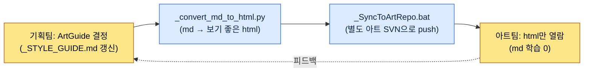

# 12.2 ArtGuide 7영역 (캐릭터·애니·몬스터·NPC·VFX·UI·환경)

목요일 통합 리뷰. 같은 화면에 신규 자산 일곱 개를 붙여 놓고 본 순간, 우리는 동시에 웃었다. 학자 캐릭터는 회색 톤의 진중한 실루엣인데, 그 옆에서 터지는 스킬 VFX가 형광 핑크였다. 둘 다 각자의 영역에서는 완벽한 결정이었다. 캐릭터 디렉터는 자기 `_STYLE_GUIDE.md`를 그대로 지켰고, VFX 아티스트도 "눈에 잘 띄게"라는 내 명세를 충실히 따랐다. 아무도 틀리지 않았는데 같은 화면에 놓으니 두 게임이 싸우고 있었다.

이 장면이 ArtGuide를 7영역으로 쪼개는 이유이자, 7영역을 다시 묶어야 하는 이유다. ArtGuide는 게임의 비주얼 헌법이다. 영역으로 나누면 분야별 디렉터가 자치를 가지면서 결정이 빨라지고, 통합 리뷰로 다시 묶지 않으면 위의 형광 핑크 같은 사고가 분기마다 쌓인다. 기획자가 이 균형의 어느 지점에 손을 대는가가 이 장의 전부다.

---

## 12.2.1 자산 한 장: 7영역의 실제 구조

저자가 디렉터로 일한 프로젝트 A(동양 판타지 톤의 모바일 우선 MMORPG)의 디자인 저장소에는 `96_ArtGuide/`라는 폴더가 있다. 번호 `96`은 저장소 정렬 규칙상 아트 가이드가 거의 마지막에 오도록 붙인 것이고, 그 아래가 일곱 도메인으로 갈라진다. 추상적인 "프로젝트의 아트 폴더"가 아니라, 아래가 그 폴더의 실제 하위 구조다.

<svg viewBox="0 0 760 360" xmlns="http://www.w3.org/2000/svg" font-family="sans-serif" font-size="13">
  <rect x="300" y="10" width="160" height="40" rx="6" fill="#2c3e50"/>
  <text x="380" y="35" fill="#fff" text-anchor="middle" font-size="14">96_ArtGuide/</text>
  <line x1="380" y1="50" x2="380" y2="70" stroke="#888" stroke-width="1.5"/>
  <line x1="70" y1="70" x2="690" y2="70" stroke="#888" stroke-width="1.5"/>
  <!-- 7 domain boxes -->
  <g>
    <rect x="20" y="70" width="100" height="70" rx="5" fill="#e8f0fe" stroke="#4285f4"/>
    <text x="70" y="92" text-anchor="middle" font-weight="bold">00_Common</text>
    <text x="70" y="112" text-anchor="middle" font-size="11">공통 규약</text>
    <text x="70" y="128" text-anchor="middle" font-size="11">팔레트·룰</text>
  </g>
  <g>
    <rect x="130" y="70" width="100" height="70" rx="5" fill="#fce8e6" stroke="#ea4335"/>
    <text x="180" y="92" text-anchor="middle" font-weight="bold">01_Character</text>
    <text x="180" y="112" text-anchor="middle" font-size="11">플레이어</text>
    <text x="180" y="128" text-anchor="middle" font-size="11">캐릭터</text>
  </g>
  <g>
    <rect x="240" y="70" width="100" height="70" rx="5" fill="#e6f4ea" stroke="#34a853"/>
    <text x="290" y="92" text-anchor="middle" font-weight="bold">02_Animation</text>
    <text x="290" y="112" text-anchor="middle" font-size="11">모든</text>
    <text x="290" y="128" text-anchor="middle" font-size="11">애니메이션</text>
  </g>
  <g>
    <rect x="350" y="70" width="100" height="70" rx="5" fill="#fef7e0" stroke="#fbbc04"/>
    <text x="400" y="92" text-anchor="middle" font-weight="bold">03_Monster</text>
    <text x="400" y="112" text-anchor="middle" font-size="11">적 NPC</text>
    <text x="400" y="128" text-anchor="middle" font-size="11">비주얼</text>
  </g>
  <g>
    <rect x="460" y="70" width="100" height="70" rx="5" fill="#e8f0fe" stroke="#4285f4"/>
    <text x="510" y="92" text-anchor="middle" font-weight="bold">04_NPC</text>
    <text x="510" y="112" text-anchor="middle" font-size="11">우호 NPC</text>
    <text x="510" y="128" text-anchor="middle" font-size="11">관계·voice</text>
  </g>
  <g>
    <rect x="570" y="70" width="100" height="70" rx="5" fill="#fce8e6" stroke="#ea4335"/>
    <text x="620" y="92" text-anchor="middle" font-weight="bold">05_VFX</text>
    <text x="620" y="112" text-anchor="middle" font-size="11">시각 효과</text>
    <text x="620" y="128" text-anchor="middle" font-size="11">스킬·연출</text>
  </g>
  <g>
    <rect x="680" y="70" width="70" height="70" rx="5" fill="#e6f4ea" stroke="#34a853"/>
    <text x="715" y="92" text-anchor="middle" font-weight="bold" font-size="11">06_UI</text>
    <text x="715" y="112" text-anchor="middle" font-size="10">화면·HUD</text>
    <text x="715" y="128" text-anchor="middle" font-size="10">(9.3)</text>
  </g>
  <!-- 07 on second row -->
  <line x1="380" y1="140" x2="380" y2="170" stroke="#888" stroke-width="1"/>
  <g>
    <rect x="300" y="170" width="160" height="60" rx="5" fill="#fef7e0" stroke="#fbbc04"/>
    <text x="380" y="195" text-anchor="middle" font-weight="bold">07_Environment</text>
    <text x="380" y="216" text-anchor="middle" font-size="11">배경·소품·랜드마크</text>
  </g>
  <!-- footer note -->
  <text x="380" y="280" text-anchor="middle" font-size="12" fill="#555">각 도메인 = 디렉터/시니어 1인 자치 + 도메인별 _STYLE_GUIDE.md(헌법)</text>
  <text x="380" y="305" text-anchor="middle" font-size="12" fill="#555">00_Common = 일곱 도메인 위에 걸리는 공통 상위 규약 (색·재질·시대 톤)</text>
</svg>

도식의 핵심은 두 가지다. 첫째, 일곱 도메인이 나란히 평등하게 자치를 가진다. 한 층에 일곱 개의 작업실이 늘어선 사무실을 떠올리면 된다. 각 방의 책임자가 그 방의 결정권을 쥐되, 복도에서 마주칠 때 같은 게임이라는 감각은 잃지 않아야 한다. 둘째, 그 위에 `00_Common`이 얹혀 있다. 일곱 방 모두가 따라야 할 공통 규약, 즉 전체 색 팔레트와 재질 기준과 시대 톤이 여기 산다. `06_UI`는 9.1.3에서 다룬 UI 협업 표준과 같은 도메인이라 이 장에서는 경계만 그어 두고 넘어간다.

## 12.2.2 영역마다 기획자의 손이 닿는 깊이가 다르다

일곱 도메인에 기획자가 같은 강도로 개입하지는 않는다. 기획자는 의도와 서사를 결정하고 아트는 시각을 결정한다는 원칙은 모든 도메인에 동일하지만, 의도가 시각을 어디까지 끌고 가느냐는 도메인마다 다르다.

| 영역 | 기획자 관여 | 기획자가 넘기지 말아야 할 선 |
|---|---|---|
| 01_Character | 강함 | 컨셉·성격·세력·역할까지. 얼굴 비례·붓터치는 아니다 |
| 02_Animation | 보통 | 스킬 모션의 "종류·반응"까지. 프레임 타이밍은 아니다 |
| 03_Monster | 강함 | 적 컨셉·세력·생태까지. 비늘 패턴 디테일은 아니다 |
| 04_NPC | 강함 | 역할·관계·voice_profile까지. 의상 자수는 아니다 |
| 05_VFX | 약함 | "느린 발사, 큰 폭발, 보라색"까지. 파티클 수는 아니다 |
| 06_UI | 강함 | 정보 구조·우선순위까지(9.3). 픽셀 여백은 아니다 |
| 07_Environment | 보통 | 분위기·랜드마크 의도까지. 나무 폴리곤은 아니다 |

오른쪽 칸이 이 표의 진짜 내용이다. 관여가 "강함"이라고 적힌 도메인에서도 기획자가 넘으면 안 되는 선이 있다. 캐릭터 컨셉은 강하게 끌고 가되 얼굴 비례까지 손대면 그 순간 캐릭터 디렉터의 자치가 무너진다. 그리고 강함과 약함의 경계 자체가 장르에 따라 흔들린다. 호러 게임이라면 VFX가 공포의 핵심이라 기획자 관여가 강해지고, 캐주얼 퍼즐이라면 캐릭터 관여가 오히려 약해진다. 위 표는 프로젝트 A의 장르 기준이지 보편 법칙이 아니다.

## 12.2.3 도메인의 헌법: _STYLE_GUIDE.md

각 도메인은 표준 문서 묶음으로 운영한다. `01_Character/` 도메인의 실제 파일 구성을 보자.

```
01_Character/
├── _STYLE_GUIDE.md          — 캐릭터 전체 스타일 (헌법)
├── _COLOR_PALETTE.md        — 색상·재질 가이드
├── _PROPORTION_REFERENCE.md — 비례·실루엣 룰
├── _DO_AND_DONT.md          — 허용·금지
├── individual/              — 캐릭터별 시트
│   ├── K_001_director.md
│   ├── K_007_scholar.md
│   └── ...
└── _REVIEW_LOG.md           — 검수 이력
```

`_STYLE_GUIDE.md`가 도메인의 헌법이다. 개별 캐릭터 시트(`individual/`)는 모두 이 헌법 위에서 변주된다. 헌법이 흔들리면 그 아래 모든 캐릭터가 흔들리므로, 이 파일 한 장이 도메인에서 가장 자주 검토되는 문서다. 골격은 다음과 같다.

```markdown
---
title: 01_Character Style Guide
layer: L1
---

## 1. 톤
- 19세기 산업 혁명 이전, 한국 판타지 분위기
- 사실적 비례 (7~7.5등신, 데포르메 금지)

## 2. 색상
- 채도: 보통 (실사 60~70% 수준)
- 메인 팔레트: 00_Common 상속
- 캐릭터별 액센트 색 (1~2개)

## 3. 의상 룰
- 세력별 의상 구분 (학자 → 회색 + 보라 액센트)
- 직업·계급에 따른 의상 디테일

## 4. DO
- 5m 거리에서 실루엣만으로 누군지 식별 가능
- 세력 정체성을 시각으로 표현

## 5. DON'T
- 일본 애니 스타일
- 비-시대극 요소 (현대 의상·소품)
- 채도 과다
```

여기서 한 줄이 중요하다. `## 2. 색상`의 "메인 팔레트: 00_Common 상속". 캐릭터 도메인이 색을 독자적으로 정하지 않고 상위 공통 규약을 물려받는다는 명시다. 이 한 줄이 도입부의 형광 핑크 사고를 구조적으로 막는 장치다. 모든 도메인의 `_STYLE_GUIDE.md`가 색만큼은 `00_Common`을 상속하면, 적어도 색 충돌은 헌법 단계에서 차단된다.

## 12.2.4 비-기획자를 어떻게 협업에 끌어들이는가

여기서 프로젝트 A가 실제로 부딪힌 가장 현실적인 문제가 나온다. 아트팀은 마크다운을 읽지 않는다. 정확히 말하면, 읽으라고 강요하면 안 된다. 아티스트에게 git diff와 frontmatter와 마크다운 헤더 위계를 학습시키는 비용은, 그 학습으로 얻는 협업 효율보다 거의 항상 크다. 기획팀의 도구를 아트팀에 그대로 들이미는 순간 협업은 오히려 느려진다.

그래서 프로젝트 A의 파이프라인은 "기획팀은 md로 결정하고, 아트팀은 html만 본다"는 한 줄로 정리된다.



핵심은 두 개의 자동화 자산이다. `_convert_md_to_html.py`는 도메인의 마크다운 가이드를 아티스트가 브라우저로 편하게 읽을 수 있는 html로 변환한다. 색 팔레트는 실제 색 칩으로, DO/DON'T는 시각 대비로 렌더된다. `_SyncToArtRepo.bat`는 그 html을 기획 저장소가 아닌 **별도의 아트 전용 저장소**로 밀어 넣는다. 저장소를 분리하는 이유는 단순하다. 아티스트가 자기 저장소만 받으면 기획팀의 내부 md 히스토리, 작업 중인 초안, 다른 도메인의 결정 과정에 노출되지 않는다. 아티스트가 보는 것은 확정된 결정의 읽기 좋은 결과물뿐이다. 마크다운 학습 비용이 0으로 떨어진다.

이 구조에서 기획자가 얻는 책임 하나가 추가된다. md를 갱신하면 반드시 변환·동기화 단계를 돌려야 한다. 갱신만 하고 동기화를 빠뜨리면, 아트팀은 어제 결정으로 오늘 그림을 그린다. 결정과 전달 사이의 이 한 칸이 비어 있으면 자치도 통합도 의미가 없다.

## 12.2.5 이미지 프롬프트도 결정이다: 설계 의도 우선

비-기획자 협업의 연장선에서, 컨셉 단계에 생성 AI를 쓸 때 기획자가 지켜야 하는 원칙이 하나 있다. 프로젝트 A의 내부 규약 이름으로는 `image_prompt_design_intent_first`, 풀어 쓰면 "이미지 프롬프트도 설계 의도를 먼저 적는다"다.

생성 이미지로 컨셉을 탐색할 때 흔한 실패는 프롬프트가 결과물의 외양 묘사로만 채워지는 것이다. "회색 도포를 입은 50대 동양 남성, 차분한 표정, 실사풍"처럼. 이 프롬프트는 그림은 뽑지만 **왜 그래야 하는지**를 담지 못해서, 아트 디렉터가 그 그림을 변주할 때 길을 잃는다. 설계 의도 우선 원칙은 프롬프트 앞에 의도 블록을 강제한다.

```
[설계 의도]
- 역할: 학자 세력의 정신적 지주, 플레이어의 첫 멘토
- 읽혀야 할 것: 5m 거리에서도 "지식인·비전투" 실루엣
- 세력 신호: 학자 = 회색 + 보라 액센트 (00_Common 상속)
- 금지: 무기 휴대, 화려한 갑주 (전투 직군으로 오독됨)

[프롬프트]
회색 도포의 50대 동양 남성 학자, 보라색 옷고름 액센트,
무기 없음, 차분하고 학구적 표정, 19세기 이전 한국 판타지,
실사 비례 7.5등신, 채도 보통, ...
```

의도 블록이 프롬프트 위에 있으면 그 그림은 결정의 일부가 된다. 다음 사람이 같은 캐릭터의 다른 포즈를 뽑을 때, 외양을 베끼는 게 아니라 의도를 다시 충족시킨다. 이미지가 마음에 안 들어 폐기할 때도 "의도 중 무엇이 안 읽혔는가"로 토론할 수 있다. 외양만 적힌 프롬프트는 "내 취향엔 이게 낫다"로 끝나 검증할 근거를 남기지 않지만, 의도가 앞선 프롬프트는 무엇이 충족됐고 무엇이 빠졌는지 따져 볼 기록을 남긴다.

여기서 도구 선택이 의도 우선 원칙과 맞물린다. "같은 캐릭터의 다른 포즈"를 의도대로 반복 생성하려면 프롬프트만으로는 부족하다. 프로젝트 A의 도구 분담은 §12.1.1과 같다 — 본 양산은 자체 호스팅 SD(SDXL)/ComfyUI에 캐릭터 LoRA(얼굴·의상 고정)와 ControlNet(포즈·실루엣)을 걸어, 의도 블록이 요구하는 "5m 거리 식별성"을 포즈가 바뀌어도 유지하고 IP도 함께 지킨다. 폐쇄형 도구(미드저니 등)는 초기 무드보드 정도에만 쓴다.

## 12.2.6 워크드 트랜스크립트: 캐릭터 컨셉 명세 한 사이클

도메인 자치와 기획자 관여가 실제로 어떻게 굴러가는지, `01_Character`의 한 사이클을 처음부터 끝까지 따라가 본다. 다음은 저자가 학자 캐릭터(`K_007_scholar`)의 컨셉 명세 초안을 AI에게 맡긴 실제 작업의 재구성이다. 요약하지 않고, 어색했던 출력과 저자의 거부까지 그대로 싣는다.

**① 저자가 AI에 던진 프롬프트 (전문)**

```
너는 우리 프로젝트의 캐릭터 컨셉 보조 작가다. 아래 규약을 지켜 K_007_scholar의
컨셉 명세서 초안을 마크다운으로 써라.

규약:
- 01_Character/_STYLE_GUIDE.md 준수: 19세기 이전 한국 판타지, 7~7.5등신,
  채도 보통, 일본 애니 스타일 금지.
- 색은 00_Common 팔레트를 상속하고, 학자 세력 액센트는 보라.
- voice_profile 5항목(어조/말버릇/금지어/감정 기본값/관계 호칭)을 반드시 포함.
- 컨셉·성격·세력·역할까지만 결정하고, 얼굴 비례나 붓터치 같은 시각 디테일은
  비워 둬라(캐릭터 디렉터의 자치 영역).
- 출력은 individual/ 캐릭터 시트 형식.
```

**② Claude의 날것 출력 (실패 포함, 손대지 않음)**

```markdown
# K_007 학자 (Scholar)

## 역할
학자 세력의 정신적 지주이자 플레이어의 첫 멘토.

## 외형
- 키 180cm, 7.5등신, 마른 체형
- 흰 수염, 깊은 주름, 형형한 눈빛
- 회색 도포에 보라 옷고름
- ★ 추천: 살짝 빛나는 황금빛 눈동자로 신비감 강조

## 성격
박학하나 오만하지 않고, 제자에게 엄격하되 따뜻하다.

## voice_profile
- 어조: 느리고 차분함
- 말버릇: "...그러하네", 문장 끝을 길게
- 감정 기본값: 평정
- 관계 호칭: 플레이어를 "젊은 벗"이라 부름
```

**③ 저자의 검증·거부 (어디가 왜 틀렸는가)**

출력에는 두 군데 결함이 있었다. 첫째, `## 외형`의 "★ 추천: 황금빛 눈동자". 이건 명백한 월권이다. 눈동자 색 같은 시각 디테일은 캐릭터 디렉터의 자치 영역인데 AI가 컨셉 단계에서 못을 박아 버렸다. 그대로 두면 디렉터가 "기획에서 정했다"며 자기 판단을 접거나, 무시하고 충돌하거나 둘 중 하나다. 둘째, `voice_profile`이 5항목이 아니라 4항목이다. "금지어"가 통째로 빠졌다. 멘토 캐릭터가 어떤 말을 절대 하지 않는가는 성격만큼 중요한데 AI가 누락했다.

**④ 재요청 (정확히 두 군데만 교정)**

```
두 가지만 고쳐라.
1. ## 외형에서 "황금빛 눈동자" 추천 줄을 삭제하라. 눈동자 색은 캐릭터
   디렉터의 결정 영역이다. 외형 항목은 실루엣·체형·세력색까지만 적고
   세부 색·재질은 "(디렉터 결정)"으로 비워 둬라.
2. voice_profile에 빠진 "금지어" 항목을 추가하라. 학자 멘토로서
   하지 않을 말(욕설, 천박한 농담, 현대어)을 명시하라.
```

이 사이클의 교훈은 도구가 아니라 경계다. AI는 빠르게 그럴듯한 초안을 줬지만, 기획자가 넘지 말아야 할 선(시각 디테일)을 대신 넘어 줬고 반드시 넣어야 할 것(금지어)을 빠뜨렸다. 검증의 기준은 "잘 썼는가"가 아니라 "도메인 자치의 경계를 지켰는가"였다. AI를 캐릭터 컨셉에 쓰는 한, 이 경계 검수는 사람이 끝까지 쥐고 있어야 한다.

## 12.2.7 영역 간 일관성을 어떻게 다시 묶는가

일곱 도메인이 자치를 가지면 도입부의 형광 핑크처럼 도메인 사이에 불일치가 생긴다. 자주 나오는 유형은 정해져 있다.

| 불일치 유형 | 실제 예 |
|---|---|
| 캐릭터-환경 톤 차이 | 캐릭터는 진중한데 배경이 화려해 따로 논다 |
| 캐릭터-VFX 색상 충돌 | 캐릭터 회색 톤, 스킬 VFX는 형광 핑크 |
| NPC-Monster 경계 모호 | 우호 NPC인데 몬스터처럼 위협적으로 읽힌다 |
| UI-캐릭터 색감 불일치 | UI는 차가운 톤, 캐릭터는 따뜻한 톤 |

이 불일치를 잡는 장치가 주 1회 통합 리뷰다. 절차는 단순하다.

```
주 1회 ArtGuide 통합 리뷰 (목요일)
─────────────────────────────────
1. 그 주 신규 자산 5~10개 랜덤 추출
2. 같은 화면에 함께 배치 (인게임 시뮬레이션)
3. 일곱 도메인 디렉터 + 게임 디렉터가 동시 검수
4. 불일치 발견 → 해당 도메인 _STYLE_GUIDE 보강
   또는 00_Common 상위 규약 보강
```

핵심은 3번과 4번이다. 검수를 도메인 디렉터들이 **동시에** 한다는 것, 그리고 발견된 불일치를 개별 자산을 고쳐서 끝내는 게 아니라 가이드 문서로 환원한다는 것. 도입부의 형광 핑크 사고는 그 자산 하나를 회색으로 바꾸고 끝내면 다음 주에 똑같이 재발한다. 대신 `00_Common`에 "스킬 VFX 채도는 캐릭터 팔레트 채도 +20% 이내"라는 규약을 추가하면, 같은 사고가 구조적으로 닫힌다. 월 4회 누적되는 이 사이클이 자치가 사일로로 굳는 것을 막는 유일한 가드레일이다.

## 12.2.8 자치는 책임의 분산이 아니라 결정 시간의 재분배다

7영역 분리가 가져온 변화를 프로젝트 A 운영 경험에서 정리하면 다음과 같다. 아래 수치 중 사이클 일수와 시간은 저자의 운영 경험에 기반한 **저자 추정(미검증)**이며, 정확한 측정값이 아니라 분리 전후의 방향과 대략의 비율로만 읽어야 한다.

| 항목 | 분리 전 | 분리 후 | 성격 |
|---|---|---|---|
| 아트 결정 사이클 | 1~2주 | 3~5일 | 저자 추정(미검증) |
| 영역 간 일관성 사고 | 분기당 여러 건 | 현저히 감소 | 방향만 |
| 게임 디렉터 아트 검수 시간 | 주 다수 시간 | 크게 감소 | 방향만 |
| 신규 영역 디렉터 온보딩 | 수개월 | 약 1개월 | 저자 추정(미검증) |
| 아트 자산 폐기 비율 | 높음 | 감소 | 방향만 |

표를 정직하게 읽으면, 단언할 수 있는 것은 모든 항목이 같은 방향으로 움직였다는 사실뿐이다. 가장 분명한 효과는 게임 디렉터의 시간이 회수됐다는 것이다. 자치 없는 구조에서는 모든 아트 결정이 게임 디렉터 한 사람의 책상을 거쳐야 했다. 한 책상에 종이가 쌓이는 구조다. 7영역으로 나누자 종이가 일곱 책상에 분산됐다. 종이의 총량은 같지만 어느 책상도 무너지지 않는다.

여기서 가장 흔한 오해를 끊어야 한다. 자치는 책임의 분산이 아니다. 시간의 재분배다. 도메인 디렉터가 자기 영역을 결정한다고 해서 게임 전체의 시각 책임이 일곱 조각으로 흩어지는 게 아니다. 통합 리뷰에서 그 일곱이 다시 한 자리에 모이고, 최종 시각 책임은 여전히 한 사람에게 수렴한다. 자치를 책임 회피의 빌미로 삼는 순간 — "그건 내 도메인 밖이라"가 입버릇이 되는 순간 — 도입부의 형광 핑크는 누구의 문제도 아닌 채로 빌드에 들어간다.

그리고 한 가지 단서. 7영역 자치는 규모의 함수다. 소규모(~10인) 팀에서는 오히려 오버 엔지니어링이다. 디렉터 한 명이 모자 다섯 개를 쓰는 단계라면 도메인 가이드 일곱 장이 아니라 통합 가이드 한 장으로 충분하다. 자치는 책상이 부족해질 때 비로소 값을 한다.

## 12.2.9 흔한 실패와 처방

| 패턴 | 처방 |
|---|---|
| 영역 분리 없이 모든 결정을 게임 디렉터에 집중 | 7영역 자치 도입 (단, 중규모(10~50인)부터) |
| 도메인 _STYLE_GUIDE 부재 | 각 도메인 헌법 작성을 게이트로 강제 |
| 영역 간 통합 검증 없음 | 주 1회 통합 리뷰 + 가이드 환원 |
| 기획자가 시각 디테일까지 결정 | 의도·서사 명세까지만, 디테일은 디렉터 |
| 자치가 사일로로 굳음 | 통합 리뷰에서 00_Common으로 환원 |
| md 갱신 후 동기화 누락 | `_convert_md_to_html.py` → `_SyncToArtRepo.bat` 습관화 |
| 이미지 프롬프트가 외양 묘사뿐 | 설계 의도 블록 선행(`image_prompt_design_intent_first`) |

---

### 이 챕터의 핵심 메시지
- 7영역 자치와 주 1회 통합 리뷰의 균형이 ArtGuide의 본체다.
- 기획자는 의도·서사까지, 시각 디테일은 도메인 디렉터의 자치 영역이다.
- 자치는 책임의 분산이 아니라 결정 시간의 재분배다.

### 다음 챕터 미리보기
- 12.3 기획서 → 컨셉 → 인게임 자산 흐름

---

## 따라하기

**setup** — 가장 손이 많이 가는 한 도메인(보통 `01_Character`)부터 시작하세요. 도메인 폴더에 `_STYLE_GUIDE.md`(헌법), `_COLOR_PALETTE.md`, `_DO_AND_DONT.md`, `individual/`을 만듭니다. 색 항목에는 반드시 "메인 팔레트: 00_Common 상속" 한 줄을 입력해 둡니다.

**prompt** — 개별 자산 시트를 AI로 초안 잡을 때, 프롬프트에 (1) 해당 도메인 `_STYLE_GUIDE.md` 규약, (2) "컨셉·서사까지만 결정하고 시각 디테일은 '(디렉터 결정)'으로 비워 두라", (3) 빠지면 안 되는 필수 항목(예: voice_profile 5항목)을 명시합니다. 이미지 프롬프트라면 외양 묘사 위에 `[설계 의도]` 블록을 먼저 적습니다.

**verify** — 출력을 받으면 "잘 썼는가"가 아니라 "도메인 자치의 경계를 지켰는가"로 검수합니다. ① 기획자가 넘지 말아야 할 시각 디테일을 AI가 대신 결정하지 않았는가, ② 필수 항목이 누락되지 않았는가, 두 가지만 봅니다. 어긋난 곳만 콕 집어 재요청합니다. 매주 목요일, 신규 자산 5~10개를 한 화면에 모아 도메인 디렉터들과 동시에 봅니다. 불일치는 자산이 아니라 가이드 문서(`00_Common` 또는 도메인 `_STYLE_GUIDE`)로 환원합니다.

**1인 축소판** — 혼자 만드는 게임이라면 일곱 도메인을 만들지 마세요. `00_Common` 한 장에 색 팔레트·시대 톤·DO/DON'T를 모아 두고, 거기에 캐릭터·환경·VFX 섹션을 헤더로만 나눕니다. AI에 자산을 맡길 때 그 한 장을 통째로 프롬프트에 붙이고, "이 가이드를 어긴 곳이 있으면 표시하라"고 함께 시킵니다. 통합 리뷰는 혼자 일주일에 한 번, 그 주 만든 것들을 한 화면에 놓고 보는 5분 의식으로 충분합니다. 자치를 나눌 사람이 없을 뿐, 헌법 한 장과 주 1회 정렬이라는 골격은 1인 팀에서도 똑같이 값을 합니다.
