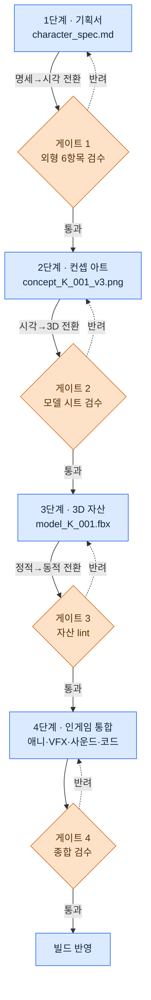
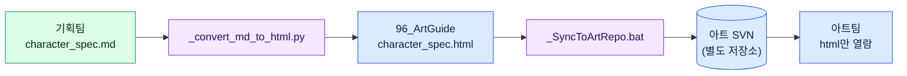

# 12.3 기획서 → 컨셉 → 인게임 자산 흐름

스프린트 막바지, 컨셉 아티스트가 팀 메신저로 캐릭터 시안 한 장을 던졌다. "이거 학자 길드 시니어 맞죠?" 화면 속 인물은 30대 남성에 가죽 갑옷을 입고 있었다. 기획서에는 40대 여성, 회색 학자 가운이라고 적혀 있었다. 어디서 어긋났는지 추적해 보니, 컨셉 아티스트가 받은 자료는 두 달 전 버전의 기획서였고, 그동안 외형 가이드가 두 번 바뀌었다. 바뀐 사실을 아는 사람은 기획자 본인뿐이었다.

이 사고는 기술 문제가 아니다. 흐름 문제다. 기획서 한 페이지가 게임 안의 자산이 되기까지 평균 4\~8주, 그 사이에 캐릭터 한 명의 정보는 기획자 머릿속에서 컨셉 아티스트로, 모델러로, 애니메이터로 손에서 손으로 넘어간다. 넘기는 순간마다 양식이 어긋날 수 있고, 어긋난 채로 받아주면 받은 사람은 추측으로 빈칸을 채운다. 추측은 두 달 뒤 팀 메신저 한 줄로 돌아온다.

이 장은 그 손에서 손으로의 흐름을 한 사람의 기억이 아니라 시스템 위에 올려놓는 방법을 다룬다.

---

## 12.3.1 손에서 손으로 — 4단계와 전환점

프로젝트 A에서 캐릭터 자산이 흘러가는 길은 네 단계다. 중요한 것은 단계 자체가 아니라 단계와 단계 사이의 전환점이다. 사고는 단계 안에서가 아니라, 한 단계에서 다음 단계로 자산을 넘기는 그 순간에 터진다.

이 흐름을 글로 설명하는 대신 도식으로 그려야 하는데, 24부에 걸쳐 손으로 박스를 그리는 대신 Claude에게 mermaid 코드를 받아 렌더해 왔다. 이 장은 바로 그 기법을 적용해 그린 결과를 본문에 싣는다. 자기 기법을 자기 본문에서 증명하는 셈이다. 아래가 Claude에게 "spec→asset 4단계 흐름을 전환점 게이트가 보이게 mermaid로"라고 요청해 받은 출력을 그대로 렌더한 것이다.



세 개의 전환점(명세→시각, 시각→3D, 정적→동적)마다 게이트가 서 있다. 게이트는 결재 서류를 다음 부서로 넘기기 전에 양식을 검사하는 창구다. 양식이 맞지 않으면 반려(점선)되어 이전 단계로 돌아간다. 양식이 맞지 않는 서류를 받아주면, 다음 부서는 빈칸을 추측으로 채운다. 메신저 사고는 게이트 1이 없을 때 일어난다.

mermaid의 장점이 이 그림에서 드러난다. 게이트를 하나 더 추가하거나 단계 순서를 바꿔야 할 때, 박스를 다시 그리는 것이 아니라 텍스트 한 줄을 고치면 된다. 도식이 텍스트라서 버전 관리 대상이 되고, 기획서 옆에 같이 커밋된다.

---

## 12.3.2 1단계 — 기획서가 모든 입력의 뿌리다

흐름의 출발점은 한 장의 마크다운 명세서다. 이 문서가 뒤따르는 세 단계 전부의 입력이다. 여기 빈칸이 있으면 그 빈칸은 사라지는 게 아니라 다음 단계로 떠넘겨져 추측이 된다.

아래는 실제로 작성하는 `character_spec` 양식이다. `related_atoms` 필드가 이 명세를 JIT atom 시스템(11부 참조)에 연결한다.

```markdown
---
title: 학자 길드 시니어 K_001 캐릭터 명세
type: character_spec
layer: L2
related_atoms: [character_K_001, voice_profile_K_001]
status: draft
---

## 1. 정체성
- 이름: (TBD)
- 역할: 학자 길드 시니어, 메인 NPC, 동료 가능
- 세력: scholar_guild
- 성격: 학자_엄격, 권위적이지만 공정

## 2. 외형 가이드
- 연령: 40대
- 성별: 여성
- 체격: 평균보다 약간 큰 (170cm 상당)
- 의상: 회색 + 보라 액센트, 학자 가운, 안경

## 3. 표정·자세
- 평소: 침착, 입꼬리 내림
- 분노 시: 침묵 + 시선 차단
- 슬픔: 화제 전환, 표정 변화 미세

## 4. 게임 내 역할
- 메인 퀘스트 chapter 1·5·12 등장
- 사이드 퀘스트 8건 발주
- 동료 합류 chapter 7

## 5. 음성·대사
- voice_profile: scholar_K_001
- 대표 대사 3개:
  - "그건 기록이 없는 이야기인가요?"
  - "감정으로 결정하지 마세요. 데이터가 먼저입니다."
  - "...당신의 선택이군요. 알겠습니다."

## 6. 참고 자료
- 실제 학자 5명 이미지 (legal 검토 완료)
- refgame의 캐릭터 톤 참고
```

외형 6항목(2번 섹션의 연령·성별·체격·의상, 그리고 3번 표정·자세)이 게이트 1의 체크리스트가 된다. 메신저 사고의 원인이었던 "40대 여성 / 회색 가운" 두 줄이 바로 이 섹션이다. 게이트 1이 작동했다면, 컨셉 아티스트가 받은 자료의 외형 6항목이 현재 기획서와 일치하는지 넘기기 전에 검사됐을 것이다.

### 워크드 트랜스크립트 — 기획서 빈칸을 메우는 한 번의 왕복

명세서를 0에서 손으로 다 채우는 대신, 정체성과 역할만 정해 두고 외형·표정의 초안을 Claude에게 받는다. 아래는 실제 한 번의 왕복 전문이다. 요약하지 않았다.

**프롬프트(전문):**

> 아래 캐릭터의 정체성·역할은 확정이다. 이걸 바탕으로 character_spec의 "2. 외형 가이드"와 "3. 표정·자세" 초안을 채워라.
> - 역할: 학자 길드 시니어, 메인 NPC, 동료 가능
> - 성격: 학자_엄격, 권위적이지만 공정
> - 세력: scholar_guild
> 제약: refgame 톤(동양 판타지, 채도 낮음). 외형은 실루엣만으로 다른 메인 NPC와 구분돼야 한다. 표정은 분노·슬픔을 직접 드러내지 않는 절제형으로.

**Claude 날것 출력(그대로, 다듬지 않음):**

> ## 2. 외형 가이드
> - 연령: 40대 후반
> - 성별: 여성
> - 체격: 마른 편, 165cm 전후 (※ "권위적"을 키로 표현할지 자세로 표현할지 확정 필요 — 저는 자세 쪽을 추천합니다)
> - 의상: 짙은 남색 학자복, 은사 자수 (※ 세력 색상 팔레트를 모릅니다. scholar_guild 대표색이 따로 있나요?)
>
> ## 3. 표정·자세
> - 평소: 턱을 약간 든 정자세, 시선은 상대보다 약간 위
> - 분노 시: 말수가 줄고 어조만 차가워짐
> - 슬픔: 창밖을 보는 동작으로 대체, 얼굴은 거의 변화 없음
>
> 한 가지 더: "동료 가능"이라면 전투 중 표정도 필요할 텐데, 그건 이 명세 범위 밖인가요?

**사람 검증·거부:**

이 출력은 절반만 채택했다. 표정·자세 섹션은 거의 그대로 받았다 — 절제형이라는 제약을 정확히 잡았고, "창밖을 보는 동작으로 슬픔을 대체"는 기획서에 없던 좋은 디테일이다. 외형은 거부했다. 두 가지 이유다. 첫째, 체격을 "마른 편, 165cm"로 잡았는데 확정 기획서는 "평균보다 약간 큰, 170cm"였다. Claude는 정체성·역할만 받았으므로 체격을 알 수 없었고, 추측한 것이다 — 정확히 게이트가 막아야 할 추측이다. 둘째, 의상 남색은 refgame 톤은 맞지만 우리 게임의 scholar_guild 대표색(회색+보라)과 충돌한다. Claude가 던진 질문("세력 대표색이 따로 있나요?")이 바로 이 충돌을 미리 짚었다.

**재요청:**

> 좋다. 표정·자세는 채택. 외형은 다음으로 고정해서 다시 정리해라: 체격 = 평균보다 약간 큰 170cm, 의상 = 회색 학자 가운 + 보라 액센트(scholar_guild 대표색), 안경 착용. 전투 표정은 이 명세 범위 밖이니 빼라.

이 한 번의 왕복에서 배울 점은, Claude가 빈칸을 추측으로 채운 그 자리가 곧 기획서의 빈칸이었다는 것이다. 모르는 값을 만났을 때 Claude는 두 가지로 갈렸다. 세력 색과 전투 표정은 "이건 모른다"며 질문으로 들어 올렸고, 그 질문이 게이트 체크리스트보다 먼저 누락을 짚었다. 반면 체격은 모른다는 표시 없이 그럴듯한 숫자로 메워 버렸다. 후자가 있는 한, 사람이 확정 기획서와 한 줄씩 대조하는 검증은 생략할 수 없다.

---

## 12.3.3 2단계 — 컨셉 아트, 그리고 게이트 1

확정된 기획서가 컨셉 아티스트에게 넘어간다. 흐름은 §12.1.2의 컨셉 워크플로와 같다. AI로 수십\~수백 장을 양산하고, 한 줌으로 큐레이션하고, 1\~3안을 수작업으로 정비한 뒤 모델 시트(정면·측면·후면)를 만든다.

핵심은 이 단계 끝에 선 게이트 1이다. 모델 시트가 3단계(3D)로 넘어가기 전, 다음 다섯 항목을 검사한다.

| 항목 | 확인 기준 |
|---|---|
| 기획서 외형 6항목 부합 | 의상·체격·연령·성별·표정·자세가 현재 기획서와 일치 |
| 메인 NPC 간 실루엣 구분 | silhouette만으로 다른 캐릭터와 식별 가능 |
| ArtGuide `01_Character/_STYLE_GUIDE` 준수 | 영역 스타일 가이드 위반 없음 |
| voice_profile과 모순 없음 | 시각 인상이 음성 인상과 충돌하지 않음 |
| 축소 식별성 | UI·미니맵 크기로 줄여도 누구인지 알아봄 |

여기서 `image_prompt_design_intent_first` atom이 작동한다. 컨셉 아티스트가 프롬프트를 쓸 때도 "회색 가운 여성 학자"라는 외형 단어부터 나열하는 게 아니라, 기획서의 설계 의도("권위적이지만 공정", "감정을 절제하는 학자")부터 넣는다. 외형 키워드만 쥐고 수백 장을 양산하면 옷 색은 맞는데 눈빛은 학자가 아닌 그림이 무더기로 나온다 — 의도를 맨 앞에 세우는 건 그 "외형은 맞고 인상은 어긋난" 더미를 미리 줄이려는 것이다. 양산 도구는 §12.1.1·§12.2.5와 같다 — 자체 호스팅 SD(SDXL)/ComfyUI에 캐릭터 LoRA(얼굴·의상 고정)와 ControlNet(포즈·실루엣 고정)을 함께 걸어, 같은 인물을 다른 포즈로 수백 장 뽑아도 얼굴이 무너지지 않게 한다.

게이트 1의 첫 항목, "기획서 외형 6항목 부합"이 메신저 사고를 막는 직접적인 빗장이다. 컨셉 시안이 모델 시트로 굳기 전에 현재 기획서와 대조하므로, 두 달 전 버전을 들고 작업한 어긋남이 이 자리에서 걸린다.

---

## 12.3.4 비-기획자와의 협업 — md는 기획팀만, 아트팀은 html만

여기서 한 가지 운영상의 비대칭을 짚어야 한다. 지금까지 본 명세서는 전부 마크다운인데, 컨셉 아티스트와 3D 모델러는 마크다운을 읽으려고 게임 회사에 온 사람들이 아니다. 그래서 프로젝트 A는 §12.2.4에서 본 단방향 변환 파이프라인("기획팀은 md로 결정, 아트팀은 html만 본다")을 spec→asset 흐름에도 그대로 쓴다. 기획팀이 내린 md 결정을 html로 변환해 별도 아트 SVN으로 밀어 넣고, 아트팀은 html만 본다 — md 학습 비용이 0이다.



`_convert_md_to_html.py`가 md를 읽기 좋은 html로 바꾸고, `_SyncToArtRepo.bat`이 그 결과를 기획 SVN이 아니라 아트 SVN으로 push한다. 두 저장소를 분리하는 이유는 PC 분리 원칙과 같다 — 한쪽의 작업 흐름이 다른 쪽을 덮어쓰지 않게 보호하는 것이다. 변환은 항상 기획 → 아트 단방향이고, 아트팀이 html에 손대도 기획 md로 역류하지 않는다.

그 변환의 종착지인 `96_ArtGuide`는 7개 도메인(`00_Common`·`01_Character`\~`07_Env`)으로 나뉜다. 각 도메인은 자기 `_STYLE_GUIDE`로 자치하되 `00_Common`이 전 도메인 공통 규약(채도 범위·명명·해상도)을 묶는다(구조 도식은 §12.2.1). 게이트 1의 세 번째 체크 항목이 바로 이 `01_Character/_STYLE_GUIDE` 준수 여부다.

---

## 12.3.5 3단계 — 3D 자산과 자동 lint

모델 시트가 3D 단계로 넘어가면 8개 공정을 거친다: 하이폴리 모델링 → 리토폴로지(게임용 로우폴리) → UV 언랩 → 텍스처 → 리깅·스키닝 → 테스트 포즈 → 검수. 이 단계는 AI가 가장 약한 구간이다. 3D 생성 모델이 아직 게임 품질의 리토폴로지·UV를 내주지 못하므로, 사람과 전통 도구가 주역이다.

대신 이 단계에는 게이트 3, 즉 자동 자산 lint가 붙는다. 사람이 매번 폴리곤 수를 세는 게 아니라, 자산이 커밋되는 순간 자동으로 검사된다.

| 검사 항목 | 통과 조건 |
|---|---|
| 폴리곤 수 | 캐릭터당 표준 범위 (저자 운영 기준 40,000\~80,000) |
| 텍스처 해상도 | 2048×2048 표준 |
| UV unwrap 효율 | 활용 면적 80% 이상 |
| 본(bone) 수 | 표준 본 셋 준수 |
| 자산 명명 규칙 | 11부 명명 컨벤션 준수 |

위반이 잡히면 해당 3D 아티스트에게 알림이 간다. 사람의 눈썰미에 의존하던 검사를 결정론으로 옮긴 것이다. 폴리곤 수·해상도 같은 항목은 옳고 그름이 명확하므로 AI도 사람도 아닌 lint 스크립트의 몫이다.

여기서 비가역 단계 하나가 등장한다. 텍스처를 굽는 렌더 공정이다. 한번 베이크한 텍스처는 되돌릴 수 없으므로, 렌더 직전에 게이트 3이 한 번 더 작동한다. 4단계의 모션캡처도 마찬가지로 비가역이다 — 캡처 세션은 배우와 장비를 다시 부르기 전엔 되돌릴 수 없다. 비가역 단계 앞의 게이트는 다른 게이트보다 더 엄격하게 운영한다.

---

## 12.3.6 4단계 — 인게임 통합과 종합 검수

3D 자산에 애니메이션·VFX·사운드·코드가 합쳐져 게임 안에 처음 등장한다. 모든 분야가 한자리에 모이는 단계이고, 게이트 4(종합 검수)가 마지막 빗장이다.

| 검수 항목 | 담당 |
|---|---|
| 기획서 의도 부합 | 기획자 |
| 비주얼 톤·일관성 | 아트 디렉터 |
| 애니메이션 자연스러움 | 애니메이션 디렉터 |
| 게임 내 식별성 | 게임 디렉터 |
| 성능(frame 부담) | 테크 아트 |

캐릭터 한 체당 5명이 30분\~1시간 동안 본다. 이 단계의 lint는 자산-자원 매핑(`Skill_Art_Resource_Mapping`)이 자동으로 돌려, 인게임에 실제로 물린 자원과 기획서가 가리키는 자원이 일치하는지 검사한다. 통합 단계에서 AI의 역할은 시각 회귀 테스트와 lint 자동화에 한정된다 — 무엇을 보여줄지 결정하는 게 아니라, 어제와 오늘의 프레임이 의도치 않게 달라졌는지 픽셀로 대조하는 결정론적 작업이다.

---

## 12.3.7 변경이 한 단계에 닿으면, 하류 전부가 흔들린다

이 장 첫머리의 메신저 사고는 사실 두 개의 사고가 겹친 것이다. 하나는 게이트 1 부재(어긋난 자료가 통과), 다른 하나는 변경 추적 부재(외형 가이드가 두 번 바뀐 사실이 하류로 전파되지 않음)다. 두 번째 사고를 막는 것이 변경 영향 추적이다.

캐릭터 한 명의 어느 단계 자료라도 바뀌면, 그 하류의 모든 자료가 영향을 받는다. 이걸 사람이 매번 손으로 계산하면 반드시 빠뜨린다. 그래서 체인 위치를 보고 하류 자료를 자동으로 긁어내는 도구를 둔다.

```python
# spec_change_impact.py
# 체인의 어느 지점이 바뀌면, 그 하류(downstream) 자산을 전부 모은다.

CHAIN = ["spec", "concept", "model", "texture", "rig", "anim", "vfx", "ingame"]

def find_downstream_artifacts(spec_id, changed_field):
    artifacts = []
    chain_position = get_chain_position(changed_field)   # 예: "외형.의상" → "spec"(0)
    for stage in CHAIN[chain_position + 1:]:              # spec 하류 전부
        artifacts.extend(get_artifacts(spec_id, stage))
    return artifacts

# 사용: K_001의 의상이 바뀌면?
changed = find_downstream_artifacts("K_001", "외형.의상")
# → ["concept_K_001_v3.png", "model_K_001.fbx",
#     "texture_K_001_diffuse.png", "rig_K_001.fbx", ...]
```

`changed_field`가 `"외형.의상"`이면 체인 위치는 0번(spec)이고, 그 하류인 concept·model·texture·rig 전부가 영향 목록에 잡힌다. 이 목록이 자동 알림으로 담당자들에게 간다. 책상 위 결재판 비유로 보면, 1번 결재판을 수정한 순간 2\~8번 결재판에 자동으로 빨간 깃발이 꽂히고, 깃발 단 결재판은 검토 큐로 다시 들어간다. 메신저 사고는 정확히 이 깃발이 없어서 일어났다 — 1번(기획서 외형)이 두 번 바뀌었는데 2번(컨셉)에 깃발이 안 꽂혔다.

---

## 12.3.8 측정 — 4단계 표준화의 효과

아래는 저자가 운영한 프로젝트 A의 표준화 전후 비교다. 절대 시간·건수는 저자 추정(미검증)이며, 신뢰할 수 있는 것은 방향과 대략의 비율이다.

| 항목 | 표준화 전 | 표준화 후 | 방향 |
|---|---|---|---|
| 캐릭터 1체 (기획서→인게임) | 8\~12주 | 4\~6주 | 약 절반 |
| 단계 간 추측 사고 | 분기당 10\~15건 | 분기당 2\~3건 | 큰 폭 감소 |
| 변경 누락 사고 | 분기당 8\~10건 | 분기당 1\~2건 | 큰 폭 감소 |
| 종합 검수 시간 (캐릭터당) | 분산·반복 (총 4\~6시간) | 30분\~1시간 집중 | 집중화 |
| 신규 캐릭터 디자이너 온보딩 | 약 2개월 | 약 1개월 | 약 절반 |

캐릭터 사이클이 대략 절반으로 줄었다. 다만 이 숫자를 오해하면 안 된다. 표준화는 모든 캐릭터를 같은 속도로 찍어내는 컨베이어가 아니다. 메인 캐릭터에는 여전히 8주 가까이 들이고, 단역은 4주에 마친다. 표준화가 한 일은 속도를 균일하게 만든 게 아니라, 단계별 시간 차등을 흔들림 없이 유지하게 만든 것이다. 표준이 통제로 흐르면 작가의 창의 시간을 깎는 사고로 돌아온다 — 표준화의 목적은 추측과 누락을 없애는 것이지, 시간을 압축하는 것이 아니다.

---

## 12.3.9 단계별 AI의 자리

| 단계 | AI의 역할 | 강도 |
|---|---|---|
| 1. 기획서 | 초안 작성 보조, 누락 질문 (기획자 검수) | 강 |
| 2. 컨셉 | Stable Diffusion(SDXL)·ComfyUI 양산(LoRA·ControlNet), LLM 프롬프트 | 강 |
| 3. 3D | 생성 모델 미성숙, 사람·전통 도구 주역 | 약 |
| 4. 통합 | 시각 회귀·lint 자동화 | 결정론 |

1·2단계에 AI가 강하고, 3단계는 사람이, 4단계는 결정론 도구가 맡는다. 이 분리가 자리 잡으면 각 단계의 책임이 명확해진다 — 어디까지가 AI의 초안이고 어디부터가 사람의 결정인지, 게이트 앞에서 헷갈리지 않는다.

---

## 12.3.10 흔한 실패와 처방

| 패턴 | 처방 |
|---|---|
| 기획서가 외형·표정 6항목 누락 | 1단계 필수 체크, AI에게 누락 질문 받기 |
| 컨셉 단계 게이트를 생략 | 모델 시트 굳기 전 외형 6항목 대조 강제 |
| 변경 영향을 손으로 계산 | spec_change_impact 자동 추적 |
| 종합 검수를 마지막에 한꺼번에 | 단계마다 게이트 분산 |
| 자산 lint 없이 빌드 | 게이트 3 자동 차단 |
| 4주 안에 모든 캐릭터 강제 압축 | 단계별 시간 차등 유지 |

가장 첫 줄과 셋째 줄이 이 장 첫머리 메신저 사고의 직접 처방이다.

---

### 이 챕터의 핵심 메시지
- 사고는 단계 안이 아니라 단계 사이 전환점에서 터진다 — 게이트가 그 자리를 지킨다.
- 기획서의 빈칸은 사라지지 않고 하류로 떠넘겨져 추측이 된다.
- 변경 영향 자동 추적이 누락 사고를 막는 가장 큰 가드레일이다.

### 다음 챕터 미리보기
- 13.1 FAQ·메타게임 분석 — 데이터·KPI의 시작

---

## 따라하기 — spec→asset 흐름 최소 구축

**setup**
1. `character_spec.md` 양식 하나를 만듭니다(정체성·외형 6항목·표정·역할·음성·참고 6섹션, `related_atoms` 필드 포함).
2. md→html 변환 스크립트(`_convert_md_to_html.py` 류)를 두고, 아트팀에게는 html만 공유합니다.
3. 4개 전환점에 게이트 체크리스트를 붙입니다(외형 6항목 / 모델 시트 / 자산 lint / 종합 검수).

**prompt**
> 아래 character_spec의 정체성·역할은 확정이다. "외형 가이드"와 "표정·자세" 초안을 채우되, 모르는 값은 추측하지 말고 질문으로 표시해라. 제약: refgame 톤, 실루엣만으로 구분 가능, 절제형 표정.

**verify**
1. AI가 추측한 값(특히 체격·색상)을 확정 기획서와 한 줄씩 대조 — 어긋나면 거부 후 고정값으로 재요청합니다.
2. 게이트 1 체크리스트 5항목을 모델 시트로 넘기기 전에 통과시킵니다.
3. 외형 한 줄을 일부러 바꿔 보고, `spec_change_impact`가 하류 자산 목록을 정확히 뱉는지 확인합니다.

### 1인 축소판
혼자 작업한다면 변환 파이프라인·아트 SVN·5인 검수는 과합니다. 최소 두 가지만 남기세요. (1) `character_spec.md` 한 양식 — 외형 6항목 필수, 빈칸 금지. (2) 외형을 바꿀 때마다 "이 변경이 닿는 하류 파일"을 명세서 맨 아래 한 줄로 손수 적어 두는 습관. 도구가 없어도 그 한 줄이 변경 누락 사고를 막습니다.
