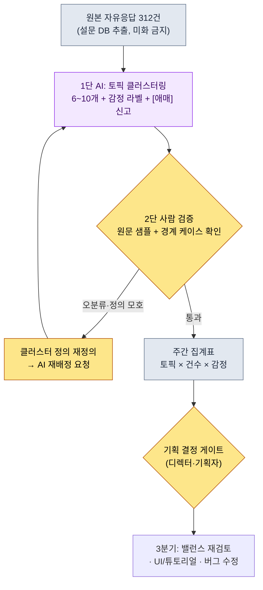
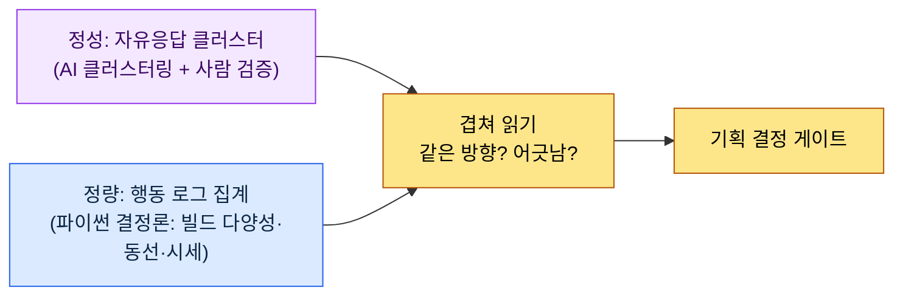

# 13.1 자유응답 수백 건을 토픽으로 — 클러스터링은 AI, 진단은 사람

> 1차 독자: 유저 피드백·메타게임을 읽어야 하는 MMORPG 기획자 (중규모(10\~50인) 팀)
> 1인/취미 독자용 축소 버전: §13.1.8 「혼자라면 이만큼만」

업데이트를 내보낸 다음 날 아침, 인게임 설문의 자유응답 칸에 312건이 쌓여 있던 화면을 기억한다. 한 칸짜리 짧은 문장부터 다섯 줄짜리 분노까지 섞여 있었다. 기획팀 누구도 그 312건을 다 읽지 않았다. 정확히는 못 읽었다. 읽더라도 "대충 강화가 빡세다는 얘기가 많네요" 정도의 인상으로 회의에 들어갔고, 그 인상은 가장 목소리 큰 5건이 만든 착시였다. 312건이 실제로 무엇을 말하는지는 아무도 몰랐다.

이 장은 그 312건을 사람이 다 읽지 않고도 "무엇이 몇 건"인지 말할 수 있게 만드는 방법을 다룬다. 핵심은 두 가지다. 첫째, 수백 건의 자유응답을 **토픽으로 묶고 감정을 라벨링하는** 지루한 분류를 AI에게 시킨다. 둘째, AI의 클러스터를 그대로 믿지 않고 사람이 **오분류 한 건을 잡아 거부하고 재요청**한다. FAQ·메타게임 분석의 일반론은 다른 책에도 있으니, 이 장은 그 분석을 *AI 워크플로로 돌리는 자리*에만 집중한다.

---

## 13.1.1 자유응답은 '읽는 자료'가 아니라 '분류하는 자료'다

FAQ와 자유응답은 기획자가 의도한 게임과 사용자가 실제로 겪는 게임의 차이를 보여주는 거울이다. 같은 질문이 안내 데스크에 하루 30번 들어오면, 응대 인력을 늘릴 게 아니라 안내판을 다시 디자인해야 한다. 문제는 그 "30번"을 세는 일이다. 자유응답은 정형 로그가 아니라서 `GROUP BY`가 안 걸린다. "강화가 너무 비싸요"와 "재화가 부족해서 못 키워요"는 같은 토픽이지만 문자열이 다르다. 사람이 눈으로 묶으면 312건에 두세 시간이 들고, 묶는 기준이 사람마다 흔들린다.

여기가 AI가 들어갈 자리다. 자유응답 분류는 (1) 양이 많고 (2) 지루하고 (3) 자연어 의미 판단이 필요한 — 즉 결정론 코드로는 안 되고 사람이 하면 비싼 작업이다. 다만 출시 전에 못 박을 게 하나 있다. **AI가 만드는 건 토픽 클러스터(가설)이지 확정 진단이 아니다.** "강화 불만 38%"는 AI가 라벨을 붙인 결과일 뿐, 그게 "강화를 너프하라"는 결정으로 바로 이어지면 안 된다. 13부 전체를 관통하는 원칙이 여기서도 그대로다 — KPI 정의와 최종 진단은 사람, 자연어 묶기와 1차 라벨링은 AI.

자동화의 진짜 가치도 이 지점에 있다. 분류를 자동화하면 분석 자체가 빨라지는 것보다, **312건이라는 신호가 매주 아침 분류된 형태로 책상에 도착한다**는 게 핵심이다. 자동화의 가치는 시간 절약이 아니라 신호 노출이다(팀 운영 개념 `automation_signal_value_over_time_savings`). 우편함에 쌓이기만 하던 편지가 매일 분류되어 해당 부서에 배달되는 차이다.

---

## 13.1.2 [워크드 트랜스크립트] 자유응답 312건 → 토픽 클러스터

실제로 어떻게 돌리는지 한 사이클을 끝까지 보여준다. 아래는 저자 프로젝트(모바일 우선 MMORPG, 이하 "프로젝트 A")의 인게임 설문 자유응답을 토픽 클러스터링한 세션을 충실히 재현한 것이다. 입력 프롬프트는 그대로 복사해 쓸 수 있고, 출력은 실제 세션을 재구성했다.

### 1단계 — 입력: 자유응답을 그대로 던진다(가공 없이)

먼저 원본 자유응답을 기계가 읽을 수 있는 형태로 추출한다. 이건 설문 DB에서 뽑기만 하면 되니 새로 쓰는 게 아니다. 중요한 건 **미화·요약하지 않고 오타·욕설·한 단어 응답까지 날것 그대로** 넣는 것이다. 분류 정확도는 원문이 날것일수록 올라간다.

```jsonl
# survey_freetext_2026-W21.jsonl (발췌, 312건 중 6건)
{"id": 0041, "text": "강화비용 미쳤음 ㅡㅡ 10강 가는데 재화가 안모임"}
{"id": 0088, "text": "보스 패턴은 재밌는데 보상이 너무 짜요"}
{"id": 0102, "text": "길드전 매칭 너무 오래걸림 5분넘게 기다림"}
{"id": 0156, "text": "과금 안하면 강화를 못함 이게 게임이냐"}
{"id": 0203, "text": "신규 던전 분위기 좋아요 음악도 좋고"}
{"id": 0274, "text": "메일에 보상 왜 안옴? 버그인듯"}
```

### 2단계 — 프롬프트: 클러스터를 시키되, 카테고리·근거·애매 신고를 강제한다

```
첨부한 survey_freetext_2026-W21.jsonl(설문 자유응답 312건)을 토픽 6~10개로
묶고 각 응답에 부정/중립/긍정 라벨 붙여줘. 너무 잘게 쪼개지 말고, 응답 하나는
딱 한 클러스터에만. 안 맞으면 기타로. 클러스터별로 건수·비율·주요감정·대표 원문 1개
표로 내고, 배정 확신 안 서는 건 억지로 넣지 말고 [애매] 목록으로 빼서 이유 한 줄씩.
해설 빼고 (가)클러스터 정의 (나)집계표 (다)[애매] 목록만.
```

이 프롬프트에서 분류를 시키는 말은 첫 두 줄뿐이고, 나머지는 전부 출력의 모양을 가두는 제약이다. AI에게 자유를 주면 클러스터를 20개로 쪼개거나, 모든 응답을 억지로 어딘가에 욱여넣는다. 그걸 막는 건 **클러스터 수 상한(6\~10), 단일 배정, 감정 3분류, 그리고 "확신 못 하면 [애매]로 빼라"는 탈출구** 네 줄이다. 분류 정확도는 이 울타리에서 나온다.

### 3단계 — Claude의 출력 (재구성, 발췌)

```
(가) 클러스터 정의
C1 강화/성장 비용  — 강화·재화 획득이 과하다는 불만
C2 과금 압박       — 무과금/소과금이 성장에서 배제된다는 인식
C3 콘텐츠 보상 부족 — 보스·던전 등 플레이 대비 보상이 짜다는 의견
C4 매칭/대기 시간   — 길드전·매칭 대기가 길다는 불만
C5 콘텐츠 호평      — 신규 던전·연출·음악 등 긍정 반응
C6 버그/지급 누락   — 보상 미지급·오류 신고
기타              — 위 6개에 안 맞는 단발성

(나) 집계표
| 클러스터 | 건수 | 비율 | 주요감정 | 대표 원문                                  |
|----------|------|------|----------|--------------------------------------------|
| C1 강화비용 | 71 | 23%  | 부정     | "강화비용 미쳤음 ㅡㅡ 10강 가는데 재화가 안모임" |
| C2 과금압박 | 58 | 19%  | 부정     | "과금 안하면 강화를 못함 이게 게임이냐"        |
| C3 보상부족 | 49 | 16%  | 부정     | "보스 패턴은 재밌는데 보상이 너무 짜요"        |
| C4 매칭대기 | 34 | 11%  | 부정     | "길드전 매칭 너무 오래걸림 5분넘게 기다림"      |
| C5 콘텐츠호평| 41 | 13%  | 긍정     | "신규 던전 분위기 좋아요 음악도 좋고"          |
| C6 버그지급 | 28 | 9%   | 부정     | "메일에 보상 왜 안옴? 버그인듯"                |
| 기타       | 31 | 10%  | 혼합     | (단발 다수)                                 |

(다) [애매] 목록 (4건)
- id 0088 "보스 패턴은 재밌는데 보상이 너무 짜요"
  → C3(보상부족)로 배정했으나 전반부는 C5(호평)와도 겹침. 복합 응답.
- id 0156 "과금 안하면 강화를 못함" → C1과 C2 경계. C2로 보냄.
- (외 2건)
```

출력에서 가장 가치 있는 부분은 집계표가 아니라 **맨 아래 [애매] 목록**이다. AI가 자기 배정의 불확실성을 신고하고 사람에게 넘긴 자리다. 좋은 프롬프트는 AI가 "이건 확신 못 합니다"라고 말할 수 있게 만든다.

### 4단계 — 검증과 거부 (사람의 자리)

이 출력을 그대로 보고에 올리면 안 된다. 사람이 원문 샘플을 직접 친다. 실제로 이 세션에서 한 건이 걸렸다.

C2(과금 압박) 58건을 펼쳐 원문을 훑던 중, `id 0156 "과금 안하면 강화를 못함 이게 게임이냐"`가 눈에 걸렸다. AI는 이걸 C2(과금 압박)로 보냈다. 그런데 이 문장의 1차 통증은 "과금"이 아니라 **"강화를 못함"** — 즉 C1(강화 비용)이다. 사용자는 강화 벽에 막혔고, 그 벽의 원인을 과금으로 지목한 것이지, 과금 자체가 불만의 핵이 아니다. C1과 C2가 인접해 헷갈리는 건 맞지만, 이걸 C2로 세면 "강화 비용" 신호가 23%보다 작게 보이고, 정작 손봐야 할 강화 곡선이 우선순위에서 밀린다. 오분류 한 건이 결정의 방향을 바꿀 수 있는 경계 케이스다.

그래서 거부하고 재요청한다.

```
C1(강화비용)과 C2(과금압박) 경계가 헷갈리네. 1차 통증이 '성장 벽 자체'면 C1,
'과금 안 하면 배제된다는 형평'이면 C2로 다시 잡아줘. id 0156은 "강화를 못함"이
핵이니까 C1이고. 이 기준으로 경계에 걸친 것들 다시 배정하고 바뀐 건수만 알려줘.
```

AI는 경계를 다시 긋고, C2에 있던 9건을 C1으로 옮겼다. 그 결과 C1이 71→80건(26%), C2가 58→49건(16%)으로 바뀌었다. **강화 비용이 단일 최대 토픽이라는 그림은 같았지만, 그 크기가 23%에서 26%로 또렷해졌다.** 한 번의 왕복으로 신호의 윤곽이 선명해진다. 이 재배정 건수(9건)와 비율 변화는 이 세션에서 실제로 카운트한 값이다(표본 312건, 단일 주차).

여기서 한 가지를 분명히 한다. 사람이 거부한 것은 "AI가 틀렸으니까"가 아니다. C2 배정도 해석으로는 가능했다. 사람이 한 일은 **클러스터 정의(=KPI 정의)를 더 날카롭게 만들어 AI에게 되먹인 것**이다. 정의는 사람이, 그 정의로 312건을 다시 훑는 노동은 AI가 한다.

---

## 13.1.3 파이프라인 — 자유응답에서 결정 게이트까지

위 세션을 매주 자동으로 돌리면 파이프라인이 된다. 사람의 손이 닿는 곳은 두 군데뿐이다. 클러스터 정의를 날카롭게 잡는 자리(앞)와, 분류 결과를 결정으로 연결하는 게이트(뒤). 그 사이의 312건 묶기와 라벨링은 AI가 돌린다.



결정적 설계는 2단(사람 검증)이 AI 출력을 자동 통과시키지 않는다는 점이다. 자동 통과형으로 만들면, AI가 한 번 잘못 그은 경계가 매주 같은 방향으로 신호를 왜곡한다. 의심 후보(애매 목록)는 AI가 뽑되, 클러스터 정의를 고칠지 말지는 사람이 정한다. 그리고 집계표는 그 자체로 결정이 아니라 **결정 게이트의 입력**일 뿐이다. "C1 강화비용 26%"는 디렉터가 강화 곡선을 들여다보게 만드는 신호이지, 자동 너프 트리거가 아니다.

---

## 13.1.4 메타게임 — 자유응답과 행동 로그를 겹쳐 본다

자유응답이 "사용자가 말한 것"이라면, 메타게임은 "사용자가 실제로 한 것"이다. 출시되면 기획자가 의도하지 않은 플레이 방식이 정착하는데, 그게 메타게임이다. 빌드 메타(특정 스킬 조합 쏠림), 동선 메타(선호 사냥 경로), 거래 메타(공식 시세와 다른 유저 합의가) 같은 것들이다. 이건 자유응답과 달리 **행동 로그로 정량 측정**되며, 결정론 코드(파이썬)가 집계한다. AI가 끼어들 자리가 아니다.

핵심은 둘을 **겹쳐 보는** 것이다. 위 세션에서 C1(강화 비용) 불만이 26%로 가장 컸다. 이때 행동 로그에서 빌드 다양성 지수(상위 스킬 조합 집중도)가 같은 주에 떨어졌다면, "말로도 행동으로도 한 빌드·한 성장 경로로 수렴 중"이라는 두 신호가 같은 방향을 가리킨다. 정량과 정성이 일치할 때 결정의 확신이 선다. 반대로 자유응답은 잠잠한데 행동 로그만 한 빌드로 쏠리면, 사용자가 불편을 느끼면서도 말하지 않는(=조용한 이탈 직전) 위험 신호일 수 있다.



여기서도 분업이 명확하다. 행동 로그 집계는 **AI가 아니라 코드**가 한다. 빌드 점유율이나 거래 시세는 매 호출마다 답이 달라지면 안 되는 결정론 수치이기 때문이다. AI는 자유응답이라는 비정형 텍스트를 묶는 데만 쓰고, 정량 KPI는 코드가 못 박는다.

---

## 13.1.5 이 장 수치의 출처

이 장의 비율은 서문 「한 가지 약속」의 원칙을 따른다. §13.1.2의 "C1 23%→26%, 재배정 9건"은 표본 312건(단일 주차)에서 실제 카운트한 값이라, 절대값이 아니라 "강화 비용이 단일 최대 토픽"이라는 *방향*으로 읽는다. 인과는 단정하지 않는다 — "FAQ 분석을 했더니 리텐션이 올랐다" 같은 표는 없다. 대신 이 워크플로가 실제로 측정 가능한 것은 셋이다: 클러스터 검증에서 사람이 뒤집은 오분류 건수(0이면 검증이 형식적이었다는 신호), 주간 집계 산출까지 걸린 시간, 정량·정성 신호의 일치 여부.

---

## 13.1.6 폐기·재요청은 도구의 실패가 아니라 게이트의 신호다

§13.1.2에서 사람이 C2 배정 9건을 뒤집었다. 검증을 매주 돌리면 이런 뒤집기가 매번 0\~몇 건씩 나온다. 중요한 건 **뒤집기 0건이 목표가 아니라는 점**이다. 검증에서 한 건도 안 뒤집힌다면, 두 가지 중 하나다 — AI가 완벽했거나(드물다), 검증자가 원문을 안 보고 도장만 찍었거나. 후자가 압도적으로 흔하다.

매주 한두 건의 경계 케이스가 걸리고, 그걸 계기로 클러스터 정의가 조금씩 날카로워질 때 검증 게이트가 실제로 작동하는 것이다. 이건 AI 분류 정확도를 사람이 정기적으로 표집 검수해야 한다는 일반 원칙의 구체형이다. 같은 사용자 유형이 다른 토픽으로 흩어지는 오분류는, 검수 없이 자동 분류만 신뢰하면 매주 누적된다.

---

## 13.1.7 흔한 실패

| 패턴 | 왜 실패하나 | 처방 |
|---|---|---|
| 자유응답을 사람이 눈으로만 훑음 | 목소리 큰 5건이 312건을 대표하는 착시 | AI 클러스터링으로 전수 분류 (§13.1.2) |
| "AI야 유저 피드백 분석해 줘" 통째 위임 | 클러스터가 20개로 쪼개지거나 억지 배정 | 클러스터 수 상한·단일 배정·[애매] 강제 |
| AI 집계표를 검증 없이 보고 | 경계 오분류가 결정 방향을 바꿈 | 원문 샘플 + 경계 케이스 직접 확인 |
| 집계 비율을 결정으로 직결 | "불만 26%니까 너프" 자동 트리거화 | 집계표는 결정 게이트의 입력일 뿐 |
| 정성만 보고 행동 로그 무시 | 말 없는 조용한 이탈을 놓침 | 정량(코드)·정성(AI)을 겹쳐 읽기 (§13.1.4) |
| 정량 KPI를 AI에게 집계시킴 | 호출마다 수치가 달라져 밸런스 흔들림 | 빌드·시세 집계는 결정론 코드 |

세 번째가 가장 자주 놓친다. 집계표는 깔끔해서 그대로 믿고 싶어진다. 그러나 id 0156 한 건처럼, 경계의 오분류 하나가 우선순위를 통째로 바꿀 수 있다. 검증은 312건을 다시 읽는 게 아니라, **가장 큰 두세 클러스터의 경계 케이스만** 원문으로 확인하는 일이다.

---

## 13.1.8 따라하기 — 오늘 할 수 있는 한 단계

> **혼자라면 이만큼만**: 설문 DB가 없어도 됩니다. 본인 게임(또는 좋아하는 게임)의 스토어 리뷰·커뮤니티 글을 30\~50건만 텍스트로 모아 §13.1.2의 프롬프트를 그대로 붙여 한 번 돌려 보세요. 나온 클러스터 중 "이건 좀 이상한데" 싶은 배정 한 건을 골라 "이 응답의 1차 통증은 다른 토픽이다, 정의를 다시 잡고 재배정하라"고 반박해 보면, 클러스터링이 어떤 판단들의 묶음인지 몸으로 들어옵니다.

팀이라면 다음 한 단계로 시작하세요. 자유응답 한 주치를 `survey_freetext_YYYY-Www.jsonl`로 미화 없이 추출하고, §13.1.2의 프롬프트로 한 번 돌려 봅니다. 그다음 가장 큰 두 클러스터의 경계 케이스만 원문으로 확인합니다. 클러스터 정의를 한 번 날카롭게 잡아 두면, 이후 매주 같은 프롬프트로 재현 가능한 주간 집계가 자동으로 쌓입니다.

---

### 이 챕터의 핵심 메시지
- 자유응답은 읽는 자료가 아니라 AI로 전수 분류하는 자료다.
- 클러스터 정의(=KPI 정의)는 사람, 312건 묶기는 AI.
- 검증의 뒤집기 0건은 도장만 찍었다는 신호다.

### 다음 챕터 미리보기
- 13.2 KPI 정의·추적 — 5\~7개로 줄인 진단표와 측정 함정
