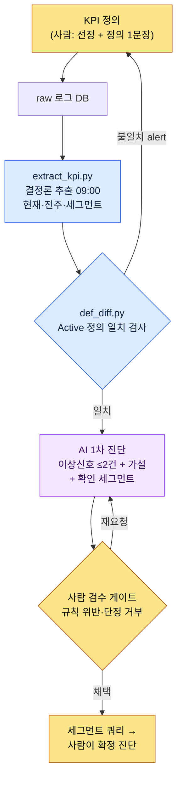

# 13.2 KPI 정의·추적 — 정의는 사람이, 이상신호 진단은 AI가

> 1차 독자: 운영 지표를 책임지는 라이브/데이터 기획자 (중규모(10~50인) 팀)
> 1인/취미 독자용 축소 버전: §13.2.8 「혼자라면 이만큼만」

월요일 아침마다 같은 장면이 반복됐다. 데이터팀이 보내온 일일 대시보드 캡처를 회의 화면에 띄우고, 누군가 "DAU(Daily Active Users, 일일 활성 사용자)가 좀 빠진 것 같은데요"라고 말하면, 또 누군가 "그건 지난주에 점검이 있어서 그래요"라고 받는다. 숫자는 거기 있는데, 그 숫자가 **이상신호인지 노이즈인지**를 판정하는 사람의 머릿속 작업이 매주 처음부터 다시 시작됐다. 그리고 그 판정은 말하는 사람마다 달랐다.

이 장의 결론을 먼저 적는다. KPI에서 사람이 해야 하는 일은 **무엇을 KPI로 삼을지 정의하는 것**과 **AI가 올린 이상신호를 확정 진단으로 승격할지 거부할지 판정하는 것**, 이 둘뿐이다. 그 사이에 낀 두 가지 — 매일 같은 시각 raw 로그에서 숫자를 뽑는 일과, 전주 대비 무엇이 흔들렸는지를 자연어로 1차 작성하는 일 — 은 각각 결정론 코드와 AI가 맡는다. KPI 정의의 일반론(5~7개로 줄여라, Goodhart의 법칙을 조심하라)은 다른 책에도 충분하니, 이 장은 그 정의를 *AI 워크플로로 돌리는 자리*에만 집중한다.

---

## 13.2.1 KPI 정의는 사람의 자리다 — 그러나 그 다음은 아니다

KPI 운영에는 사람만 할 수 있는 판단이 둘 있다. 첫째, **무엇을 KPI로 삼을지**. 둘째, **각 KPI의 정의를 한 문장으로 못 박는 것**. 이 둘은 게임의 가치 판단이라 AI에 위임할 수 없다. "Active를 5분 이상 플레이로 본다"는 결정에는 게임이 무엇을 건강으로 보는지가 담겨 있다.

문제는 이 정의가 한 번 흔들리면 그 위의 모든 숫자가 같이 흔들린다는 점이다. "Active User"를 한쪽 쿼리는 *1회 로그인*으로, 다른 쪽 쿼리는 *10분 + 사냥 1회*로 잡으면 DAU가 통째로 어긋난다. 그래서 정의 자체보다 **정의의 일관성**을 지키는 일이 운영의 절반을 차지한다. 그리고 일관성 검사는 사람 머리가 아니라 코드가 해야 한다(§13.2.5).

정의가 못 박힌 다음의 일은 사람의 자리가 아니다. 매일 같은 시각에 숫자를 뽑는 추출, 전주 대비 변동을 훑어 이상신호 후보를 적는 1차 작성 — 이 둘은 매일 반복되고 사람이 하면 기준이 그날그날 흔들리는, 정확히 기계와 모델에 내려보낼 종류의 일이다. 추출은 결정론(코드)에, 1차 진단은 AI에 넘긴다. 사람은 AI가 올린 후보를 받아 **확정할지 거부할지**만 판정한다.

| 단계 | 누가 | 왜 거기인가 |
|---|---|---|
| KPI 선정·정의 | 사람 | 게임의 가치 판단, 위임 불가 |
| 일일 raw 추출 | 코드(결정론) | 같은 입력 → 같은 숫자, 회귀 검증 가능 |
| 전주 대비 이상신호 1차 작성 | AI | 자연어 요약은 AI 친화적, 단 '가설'까지만 |
| 확정 진단·세그먼트 확인 지시 | 사람 | AI 가설을 승격/거부, 책임의 자리 |

이 분담이 이 장 전체의 골격이다. 아래에서 한 사이클을 끝까지 돌려 본다.

---

## 13.2.2 [워크드 트랜스크립트] 일일 대시보드 raw → 이상신호 자동 작성

실제로 어떻게 도는지 한 사이클을 입력에서 사람 판정까지 끝까지 보여준다. 아래는 저자 프로젝트(모바일 우선 MMORPG, 이하 "프로젝트 A")의 일일 KPI 진단 세션을 익명화해 재현한 것이다. raw 로그의 스키마·추출 코드 구조·프롬프트는 실제 도구를 옮겼고, 숫자는 형식을 보이기 위한 예시값이며 실측 KPI가 아니다.

### 1단계 — 입력: 결정론 추출이 뱉은 raw 숫자

먼저 코드가 매일 09:00에 로그 DB에서 KPI를 뽑는다. AI는 이 숫자를 만들지 않는다 — 받기만 한다. 추출 결과는 전주 같은 요일과 나란히 둔 JSON이다.

```json
// kpi_daily_2026-06-05.json — extract_kpi.py 산출 (LLM 입력)
{
  "date": "2026-06-05",
  "compare_to": "2026-05-29",   // 전주 같은 요일(금)
  "active_def": "min10_hunt1", // 적용된 Active 정의 ID
  "L0": {
    "ltv_12m_est":   {"v": 0,    "prev": 0,    "delta_pct": null},
    "d30_retention": {"v": 0,    "prev": 0,    "delta_pct": null}
  },
  "L1": {
    "dau":            {"v": 0, "prev": 0, "delta_pct": -0.0},
    "session_len_min":{"v": 0, "prev": 0, "delta_pct": -0.0},
    "sessions_per_u": {"v": 0, "prev": 0, "delta_pct": 0.0},
    "d7_retention":   {"v": 0, "prev": 0, "delta_pct": 0.0}
  },
  "segments": {
    "dau_by_platform": {"ios": 0, "aos": 0},
    "dau_by_region":   {"kr": 0, "sea": 0},
    "dau_by_newbie":   {"d0_7": 0, "d8plus": 0}
  }
}
```

값은 0으로 비워 두었다. 핵심은 구조다. 각 KPI에 현재값·전주값·변동률이 붙고, 맨 아래에 **세그먼트 분해**(플랫폼·지역·신규/기존)가 함께 실린다. AI가 "DAU가 빠졌다"에서 그치지 않고 "어느 세그먼트에서 빠졌는지 확인하라"까지 가려면 이 분해가 입력에 있어야 한다.

### 2단계 — 프롬프트: 형식·근거·'확정 진단 금지'를 강제한다

```
첨부 kpi_daily_2026-06-05.json은 09:00 자동 추출된 일일 KPI고 compare_to가 전주
같은 요일이야. L0~L1 중 이상신호로 볼 만한 거 최대 2건만 골라줘. 전주 대비 변동이
평소 요일 변동폭을 벗어난 걸로. 평소 변동폭 모르면 지어내지 말고 '모름'이라 쓰고 빼.
후보마다 지표·변동폭·추정 원인 가설 1~2개·확인할 세그먼트 적되, 원인은 꼭 '가설'로만
쓰고 확정처럼 단정하지 마. 로그에 없는 이벤트·패치 같은 건 단정 금지. 세그먼트는 첨부
segments 안에서만 지목하고. 0건이면 '0건, 특이사항 없음'만.
출력은 후보별 5줄(지표/변동/가설/확인세그먼트/확신도 상중하), 산문 빼고.
```

규칙 다섯 줄이 거의 다 금지문이라는 게 이 프롬프트의 성격이다. 자유를 주면 AI는 KPI 진단을 그럴듯한 확정 서사로 미화한다("출석 이벤트 종료로 DAU가 하락했습니다"처럼, 로그에 없는 이벤트를 단정한다). 그래서 **확정 진단 금지·가설로만·세그먼트는 입력 안에서만·모르면 모른다**를 못으로 박아, AI가 넘지 못할 선을 먼저 그어 둔다.

### 3단계 — Claude의 출력 (날것, 발췌)

아래는 LLM이 실제로 뱉은 형태를 재구성한 것이다. 요약·미화하지 않고, 셋째 후보에서 규칙을 슬쩍 어긴 부분까지 그대로 둔다.

```
[이상신호 후보 — 2건]

후보 1
- 지표: session_len_min (평균 세션 길이)
- 변동: 전주 금 대비 하락 (delta_pct 음수). L1 중 가장 큰 음의 변동.
- 가설: (a) 신규 유입(d0_7) 세션이 짧아 평균을 끌어내렸을 가능성
        (b) iOS 특정 빌드에서 세션 조기 종료 가능성
- 확인 세그먼트: dau_by_newbie(d0_7 vs d8plus) 세션길이 분리,
                dau_by_platform(ios vs aos)
- 확신도: 중

후보 2
- 지표: d7_retention
- 변동: 전주 대비 소폭 상승(양수)이나 절대폭 작음.
- 가설: 노이즈일 수 있음. 평소 요일 변동폭 데이터가 없어 이상 여부 단정 불가.
- 확인 세그먼트: dau_by_newbie(d0_7) 코호트 리텐션
- 확신도: 하

[참고] 최근 출석 이벤트 종료가 세션 길이 하락의 원인으로 보입니다.
```

출력의 처음 두 후보는 규칙을 지켰다. 가설을 가설로 쓰고, 세그먼트를 입력 안에서 지목했고, 후보 2는 "평소 변동폭 데이터가 없어 단정 불가"라며 스스로 확신도를 '하'로 내렸다. 이게 좋은 출력의 모습이다 — AI가 자기 한계를 신고했다.

문제는 맨 아래 `[참고]` 한 줄이다. **로그에 없는 "출석 이벤트 종료"를 원인으로 단정**했다. 규칙 3 위반이다. 이게 다음 단계에서 걸린다.

### 4단계 — 검증과 거부 (사람의 자리)

세 가지를 친다.

첫째, **규칙 위반.** `[참고]` 줄은 입력 JSON에 없는 이벤트를 사실처럼 단정했다. 이벤트 캘린더는 이 입력에 들어 있지 않았으므로 AI가 알 수 없는 정보다. 이 줄은 **거부**한다.

둘째, **후보 1 채택.** 세션 길이 하락은 실재하고, AI가 제시한 두 갈래(신규 코호트 / iOS 빌드)는 입력 세그먼트로 실제 확인 가능하다. 채택하되, 아직 **이상신호이지 확정 원인이 아니다.** 사람이 할 일은 세그먼트 쿼리를 돌려 둘 중 무엇인지 가르는 것이다.

셋째, **후보 2 보류.** AI 스스로 "단정 불가"라 했고 절대폭이 작다. 평소 요일 변동폭(요일별 표준편차)을 추출 코드에 추가하기 전까지는 노이즈로 둔다. 이건 **코드 쪽 숙제**다 — AI가 "평소 변동폭을 모른다"고 신고한 것은 사실 입력 데이터의 결함을 가리킨 것이다.

그래서 재요청한다.

```
맨 아래 [참고] 줄은 입력에 없는 출석 이벤트를 단정했으니 지워줘. 후보 1만 남기고,
세션 길이 하락을 d0_7/d8plus × ios/aos 2x2로 갈라서 "어느 칸이 가장 많이 빠졌는지
확인" 한 줄 액션으로 다시 써줘. 원인 단정 말고 확인 액션만.
```

이 한 번의 왕복으로 끝난다. AI는 `[참고]` 줄을 지우고, "d0_7 × iOS 칸의 세션 길이를 먼저 보라"는 확인 액션 한 줄로 다시 답했다. 그 출력은 규칙을 통과했고, 사람은 그 쿼리를 돌려 — 실제로 신규 iOS 코호트 칸이 가장 많이 빠진 것을 확인하면 — 그때 비로소 "신규 iOS 온보딩 세션 이탈"이라는 **확정 진단**을 내린다. 진단을 내리는 건 끝까지 사람이다.

> **핵심**: AI는 "어디를 봐야 하는지"까지만 안다. "무엇이 원인인지"는 사람이 세그먼트를 갈라 확인한 뒤에 확정한다. 이 경계를 프롬프트가 강제하지 않으면 AI는 매번 그럴듯한 확정 서사로 넘어간다.

---

## 13.2.3 KPI 파이프라인 — 한눈에

위 사이클을 그림으로 고정해 두면, 이후 모든 일일 진단이 같은 길을 탄다. 사람의 손이 닿는 곳이 양 끝 두 군데(정의·확정)뿐이라는 게 한눈에 보인다.



세 갈래의 색이 다르다. **파랑 계열(추출·정의 diff)은 결정론**이라 같은 입력에 같은 결과를 보장한다. **가운데 AI 한 칸만 비결정**이고, 그래서 양옆을 코드가 잡아 준다. **맨 끝 확정 진단은 사람**이다. §13.2.2에서 `[참고]` 줄이 걸린 자리가 바로 'F 사람 검수 게이트'다.

---

## 13.2.4 KPI 정의의 네 함정 — 정의를 흔드는 것들

AI에 1차 진단을 넘기기 전에, 사람이 못 박아야 하는 정의에는 네 개의 함정이 있다. 함정을 모르면 §13.2.2의 입력 JSON 자체가 매일 다른 의미가 된다.

**함정 1 — Active의 정의.** "Active User"가 *1회 로그인*인지, *5분 이상*인지, *10분 + 사냥 1회*인지에 따라 DAU가 배 단위로 갈린다. 정의를 ID(`min10_hunt1`)로 고정해 입력 JSON에 함께 싣는다(§13.2.2 1단계의 `active_def` 필드). 이 ID가 쿼리마다 다르면 §13.2.5의 diff가 잡는다.

**함정 2 — Retention의 측정 시점.** "7일 리텐션"의 7일이 *가입 후 정확히 7일째*인지, *7일 이내 어느 날이라도*인지, *8일째*인지로 값이 갈린다. 업계 표준이 흔들리는 영역이라 자체 정의를 명문화하고 일관 유지하는 수밖에 없다.

**함정 3 — Outlier 처리.** 상위 소수의 고활성 사용자가 평균을 끌어올린다. 그래서 L0~L1은 평균과 함께 **중앙값**을 본다. 분포 변화가 평균 변화보다 의미가 클 때가 많다. AI 진단 프롬프트에 평균만 주면, AI는 평균만 보고 분포 이동을 놓친다.

**함정 4 — 측정 시점.** 오전·오후·새벽 측정값이 다르다. 운영 자동화는 **매일 09:00 같은 시각 추출**을 표준으로 둔다(§13.2.2 1단계). 시각이 흔들리면 전주 대비 비교가 무너진다.

이 네 함정의 공통점은 *값이 아니라 정의가 흔들린다*는 것이다. 그래서 가장 위험한 사고는 "DAU가 떨어졌다"가 아니라 "어제와 오늘의 DAU가 **다른 정의**로 계산됐다"이다. 사람 눈으로는 거의 안 잡힌다. 코드로 잡는다.

---

## 13.2.5 Active 정의 불일치를 코드로 잡는다 — def_diff

가장 조용한 KPI 사고는 두 쿼리가 같은 이름(`DAU`)을 다른 정의로 계산하는 것이다. 대시보드 쿼리는 `min10_hunt1`로 DAU를 세는데, 마케팅 리포트 쿼리는 `login1`로 세면, 같은 회의에서 두 사람이 다른 DAU를 들고 와 서로를 의심한다. 사람이 SQL을 한 줄씩 비교해 잡을 수 없는 일이라, 정의를 메타데이터로 떼어 내 코드가 diff한다.

```python
# def_diff.py — KPI 정의 일관성 검사 (골격)
# 전제: 각 쿼리는 자기가 쓴 Active 정의 ID를 메타로 선언한다.
#   예: dashboard.sql 헤더의  -- @active_def: min10_hunt1

CANON = {                      # 정본 정의 (사람이 한 번 못 박음)
    "DAU":          "min10_hunt1",
    "d7_retention": "signup_plus7_exact",
}

def parse_active_def(sql_path):
    # SQL 주석 헤더에서 -- @active_def: <id> 를 읽는다
    for line in open(sql_path, encoding="utf-8"):
        if line.strip().startswith("-- @active_def:"):
            return line.split(":", 1)[1].strip()
    return None  # 선언 누락도 사고다

def diff(query_registry):
    issues = []
    for kpi, sql_path in query_registry.items():
        declared = parse_active_def(sql_path)
        canon = CANON.get(kpi)
        if declared is None:
            issues.append(f"[MISS] {kpi}: {sql_path} 에 정의 선언 없음")
        elif declared != canon:
            issues.append(
                f"[DIFF] {kpi}: {sql_path} 는 '{declared}' 로 계산하나 "
                f"정본은 '{canon}'. 같은 이름 다른 정의 — 비교 불가."
            )
    return issues
```

이 30줄이 "왜 당신 DAU랑 내 DAU가 다르죠?"라는 회의를 없앤다. `[DIFF] DAU: marketing_report.sql 는 'login1' 로 계산하나 정본은 'min10_hunt1'`이라고 코드가 출력하면, 토론할 게 없다. 쿼리를 고치거나 정본을 바꾸거나 둘 중 하나다. 정의가 코드로 검사되면, §13.2.2의 AI 진단이 **항상 같은 정의 위에서** 돌아간다는 보장이 생긴다. 정의가 흔들리는 위에 올린 AI 진단은 그럴듯한 헛소리다.

이 검사는 결정론이라 CI에 건다. 쿼리를 커밋할 때마다 자동으로 돈다. AI에 절대 맡기지 않는 영역이다 — 정의 일치는 판단이 아니라 비교라서, 비결정 모델이 끼면 오히려 사고가 는다.

---

## 13.2.6 자동화의 가치는 시간 절약이 아니라 신호 노출이다

이 파이프라인을 깔면 가장 먼저 떠오르는 자랑은 "진단 시간이 줄었다"이다. 그러나 진짜 가치는 다른 데 있다. 저자의 팀 운영 개념 중에 `automation_signal_value_over_time_savings`라는 한 줄이 있다 — **자동화의 가치는 절약한 시간이 아니라 노출된 신호에 있다.**

KPI 자동화 전에는 세션 길이 하락 같은 신호가 누군가 우연히 그래프를 들여다봐야 보였다. 자동화 후에는 매일 09:00에 "전주 대비 이상신호 2건"이 자연어로 책상에 올라온다. 줄어든 건 분석 시간이지만, 바뀐 건 **그 신호를 며칠 만에 인지하느냐**다. 우연히 봐야 보이던 것이 매일 강제로 노출된다.

그래서 이 도구의 성공은 "진단에 몇 분 덜 걸린다"로 측정하지 않는다. **이상신호를 처음 인지하기까지의 시간(신호 → 인지)**으로 측정한다. 이 방향이 깨지면 — 즉 AI 요약이 매일 "특이사항 없음"만 찍어 아무도 안 읽게 되면 — 도구는 시간은 절약하되 신호를 죽인 셈이라, 한두 분기 안에 무용지물이 된다.

---

## 13.2.7 이 장 수치의 출처

이 장의 숫자는 서문 「한 가지 약속」의 원칙을 따른다. 등장한 KPI 숫자(DAU·세션 길이 변동률)는 전부 형식을 보이기 위한 예시값이며 실측이 아니다 — 절대값이 아니라 *구조*로 읽는다. KPI 정의(Active·Retention)에는 업계 합의된 단일 표준이 없어, "자체 정의를 명문화하라"가 결론이다(§13.2.4). 실제로 측정 가능한 것은 셋이다: `def_diff`가 잡은 정의 불일치 건수(목표 0), AI 진단 후보 중 사람이 거부한 비율, 이상신호 인지까지의 시간. 반대로 "KPI 자동화로 리텐션이 올랐다" 같은 인과는 단정하지 않는다.

---

## 13.2.8 따라하기 — 오늘 할 수 있는 한 단계

> **혼자라면 이만큼만**: 로그 DB가 없어도 됩니다. 본인 게임(또는 좋아하는 게임)에서 매일 볼 KPI를 딱 3개만 골라 정의를 한 문장씩 적어 보세요("Active = 한 판이라도 시작" 식으로). 그리고 어제·오늘 값을 손으로 두 줄 적어 §13.2.2의 프롬프트를 붙여, AI에게 "이상신호 후보를 가설로만, 확정 진단 금지로 써 달라"고 시켜 보세요. AI가 슬쩍 단정하는 한 줄을 찾아 "그건 로그에 없는 사실이다, 빼라"고 반박해 보면, KPI 진단에서 사람의 자리가 어디인지 몸으로 들어옵니다.

팀이라면 다음 한 단계로 시작하세요. KPI 5~8개를 정하고, 각 쿼리 SQL 헤더에 `-- @active_def: <id>` 한 줄을 입력하는 규약부터 만듭니다. 그다음 §13.2.5의 `def_diff.py` 골격(정본 dict + 헤더 파싱 + diff)을 CI에 겁니다. AI 진단 파이프라인은 그 뒤입니다. 정의 일치 검사 하나만 있어도, "당신 DAU와 내 DAU가 다른" 가장 조용한 사고를 먼저 막습니다.

---

## 13.2.9 흔한 실패

| 패턴 | 왜 실패하나 | 처방 |
|---|---|---|
| KPI를 30개 늘어놓은 대시보드 | 빨강을 못 찾아 매일 안 봄 | L0~L1 5~8개로 압축 |
| Active 정의를 쿼리마다 다르게 | 같은 이름 다른 숫자 → 회의 불신 | `def_diff.py` CI 게이트 (§13.2.5) |
| AI에 "원인 진단해 줘" 통째 위임 | 로그에 없는 이벤트를 단정 | 가설로만·세그먼트는 입력 안에서 (§13.2.2) |
| AI 진단을 무비판 채택 | 그럴듯한 확정 서사가 결정 입력으로 새 들어옴 | 사람 검수 게이트에서 단정 거부 |
| 평균만 입력으로 줌 | 분포 이동을 AI도 사람도 놓침 | 중앙값·세그먼트 분해 동봉 (§13.2.4) |
| 자동화를 '시간 절약'으로만 평가 | 요약이 "특이사항 없음"만 찍어도 통과 | 신호 인지 시간으로 측정 (§13.2.6) |

네 번째가 가장 자주 놓친다. AI 요약은 매끄러워서 그대로 믿고 싶어진다. §13.2.2의 `[참고]` 한 줄처럼, 매끄러운 단정 하나가 거부되지 않고 통과하면 그 가짜 원인이 다음 분기 결정의 입력이 된다. 사람의 자리는 요약을 쓰는 데가 아니라, 요약의 단정을 거부하는 데 있다.

---

### 이 챕터의 핵심 메시지
- KPI 정의와 확정 진단은 사람, 추출과 1차 진단은 코드·AI.
- AI 진단은 '가설'까지만 — 로그에 없는 원인 단정은 거부한다.
- 같은 이름 다른 정의가 가장 조용한 사고, def_diff가 코드로 잡는다.

### 다음 챕터 미리보기
- 13.3 데이터 드리븐 의사결정 — 데이터의 강점과 함정
