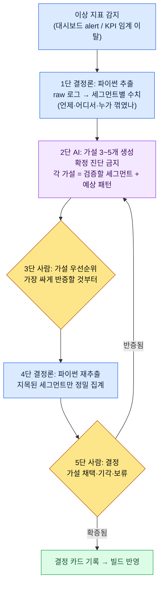

# 13.3 이상 지표에서 결정까지 — AI는 가설을, 사람은 결정을

> 1차 독자: KPI를 보고 분기 결정을 내리는 데이터 담당·디렉터 (중규모(10\~50인) 팀)
> 1인/취미 독자용 축소 버전: §13.3.9 「혼자라면 이만큼만」

월요일 아침 대시보드에서 빨간 줄 하나를 본 적이 있다. 30일 리텐션이 전주 대비 눈에 띄게 꺾여 있었다. 회의실에 모인 사람들이 각자 한 가지씩 원인을 댔다. 누군가는 지난주 패치한 신규 사냥터를, 누군가는 경쟁작 신규 시즌을, 누군가는 그냥 "계절적 요인"을 말했다. 다 그럴듯했다. 문제는 그날 오후가 다 가도록 우리가 무엇을 검증해야 하는지조차 합의하지 못했다는 점이다. 가설이 다섯 개인데 검증할 세그먼트는 한 개도 정해지지 않았다.

이 장은 그 아침을 끝내는 방법을 다룬다. 핵심은 한 줄이다. **이상 지표를 보면, AI에게 확정 진단을 시키지 않고 검증 가능한 가설 3\~5개를 시킨다.** AI는 "리텐션이 떨어진 이유는 X다"라고 단정하지 않는다. "X라면 이 세그먼트에서 이렇게 보일 것이다"라는 검증 설계를 내놓고, 결정은 사람이 한다. 데이터 드리븐의 일반론은 다른 책에 충분하니, 이 장은 그 일반론을 *AI 워크플로로 돌리는 자리*에만 집중한다.

---

## 13.3.1 KPI 정의는 사람, 해석 보조는 AI

먼저 경계를 못 박는다. 이 장 전체가 한 문장 위에 서 있다. **KPI를 무엇으로 정의할지는 사람이 정하고, 그 KPI가 흔들렸을 때 왜 흔들렸는지의 가설을 빠르게 펼치는 일만 AI가 돕는다.**

이 경계가 무너지면 데이터 드리븐 자체가 무너진다. KPI 정의를 AI에게 맡기면 "측정하기 쉬운 것"이 KPI가 되고, 진단까지 AI에게 맡기면 그럴듯한 확정 문장이 사람의 검증을 건너뛰고 결정으로 직행한다. 그래서 AI에게는 딱 한 구간만 연다 — 이상이 잡힌 뒤, 사람이 결정을 내리기 전, 그 사이의 "무엇을 의심하고 무엇을 확인할까"를 펼치는 구간이다.

이 분담은 13부 앞 장들과 같은 척추를 공유한다. raw 로그를 파이썬이 결정론으로 추출하고(13.1), KPI 정의·계층은 사람이 고정하고(13.2), 이 장에서는 그 위에서 이상이 잡혔을 때의 *해석 보조*만 AI가 맡는다. 추출은 결정론, 정의는 사람, 해석 보조는 AI. 셋이 섞이지 않는 게 이 파트 전체의 안전장치다.

저자 프로젝트(모바일 우선 MMORPG, 이하 "프로젝트 A")에는 이 보조를 받쳐 주는 실재 로그가 깔려 있다. 팀 메모리 폴더 아래 `_economy_log/`(토큰·시간 경제성 로그), `_scores_latest.json`(지표 점수 캐시), `_roi_report.md`(ROI(Return on Investment, 투자 대비 효과) 보고)가 그것이다. 이 장의 워크드 트랜스크립트는 이 로그들에서 추출한 이상 신호를 입력으로 받는다.

---

## 13.3.2 결정 루프 — AI가 들어가는 자리는 딱 한 칸

이상 지표 하나가 결정으로 이어지는 전체 루프를 먼저 그림으로 고정해 둔다. 이 그림에서 AI가 들어가는 칸은 단 하나, "가설 생성"뿐이다. 그 앞(추출)도 뒤(검증·결정)도 사람과 코드의 자리다.



사람의 손이 닿는 곳은 세 군데다. 무엇이 이상인지 정의하는 자리(맨 앞, 이미 13.2에서 끝남), 어느 가설을 먼저 검증할지 고르는 자리(3단), 최종 결정을 내리는 자리(5단). 그 사이의 지루한 로그 집계는 파이썬이, 가설을 빠르게 펼치는 일은 AI가 한다. **AI가 확정 진단을 내리는 칸은 이 루프에 없다.** 가설은 반증당하기 위해 존재하고, 반증이면 2단으로 되돌아온다.

---

## 13.3.3 [워크드 트랜스크립트] 리텐션 하락 — 가설 3\~5개를 받는다

실제로 어떻게 돌리는지 한 사이클을 끝까지 보여준다. 아래는 위 월요일 아침의 리텐션 하락을 재구성한 세션이다. 입력 프롬프트는 그대로 복사해 쓸 수 있고, 출력은 실제 세션을 충실히 재구성했다.

### 1단계 — 입력: 파이썬이 뽑은 이상 신호를 그대로 던진다

먼저 사람이 "리텐션이 떨어졌다"는 느낌을 던지지 않는다. 파이썬이 결정론으로 뽑은 세그먼트별 수치 표를 던진다. 이건 새로 쓰는 게 아니라 `_economy_log`/이벤트 로그에서 추출만 한다.

```python
# retention_break_extract.py (골격) — 이상 구간 세그먼트 분해
# 입력: 일자별 코호트 리텐션 로그
# 출력: 어느 세그먼트에서 얼마나 꺾였는지 (LLM 입력용 표)
def extract_break(rows, kpi="d30_retention", baseline_weeks=4):
    base = mean([r[kpi] for r in rows if r.week < target_week][-baseline_weeks:])
    cur  = [r for r in rows if r.week == target_week]
    return [
        {"segment": s.name,
         "baseline": round(base_by_seg[s.name], 3),
         "current":  round(s.value, 3),
         "delta_pct": round((s.value/base_by_seg[s.name]-1)*100, 1),
         "n": s.sample_size}          # 표본 수 — 작으면 신뢰 낮음, 같이 넘긴다
        for s in cur
    ]
```

이 스크립트가 뱉은 표가 AI에게 줄 1차 입력이다. 핵심은 표본 수(`n`)를 같이 넘긴다는 점이다. 표본이 작은 세그먼트의 출렁임을 AI가 원인으로 착각하지 않게 하려면, 사람이 아니라 데이터가 그 경고를 들고 있어야 한다.

```
# retention_break_2026Q2W3.txt (추출 결과, 발췌)
segment                baseline  current  delta_pct      n
신규(가입7일내)           0.41     0.31      -24.4%     8,200
복귀(30일+휴면후)         0.28     0.27       -3.6%     1,100
과금(유료)               0.62     0.60       -3.2%     2,400
무과금                  0.34     0.25      -26.5%    14,900
신규사냥터_플레이         0.39     0.22      -43.6%     3,050
신규사냥터_미플레이       0.40     0.38       -5.0%    11,200
```

### 2단계 — 프롬프트: 진단 금지, 가설과 검증 설계를 강제한다

```
첨부한 retention_break_2026Q2W3.txt는 파이썬이 뽑은 d30 리텐션 세그먼트별 변화야
(baseline=직전 4주 평균, current=이번 주, n=표본 수). 무과금·신규사냥터_플레이에서
크게 빠졌네. 원인을 진단하지 말고 검증 가능한 가설 3~5개만 세워줘. 가설마다
가설 한 문장 / 검증할 세그먼트(어떻게 더 쪼개나) / 맞다면 보일 패턴 / 틀렸음을 보일
반증 조건, 이 네 줄로. 표본 작은 세그먼트(n<2000)는 근거 핵심으로 쓰지 말고, 쓸 거면
한계 명시. 가설들은 가장 싸게 반증할 수 있는 순서로 정렬하고, 데이터로 못 가르는 건
'사람 판단 필요'로 따로 표시. 출력은 가설 카드 목록만, 서술 빼고.
```

이 프롬프트에는 "원인을 찾아라"는 말이 한 줄도 없다. 대신 가설이 갖춰야 할 골격과 넘지 말 선만 적혀 있다. AI에게 자유를 주면 "아마 신규 사냥터 난이도 때문일 것"이라는 그럴듯한 확정 문장을 토해내고, 그 문장이 회의록에 기록되면 검증 없이 결정이 된다. 그걸 막는 장치가 **단정 금지, 가설마다 검증 세그먼트·예상 패턴·반증 조건 의무, 반증 비용 순 정렬, "못 가르는 건 사람에게"** 이 넷이다. 출력을 진단이 아니라 검증 설계로 바꿔 놓는 장치다.

### 3단계 — Claude의 출력 (날것, 재구성)

```
[가설 1] (반증 비용 최저)
가설: 신규 사냥터의 난이도가 무과금 신규 유저의 진입 장벽이 되어 7일 내 이탈을 키웠다.
검증 세그먼트: 신규사냥터_플레이 세그먼트를 '첫 사망 횟수' 구간(0~2 / 3~5 / 6+)으로 재분해.
예상 패턴: 가설이 맞다면 첫 사망 6+ 구간에서 d7→d30 이탈률이 급증해야 한다.
반증 조건: 사망 횟수와 이탈률 사이에 단조 관계가 없으면 기각.

[가설 2]
가설: 신규 사냥터 자체가 아니라, 같은 패치에 묶인 다른 변경(보상 곡선·UI)이 원인이다.
검증 세그먼트: 신규사냥터_미플레이인데도 패치 후 접속한 유저의 리텐션.
예상 패턴: 미플레이 세그먼트도 동반 하락하면 사냥터는 범인이 아니다.
반증 조건: 미플레이 세그먼트가 baseline 유지(-5% 수준)면 이 가설 기각, 가설 1쪽으로.

[가설 3]
가설: 외부 요인(경쟁작 신규 시즌)으로 무과금 전반이 이탈했고 사냥터는 무관하다.
검증 세그먼트: 과금/무과금 × 신규사냥터 플레이여부 2×2 교차표.
예상 패턴: 외부 요인이면 사냥터 플레이여부와 무관하게 무과금 전반이 고르게 하락.
반증 조건: 하락이 신규사냥터_플레이에 집중되면 외부 요인설 약화.

[가설 4] (사람 판단 필요)
가설: 측정 자체의 문제 — 이번 주 코호트 정의/로그 수집에 변동이 있었다.
검증 세그먼트: (데이터로 못 가름) 패치와 함께 telemetry 스키마 변경이 있었는지 사람 확인 필요.
예상 패턴: 스키마 변경이 있었다면 하락은 실제가 아니라 측정 아티팩트일 수 있음.
반증 조건: 로그 파이프라인 무변경이 확인되면 기각.

주의: '복귀'(n=1,100) 세그먼트는 표본이 작아 -3.6%를 신호로 보지 않았다.
```

이 출력에서 가장 가치 있는 부분은 가설 4다. AI가 "이건 데이터로 못 가른다, 사람이 telemetry 스키마 변경 여부를 확인하라"고 자기 한계를 신고한 자리. 좋은 프롬프트는 AI가 "모른다"고 말할 수 있게 만든다. 그리고 마지막 줄 — 표본 1,100짜리 세그먼트를 스스로 신호에서 제외한 것 — 이 규칙 3이 작동한 흔적이다.

### 4단계 — 검증과 결정 (사람과 파이썬의 자리)

이 가설 카드를 그대로 결정으로 옮기면 안 된다. 사람이 우선순위를 정하고, 파이썬이 다시 집계한다.

가설 2가 반증 비용이 가장 쌌다. 신규사냥터_미플레이 세그먼트는 이미 1단계 표에 있었다 — `-5.0%`. baseline을 유지했다. 즉 사냥터를 안 한 유저는 멀쩡했다. **가설 2는 그 자리에서 기각됐고, 동시에 가설 3(외부 요인 전반 하락)도 약해졌다.** 외부 요인이면 미플레이도 같이 떨어졌어야 하니까. 하락은 신규 사냥터를 *플레이한* 유저에 집중돼 있었다.

그래서 가설 1로 좁혀 파이썬을 다시 돌렸다. 신규사냥터_플레이를 첫 사망 횟수로 재분해한 결과, 6회 이상 사망 구간에서 d30 이탈이 두드러졌다(방향: 사망이 많을수록 이탈이 가팔라지는 단조 관계 — 정확한 수치는 빌드 telemetry로 측정, 여기서는 방향만). 가설 1의 예상 패턴과 일치했다.

남은 건 가설 4였다. 사람이 패치 노트를 확인했다 — telemetry 스키마 무변경. 측정 아티팩트 가능성 기각. 이제 결정의 재료가 갖춰졌다.

> **[5단 사람 결정 — 결정 카드]**
>
> - **채택**: 신규 사냥터 초반 난이도(첫 사망 빈도)가 무과금 신규 이탈의 1차 동인. 다음 빌드에서 1\~5레벨 구간 적 밀도·체력 하향 A/B.
> - **기각**: 외부 요인설(가설 3), 측정 아티팩트설(가설 4).
> - **보류**: 보상 곡선(가설 2의 잔여) — 사냥터 난이도 조정 후에도 하락이 남으면 재점화.
> - **AI의 역할 기록**: 진단 0건, 가설 4건 + 검증 설계 제공. 결정은 사람.

입력(이상 신호) → 추출 → 가설 → 검증 → 결정의 한 사이클이 여기서 닫힌다. AI는 단 한 번도 "원인은 이것이다"라고 말하지 않았다. 검증할 길만 깔았다. 이게 이 장의 Show 기준이다 — "AI가 데이터를 분석했다"는 문장은, 무엇을 가설하고 무엇이 반증되고 사람이 무엇을 결정했는지를 한 번이라도 끝까지 보지 않으면 공허하다.

---

## 13.3.4 왜 '확정 진단'을 금지하는가

가설 생성과 확정 진단의 차이는 사소해 보이지만 결정의 안전을 가른다. 둘을 나란히 놓으면 차이가 분명하다.

| | 확정 진단 (금지) | 가설 생성 (이 장의 방식) |
|---|---|---|
| AI 출력 | "리텐션 하락 원인은 신규 사냥터 난이도다" | "난이도 가설 — 첫 사망 6+ 구간을 보라, 이러면 맞고 저러면 틀리다" |
| 사람의 다음 행동 | 그대로 받아 적고 결정 | 가장 싼 가설부터 반증 시도 |
| 틀렸을 때 | 잘못된 결정이 빌드로 직행 | 검증 단계에서 기각, 비용 0 |
| 책임 소재 | "AI가 그랬다" (책임 증발) | 사람이 가설을 골라 결정 (책임 명확) |

확정 진단의 진짜 위험은 정확도가 아니라 **검증을 건너뛰게 만든다는 점**이다. 그럴듯한 한 문장은 회의실의 의심을 잠재운다. 반면 가설 카드는 그 자체가 "이걸 확인하라"는 숙제라서, 검증 없이는 결정으로 넘어갈 수 없는 구조다. AI를 진단기가 아니라 가설 발생기로 두는 이유가 여기 있다.

---

## 13.3.5 Goodhart 사전경고 — AI가 KPI 왜곡을 먼저 짚는다

데이터 드리븐의 가장 깊은 함정은 Goodhart의 법칙이다. *"측정 지표가 목표가 되는 순간, 그 지표는 더 이상 좋은 지표가 아니다."* DAU를 목표로 걸면 인위적 알림으로 DAU만 부풀고 장기 리텐션이 깎인다. 문제는 이 왜곡이 보통 **결정을 내린 한참 뒤에야** 부작용으로 드러난다는 점이다.

그래서 AI를 한 칸 더 일찍 투입한다. 결정안을 빌드에 넣기 전에, "이 KPI를 목표로 걸면 어떻게 게임될 수 있는가"를 AI에게 먼저 시킨다. 이건 진단이 아니라 *레드팀*이다 — 우리 결정의 허점을 일부러 찾게 시키는 것.

> **[Goodhart 사전경고 프롬프트]**
>
> 이번 분기 목표 KPI가 d7 리텐션 +5%p이고, 달성 수단 초안이 7일 연속 출석 보상
> 대폭 강화야. 네가 이 결정의 레드팀이 돼서, 이 KPI를 목표로 걸면 생길 수 있는
> Goodhart 왜곡 시나리오 3개랑, 각 시나리오에서 같이 망가질 가드 지표, 그리고
> 왜곡을 조기에 잡을 모니터링 세그먼트를 표로 뽑아줘. 단정 말고 '이럴 수 있다' 형태로.

AI가 내놓은 것은 확정 예언이 아니라 의심해야 할 지점의 목록이다. 핵심만 옮기면 이렇다.

| Goodhart 왜곡 시나리오 (가설) | 같이 망가질 가드 지표 | 조기 모니터링 |
|---|---|---|
| 출석만 찍고 핵심 콘텐츠 미플레이 | 세션당 전투 횟수·사냥터 진입률 | d7 리텐션 ↑ + 전투 횟수 ↓ 동시 발생 시 경고 |
| 보상 인플레로 경제 붕괴 | 재화 싱크/소스 비율, 아이템 시세 | `_economy_log` 싱크-소스 갭 확대 추적 |
| 출석 종료 직후 절벽 이탈 | d8\~d14 리텐션 (보상 끝난 직후) | d7만 보지 말고 d14를 짝으로 |

이 표의 가치는 정답이 아니라 **결정 전에 가드 지표를 미리 쌍으로 묶어 둔다는 점**이다. d7 리텐션을 목표로 걸 거면, AI가 짚은 "전투 횟수"와 "d14 리텐션"을 같은 화면에 띄워 두고 본다. 그러면 d7이 올라도 전투 횟수가 동반 하락하는 순간 — Goodhart 왜곡이 시작되는 그 순간 — 부작용이 분기 말까지 누적되기 전에 잡힌다. 단일 KPI를 목표로 거는 대신 가드 지표와 묶는 이 습관이, 13.2에서 정한 "5\~7개 KPI 균형"을 결정 단계에서 실제로 작동시키는 방법이다.

여기서 짚어 둘 게 있다. AI가 이 레드팀에서 만들어 낸 가치는 "시간 절약"이 아니다. 사람이 이 세 시나리오를 떠올리는 데 걸리는 시간은 길지 않다. 진짜 가치는 **결정하는 그 자리에서 왜곡 신호를 노출시킨다는 것** — 평소 보지 않던 가드 지표를 결정 테이블 위로 끌어올린다는 신호 효과다. 자동화의 가치는 시간 절약이 아니라 평소 안 보이던 신호를 보이게 만드는 데 있다(프로젝트 A 팀 메모리 개념 `automation_signal_value_over_time_savings`).

---

## 13.3.6 결정별로 AI 가설의 무게가 다르다

가설 생성이 모든 결정에 똑같이 유용한 것은 아니다. 결정의 시간 지평과 데이터 밀도에 따라 AI 가설을 얼마나 신뢰할지가 달라진다.

| 결정 유형 | 데이터 밀도 | AI 가설의 위치 |
|---|---|---|
| 스킬 밸런스 수치 변경 | 높음 (시뮬·로그 풍부) | 가설→검증→결정 루프 그대로, AI 보조 강함 |
| UI 컴포넌트 변경 | 높음 (A/B 가능) | 동일, AI 가설 유효 |
| 신규 콘텐츠 출시 여부 | 중간 (유사 콘텐츠 참조뿐) | 가설은 참고, 결정 가중치는 사람 쪽으로 |
| 장기 비전·신규 분야 | 낮음 (전례 없음) | 루프 자체가 안 돎 — 사람 결정, AI는 리스크 열거만 |

규칙은 단순하다. **데이터가 두꺼운 결정일수록 §13.3.2의 루프를 그대로 돌리고, 데이터가 얇은 결정일수록 AI는 가설 발생기에서 리스크 체크리스트 작성기로 역할이 내려간다.** 장기 비전을 데이터로 풀려는 시도가 위험한 이유는, 미래 데이터가 없는 자리에서 AI가 과거 데이터로 그럴듯한 가설을 지어내면 그 가설이 비전을 과거로 끌어당기기 때문이다. 데이터가 없는 영역의 결정은 회피하거나 AI에 떠넘기는 게 아니라, 사람이 책임지고 내리는 자리로 남겨 둔다.

> **[방향 표지 — 임베딩으로 토픽·코호트를 좌표화한다면 (아직은 시기상조)]**
>
> 처방이 아니라 연구 동향으로 읽어 주기 바란다. 13부의 두 자리에서 같은 임베딩 발상이 열린다. 하나는 §13.1의 자유응답이다 — 비정형 자연어를 문장 임베딩으로 군집화하면 §13.1.2의 [애매] 경계 케이스를 '두 토픽 중심 사이 거리'로 좌표화하고, 어느 중심에서도 먼 응답을 '새 토픽 출현'으로 표지할 수 있다. 다른 하나는 §13.1.4의 행동 로그다 — 플레이 로그를 임베딩하면 아무도 미리 정의하지 않은 '창발 코호트'를 벡터 공간(부록 M의 '지도') 군집으로 드러내, §13.3 가설 루프의 '검증할 세그먼트' 후보로 투입하는 길이 열린다(§13.3.3이 전제한 '사람이 미리 정의한 세그먼트'라는 한계를 한 칸 뚫는 자리다). 다만 군집은 원인이 아니라 가설일 뿐이고, 작은 군집은 신호가 아니며(§13.3.3의 표본 경고와 같은 자리), 군집에 이름을 붙이는 라벨링은 여전히 사람 몫이다(§13.1.1). 무엇보다 압축이 버린 차원에서 라이브 사고가 터질 수 있다. 그래서 이 발상은 경제편 §8.2.7의 '차원 벡터' 단서와 정확히 같은 자리에 둔다(개념 직관은 부록 M) — 같은 telemetry 토양 위에서, 같은 절제로. telemetry가 단단히 깔린 팀이 몇 년 뒤 들여다볼 방향 표지일 뿐, 지금 할 일은 §13.3.2의 루프를 정직하게 돌리는 것이다.

---

## 13.3.7 이 장 수치의 출처

이 장의 숫자는 서문 「한 가지 약속」의 원칙을 따른다. Goodhart의 법칙은 1975년 찰스 굿하트가 정식화한 공개 명제이고, 프로젝트 A의 `_economy_log`·`_roi_report.md`·`_scores_latest.json`은 실재하는 팀 메모리 산출물이며 정합성 실패 시 ClickUp으로 통보하는 규칙 `integrity_check_clickup_notify`는 점수 294.93의 실 운영 atom이다(부록 A.3.6·A.3.1). §13.3.3에서 "첫 사망 6+ 구간에서 이탈이 가파르다"는 *방향*만 가설 검증으로 확인했고 절대값은 빌드 telemetry에 맡겼다. 세그먼트 표(baseline 0.41 등)는 워크플로 형태를 보여주기 위한 *예시 구성*이지 특정 분기의 실측 공개치가 아니다 — 외워야 할 것은 숫자가 아니라 구조다.

---

## 13.3.8 흔한 실패

| 패턴 | 왜 실패하나 | 처방 |
|---|---|---|
| AI에게 "원인이 뭐야" 묻기 | 그럴듯한 확정 문장이 검증 없이 결정됨 | 진단 금지, 가설 3\~5개 + 반증 조건 강제 (§13.3.3) |
| 표본 작은 세그먼트의 출렁임을 신호로 | 노이즈를 원인으로 착각 | 추출 단계에서 `n`을 같이 넘기고 임계 명시 |
| 단일 KPI를 목표로 직행 | Goodhart 왜곡이 분기 말에 터짐 | 결정 전 AI 레드팀 + 가드 지표 쌍 (§13.3.5) |
| 데이터 없는 장기 결정을 데이터로 | 과거 가설이 미래 비전을 끌어내림 | 데이터 밀도별로 AI 역할 차등 (§13.3.6) |
| 가설을 받고 검증 없이 채택 | 가설이 결론으로 둔갑 | 가장 싼 가설부터 반증, 미플레이 세그먼트 활용 |

세 번째가 가장 늦게 터진다. d7 리텐션이 올라서 결정이 성공처럼 보이는데, 두 달 뒤 d14 절벽과 전투 횟수 하락이 같이 온다. AI 레드팀을 결정 *전에* 한 번 돌리는 30분이, 그 두 달을 산다.

---

## 13.3.9 따라하기 — 오늘 할 수 있는 한 단계

> **혼자라면 이만큼만**: 로그 파이프라인이 없어도 됩니다. 본인 게임(또는 즐겨 보는 게임의 공개 지표)에서 최근 꺾인 숫자 하나를 고르세요. 그 숫자를 AI에게 던지되 "원인 알려 줘"가 아니라 "확정 진단 금지, 검증 가능한 가설 3개를 반증 조건과 함께"라고 요청해 보세요. 그중 가장 싸게 확인할 수 있는 가설 하나를 골라 직접 데이터를 한 번 쪼개 보면, '진단 받기'와 '가설 검증하기'가 결정의 안전에서 얼마나 다른지 몸으로 들어옵니다.

팀이라면 다음 한 단계로 시작하세요. 이상 지표 추출 스크립트가 세그먼트별 수치를 뽑을 때 **표본 수(`n`)를 반드시 같이 출력**하도록 한 줄을 더합니다(§13.3.3의 `retention_break_extract.py`). 그리고 다음 KPI 목표를 정할 때 §13.3.5의 Goodhart 레드팀 프롬프트를 한 번 돌려, 가드 지표 한 쌍을 결정 카드에 입력해 둡니다. 이 둘만 있어도, "AI가 원인을 진단했다"가 "AI가 가설을 펼치고 사람이 검증해 결정했다"로 바뀝니다.

---

### 이 챕터의 핵심 메시지
- AI에게는 확정 진단이 아니라 검증 가능한 가설 3\~5개를 시킨다.
- 가설마다 검증 세그먼트·예상 패턴·반증 조건을 의무화한다.
- 결정 전 Goodhart 레드팀으로 가드 지표를 미리 쌍으로 묶는다.

### 다음 챕터 미리보기
- 14.1 PC HUD 30종을 모바일 10종으로 — 플랫폼별 결정의 시작
