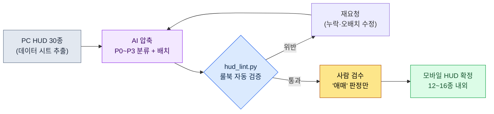

# 14.1 PC HUD 30종을 모바일 10종으로 — 제약을 룰북으로, 압축을 AI로

> 1차 독자: 모바일 우선 프로젝트의 UX·시스템 기획자 (중규모(10~50인) 팀)
> 1인/취미 독자용 축소 버전: §14.1.7 「혼자라면 이만큼만」

PC 빌드에서 잘 돌아가던 전투 HUD를 처음으로 모바일 해상도에 띄워 본 날의 기억이 있다. 화면의 절반이 게이지·아이콘·미니맵·퀘스트 트래커로 덮였고, 정작 캐릭터가 보이지 않았다. 요소 하나하나는 다 필요해 보였다. 문제는 "무엇을 뺄까"가 회의 때마다 처음부터 다시 싸움이 됐다는 점이다. 누군가는 미니맵을 지키고 싶어 했고, 누군가는 채팅을 지키고 싶어 했다. 근거가 "느낌"이었기 때문에 결론이 매번 달랐다.

이 장은 그 싸움을 끝내는 방법을 다룬다. 핵심은 두 가지다. 첫째, 모바일 제약을 "느낌"이 아니라 **검증 가능한 룰북**으로 바꾼다. 둘째, "PC 30종을 모바일 10종으로 줄이는" 지루하고 반복적인 압축 작업을 AI에게 시키고, 사람은 **룰북 위반을 잡는 검수**만 한다. 모바일 UX의 일반 지식은 이미 다른 책에 충분히 있으니, 이 장은 그 지식을 *AI 워크플로로 돌리는 자리*에만 집중한다.

---

## 14.1.1 모바일 제약은 '주의사항'이 아니라 '룰북'이다

모바일 제약을 표로 나열하는 책은 많다. 화면이 작고, 손가락이 굵고, 세션이 짧고, 배터리가 닳는다는 이야기다. 다 맞는 말이지만, 표로 외워 봐야 회의에서 "그래서 이 버튼은 되는 거냐"는 질문에 답이 안 나온다. 제약이 **숫자로 된 합격/불합격 기준**으로 바뀌어야 AI도 사람도 같은 선을 긋는다.

다행히 모바일 입력 제약의 상당수는 이미 플랫폼 회사가 공개 가이드라인으로 못 박아 두었다. 터치 44pt(HIG)·48dp(Material)·대비 4.5:1(WCAG)·간격 8dp 같은 공개표준은 §9.1 룰북을 따르고, 여기서는 이 장 lint가 직접 쓰는 **최소 터치 타깃 44pt(HIG)**만 인라인으로 둔다. 지어낼 필요가 없는 수치들이다. "버튼이 좀 작은 것 같다"가 아니라 "이 버튼은 38pt라 HIG 44pt 미달"이라고 말할 수 있어야, 사람이 빠지든 AI가 빠지든 같은 판정이 나온다.

여기에 한 줄을 더한다 — MMORPG 모바일은 가로 양손 그립이 표준이고, 누르는 요소는 양 하단 코너·소비/슬롯은 중앙 하단에 둔다(왜 가로가 표준인지, 세 영역 모델이 무엇인지는 §9.1에서 다룬다). 이 장의 모든 배치 판정은 그 가로 양손 그립을 전제한다.

플랫폼 기준은 PC와 나란히 두면 압축의 출발점이 분명해진다. PC는 정밀·대량(30~50종 감당), 모바일 가로는 양손 코너 한정이라 12~16종이 한계다(전체 비교표는 §9.1 룰북 참조 — 저자 추정, 미검증). 그래서 모바일 작업의 본질은 "디자인"이 아니라 **"PC 30~50종을 모바일 가로의 12~16종으로 우선순위 압축"**이다. 그리고 이 압축은 손으로 하면 지루한 데다 할 때마다 기준선이 흔들린다 — 같은 규칙을 지치지 않고 반복 적용하는 일이라, AI가 초안을 잡고 사람이 검수하는 분담에 정확히 들어맞는다.

---

## 14.1.2 [워크드 트랜스크립트] PC HUD 30종 → 모바일 우선순위 압축

실제로 어떻게 돌리는지 한 사이클을 끝까지 보여준다. 아래는 저자 프로젝트(모바일 우선 MMORPG, 이하 "프로젝트 A")의 전투 HUD 압축 세션을 충실히 재현한 것이다. 입력 프롬프트는 그대로 복사해 쓸 수 있고, 출력은 실제 세션을 재구성했다.

### 1단계 — 입력: PC HUD 명세를 그대로 던진다

먼저 PC HUD 요소 목록을 기계가 읽을 수 있는 표로 만든다. 이건 이미 데이터 시트에 있으니 새로 쓰는 게 아니라 추출만 하면 된다.

```yaml
# hud_pc_inventory.yaml — PC 빌드 현행 HUD (발췌, 30종 중 12종)
- id: hp_bar          # 체력바
  현재위치: 좌상단
  상시노출: true
  조작가능: false
- id: mp_bar          # 마나바
  현재위치: 좌상단
  상시노출: true
  조작가능: false
- id: skill_slots     # 스킬 12칸
  현재위치: 하단중앙
  상시노출: true
  조작가능: true
- id: minimap         # 미니맵
  현재위치: 우상단
  상시노출: true
  조작가능: true
- id: quest_tracker   # 퀘스트 추적
  현재위치: 우측
  상시노출: true
  조작가능: false
- id: chat            # 채팅창
  현재위치: 좌하단
  상시노출: true
  조작가능: true
# ... buff_bar, party_frame, target_frame, exp_bar, currency, mail_alert ...
```

### 2단계 — 프롬프트: 분류 형식과 한 줄 근거를 못 박는다

```
첨부한 hud_pc_inventory.yaml(PC 빌드 현행 HUD 30종)을 모바일 가로 그립 양손 조작
기준으로 우선순위 압축해줘. 각 요소를 P0(전투 중 상시 필수)~P3(제거 또는 상황 노출)로
분류하고, 상시 노출(P0~P1) 합계는 16종 넘지 말고. 조작 가능한 요소(조작가능:true)는
양손 엄지 닿는 코너(좌하단=이동, 우하단=스킬)에 배치 제안해. 분류마다 근거 한 줄씩
꼭 붙이고, 애매한 건 억지로 정하지 말고 따로 표시해서 사람한테 넘겨.
출력은 표(요소 | 분류 | 배치영역 | 근거 | 애매여부)만, 설명 빼고.
```

이 프롬프트에서 압축하라는 지시 자체는 한 줄뿐이고, 나머지 분량은 전부 출력을 가두는 울타리라는 점에 주목한다. AI에게 자유를 주면 일반 RPG 평균을 토해낸다. 그래서 **분류 기준(P0~P1 ≤ 16종)·출력 형식(표)·근거 의무, 그리고 "애매하면 사람에게 넘겨라"는 탈출구**를 미리 입력해 둔다. 압축의 품질은 이 네 울타리가 결정한다.

### 3단계 — Claude의 출력 (재구성, 발췌)

```
| 요소        | 분류 | 배치영역      | 근거                                   | 애매 |
|------------|------|--------------|----------------------------------------|------|
| hp_bar     | P0   | 상단 고정     | 사망 직결, 0.5초 단위 확인 필요          |      |
| skill_slots| P0   | 우하단(우엄지) | 조작 핵심, 우엄지 도달 코너 필수          |      |
| mp_bar     | P0   | 상단 고정     | 스킬 사용 가부 판단, 상시 필요           |      |
| target_frame| P0  | 상단중앙      | 대상 체력 확인, 전투 판단 핵심           |      |
| minimap    | P1   | 우상단 축소   | 방향 확인용, 전투 중엔 축소/반투명 가능   |      |
| buff_bar   | P1   | hp_bar 하단   | 버프 만료 확인, 아이콘 축소 가능         |      |
| quest_tracker| P2 | 메뉴 토글     | 전투 중 불필요, 평상시 토글 노출         |      |
| chat       | P2   | 좌하단 탭     | 전투 중 자동 숨김, 탭으로 펼침           | ★    |
| party_frame| P1   | 좌측 축소     | 파티 플레이 시 P0로 승격 (조건부)        | ★    |
| mail_alert | P3   | 컨텍스트       | 수신 시에만 잠깐 노출                   |      |
| exp_bar    | P3   | 화면 최하단 1px| 정보 가치 낮음, 얇은 선으로 충분         |      |
| currency   | P2   | 메뉴 안       | 전투 중 불필요                          |      |

상시 노출(P0+P1) 합계: 7종 (규칙 2 통과: ≤16)
애매 2건(chat, party_frame)은 사람 결정 필요:
- chat: 소셜 비중이 높은 게임이면 P1 승격 고려
- party_frame: 솔로/파티 컨텍스트에 따라 분류가 갈림
```

출력에서 가장 가치 있는 부분은 표가 아니라 **맨 아래 두 줄, "애매 2건"**이다. AI가 자기 한계를 신고하고 판단을 사람에게 넘긴 자리. 프롬프트에 탈출구를 열어 두면, AI는 억지로 답을 지어내는 대신 모르는 곳에 깃발을 꽂는다.

### 4단계 — 검증과 거부 (사람의 자리)

이 출력을 그대로 받으면 안 된다. 룰북으로 한 번 친다. 실제로 이 세션에서 한 건이 걸렸다.

`party_frame`을 AI는 "좌측 축소"로 배치했는데, 가로 그립에서 화면 좌측 중앙은 양손 엄지 어느 쪽도 안 닿는 영역이다(왼손은 좌하단 이동, 오른손은 우하단 스킬에 묶여 있다). 그런데 파티 프레임은 클릭(파티원 타깃팅)이 필요한 **조작 요소**다. 규칙 3("조작 가능 요소는 양손 엄지 쉬움 코너") 위반이다. AI는 `조작가능` 플래그를 party_frame에서 놓쳤다. 이건 입력 yaml에서 party_frame의 `조작가능`이 비어 있던 탓 — 즉 사람 쪽 데이터 결함이었다.

그래서 재요청한다.

```
party_frame은 파티원 타깃팅 클릭이 필요한 조작 요소야(아까 입력에서 빠졌었음).
조작 요소는 엄지 닿는 코너에 둬야 하는 규칙으로 배치를 다시 잡아줘. 솔로일 때랑
파티일 때를 나눠서 제안하고.
```

이 한 번의 왕복으로 끝난다. AI는 솔로 시 "숨김", 파티 시 "하단 우측(쉬움) 승격"으로 다시 답했고, 그 결정은 룰북을 통과했다. **압축 30종을 사람이 처음부터 하면 반나절, AI 초안 + 룰북 검수 + 1회 왕복이면 한 시간 안쪽**이다(저자 추정 — 정확한 절약 시간은 팀·요소 수에 따라 달라지므로 절대값보다 "처음부터 손으로"와 "초안+검수"의 구조 차이로 읽는 게 맞다).

---

## 14.1.3 손가락 영역 — 양 코너와 중앙 하단

위 세션에서 반복된 "손가락 영역"을 그림으로 한 번 고정해 두면, 이후 모든 배치 판정이 빨라진다. 가로로 쥔 폰에서 손가락이 닿고 시선이 자주 가는 하단은 세 자리로 갈린다. 왼손 엄지는 좌하단(이동), 오른손 엄지는 우하단(스킬) 코너에 닿고, **두 엄지 사이 중앙 하단**은 소비 아이템·자동 아이템·스킬 슬롯을 두는 자리다. 트위치 조작은 아니지만, 내가 쓰거나 자동으로 소비되는 것을 한눈에 보고 가끔 누르는 중요한 글랜스 영역이다. P0 조작·슬롯은 초록, 손가락이 닿지 않고 읽기만 하는 상단·중앙 위쪽은 빨강이다.

<svg viewBox="0 0 660 340" xmlns="http://www.w3.org/2000/svg" role="img" aria-label="모바일 가로 화면 양손 엄지 도달 영역도">
  <!-- 폰 외곽 (가로) -->
  <rect x="20" y="30" width="620" height="280" rx="30" ry="30" fill="#0f1117" stroke="#3a3f4b" stroke-width="3"/>
  <rect x="34" y="44" width="592" height="252" rx="14" ry="14" fill="#11151d"/>
  <!-- 상단 상태 band (빨강 — 어려움) -->
  <rect x="34" y="44" width="592" height="62" fill="#7f1d1d" opacity="0.42"/>
  <text x="330" y="80" fill="#fecaca" font-family="sans-serif" font-size="13" text-anchor="middle">어려움 — 상단·중앙 (상태 표시 전용: HP · MP · 타깃, 읽기만)</text>
  <!-- 중앙 게임 화면 -->
  <text x="330" y="205" fill="#5b6675" font-family="sans-serif" font-size="14" text-anchor="middle">게임 화면 (전투가 벌어지는 자리)</text>
  <!-- 좌하단 엄지 코너 (초록) -->
  <path d="M34 296 L34 146 A150 150 0 0 1 184 296 Z" fill="#14532d" opacity="0.7"/>
  <path d="M34 146 A150 150 0 0 1 184 296" fill="none" stroke="#22c55e" stroke-width="2.5" stroke-dasharray="5 4"/>
  <text x="92" y="250" fill="#bbf7d0" font-family="sans-serif" font-size="13" text-anchor="middle" font-weight="bold">좌엄지</text>
  <text x="92" y="270" fill="#bbf7d0" font-family="sans-serif" font-size="12" text-anchor="middle">이동</text>
  <!-- 우하단 엄지 코너 (초록) -->
  <path d="M626 296 L626 146 A150 150 0 0 0 476 296 Z" fill="#14532d" opacity="0.7"/>
  <path d="M626 146 A150 150 0 0 0 476 296" fill="none" stroke="#22c55e" stroke-width="2.5" stroke-dasharray="5 4"/>
  <text x="568" y="250" fill="#bbf7d0" font-family="sans-serif" font-size="13" text-anchor="middle" font-weight="bold">우엄지</text>
  <text x="568" y="270" fill="#bbf7d0" font-family="sans-serif" font-size="12" text-anchor="middle">스킬</text>
  <!-- 중앙 하단 슬롯대 (앰버 — 소비·퀵슬롯·자동 아이템) -->
  <text x="330" y="238" fill="#b45309" font-family="sans-serif" font-size="12" text-anchor="middle" font-weight="bold">중앙 하단 — 소비·퀵슬롯·자동</text>
  <rect x="256" y="248" width="148" height="44" rx="8" fill="#f59e0b" opacity="0.45" stroke="#f59e0b" stroke-width="2" stroke-dasharray="5 4"/>
  <circle cx="295" cy="270" r="12" fill="#fbbf24"/><text x="295" y="274" fill="#000" font-size="8" text-anchor="middle">포션</text>
  <circle cx="330" cy="270" r="12" fill="#fbbf24"/><text x="330" y="274" fill="#000" font-size="8" text-anchor="middle">자동</text>
  <circle cx="365" cy="270" r="12" fill="#fbbf24"/><text x="365" y="274" fill="#000" font-size="8" text-anchor="middle">슬롯</text>
  <!-- HUD 점 예시 -->
  <circle cx="70" cy="72" r="9" fill="#ef4444"/><text x="70" y="76" fill="#fff" font-size="9" text-anchor="middle">HP</text>
  <circle cx="125" cy="72" r="9" fill="#ef4444"/><text x="125" y="76" fill="#fff" font-size="9" text-anchor="middle">MP</text>
  <circle cx="330" cy="60" r="9" fill="#ef4444"/><text x="330" y="64" fill="#fff" font-size="8" text-anchor="middle">타깃</text>
  <circle cx="588" cy="72" r="10" fill="#ef4444"/><text x="588" y="76" fill="#fff" font-size="8" text-anchor="middle">맵</text>
  <circle cx="92" cy="232" r="17" fill="#22c55e"/><text x="92" y="236" fill="#000" font-size="9" text-anchor="middle">이동</text>
  <circle cx="556" cy="240" r="14" fill="#22c55e"/><text x="556" y="244" fill="#000" font-size="9" text-anchor="middle">스킬</text>
  <circle cx="592" cy="210" r="13" fill="#22c55e"/><text x="592" y="214" fill="#000" font-size="9" text-anchor="middle">스킬</text>
  <circle cx="582" cy="272" r="12" fill="#22c55e"/><text x="582" y="276" fill="#000" font-size="8" text-anchor="middle">스킬</text>
</svg>

규칙이 단순하다. **읽기만 하는 정보(HP/MP/타깃 체력)는 빨강(상단·중앙 위쪽)에 둬도 된다. 손가락이 닿을 일이 없으니까.** 반대로 **누르는 요소는 손가락 영역(초록·앰버) 안**이어야 한다 — 이동·스킬은 양쪽 하단 코너에, 소비·자동 아이템과 퀵슬롯·스킬 슬롯은 중앙 하단에 둔다. 셋 다 손가락이 닿고 시선이 자주 가는 자리다. §14.1.2에서 party_frame이 걸린 이유가 이 그림 한 장으로 설명된다 — 누르는 요소를 손가락 영역이 아닌 좌측 중앙(읽기 영역)에 뒀기 때문이다.

---

## 14.1.4 룰북을 코드로 — 배치안 자동 lint

압축안이 룰북을 지켰는지 매번 눈으로 보면 또 놓친다. §14.1.1의 다섯 룰 중 좌표·크기로 판정 가능한 것은 코드가 검수하게 만든다. 사람은 코드가 못 잡는 "애매" 판정에만 시간을 쓴다.

```python
# hud_lint.py — 모바일 HUD 배치안 검증 (골격)
# 입력: AI가 제안한 배치안 (요소별 좌표·크기·조작가능·분류)
# 출력: 룰북 위반 목록

MIN_TAP_PT = 44       # Apple HIG 최소 터치 타깃 (pt)

def in_action_zone(e, w, h):
    """가로 그립에서 손가락이 닿는 영역: 좌·우 하단 코너 + 중앙 하단 슬롯대."""
    x, y = e["x"] / w, e["y"] / h
    bottom = y > 0.55
    left_corner  = bottom and x < 0.30                 # 왼손 엄지 = 이동
    right_corner = bottom and x > 0.70                 # 오른손 엄지 = 스킬
    center_slot  = (y > 0.72) and (0.35 <= x <= 0.65)  # 중앙 하단 = 소비·퀵슬롯
    return left_corner or right_corner or center_slot

def lint(elements, screen_w, screen_h):
    issues = []
    for e in elements:
        # 규칙 A: 조작/슬롯 요소는 손가락 영역(양 코너 + 중앙 하단)에 있어야
        if e["조작가능"] and not in_action_zone(e, screen_w, screen_h):
            issues.append(f"[A] {e['id']}: 조작·슬롯 요소가 손가락 영역 밖에 배치됨 "
                          f"(x={e['x']}, y={e['y']})")
        # 규칙 B: 터치 타깃 최소 크기 (HIG 44pt)
        if e["조작가능"] and min(e["w"], e["h"]) < MIN_TAP_PT:
            issues.append(f"[B] {e['id']}: 터치 타깃 {min(e['w'], e['h'])}pt "
                          f"< {MIN_TAP_PT}pt (HIG 미달)")
    # 규칙 C: P0/P1 상시 노출 총량
    onscreen = [e for e in elements if e["분류"] in ("P0", "P1")]
    if len(onscreen) > 16:
        issues.append(f"[C] 상시 노출 {len(onscreen)}종 > 16종 (과밀)")
    return issues
```

이 30줄이 있으면 회의에서 "이 버튼 작지 않아요?"가 토론거리가 아니라 판정 대상이 된다. `[B] skill_slots: 터치 타깃 40pt < 44pt (HIG 미달)`이라고 코드가 출력하면, 의견을 모을 필요가 없다. 고치면 된다. 이것이 9.1(HUD)에서 다룬 lint 게이트를 모바일 차원으로 옮긴 것이다 — 결정론으로 잡을 수 있는 건 코드가, 비결정·판단이 필요한 건 사람이 맡는 분담이 모바일에서도 그대로 성립한다.

전체 사이클을 한눈에 보면 이렇다.



사람의 손이 닿는 곳은 두 군데뿐이다. 입력 데이터를 깨끗이 넣는 자리(맨 앞)와, 룰북이 못 잡는 애매한 판단을 내리는 자리(맨 뒤). 그 사이의 지루한 30종 압축은 AI와 lint가 돌린다.

---

## 14.1.5 이 장 수치의 출처

이 장에 나온 수치의 출처만 짧게 기록해 둔다(책 전체의 수치 원칙은 서문 「한 가지 약속」 참조). 터치 44pt(HIG)·48dp(Material)·대비 4.5:1(WCAG)은 플랫폼 공식 표준이고, "상시 정보 8~12종"과 "압축 반나절→한 시간"은 저자의 경험 기반 추정(미검증)이라 절대값보다 *방향*으로 읽는다. 모바일 HUD에서 실제로 측정 가능한 지표는 룰북 위반 건수(lint 0), 상시 노출 요소 수(목표 ≤12), 오탭률(telemetry)이며, 리텐션 같은 결과 지표는 HUD 하나로 좌우되지 않으니 인과를 단정하지 않는다.

---

## 14.1.6 흔한 실패

| 패턴 | 왜 실패하나 | 처방 |
|---|---|---|
| PC HUD를 그대로 축소 이식 | 30종이 6인치를 덮어 게임이 안 보임 | §14.1.2 압축 세션 |
| "AI야 모바일 UI 만들어 줘" 통째 위임 | 룰북 없이는 일반 RPG 평균이 나옴 | 룰북(§14.1.1)을 프롬프트에 먼저 입력하기 |
| 압축안을 눈으로만 검수 | 터치 크기·엄지존 위반을 매번 놓침 | `hud_lint.py`로 자동 검증 |
| 근거 없이 "이건 빼자" 회의 | 결론이 매번 바뀜 | P0~P3 + 한 줄 근거 강제 |

---

## 14.1.7 따라하기 — 오늘 할 수 있는 한 단계

> **혼자라면 이만큼만**: 데이터 시트가 없어도 됩니다. 본인 게임(또는 좋아하는 게임)의 PC HUD 요소를 손으로 10~15개만 적어 yaml로 만들고, §14.1.2의 프롬프트를 그대로 붙여 넣어 한 번 돌려 보세요. AI의 분류에 동의 안 되는 항목 1개를 찾아 "근거를 다시 대라"고 반박해 보면, 압축이 어떤 판단들의 묶음인지 몸으로 들어옵니다.

팀이라면 다음 한 단계로 시작하세요. 현행 HUD 요소 목록을 `hud_pc_inventory.yaml`로 추출하고(이미 데이터 시트에 있습니다), §14.1.4의 `hud_lint.py` 룰북 세 줄(터치 크기·엄지존·총량)을 먼저 코드로 고정해 둡니다. 룰북이 있으면 AI 압축안이든 사람 시안이든 같은 선으로 잴 수 있습니다.

---

### 이 챕터의 핵심 메시지
- 모바일 제약은 외울 표가 아니라 lint 가능한 룰북으로 바꾼다 (HIG 44pt·WCAG 4.5:1).
- 30종→10종 압축은 AI에게, 룰북 위반 검수는 코드에게, 애매한 판단만 사람에게.
- 누르는 요소는 양쪽 하단 코너 안, 읽는 정보는 상단 — 이 한 줄이 배치를 결정한다.

### 다음 챕터 미리보기
- 14.2 플랫폼별 차이(iOS/Android/PC)를 AI로 분기 관리하기
